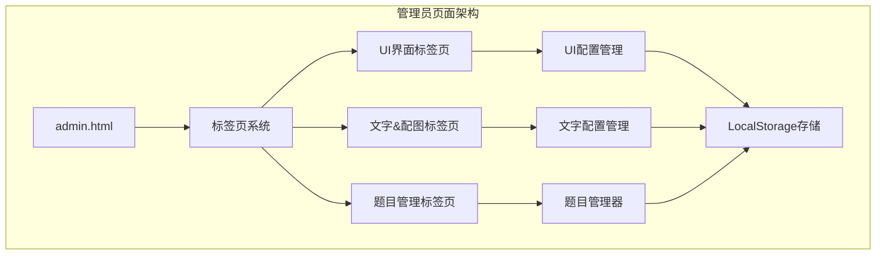
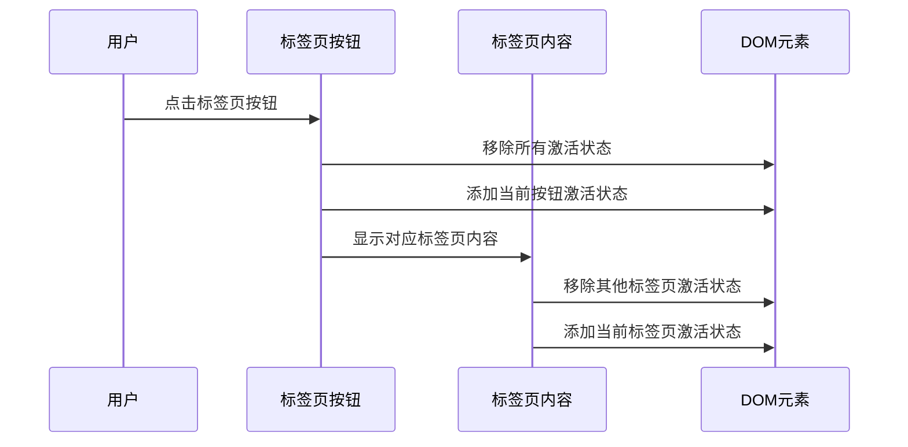
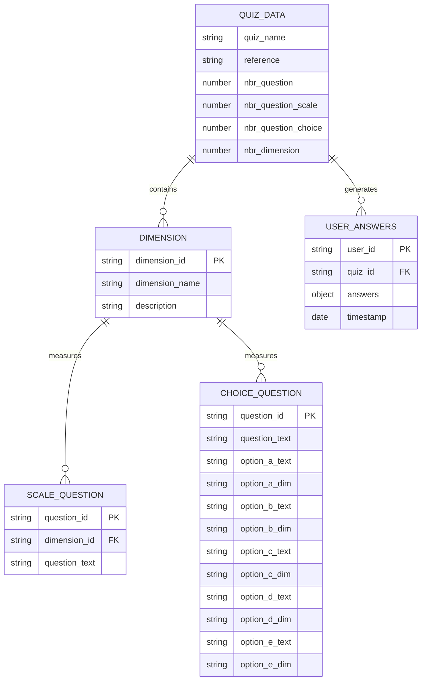
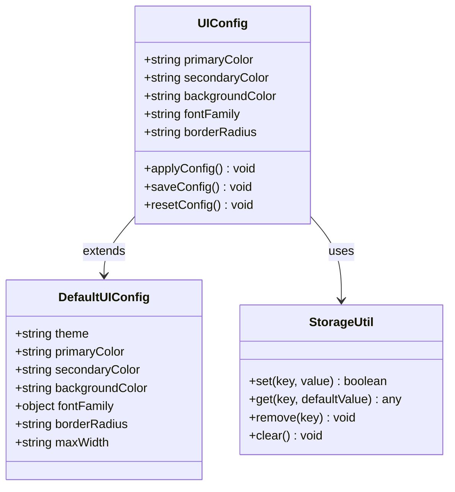
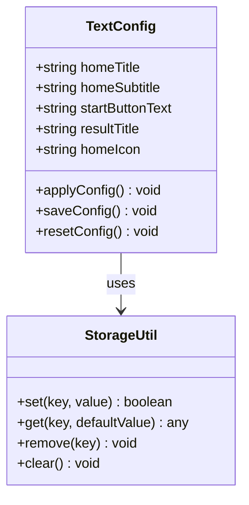
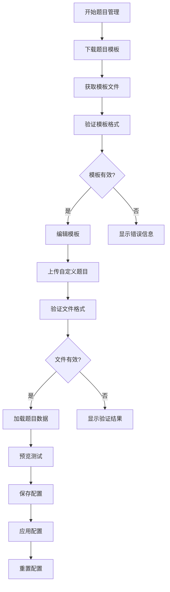
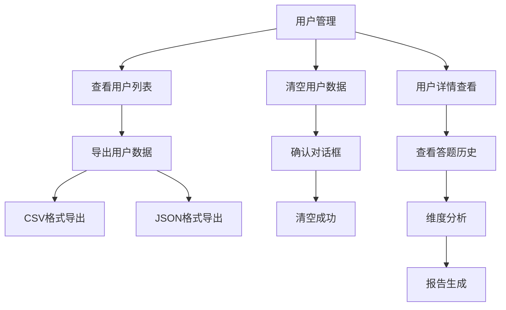
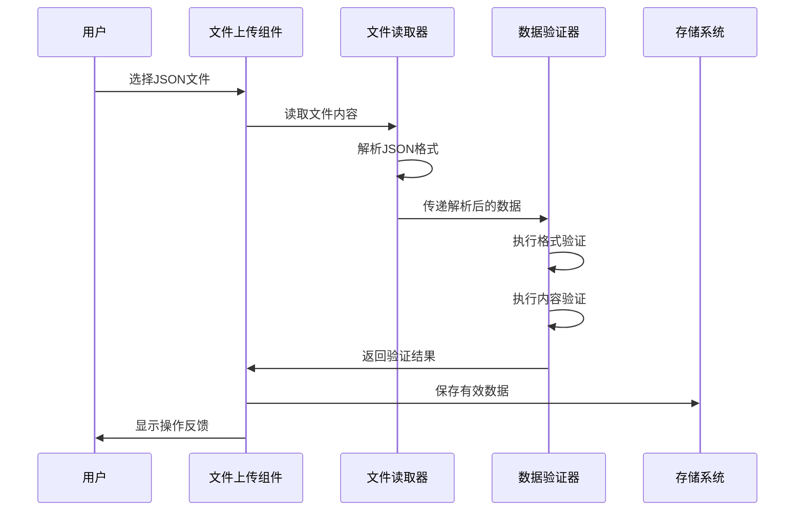
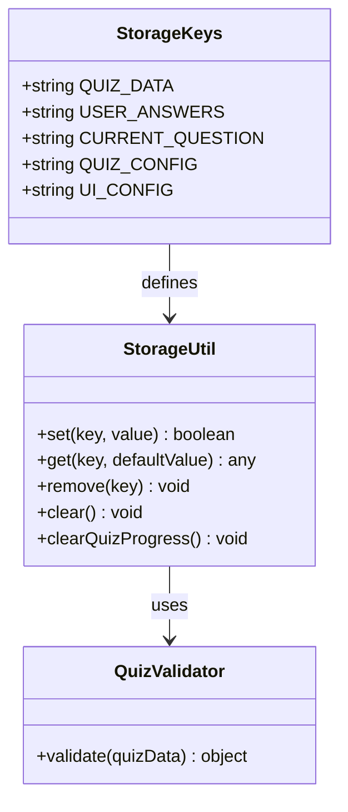
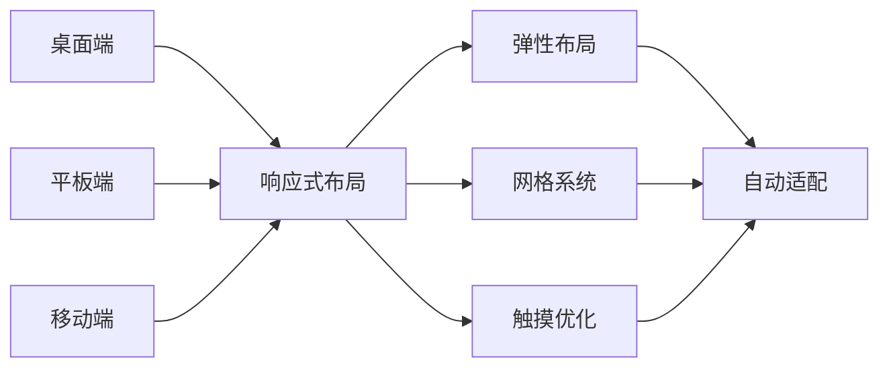

# 管理员页面技术文档

<cite>
**本文档引用的文件**
- [admin.html](file://admin.html)
- [index.html](file://index.html)
- [quiz.html](file://quiz.html)
- [result.html](file://result.html)
- [catalog.html](file://catalog.html)
- [css/style.css](file://css/style.css)
- [js/utils.js](file://js/utils.js)
- [data/default-quiz.json](file://data/default-quiz.json)
- [data/template.json](file://data/template.json)
</cite>

## 更新摘要
**变更内容**
- 新增管理后台功能文档：UI界面配置、文字&配图配置、题目管理功能
- 完善了UI配置系统的颜色选择器和字体配置功能
- 增强了文字配置的实时预览和应用机制
- 优化了题目管理的验证结果显示和错误处理
- 改进了文件上传组件的交互体验
- 完善了响应式设计的移动端适配

## 目录
1. [项目概述](#项目概述)
2. [管理员页面架构](#管理员页面架构)
3. [核心组件分析](#核心组件分析)
4. [数据管理系统](#数据管理系统)
5. [UI配置系统](#ui配置系统)
6. [文字配置系统](#文字配置系统)
7. [题目管理功能](#题目管理功能)
8. [用户管理功能](#用户管理功能)
9. [文件上传与验证](#文件上传与验证)
10. [存储机制](#存储机制)
11. [响应式设计](#响应式设计)
12. [故障排除指南](#故障排除指南)
13. [总结](#总结)

## 项目概述

心理测试管理系统是一个基于Web的心理测评平台，包含完整的测试流程：首页展示、测试进行、结果分析和管理后台。管理员页面作为系统的控制中心，提供了全面的内容管理和配置功能。

该项目采用纯前端技术栈，无需服务器端支持，所有数据存储在浏览器本地存储中，确保了部署的简便性和数据的安全性。

## 管理员页面架构

管理员页面采用了模块化的架构设计，将功能划分为三个主要标签页：UI界面配置、文字&配图配置和题目管理。

**图表来源**
- [admin.html:28-32](file://admin.html#L28-L32)

### 页面结构设计

管理员页面采用现代化的卡片式布局，每个功能模块都封装在独立的卡片容器中，提供了清晰的视觉层次和良好的用户体验。

**章节来源**
- [admin.html:10-171](file://admin.html#L10-L171)

## 核心组件分析

### 标签页系统

管理员页面实现了动态标签页切换功能，用户可以在不同的配置模块之间无缝切换。

**图表来源**
- [admin.html:177-186](file://admin.html#L177-L186)

### 数据加载与初始化

页面加载时会自动执行数据初始化流程，确保所有配置项都正确加载。

**章节来源**
- [admin.html:404-407](file://admin.html#L404-L407)

## 数据管理系统

### 数据结构设计

系统采用标准化的JSON数据结构来存储测试内容，确保数据的完整性和可移植性。

**图表来源**
- [data/default-quiz.json:1-235](file://data/default-quiz.json#L1-L235)

### 数据验证机制

系统内置了完整的数据验证功能，确保上传的题目文件符合预期格式。

**章节来源**
- [js/utils.js:55-126](file://js/utils.js#L55-L126)

## UI配置系统

### 配置参数管理

管理员可以通过UI配置系统自定义整个应用的主题外观。

**图表来源**
- [js/utils.js:207-244](file://js/utils.js#L207-L244)

### 实时预览功能

UI配置支持实时预览功能，管理员可以即时看到配置更改的效果。

**章节来源**
- [admin.html:294-335](file://admin.html#L294-L335)

## 文字配置系统

### 配置参数管理

管理员可以通过文字配置系统自定义首页标题、副标题、按钮文字和图标等文本内容。

**图表来源**
- [admin.html:82-120](file://admin.html#L82-L120)

### 配置功能完善

系统提供了完整的文字配置功能，包括：
- 首页标题和副标题的自定义
- 开始按钮文字的个性化设置
- 结果页标题的定制
- 首页图标的emoji支持

**章节来源**
- [admin.html:86-118](file://admin.html#L86-L118)

## 题目管理功能

### 题目模板系统

系统提供了完整的题目模板下载功能，帮助管理员快速创建新的测试内容。

**图表来源**
- [admin.html:243-401](file://admin.html#L243-L401)

### 题目概览显示

管理员可以实时查看当前测试的详细信息，包括题目数量、维度分布等关键指标。

**章节来源**
- [admin.html:205-241](file://admin.html#L205-L241)

## 用户管理功能

### 用户数据管理

系统提供了用户数据的集中管理功能，管理员可以查看和管理所有用户的测试记录。

**图表来源**
- [admin.html:122-163](file://admin.html#L122-L163)

### 用户数据存储

系统采用LocalStorage来存储用户答题数据，确保数据的持久化和安全性。

**章节来源**
- [js/utils.js:6-50](file://js/utils.js#L6-L50)

## 文件上传与验证

### 文件处理流程

系统实现了完整的文件上传和验证流程，确保只有符合规范的文件才能被系统识别。

**图表来源**
- [admin.html:252-291](file://admin.html#L252-L291)

### 错误处理机制

系统提供了完善的错误处理机制，能够准确识别并报告各种类型的文件错误。

**章节来源**
- [admin.html:283-290](file://admin.html#L283-L290)

## 存储机制

### LocalStorage管理

系统采用LocalStorage作为主要的数据存储方案，提供了简单而可靠的数据持久化能力。

**图表来源**
- [js/utils.js:6-50](file://js/utils.js#L6-L50)

### 数据备份与恢复

系统支持数据的备份和恢复功能，确保管理员的工作成果不会丢失。

**章节来源**
- [admin.html:378-401](file://admin.html#L378-L401)

## 响应式设计

### 移动端适配

管理员页面针对不同设备进行了优化，确保在移动设备上的良好体验。

**图表来源**
- [css/style.css:619-683](file://css/style.css#L619-L683)

### 视觉一致性

系统保持了与其他页面一致的设计风格，确保用户在不同页面间的导航体验连贯统一。

**章节来源**
- [css/style.css:427-466](file://css/style.css#L427-L466)

## 故障排除指南

### 常见问题解决

管理员在使用过程中可能遇到的各种问题及解决方案：

1. **文件上传失败**
   - 检查文件格式是否为JSON
   - 确认文件编码为UTF-8
   - 验证文件大小限制

2. **配置不生效**
   - 确认已点击"应用"按钮
   - 检查浏览器是否禁用LocalStorage
   - 刷新页面查看最新配置

3. **数据丢失**
   - 检查浏览器隐私设置
   - 确认用户数据格式正确
   - 使用重置功能恢复默认设置

4. **用户数据异常**
   - 检查LocalStorage容量限制
   - 确认用户数据格式正确
   - 使用导出功能备份用户数据

### 性能优化建议

- 合理控制题目数量，避免过多影响加载性能
- 定期清理不需要的测试数据
- 使用合适的图片尺寸，避免过大文件影响加载速度
- 定期导出用户数据进行备份

## 总结

管理员页面作为心理测试管理系统的核心控制中心，提供了完整的功能覆盖：

1. **完整的配置管理**：支持UI外观、文字内容和题目数据的全方位管理
2. **强大的数据验证**：内置严格的格式和内容验证机制
3. **友好的用户界面**：直观的操作流程和实时预览功能
4. **可靠的存储机制**：基于LocalStorage的稳定数据持久化
5. **响应式设计**：适配多种设备的现代化界面
6. **用户数据管理**：提供用户答题数据的查看、导出和管理功能

该系统采用模块化设计，具有良好的扩展性和维护性，为心理测试内容的创建和管理提供了高效的技术支撑。新增的用户管理功能进一步增强了系统的实用性，为管理员提供了更好的数据洞察和管理能力。