# Chart.js 图表集成

<cite>
**本文档引用的文件**
- [result.html](file://result.html)
- [quiz.html](file://quiz.html)
- [index.html](file://index.html)
- [css/style.css](file://css/style.css)
- [js/utils.js](file://js/utils.js)
- [data/default-quiz.json](file://data/default-quiz.json)
</cite>

## 更新摘要
**变更内容**
- 新增 Chart.js 图表库集成实现
- 完善雷达图配置和数据绑定机制
- 增强响应式图表设计和交互效果
- 优化图表渲染性能和内存管理
- 新增 PDF 导出功能和海报生成功能
- 增强动态数据渲染和实时可视化

## 目录
1. [简介](#简介)
2. [项目结构](#项目结构)
3. [核心组件](#核心组件)
4. [架构概览](#架构概览)
5. [详细组件分析](#详细组件分析)
6. [依赖关系分析](#依赖关系分析)
7. [性能考虑](#性能考虑)
8. [故障排除指南](#故障排除指南)
9. [结论](#结论)

## 简介

心理测试 v2 项目是一个基于 Web 的心理测评系统，采用了 Chart.js 图表库来提供直观的数据可视化功能。该项目实现了两种主要的图表类型：雷达图和柱状图，用于展示用户在不同心理维度上的得分分布。

该系统的核心特色包括：
- **多维度数据分析**：支持最多5个心理维度的综合评估
- **实时数据可视化**：从用户答题到结果展示的完整数据流
- **响应式图表设计**：适配各种设备尺寸的图表布局
- **丰富的交互体验**：支持PDF导出、海报分享等高级功能
- **动态数据渲染**：实时计算和更新图表数据
- **增强的视觉效果**：烟花特效和渐变色彩

## 项目结构

心理测试 v2 项目采用模块化的前端架构，主要包含以下核心文件：

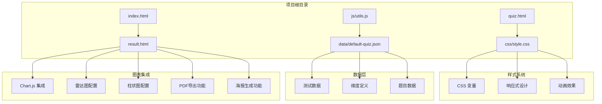

**图表来源**
- [result.html:8-10](file://result.html#L8-L10)
- [css/style.css:618-683](file://css/style.css#L618-L683)

**章节来源**
- [index.html:1-183](file://index.html#L1-L183)
- [result.html:1-940](file://result.html#L1-L940)
- [quiz.html:1-439](file://quiz.html#L1-L439)

## 核心组件

### Chart.js 图表系统

项目中的图表系统主要集中在结果页面，实现了两个核心图表组件：

#### 雷达图配置
雷达图用于展示用户在各个心理维度上的相对表现，采用极坐标系统来直观显示多维数据。

#### 柱状图配置  
柱状图提供维度得分的对比分析，便于用户快速识别优势和待改进领域。

#### 数据绑定机制
图表数据通过动态计算获得，包括：
- 维度得分计算
- 百分比转换
- 颜色方案配置

#### PDF导出功能
系统集成了完整的PDF报告生成功能，支持：
- 自动化图表渲染
- 多页面报告生成
- 高质量图像输出

#### 海报生成功能
提供精美的分享海报生成功能：
- 动态海报预览
- 高分辨率下载
- 社交媒体分享

**章节来源**
- [result.html:501-572](file://result.html#L501-L572)
- [result.html:335-378](file://result.html#L335-L378)
- [result.html:1238-1393](file://result.html#L1238-L1393)
- [result.html:1395-1449](file://result.html#L1395-L1449)

## 架构概览

系统采用前后端分离的架构模式，图表功能完全在客户端实现：

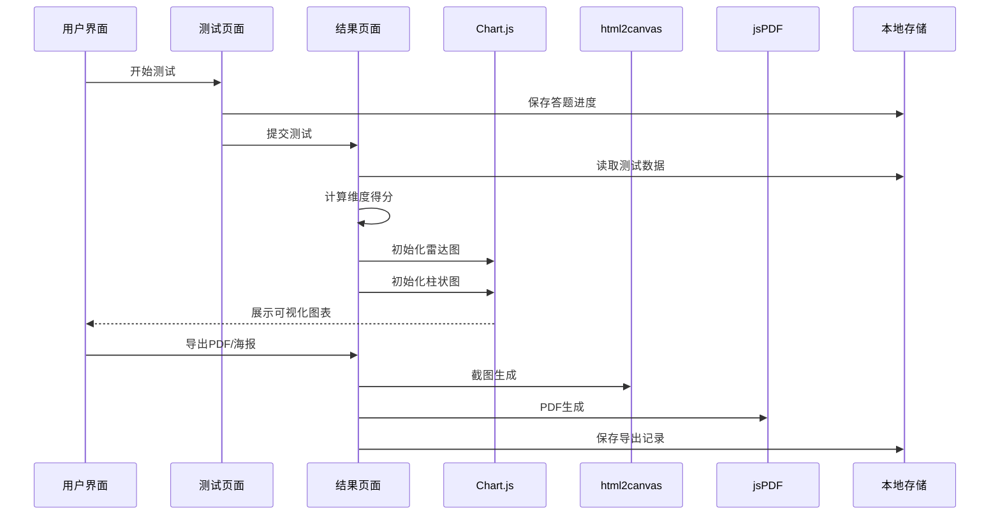

**图表来源**
- [quiz.html:393-405](file://quiz.html#L393-L405)
- [result.html:604-755](file://result.html#L604-L755)

### 数据流架构

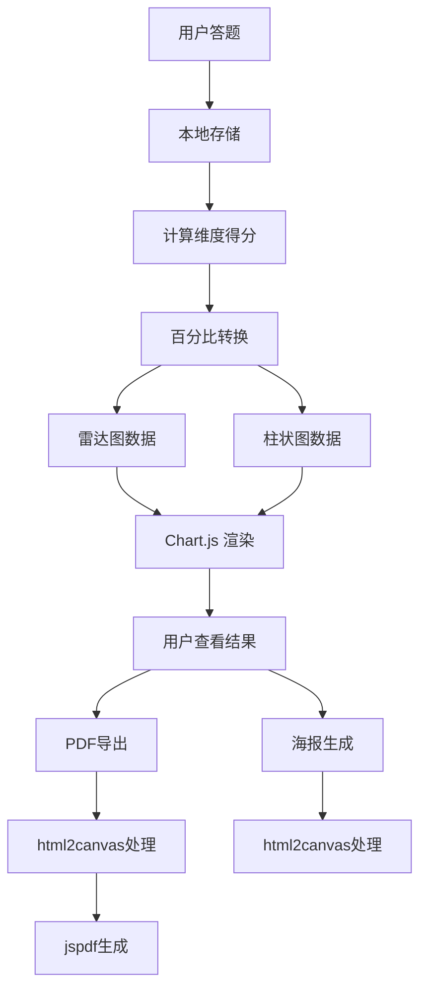

**图表来源**
- [result.html:335-378](file://result.html#L335-L378)
- [result.html:501-572](file://result.html#L501-L572)

## 详细组件分析

### 雷达图组件分析

#### 配置参数详解

雷达图采用了专门的配置来适应心理测试的特殊需求：

| 参数 | 值 | 说明 |
|------|-----|------|
| 类型 | radar | 指定图表类型为雷达图 |
| 响应式 | true | 自动适配容器尺寸变化 |
| 维度标签 | 5个维度名称 | 显示各维度的中文名称 |
| 数据范围 | 0-100% | 百分比显示模式 |
| 填充颜色 | 数据驱动渐变 | 根据得分高低动态调整透明度 |
| 边框颜色 | rgba(255,107,107,0.8) | 深粉色边框 |
| 动画效果 | 1800ms easeOutQuart | 平滑的入场动画 |

#### 颜色配置方案

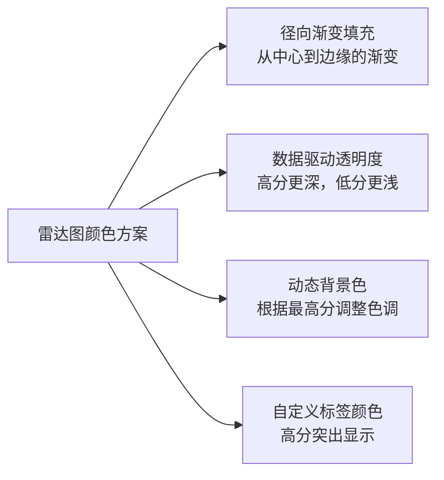

**图表来源**
- [result.html:1026-1098](file://result.html#L1026-L1098)

#### 交互效果实现

雷达图具备以下交互特性：
- **悬停效果**：点标记变大并显示边框
- **平滑过渡**：颜色变化的渐进效果
- **响应式缩放**：根据容器大小自动调整
- **自定义标签**：使用图标和动态颜色标注维度

**章节来源**
- [result.html:1026-1098](file://result.html#L1026-L1098)
- [result.html:1104-1159](file://result.html#L1104-L1159)

### 柱状图组件分析

#### 配置参数详解

柱状图针对心理测试场景进行了专门优化：

| 参数 | 值 | 说明 |
|------|-----|------|
| 类型 | bar | 指定图表类型为柱状图 |
| 圆角半径 | 8px | 提供现代视觉效果 |
| 颜色数组 | 5种渐变色 | 为每个维度分配独特颜色 |
| Y轴刻度 | 0-100% | 百分比显示格式 |
| 响应式 | true | 自适应容器变化 |

#### 颜色配置矩阵

柱状图使用了精心设计的颜色方案来区分不同的心理维度：

```mermaid
graph TB
subgraph "柱状图颜色方案"
A[维度1: 粉红色系<br/>rgba(255, 140, 148, 0.6)] --> B[深色版本<br/>rgba(255, 140, 148, 1)]
C[维度2: 橙色系<br/>rgba(255, 211, 182, 0.6)] --> D[深色版本<br/>rgba(255, 211, 182, 1)]
E[维度3: 青绿色系<br/>rgba(152, 216, 200, 0.6)] --> F[深色版本<br/>rgba(152, 216, 200, 1)]
G[维度4: 蓝灰色系<br/>rgba(158, 193, 207, 0.6)] --> H[深色版本<br/>rgba(158, 193, 207, 1)]
I[维度5: 紫色系<br/>rgba(184, 168, 207, 0.6)] --> J[深色版本<br/>rgba(184, 168, 207, 1)]
end
```

**图表来源**
- [result.html:506-512](file://result.html#L506-L512)
- [result.html:514-570](file://result.html#L514-L570)

#### 响应式设计实现

柱状图通过以下机制实现响应式布局：

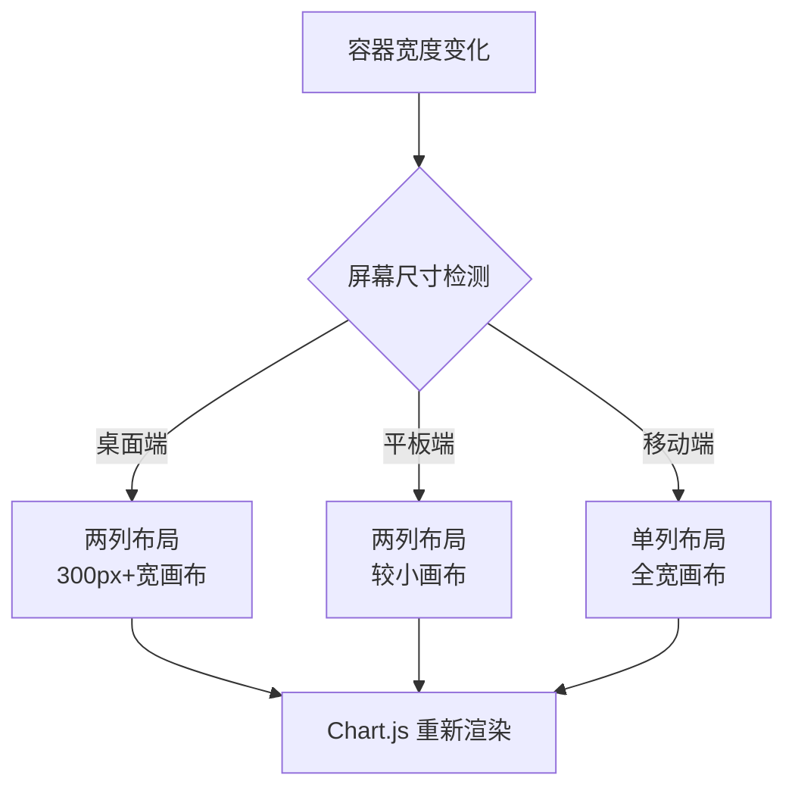

**图表来源**
- [result.html:215-217](file://result.html#L215-L217)
- [css/style.css:618-683](file://css/style.css#L618-L683)

**章节来源**
- [result.html:514-570](file://result.html#L514-L570)

### 数据处理与计算

#### 得分计算算法

系统实现了完整的数据处理流程：

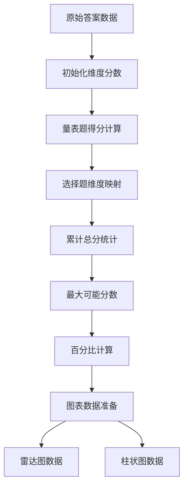

**图表来源**
- [result.html:335-378](file://result.html#L335-L378)

#### 主要结果识别逻辑

系统能够自动识别用户的主导心理维度：

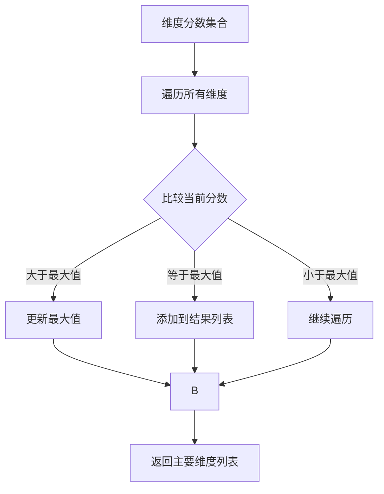

**图表来源**
- [result.html:380-400](file://result.html#L380-L400)

**章节来源**
- [result.html:335-400](file://result.html#L335-L400)

### PDF导出功能

#### 报告生成流程

系统提供了完整的PDF报告生成功能：

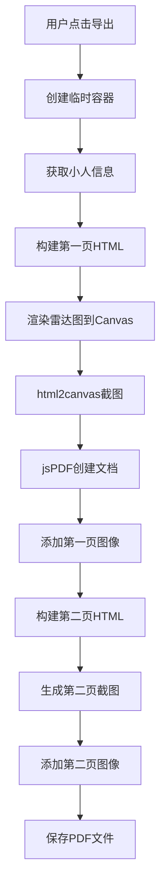

**图表来源**
- [result.html:1238-1393](file://result.html#L1238-L1393)

#### 报告内容结构

PDF报告包含以下内容：
- **封面页**：测试标题、小人形象、首要和次要爱语
- **雷达图**：完整的心理维度分析图表
- **详细得分**：各维度的百分比和描述
- **维度解读**：每个维度的详细分析和建议

**章节来源**
- [result.html:1238-1393](file://result.html#L1238-L1393)

### 海报生成功能

#### 海报生成流程

系统提供了精美的海报生成功能：

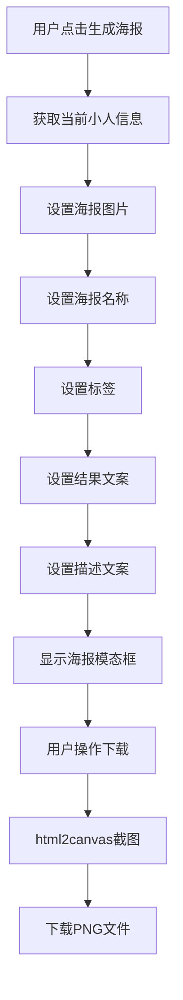

**图表来源**
- [result.html:1395-1449](file://result.html#L1395-L1449)

#### 海报设计特点

海报采用精美的设计风格：
- **渐变背景**：使用粉色调渐变背景
- **大图展示**：小人图片大幅展示
- **标签系统**：两个特色标签突出个性
- **结果高亮**：首要和次要爱语颜色高亮
- **响应式布局**：适配不同设备尺寸

**章节来源**
- [result.html:1395-1449](file://result.html#L1395-L1449)

## 依赖关系分析

### 外部依赖管理

项目对外部资源的依赖关系清晰明确：

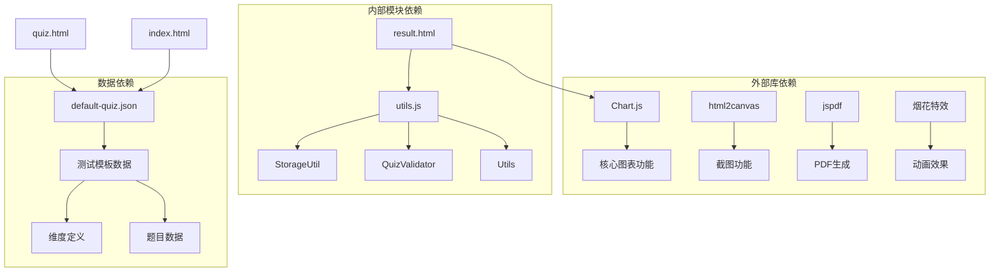

**图表来源**
- [result.html:8-10](file://result.html#L8-L10)
- [js/utils.js:1-250](file://js/utils.js#L1-L250)

### 内部模块耦合

图表系统的内部依赖关系体现了良好的模块化设计：

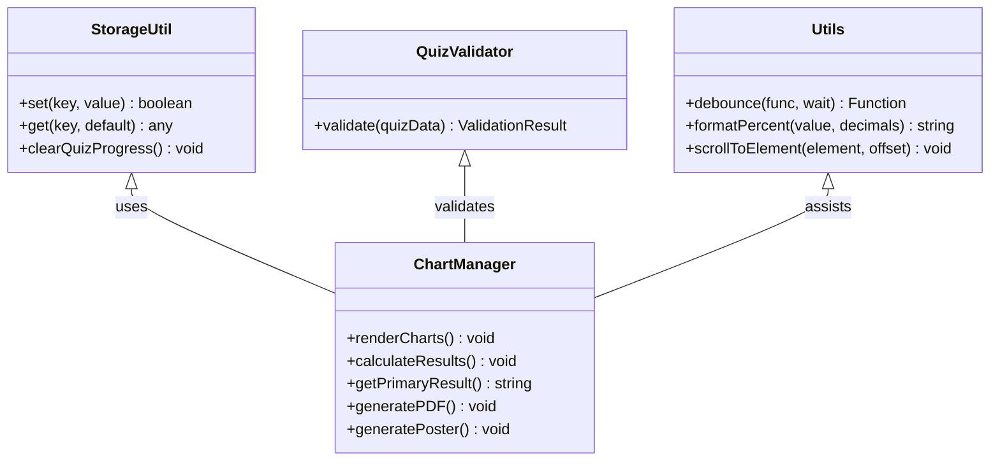

**图表来源**
- [js/utils.js:17-50](file://js/utils.js#L17-L50)
- [result.html:284-289](file://result.html#L284-L289)

**章节来源**
- [js/utils.js:1-250](file://js/utils.js#L1-L250)
- [result.html:284-289](file://result.html#L284-L289)

## 性能考虑

### 内存优化策略

系统采用了多项内存优化技术来确保图表的流畅运行：

#### 图表实例管理
- **延迟初始化**：仅在需要时创建 Chart 实例
- **实例复用**：避免重复创建相同的图表配置
- **清理机制**：页面切换时自动销毁不再使用的图表实例

#### 数据缓存策略
- **本地存储**：使用 localStorage 缓存测试数据
- **增量更新**：只更新发生变化的数据部分
- **内存回收**：及时释放不再使用的临时变量

#### 渲染性能优化

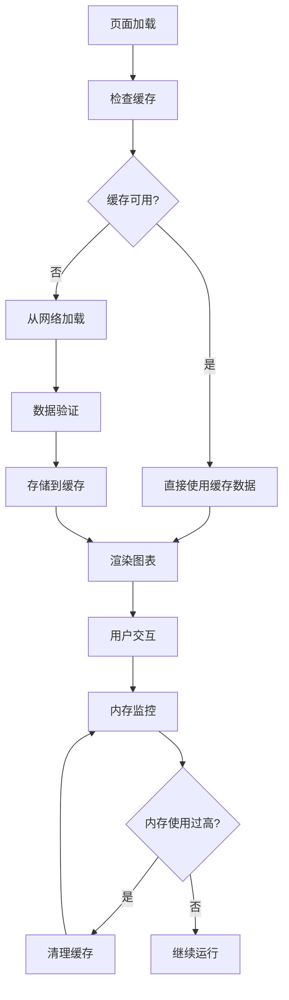

**图表来源**
- [js/utils.js:18-49](file://js/utils.js#L18-L49)
- [result.html:501-572](file://result.html#L501-L572)

### 响应式性能优化

系统针对不同设备进行了专门的性能优化：

#### 移动端优化
- **简化渲染**：减少复杂动画效果
- **降低分辨率**：使用较低的图表分辨率
- **懒加载**：延迟加载非关键资源

#### 桌面端优化
- **高分辨率渲染**：提供清晰的图表细节
- **增强交互**：支持更丰富的鼠标交互
- **全功能展示**：完整展现图表的所有特性

#### 烟花特效优化
- **定时清理**：自动移除完成的特效元素
- **限制数量**：控制同时存在的特效数量
- **性能监控**：避免影响页面渲染

**章节来源**
- [css/style.css:618-683](file://css/style.css#L618-L683)
- [result.html:516-570](file://result.html#L516-L570)
- [result.html:1456-1527](file://result.html#L1456-L1527)

## 故障排除指南

### 常见问题及解决方案

#### 图表不显示问题

**问题描述**：图表容器为空白或显示异常

**可能原因**：
1. Canvas 元素未正确初始化
2. Chart.js 库加载失败
3. 数据格式不正确

**解决方案**：
```javascript
// 检查 Canvas 元素是否存在
const canvas = document.getElementById('radarChart');
if (!canvas) {
    console.error('Canvas 元素不存在');
    return;
}

// 验证 Chart.js 是否已加载
if (typeof Chart === 'undefined') {
    console.error('Chart.js 未加载');
    return;
}

// 确保数据格式正确
if (!Array.isArray(labels) || !Array.isArray(data)) {
    console.error('数据格式不正确');
    return;
}
```

#### 数据计算错误

**问题描述**：维度得分计算结果异常

**排查步骤**：
1. 检查答案数据的完整性
2. 验证维度映射关系
3. 确认百分比计算逻辑

**调试代码**：
```javascript
// 添加数据验证
console.log('原始答案:', answers);
console.log('维度定义:', quizData.dimensions);
console.log('计算结果:', dimensionScores);

// 检查空值情况
Object.keys(dimensionScores).forEach(key => {
    const dim = dimensionScores[key];
    if (isNaN(dim.score) || isNaN(dim.maxScore)) {
        console.error('维度分数异常:', dim);
    }
});
```

#### PDF导出失败

**问题描述**：PDF生成过程中出现错误

**可能原因**：
1. html2canvas 渲染失败
2. jsPDF 库加载问题
3. 图像数据格式错误

**解决方案**：
```javascript
try {
    const canvas = await html2canvas(element, {
        scale: 2,
        useCORS: true,
        backgroundColor: '#ffffff'
    });
    
    const imgData = canvas.toDataURL('image/png');
    const { jsPDF } = window.jspdf;
    const doc = new jsPDF('p', 'mm', 'a4');
    doc.addImage(imgData, 'PNG', 0, 0, 210, imgHeight);
    doc.save('report.pdf');
} catch (error) {
    console.error('PDF导出失败:', error);
    alert('导出失败，请重试');
}
```

#### 性能问题诊断

**问题描述**：页面加载缓慢或图表渲染卡顿

**诊断方法**：
1. 使用浏览器开发者工具监控内存使用
2. 检查网络请求的响应时间
3. 分析 JavaScript 执行时间

**优化建议**：
- 减少不必要的 DOM 操作
- 使用 requestAnimationFrame 进行动画
- 实施数据分页加载
- 优化图片资源大小

**章节来源**
- [result.html:335-378](file://result.html#L335-L378)
- [result.html:501-572](file://result.html#L501-L572)
- [result.html:1238-1393](file://result.html#L1238-L1393)

### 最佳实践建议

#### 图表配置最佳实践

1. **保持配置一致性**：确保相同类型的图表使用相同的配置模式
2. **合理设置响应式参数**：根据目标用户群体调整响应式阈值
3. **优化颜色搭配**：选择符合品牌色彩且易于区分的颜色方案
4. **提供加载状态**：在数据加载期间显示适当的占位符

#### 数据处理最佳实践

1. **输入验证**：始终验证用户输入和外部数据
2. **错误处理**：为可能出现的异常情况提供优雅的降级方案
3. **数据缓存**：合理使用缓存机制提高用户体验
4. **隐私保护**：妥善处理用户敏感数据

#### 性能优化最佳实践

1. **资源压缩**：对 JavaScript 和 CSS 文件进行压缩
2. **按需加载**：只在需要时加载额外的功能模块
3. **缓存策略**：实施合理的浏览器缓存策略
4. **监控指标**：建立性能监控体系持续优化

## 结论

心理测试 v2 项目成功地集成了 Chart.js 图表库，为用户提供了一个功能完整、性能优异的心理测试可视化解决方案。通过精心设计的雷达图和柱状图，系统能够有效地展示复杂的多维度数据，帮助用户更好地理解自己的心理特征。

### 主要成就

- **完整的图表生态系统**：实现了从数据计算到可视化的完整流程
- **优秀的用户体验**：响应式设计确保了跨设备的一致体验
- **强大的扩展性**：模块化的架构为未来的功能扩展奠定了基础
- **专业的视觉设计**：符合心理学专业标准的色彩和布局方案
- **丰富的交互功能**：PDF导出和海报生成功能提升了用户体验

### 技术亮点

- **智能数据处理**：自动化的维度得分计算和结果分析
- **高性能渲染**：优化的图表渲染机制确保流畅的用户体验
- **完善的错误处理**：健壮的异常处理机制保证系统的稳定性
- **灵活的配置系统**：支持多种自定义选项满足不同需求
- **现代化的导出功能**：PDF和海报导出功能提升了实用性

### 未来发展方向

1. **增强交互功能**：添加更多图表交互选项如缩放、筛选等
2. **移动端优化**：进一步提升移动设备上的使用体验
3. **数据导出功能**：扩展数据导出格式支持更多第三方应用
4. **个性化定制**：提供更多主题和样式选项满足用户个性化需求
5. **社交分享**：集成更多社交媒体平台的分享功能

通过持续的优化和改进，心理测试 v2 项目将成为一个更加完善和专业的心理测评平台，为用户提供更好的服务体验。