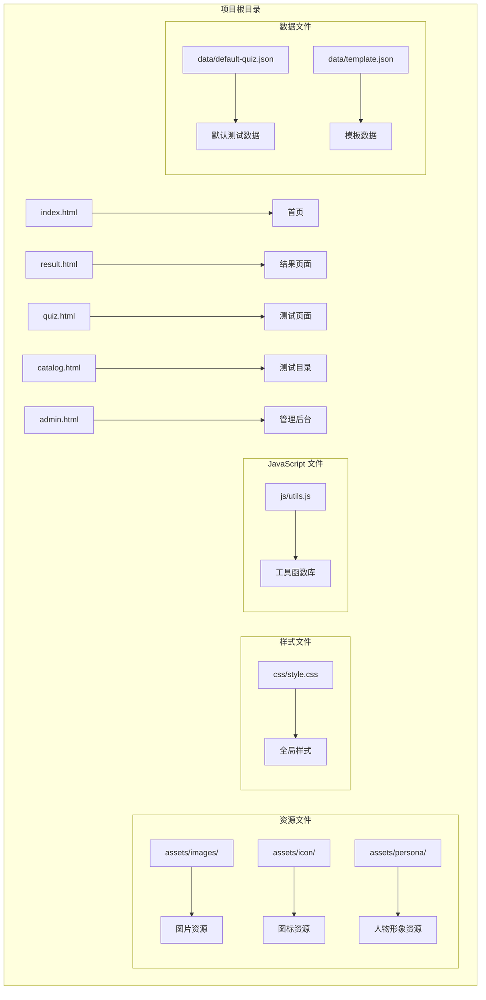
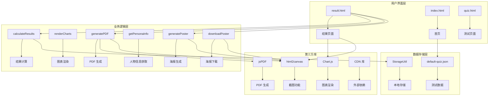
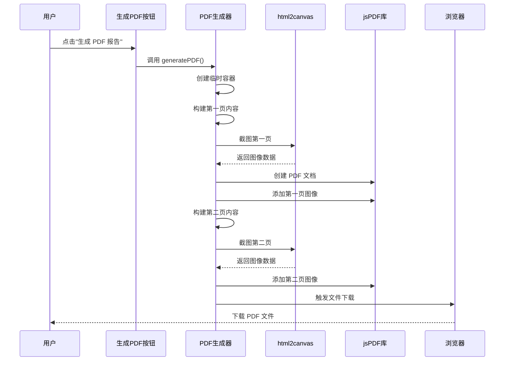
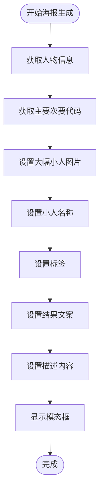
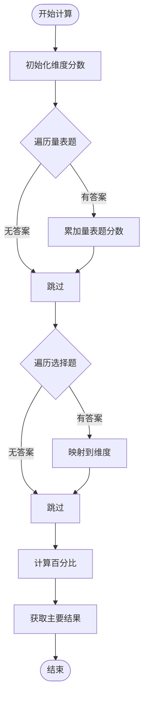
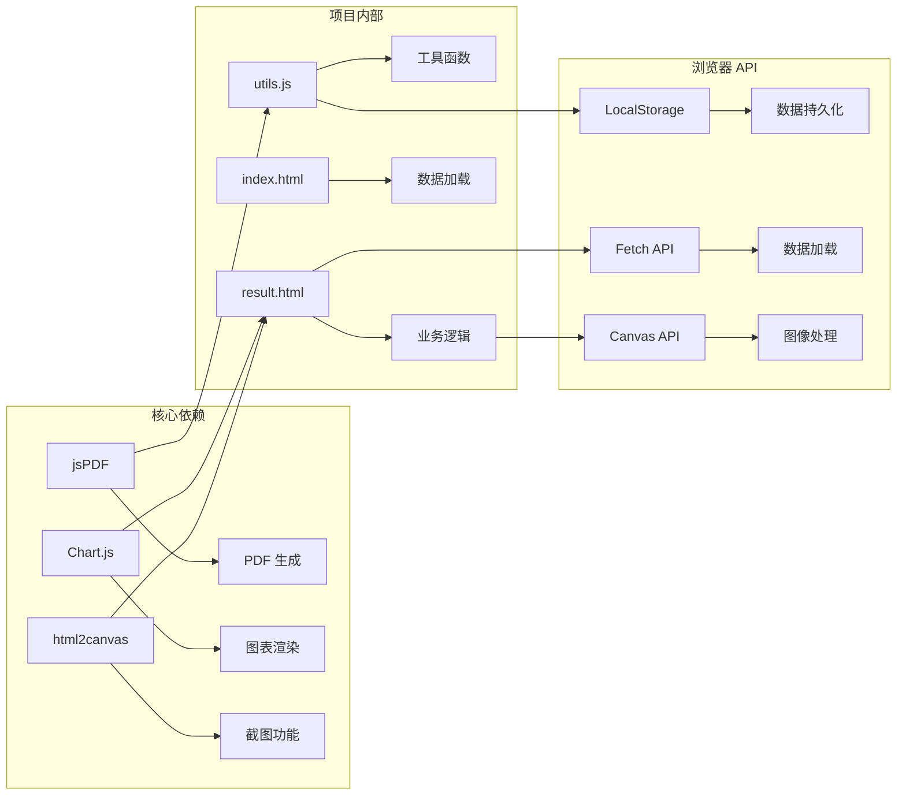

# PDF 生成集成

<cite>
**本文档引用的文件**
- [index.html](file://index.html)
- [result.html](file://result.html)
- [js/utils.js](file://js/utils.js)
- [data/default-quiz.json](file://data/default-quiz.json)
- [data/template.json](file://data/template.json)
- [css/style.css](file://css/style.css)
</cite>

## 更新摘要
**变更内容**
- 新增完整的海报生成和分享功能实现
- 扩展 PDF 导出机制，支持多页面报告生成
- 增强 html2canvas 截图功能，支持高质量海报导出
- 完善模态框交互设计和用户界面优化
- 新增烟花特效和庆祝动画功能

## 目录
1. [简介](#简介)
2. [项目结构](#项目结构)
3. [核心组件](#核心组件)
4. [架构概览](#架构概览)
5. [详细组件分析](#详细组件分析)
6. [依赖关系分析](#依赖关系分析)
7. [性能考虑](#性能考虑)
8. [故障排除指南](#故障排除指南)
9. [结论](#结论)

## 简介

心理测试 v2 项目是一个基于 Web 的心理测评系统，支持多种心理测试类型，包括"爱的五种语言测试"。该项目的核心功能之一是生成 PDF 测试报告，为用户提供可打印的心理测试结果文档。本次更新重点优化了 PDF 生成集成，新增了海报生成、分享功能和导出机制，为用户提供了更加丰富和便捷的报告生成功能。

该项目采用现代化的前端技术栈，使用 HTML5、CSS3 和 JavaScript 实现完整的心理测试体验。PDF 生成功能通过 jsPDF 库实现，结合 Chart.js 图表渲染和 html2canvas 截图功能，为用户提供了专业的报告生成功能。新增的海报生成功能则通过 html2canvas 实现高质量图片导出，支持社交媒体分享。

**章节来源**
- [result.html:1-11](file://result.html#L1-L11)
- [result.html:604-758](file://result.html#L604-L758)

## 项目结构

心理测试 v2 项目采用清晰的文件组织结构，主要包含以下核心目录和文件：



**图表来源**
- [index.html:1-183](file://index.html#L1-L183)
- [result.html:1-943](file://result.html#L1-L943)
- [js/utils.js:1-250](file://js/utils.js#L1-L250)

**章节来源**
- [index.html:1-183](file://index.html#L1-L183)
- [result.html:1-943](file://result.html#L1-L943)
- [js/utils.js:1-250](file://js/utils.js#L1-L250)

## 核心组件

### jsPDF 库集成

项目通过 CDN 方式引入 jsPDF 库，在结果页面中实现了完整的 PDF 报告生成功能。jsPDF 是一个强大的 JavaScript PDF 生成库，支持文本、图像、矢量图形等多种内容类型的绘制。

#### 主要功能特性：
- **页面配置**：支持 A4 纸张尺寸，纵向布局
- **文本格式化**：字体大小、对齐方式、颜色设置
- **内容布局**：精确的坐标定位和自动换行
- **导出功能**：浏览器内直接下载 PDF 文件

#### 集成方式：
```javascript
// 通过 CDN 引入 jsPDF
<script src="https://cdnjs.cloudflare.com/ajax/libs/jspdf/2.5.1/jspdf.umd.min.js"></script>

// 在 generatePDF 函数中使用
const { jsPDF } = window.jspdf;
const doc = new jsPDF('p', 'mm', 'a4');
```

**章节来源**
- [result.html:10](file://result.html#L10)
- [result.html:722-723](file://result.html#L722-L723)

### 海报生成系统

**新增功能**：项目新增了完整的海报生成功能，用户可以通过"生成分享海报"按钮创建精美的测试结果海报。

#### 主要功能特性：
- **模态框设计**：半透明背景，居中显示的海报预览
- **动态内容生成**：根据用户测试结果动态生成海报内容
- **高质量导出**：支持 PNG 格式高清海报下载
- **个性化定制**：支持小人形象、标签、描述的动态更新

#### 海报内容结构：
1. **头部区域**：渐变背景装饰，品牌标识
2. **小人展示区**：大幅展示匹配的小人形象
3. **标签系统**：两个个性化标签展示
4. **结果展示区**：主要和次要爱语的高亮显示
5. **描述区域**：基于小人信息生成的详细描述
6. **底部信息**：项目标识和推广语

**章节来源**
- [result.html:250-289](file://result.html#L250-L289)
- [result.html:1395-1427](file://result.html#L1395-L1427)

### 数据提取逻辑

PDF 报告的数据来源于测试结果计算模块，该模块负责处理用户答案并生成维度评分。

#### 数据处理流程：
1. **初始化维度分数**：根据测试配置创建维度对象
2. **量表题评分**：累加用户选择的答案值
3. **选择题评分**：根据选项映射到对应维度
4. **百分比计算**：将原始分数转换为百分比
5. **主要结果确定**：找出最高分维度

#### 关键实现：
```javascript
// 计算量表题得分
quizData.scale_questions.forEach(q => {
    const answer = answers[q.question_id];
    if (answer) {
        dimensionScores[q.dimension_id].score += answer;
        dimensionScores[q.dimension_id].maxScore += 5;
    }
});

// 计算选择题得分
quizData.choice_questions.forEach(q => {
    const answer = answers[q.question_id];
    if (answer) {
        const dimId = q[`option_${answer}_dim`];
        if (dimId) {
            dimensionScores[dimId].score += 5;
            dimensionScores[dimId].maxScore += 5;
        }
    }
});
```

**章节来源**
- [result.html:336-378](file://result.html#L336-L378)

### 报告结构设计

PDF 报告采用层次化的结构设计，确保信息的清晰呈现和良好的可读性。

#### 报告结构层次：
1. **标题区域**：测试名称和报告标识
2. **主要结果**：用户的主要爱语类型
3. **详细分析**：各维度得分和描述
4. **图表集成**：可视化数据展示

#### 页面布局策略：
- **标题居中**：使用 20pt 字体，水平居中对齐
- **结果突出**：主要结果使用较大字体和强调色
- **列表格式**：维度信息采用有序列表格式
- **间距控制**：合理的行间距和段落间距

**章节来源**
- [result.html:629-715](file://result.html#L629-L715)

## 架构概览

心理测试 v2 项目的 PDF 生成架构采用了模块化设计，各个组件职责明确，协作高效。



**图表来源**
- [result.html:336-758](file://result.html#L336-L758)
- [js/utils.js:17-50](file://js/utils.js#L17-L50)

### 技术栈分析

项目采用的技术栈体现了现代 Web 开发的最佳实践：

#### 前端框架：
- **HTML5**：语义化标记和多媒体支持
- **CSS3**：响应式设计和动画效果
- **JavaScript ES6+**：模块化开发和异步编程

#### 第三方库：
- **Chart.js**：专业的图表渲染引擎
- **jsPDF**：功能强大的 PDF 生成库
- **html2canvas**：浏览器截图解决方案

#### 开发工具：
- **LocalStorage API**：客户端数据持久化
- **Fetch API**：异步数据加载
- **Canvas API**：图像处理和渲染

**章节来源**
- [result.html:8-11](file://result.html#L8-L11)
- [js/utils.js:1-250](file://js/utils.js#L1-L250)

## 详细组件分析

### PDF 生成核心组件

#### generatePDF 函数分析

PDF 生成功能的核心实现位于结果页面的 `generatePDF` 函数中，该函数负责整个报告的创建过程。



**图表来源**
- [result.html:605-758](file://result.html#L605-L758)

#### 文本格式化实现

PDF 文档中的文本格式化采用了统一的样式规范，确保报告的专业性和一致性。

##### 字体配置：
- **标题字体**：20pt，居中对齐
- **副标题字体**：16pt，居中对齐  
- **正文字体**：12pt，左对齐
- **强调字体**：加粗显示

##### 颜色方案：
- **主色调**：使用项目主题色 #FF8C94
- **背景色**：白色背景，确保可读性
- **强调色**：用于突出显示重要信息

##### 对齐方式：
- **标题**：水平居中，垂直居中
- **内容**：左对齐，保持阅读流畅性
- **数值**：右对齐，便于比较

**章节来源**
- [result.html:629-715](file://result.html#L629-L715)

### 海报生成系统

#### generatePoster 函数分析

**新增功能**：海报生成功能通过 `generatePoster` 函数实现，该函数负责创建美观的测试结果海报。



**图表来源**
- [result.html:1395-1427](file://result.html#L1395-L1427)

#### 海报设计特色

##### 视觉设计：
- **渐变背景**：使用线性渐变色彩营造视觉层次
- **装饰元素**：圆形径向渐变背景装饰增加立体感
- **阴影效果**：多层阴影营造深度和质感
- **圆角设计**：圆润的边角符合现代设计趋势

##### 内容布局：
- **图片区域**：大幅展示小人图片，最大宽度 320px
- **文字区域**：白色半透明背景，确保文字可读性
- **标签系统**：两个圆角标签，突出个性特征
- **结果展示**：高亮显示主要和次要爱语

**章节来源**
- [result.html:1395-1427](file://result.html#L1395-L1427)

### 数据提取与处理模块

#### calculateResults 函数

该函数是 PDF 报告数据处理的核心，负责将用户答案转换为有意义的测试结果。



**图表来源**
- [result.html:336-378](file://result.html#L336-L378)

#### 数据结构设计

PDF 报告使用的数据结构经过精心设计，确保了数据的完整性和可用性。

##### 维度评分对象：
```javascript
dimensionScores = {
    dimension_id: {
        name: "维度名称",
        description: "维度描述",
        score: 0,
        maxScore: 0,
        percentage: 0
    }
}
```

##### 百分比计算：
```javascript
// 将原始分数转换为百分比
dim.percentage = dim.maxScore > 0 ? (dim.score / dim.maxScore) : 0;
```

**章节来源**
- [result.html:336-378](file://result.html#L336-L378)

### 报告内容布局设计

#### 页面配置参数

PDF 文档的页面配置采用了标准的 A4 纸张规格，确保报告在各种设备上的兼容性。

##### 页面参数：
- **方向**：纵向 (portrait)
- **单位**：毫米 (mm)
- **尺寸**：A4 (210 × 297 mm)
- **边距**：标准边距设置

##### 坐标系统：
- **原点**：左下角 (0, 0)
- **X轴**：向右递增
- **Y轴**：向上递增
- **范围**：X: 0-210, Y: 0-297

#### 内容分区策略

PDF 报告采用清晰的内容分区，每个区域都有明确的功能和视觉特征。

##### 第一页内容分区：
- **标题区域 (Y: 10-30mm)**：测试报告标题
- **人物展示区域 (Y: 30-120mm)**：主要结果和描述
- **雷达图区域 (Y: 120-200mm)**：图表展示
- **维度列表区域 (Y: 200-250mm)**：详细得分列表

##### 第二页内容分区：
- **标题区域 (Y: 10-30mm)**：维度详细解读
- **维度详情区域 (Y: 30-250mm)**：各维度详细描述

**章节来源**
- [result.html:629-715](file://result.html#L629-L715)

### 错误处理机制

#### 异常处理策略

PDF 生成功能包含了完善的错误处理机制，确保在各种异常情况下都能提供良好的用户体验。

##### 数据验证：
```javascript
// 检查用户是否已完成测试
if (Object.keys(answers).length === 0) {
    alert('请先完成测试');
    window.location.href = 'quiz.html';
    return;
}

// 检查测试数据加载
if (!quizData) {
    try {
        const response = await fetch('data/default-quiz.json');
        if (response.ok) {
            quizData = await response.json();
        } else {
            throw new Error('Failed to fetch');
        }
    } catch (error) {
        alert('加载测试数据失败，请返回首页重试');
        window.location.href = 'index.html';
        return;
    }
}
```

##### 用户反馈：
- **加载失败**：提示用户返回首页重试
- **数据缺失**：引导用户完成测试
- **生成失败**：记录错误日志并提供重试选项

**章节来源**
- [result.html:919-923](file://result.html#L919-L923)
- [result.html:899-914](file://result.html#L899-L914)

## 依赖关系分析

### 外部依赖库

心理测试 v2 项目对外部库的依赖关系清晰明确，每个库都有其特定的功能定位。



**图表来源**
- [result.html:8-11](file://result.html#L8-L11)
- [js/utils.js:1-250](file://js/utils.js#L1-L250)

### 内部模块依赖

项目内部模块之间的依赖关系遵循单一职责原则，模块间耦合度较低。

#### 工具模块 (utils.js)：
- **StorageUtil**：本地存储操作
- **QuizValidator**：数据验证
- **Utils**：通用工具函数

#### 页面模块：
- **index.html**：测试数据加载和展示
- **result.html**：结果计算、PDF 生成和海报生成
- **quiz.html**：测试答题界面

#### 数据模块：
- **default-quiz.json**：测试配置数据
- **template.json**：数据模板

**章节来源**
- [js/utils.js:17-50](file://js/utils.js#L17-L50)
- [index.html:85-173](file://index.html#L85-L173)

## 性能考虑

### 加载性能优化

项目在 PDF 生成功能中采用了多项性能优化策略，确保用户获得流畅的使用体验。

#### 资源加载优化：
- **CDN 加速**：jsPDF 库通过 CDN 加载，减少本地体积
- **按需加载**：PDF 生成功能仅在结果页面启用
- **缓存策略**：测试数据使用 LocalStorage 缓存

#### 计算性能优化：
- **数据预处理**：在页面加载时完成大部分数据处理
- **增量更新**：只在必要时重新计算结果
- **内存管理**：及时释放不需要的对象引用

### 内存使用优化

PDF 生成过程中的内存使用得到了有效控制，避免了内存泄漏问题。

#### 内存管理策略：
- **对象池**：复用临时对象，减少垃圾回收压力
- **及时清理**：生成完成后清理事件监听器
- **数据压缩**：压缩大对象的序列化数据

#### 性能监控：
- **执行时间统计**：监控 PDF 生成的耗时
- **内存使用监控**：跟踪内存占用情况
- **错误日志记录**：记录性能相关的问题

### 海报生成性能优化

**新增功能**：海报生成功能采用了专门的性能优化策略。

#### 渲染优化：
- **缩放比例**：使用 3 倍缩放确保高清导出
- **并发处理**：海报生成和下载功能独立运行
- **缓存机制**：生成的海报内容进行缓存

#### 内存管理：
- **DOM 清理**：生成完成后及时移除临时 DOM 元素
- **事件监听器**：确保模态框关闭时清理事件
- **资源释放**：下载完成后释放 Canvas 资源

**章节来源**
- [result.html:899-943](file://result.html#L899-L943)
- [js/utils.js:17-50](file://js/utils.js#L17-L50)

## 故障排除指南

### 常见问题及解决方案

#### PDF 生成失败

**问题症状**：点击"生成 PDF 报告"按钮后无响应或出现错误提示。

**可能原因**：
1. jsPDF 库加载失败
2. 用户未完成测试
3. 浏览器阻止弹窗
4. 内存不足

**解决步骤**：
1. 检查网络连接和 CDN 可用性
2. 确认用户已完成测试
3. 允许浏览器弹窗权限
4. 关闭其他占用内存的应用程序

#### 海报生成异常

**问题症状**：点击"生成分享海报"按钮后海报无法显示或下载失败。

**可能原因**：
1. html2canvas 库加载失败
2. 小人图片资源加载失败
3. Canvas 渲染错误
4. 浏览器兼容性问题

**解决步骤**：
1. 检查 html2canvas 库的 CDN 连接
2. 验证 assets/persona/ 目录下的图片资源
3. 在浏览器开发者工具中查看 Canvas 相关错误
4. 尝试在不同浏览器中测试

#### 报告内容不完整

**问题症状**：生成的 PDF 文件缺少部分信息。

**可能原因**：
1. 数据加载超时
2. 用户答案数据丢失
3. 维度配置错误

**解决步骤**：
1. 刷新页面重新加载数据
2. 检查 LocalStorage 中的数据完整性
3. 验证测试数据文件格式正确性

#### 浏览器兼容性问题

**问题症状**：在某些浏览器中 PDF 生成功能异常。

**可能原因**：
1. 浏览器版本过低
2. JavaScript 功能禁用
3. 安全策略限制

**解决步骤**：
1. 更新到最新版本的浏览器
2. 启用 JavaScript 功能
3. 检查安全软件设置

### 调试技巧

#### 开发者工具使用：
- **控制台日志**：查看 PDF 生成过程中的错误信息
- **网络面板**：监控 jsPDF 库的加载状态
- **存储面板**：检查 LocalStorage 中的数据完整性
- **元素检查**：验证海报生成的 DOM 结构

#### 性能分析：
- **性能面板**：监控 PDF 生成的执行时间
- **内存面板**：跟踪内存使用情况
- **网络面板**：分析资源加载性能

**章节来源**
- [result.html:919-923](file://result.html#L919-L923)

## 结论

心理测试 v2 项目的 PDF 生成集成为现代 Web 应用提供了优秀的参考案例。通过合理的技术选型和架构设计，项目成功实现了功能丰富、性能优良的报告生成功能，并新增了海报生成和分享功能。

### 主要成就

1. **技术集成**：成功整合了 jsPDF、Chart.js、html2canvas 等多个第三方库
2. **用户体验**：提供了直观易用的 PDF 生成界面和海报分享功能
3. **数据处理**：实现了复杂的心理测试结果计算和展示
4. **性能优化**：在保证功能完整性的前提下优化了运行效率
5. **功能扩展**：新增了高质量海报生成功能，支持社交媒体分享

### 最佳实践总结

1. **模块化设计**：清晰的模块划分和职责分离
2. **错误处理**：完善的异常处理和用户反馈机制
3. **性能优化**：合理的资源管理和内存使用策略
4. **兼容性考虑**：跨浏览器兼容性和渐进增强策略
5. **用户体验**：注重界面设计和交互体验的优化

### 未来改进方向

1. **功能扩展**：支持更多样式的报告模板和海报设计
2. **交互增强**：提供实时预览和自定义选项
3. **性能提升**：进一步优化大型报告和海报的生成速度
4. **移动端适配**：改善移动设备上的使用体验
5. **社交分享**：集成更多社交媒体平台的分享功能

该项目为开发者提供了宝贵的实践经验，展示了如何在 Web 环境中实现专业级的 PDF 报告生成功能，以及如何优雅地扩展功能以满足用户需求。