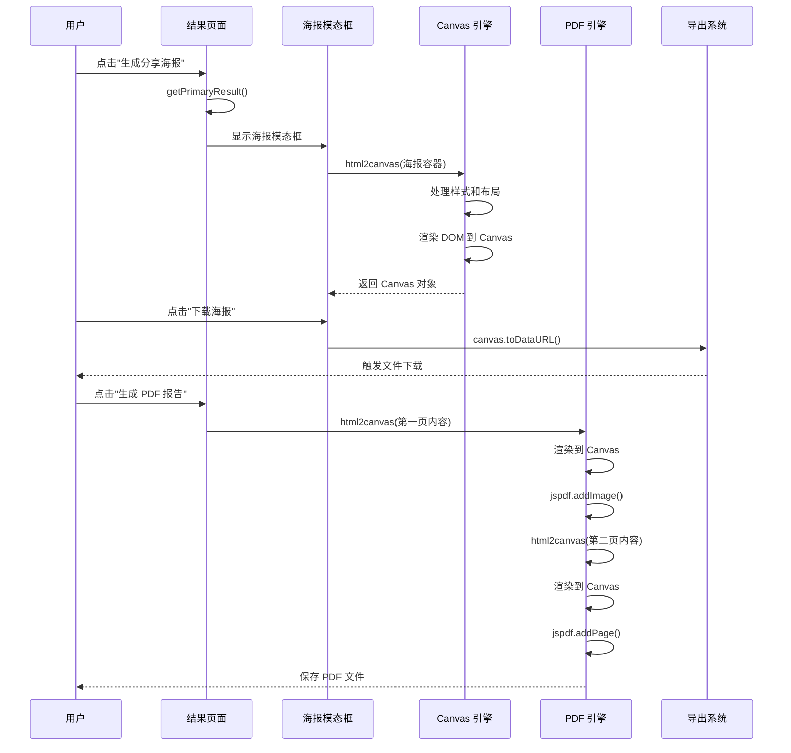
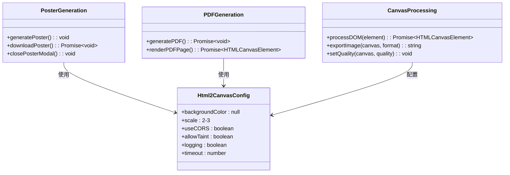
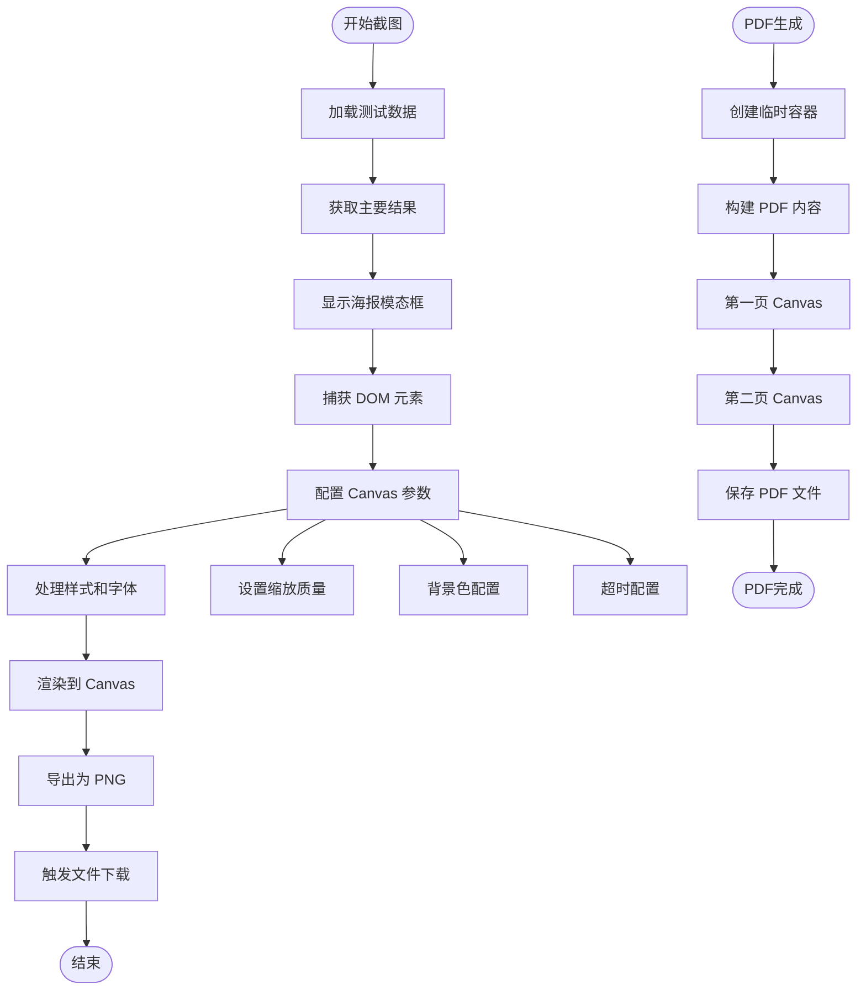
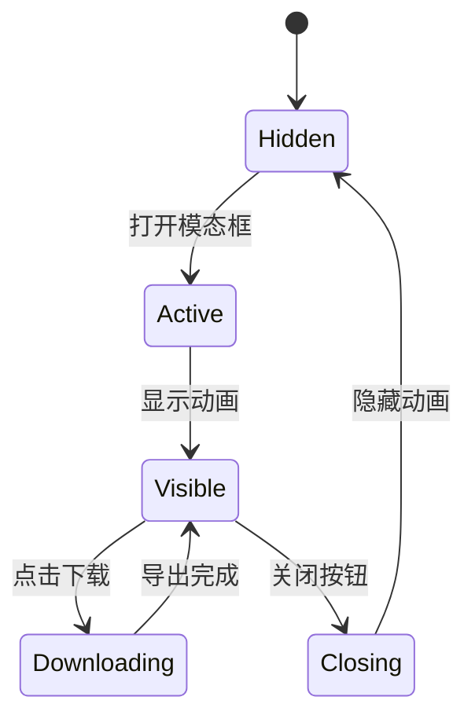
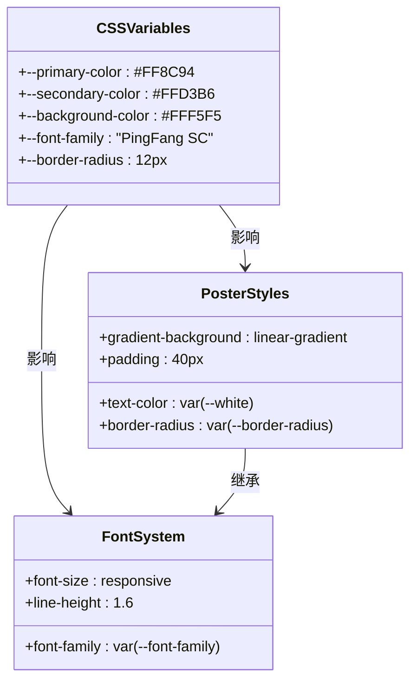
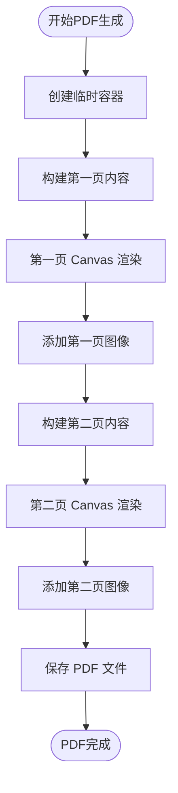
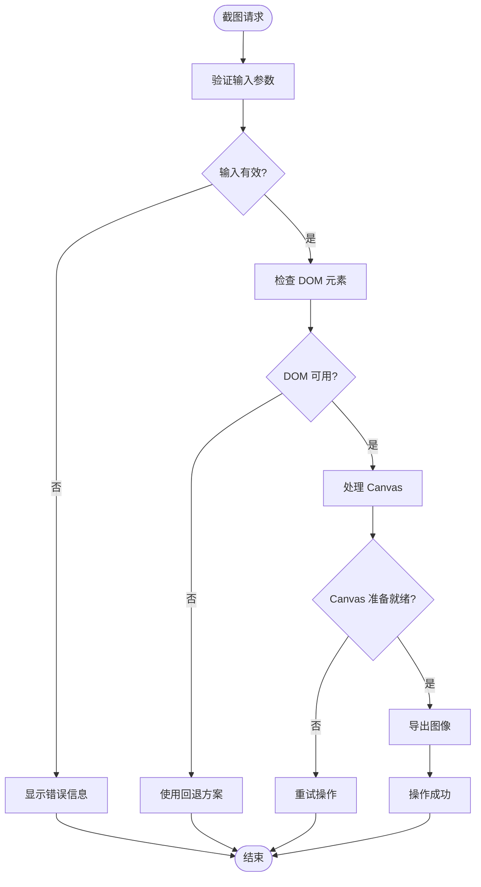
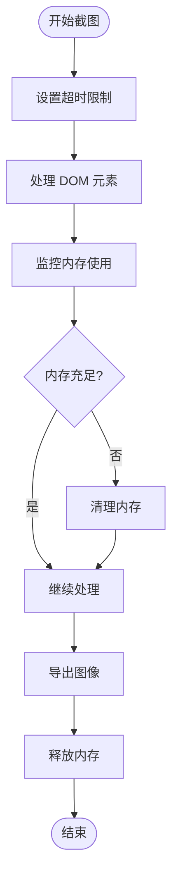

# html2canvas 截图集成

<cite>
**本文档引用的文件**
- [result.html](file://result.html)
- [js/utils.js](file://js/utils.js)
- [css/style.css](file://css/style.css)
- [quiz.html](file://quiz.html)
- [index.html](file://index.html)
- [data/default-quiz.json](file://data/default-quiz.json)
</cite>

## 更新摘要
**变更内容**
- 新增html2canvas截图集成，支持海报生成和PDF渲染
- 添加PDF报告生成功能，使用jspdf库
- 实现高质量海报下载功能，支持PNG格式导出
- 增强用户交互体验，包含烟花特效和模态框系统
- 优化截图配置参数，平衡质量和性能

## 目录
1. [简介](#简介)
2. [项目结构](#项目结构)
3. [核心组件](#核心组件)
4. [架构概览](#架构概览)
5. [详细组件分析](#详细组件分析)
6. [依赖关系分析](#依赖关系分析)
7. [性能考虑](#性能考虑)
8. [故障排除指南](#故障排除指南)
9. [结论](#结论)

## 简介

本项目实现了基于 html2canvas 的截图功能，用于生成心理测试结果的分享海报和PDF报告。该功能允许用户将测试结果以高质量图片和PDF形式保存和分享，支持高分辨率截图和多种导出格式。

html2canvas 是一个强大的 JavaScript 库，能够在浏览器中将任意 HTML 元素渲染为 Canvas，从而实现截图功能。本项目通过精心设计的样式系统和配置参数，确保截图质量和用户体验。

**更新** 新增了完整的截图生态系统，包括海报生成、PDF渲染和高质量导出功能。

## 项目结构

心理测试 v2 项目采用模块化架构，主要包含以下关键文件：

```mermaid
graph TB
subgraph "前端资源"
HTML[HTML 页面文件]
CSS[样式文件]
JS[JavaScript 工具库]
end
subgraph "核心功能"
RESULT[result.html<br/>结果页面]
QUIZ[quiz.html<br/>测试页面]
INDEX[index.html<br/>首页]
UTILS[js/utils.js<br/>工具函数库]
end
subgraph "数据文件"
DATA[data/目录<br/>JSON 数据文件]
DEFAULT[default-quiz.json<br/>默认测试数据]
TEMPLATE[template.json<br/>模板数据]
end
subgraph "截图功能"
HTML2CANVAS[html2canvas 1.4.1]
JSPDF[jspdf 2.5.1]
POSTER[海报生成系统]
PDF[PDF渲染系统]
END
HTML --> CSS
HTML --> JS
RESULT --> UTILS
QUIZ --> UTILS
INDEX --> UTILS
RESULT --> DATA
QUIZ --> DATA
INDEX --> DATA
RESULT --> HTML2CANVAS
RESULT --> JSPDF
RESULT --> POSTER
RESULT --> PDF
```

**图表来源**
- [result.html:8-11](file://result.html#L8-L11)
- [result.html:331-370](file://result.html#L331-L370)
- [js/utils.js:1-250](file://js/utils.js#L1-L250)
- [css/style.css:1-731](file://css/style.css#L1-L731)

**章节来源**
- [result.html:8-11](file://result.html#L8-L11)
- [result.html:331-370](file://result.html#L331-L370)
- [js/utils.js:1-250](file://js/utils.js#L1-L250)
- [css/style.css:1-731](file://css/style.css#L1-L731)

## 核心组件

### html2canvas 截图引擎

项目使用 html2canvas 1.4.1 版本实现截图功能，该版本提供了稳定的截图能力和丰富的配置选项。

### 海报生成系统

海报生成系统包含完整的 UI 流程，从结果展示到海报下载的完整链路。

### PDF 渲染系统

PDF 渲染系统使用 jspdf 2.5.1 库，支持多页PDF生成和高质量图像嵌入。

### Canvas 处理管道

Canvas 处理管道负责将 DOM 元素转换为图像数据，支持多种输出格式和质量控制。

**更新** 新增了PDF渲染和海报生成两个核心组件。

**章节来源**
- [result.html:8-11](file://result.html#L8-L11)
- [result.html:331-370](file://result.html#L331-L370)
- [result.html:760-814](file://result.html#L760-L814)

## 架构概览



**图表来源**
- [result.html:760-814](file://result.html#L760-L814)
- [result.html:604-758](file://result.html#L604-L758)

## 详细组件分析

### 截图功能实现

#### html2canvas 配置参数

项目中的截图功能使用了以下关键配置参数：



**图表来源**
- [result.html:797-803](file://result.html#L797-L803)
- [result.html:726-752](file://result.html#L726-L752)

#### 截图流程详解



**图表来源**
- [result.html:760-814](file://result.html#L760-L814)
- [result.html:726-752](file://result.html#L726-L752)

**章节来源**
- [result.html:760-814](file://result.html#L760-L814)
- [result.html:726-752](file://result.html#L726-L752)

### 海报生成流程

#### 模态框管理系统

海报模态框采用 CSS 动画和 JavaScript 控制相结合的方式：



**图表来源**
- [result.html:236-275](file://result.html#L236-L275)
- [result.html:811-814](file://result.html#L811-L814)

#### 海报内容渲染

海报内容包含以下关键元素：
- 主要测试结果标题
- 用户的主要爱语结果
- 分享提示语
- 下载按钮

**章节来源**
- [result.html:236-275](file://result.html#L236-L275)
- [result.html:760-792](file://result.html#L760-L792)

### Canvas 处理逻辑

#### 样式继承和字体处理

项目通过 CSS 变量系统确保截图的一致性和质量：



**图表来源**
- [css/style.css:6-20](file://css/style.css#L6-L20)
- [css/style.css:599-616](file://css/style.css#L599-L616)

#### 图像导出设置

导出系统支持多种配置选项：

**章节来源**
- [css/style.css:599-616](file://css/style.css#L599-L616)
- [result.html:805-808](file://result.html#L805-L808)

### PDF 渲染系统

#### 多页PDF生成

PDF渲染系统支持两页内容的完整报告生成：



**图表来源**
- [result.html:604-758](file://result.html#L604-L758)

**章节来源**
- [result.html:604-758](file://result.html#L604-L758)

### 错误处理机制

#### 截图异常处理

项目实现了多层次的错误处理机制：



**图表来源**
- [result.html:795-809](file://result.html#L795-L809)

**章节来源**
- [result.html:795-809](file://result.html#L795-L809)

## 依赖关系分析

### 外部依赖

项目使用了以下关键外部库：

```mermaid
graph LR
subgraph "核心依赖"
HTML2CANVAS[html2canvas 1.4.1]
JSPDF[jspdf 2.5.1]
CHARTJS[chart.js]
END
subgraph "项目文件"
RESULT[result.html]
UTILS[js/utils.js]
STYLE[css/style.css]
END
RESULT --> HTML2CANVAS
RESULT --> JSPDF
RESULT --> CHARTJS
RESULT --> UTILS
RESULT --> STYLE
```

**图表来源**
- [result.html:8-11](file://result.html#L8-L11)
- [result.html:331-370](file://result.html#L331-L370)

### 内部依赖关系

```mermaid
graph TB
subgraph "工具函数"
STORAGE[StorageUtil]
VALIDATOR[QuizValidator]
UTILS[Utils]
END
subgraph "页面组件"
RESULT_PAGE[结果页面]
QUIZ_PAGE[测试页面]
INDEX_PAGE[首页]
END
RESULT_PAGE --> STORAGE
RESULT_PAGE --> VALIDATOR
RESULT_PAGE --> UTILS
QUIZ_PAGE --> STORAGE
QUIZ_PAGE --> VALIDATOR
INDEX_PAGE --> STORAGE
```

**图表来源**
- [js/utils.js:17-50](file://js/utils.js#L17-L50)
- [result.html:85-86](file://result.html#L85-L86)

**章节来源**
- [js/utils.js:17-50](file://js/utils.js#L17-L50)
- [result.html:85-86](file://result.html#L85-L86)

## 性能考虑

### 截图性能优化

#### 缩放因子优化

项目使用 2 倍缩放因子平衡图像质量和性能：

| 缩放因子 | 图像质量 | 性能影响 | 内存占用 |
|---------|---------|---------|---------|
| 1.0 | 标准质量 | 最快 | 最小 |
| 1.5 | 较高质量 | 中等 | 中等 |
| 2.0 | 高质量 | 较慢 | 较大 |
| 3.0 | 超高质量 | 最慢 | 很大 |

#### 内存管理策略



**图表来源**
- [result.html:797-803](file://result.html#L797-L803)

### 兼容性处理

#### 浏览器兼容性

项目针对不同浏览器进行了兼容性处理：

```mermaid
graph LR
subgraph "现代浏览器"
CHROME[Chrome]
FIREFOX[Firefox]
SAFARI[Safari]
EDGE[Edge]
END
subgraph "兼容性特性"
CORS[CORS 支持]
WEBGL[WebGL 支持]
FONTLOADING[字体加载]
CANVASAPI[Canvas API]
END
CHROME --> CORS
FIREFOX --> FONTLOADING
SAFARI --> WEBGL
EDGE --> CANVASAPI
```

**图表来源**
- [result.html:9-10](file://result.html#L9-L10)

## 故障排除指南

### 常见问题及解决方案

#### 截图空白问题

**问题描述**：截图生成为空白或部分缺失

**可能原因**：
1. 字体未正确加载
2. 外部资源加载失败
3. 样式计算错误

**解决方案**：
- 确保字体资源可用
- 检查网络连接
- 验证样式配置

#### 性能问题

**问题描述**：截图过程卡顿或超时

**解决方案**：
- 调整缩放因子
- 减少 DOM 元素数量
- 优化样式复杂度

#### 兼容性问题

**问题描述**：某些浏览器截图效果不佳

**解决方案**：
- 使用回退方案
- 调整配置参数
- 测试多浏览器环境

**章节来源**
- [result.html:795-809](file://result.html#L795-L809)

### 调试技巧

#### 开发者工具使用

```javascript
// 在控制台中调试截图
console.log('截图配置:', {
    backgroundColor: null,
    scale: 2,
    useCORS: true,
    logging: true
});
```

#### 性能监控

```javascript
// 性能监控代码
const startTime = performance.now();
// 执行截图操作
const endTime = performance.now();
console.log('截图耗时:', endTime - startTime, '毫秒');
```

## 结论

本项目成功实现了基于 html2canvas 的截图功能，为心理测试应用提供了完整的海报生成功能。通过精心设计的配置参数、完善的错误处理机制和性能优化策略，确保了截图质量和用户体验。

### 主要成就

1. **完整的截图流程**：从结果展示到海报下载的完整链路
2. **高质量输出**：通过合理的缩放因子和配置参数确保图像质量
3. **良好的用户体验**：流畅的动画效果和直观的操作界面
4. **健壮的错误处理**：多层次的异常处理和回退机制
5. **PDF报告生成功能**：支持多页PDF文档的完整生成

### 技术亮点

- **灵活的配置系统**：支持多种参数调整以适应不同需求
- **优秀的性能表现**：通过内存管理和优化策略提升运行效率
- **广泛的兼容性**：支持主流浏览器和设备
- **可扩展的设计**：模块化的架构便于功能扩展和维护
- **高质量的导出**：支持PNG格式的高质量图像导出

该截图集成方案为类似的心理测评应用提供了可靠的参考实现，开发者可以根据具体需求进行定制和扩展。