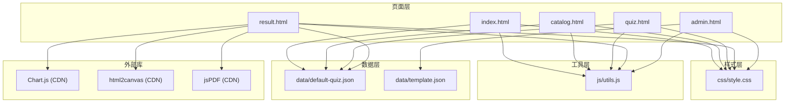
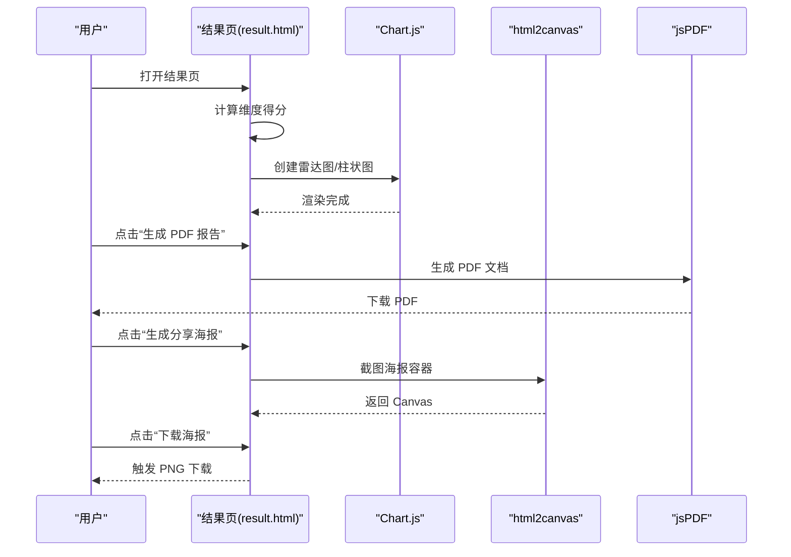
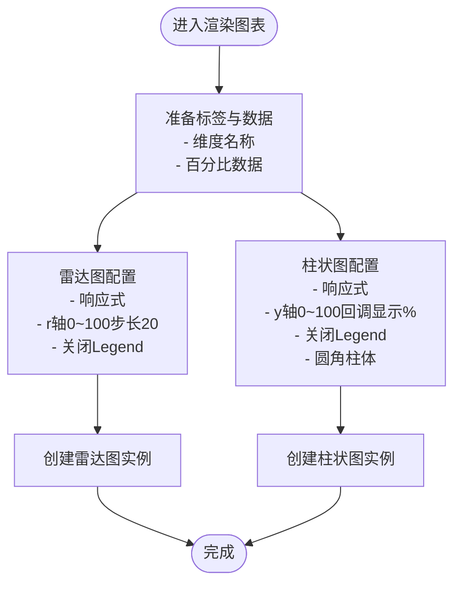
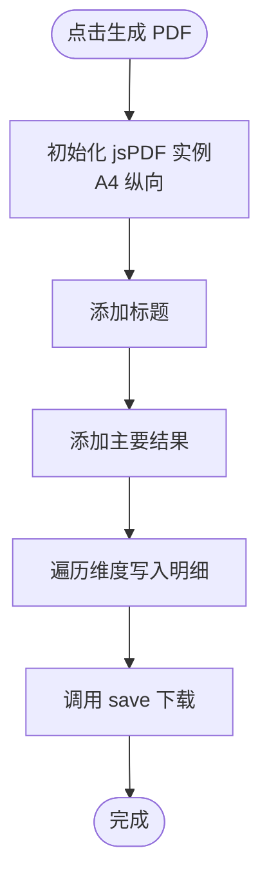
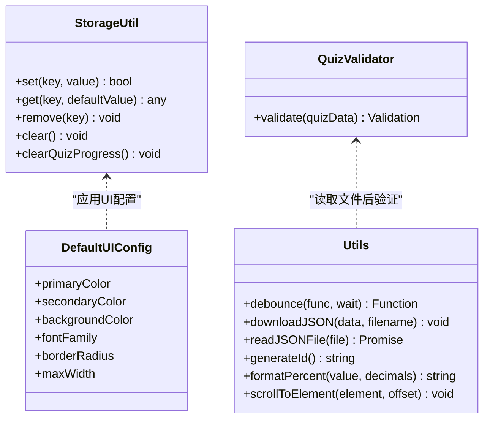
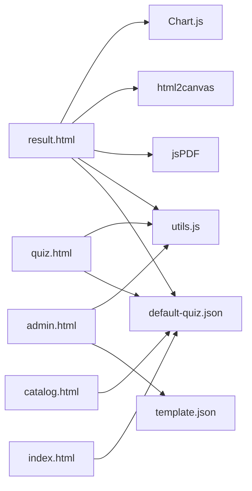

# 外部集成

<cite>
**本文引用的文件**
- [index.html](file://index.html)
- [quiz.html](file://quiz.html)
- [result.html](file://result.html)
- [admin.html](file://admin.html)
- [catalog.html](file://catalog.html)
- [utils.js](file://js/utils.js)
- [style.css](file://css/style.css)
- [default-quiz.json](file://data/default-quiz.json)
- [template.json](file://data/template.json)
</cite>

## 目录
1. [简介](#简介)
2. [项目结构](#项目结构)
3. [核心组件](#核心组件)
4. [架构总览](#架构总览)
5. [详细组件分析](#详细组件分析)
6. [依赖关系分析](#依赖关系分析)
7. [性能考量](#性能考量)
8. [故障排除指南](#故障排除指南)
9. [结论](#结论)
10. [附录](#附录)

## 简介
本文件面向“心理测试 v2”项目的外部集成能力，重点围绕以下三个外部库的集成与使用进行系统化文档化：
- Chart.js：用于结果页的雷达图与柱状图可视化展示
- html2canvas：用于将海报模板截图生成图片并下载
- jsPDF：用于生成 PDF 报告

文档涵盖技术方案、API 接口、配置参数、错误处理机制、性能优化策略、兼容性与版本管理建议，以及具体集成示例与最佳实践，帮助开发者理解并扩展项目的外部功能集成能力。

## 项目结构
该项目采用静态 HTML/CSS/JS 架构，页面之间通过本地资源与浏览器存储协作完成数据流转。外部库通过 CDN 引入，结果页同时引入 Chart.js、html2canvas 与 jsPDF。



图表来源
- [index.html](file://index.html)
- [catalog.html](file://catalog.html)
- [quiz.html](file://quiz.html)
- [result.html](file://result.html)
- [admin.html](file://admin.html)
- [utils.js](file://js/utils.js)
- [style.css](file://css/style.css)
- [default-quiz.json](file://data/default-quiz.json)
- [template.json](file://data/template.json)

章节来源
- [index.html](file://index.html)
- [quiz.html](file://quiz.html)
- [result.html](file://result.html)
- [admin.html](file://admin.html)
- [catalog.html](file://catalog.html)
- [utils.js](file://js/utils.js)
- [style.css](file://css/style.css)
- [default-quiz.json](file://data/default-quiz.json)
- [template.json](file://data/template.json)

## 核心组件
- Chart.js 集成：在结果页通过 CDN 引入，使用 Canvas 渲染雷达图与柱状图，配置响应式与刻度范围，支持 Legend 关闭与颜色主题统一。
- html2canvas 集成：在结果页中用于将海报容器截图生成 Canvas，支持缩放与透明背景，导出 PNG 并触发下载。
- jsPDF 集成：在结果页中用于生成 PDF 报告，包含标题、主要结果与维度明细，使用 A4 纵向布局与居中对齐。

章节来源
- [result.html](file://result.html)

## 架构总览
下图展示了结果页中外部库的调用链路与数据流：



图表来源
- [result.html](file://result.html)

## 详细组件分析

### Chart.js 集成（雷达图与柱状图）
- 引入方式：通过 CDN 在结果页头部引入 Chart.js。
- 数据准备：根据维度得分计算百分比，生成标签与数据数组。
- 配置要点：
  - 雷达图：启用响应式、保持纵横比；r 轴范围 0~100，步长 20；Legend 关闭。
  - 柱状图：启用响应式、保持纵横比；y 轴范围 0~100，自定义刻度回调显示百分号；Legend 关闭；柱体圆角。
- 主题与颜色：雷达图使用半透明填充与描边；柱状图使用一组颜色数组与对应深色描边，确保对比度与一致性。



图表来源
- [result.html](file://result.html)

章节来源
- [result.html](file://result.html)

### html2canvas 集成（海报截图与下载）
- 触发时机：用户点击“生成分享海报”，弹出模态框；点击“下载海报”时执行截图。
- 截图参数：
  - backgroundColor: null（保留透明背景）
  - scale: 2（提升清晰度）
- 输出与下载：将 Canvas 转换为 PNG 数据 URL，创建 a 标签并触发点击下载。

```mermaid
sequenceDiagram
participant User as "用户"
participant ResultPage as "结果页"
participant Modal as "海报模态框"
participant H2C as "html2canvas"
participant Link as "下载链接"
User->>ResultPage : 点击“生成分享海报”
ResultPage->>Modal : 显示模态框
User->>ResultPage : 点击“下载海报”
ResultPage->>H2C : 截图海报容器
H2C-->>ResultPage : 返回Canvas
ResultPage->>Link : 创建下载链接
Link-->>User : 下载 PNG
```

图表来源
- [result.html](file://result.html)

章节来源
- [result.html](file://result.html)

### jsPDF 集成（PDF 报告生成）
- 触发时机：用户点击“生成 PDF 报告”。
- 文档规格：A4 纵向，标题字号 20，正文字号 12/16，居中对齐。
- 内容结构：
  - 标题：测试报告
  - 主要结果：主要维度
  - 维度明细：逐项列出维度名称与百分比
- 下载行为：调用 save 方法触发浏览器下载。



图表来源
- [result.html](file://result.html)

章节来源
- [result.html](file://result.html)

### 数据模型与存储
- 存储键名：quiz_data、user_answers、current_question、quiz_config、ui_config。
- 工具类：StorageUtil 提供 set/get/remove/clear/clearQuizProgress 等方法。
- UI 配置：通过 CSS 变量与 applyUIConfig 应用主题色、字体、圆角等。
- 验证器：QuizValidator 对上传的题目 JSON 进行字段校验，返回错误列表。



图表来源
- [utils.js](file://js/utils.js)

章节来源
- [utils.js](file://js/utils.js)

## 依赖关系分析
- 结果页依赖外部库：Chart.js、html2canvas、jsPDF。
- 页面间数据通过 localStorage 与 fetch 交互，quiz.html 与 result.html 通过 StorageUtil 读写 user_answers 与 quiz_data。
- 管理后台通过 Utils.readJSONFile 读取本地 JSON 文件并使用 QuizValidator 校验，随后保存到 localStorage。



图表来源
- [result.html](file://result.html)
- [quiz.html](file://quiz.html)
- [admin.html](file://admin.html)
- [catalog.html](file://catalog.html)
- [index.html](file://index.html)
- [utils.js](file://js/utils.js)
- [default-quiz.json](file://data/default-quiz.json)
- [template.json](file://data/template.json)

章节来源
- [result.html](file://result.html)
- [quiz.html](file://quiz.html)
- [admin.html](file://admin.html)
- [catalog.html](file://catalog.html)
- [index.html](file://index.html)
- [utils.js](file://js/utils.js)
- [default-quiz.json](file://data/default-quiz.json)
- [template.json](file://data/template.json)

## 性能考量
- Chart.js 渲染优化
  - 使用响应式与保持纵横比，避免强制尺寸导致的重排。
  - 雷达图与柱状图均关闭 Legend，减少绘制开销。
  - 刻度步长合理设置，避免过多网格线影响渲染性能。
- html2canvas 截图优化
  - scale 设置为 2，在保证清晰度的同时控制 Canvas 尺寸，避免过大内存占用。
  - 背景透明（null）减少不必要的像素处理。
- jsPDF 生成优化
  - 文档结构简单，仅写入文本，避免复杂图形与字体嵌入。
  - 使用居中对齐减少定位计算。
- 兼容性与版本管理
  - 外部库通过 CDN 引入，版本由 CDN 提供；建议在生产环境锁定版本号或使用自托管。
  - 通过浏览器特性检测与降级策略（如默认数据回退）增强兼容性。
- 错误处理
  - Chart.js：渲染异常时捕获错误并记录日志，避免阻断页面。
  - html2canvas：截图失败时提示用户重试或降低 scale。
  - jsPDF：下载失败时提示浏览器拦截或允许弹窗。

[本节为通用性能建议，无需特定文件引用]

## 故障排除指南
- Chart.js 图表不显示
  - 检查 Canvas 容器是否存在且可见。
  - 确认数据数组非空，标签与数据长度一致。
  - 查看浏览器控制台是否有渲染错误。
- html2canvas 截图空白或模糊
  - 确认目标元素已渲染完成再截图。
  - 适当提高 scale，注意内存占用。
  - 检查跨域资源（字体、图片）是否允许被截图。
- jsPDF 下载失败
  - 检查浏览器是否拦截下载弹窗。
  - 确认文档内容编码正确，避免中文乱码。
- 题目文件上传校验失败
  - 使用管理后台提供的模板文件作为参考，确保字段完整。
  - 检查 JSON 格式与字符编码。

章节来源
- [result.html](file://result.html)
- [admin.html](file://admin.html)
- [utils.js](file://js/utils.js)

## 结论
本项目通过 CDN 集成了 Chart.js、html2canvas 与 jsPDF，分别实现了结果可视化、海报截图与 PDF 报告生成功能。整体集成简洁、职责明确，配合 utils.js 的工具函数与 localStorage 的数据持久化，形成了完整的前端外部库集成方案。建议在生产环境中锁定外部库版本、增加错误监控与降级策略，以进一步提升稳定性与用户体验。

[本节为总结性内容，无需特定文件引用]

## 附录

### 外部库集成清单与配置要点
- Chart.js
  - 引入位置：结果页头部
  - 类型：雷达图、柱状图
  - 关键配置：响应式、刻度范围、Legend 关闭、颜色主题
- html2canvas
  - 引入位置：结果页头部
  - 用途：海报截图
  - 关键参数：backgroundColor=null、scale=2
- jsPDF
  - 引入位置：结果页头部
  - 用途：PDF 报告生成
  - 规格：A4 纵向、居中对齐、标题/正文字号

章节来源
- [result.html](file://result.html)

### 最佳实践
- 版本管理：在生产环境固定外部库版本，或使用自托管资源。
- 错误监控：为外部库调用增加 try/catch 与用户提示。
- 性能优化：合理设置 scale、关闭不必要的图例与阴影。
- 兼容性：提供默认数据与降级路径，确保离线可用。

[本节为通用建议，无需特定文件引用]