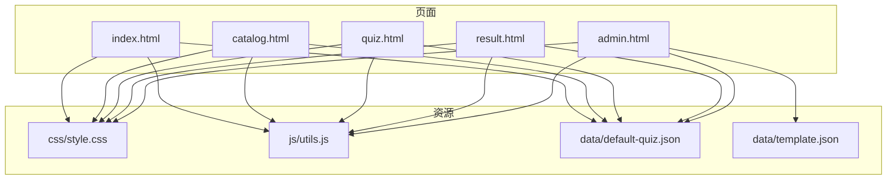
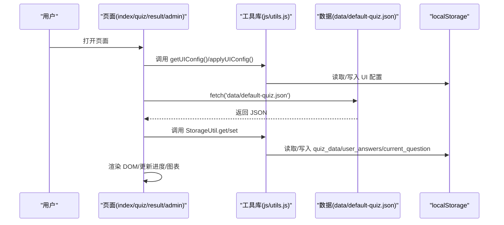
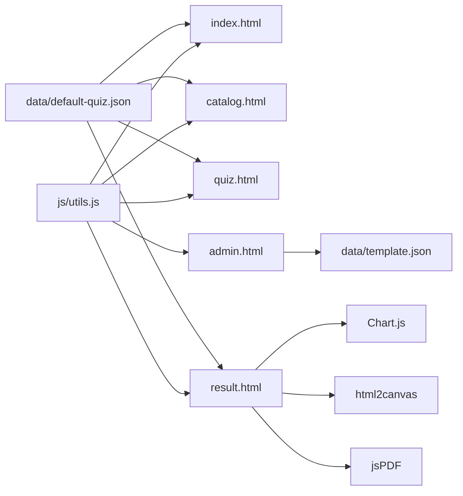

# 代码规范

<cite>
**本文引用的文件**
- [css/style.css](file://css/style.css)
- [js/utils.js](file://js/utils.js)
- [index.html](file://index.html)
- [quiz.html](file://quiz.html)
- [result.html](file://result.html)
- [admin.html](file://admin.html)
- [catalog.html](file://catalog.html)
- [data/default-quiz.json](file://data/default-quiz.json)
- [data/template.json](file://data/template.json)
</cite>

## 目录
1. [简介](#简介)
2. [项目结构](#项目结构)
3. [核心组件](#核心组件)
4. [架构总览](#架构总览)
5. [详细组件分析](#详细组件分析)
6. [依赖关系分析](#依赖关系分析)
7. [性能考量](#性能考量)
8. [故障排查指南](#故障排查指南)
9. [结论](#结论)
10. [附录](#附录)

## 简介
本文件为“心理测试 v2”项目的代码规范标准，覆盖 JavaScript 编码规范、CSS 样式规范、文件与目录命名约定、模块导入导出标准、代码格式化工具配置建议以及代码审查检查清单与最佳实践。目标是统一团队开发风格，提升一致性与可维护性。

## 项目结构
项目采用扁平的静态站点结构，按页面与资源分类：
- 根目录包含页面文件与数据文件
- css/style.css 为全局样式入口
- js/utils.js 为通用工具库
- data/default-quiz.json 与 data/template.json 为测试数据模板

**图表来源**
- [index.html](file://index.html)
- [catalog.html](file://catalog.html)
- [quiz.html](file://quiz.html)
- [result.html](file://result.html)
- [admin.html](file://admin.html)
- [css/style.css](file://css/style.css)
- [js/utils.js](file://js/utils.js)
- [data/default-quiz.json](file://data/default-quiz.json)
- [data/template.json](file://data/template.json)

**章节来源**
- [index.html](file://index.html)
- [css/style.css](file://css/style.css)
- [js/utils.js](file://js/utils.js)
- [data/default-quiz.json](file://data/default-quiz.json)
- [data/template.json](file://data/template.json)

## 核心组件
- 工具库（js/utils.js）：封装本地存储、数据校验、通用工具函数、UI 配置应用等
- 全局样式（css/style.css）：定义 CSS 变量、重置、布局、组件样式、响应式与动画
- 页面逻辑（index/quiz/result/admin/catalog.html）：页面级脚本负责数据加载、渲染、交互与状态持久化

**章节来源**
- [js/utils.js](file://js/utils.js)
- [css/style.css](file://css/style.css)
- [index.html](file://index.html)
- [quiz.html](file://quiz.html)
- [result.html](file://result.html)
- [admin.html](file://admin.html)
- [catalog.html](file://catalog.html)

## 架构总览
整体为“页面 + 工具库 + 数据”的前端单页应用架构。页面通过 fetch 与 localStorage 与数据交互；工具库提供跨页面共享能力。

**图表来源**
- [index.html](file://index.html)
- [quiz.html](file://quiz.html)
- [result.html](file://result.html)
- [admin.html](file://admin.html)
- [js/utils.js](file://js/utils.js)
- [data/default-quiz.json](file://data/default-quiz.json)

## 详细组件分析

### JavaScript 编码规范
- 命名约定
  - 常量：使用全大写下划线风格（如 StorageKeys）
  - 类名：帕斯卡命名（如 StorageUtil、QuizValidator）
  - 函数/方法：驼峰命名（如 getUIConfig、applyUIConfig）
  - 变量：驼峰命名（如 quizData、answers）
  - 导出：统一导出对象或模块接口（支持 CommonJS）

- 函数定义模式
  - 类方法使用静态方法（如 StorageUtil.set/get）
  - 工具函数采用纯函数风格，避免副作用
  - 异步函数优先使用 async/await，错误处理使用 try/catch

- 注释规范
  - 文件顶部添加模块/文件用途说明
  - 类与公共方法添加 JSDoc 风格注释，说明参数、返回值与异常
  - 复杂逻辑处添加行内注释，解释关键步骤

- 错误处理
  - 所有异步操作捕获异常并记录日志
  - 用户可见错误通过页面提示（如 alert 或 alert 类样式）
  - 数据校验失败返回结构化错误数组

- 代码组织
  - 将跨页面使用的工具集中于 utils.js
  - 页面内脚本保持职责单一，避免全局污染
  - 使用模块化导出，便于按需引入

- 最佳实践示例
  - 使用防抖函数优化高频事件（如 resize）
  - 使用 Promise/FileReader 读取本地 JSON 文件
  - 使用 localStorage 存储用户进度与 UI 配置

**章节来源**
- [js/utils.js](file://js/utils.js)
- [index.html](file://index.html)
- [quiz.html](file://quiz.html)
- [result.html](file://result.html)
- [admin.html](file://admin.html)

### CSS 样式规范
- 类名命名规则
  - 采用 BEM 风格或语义化命名（如 .card、.btn、.progress-container）
  - 组件类与修饰类分离，避免深层嵌套
  - 状态类（如 .active、.hidden）用于控制显隐与状态

- 选择器使用原则
  - 优先使用类选择器，避免过度使用标签选择器
  - 避免使用内联样式，统一通过类控制
  - 通过容器类包裹，减少全局样式冲突

- 响应式设计规范
  - 在 768px 断点下进行移动端适配
  - 使用相对单位（rem/em/%）与媒体查询
  - 移动端优先布局，如列变单列、按钮纵向排列

- CSS 变量使用标准
  - 在 :root 定义主题变量（颜色、字体、圆角、阴影、过渡）
  - 通过 CSS 变量实现主题切换与动态样式
  - 在 JS 中通过 setProperty 动态更新变量

- 样式组织
  - 将通用样式、组件样式、页面样式分层组织
  - 使用注释块划分区域（如“按钮样式”、“导航栏”、“结果页样式”）

**章节来源**
- [css/style.css](file://css/style.css)
- [index.html](file://index.html)
- [quiz.html](file://quiz.html)
- [result.html](file://result.html)
- [admin.html](file://admin.html)
- [catalog.html](file://catalog.html)

### 文件命名约定与目录结构
- 文件命名
  - HTML：语义化小写短横线命名（如 index.html、quiz.html）
  - JS：utils.js 等工具文件采用小驼峰命名
  - CSS：style.css 作为全局样式入口
  - JSON：default-quiz.json、template.json 语义化命名

- 目录结构
  - 保持扁平结构，便于部署与访问
  - 资源按类型分目录（assets/images、css、data、js）

- 模块导入导出标准
  - 工具库统一导出对象（支持 CommonJS），页面通过 script 标签引入
  - 页面内脚本仅暴露必要的全局函数（如 selectScale、selectChoice），其余私有化

**章节来源**
- [index.html](file://index.html)
- [css/style.css](file://css/style.css)
- [js/utils.js](file://js/utils.js)
- [data/default-quiz.json](file://data/default-quiz.json)
- [data/template.json](file://data/template.json)

### 代码格式化工具配置（建议）
- Prettier
  - 推荐配置：单引号、尾逗号、分号可选、缩进 2 空格、换行符统一
  - 规则：禁止内联样式、禁止魔法数字、禁止未使用变量
  - 集成：VSCode 插件、Git Hooks 自动格式化

- ESLint
  - 推荐规则：no-unused-vars、no-console、prefer-const、camelCase、consistent-return
  - 规则：禁用 eval、禁止 debugger、严格相等
  - 集成：与 Prettier 配合，使用 eslint-config-prettier 关闭冲突规则

- Git Hooks
  - 使用 husky + lint-staged 在提交前自动格式化与检查

（本节为通用建议，非仓库现有配置）

### 代码审查检查清单
- JavaScript
  - 是否使用统一命名约定（常量/类/函数/变量）
  - 是否存在未捕获的异步错误
  - 是否使用防抖/节流优化性能
  - 是否存在全局变量污染
  - 是否正确处理 localStorage 读写异常
  - 是否对用户输入与外部 JSON 进行校验

- CSS
  - 是否使用 CSS 变量统一主题
  - 是否遵循 BEM 命名与选择器原则
  - 是否在 768px 断点下进行移动端适配
  - 是否存在重复或冗余样式

- HTML
  - 是否正确引入样式与脚本
  - 是否使用语义化标签与可访问性属性
  - 是否存在内联样式

- 数据
  - JSON 字段是否完整且符合模板
  - 是否提供默认数据回退路径

**章节来源**
- [js/utils.js](file://js/utils.js)
- [css/style.css](file://css/style.css)
- [index.html](file://index.html)
- [quiz.html](file://quiz.html)
- [result.html](file://result.html)
- [admin.html](file://admin.html)
- [catalog.html](file://catalog.html)
- [data/default-quiz.json](file://data/default-quiz.json)
- [data/template.json](file://data/template.json)

## 依赖关系分析
- 页面对工具库的依赖：所有页面均依赖 utils.js（StorageUtil、Utils、UI 配置）
- 页面对数据的依赖：index/quiz/result/catalog 页面依赖 default-quiz.json
- 页面对第三方库的依赖：result.html 依赖 Chart.js、html2canvas、jsPDF
- 页面间导航：通过相对路径跳转（如 quiz.html -> result.html）

**图表来源**
- [js/utils.js](file://js/utils.js)
- [index.html](file://index.html)
- [catalog.html](file://catalog.html)
- [quiz.html](file://quiz.html)
- [result.html](file://result.html)
- [admin.html](file://admin.html)
- [data/default-quiz.json](file://data/default-quiz.json)
- [data/template.json](file://data/template.json)

**章节来源**
- [index.html](file://index.html)
- [quiz.html](file://quiz.html)
- [result.html](file://result.html)
- [admin.html](file://admin.html)
- [catalog.html](file://catalog.html)
- [js/utils.js](file://js/utils.js)
- [data/default-quiz.json](file://data/default-quiz.json)
- [data/template.json](file://data/template.json)

## 性能考量
- 资源加载
  - 合理拆分脚本，避免单页面引入过多依赖
  - 对第三方库（Chart.js、html2canvas、jsPDF）按需加载

- 交互性能
  - 使用防抖/节流处理高频事件（如滚动、窗口尺寸变化）
  - 控制 DOM 操作频率，批量更新节点

- 数据访问
  - 优先使用 localStorage 缓存，减少网络请求
  - 对大 JSON 数据进行分页或懒加载

- 样式性能
  - 使用 CSS 变量与 transform/opacity 动画
  - 避免强制同步布局与复杂选择器

（本节为通用指导，非仓库特定实现细节）

## 故障排查指南
- 页面空白或样式丢失
  - 检查 CSS 路径是否正确
  - 确认浏览器控制台无跨域或 404 错误

- 无法加载测试数据
  - 检查 default-quiz.json 是否存在且格式正确
  - 确认 fetch 请求成功，必要时回退到内置默认数据

- 本地存储异常
  - 检查浏览器隐私模式或存储限制
  - 确认 StorageUtil 的 get/set 方法未抛出异常

- 图表不显示
  - 确认 Chart.js 正确加载
  - 检查 Canvas 容器是否存在且尺寸有效

- 管理后台无法上传题目
  - 确认文件为合法 JSON
  - 查看验证结果提示，修正缺失字段

**章节来源**
- [index.html](file://index.html)
- [quiz.html](file://quiz.html)
- [result.html](file://result.html)
- [admin.html](file://admin.html)
- [js/utils.js](file://js/utils.js)
- [data/default-quiz.json](file://data/default-quiz.json)

## 结论
本规范以“统一命名、清晰注释、模块化组织、强健错误处理、响应式与主题化设计”为核心，结合项目现有实现，形成可落地的开发标准。建议团队在开发过程中持续遵循并定期回顾，以保证代码质量与可维护性。

## 附录
- 最佳实践示例路径
  - 工具库导出与模块化：[js/utils.js](file://js/utils.js)
  - 页面数据加载与回退策略：[index.html](file://index.html)
  - 量表题与选择题渲染逻辑：[quiz.html](file://quiz.html)
  - 结果计算与图表渲染：[result.html](file://result.html)
  - 管理后台数据校验与应用：[admin.html](file://admin.html)
  - 全局样式与响应式断点：[css/style.css](file://css/style.css)
  - 测试数据模板与默认数据：[data/template.json](file://data/template.json)、[data/default-quiz.json](file://data/default-quiz.json)