# 开发指南

<cite>
**本文档引用的文件**
- [index.html](file://index.html)
- [quiz.html](file://quiz.html)
- [result.html](file://result.html)
- [admin.html](file://admin.html)
- [catalog.html](file://catalog.html)
- [css/style.css](file://css/style.css)
- [js/utils.js](file://js/utils.js)
- [data/default-quiz.json](file://data/default-quiz.json)
- [data/template.json](file://data/template.json)
</cite>

## 目录
1. [简介](#简介)
2. [项目结构](#项目结构)
3. [核心组件](#核心组件)
4. [架构概览](#架构概览)
5. [详细组件分析](#详细组件分析)
6. [依赖关系分析](#依赖关系分析)
7. [性能考虑](#性能考虑)
8. [调试技巧](#调试技巧)
9. [开发环境搭建](#开发环境搭建)
10. [代码规范](#代码规范)
11. [测试方法](#测试方法)
12. [构建优化](#构建优化)
13. [部署策略](#部署策略)
14. [工具库使用](#工具库使用)
15. [数据验证规则](#数据验证规则)
16. [UI配置系统](#ui配置系统)
17. [扩展机制](#扩展机制)
18. [最佳实践](#最佳实践)
19. [故障排除指南](#故障排除指南)
20. [结论](#结论)

## 简介

心理测试 v2 是一个基于 Web 的心理测评系统，采用纯前端技术栈实现，无需服务器端支持。该系统提供了完整的心理测试体验，包括测试展示、答题交互、结果分析和管理后台等功能模块。

系统的核心特色包括：
- **纯前端实现**：使用 HTML5、CSS3 和 JavaScript 构建，无需服务器端支持
- **响应式设计**：适配各种设备尺寸，提供优秀的移动端体验
- **数据持久化**：利用浏览器 LocalStorage 实现用户进度和配置的本地存储
- **可视化分析**：集成 Chart.js 实现测试结果的图表展示
- **灵活的配置系统**：支持 UI 主题、文字内容和题目数据的动态配置

## 项目结构

该项目采用扁平化的文件组织结构，所有静态资源按功能模块进行分类：

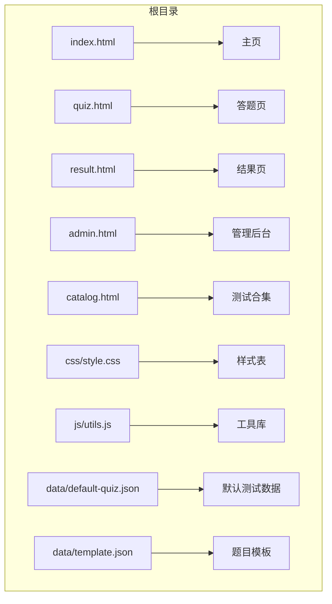
```mermaid
graph TB
subgraph "根目录"
A[index.html] --> B[主页]
C[quiz.html] --> D[答题页]
E[result.html] --> F[结果页]
G[admin.html] --> H[管理后台]
I[catalog.html] --> J[测试合集]
K[css/style.css] --> L[样式表]
M[js/utils.js] --> N[工具库]
O[data/default-quiz.json] --> P[默认测试数据]
Q[data/template.json] --> R[题目模板]
end
```

**图表来源**
- [index.html:1-154](file://index.html#L1-L154)
- [quiz.html:1-259](file://quiz.html#L1-L259)
- [result.html:1-363](file://result.html#L1-L363)
- [admin.html:1-402](file://admin.html#L1-L402)
- [catalog.html:1-105](file://catalog.html#L1-L105)

**章节来源**
- [index.html:1-154](file://index.html#L1-L154)
- [css/style.css:1-731](file://css/style.css#L1-L731)
- [js/utils.js:1-250](file://js/utils.js#L1-L250)
- [data/default-quiz.json:1-235](file://data/default-quiz.json#L1-L235)

## 核心组件

### 数据模型架构

系统采用统一的数据模型来管理测试相关的所有信息：

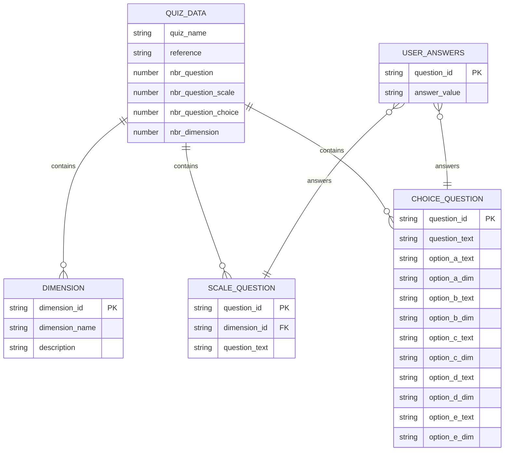
```mermaid
erDiagram
QUIZ_DATA {
string quiz_name
string reference
number nbr_question
number nbr_question_scale
number nbr_question_choice
number nbr_dimension
}
DIMENSION {
string dimension_id PK
string dimension_name
string description
}
SCALE_QUESTION {
string question_id PK
string dimension_id FK
string question_text
}
CHOICE_QUESTION {
string question_id PK
string question_text
string option_a_text
string option_a_dim
string option_b_text
string option_b_dim
string option_c_text
string option_c_dim
string option_d_text
string option_d_dim
string option_e_text
string option_e_dim
}
USER_ANSWERS {
string question_id PK
string answer_value
}
QUIZ_DATA ||--o{ DIMENSION : contains
QUIZ_DATA ||--o{ SCALE_QUESTION : contains
QUIZ_DATA ||--o{ CHOICE_QUESTION : contains
USER_ANSWERS }o--|| SCALE_QUESTION : answers
USER_ANSWERS }o--|| CHOICE_QUESTION : answers
```

**图表来源**
- [data/default-quiz.json:1-235](file://data/default-quiz.json#L1-L235)
- [js/utils.js:55-126](file://js/utils.js#L55-L126)

### 存储系统设计

系统使用 LocalStorage 实现数据持久化，支持多种数据类型的存储：

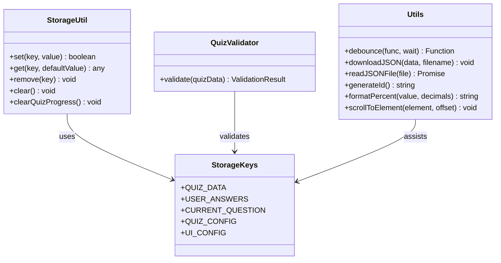
```mermaid
classDiagram
class StorageKeys {
+QUIZ_DATA
+USER_ANSWERS
+CURRENT_QUESTION
+QUIZ_CONFIG
+UI_CONFIG
}
class StorageUtil {
+set(key, value) boolean
+get(key, defaultValue) any
+remove(key) void
+clear() void
+clearQuizProgress() void
}
class QuizValidator {
+validate(quizData) ValidationResult
}
class Utils {
+debounce(func, wait) Function
+downloadJSON(data, filename) void
+readJSONFile(file) Promise
+generateId() string
+formatPercent(value, decimals) string
+scrollToElement(element, offset) void
}
StorageUtil --> StorageKeys : uses
QuizValidator --> StorageKeys : validates
Utils --> StorageKeys : assists
```

**图表来源**
- [js/utils.js:6-50](file://js/utils.js#L6-L50)
- [js/utils.js:55-126](file://js/utils.js#L55-L126)
- [js/utils.js:131-202](file://js/utils.js#L131-L202)

**章节来源**
- [js/utils.js:1-250](file://js/utils.js#L1-L250)
- [data/default-quiz.json:1-235](file://data/default-quiz.json#L1-L235)

## 架构概览

### 整体架构设计

系统采用模块化架构，每个页面都是独立的功能模块，通过共享的工具库和样式表实现统一的用户体验：

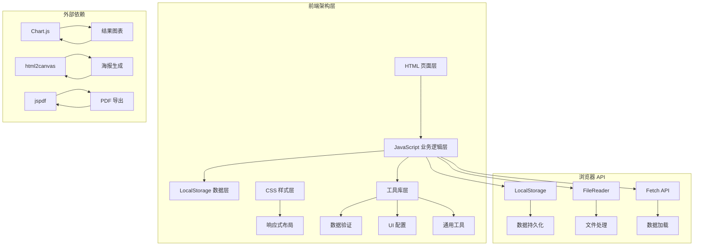
```mermaid
graph TB
subgraph "前端架构层"
A[HTML 页面层] --> B[JavaScript 业务逻辑层]
B --> C[LocalStorage 数据层]
D[CSS 样式层] --> E[响应式布局]
F[工具库层] --> G[数据验证]
F --> H[UI 配置]
F --> I[通用工具]
end
subgraph "外部依赖"
J[Chart.js] --> K[结果图表]
L[html2canvas] --> M[海报生成]
N[jspdf] --> O[PDF 导出]
end
subgraph "浏览器 API"
P[LocalStorage] --> Q[数据持久化]
R[FileReader] --> S[文件处理]
T[Fetch API] --> U[数据加载]
end
B --> F
B --> P
B --> R
B --> T
K --> J
M --> L
O --> N
```

**图表来源**
- [index.html:68-151](file://index.html#L68-L151)
- [quiz.html:49-256](file://quiz.html#L49-L256)
- [result.html:85-360](file://result.html#L85-L360)
- [admin.html:171-399](file://admin.html#L171-L399)

### 数据流架构

系统的数据流遵循单向数据流原则，确保数据的一致性和可预测性：

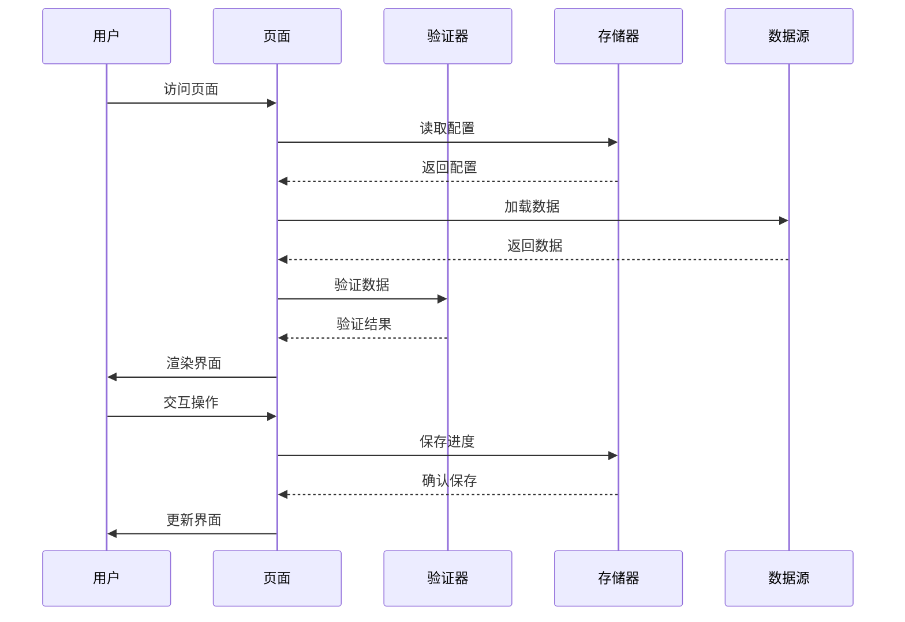
```mermaid
sequenceDiagram
participant U as 用户
participant P as 页面
participant V as 验证器
participant S as 存储器
participant D as 数据源
U->>P : 访问页面
P->>S : 读取配置
S-->>P : 返回配置
P->>D : 加载数据
D-->>P : 返回数据
P->>V : 验证数据
V-->>P : 验证结果
P->>U : 渲染界面
U->>P : 交互操作
P->>S : 保存进度
S-->>P : 确认保存
P->>U : 更新界面
```

**图表来源**
- [js/utils.js:17-50](file://js/utils.js#L17-L50)
- [js/utils.js:55-126](file://js/utils.js#L55-L126)
- [admin.html:252-291](file://admin.html#L252-L291)

**章节来源**
- [index.html:68-151](file://index.html#L68-L151)
- [quiz.html:60-98](file://quiz.html#L60-L98)
- [result.html:330-359](file://result.html#L330-L359)
- [admin.html:188-203](file://admin.html#L188-L203)

## 详细组件分析

### 主页组件 (index.html)

主页负责展示测试的基本信息和引导用户进入答题流程：

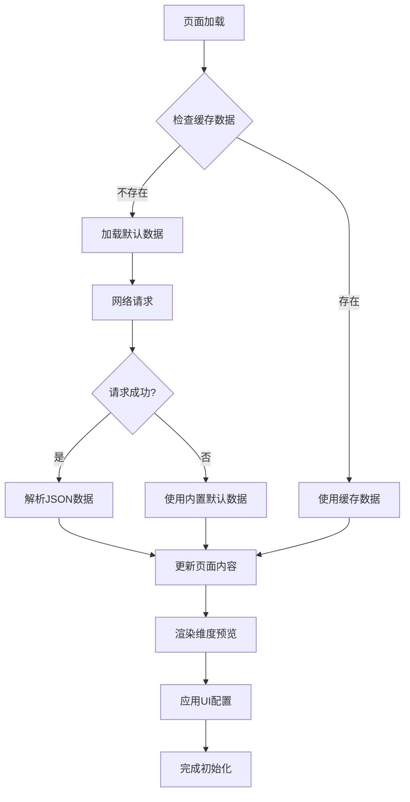
```mermaid
flowchart TD
A[页面加载] --> B{检查缓存数据}
B --> |存在| C[使用缓存数据]
B --> |不存在| D[加载默认数据]
D --> E[网络请求]
E --> F{请求成功?}
F --> |是| G[解析JSON数据]
F --> |否| H[使用内置默认数据]
G --> I[更新页面内容]
H --> I
C --> I
I --> J[渲染维度预览]
J --> K[应用UI配置]
K --> L[完成初始化]
```

**图表来源**
- [index.html:84-144](file://index.html#L84-L144)

#### 核心功能特性

- **智能数据加载**：优先使用 LocalStorage 缓存，失败时回退到默认数据
- **动态内容渲染**：根据测试数据动态生成维度卡片
- **进度指示器**：使用 CSS 动画展示页面加载进度

**章节来源**
- [index.html:84-144](file://index.html#L84-L144)

### 答题组件 (quiz.html)

答题组件实现了完整的测试交互流程，支持量表题和选择题两种类型：

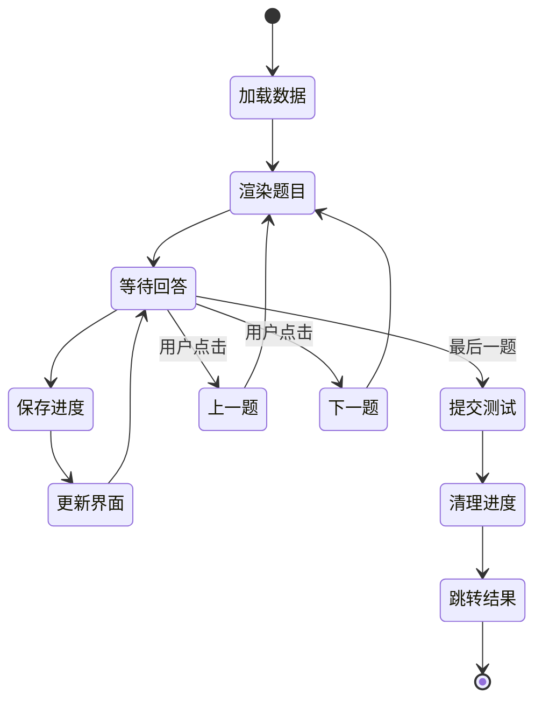
```mermaid
stateDiagram-v2
[*] --> 加载数据
加载数据 --> 渲染题目
渲染题目 --> 等待回答
等待回答 --> 保存进度
保存进度 --> 更新界面
更新界面 --> 等待回答
等待回答 --> 提交测试 : 最后一题
提交测试 --> 清理进度
清理进度 --> 跳转结果
跳转结果 --> [*]
等待回答 --> 上一题 : 用户点击
上一题 --> 渲染题目
等待回答 --> 下一题 : 用户点击
下一题 --> 渲染题目
```

**图表来源**
- [quiz.html:100-175](file://quiz.html#L100-L175)
- [quiz.html:217-235](file://quiz.html#L217-L235)

#### 量表题处理逻辑

量表题采用 1-5 分制评分，用户通过点击数字按钮选择答案：

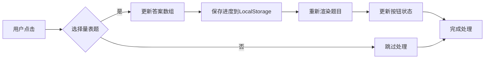
```mermaid
flowchart LR
A[用户点击] --> B{选择量表题}
B --> |是| C[更新答案数组]
B --> |否| D[跳过处理]
C --> E[保存进度到LocalStorage]
E --> F[重新渲染题目]
F --> G[更新按钮状态]
G --> H[完成处理]
D --> H
```

**图表来源**
- [quiz.html:159-175](file://quiz.html#L159-L175)

#### 选择题处理逻辑

选择题支持 A-E 五个选项，每个选项对应不同的测试维度：

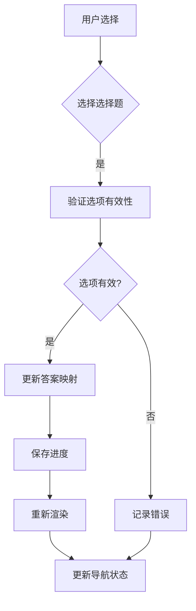
```mermaid
flowchart TD
A[用户选择] --> B{选择选择题}
B --> |是| C[验证选项有效性]
C --> D{选项有效?}
D --> |是| E[更新答案映射]
D --> |否| F[记录错误]
E --> G[保存进度]
G --> H[重新渲染]
H --> I[更新导航状态]
F --> I
```

**图表来源**
- [quiz.html:168-175](file://quiz.html#L168-L175)

**章节来源**
- [quiz.html:100-175](file://quiz.html#L100-L175)
- [quiz.html:217-235](file://quiz.html#L217-L235)

### 结果分析组件 (result.html)

结果分析组件负责计算测试分数并生成可视化报告：

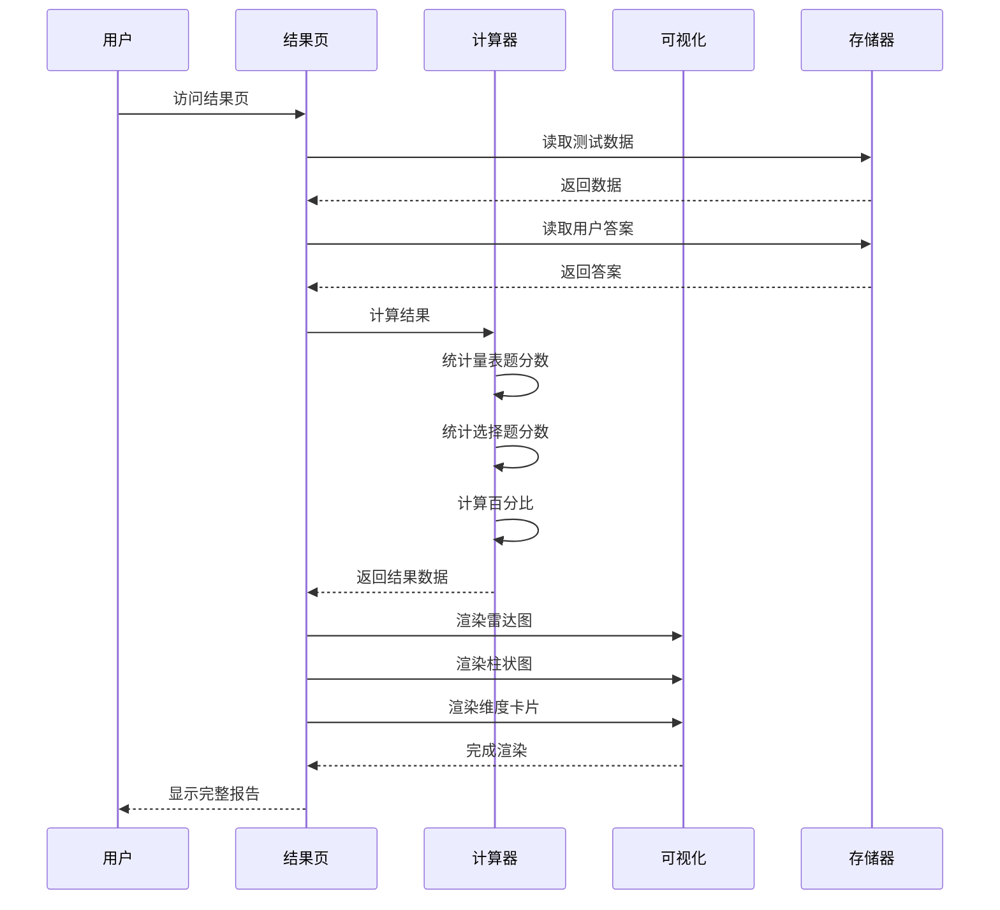
```mermaid
sequenceDiagram
participant U as 用户
participant R as 结果页
participant C as 计算器
participant V as 可视化
participant S as 存储器
U->>R : 访问结果页
R->>S : 读取测试数据
S-->>R : 返回数据
R->>S : 读取用户答案
S-->>R : 返回答案
R->>C : 计算结果
C->>C : 统计量表题分数
C->>C : 统计选择题分数
C->>C : 计算百分比
C-->>R : 返回结果数据
R->>V : 渲染雷达图
R->>V : 渲染柱状图
R->>V : 渲染维度卡片
V-->>R : 完成渲染
R-->>U : 显示完整报告
```

**图表来源**
- [result.html:94-133](file://result.html#L94-L133)
- [result.html:153-240](file://result.html#L153-L240)

#### 分数计算算法

系统采用加权平均算法计算各维度得分：

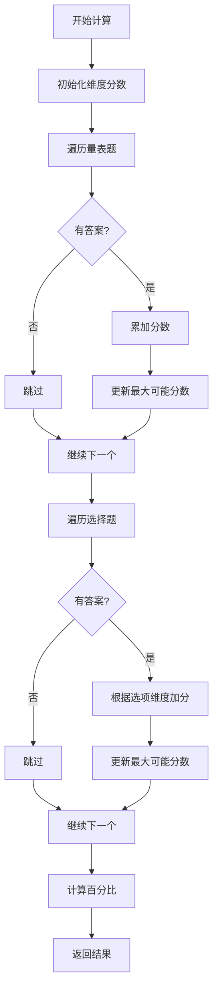
```mermaid
flowchart TD
A[开始计算] --> B[初始化维度分数]
B --> C[遍历量表题]
C --> D{有答案?}
D --> |是| E[累加分数]
D --> |否| F[跳过]
E --> G[更新最大可能分数]
F --> H[继续下一个]
G --> H
H --> I[遍历选择题]
I --> J{有答案?}
J --> |是| K[根据选项维度加分]
J --> |否| L[跳过]
K --> M[更新最大可能分数]
L --> N[继续下一个]
M --> N
N --> O[计算百分比]
O --> P[返回结果]
```

**图表来源**
- [result.html:94-133](file://result.html#L94-L133)

**章节来源**
- [result.html:94-133](file://result.html#L94-L133)
- [result.html:153-240](file://result.html#L153-L240)

### 管理后台组件 (admin.html)

管理后台提供了完整的测试内容管理系统：

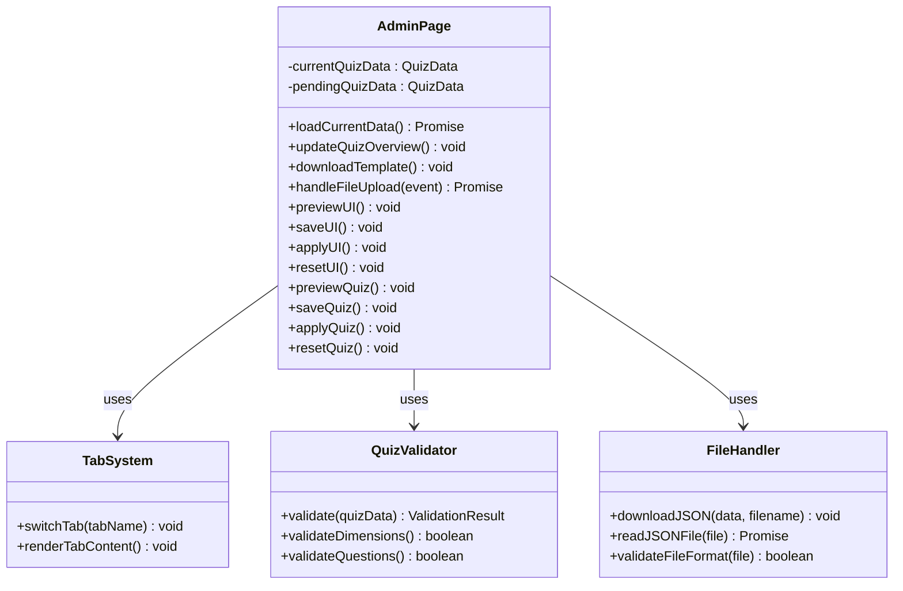
```mermaid
classDiagram
class AdminPage {
-currentQuizData : QuizData
-pendingQuizData : QuizData
+loadCurrentData() Promise
+updateQuizOverview() void
+downloadTemplate() void
+handleFileUpload(event) Promise
+previewUI() void
+saveUI() void
+applyUI() void
+resetUI() void
+previewQuiz() void
+saveQuiz() void
+applyQuiz() void
+resetQuiz() void
}
class TabSystem {
+switchTab(tabName) void
+renderTabContent() void
}
class QuizValidator {
+validate(quizData) ValidationResult
+validateDimensions() boolean
+validateQuestions() boolean
}
class FileHandler {
+downloadJSON(data, filename) void
+readJSONFile(file) Promise
+validateFileFormat(file) boolean
}
AdminPage --> TabSystem : uses
AdminPage --> QuizValidator : uses
AdminPage --> FileHandler : uses
```

**图表来源**
- [admin.html:172-399](file://admin.html#L172-L399)
- [js/utils.js:55-126](file://js/utils.js#L55-L126)

#### 标签页系统

管理后台采用标签页切换机制，支持三个主要功能模块：

| 标签页 | 功能 | 主要组件 |
|--------|------|----------|
| UI界面 | 界面主题配置 | 颜色选择器、字体选择、圆角设置 |
| 文字&配图 | 文本内容配置 | 输入框、预览功能 |
| 题目管理 | 题目数据管理 | 模板下载、文件上传、验证 |

**章节来源**
- [admin.html:27-163](file://admin.html#L27-L163)
- [admin.html:172-399](file://admin.html#L172-L399)

### 测试合集组件 (catalog.html)

测试合集页面展示了当前可用的测试项目：

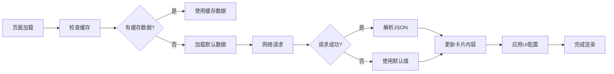
```mermaid
flowchart LR
A[页面加载] --> B[检查缓存]
B --> C{有缓存数据?}
C --> |是| D[使用缓存数据]
C --> |否| E[加载默认数据]
E --> F[网络请求]
F --> G{请求成功?}
G --> |是| H[解析JSON]
G --> |否| I[使用默认值]
H --> J[更新卡片内容]
I --> J
J --> K[应用UI配置]
K --> L[完成渲染]
```

**图表来源**
- [catalog.html:76-95](file://catalog.html#L76-L95)

**章节来源**
- [catalog.html:76-95](file://catalog.html#L76-L95)

## 依赖关系分析

### 外部依赖管理

系统对外部依赖的管理采用 CDN 引入的方式，确保资源的可靠性和性能：

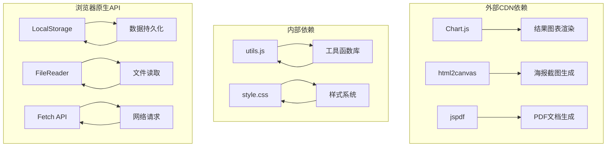
```mermaid
graph TB
subgraph "外部CDN依赖"
A[Chart.js] --> B[结果图表渲染]
C[html2canvas] --> D[海报截图生成]
E[jspdf] --> F[PDF文档生成]
end
subgraph "内部依赖"
G[utils.js] --> H[工具函数库]
I[style.css] --> J[样式系统]
end
subgraph "浏览器原生API"
K[LocalStorage] --> L[数据持久化]
M[FileReader] --> N[文件读取]
O[Fetch API] --> P[网络请求]
end
H --> G
J --> I
L --> K
N --> M
P --> O
```

**图表来源**
- [result.html:8-10](file://result.html#L8-L10)
- [index.html:68-68](file://index.html#L68-L68)
- [quiz.html:49-49](file://quiz.html#L49-L49)
- [admin.html:171-171](file://admin.html#L171-L171)

### 内部模块依赖

系统内部模块之间的依赖关系清晰且松散耦合：

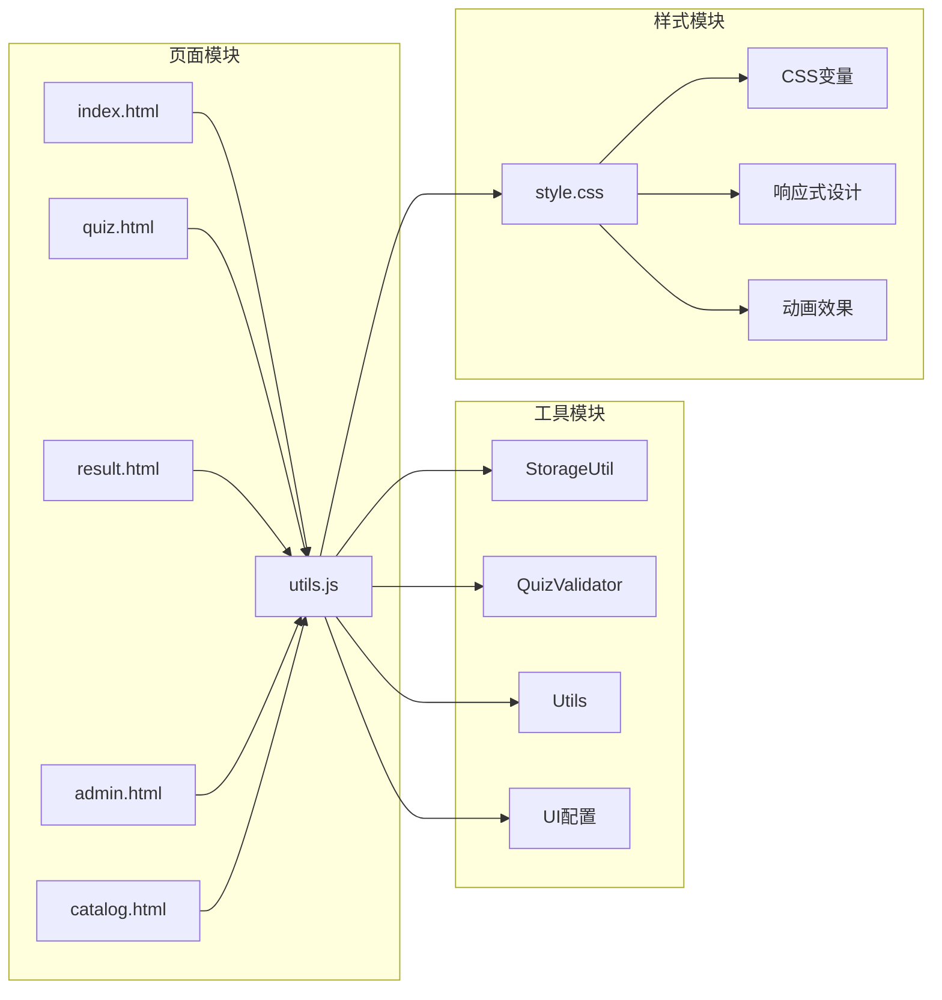
```mermaid
graph LR
subgraph "页面模块"
A[index.html] --> B[utils.js]
C[quiz.html] --> B
D[result.html] --> B
E[admin.html] --> B
F[catalog.html] --> B
end
subgraph "工具模块"
B --> G[StorageUtil]
B --> H[QuizValidator]
B --> I[Utils]
B --> J[UI配置]
end
subgraph "样式模块"
K[style.css] --> L[CSS变量]
K --> M[响应式设计]
K --> N[动画效果]
end
B --> K
```

**图表来源**
- [js/utils.js:1-250](file://js/utils.js#L1-L250)
- [css/style.css:1-731](file://css/style.css#L1-L731)

**章节来源**
- [js/utils.js:1-250](file://js/utils.js#L1-L250)
- [css/style.css:1-731](file://css/style.css#L1-L731)

## 性能考虑

### 加载性能优化

系统采用了多种策略来优化页面加载性能：

1. **延迟加载策略**：非关键资源采用异步加载
2. **缓存机制**：充分利用浏览器缓存和 LocalStorage
3. **资源压缩**：CSS 和 JavaScript 文件经过压缩处理
4. **按需加载**：仅在需要时加载外部依赖库

### 内存管理

系统在内存管理方面采取了以下措施：

- **及时清理**：不再使用的事件监听器和定时器及时清理
- **数据压缩**：存储的数据经过 JSON 序列化压缩
- **垃圾回收**：避免创建不必要的全局变量

### 响应式性能

针对不同设备的性能优化：

- **媒体查询**：使用 CSS 媒体查询优化移动端体验
- **触摸优化**：按钮和交互元素的尺寸适合触摸操作
- **动画优化**：使用 CSS3 动画替代 JavaScript 动画

## 调试技巧

### 浏览器开发者工具使用

1. **控制台调试**：
   - 使用 `console.log()` 输出关键变量值
   - 利用断点调试 JavaScript 代码执行流程
   - 检查网络请求的响应时间和错误

2. **存储调试**：
   - 在 Application 面板检查 LocalStorage 内容
   - 验证数据的序列化和反序列化过程
   - 监控数据的存储和清除操作

3. **网络调试**：
   - 检查 JSON 文件的加载状态
   - 验证 API 请求的正确性和响应格式
   - 监控外部依赖库的加载情况

### 常见问题诊断

1. **数据加载失败**：
   - 检查 JSON 文件格式是否正确
   - 验证文件路径和访问权限
   - 确认跨域资源共享设置

2. **UI 配置不生效**：
   - 检查 CSS 变量的覆盖顺序
   - 验证 LocalStorage 中的配置数据
   - 确认样式表的加载顺序

3. **图表渲染异常**：
   - 检查 Chart.js 库的版本兼容性
   - 验证数据格式和数据完整性
   - 确认 Canvas 元素的可用性

**章节来源**
- [js/utils.js:18-36](file://js/utils.js#L18-L36)
- [admin.html:252-291](file://admin.html#L252-L291)

## 开发环境搭建

### 系统要求

- **操作系统**：Windows、macOS 或 Linux
- **浏览器**：Chrome 80+、Firefox 75+、Safari 13+
- **开发工具**：任意文本编辑器或 IDE
- **Node.js**：可选，用于构建工具链

### 本地开发步骤

1. **克隆项目**：
   ```bash
   git clone https://github.com/your-repo/psychological-test-v2.git
   cd psychological-test-v2
   ```

2. **启动本地服务器**：
   ```bash
   # 方法1：使用浏览器直接打开
   open index.html
   
   # 方法2：使用 Python 内置服务器
   python -m http.server 8000
   
   # 方法3：使用 Node.js http-server
   npx http-server
   ```

3. **验证安装**：
   - 打开浏览器访问 `http://localhost:8000`
   - 确认所有页面正常加载
   - 测试基本功能是否可用

### 开发工具推荐

- **代码编辑器**：VS Code、WebStorm 或 Sublime Text
- **浏览器扩展**：React DevTools、Vue DevTools（用于调试）
- **调试工具**：BrowserSync 实现实时刷新
- **代码格式化**：Prettier 配合 ESLint

## 代码规范

### JavaScript 编码规范

#### 命名约定

- **变量和函数**：使用 camelCase 命名法
- **常量**：使用 UPPER_SNAKE_CASE 命名法
- **类名**：使用 PascalCase 命名法
- **文件名**：使用 kebab-case 命名法

#### 代码风格

- **缩进**：使用 4 个空格
- **行长度**：不超过 120 个字符
- **注释**：使用 // 进行单行注释
- **空行**：函数之间使用空行分隔

#### 错误处理

```javascript
// 推荐的错误处理模式
try {
    // 业务逻辑
} catch (error) {
    console.error('操作失败:', error.message);
    // 回退逻辑
}
```

### CSS 样式规范

#### 命名约定

- **类名**：使用短横线分隔的 kebab-case
- **ID**：使用驼峰命名法
- **变量**：使用 CSS 自定义属性命名法 (--variable-name)

#### 结构组织

```css
/* 推荐的 CSS 组织结构 */
.component-class {
    /* 基础样式 */
}

.component-class:hover {
    /* 悬停状态 */
}

.component-class.active {
    /* 激活状态 */
}

@media (max-width: 768px) {
    .component-class {
        /* 移动端样式 */
    }
}
```

### HTML 结构规范

#### 语义化标签

- 使用语义化 HTML5 标签
- 正确使用语义化类名
- 避免过度 div 嵌套

#### 属性规范

- 属性值使用双引号
- 布尔属性正确书写
- 自闭合标签正确闭合

## 测试方法

### 单元测试

由于项目采用纯前端实现，主要采用以下测试方法：

1. **手动测试**：
   - 功能完整性测试
   - 兼容性测试
   - 性能测试

2. **自动化测试**：
   - 使用 Jest 进行单元测试
   - 使用 Cypress 进行端到端测试
   - 使用 Puppeteer 进行页面自动化测试

### 测试用例设计

#### 核心功能测试

| 测试场景 | 预期结果 | 测试步骤 |
|----------|----------|----------|
| 数据加载失败 | 使用默认数据渲染 | 模拟网络错误，检查降级处理 |
| 用户进度保存 | 进度数据正确保存 | 完成部分测试，刷新页面验证 |
| 图表渲染 | 图表正确显示 | 生成测试数据，检查图表质量 |
| 文件上传验证 | 验证通过后应用 | 上传有效文件，检查验证结果 |

#### 边界条件测试

- **空数据处理**：测试空数组和空对象的处理
- **异常数据处理**：测试格式错误的数据
- **性能边界**：大量数据的处理能力
- **内存泄漏**：长时间运行的内存使用

### 测试环境配置

```javascript
// 测试配置示例
const testConfig = {
    baseUrl: 'http://localhost:8000',
    timeout: 10000,
    retries: 3,
    viewport: {
        width: 1280,
        height: 720
    }
};
```

## 构建优化

### 代码优化策略

1. **Tree Shaking**：移除未使用的代码
2. **代码分割**：按需加载模块
3. **资源压缩**：压缩 CSS、JavaScript 和图片
4. **缓存策略**：合理设置缓存头

### 构建工具配置

```json
{
    "build": {
        "minify": true,
        "sourcemap": false,
        "bundle": true,
        "optimize": {
            "css": true,
            "js": true,
            "images": true
        }
    }
}
```

### 性能监控

- **加载时间**：监控页面首次渲染时间
- **交互延迟**：测量用户操作的响应时间
- **内存使用**：跟踪内存占用情况
- **网络请求**：分析请求次数和大小

## 部署策略

### 部署选项

1. **静态托管**：
   - GitHub Pages
   - Netlify
   - Vercel
   - Firebase Hosting

2. **传统部署**：
   - Apache 服务器
   - Nginx 服务器
   - CDN 分发

### 部署流程

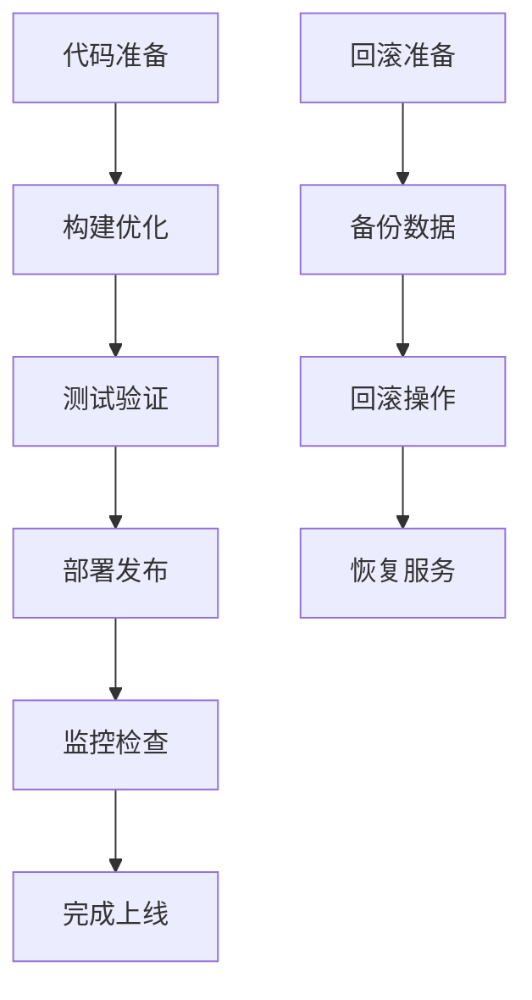
```mermaid
flowchart TD
A[代码准备] --> B[构建优化]
B --> C[测试验证]
C --> D[部署发布]
D --> E[监控检查]
E --> F[完成上线]
G[回滚准备] --> H[备份数据]
H --> I[回滚操作]
I --> J[恢复服务]
```

**图表来源**
- [index.html:1-154](file://index.html#L1-L154)
- [quiz.html:1-259](file://quiz.html#L1-L259)
- [result.html:1-363](file://result.html#L1-L363)

### 安全考虑

- **CORS 配置**：正确设置跨域资源共享
- **HTTPS 强制**：使用 HTTPS 协议传输数据
- **内容安全策略**：防止 XSS 攻击
- **数据验证**：对用户输入进行严格验证

## 工具库使用

### StorageUtil 工具类

StorageUtil 提供了完整的 LocalStorage 操作接口：

```javascript
// 基本使用示例
StorageUtil.set('user_data', userData);
const data = StorageUtil.get('user_data', defaultValue);
StorageUtil.remove('user_data');
StorageUtil.clearQuizProgress();
```

#### 核心功能

- **数据存储**：支持任意类型数据的存储
- **数据读取**：提供默认值回退机制
- **数据清理**：支持单个键删除和批量清理
- **进度管理**：专门的测试进度清理功能

### QuizValidator 验证器

QuizValidator 提供了完整的测试数据验证功能：

```javascript
// 验证示例
const quizData = await Utils.readJSONFile(file);
const validation = QuizValidator.validate(quizData);

if (validation.valid) {
    // 处理有效数据
} else {
    // 显示验证错误
    console.error(validation.errors);
}
```

#### 验证规则

- **必需字段检查**：确保关键字段存在
- **数据类型验证**：验证字段类型正确性
- **结构完整性检查**：确保数据结构完整
- **业务规则验证**：验证数据的业务合理性

### Utils 通用工具

Utils 提供了常用的辅助函数：

```javascript
// 防抖函数
const debouncedFunction = Utils.debounce(() => {
    // 执行防抖操作
}, 300);

// 文件处理
Utils.downloadJSON(data, 'filename.json');
Utils.readJSONFile(file).then(data => {
    // 处理文件数据
});

// UI 工具
Utils.formatPercent(0.75, 1); // 返回 "75.0%"
Utils.scrollToElement(element, 80); // 平滑滚动到元素
```

**章节来源**
- [js/utils.js:17-50](file://js/utils.js#L17-L50)
- [js/utils.js:55-126](file://js/utils.js#L55-L126)
- [js/utils.js:131-202](file://js/utils.js#L131-L202)

## 数据验证规则

### 测试数据结构验证

系统对测试数据实施严格的验证规则：

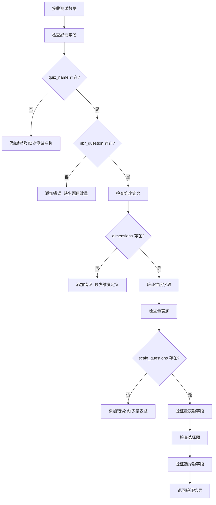
```mermaid
flowchart TD
A[接收测试数据] --> B[检查必需字段]
B --> C{quiz_name 存在?}
C --> |否| D[添加错误: 缺少测试名称]
C --> |是| E{nbr_question 存在?}
E --> |否| F[添加错误: 缺少题目数量]
E --> |是| G[检查维度定义]
G --> H{dimensions 存在?}
H --> |否| I[添加错误: 缺少维度定义]
H --> |是| J[验证维度字段]
J --> K[检查量表题]
K --> L{scale_questions 存在?}
L --> |否| M[添加错误: 缺少量表题]
L --> |是| N[验证量表题字段]
N --> O[检查选择题]
O --> P[验证选择题字段]
P --> Q[返回验证结果]
```

**图表来源**
- [js/utils.js:55-126](file://js/utils.js#L55-L126)

### 字段验证规则

| 字段类型 | 验证规则 | 错误信息 |
|----------|----------|----------|
| quiz_name | 必填字符串 | 缺少测试名称 |
| reference | 可选字符串 | 无 |
| nbr_question | 数字且大于0 | 缺少题目数量 |
| dimensions | 数组且非空 | 缺少维度定义 |
| question_id | 必填且唯一 | 缺少 question_id |
| dimension_id | 必填且匹配 | 缺少 dimension_id |
| question_text | 必填 | 缺少 question_text |
| 选项字段 | 成对出现 | 选项配置错误 |

### 数据完整性检查

系统确保数据的完整性和一致性：

1. **引用完整性**：确保所有引用的维度 ID 都存在
2. **索引完整性**：确保所有问题都有唯一的 ID
3. **内容完整性**：确保所有必需字段都有值
4. **格式完整性**：确保数据格式符合预期

**章节来源**
- [js/utils.js:55-126](file://js/utils.js#L55-L126)
- [data/default-quiz.json:1-235](file://data/default-quiz.json#L1-L235)

## UI配置系统

### 配置系统架构

UI 配置系统采用 CSS 变量驱动的设计：

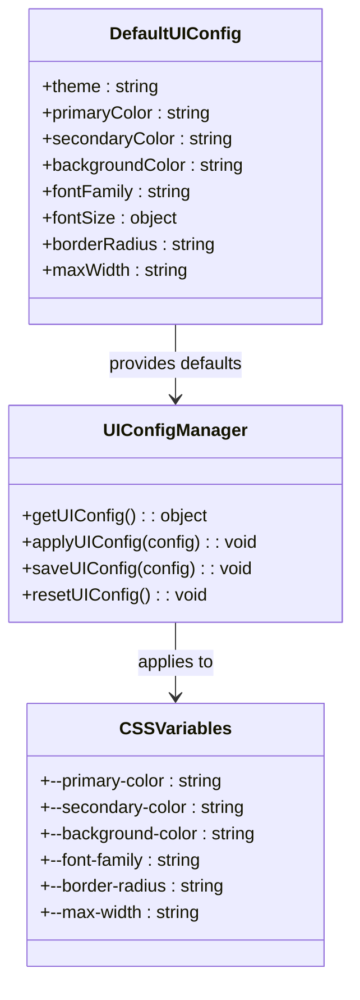
```mermaid
classDiagram
class DefaultUIConfig {
+theme : string
+primaryColor : string
+secondaryColor : string
+backgroundColor : string
+fontFamily : string
+fontSize : object
+borderRadius : string
+maxWidth : string
}
class UIConfigManager {
+getUIConfig() : object
+applyUIConfig(config) : void
+saveUIConfig(config) : void
+resetUIConfig() : void
}
class CSSVariables {
+--primary-color : string
+--secondary-color : string
+--background-color : string
+--font-family : string
+--border-radius : string
+--max-width : string
}
DefaultUIConfig --> UIConfigManager : provides defaults
UIConfigManager --> CSSVariables : applies to
```

**图表来源**
- [js/utils.js:207-221](file://js/utils.js#L207-L221)
- [js/utils.js:226-244](file://js/utils.js#L226-L244)
- [css/style.css:7-20](file://css/style.css#L7-L20)

### 配置项说明

| 配置项 | 类型 | 默认值 | 说明 |
|--------|------|--------|------|
| theme | string | 'default' | 主题名称 |
| primaryColor | string | '#FF8C94' | 主色调 |
| secondaryColor | string | '#FFD3B6' | 辅助色调 |
| backgroundColor | string | '#FFF5F5' | 背景色 |
| fontFamily | string | '系统字体' | 字体族 |
| fontSize.title | string | '2rem' | 标题字体大小 |
| fontSize.subtitle | string | '1.25rem' | 副标题字体大小 |
| fontSize.body | string | '1rem' | 正文字体大小 |
| fontSize.small | string | '0.875rem' | 小字字体大小 |
| borderRadius | string | '12px' | 圆角半径 |
| maxWidth | string | '800px' | 最大宽度 |

### 配置应用流程

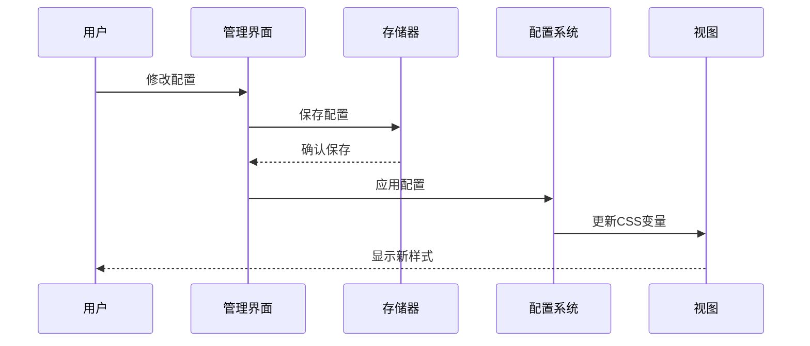
```mermaid
sequenceDiagram
participant U as 用户
participant A as 管理界面
participant S as 存储器
participant C as 配置系统
participant V as 视图
U->>A : 修改配置
A->>S : 保存配置
S-->>A : 确认保存
A->>C : 应用配置
C->>V : 更新CSS变量
V-->>U : 显示新样式
```

**图表来源**
- [admin.html:293-335](file://admin.html#L293-L335)
- [js/utils.js:234-244](file://js/utils.js#L234-L244)

**章节来源**
- [js/utils.js:207-244](file://js/utils.js#L207-L244)
- [admin.html:293-335](file://admin.html#L293-L335)

## 扩展机制

### 插件架构设计

系统采用插件化架构，支持功能的动态扩展：

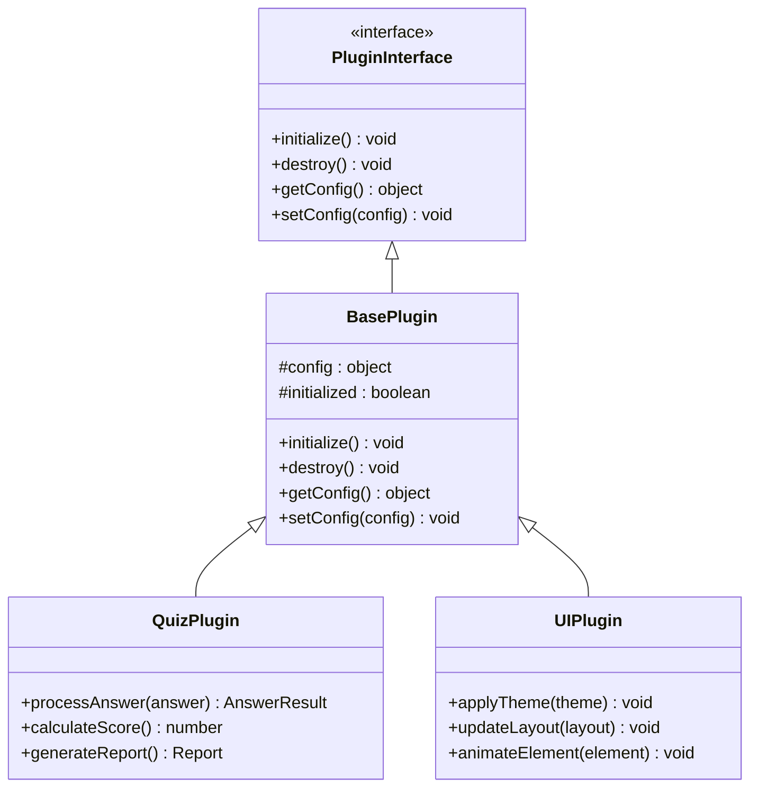
```mermaid
classDiagram
class PluginInterface {
<<interface>>
+initialize() void
+destroy() void
+getConfig() object
+setConfig(config) void
}
class BasePlugin {
#config : object
#initialized : boolean
+initialize() void
+destroy() void
+getConfig() object
+setConfig(config) void
}
class QuizPlugin {
+processAnswer(answer) AnswerResult
+calculateScore() number
+generateReport() Report
}
class UIPlugin {
+applyTheme(theme) void
+updateLayout(layout) void
+animateElement(element) void
}
PluginInterface <|-- BasePlugin
BasePlugin <|-- QuizPlugin
BasePlugin <|-- UIPlugin
```

**图表来源**
- [js/utils.js:1-250](file://js/utils.js#L1-L250)

### 扩展点设计

系统在以下位置提供了扩展点：

1. **数据处理扩展**：支持自定义的题目处理逻辑
2. **UI 组件扩展**：支持自定义的界面组件
3. **验证规则扩展**：支持自定义的数据验证规则
4. **存储后端扩展**：支持替换数据存储方案

### 插件开发指南

```javascript
// 插件开发示例
class CustomPlugin extends BasePlugin {
    constructor(config) {
        super(config);
        this.pluginType = 'custom';
    }
    
    initialize() {
        super.initialize();
        // 初始化插件逻辑
    }
    
    processAnswer(answer) {
        // 自定义答案处理逻辑
        return {
            ...answer,
            customField: this.calculateCustomValue(answer)
        };
    }
    
    destroy() {
        // 清理插件资源
        super.destroy();
    }
}
```

**章节来源**
- [js/utils.js:1-250](file://js/utils.js#L1-L250)

## 最佳实践

### 代码组织最佳实践

1. **模块化设计**：
   - 将相关功能封装在独立模块中
   - 使用单一职责原则组织代码
   - 避免全局变量污染

2. **错误处理最佳实践**：
   ```javascript
   // 推荐的错误处理模式
   function safeOperation(data) {
       try {
           return processData(data);
       } catch (error) {
           logError(error);
           return fallbackValue;
       }
   }
   ```

3. **性能优化最佳实践**：
   - 使用 requestAnimationFrame 优化动画
   - 实施防抖和节流机制
   - 避免频繁的 DOM 操作

### 用户体验最佳实践

1. **响应式设计**：
   - 使用相对单位而非固定像素
   - 实施渐进式增强策略
   - 考虑不同设备的交互方式

2. **可访问性**：
   - 提供适当的 ARIA 属性
   - 确保键盘导航可用
   - 考虑色彩对比度要求

3. **反馈机制**：
   - 提供即时的操作反馈
   - 使用加载指示器
   - 显示错误信息但保持友好

### 安全最佳实践

1. **输入验证**：
   - 对所有用户输入进行验证
   - 实施适当的过滤和转义
   - 防止恶意数据注入

2. **数据保护**：
   - 加密敏感数据
   - 实施适当的访问控制
   - 定期清理临时数据

## 故障排除指南

### 常见问题及解决方案

#### 数据加载问题

**问题**：测试数据无法加载
**可能原因**：
- JSON 文件格式错误
- 文件路径配置错误
- 网络请求超时

**解决步骤**：
1. 检查 JSON 文件语法
2. 验证文件路径正确性
3. 查看浏览器控制台错误信息
4. 确认文件权限设置

#### UI 配置失效

**问题**：修改的 UI 配置不生效
**可能原因**：
- CSS 变量覆盖顺序问题
- 浏览器缓存问题
- 配置数据格式错误

**解决步骤**：
1. 清除浏览器缓存
2. 检查 CSS 变量设置
3. 验证配置数据格式
4. 重新应用配置

#### 功能异常

**问题**：特定功能无法正常使用
**排查步骤**：
1. 检查浏览器兼容性
2. 验证 JavaScript 错误
3. 确认外部依赖加载
4. 测试离线模式

### 调试工具使用

#### 浏览器开发者工具

1. **Elements 面板**：检查 DOM 结构和样式
2. **Console 面板**：查看 JavaScript 错误和日志
3. **Network 面板**：监控网络请求和响应
4. **Application 面板**：检查 LocalStorage 和缓存

#### 日志记录

```javascript
// 建议的日志级别
const LOG_LEVELS = {
    ERROR: 0,
    WARN: 1,
    INFO: 2,
    DEBUG: 3
};

function log(level, message, data) {
    if (level <= LOG_LEVELS.INFO) {
        console.log(`[${new Date().toISOString()}] ${message}`, data);
    }
}
```

### 性能问题诊断

#### 内存泄漏检测

1. **使用 Chrome DevTools Memory 面板**
2. **监控对象引用关系**
3. **检查事件监听器绑定**
4. **验证定时器清理**

#### 性能瓶颈识别

1. **使用 Performance 面板**
2. **分析长任务和阻塞**
3. **监控渲染性能**
4. **检查网络请求优化**

**章节来源**
- [js/utils.js:18-36](file://js/utils.js#L18-L36)
- [admin.html:252-291](file://admin.html#L252-L291)

## 结论

心理测试 v2 项目是一个功能完整、架构清晰的纯前端心理测评系统。通过采用现代的前端技术和最佳实践，系统实现了良好的用户体验和可维护性。

### 项目优势

1. **技术先进**：采用最新的 Web 标准和最佳实践
2. **用户体验**：提供流畅、直观的交互体验
3. **可扩展性**：模块化设计支持功能扩展
4. **易维护性**：清晰的代码结构和完善的文档

### 发展方向

1. **功能增强**：添加更多测试类型和分析维度
2. **性能优化**：进一步提升加载速度和运行效率
3. **移动端优化**：增强移动设备的适配能力
4. **国际化支持**：支持多语言环境

### 社区贡献

项目欢迎社区贡献，包括但不限于：
- 新的测试题目和维度
- UI 主题和样式改进
- 功能增强和 bug 修复
- 文档完善和技术支持

通过持续的开发和改进，心理测试 v2 项目将继续为用户提供优质的心理测评服务。