# 开发流程

<cite>
**本文档引用的文件**
- [index.html](file://index.html)
- [quiz.html](file://quiz.html)
- [result.html](file://result.html)
- [admin.html](file://admin.html)
- [catalog.html](file://catalog.html)
- [css/style.css](file://css/style.css)
- [js/utils.js](file://js/utils.js)
- [data/default-quiz.json](file://data/default-quiz.json)
- [data/template.json](file://data/template.json)
</cite>

## 目录
1. [项目概述](#项目概述)
2. [项目结构](#项目结构)
3. [核心组件](#核心组件)
4. [架构概览](#架构概览)
5. [详细组件分析](#详细组件分析)
6. [依赖关系分析](#依赖关系分析)
7. [性能考虑](#性能考虑)
8. [故障排除指南](#故障排除指南)
9. [结论](#结论)

## 项目概述

心理测试 v2 是一个基于 Web 的心理测评系统，采用纯前端技术栈实现。该项目提供了完整的心理测试体验，包括测试展示、答题交互、结果分析和管理后台等功能模块。

### 主要特性
- **响应式设计**：支持桌面端和移动端访问
- **本地存储**：使用 localStorage 实现用户进度持久化
- **动态主题**：支持 UI 主题配置和个性化定制
- **实时验证**：题目数据的实时验证和错误处理
- **PDF 生成**：支持测试结果的 PDF 报告导出
- **海报分享**：生成可分享的测试结果海报

## 项目结构

项目采用传统的静态网站结构，文件组织清晰，职责分离明确。

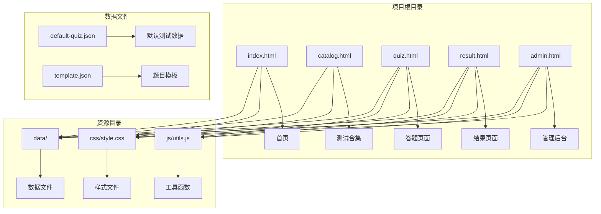

**图表来源**
- [index.html:1-154](file://index.html#L1-L154)
- [quiz.html:1-287](file://quiz.html#L1-L287)
- [result.html:1-374](file://result.html#L1-L374)
- [admin.html:1-402](file://admin.html#L1-L402)
- [css/style.css:1-731](file://css/style.css#L1-L731)
- [js/utils.js:1-250](file://js/utils.js#L1-L250)

**章节来源**
- [index.html:1-154](file://index.html#L1-L154)
- [css/style.css:1-731](file://css/style.css#L1-L731)
- [js/utils.js:1-250](file://js/utils.js#L1-L250)

## 核心组件

### 数据模型架构

项目采用统一的数据模型来管理测试相关的所有信息，确保数据的一致性和可维护性。

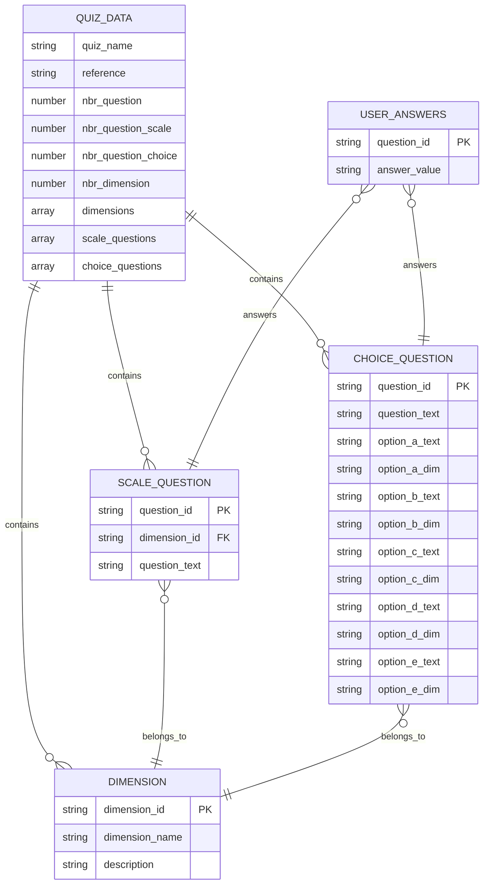

**图表来源**
- [data/default-quiz.json:1-235](file://data/default-quiz.json#L1-L235)
- [data/template.json:1-49](file://data/template.json#L1-L49)

### 工具函数体系

项目实现了完整的工具函数库，提供数据存储、验证、格式化等核心功能。

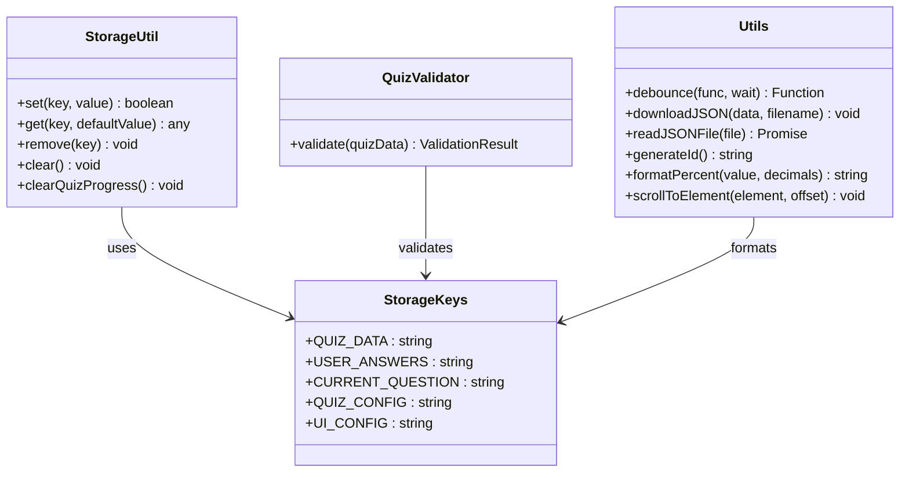

**图表来源**
- [js/utils.js:1-250](file://js/utils.js#L1-L250)

**章节来源**
- [js/utils.js:1-250](file://js/utils.js#L1-L250)
- [data/default-quiz.json:1-235](file://data/default-quiz.json#L1-L235)

## 架构概览

### 前端架构模式

项目采用模块化的前端架构，每个页面都是独立的功能模块，通过共享的工具库实现功能复用。

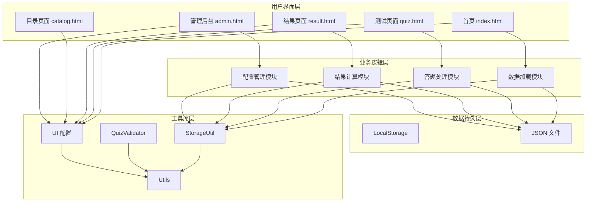

**图表来源**
- [index.html:68-151](file://index.html#L68-L151)
- [quiz.html:49-284](file://quiz.html#L49-L284)
- [result.html:85-371](file://result.html#L85-L371)
- [admin.html:171-399](file://admin.html#L171-L399)

### 数据流架构

项目实现了清晰的数据流向，确保用户操作和数据更新的同步性。

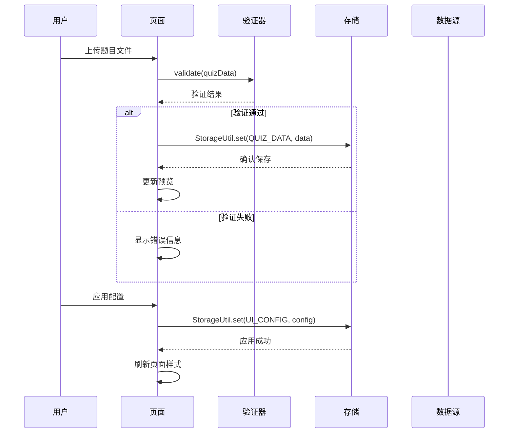

**图表来源**
- [admin.html:252-291](file://admin.html#L252-L291)
- [js/utils.js:55-126](file://js/utils.js#L55-L126)

## 详细组件分析

### 首页组件分析

首页负责展示测试基本信息和引导用户进入答题流程。

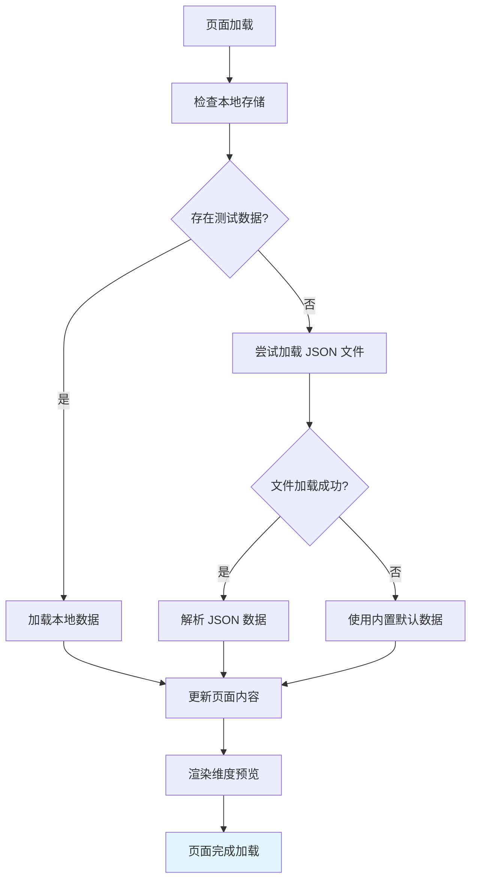

**图表来源**
- [index.html:84-144](file://index.html#L84-L144)

#### 核心功能实现

首页实现了智能的数据加载策略，确保在各种网络环境下都能正常显示测试信息。

**章节来源**
- [index.html:68-151](file://index.html#L68-L151)

### 答题组件分析

答题页面提供了完整的测试交互体验，包括进度跟踪、答案保存和结果提交。

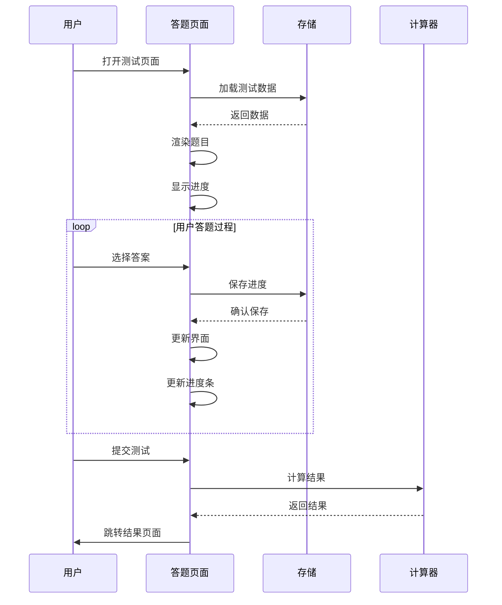

**图表来源**
- [quiz.html:60-126](file://quiz.html#L60-L126)
- [quiz.html:128-185](file://quiz.html#L128-L185)

#### 答题流程优化

答题组件实现了多项用户体验优化：
- **进度可视化**：通过花朵生长动画直观显示答题进度
- **断点续答**：自动保存用户答题进度，支持断点续答
- **实时验证**：确保用户完成所有题目后再提交
- **响应式布局**：适配不同屏幕尺寸的设备

**章节来源**
- [quiz.html:1-287](file://quiz.html#L1-L287)

### 结果组件分析

结果页面提供了丰富的数据分析和可视化功能。

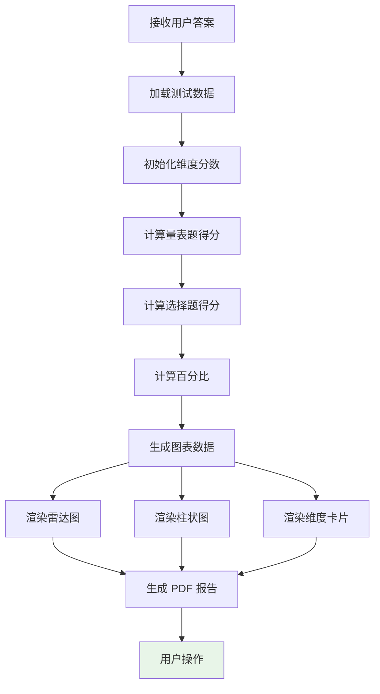

**图表来源**
- [result.html:94-133](file://result.html#L94-L133)
- [result.html:153-240](file://result.html#L153-L240)

#### 数据分析算法

结果计算采用了双维度评分系统：

1. **量表题评分**：直接累加用户选择的数值（1-5分）
2. **选择题评分**：根据选项对应的维度分配固定分数（5分）

**章节来源**
- [result.html:1-374](file://result.html#L1-L374)

### 管理后台分析

管理后台提供了完整的测试内容管理功能。

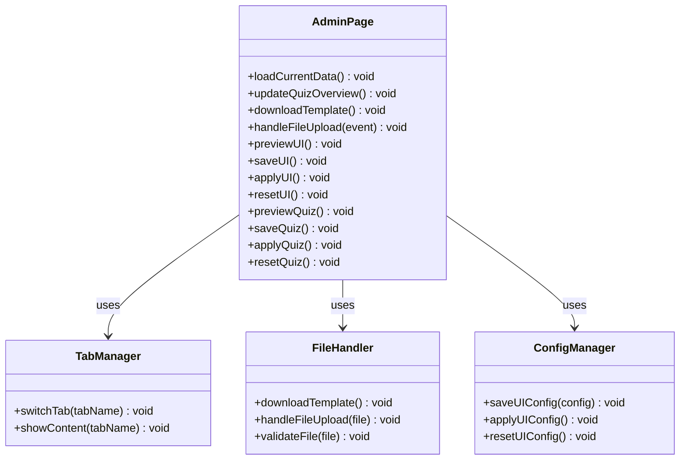

**图表来源**
- [admin.html:172-399](file://admin.html#L172-L399)

#### 题目管理流程

管理后台实现了完整的题目生命周期管理：

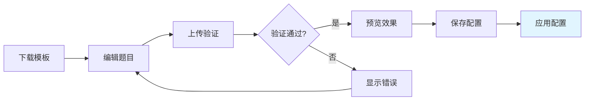

**图表来源**
- [admin.html:243-291](file://admin.html#L243-L291)

**章节来源**
- [admin.html:1-402](file://admin.html#L1-L402)

### 样式系统分析

项目采用了基于 CSS 变量的主题系统，支持动态主题切换。

```mermaid
graph TB
subgraph "CSS 变量系统"
A[:root 变量] --> B[颜色变量]
A --> C[尺寸变量]
A --> D[字体变量]
B --> E[--primary-color]
B --> F[--secondary-color]
B --> G[--background-color]
C --> H[--border-radius]
C --> I[--max-width]
D --> J[--font-family]
end
subgraph "主题应用"
K[applyUIConfig] --> L[动态更新 CSS 变量]
L --> M[页面样式重绘]
end
subgraph "响应式设计"
N[@media 查询] --> O[移动端适配]
O --> P[触摸优化]
end
```

**图表来源**
- [css/style.css:6-20](file://css/style.css#L6-L20)
- [css/style.css:618-683](file://css/style.css#L618-L683)

**章节来源**
- [css/style.css:1-731](file://css/style.css#L1-L731)

## 依赖关系分析

### 模块间依赖关系

项目采用松耦合的设计，各模块间通过工具库进行通信。

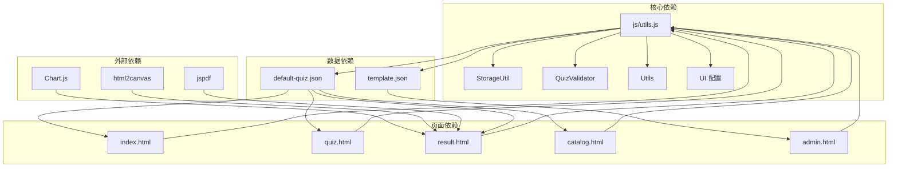

**图表来源**
- [js/utils.js:1-250](file://js/utils.js#L1-L250)
- [index.html:68-69](file://index.html#L68-L69)
- [quiz.html:49-50](file://quiz.html#L49-L50)
- [result.html:8-10](file://result.html#L8-L10)

### 数据流依赖

项目实现了清晰的数据流向，确保各组件间的协调工作。

```mermaid
sequenceDiagram
participant S as StorageUtil
participant V as QuizValidator
participant U as Utils
participant P as Page Components
Note over S,V,U : 数据验证和处理层
S->>V : validate(quizData)
V-->>S : validation result
Note over U,P : 用户界面层
U->>P : format data
P->>S : get/set data
S-->>P : data
```

**图表来源**
- [js/utils.js:55-126](file://js/utils.js#L55-L126)

**章节来源**
- [js/utils.js:1-250](file://js/utils.js#L1-L250)

## 性能考虑

### 加载性能优化

项目采用了多种性能优化策略：

1. **懒加载策略**：仅在需要时加载额外的 JavaScript 库
2. **缓存机制**：利用 localStorage 减少重复请求
3. **资源压缩**：CSS 和 JavaScript 文件经过压缩处理
4. **图片优化**：使用 emoji 替代图片，减少 HTTP 请求

### 内存管理

项目实现了合理的内存管理策略：
- **及时清理**：使用完毕的临时变量及时释放
- **事件监听**：页面卸载时移除事件监听器
- **存储清理**：提供专门的进度清理功能

## 故障排除指南

### 常见问题诊断

#### 数据加载失败

**症状**：页面显示默认数据或错误信息

**可能原因**：
1. JSON 文件格式错误
2. 网络请求超时
3. 浏览器缓存问题

**解决方案**：
1. 检查 JSON 文件格式是否正确
2. 确认网络连接稳定
3. 清除浏览器缓存后重试

#### 答题进度丢失

**症状**：重新打开页面后进度消失

**可能原因**：
1. 浏览器禁用了 localStorage
2. 存储空间不足
3. 浏览器安全设置

**解决方案**：
1. 检查浏览器设置中的存储权限
2. 清理浏览器缓存和历史记录
3. 尝试使用隐私模式访问

#### 图表显示异常

**症状**：结果页面图表无法正常显示

**可能原因**：
1. Chart.js 库加载失败
2. Canvas 支持问题
3. 内存不足

**解决方案**：
1. 检查网络连接和 CDN 访问
2. 更新浏览器版本
3. 关闭其他占用内存的应用程序

**章节来源**
- [index.html:84-105](file://index.html#L84-L105)
- [quiz.html:60-97](file://quiz.html#L60-L97)
- [result.html:94-133](file://result.html#L94-L133)

## 结论

心理测试 v2 项目展现了优秀的前端架构设计和用户体验实现。项目通过模块化的设计、清晰的数据流和完善的工具库，构建了一个功能完整、易于维护的心理测试系统。

### 项目优势

1. **架构清晰**：模块化设计使得代码易于理解和维护
2. **用户体验优秀**：流畅的交互设计和响应式布局
3. **扩展性强**：基于模板的数据结构便于添加新的测试类型
4. **技术栈合理**：纯前端技术栈降低了部署复杂度

### 改进建议

1. **增加单元测试**：为关键功能模块添加自动化测试
2. **性能监控**：集成性能监控工具跟踪页面加载时间
3. **国际化支持**：添加多语言支持以扩大用户群体
4. **离线支持**：实现 Service Worker 以支持离线访问

该项目为类似的心理测评系统提供了良好的参考模板，其设计理念和实现方式值得在同类项目中推广和借鉴。