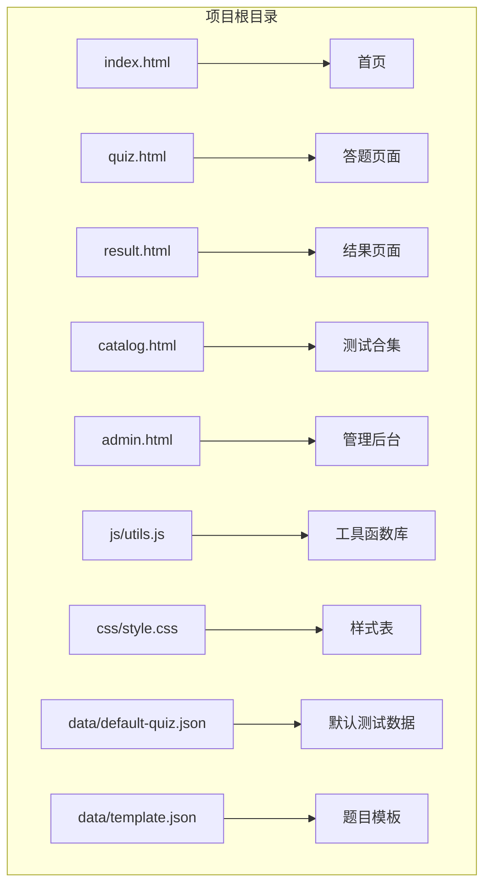
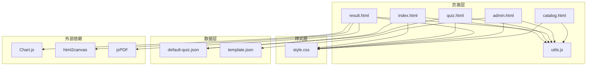
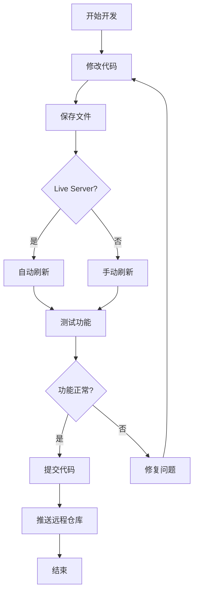

# 环境搭建

<cite>
**本文档引用的文件**
- [index.html](file://index.html)
- [quiz.html](file://quiz.html)
- [result.html](file://result.html)
- [admin.html](file://admin.html)
- [catalog.html](file://catalog.html)
- [css/style.css](file://css/style.css)
- [js/utils.js](file://js/utils.js)
- [data/default-quiz.json](file://data/default-quiz.json)
- [data/template.json](file://data/template.json)
</cite>

## 目录
1. [简介](#简介)
2. [项目结构](#项目结构)
3. [环境要求](#环境要求)
4. [开发工具推荐](#开发工具推荐)
5. [项目克隆与初始化](#项目克lon与初始化)
6. [文件作用与依赖关系](#文件作用与依赖关系)
7. [开发服务器启动](#开发服务器启动)
8. [热重载配置](#热重载配置)
9. [调试环境设置](#调试环境设置)
10. [开发工具链配置](#开发工具链配置)
11. [完整开发流程](#完整开发流程)
12. [故障排除](#故障排除)
13. [总结](#总结)

## 简介

心理测试 v2 是一个基于纯前端技术的心理测试应用程序，采用 HTML5、CSS3 和 JavaScript 构建。该项目提供了完整的心理测试体验，包括测试展示、答题界面、结果分析和管理后台等功能模块。

## 项目结构

该项目采用扁平化的文件组织结构，所有静态资源都位于根目录下：



**图表来源**
- [index.html:1-154](file://index.html#L1-L154)
- [quiz.html:1-278](file://quiz.html#L1-L278)
- [result.html:1-363](file://result.html#L1-L363)
- [admin.html:1-402](file://admin.html#L1-L402)
- [catalog.html:1-105](file://catalog.html#L1-L105)

**章节来源**
- [index.html:1-154](file://index.html#L1-L154)
- [css/style.css:1-731](file://css/style.css#L1-L731)
- [js/utils.js:1-250](file://js/utils.js#L1-L250)

## 环境要求

### 浏览器兼容性

该项目支持以下现代浏览器：

- **Chrome**: 最新版
- **Firefox**: 最新版
- **Safari**: 最新版
- **Edge**: 最新版
- **移动端**: iOS Safari 12+，Android Chrome 60+

### 系统要求

- **操作系统**: Windows 10+ / macOS 10.15+ / Linux Ubuntu 18.04+
- **内存**: 至少 4GB RAM
- **存储空间**: 至少 50MB 可用空间
- **网络**: 稳定的互联网连接（用于加载外部依赖）

### 技术栈

- **前端框架**: 纯原生 JavaScript（无框架依赖）
- **样式**: CSS3 + CSS 变量
- **数据存储**: localStorage（浏览器本地存储）
- **外部依赖**: 
  - Chart.js（图表库）
  - html2canvas（截图库）
  - jsPDF（PDF生成库）

## 开发工具推荐

### 代码编辑器

**Visual Studio Code**（推荐）
- **扩展插件**:
  - Live Server（本地服务器）
  - Auto Rename Tag（HTML标签自动重命名）
  - Prettier（代码格式化）
  - ESLint（JavaScript代码检查）
  - Bracket Pair Colorizer（括号配色）
  - Path Intellisense（路径智能提示）

**WebStorm**（专业级IDE）
- 内置 Live Edit 功能
- 强大的代码分析能力
- 集成的调试工具

### 浏览器开发者工具

- **Chrome DevTools**: 性能分析、网络监控
- **Firefox Developer Tools**: 响应式设计工具
- **Safari Web Inspector**: 移动端调试

### 版本控制

- **Git**: 代码版本管理
- **GitHub Desktop**: 图形化 Git 客户端

## 项目克隆与初始化

### 步骤 1: 克隆项目

```bash
# 使用 HTTPS
git clone https://github.com/your-repo/psychological-test-v2.git

# 或使用 SSH
git clone git@github.com:your-repo/psychological-test-v2.git
```

### 步骤 2: 进入项目目录

```bash
cd psychological-test-v2
```

### 步骤 3: 验证项目结构

```bash
# 查看项目文件结构
ls -la

# 验证关键文件是否存在
ls -la index.html quiz.html result.html admin.html catalog.html
ls -la css/style.css js/utils.js
ls -la data/default-quiz.json data/template.json
```

### 步骤 4: 安装依赖

```bash
# 由于是纯前端项目，无需安装 Node.js 依赖
# 直接启动本地服务器即可
```

**章节来源**
- [index.html:1-154](file://index.html#L1-L154)
- [quiz.html:1-278](file://quiz.html#L1-L278)
- [result.html:1-363](file://result.html#L1-L363)
- [admin.html:1-402](file://admin.html#L1-L402)
- [catalog.html:1-105](file://catalog.html#L1-L105)

## 文件作用与依赖关系

### 核心页面文件

| 文件名 | 作用 | 关键功能 | 依赖 |
|--------|------|----------|------|
| index.html | 首页 | 测试展示、开始按钮、维度预览 | utils.js, style.css, default-quiz.json |
| quiz.html | 答题页面 | 交互式测试、进度跟踪、答案保存 | utils.js, style.css |
| result.html | 结果页面 | 成绩分析、图表展示、PDF生成 | utils.js, style.css, Chart.js, html2canvas, jsPDF |
| admin.html | 管理后台 | 题目管理、UI配置、数据导入导出 | utils.js, style.css, template.json |
| catalog.html | 测试合集 | 测试列表展示 | utils.js, style.css |

### 核心工具文件

| 文件名 | 类型 | 作用 | 主要功能 |
|--------|------|------|----------|
| js/utils.js | 工具库 | 数据处理、本地存储、验证 | StorageUtil, QuizValidator, Utils, UI配置 |
| css/style.css | 样式表 | 视觉设计、响应式布局 | CSS变量、动画、组件样式 |
| data/default-quiz.json | 数据文件 | 默认测试数据 | 测试配置、题目数据 |
| data/template.json | 数据文件 | 题目模板 | 标准化格式 |

### 依赖关系图



**图表来源**
- [js/utils.js:1-250](file://js/utils.js#L1-L250)
- [css/style.css:1-731](file://css/style.css#L1-L731)
- [data/default-quiz.json:1-235](file://data/default-quiz.json#L1-L235)
- [data/template.json:1-49](file://data/template.json#L1-L49)

**章节来源**
- [js/utils.js:1-250](file://js/utils.js#L1-L250)
- [css/style.css:1-731](file://css/style.css#L1-L731)
- [data/default-quiz.json:1-235](file://data/default-quiz.json#L1-L235)
- [data/template.json:1-49](file://data/template.json#L1-L49)

## 开发服务器启动

### 方法一：使用 VS Code Live Server 扩展

1. **安装 Live Server 扩展**
   - 在 VS Code 中打开 Extensions（Ctrl+Shift+X）
   - 搜索 "Live Server"
   - 安装 "Live Server" 扩展

2. **启动服务器**
   ```bash
   # 在 VS Code 中右键点击 index.html
   # 选择 "Open with Live Server"
   ```

3. **访问应用**
   - 默认地址: http://localhost:5500
   - 首页: http://localhost:5500/index.html
   - 管理后台: http://localhost:5500/admin.html

### 方法二：使用 Python 内置服务器

```bash
# 进入项目根目录
cd psychological-test-v2

# Python 3.x
python -m http.server 8080

# Python 2.x
python -m SimpleHTTPServer 8080
```

### 方法三：使用 Node.js http-server

```bash
# 全局安装 http-server
npm install -g http-server

# 启动服务器
http-server -p 8080 -c-1
```

### 方法四：使用 PHP 内置服务器

```bash
# 进入项目根目录
cd psychological-test-v2

# 启动 PHP 服务器
php -S localhost:8080
```

**章节来源**
- [index.html:1-154](file://index.html#L1-L154)
- [admin.html:1-402](file://admin.html#L1-L402)

## 热重载配置

### VS Code Live Server 热重载

Live Server 扩展提供了自动刷新功能：

1. **启用自动刷新**
   - 在 VS Code 设置中搜索 "live server"
   - 启用 "Live Server > Settings: Live Reload"

2. **配置刷新行为**
   ```json
   {
       "liveServer.settings.port": 5500,
       "liveServer.settings.root": ".",
       "liveServer.settings.donotShowInfoMsg": true,
       "liveServer.settings.donotVerifyTags": true,
       "liveServer.settings.useBrowser": "default",
       "liveServer.settings.liveReload": true,
       "liveServer.settings.ignore": "/node_modules/"
   }
   ```

### 自定义热重载脚本

创建 `reload.js` 文件：

```javascript
// reload.js
(function() {
    const ws = new WebSocket('ws://localhost:35729');
    
    ws.onmessage = function(event) {
        if (event.data === 'reload') {
            location.reload();
        }
    };
    
    ws.onclose = function() {
        console.log('WebSocket disconnected');
    };
})();
```

**章节来源**
- [index.html:1-154](file://index.html#L1-L154)
- [quiz.html:1-278](file://quiz.html#L1-L278)

## 调试环境设置

### 浏览器开发者工具

#### Chrome DevTools 使用技巧

1. **Elements 面板**
   - 查看 DOM 结构和样式
   - 实时修改 CSS 属性
   - 检查响应式断点

2. **Console 面板**
   - 执行 JavaScript 代码
   - 查看错误和警告
   - 调试存储数据

3. **Network 面板**
   - 监控文件加载
   - 检查 API 请求
   - 分析性能问题

#### 断点调试

```javascript
// 在 utils.js 中添加断点
function debugLog(message) {
    console.log('DEBUG:', message);
    debugger; // 添加断点
}

// 在 quiz.html 中调试用户交互
document.getElementById('next-btn').addEventListener('click', function() {
    debugger; // 调试按钮点击事件
    // 继续执行
});
```

### 本地存储调试

```javascript
// 检查 localStorage 内容
console.log('localStorage 内容:');
console.table(localStorage);

// 清除测试进度
StorageUtil.clearQuizProgress();

// 检查 UI 配置
console.log('UI 配置:', StorageUtil.get('ui_config'));
```

### 错误监控

```javascript
// 全局错误处理
window.addEventListener('error', function(event) {
    console.error('全局错误:', event.error);
});

// Promise 错误处理
window.addEventListener('unhandledrejection', function(event) {
    console.error('未处理的 Promise 错误:', event.reason);
});
```

**章节来源**
- [js/utils.js:1-250](file://js/utils.js#L1-L250)
- [quiz.html:1-278](file://quiz.html#L1-L278)
- [result.html:1-363](file://result.html#L1-L363)

## 开发工具链配置

### ESLint 配置

创建 `.eslintrc.json` 文件：

```json
{
    "env": {
        "browser": true,
        "es2021": true
    },
    "extends": ["eslint:recommended"],
    "parserOptions": {
        "ecmaVersion": 12
    },
    "rules": {
        "indent": ["error", 4],
        "linebreak-style": ["error", "unix"],
        "quotes": ["error", "single"],
        "semi": ["error", "always"],
        "no-console": ["warn"],
        "no-unused-vars": ["warn"],
        "no-undef": ["error"]
    }
}
```

### Prettier 配置

创建 `.prettierrc` 文件：

```json
{
    "semi": true,
    "singleQuote": true,
    "trailingComma": "es5",
    "printWidth": 80,
    "tabWidth": 4,
    "useTabs": false,
    "bracketSpacing": true,
    "arrowParens": "avoid"
}
```

### VS Code 工作区设置

创建 `.vscode/settings.json` 文件：

```json
{
    "editor.formatOnSave": true,
    "editor.codeActionsOnSave": {
        "source.fixAll.eslint": true
    },
    "eslint.validate": [
        "javascript",
        "javascriptreact"
    ],
    "[javascript]": {
        "editor.defaultFormatter": "dbaeumer.vscode-eslint"
    },
    "files.associations": {
        "*.html": "html"
    }
}
```

### Git 配置

创建 `.gitignore` 文件：

```
node_modules/
.env
.DS_Store
*.log
coverage/
*.tmp
*.swp
```

**章节来源**
- [js/utils.js:1-250](file://js/utils.js#L1-L250)

## 完整开发流程

### 新开发者环境搭建步骤

#### 第一步：系统准备

```bash
# 检查 Node.js 版本（可选）
node --version

# 检查 npm 版本（可选）
npm --version

# 检查 Git 版本
git --version
```

#### 第二步：项目克隆

```bash
# 创建项目目录
mkdir psychological-test-v2
cd psychological-test-v2

# 克隆项目
git clone <your-repo-url> .

# 或者直接下载 ZIP 文件并解压
```

#### 第三步：验证项目

```bash
# 检查文件完整性
ls -la

# 启动本地服务器
python -m http.server 8080
```

#### 第四步：基本功能测试

1. **访问首页**: http://localhost:8080/index.html
2. **检查样式**: 确认 CSS 正常加载
3. **测试交互**: 点击"开始测试"按钮
4. **验证数据**: 检查默认测试数据加载

#### 第五步：开发环境配置

```bash
# 安装 VS Code 扩展
# 1. Live Server
# 2. ESLint
# 3. Prettier
# 4. Auto Rename Tag
```

#### 第六步：开始开发

```bash
# 在 VS Code 中打开项目
code .

# 右键 index.html 选择 "Open with Live Server"
# 开始开发和调试
```

### 日常开发流程



**图表来源**
- [index.html:1-154](file://index.html#L1-L154)
- [quiz.html:1-278](file://quiz.html#L1-L278)

## 故障排除

### 常见问题及解决方案

#### 问题 1: 静态资源加载失败

**症状**: CSS 或 JavaScript 文件 404 错误

**解决方案**:
```bash
# 检查文件路径
ls -la css/style.css
ls -la js/utils.js

# 确保相对路径正确
# 在 HTML 中使用相对路径
<link rel="stylesheet" href="css/style.css">
<script src="js/utils.js"></script>
```

#### 问题 2: 本地存储功能异常

**症状**: 测试进度无法保存或清除

**解决方案**:
```javascript
// 检查浏览器隐私模式
// 在隐私模式下测试本地存储

// 清除浏览器缓存
// 清除 localStorage 数据

// 检查浏览器设置
// 确保允许第三方 Cookie
```

#### 问题 3: 外部依赖加载失败

**症状**: Chart.js 或其他库加载失败

**解决方案**:
```javascript
// 检查网络连接
// 确保可以访问 CDN

// 使用本地库文件
// 将外部库下载到本地目录

// 检查 CDN 可用性
// 替换为备用 CDN 地址
```

#### 问题 4: 响应式布局问题

**症状**: 移动端显示异常

**解决方案**:
```css
/* 检查 viewport 设置 */
<meta name="viewport" content="width=device-width, initial-scale=1.0">

/* 测试不同屏幕尺寸 */
/* 使用浏览器开发者工具的设备模拟器 */

/* 检查媒体查询 */
@media (max-width: 768px) {
    /* 确保响应式样式正确 */
}
```

### 调试技巧

#### 控制台调试

```javascript
// 基础调试
console.log('变量值:', variable);
console.table(object);
console.error('错误信息:', error);

// 条件调试
if (condition) {
    debugger;
    // 断点调试
}

// 性能调试
console.time('操作耗时');
// 执行代码
console.timeEnd('操作耗时');
```

#### 网络调试

```javascript
// 监控网络请求
fetch('/api/data')
    .then(response => {
        console.log('响应状态:', response.status);
        return response.json();
    })
    .then(data => console.log('响应数据:', data))
    .catch(error => console.error('请求失败:', error));
```

**章节来源**
- [js/utils.js:1-250](file://js/utils.js#L1-L250)
- [css/style.css:619-683](file://css/style.css#L619-L683)

## 总结

心理测试 v2 项目是一个功能完整、结构清晰的纯前端应用。通过遵循本文档的环境搭建指南，新开发者可以快速建立开发环境并开始项目开发。

### 关键要点

1. **环境要求简单**: 仅需现代浏览器和本地服务器即可运行
2. **开发工具友好**: 支持多种开发工具和编辑器
3. **调试便利**: 内置丰富的调试工具和错误处理机制
4. **扩展性强**: 模块化设计便于功能扩展和维护

### 推荐实践

- 使用 VS Code + Live Server 进行开发
- 定期备份重要数据
- 编写单元测试覆盖核心功能
- 使用版本控制系统管理代码变更

通过以上配置和实践，开发者可以高效地进行心理测试应用的开发和维护工作。