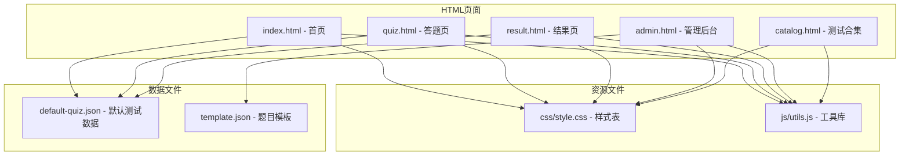
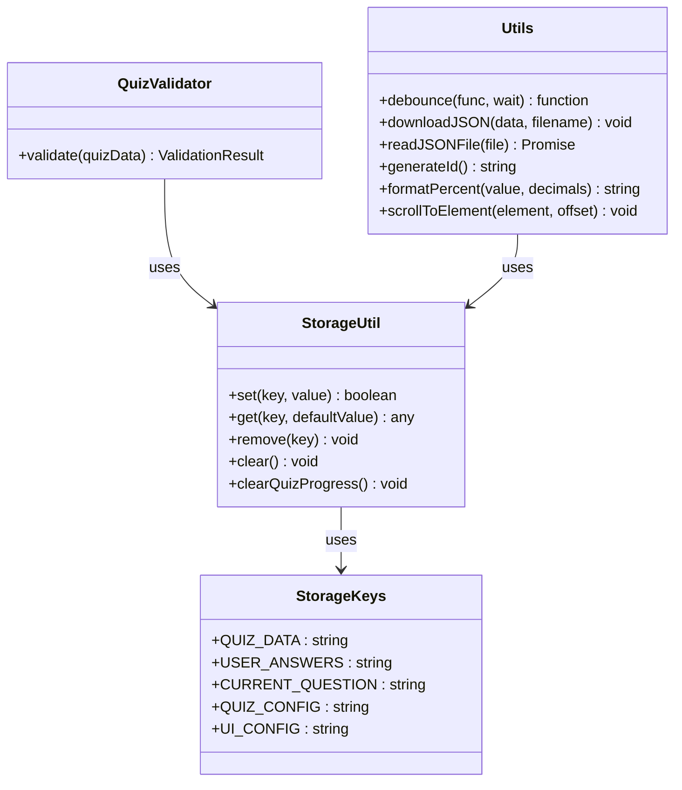
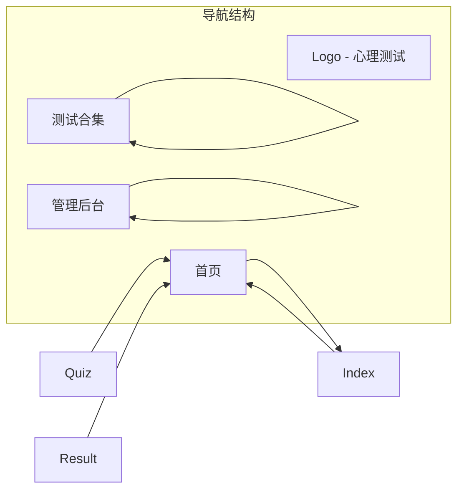
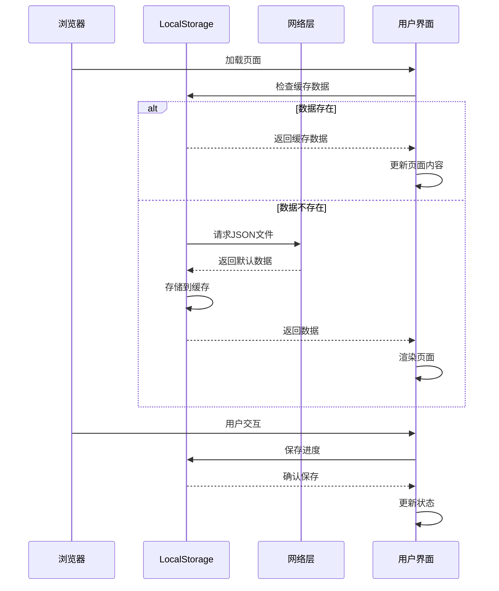
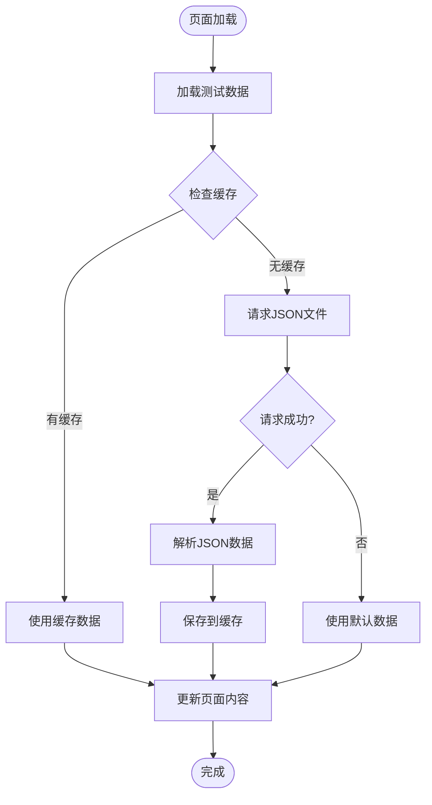
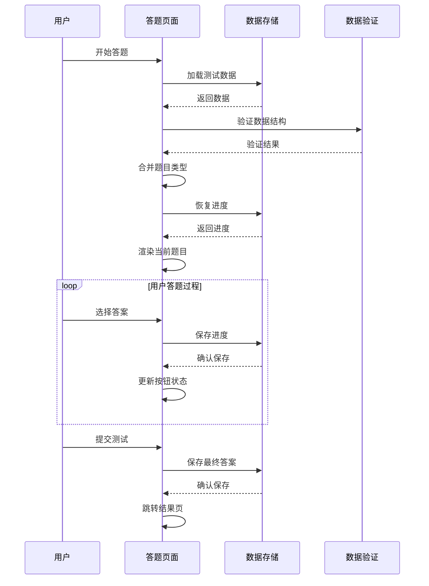
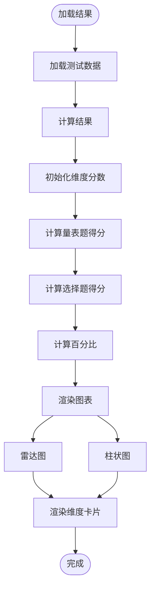
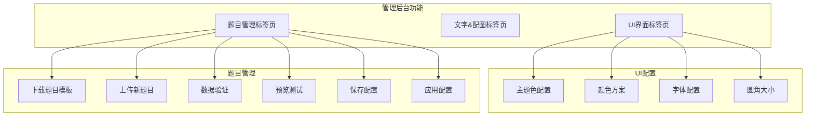
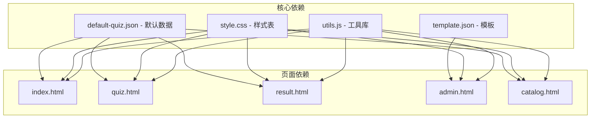
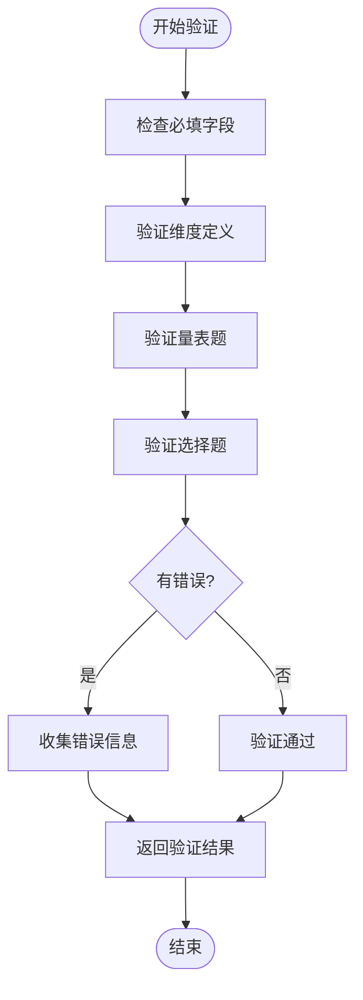

# 调试技巧

<cite>
**本文档引用的文件**
- [index.html](file://index.html)
- [quiz.html](file://quiz.html)
- [result.html](file://result.html)
- [admin.html](file://admin.html)
- [catalog.html](file://catalog.html)
- [css/style.css](file://css/style.css)
- [js/utils.js](file://js/utils.js)
- [data/default-quiz.json](file://data/default-quiz.json)
- [data/template.json](file://data/template.json)
</cite>

## 目录
1. [简介](#简介)
2. [项目结构](#项目结构)
3. [核心组件](#核心组件)
4. [架构概览](#架构概览)
5. [详细组件分析](#详细组件分析)
6. [依赖关系分析](#依赖关系分析)
7. [性能考虑](#性能考虑)
8. [故障排除指南](#故障排除指南)
9. [结论](#结论)

## 简介

心理测试 v2 是一个基于 Web 的心理测评系统，采用纯前端技术实现，无需服务器端支持。该系统提供了完整的心理测试流程，包括测试数据管理、用户答题、结果计算和可视化展示等功能。本文档专注于为开发者提供全面的调试技巧和故障排除指南，涵盖浏览器开发者工具使用、LocalStorage调试、JSON数据验证、UI配置调试以及性能优化等方面。

## 项目结构

心理测试 v2 采用简洁的文件组织结构，主要包含以下核心文件：



**图表来源**
- [index.html:1-154](file://index.html#L1-L154)
- [quiz.html:1-278](file://quiz.html#L1-L278)
- [result.html:1-374](file://result.html#L1-L374)
- [admin.html:1-402](file://admin.html#L1-L402)
- [css/style.css:1-731](file://css/style.css#L1-L731)
- [js/utils.js:1-250](file://js/utils.js#L1-L250)
- [data/default-quiz.json:1-235](file://data/default-quiz.json#L1-L235)
- [data/template.json:1-49](file://data/template.json#L1-L49)

**章节来源**
- [index.html:1-154](file://index.html#L1-L154)
- [css/style.css:1-731](file://css/style.css#L1-L731)
- [js/utils.js:1-250](file://js/utils.js#L1-L250)

## 核心组件

### 数据存储系统

系统采用LocalStorage作为主要的数据持久化机制，通过统一的StorageUtil类管理所有数据存储操作：



**图表来源**
- [js/utils.js:6-50](file://js/utils.js#L6-L50)
- [js/utils.js:55-126](file://js/utils.js#L55-L126)
- [js/utils.js:131-202](file://js/utils.js#L131-L202)

### 页面导航系统

系统采用统一的导航结构，所有页面都包含相同的导航栏和样式：



**图表来源**
- [index.html:11-19](file://index.html#L11-L19)
- [quiz.html:11-19](file://quiz.html#L11-L19)
- [result.html:14-22](file://result.html#L14-L22)
- [admin.html:11-20](file://admin.html#L11-L20)
- [catalog.html:11-19](file://catalog.html#L11-L19)

**章节来源**
- [js/utils.js:6-50](file://js/utils.js#L6-L50)
- [index.html:11-19](file://index.html#L11-L19)
- [quiz.html:11-19](file://quiz.html#L11-L19)

## 架构概览

心理测试 v2 采用纯前端架构，所有逻辑都在客户端执行：



**图表来源**
- [index.html:84-144](file://index.html#L84-L144)
- [quiz.html:61-117](file://quiz.html#L61-L117)
- [result.html:331-370](file://result.html#L331-L370)
- [js/utils.js:18-49](file://js/utils.js#L18-L49)

## 详细组件分析

### 首页组件分析

首页负责展示测试信息和启动答题流程：



**图表来源**
- [index.html:84-144](file://index.html#L84-L144)

**章节来源**
- [index.html:84-144](file://index.html#L84-L144)

### 答题组件分析

答题页面实现了完整的测试流程，包括题目加载、答案记录和进度跟踪：



**图表来源**
- [quiz.html:61-117](file://quiz.html#L61-L117)
- [quiz.html:178-200](file://quiz.html#L178-L200)
- [quiz.html:257-268](file://quiz.html#L257-L268)

**章节来源**
- [quiz.html:61-117](file://quiz.html#L61-L117)
- [quiz.html:178-200](file://quiz.html#L178-L200)
- [quiz.html:257-268](file://quiz.html#L257-L268)

### 结果组件分析

结果页面负责计算测试结果并生成可视化图表：



**图表来源**
- [result.html:95-133](file://result.html#L95-L133)
- [result.html:154-240](file://result.html#L154-L240)
- [result.html:242-267](file://result.html#L242-L267)

**章节来源**
- [result.html:95-133](file://result.html#L95-L133)
- [result.html:154-240](file://result.html#L154-L240)
- [result.html:242-267](file://result.html#L242-L267)

### 管理后台组件分析

管理后台提供了完整的测试数据管理功能：



**图表来源**
- [admin.html:28-163](file://admin.html#L28-L163)
- [admin.html:293-392](file://admin.html#L293-L392)

**章节来源**
- [admin.html:28-163](file://admin.html#L28-L163)
- [admin.html:293-392](file://admin.html#L293-L392)

## 依赖关系分析

系统的核心依赖关系如下：



**图表来源**
- [js/utils.js:1-250](file://js/utils.js#L1-L250)
- [css/style.css:1-731](file://css/style.css#L1-L731)
- [data/default-quiz.json:1-235](file://data/default-quiz.json#L1-L235)
- [data/template.json:1-49](file://data/template.json#L1-L49)

**章节来源**
- [js/utils.js:1-250](file://js/utils.js#L1-L250)
- [css/style.css:1-731](file://css/style.css#L1-L731)

## 性能考虑

### 内存管理

系统采用LocalStorage进行数据持久化，需要注意以下性能要点：

1. **数据大小限制**：LocalStorage通常限制为5-10MB，避免存储过大的测试数据
2. **序列化开销**：频繁的JSON序列化/反序列化会影响性能
3. **内存泄漏预防**：及时清理不需要的事件监听器和DOM引用

### 网络优化

1. **缓存策略**：合理利用浏览器缓存减少网络请求
2. **异步加载**：使用异步方式加载JSON文件，避免阻塞页面渲染
3. **错误处理**：实现优雅降级，确保网络失败时仍能正常运行

### 渲染优化

1. **虚拟滚动**：对于大量题目时考虑实现虚拟滚动
2. **防抖机制**：对频繁触发的操作使用防抖优化
3. **CSS动画**：合理使用CSS动画而非JavaScript动画

## 故障排除指南

### 浏览器开发者工具使用

#### Elements面板调试技巧

1. **DOM结构检查**
   - 查看元素层级结构，确认HTML结构正确性
   - 检查CSS类名是否正确应用
   - 验证元素属性和数据绑定

2. **样式调试**
   - 使用检查器查看元素的实际样式
   - 修改CSS变量验证响应式效果
   - 检查媒体查询断点

3. **事件监听器**
   - 查看元素绑定的事件处理器
   - 检查事件冒泡和捕获行为
   - 验证事件处理函数的执行顺序

**章节来源**
- [css/style.css:6-20](file://css/style.css#L6-L20)
- [index.html:22-61](file://index.html#L22-L61)

#### Console面板调试技巧

1. **错误监控**
   ```javascript
   // 常见错误类型
   console.error('数据加载失败:', error);
   console.warn('JSON格式错误:', error);
   console.log('调试信息:', data);
   ```

2. **性能分析**
   ```javascript
   console.time('数据加载');
   // 执行耗时操作
   console.timeEnd('数据加载');
   ```

3. **数据验证**
   ```javascript
   console.table(quizData.dimensions);
   console.group('测试进度');
   console.log('当前题目:', currentQuestionIndex);
   console.log('已答题数:', Object.keys(answers).length);
   console.groupEnd();
   ```

**章节来源**
- [index.html:126-128](file://index.html#L126-L128)
- [quiz.html:109-116](file://quiz.html#L109-L116)
- [result.html:345-349](file://result.html#L345-L349)

#### Sources面板调试技巧

1. **断点设置**
   - 在关键函数入口设置断点
   - 检查异步操作的执行流程
   - 监控数据变化和状态更新

2. **调用栈分析**
   - 查看函数调用链
   - 分析异步操作的回调时机
   - 跟踪错误发生的具体位置

3. **变量监视**
   - 添加监视表达式
   - 观察复杂对象的变化
   - 跟踪数组和集合的状态

**章节来源**
- [js/utils.js:18-49](file://js/utils.js#L18-L49)
- [quiz.html:178-194](file://quiz.html#L178-L194)

#### Network面板调试技巧

1. **请求监控**
   - 监控JSON文件的加载状态
   - 检查HTTP响应码和状态
   - 分析请求耗时和缓存效果

2. **缓存验证**
   - 查看Cache-Control头信息
   - 检查ETag和Last-Modified
   - 验证条件请求的使用

3. **错误诊断**
   - 检查跨域请求问题
   - 分析CORS错误
   - 验证文件路径和权限

**章节来源**
- [index.html:93-96](file://index.html#L93-L96)
- [quiz.html:67-73](file://quiz.html#L67-L73)
- [result.html:338-344](file://result.html#L338-L344)

### LocalStorage调试方法

#### 数据存储检查

1. **浏览器控制台命令**
   ```javascript
   // 查看所有存储项
   localStorage
   
   // 查看特定键值
   localStorage.getItem('quiz_data')
   
   // 清除特定键
   localStorage.removeItem('user_answers')
   
   // 清空所有数据
   localStorage.clear()
   ```

2. **数据完整性验证**
   - 检查JSON数据格式
   - 验证必需字段是否存在
   - 确认数据类型正确性

3. **存储空间监控**
   - 监控存储使用情况
   - 检查存储限制
   - 实现存储清理机制

**章节来源**
- [js/utils.js:18-49](file://js/utils.js#L18-L49)
- [admin.html:367-371](file://admin.html#L367-L371)

#### 数据迁移和备份

1. **数据导出**
   ```javascript
   // 导出现有数据
   const backup = {
       quiz_data: StorageUtil.get('quiz_data'),
       user_answers: StorageUtil.get('user_answers'),
       current_question: StorageUtil.get('current_question')
   }
   
   // 下载备份文件
   Utils.downloadJSON(backup, 'quiz_backup.json')
   ```

2. **数据恢复**
   - 验证导入数据的完整性
   - 检查数据格式兼容性
   - 实现安全的数据覆盖

**章节来源**
- [js/utils.js:150-160](file://js/utils.js#L150-L160)
- [admin.html:367-371](file://admin.html#L367-L371)

### JSON数据验证

#### 验证规则实现

系统实现了完整的JSON数据验证机制：



**图表来源**
- [js/utils.js:55-126](file://js/utils.js#L55-L126)

#### 常见验证错误

1. **必填字段缺失**
   - `quiz_name`: 测试名称
   - `nbr_question`: 题目总数
   - `dimensions`: 维度定义数组

2. **维度定义错误**
   - 缺少 `dimension_id`
   - 缺少 `dimension_name`
   - 维度ID重复

3. **题目数据错误**
   - 缺少 `question_id`
   - 缺少 `question_text`
   - 量表题维度ID缺失
   - 选择题选项不完整

**章节来源**
- [js/utils.js:56-125](file://js/utils.js#L56-L125)
- [data/default-quiz.json:1-235](file://data/default-quiz.json#L1-L235)

### UI配置调试

#### CSS变量调试

系统使用CSS自定义属性实现主题配置：

1. **变量检查**
   ```css
   /* 在Elements面板中检查变量值 */
   :root {
       --primary-color: #FF8C94;
       --secondary-color: #FFD3B6;
       --background-color: #FFF5F5;
       --font-family: "PingFang SC", "Microsoft YaHei", sans-serif;
       --border-radius: 12px;
   }
   ```

2. **动态修改**
   - 在Elements面板中直接修改CSS变量
   - 测试不同主题组合的效果
   - 验证响应式设计的兼容性

3. **配置同步**
   ```javascript
   // 应用UI配置
   function applyUIConfig(config) {
       const root = document.documentElement;
       root.style.setProperty('--primary-color', config.primaryColor);
       root.style.setProperty('--secondary-color', config.secondaryColor);
       // ... 其他变量
   }
   ```

**章节来源**
- [css/style.css:7-20](file://css/style.css#L7-L20)
- [js/utils.js:234-244](file://js/utils.js#L234-L244)
- [admin.html:294-335](file://admin.html#L294-L335)

### 常见问题诊断

#### 测试数据加载失败

**症状表现**：
- 首页显示默认测试信息
- 答题页面提示数据加载失败
- 控制台出现网络错误

**诊断步骤**：
1. 检查网络面板中的JSON文件请求
2. 验证文件路径是否正确
3. 确认服务器响应状态码
4. 检查CORS配置

**解决方案**：
```javascript
// 实现优雅降级
async function loadQuizData() {
    try {
        // 尝试从缓存加载
        let quizData = StorageUtil.get(StorageKeys.QUIZ_DATA);
        
        if (!quizData) {
            // 从服务器加载
            const response = await fetch('data/default-quiz.json');
            if (response.ok) {
                quizData = await response.json();
                StorageUtil.set(StorageKeys.QUIZ_DATA, quizData);
            }
        }
        
        return quizData;
    } catch (error) {
        console.error('加载失败，使用内置默认数据:', error);
        // 回退到内置默认数据
        return getDefaultQuizData();
    }
}
```

**章节来源**
- [index.html:92-104](file://index.html#L92-L104)
- [quiz.html:65-83](file://quiz.html#L65-L83)
- [result.html:337-350](file://result.html#L337-L350)

#### 图表显示异常

**症状表现**：
- Chart.js图表不显示
- 图表渲染错误
- 数据格式不匹配

**诊断步骤**：
1. 检查Chart.js库是否正确加载
2. 验证数据格式和结构
3. 确认Canvas元素可用性
4. 检查浏览器兼容性

**解决方案**：
```javascript
// 图表初始化验证
function renderCharts() {
    try {
        // 验证数据完整性
        if (!dimensionScores || Object.keys(dimensionScores).length === 0) {
            throw new Error('维度数据为空');
        }
        
        // 检查Canvas元素
        const radarCtx = document.getElementById('radarChart');
        const barCtx = document.getElementById('barChart');
        
        if (!radarCtx || !barCtx) {
            throw new Error('Canvas元素不存在');
        }
        
        // 创建图表
        radarChart = new Chart(radarCtx.getContext('2d'), chartConfig);
        
    } catch (error) {
        console.error('图表渲染失败:', error);
        // 显示错误信息
        showError('图表加载失败，请刷新页面重试');
    }
}
```

**章节来源**
- [result.html:167-202](file://result.html#L167-L202)
- [result.html:205-239](file://result.html#L205-L239)

#### 样式渲染问题

**症状表现**：
- 页面布局错乱
- 字体显示异常
- 响应式效果失效

**诊断步骤**：
1. 检查CSS文件加载状态
2. 验证CSS变量的正确性
3. 确认媒体查询的优先级
4. 检查CSS冲突和覆盖

**解决方案**：
```css
/* 使用CSS自定义属性确保一致性 */
:root {
    --primary-color: #FF8C94;
    --secondary-color: #FFD3B6;
    --background-color: #FFF5F5;
    --text-color: #333333;
}

/* 在组件中使用变量 */
.card {
    background: var(--white);
    border-radius: var(--border-radius);
    color: var(--text-color);
}
```

**章节来源**
- [css/style.css:7-20](file://css/style.css#L7-L20)
- [css/style.css:619-683](file://css/style.css#L619-L683)

### 性能调试技巧

#### 内存泄漏检测

1. **事件监听器泄漏**
   ```javascript
   // 正确的做法
   const handleClick = () => {
       // 处理逻辑
   };
   
   element.addEventListener('click', handleClick);
   
   // 移除时清理
   element.removeEventListener('click', handleClick);
   ```

2. **定时器泄漏**
   ```javascript
   // 使用防抖时注意清理
   const debouncedFunc = Utils.debounce(() => {
       // 处理逻辑
   }, 300);
   
   // 组件卸载时清理
   window.addEventListener('beforeunload', () => {
       clearTimeout(debouncedFunc);
   });
   ```

3. **DOM引用泄漏**
   ```javascript
   // 避免循环引用
   const data = {
       element: domElement,
       cleanup: function() {
           this.element = null; // 清理引用
       }
   };
   ```

#### 性能监控

1. **页面加载性能**
   ```javascript
   // 监控关键指标
   const observer = new PerformanceObserver((list) => {
       for (const entry of list.getEntries()) {
           console.log(`${entry.name}: ${entry.duration}ms`);
       }
   });
   
   observer.observe({entryTypes: ['navigation', 'resource']});
   ```

2. **内存使用监控**
   ```javascript
   // Chrome DevTools Memory面板
   // 1. Profile内存使用
   // 2. 比较快照差异
   // 3. 识别内存泄漏源
   ```

3. **网络性能分析**
   ```javascript
   // 监控资源加载
   performance.getEntriesByType('resource')
     .filter(entry => entry.name.includes('.json'))
     .forEach(entry => {
         console.log(`${entry.name}: ${entry.duration}ms`);
     });
   ```

**章节来源**
- [js/utils.js:135-145](file://js/utils.js#L135-L145)
- [quiz.html:197-200](file://quiz.html#L197-L200)

### 移动端调试方法

#### 设备模拟

1. **Chrome DevTools设备模拟**
   - 使用Device Toolbar模拟移动设备
   - 测试不同屏幕尺寸的适配
   - 验证触摸交互效果

2. **真机调试**
   - 通过USB连接真机调试
   - 使用Remote Debugging功能
   - 测试实际网络环境

3. **响应式测试**
   ```css
   @media (max-width: 768px) {
       .scale-options {
           flex-direction: column;
       }
       
       .scale-btn {
           min-width: auto;
           display: flex;
           justify-content: space-between;
           align-items: center;
       }
   }
   ```

**章节来源**
- [css/style.css:619-683](file://css/style.css#L619-L683)
- [quiz.html:648-665](file://quiz.html#L648-L665)

### 调试工具推荐

#### 开发者工具扩展

1. **React Developer Tools**
   - 虽然项目不是React，但可以用于检查DOM结构
   - 分析组件树和状态变化

2. **Lighthouse**
   - 性能分析和最佳实践检查
   - SEO和可访问性评估

3. **Web Vitals**
   - 核心Web指标监控
   - 用户体验质量评估

#### 自动化测试方法

1. **单元测试**
   ```javascript
   // 测试StorageUtil类
   describe('StorageUtil', () => {
       it('should save and retrieve data correctly', () => {
           const testData = { key: 'value' };
           StorageUtil.set('test_key', testData);
           const result = StorageUtil.get('test_key');
           expect(result).toEqual(testData);
       });
   });
   ```

2. **集成测试**
   ```javascript
   // 测试完整的答题流程
   describe('Quiz Flow', () => {
       it('should load questions and save answers', async () => {
           await loadQuizData();
           selectScale(5);
           const progress = StorageUtil.get('current_question');
           expect(progress).toBe(0);
       });
   });
   ```

3. **性能测试**
   ```javascript
   // 测试页面加载性能
   performance.mark('start');
   await loadQuizData();
   performance.mark('end');
   performance.measure('loadQuiz', 'start', 'end');
   ```

**章节来源**
- [js/utils.js:18-49](file://js/utils.js#L18-L49)
- [js/utils.js:131-202](file://js/utils.js#L131-L202)

## 结论

心理测试 v2 项目提供了完整的前端调试和故障排除指南。通过合理使用浏览器开发者工具、理解LocalStorage工作机制、掌握JSON数据验证方法和UI配置调试技巧，开发者可以高效地定位和解决各种技术问题。

关键要点包括：
- 利用Elements面板检查DOM结构和样式
- 使用Console面板进行错误监控和性能分析
- 通过Sources面板设置断点和跟踪执行流程
- 监控Network面板确保资源正确加载
- 掌握LocalStorage调试方法确保数据持久化
- 实现完善的JSON数据验证机制
- 优化UI配置以提升用户体验
- 采用性能监控和内存泄漏检测方法

这些调试技巧不仅适用于当前项目，也为类似前端项目的开发和维护提供了宝贵的参考经验。