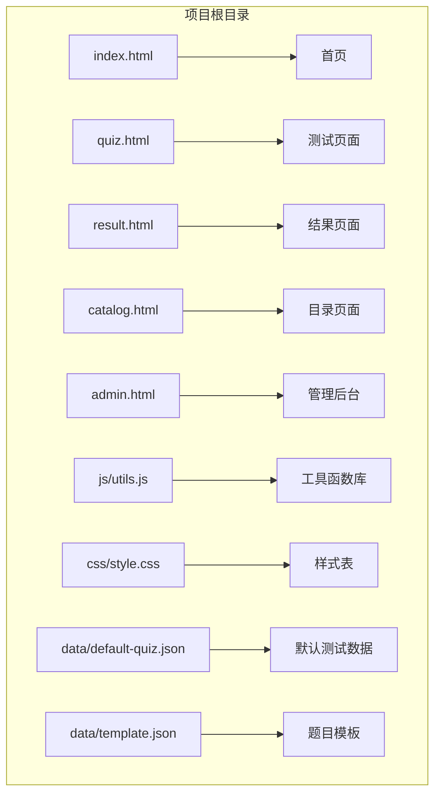
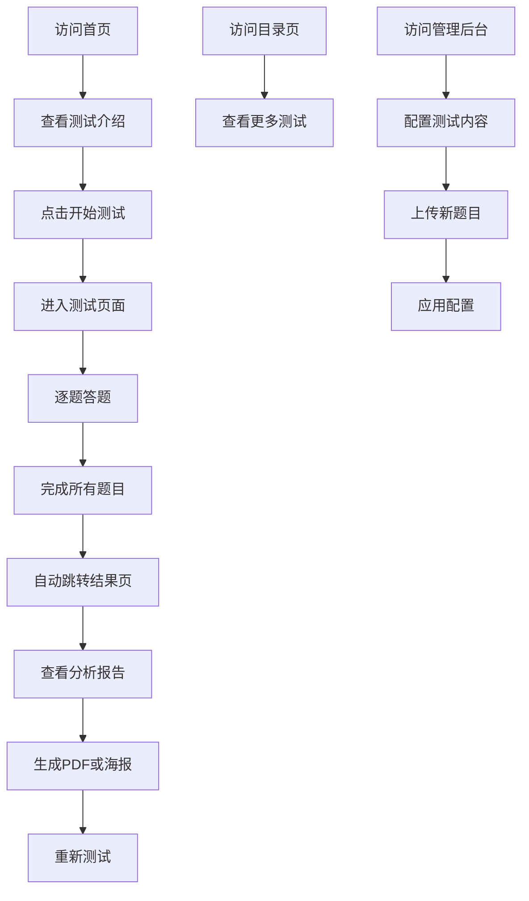
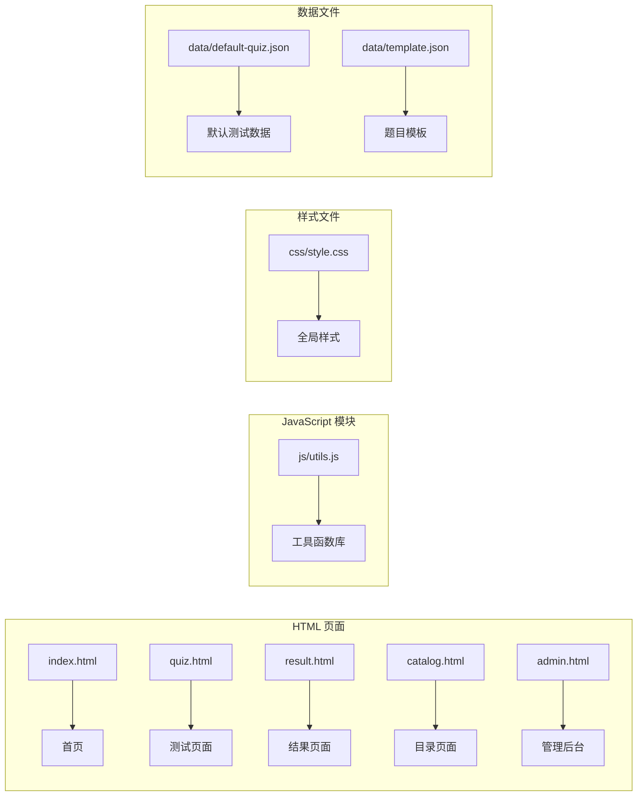

# 快速开始

<cite>
**本文档引用的文件**
- [index.html](file://index.html)
- [quiz.html](file://quiz.html)
- [result.html](file://result.html)
- [admin.html](file://admin.html)
- [catalog.html](file://catalog.html)
- [css/style.css](file://css/style.css)
- [js/utils.js](file://js/utils.js)
- [data/default-quiz.json](file://data/default-quiz.json)
- [data/template.json](file://data/template.json)
</cite>

## 目录
1. [简介](#简介)
2. [项目结构](#项目结构)
3. [环境要求](#环境要求)
4. [本地部署步骤](#本地部署步骤)
5. [基本使用说明](#基本使用说明)
6. [页面导航与功能](#页面导航与功能)
7. [文件结构详解](#文件结构详解)
8. [关键配置文件](#关键配置文件)
9. [常见问题与故障排除](#常见问题与故障排除)
10. [性能考虑](#性能考虑)
11. [总结](#总结)

## 简介

心理测试 v2 是一个基于 Web 的心理测评系统，采用纯前端技术实现，无需服务器端支持。该系统提供了完整的心理测试体验，包括测试展示、答题交互、结果分析和管理后台等功能模块。项目使用现代化的 HTML5、CSS3 和 JavaScript 技术栈，支持响应式设计，在各种设备上都能提供良好的用户体验。

## 项目结构

心理测试 v2 采用简洁的文件组织结构，所有核心文件都位于项目根目录下：



**图表来源**
- [index.html:1-115](file://index.html#L1-L115)
- [quiz.html:1-259](file://quiz.html#L1-L259)
- [result.html:1-363](file://result.html#L1-L363)
- [admin.html:1-402](file://admin.html#L1-L402)
- [catalog.html:1-106](file://catalog.html#L1-L106)

**章节来源**
- [index.html:1-115](file://index.html#L1-L115)
- [quiz.html:1-259](file://quiz.html#L1-L259)
- [result.html:1-363](file://result.html#L1-L363)
- [admin.html:1-402](file://admin.html#L1-L402)
- [catalog.html:1-106](file://catalog.html#L1-L106)

## 环境要求

### 浏览器支持

该项目兼容所有现代浏览器，包括：

- **Chrome**: 最新版
- **Firefox**: 最新版
- **Safari**: 最新版
- **Edge**: 最新版
- **移动端浏览器**: iOS Safari 和 Android Chrome

### 系统要求

- **操作系统**: Windows、macOS、Linux 或移动设备
- **内存**: 至少 512MB RAM
- **存储空间**: 几十 MB 空间
- **网络**: 需要稳定的互联网连接（用于加载外部依赖）

### 特殊功能要求

某些高级功能需要特定的浏览器支持：
- **本地存储**: 需要启用浏览器的本地存储功能
- **Canvas API**: 用于图表渲染和海报生成
- **FileReader API**: 用于文件上传和处理

## 本地部署步骤

### 方法一：直接运行（推荐）

1. **下载项目文件**
   - 从 GitHub 或其他源获取完整项目文件
   - 解压到任意目录

2. **直接打开文件**
   - 在项目根目录下双击 `index.html`
   - 或者在浏览器地址栏输入 `file:///path/to/project/index.html`

3. **验证安装**
   - 页面正常加载，显示欢迎界面
   - 所有导航链接可用
   - 样式和动画正常显示

### 方法二：使用本地服务器

1. **安装本地服务器**
   ```bash
   # 使用 Python
   python -m http.server 8000
   
   # 或使用 Node.js
   npx http-server
   
   # 或使用 npm 包
   npm install -g serve
   serve -s
   ```

2. **启动服务器**
   - 在项目根目录执行上述命令之一
   - 浏览器访问 `http://localhost:8000`

3. **验证服务器运行**
   - 访问 `http://localhost:8000/index.html`
   - 页面正常显示，功能完整

### 方法三：集成到现有网站

1. **复制必要文件**
   - 将所有 HTML 文件复制到目标网站根目录
   - 将 `css` 和 `js` 目录复制到目标网站
   - 将 `data` 目录复制到目标网站

2. **调整路径引用**
   - 修改相对路径以适应新位置
   - 确保静态资源路径正确

**章节来源**
- [index.html:1-115](file://index.html#L1-L115)
- [css/style.css:1-731](file://css/style.css#L1-L731)
- [js/utils.js:1-250](file://js/utils.js#L1-L250)

## 基本使用说明

### 首次使用流程

1. **访问首页**
   - 打开 `index.html` 或通过浏览器访问项目
   - 首页显示测试介绍和基本信息

2. **开始测试**
   - 点击"开始测试"按钮
   - 进入测试页面，开始答题

3. **完成测试**
   - 答完所有题目后自动跳转到结果页面
   - 查看个人测试结果和分析

4. **查看结果**
   - 在结果页面查看详细分析
   - 可选择生成 PDF 报告或分享海报

### 基本操作流程



**图表来源**
- [index.html:29-29](file://index.html#L29-L29)
- [quiz.html:238-249](file://quiz.html#L238-L249)
- [result.html:325-328](file://result.html#L325-L328)

## 页面导航与功能

### 首页 (index.html)

首页是用户访问的第一个页面，提供测试的基本信息和入口：

- **导航栏**: 包含 Logo 和主要导航链接
- **测试信息**: 显示测试名称、参考理论、题目数量等
- **测试说明**: 展示题目数量、预计用时、结果形式
- **维度预览**: 显示各个测试维度的简要介绍
- **开始按钮**: 导航到测试页面的主要入口

### 测试页面 (quiz.html)

测试页面提供完整的答题体验：

- **进度指示**: 花朵生长动画显示答题进度
- **题目显示**: 动态渲染当前题目
- **答题选项**: 支持量表题和选择题两种类型
- **导航控制**: 上一题、下一题、提交按钮
- **进度保存**: 自动保存答题进度

### 结果页面 (result.html)

结果页面展示详细的分析报告：

- **主要结果**: 显示用户的主导维度
- **图表分析**: 雷达图和柱状图展示各维度得分
- **维度详情**: 每个维度的详细解释和得分
- **操作功能**: 生成 PDF 报告、生成分享海报、重新测试

### 目录页面 (catalog.html)

目录页面展示测试集合：

- **当前测试**: 显示当前激活的测试信息
- **测试卡片**: 展示可访问的测试
- **添加测试**: 引导用户前往管理后台添加新测试

### 管理后台 (admin.html)

管理后台提供完整的测试管理系统：

- **UI 配置**: 主题色、字体、圆角等界面定制
- **文字配置**: 标题、按钮文字等文本内容定制
- **题目管理**: 下载模板、上传新题目、预览和应用
- **数据验证**: 自动验证题目文件格式

**章节来源**
- [index.html:10-61](file://index.html#L10-L61)
- [quiz.html:10-47](file://quiz.html#L10-L47)
- [result.html:13-62](file://result.html#L13-L62)
- [catalog.html:10-68](file://catalog.html#L10-L68)
- [admin.html:10-164](file://admin.html#L10-L164)

## 文件结构详解

### 核心文件组织

项目采用按功能模块划分的文件组织方式：



**图表来源**
- [index.html:1-115](file://index.html#L1-L115)
- [js/utils.js:1-250](file://js/utils.js#L1-L250)
- [css/style.css:1-731](file://css/style.css#L1-L731)
- [data/default-quiz.json:1-235](file://data/default-quiz.json#L1-L235)
- [data/template.json:1-49](file://data/template.json#L1-L49)

### 文件命名规范

- **HTML 文件**: 使用功能相关的名词，如 `index.html`、`quiz.html`
- **CSS 文件**: 使用 `style.css` 作为主样式文件
- **JavaScript 文件**: 使用 `utils.js` 作为工具函数库
- **数据文件**: 使用 `default-quiz.json` 和 `template.json`

### 资源组织

- **静态资源**: 所有图片资源位于 `assets/images/` 目录
- **样式文件**: CSS 文件位于 `css/` 目录
- **脚本文件**: JavaScript 文件位于 `js/` 目录
- **数据文件**: JSON 数据文件位于 `data/` 目录

**章节来源**
- [index.html:1-115](file://index.html#L1-L115)
- [css/style.css:1-731](file://css/style.css#L1-L731)
- [js/utils.js:1-250](file://js/utils.js#L1-L250)
- [data/default-quiz.json:1-235](file://data/default-quiz.json#L1-L235)
- [data/template.json:1-49](file://data/template.json#L1-L49)

## 关键配置文件

### 默认测试数据 (default-quiz.json)

默认测试数据文件包含了完整的心理测试内容：

- **测试元数据**: 名称、理论基础、题目数量统计
- **维度定义**: 五个核心维度及其描述
- **量表题**: 25道量表题，每题5分制评分
- **选择题**: 5道情境选择题，对应不同维度

### 题目模板 (template.json)

题目模板文件提供了标准的题目格式：

- **必需字段**: 测试名称、理论基础、题目数量
- **维度结构**: 标准化的维度定义格式
- **量表题格式**: 标准化的量表题结构
- **选择题格式**: 标准化的情境选择题结构

### 工具函数库 (utils.js)

工具函数库提供了核心的功能支持：

- **存储管理**: LocalStorage 操作封装
- **数据验证**: 题目数据格式验证
- **通用工具**: 防抖、下载、文件读取等工具函数
- **UI 配置**: 主题配置管理和应用

### 样式表 (style.css)

样式表文件定义了完整的视觉设计：

- **CSS 变量**: 主题色彩、字体、圆角等变量
- **响应式设计**: 移动端适配和断点
- **组件样式**: 按钮、卡片、导航等组件样式
- **动画效果**: 进度动画、过渡效果等

**章节来源**
- [data/default-quiz.json:1-235](file://data/default-quiz.json#L1-L235)
- [data/template.json:1-49](file://data/template.json#L1-L49)
- [js/utils.js:1-250](file://js/utils.js#L1-L250)
- [css/style.css:1-731](file://css/style.css#L1-L731)

## 常见问题与故障排除

### 问题：页面无法正常加载

**可能原因**:
- 文件路径错误
- 浏览器安全限制
- 网络连接问题

**解决方法**:
1. 确认所有文件都在同一目录下
2. 使用本地服务器而非直接打开文件
3. 检查浏览器控制台是否有错误信息
4. 确保网络连接正常

### 问题：测试数据无法加载

**可能原因**:
- JSON 文件格式错误
- 文件编码问题
- 跨域访问限制

**解决方法**:
1. 使用在线 JSON 验证工具检查文件格式
2. 确保文件使用 UTF-8 编码
3. 将文件放在同一域名下
4. 检查浏览器控制台的网络请求

### 问题：本地存储功能失效

**可能原因**:
- 浏览器禁用了本地存储
- 存储空间不足
- 浏览器隐私设置

**解决方法**:
1. 检查浏览器设置中的本地存储权限
2. 清理浏览器缓存和存储
3. 尝试使用隐私模式访问
4. 更换浏览器测试

### 问题：图表无法显示

**可能原因**:
- Chart.js 库加载失败
- Canvas API 不支持
- 内存不足

**解决方法**:
1. 检查网络连接和 CDN 访问
2. 确认浏览器支持 Canvas API
3. 关闭其他占用内存的程序
4. 刷新页面重新加载

### 问题：文件上传功能异常

**可能原因**:
- 文件格式不正确
- 文件大小超出限制
- 浏览器兼容性问题

**解决方法**:
1. 确保上传的是 JSON 格式文件
2. 检查文件大小是否超过限制
3. 尝试使用不同的浏览器
4. 检查文件权限设置

### 性能优化建议

1. **减少文件大小**: 压缩图片和 CSS 文件
2. **缓存策略**: 利用浏览器缓存机制
3. **异步加载**: 对非关键资源使用异步加载
4. **CDN 加速**: 使用 CDN 加速静态资源

**章节来源**
- [js/utils.js:18-50](file://js/utils.js#L18-L50)
- [css/style.css:619-683](file://css/style.css#L619-L683)
- [result.html:8-11](file://result.html#L8-L11)

## 性能考虑

### 加载性能

- **文件压缩**: CSS 和 JavaScript 文件经过压缩优化
- **缓存策略**: 利用浏览器缓存减少重复加载
- **按需加载**: 非关键资源延迟加载

### 运行时性能

- **内存管理**: 合理使用内存，避免内存泄漏
- **事件处理**: 使用事件委托减少事件监听器数量
- **DOM 操作**: 批量更新 DOM 减少重排重绘

### 移动端优化

- **响应式设计**: 自适应各种屏幕尺寸
- **触摸优化**: 优化触摸交互体验
- **电池优化**: 减少不必要的后台活动

## 总结

心理测试 v2 项目是一个功能完整、易于使用的心理测评系统。通过遵循本文档的快速开始指南，您可以在30分钟内成功部署和使用整个系统。

### 主要特点

- **零服务器依赖**: 纯前端实现，无需服务器支持
- **响应式设计**: 支持各种设备和屏幕尺寸
- **功能完整**: 包含测试展示、答题、结果分析、管理后台
- **易于扩展**: 模块化设计，便于添加新功能和测试

### 快速检查清单

- [ ] 确认所有文件都在同一目录
- [ ] 使用本地服务器运行项目
- [ ] 浏览器支持所有必需功能
- [ ] 测试数据文件格式正确
- [ ] 本地存储功能正常

### 下一步建议

1. **自定义测试内容**: 通过管理后台添加新的心理测试
2. **品牌定制**: 修改主题颜色和品牌标识
3. **功能扩展**: 根据需求添加新的测试类型
4. **部署上线**: 将项目部署到生产环境

通过以上步骤，您将能够充分利用心理测试 v2 的所有功能，为用户提供优质的心理测评体验。