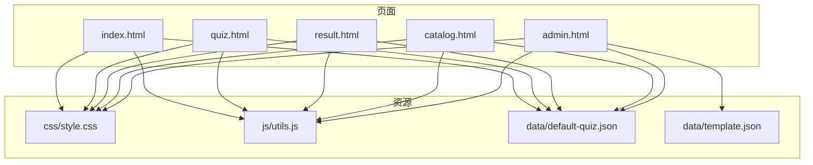
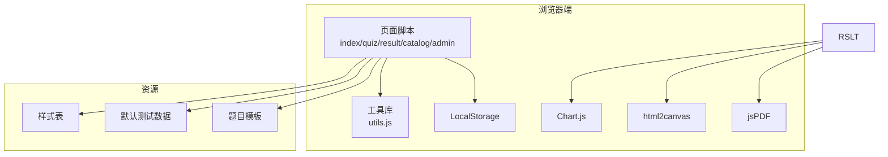
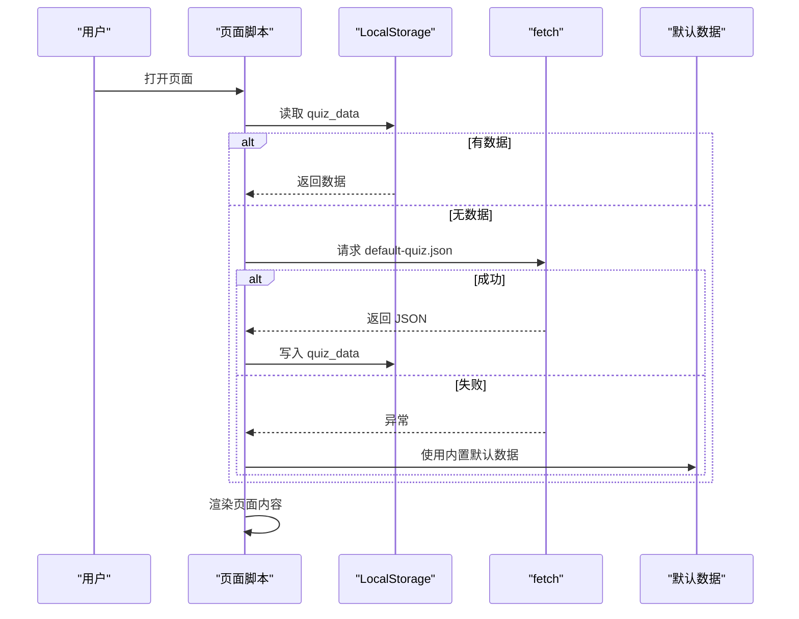
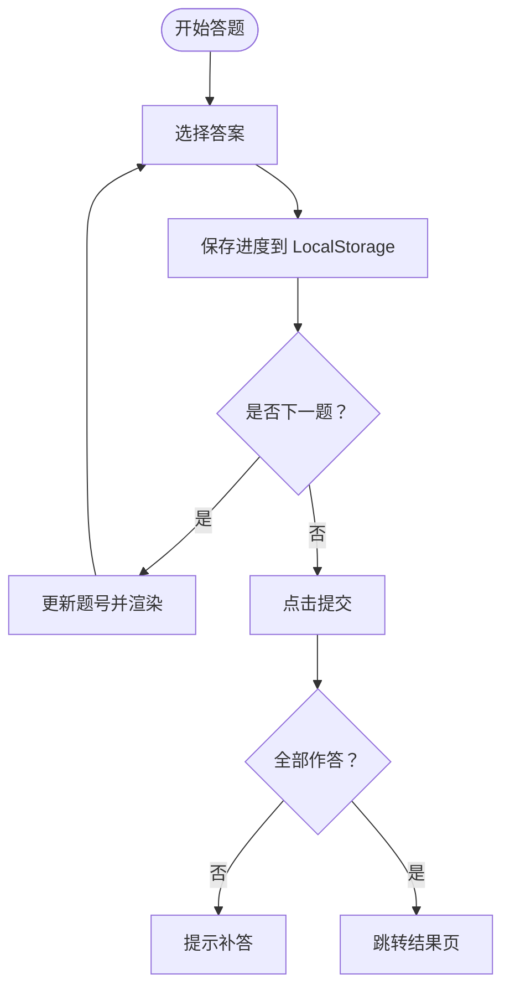
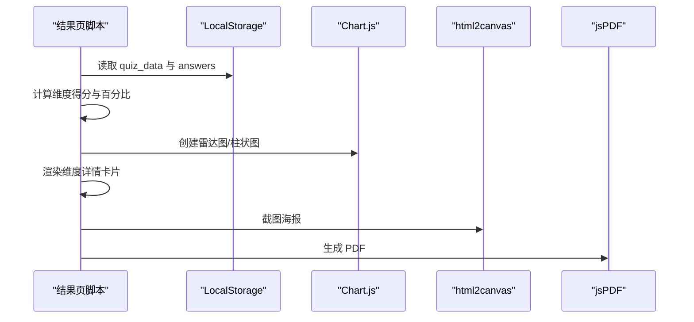
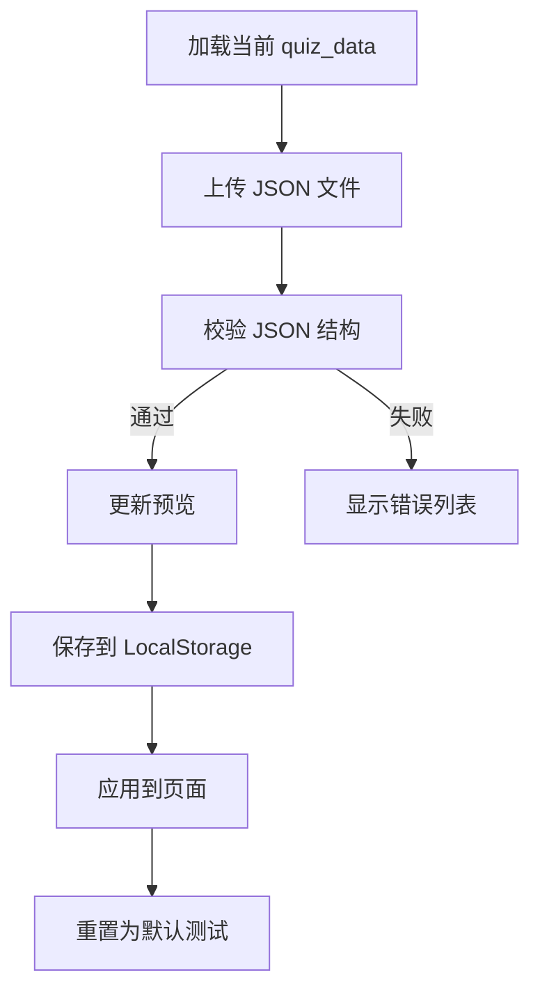
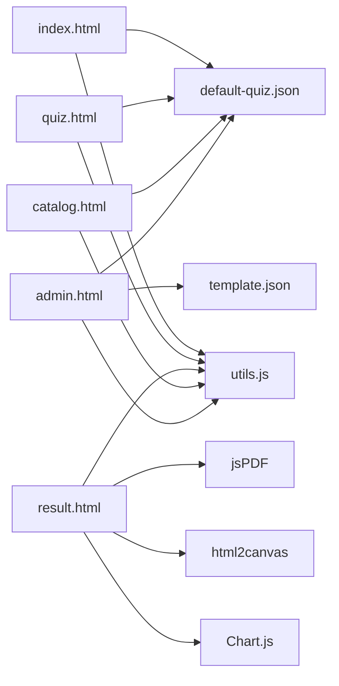

# 故障排除

<cite>
**本文引用的文件**
- [index.html](file://index.html)
- [quiz.html](file://quiz.html)
- [result.html](file://result.html)
- [admin.html](file://admin.html)
- [catalog.html](file://catalog.html)
- [utils.js](file://js/utils.js)
- [default-quiz.json](file://data/default-quiz.json)
- [template.json](file://data/template.json)
- [style.css](file://css/style.css)
</cite>

## 目录
1. [简介](#简介)
2. [项目结构](#项目结构)
3. [核心组件](#核心组件)
4. [架构总览](#架构总览)
5. [详细组件分析](#详细组件分析)
6. [依赖关系分析](#依赖关系分析)
7. [性能考虑](#性能考虑)
8. [故障排除指南](#故障排除指南)
9. [结论](#结论)
10. [附录](#附录)

## 简介
本指南面向心理测试 v2 项目的使用者与维护者，聚焦于常见问题的系统化排查与修复路径，覆盖数据加载失败、图表显示异常、浏览器兼容性、LocalStorage 存储限制、移动端适配、网络相关问题、日志分析与错误监控、性能优化等。文档提供可操作的调试步骤、错误诊断流程与预防措施，帮助快速定位并解决问题，确保系统稳定运行。

## 项目结构
心理测试 v2 采用静态站点结构，核心页面与资源分布如下：
- 页面层：首页、测试页、结果页、目录页、管理后台
- 资源层：样式表、工具库、测试数据与模板
- 数据层：默认测试数据与题目模板

**图表来源**
- [index.html](file://index.html)
- [quiz.html](file://quiz.html)
- [result.html](file://result.html)
- [catalog.html](file://catalog.html)
- [admin.html](file://admin.html)
- [utils.js](file://js/utils.js)
- [default-quiz.json](file://data/default-quiz.json)
- [template.json](file://data/template.json)
- [style.css](file://css/style.css)

**章节来源**
- [index.html](file://index.html)
- [quiz.html](file://quiz.html)
- [result.html](file://result.html)
- [catalog.html](file://catalog.html)
- [admin.html](file://admin.html)
- [utils.js](file://js/utils.js)
- [default-quiz.json](file://data/default-quiz.json)
- [template.json](file://data/template.json)
- [style.css](file://css/style.css)

## 核心组件
- 工具库（utils.js）：封装 LocalStorage 操作、数据校验、通用工具函数、UI 配置应用等
- 页面脚本：各页面在 DOMContentLoaded 后调用工具库进行数据加载、渲染与交互
- 样式表（style.css）：全局样式、响应式布局、动画与主题变量
- 测试数据：默认测试数据与题目模板，供页面加载与管理后台使用

关键职责与交互要点：
- 数据加载优先级：LocalStorage → 远程 JSON → 内置默认数据
- 错误兜底：页面在加载失败时回退到内置默认数据并记录日志
- UI 配置：通过 CSS 变量实现主题色、圆角、字体等动态配置
- 图表渲染：结果页使用 Chart.js 渲染雷达图与柱状图，支持导出 PDF 与海报

**章节来源**
- [utils.js](file://js/utils.js)
- [index.html](file://index.html)
- [quiz.html](file://quiz.html)
- [result.html](file://result.html)
- [style.css](file://css/style.css)

## 架构总览
整体架构为“静态页面 + 工具库 + 本地存储 + 远程数据”的前端单页应用模式。页面间通过 URL 导航与 LocalStorage 共享状态；结果页依赖第三方图表库与截图库进行可视化与导出。

**图表来源**
- [utils.js](file://js/utils.js)
- [index.html](file://index.html)
- [quiz.html](file://quiz.html)
- [result.html](file://result.html)
- [style.css](file://css/style.css)
- [default-quiz.json](file://data/default-quiz.json)
- [template.json](file://data/template.json)

## 详细组件分析

### 数据加载与错误兜底（首页、测试页、目录页）
- 顺序：先读取 LocalStorage，若为空则尝试远程 JSON，失败则使用内置默认数据
- 失败处理：捕获异常并写入控制台日志，同时回退到内置默认数据
- 影响范围：首页标题、描述、维度预览；测试页题目与进度；目录页当前测试展示

**图表来源**
- [index.html](file://index.html)
- [quiz.html](file://quiz.html)
- [catalog.html](file://catalog.html)
- [utils.js](file://js/utils.js)

**章节来源**
- [index.html](file://index.html)
- [quiz.html](file://quiz.html)
- [catalog.html](file://catalog.html)
- [utils.js](file://js/utils.js)

### 本地进度与答案持久化（测试页）
- 进度与答案保存：每答一题即写入 LocalStorage，避免刷新丢失
- 恢复机制：页面加载时读取当前题号与答案集合，恢复答题进度
- 提交校验：提交前检查是否全部作答，否则提示补答

**图表来源**
- [quiz.html](file://quiz.html)
- [utils.js](file://js/utils.js)

**章节来源**
- [quiz.html](file://quiz.html)
- [utils.js](file://js/utils.js)

### 结果计算与图表渲染（结果页）
- 计分逻辑：量表题按数值累加，选择题按选项维度赋分
- 百分比计算：维度得分/最大可能分
- 图表渲染：雷达图与柱状图，响应式配置，禁用图例
- 导出能力：PDF 报告与海报（html2canvas + jsPDF）

**图表来源**
- [result.html](file://result.html)
- [utils.js](file://js/utils.js)

**章节来源**
- [result.html](file://result.html)
- [utils.js](file://js/utils.js)

### 管理后台（admin.html）
- 题目管理：下载模板、上传 JSON、验证、预览、保存、应用、重置
- UI 配置：颜色、字体、圆角等，支持预览、保存、应用、重置
- 数据来源：优先使用当前 quiz_data，否则加载默认数据

**图表来源**
- [admin.html](file://admin.html)
- [utils.js](file://js/utils.js)
- [template.json](file://data/template.json)

**章节来源**
- [admin.html](file://admin.html)
- [utils.js](file://js/utils.js)
- [template.json](file://data/template.json)

## 依赖关系分析
- 页面对工具库的依赖：统一的数据访问、UI 配置、文件读取与下载
- 结果页对第三方库的依赖：Chart.js、html2canvas、jsPDF
- 数据依赖：默认测试数据与模板文件
- 样式依赖：CSS 变量驱动的主题与响应式布局

**图表来源**
- [index.html](file://index.html)
- [quiz.html](file://quiz.html)
- [result.html](file://result.html)
- [catalog.html](file://catalog.html)
- [admin.html](file://admin.html)
- [utils.js](file://js/utils.js)
- [default-quiz.json](file://data/default-quiz.json)
- [template.json](file://data/template.json)

**章节来源**
- [index.html](file://index.html)
- [quiz.html](file://quiz.html)
- [result.html](file://result.html)
- [catalog.html](file://catalog.html)
- [admin.html](file://admin.html)
- [utils.js](file://js/utils.js)
- [default-quiz.json](file://data/default-quiz.json)
- [template.json](file://data/template.json)

## 性能考虑
- 资源加载
  - 将样式与脚本置于页面底部，减少阻塞
  - 对第三方库（Chart.js、html2canvas、jsPDF）按需加载，仅在结果页使用
- 渲染优化
  - 使用 CSS 变量与媒体查询实现响应式，避免重复计算
  - 控制图表渲染时机，避免频繁重绘
- 存储与缓存
  - 利用 LocalStorage 缓存 quiz_data 与 UI 配置，减少网络请求
  - 合理设置键名与数据结构，避免超限
- 网络与离线
  - 优先使用本地数据，远程失败时回退默认数据
  - 对模板与默认数据进行压缩与缓存

[本节为通用指导，无需特定文件引用]

## 故障排除指南

### 一、数据加载失败
- 症状
  - 首页/目录页标题或描述显示“加载中…”或默认值
  - 测试页无法渲染题目或提示“加载失败”
- 排查步骤
  1) 检查浏览器控制台是否存在网络错误（如跨域、404、CORS）
  2) 确认 data/default-quiz.json 是否存在且格式正确
  3) 在 LocalStorage 中确认是否存在 quiz_data 键
  4) 若远程加载失败，确认是否使用了正确的相对路径
- 解决方案
  - 修正路径或部署到同源环境
  - 修复 JSON 格式错误（使用在线校验工具）
  - 清理 LocalStorage 中的损坏数据后重试
  - 确保服务器支持静态文件访问

**章节来源**
- [index.html](file://index.html)
- [quiz.html](file://quiz.html)
- [catalog.html](file://catalog.html)
- [default-quiz.json](file://data/default-quiz.json)
- [utils.js](file://js/utils.js)

### 二、图表显示异常（结果页）
- 症状
  - 雷达图/柱状图空白或渲染失败
  - 导出 PDF/海报时报错
- 排查步骤
  1) 检查浏览器控制台是否有 Chart.js 相关错误
  2) 确认 Canvas 上下文可用，尺寸是否为 0
  3) 检查数据结构：维度名称、百分比数组长度是否一致
  4) 导出失败时检查 html2canvas 与 jsPDF 的加载状态
- 解决方案
  - 确保在 DOMContentLoaded 后初始化图表
  - 设置合理的响应式配置与容器尺寸
  - 导出前等待截图完成，避免缩略图质量差
  - 降级处理：在不支持的浏览器中提示用户升级或更换浏览器

**章节来源**
- [result.html](file://result.html)
- [utils.js](file://js/utils.js)

### 三、浏览器兼容性问题
- 常见问题
  - ES6+ 语法不支持（如箭头函数、const/let、模板字符串）
  - Fetch API 与 Promise 不可用
  - LocalStorage 不可用或被禁用
  - html2canvas/jsPDF 在旧版浏览器表现异常
- 处理策略
  - 使用 Babel 转译或引入 polyfill（Promise、fetch、Array.from 等）
  - 为不支持的特性提供降级逻辑（如使用 XMLHttpRequest 替代 fetch）
  - 捕获 LocalStorage 异常并提示用户开启或清理缓存
  - 对导出功能进行能力检测，必要时提示用户升级浏览器

**章节来源**
- [utils.js](file://js/utils.js)
- [result.html](file://result.html)

### 四、LocalStorage 存储限制
- 症状
  - 保存失败返回 false，或抛出 QUOTA_EXCEEDED_ERR
- 排查步骤
  1) 检查当前站点的存储配额与已用空间
  2) 确认存储键名是否过多或单键数据过大
  3) 检查是否包含冗余或历史数据
- 解决方案
  - 清理不必要的键（如历史进度、临时配置）
  - 压缩数据结构，拆分大对象
  - 采用分片存储或服务端持久化（扩展方向）

**章节来源**
- [utils.js](file://js/utils.js)

### 五、移动端适配问题
- 症状
  - 字体过小、按钮拥挤、滚动体验差
  - 量表题选项换行或点击不灵敏
- 排查步骤
  1) 检查媒体查询是否生效
  2) 确认触摸目标尺寸与间距是否符合移动端体验
  3) 检查视口设置与缩放行为
- 解决方案
  - 调整字体大小与按钮宽度，保证最小点击面积
  - 优化量表题选项为纵向排列，提升可触达性
  - 使用 CSS 变量统一调整移动端阈值

**章节来源**
- [style.css](file://css/style.css)
- [quiz.html](file://quiz.html)

### 六、网络相关问题
- 症状
  - 首次加载缓慢、超时或失败
  - 离线状态下页面不可用
- 处理策略
  - 使用 CDN 缓存静态资源
  - 为关键数据提供本地缓存与回退
  - 对非关键资源延迟加载

**章节来源**
- [index.html](file://index.html)
- [quiz.html](file://quiz.html)
- [result.html](file://result.html)

### 七、日志分析与错误监控
- 日志位置
  - 控制台错误：网络请求失败、JSON 解析错误、图表初始化异常
  - 自定义日志：工具库中的错误捕获与警告
- 建议
  - 在生产环境接入轻量错误上报（如 beacon 或简单上报接口）
  - 对关键路径增加埋点（数据加载、图表渲染、导出成功/失败）

**章节来源**
- [utils.js](file://js/utils.js)
- [index.html](file://index.html)
- [result.html](file://result.html)

### 八、预防措施
- 开发期
  - 使用 ESLint/Prettier 规范代码风格
  - 对关键函数添加单元测试与集成测试
- 运行期
  - 定期清理 LocalStorage，避免膨胀
  - 监控第三方库版本，及时升级安全补丁
  - 对外链资源增加健康检查与降级策略

[本节为通用指导，无需特定文件引用]

## 结论
通过建立“数据加载优先级 + 错误兜底 + UI 配置 + 图表与导出能力 + 移动端适配”的体系化排障流程，心理测试 v2 能够在多种环境下保持稳定运行。建议团队在开发与运维中持续关注浏览器兼容性、网络与存储限制、第三方库的稳定性，并结合日志与监控持续优化用户体验。

[本节为总结性内容，无需特定文件引用]

## 附录

### A. 常见错误码与含义
- 404：资源路径错误或文件不存在
- CORS：跨域访问被拒绝
- JSON 解析错误：文件格式不合法
- QUOTA_EXCEEDED_ERR：LocalStorage 存储超限

**章节来源**
- [index.html](file://index.html)
- [quiz.html](file://quiz.html)
- [result.html](file://result.html)
- [utils.js](file://js/utils.js)

### B. 关键路径与数据流速查
- 首页：index.html → utils.js 读取 quiz_data → 渲染标题/描述/维度
- 测试页：quiz.html → 加载 quiz_data → 合并题目 → 渲染题目 → 保存进度
- 结果页：result.html → 计算得分 → 渲染图表 → 导出 PDF/海报
- 管理后台：admin.html → 下载模板 → 上传 JSON → 校验 → 应用

**章节来源**
- [index.html](file://index.html)
- [quiz.html](file://quiz.html)
- [result.html](file://result.html)
- [admin.html](file://admin.html)
- [utils.js](file://js/utils.js)