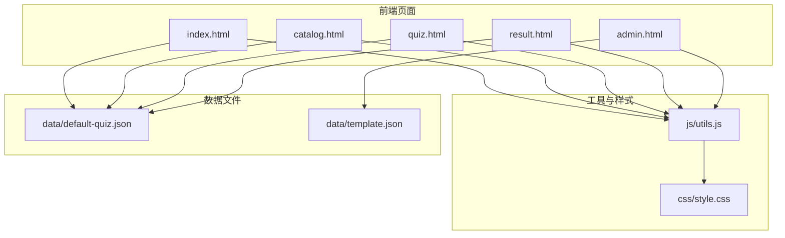
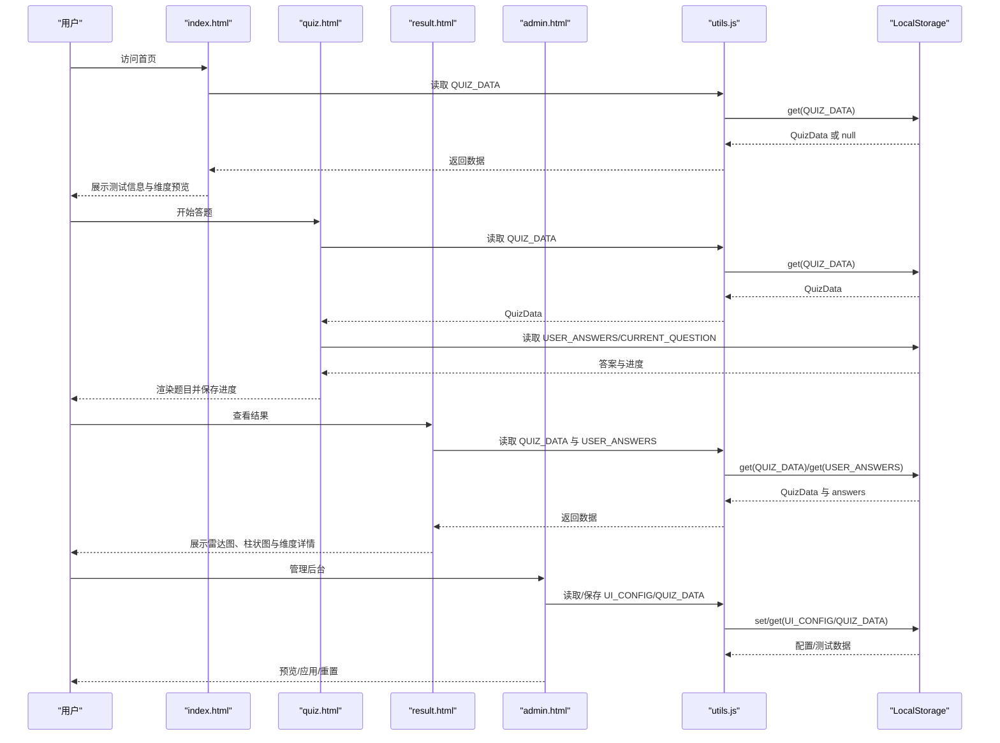
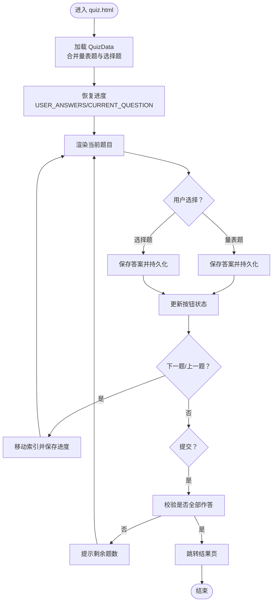
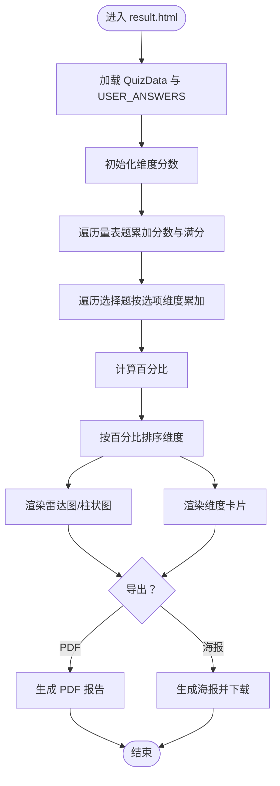
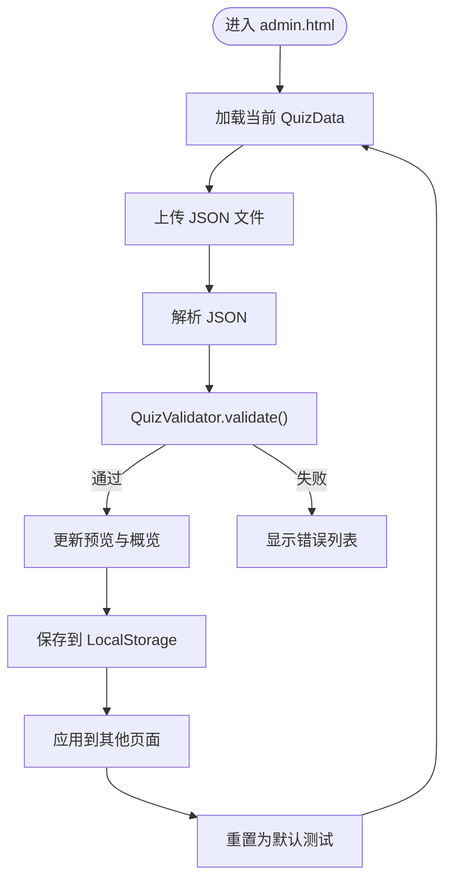
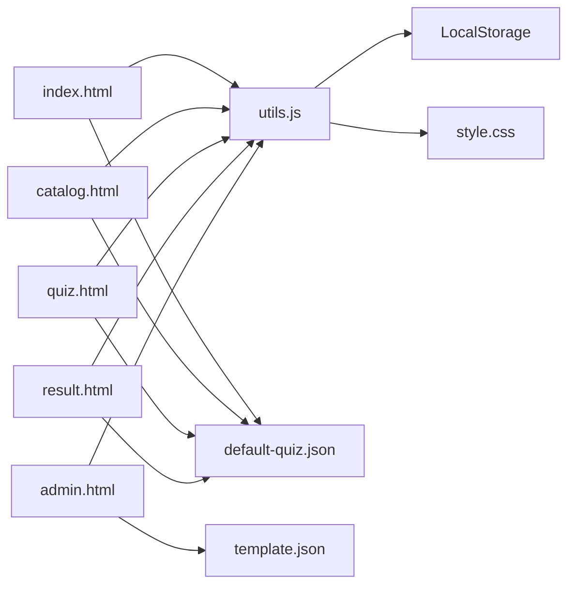

# 数据结构设计

<cite>
**本文引用的文件**
- [default-quiz.json](file://data/default-quiz.json)
- [template.json](file://data/template.json)
- [utils.js](file://js/utils.js)
- [index.html](file://index.html)
- [quiz.html](file://quiz.html)
- [result.html](file://result.html)
- [admin.html](file://admin.html)
- [style.css](file://css/style.css)
</cite>

## 更新摘要
**变更内容**
- 新增完整的测试数据模型实现，包含量表题、选择题、维度定义的完整结构
- 新增数据验证器（QuizValidator）确保JSON数据的完整性和一致性
- 新增动态数据加载机制，支持从LocalStorage和JSON文件的双重加载策略
- 新增管理后台功能，支持JSON模板下载、上传验证和实时预览
- 新增UI配置系统，支持主题色、字体、布局等动态配置

## 目录
1. [简介](#简介)
2. [项目结构](#项目结构)
3. [核心数据模型](#核心数据模型)
4. [架构总览](#架构总览)
5. [详细组件分析](#详细组件分析)
6. [依赖关系分析](#依赖关系分析)
7. [性能考量](#性能考量)
8. [故障排查指南](#故障排查指南)
9. [结论](#结论)
10. [附录](#附录)

## 简介
本文件面向心理测试 v2 项目，系统性梳理并文档化其数据结构设计与实现细节。重点覆盖：
- 测试数据模型：QuizData 结构、维度定义、题目配置
- 用户数据模型：答案存储、进度保存、配置持久化
- JSON 数据格式规范、字段定义、校验规则与扩展字段支持
- 数据模型间的关系、约束与业务规则
- 数据访问模式、缓存策略与性能优化建议
- 数据结构图、示例数据与迁移指南

**更新** 项目现已实现完整的测试数据模型，支持量表题和选择题两种题型，包含维度定义、题目配置、答案存储等完整功能。

## 项目结构
项目采用前端静态资源组织方式，核心数据以 JSON 文件形式存放，前端通过 JavaScript 实现数据加载、校验、计算与持久化。

**图表来源**
- [index.html:1-532](file://index.html#L1-L532)
- [quiz.html:1-441](file://quiz.html#L1-L441)
- [result.html:1-800](file://result.html#L1-L800)
- [admin.html:1-411](file://admin.html#L1-L411)
- [utils.js:1-250](file://js/utils.js#L1-L250)
- [style.css:1-200](file://css/style.css#L1-L200)
- [default-quiz.json:1-235](file://data/default-quiz.json#L1-L235)
- [template.json:1-49](file://data/template.json#L1-L49)

## 核心数据模型
本节定义测试与用户数据的核心结构、字段含义、约束与关系。

### 测试数据模型（QuizData）
- 顶层字段
  - quiz_name: 字符串，测试名称
  - reference: 字符串，理论基础/参考来源
  - nbr_question: 数字，总题数
  - nbr_question_scale: 数字，量表题数量
  - nbr_question_choice: 数字，选择题数量
  - nbr_dimension: 数字，维度数量
  - dimensions: 数组，维度定义
  - scale_questions: 数组，量表题集合
  - choice_questions: 数组，选择题集合（可选）

- 维度定义（dimensions[i]）
  - dimension_id: 字符串，维度唯一标识
  - dimension_name: 字符串，维度名称
  - description: 字符串，维度描述

- 量表题（scale_questions[i]）
  - question_id: 字符串，题目唯一标识
  - dimension_id: 字符串，所属维度
  - question_text: 字符串，题目正文

- 选择题（choice_questions[i]）
  - question_id: 字符串，题目唯一标识
  - question_text: 字符串，题目正文
  - option_a_text/option_b_text/option_c_text/option_d_text/option_e_text: 字符串，选项文本（可选）
  - option_a_dim/option_b_dim/option_c_dim/option_d_dim/option_e_dim: 字符串，选项对应维度（可选）

- 业务规则
  - 所有量表题必须关联一个维度
  - 选择题的每个有效选项必须关联一个维度
  - 总题数应等于量表题数与选择题数之和

**章节来源**
- [default-quiz.json:1-235](file://data/default-quiz.json#L1-L235)
- [template.json:1-49](file://data/template.json#L1-L49)

### 用户数据模型
- 用户答案（answers）
  - 类型：对象映射
  - 键：question_id（字符串）
  - 值：量表题为 1~5 的整数；选择题为 'a'~'e' 的字母
  - 存储位置：LocalStorage，键名见"持久化键"部分

- 当前进度（current_question_index）
  - 类型：数字
  - 含义：当前题目索引（从 0 开始）
  - 存储位置：LocalStorage

- 测试配置（quiz_config）
  - 类型：对象
  - 存储位置：LocalStorage
  - 用途：用于控制测试行为（如是否启用选择题等），当前实现未使用该键

- UI 配置（ui_config）
  - 类型：对象
  - 字段：theme、primaryColor、secondaryColor、backgroundColor、fontFamily、fontSize、borderRadius、maxWidth
  - 存储位置：LocalStorage
  - 应用：通过 CSS 自定义属性注入页面

- 持久化键（StorageKeys）
  - QUIZ_DATA: 测试数据
  - USER_ANSWERS: 用户答案
  - CURRENT_QUESTION: 当前题目索引
  - QUIZ_CONFIG: 测试配置
  - UI_CONFIG: UI 配置

**章节来源**
- [utils.js:6-12](file://js/utils.js#L6-L12)
- [utils.js:17-50](file://js/utils.js#L17-L50)
- [quiz.html:60-98](file://quiz.html#L60-L98)
- [result.html:88-92](file://result.html#L88-L92)
- [admin.html:174-176](file://admin.html#L174-L176)

## 架构总览
下图展示数据在页面间的流转与持久化路径。

**图表来源**
- [index.html:70-105](file://index.html#L70-L105)
- [quiz.html:60-98](file://quiz.html#L60-L98)
- [result.html:330-359](file://result.html#L330-L359)
- [admin.html:188-203](file://admin.html#L188-L203)
- [utils.js:17-50](file://js/utils.js#L17-L50)

## 详细组件分析

### 测试数据加载与渲染（index.html）
- 加载流程
  - 优先从 LocalStorage 读取 QUIZ_DATA
  - 若不存在则从 data/default-quiz.json 加载并写入 LocalStorage
  - 渲染测试标题、参考来源、题数统计与维度预览

- 数据来源与字段使用
  - 使用 quiz_name、reference、nbr_question、dimensions

**章节来源**
- [index.html:70-105](file://index.html#L70-L105)
- [default-quiz.json:1-235](file://data/default-quiz.json#L1-L235)

### 答题流程与进度保存（quiz.html）
- 数据合并
  - 将 scale_questions 与 choice_questions 合并为 allQuestions，并标注类型
- 答案存储
  - answers 对象以 question_id 为键，值为用户选择
  - 每次选择后调用 saveProgress 持久化 USER_ANSWERS 与 CURRENT_QUESTION
- 进度可视化
  - 通过进度条高度与花朵图标阶段反映答题进度

**图表来源**
- [quiz.html:60-98](file://quiz.html#L60-L98)
- [quiz.html:100-175](file://quiz.html#L100-L175)
- [quiz.html:177-250](file://quiz.html#L177-L250)

**章节来源**
- [quiz.html:52-98](file://quiz.html#L52-L98)
- [quiz.html:100-175](file://quiz.html#L100-L175)
- [quiz.html:177-250](file://quiz.html#L177-L250)

### 结果计算与可视化（result.html）
- 计算逻辑
  - 初始化维度分数，遍历量表题按答案累加，遍历选择题按选项维度累加
  - 计算百分比并排序维度
- 可视化
  - 雷达图与柱状图展示维度占比
  - 维度卡片展示名称、百分比与描述
- 导出能力
  - 生成 PDF 报告
  - 生成分享海报并下载图片

**图表来源**
- [result.html:94-133](file://result.html#L94-L133)
- [result.html:153-240](file://result.html#L153-L240)
- [result.html:269-328](file://result.html#L269-L328)

**章节来源**
- [result.html:87-133](file://result.html#L87-L133)
- [result.html:153-240](file://result.html#L153-L240)
- [result.html:269-328](file://result.html#L269-L328)

### 管理后台与数据校验（admin.html）
- 功能
  - 下载模板、上传并校验 JSON 文件
  - 预览、保存、应用、重置测试数据
  - UI 配置的预览、保存、应用、重置
- 校验规则
  - 必填字段：quiz_name、nbr_question
  - 维度表：dimension_id、dimension_name
  - 量表题：question_id、dimension_id、question_text
  - 选择题：question_id、question_text；至少存在一组有效选项（option_X_text 与 option_X_dim 同时存在）

**图表来源**
- [admin.html:188-203](file://admin.html#L188-L203)
- [admin.html:252-291](file://admin.html#L252-L291)
- [utils.js:55-126](file://js/utils.js#L55-L126)

**章节来源**
- [admin.html:188-203](file://admin.html#L188-L203)
- [admin.html:252-291](file://admin.html#L252-L291)
- [utils.js:55-126](file://js/utils.js#L55-L126)

### 工具与持久化（utils.js）
- StorageKeys：统一管理本地存储键名
- StorageUtil：封装 localStorage 的 set/get/remove/clear 与清空答题进度方法
- QuizValidator：校验 QuizData 的完整性与一致性
- Utils：通用工具（防抖、下载 JSON、读取文件、生成 ID、格式化百分比、平滑滚动）
- UI 配置：DefaultUIConfig 与 getUIConfig/applyUIConfig 将配置注入 CSS 自定义属性

**章节来源**
- [utils.js:6-12](file://js/utils.js#L6-L12)
- [utils.js:17-50](file://js/utils.js#L17-L50)
- [utils.js:55-126](file://js/utils.js#L55-L126)
- [utils.js:131-202](file://js/utils.js#L131-L202)
- [utils.js:207-244](file://js/utils.js#L207-L244)

## 依赖关系分析
- 页面到工具
  - index.html、quiz.html、result.html、catalog.html、admin.html 均依赖 utils.js 提供的存储、校验与 UI 配置能力
- 页面到数据
  - index.html、quiz.html、result.html、catalog.html 依赖 data/default-quiz.json
  - admin.html 依赖 data/template.json
- 工具到存储
  - utils.js 通过 StorageUtil 操作 LocalStorage
- 样式到配置
  - style.css 通过 CSS 自定义属性消费 utils.js 注入的 UI 配置

**图表来源**
- [index.html:68-112](file://index.html#L68-L112)
- [catalog.html:75-103](file://catalog.html#L75-L103)
- [quiz.html:49-256](file://quiz.html#L49-L256)
- [result.html:85-360](file://result.html#L85-L360)
- [admin.html:171-399](file://admin.html#L171-L399)
- [utils.js:17-50](file://js/utils.js#L17-L50)
- [style.css:6-20](file://css/style.css#L6-L20)

**章节来源**
- [index.html:68-112](file://index.html#L68-L112)
- [catalog.html:75-103](file://catalog.html#L75-L103)
- [quiz.html:49-256](file://quiz.html#L49-L256)
- [result.html:85-360](file://result.html#L85-L360)
- [admin.html:171-399](file://admin.html#L171-L399)
- [utils.js:17-50](file://js/utils.js#L17-L50)
- [style.css:6-20](file://css/style.css#L6-L20)

## 性能考量
- 数据加载
  - 首屏优先从 LocalStorage 读取 QuizData，避免重复网络请求
  - 仅在缺失时才拉取默认 JSON 文件并缓存
- 渲染优化
  - 题目渲染采用最小 DOM 更新策略，仅替换题目容器内容
  - 选项选择后即时保存，减少页面刷新带来的抖动
- 计算复杂度
  - 结果计算线性遍历题目与维度，时间复杂度 O(N)，空间复杂度 O(D)
- 存储容量
  - LocalStorage 适合小规模测试数据；若题量大幅增长，建议服务端存储与分页加载

## 故障排查指南
- 无法加载测试数据
  - 检查 LocalStorage 中 QUIZ_DATA 是否存在；若不存在，确认 data/default-quiz.json 可访问且格式正确
- 答题进度丢失
  - 确认 CURRENT_QUESTION 与 USER_ANSWERS 是否被意外清除；可通过 StorageUtil.clearQuizProgress() 清理
- 选择题无效
  - 确保每个有效选项同时具备 option_X_text 与 option_X_dim
- UI 配置不生效
  - 检查 UI_CONFIG 是否正确保存；确认 applyUIConfig() 已调用并注入 CSS 自定义属性

**章节来源**
- [utils.js:46-50](file://js/utils.js#L46-L50)
- [quiz.html:177-181](file://quiz.html#L177-L181)
- [admin.html:252-291](file://admin.html#L252-L291)
- [utils.js:226-244](file://js/utils.js#L226-L244)

## 结论
心理测试 v2 的数据结构清晰简洁，采用 JSON 文件作为测试数据载体，结合 LocalStorage 实现轻量级持久化。QuizData 模型覆盖维度、量表题与选择题三类核心实体，配合 QuizValidator 保障数据质量。用户侧通过 answers 与进度索引实现无缝答题体验，结果页基于维度分数进行可视化呈现。整体架构易于扩展，便于后续引入更多测试与高级功能。

## 附录

### JSON 数据格式规范与字段说明
- 顶层字段
  - quiz_name: 必填，字符串
  - reference: 必填，字符串
  - nbr_question: 必填，数字
  - nbr_question_scale: 必填，数字
  - nbr_question_choice: 必填，数字
  - nbr_dimension: 必填，数字
  - dimensions: 必填数组，元素包含 dimension_id、dimension_name、description
  - scale_questions: 必填数组，元素包含 question_id、dimension_id、question_text
  - choice_questions: 可选数组，元素包含 question_id、question_text 以及若干选项（option_a_text/.../option_e_text 与 option_a_dim/.../option_e_dim 成对出现）

- 校验规则
  - 必填字段缺失即视为无效
  - 量表题与选择题均需维度关联
  - 选择题至少存在一组有效选项

**章节来源**
- [default-quiz.json:1-235](file://data/default-quiz.json#L1-L235)
- [template.json:1-49](file://data/template.json#L1-L49)
- [utils.js:55-126](file://js/utils.js#L55-L126)

### 示例数据
- 默认测试数据：data/default-quiz.json
- 模板文件：data/template.json

**章节来源**
- [default-quiz.json:1-235](file://data/default-quiz.json#L1-L235)
- [template.json:1-49](file://data/template.json#L1-L49)

### 数据迁移指南
- 新增测试
  - 使用 data/template.json 作为模板，填写必要字段与题目
  - 在管理后台上传并校验通过后，保存并应用
- 修改现有测试
  - 保持 dimension_id 与 question_id 的稳定性，避免破坏历史答案映射
  - 如需调整维度数量或题目数量，同步更新 nbr_* 字段
- 迁移到服务端
  - 当 LocalStorage 不足以承载更大规模数据时，建议将 QuizData 与用户答案迁移到服务端数据库
  - 保持 JSON 结构不变，通过 API 接口替代本地文件与 LocalStorage

### 数据验证器实现
项目实现了完整的数据验证器，确保 JSON 数据的完整性和一致性：

- 必填字段验证：quiz_name、nbr_question
- 维度表验证：dimension_id、dimension_name
- 量表题验证：question_id、dimension_id、question_text
- 选择题验证：question_id、question_text；至少存在一组有效选项（option_X_text 与 option_X_dim 同时存在）

**章节来源**
- [utils.js:55-126](file://js/utils.js#L55-L126)

### 动态数据加载机制
项目实现了智能的数据加载机制：

- 优先从 LocalStorage 读取缓存数据
- 若缓存数据缺失或损坏，从 JSON 文件加载并缓存
- 支持多种加载路径：绝对路径、相对路径、内置默认数据
- 实现了数据完整性检查和错误处理

**章节来源**
- [index.html:90-140](file://index.html#L90-L140)
- [quiz.html:82-154](file://quiz.html#L82-L154)

### UI 配置系统
项目提供了完整的 UI 配置系统：

- 支持主题色、辅助色、背景色的自定义
- 支持字体、圆角大小、最大宽度等布局配置
- 通过 CSS 自定义属性实现动态样式注入
- 提供预览、保存、应用、重置功能

**章节来源**
- [utils.js:207-244](file://js/utils.js#L207-L244)
- [admin.html:293-335](file://admin.html#L293-L335)