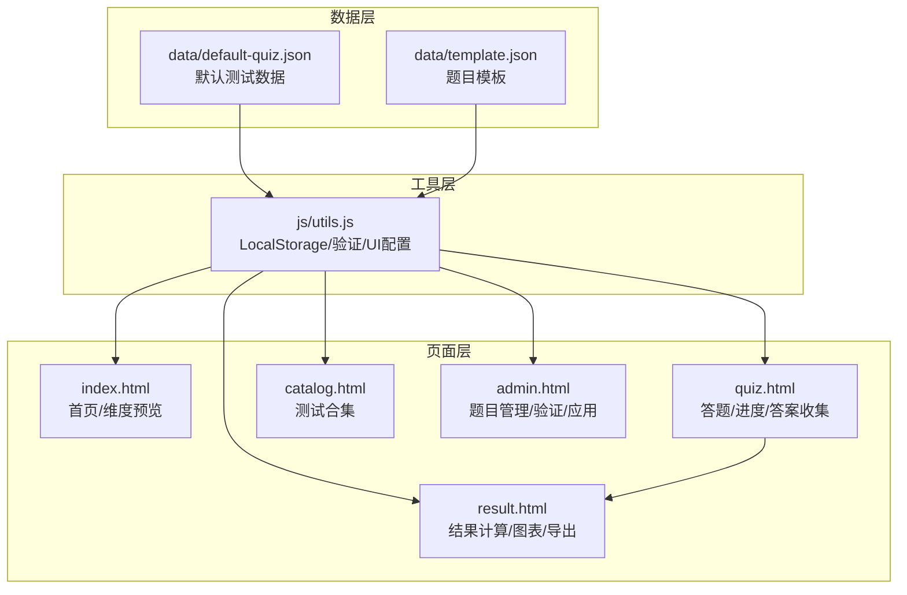
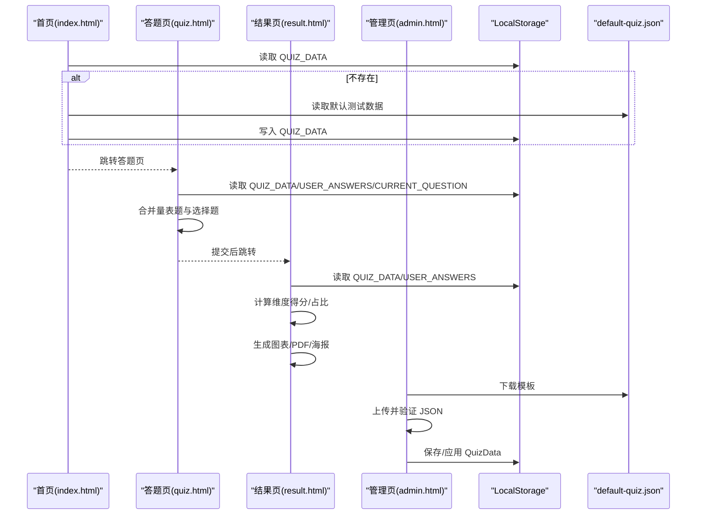
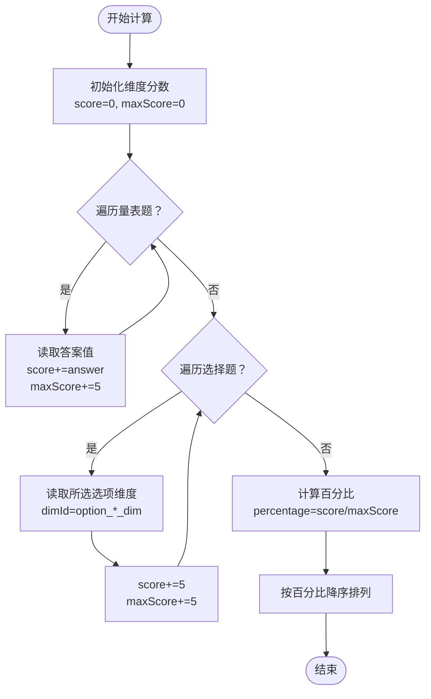
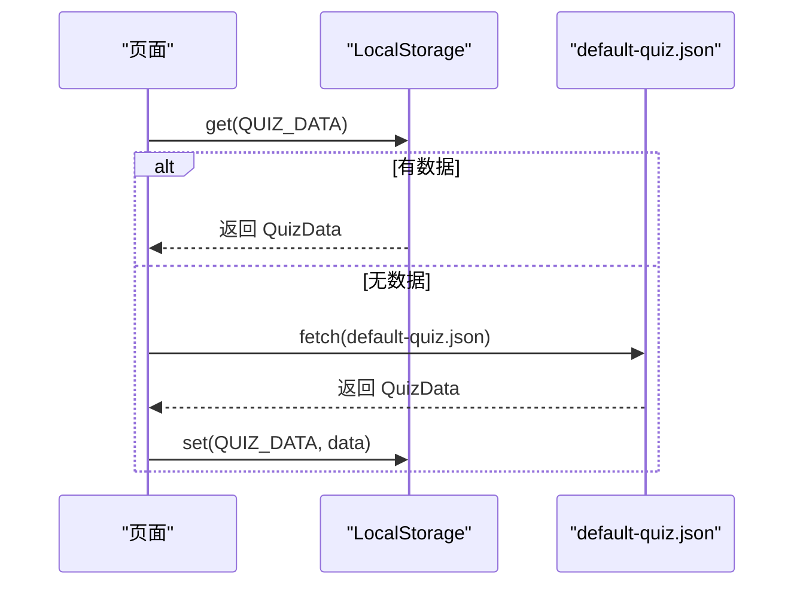
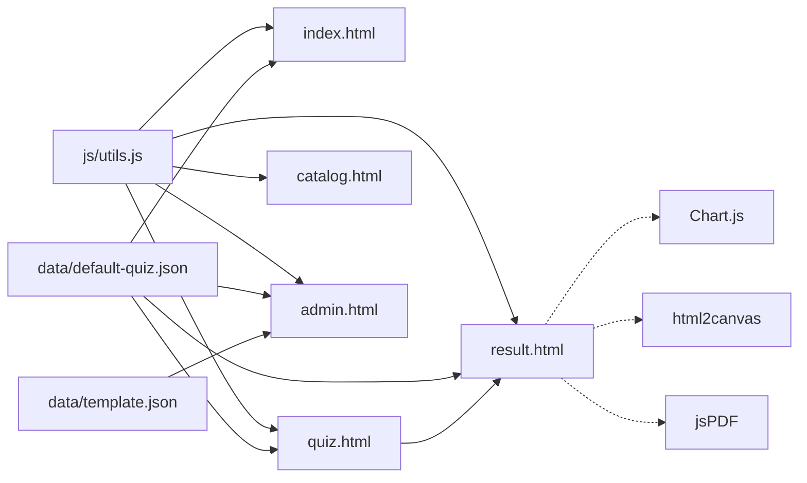

# 测试数据模型

<cite>
**本文引用的文件**
- [default-quiz.json](file://程序/data/default-quiz.json)
- [template.json](file://程序/data/template.json)
- [utils.js](file://程序/js/utils.js)
- [index.html](file://程序/index.html)
- [quiz.html](file://程序/quiz.html)
- [result.html](file://程序/result.html)
- [catalog.html](file://程序/catalog.html)
- [admin.html](file://程序/admin.html)
- [style.css](file://程序/css/style.css)
</cite>

## 更新摘要
**变更内容**
- 新增量表题和选择题的分离数据结构
- 新增维度配置和题目验证机制
- 新增UI配置系统和PDF导出功能
- 新增小人形象系统和海报生成功能
- 优化数据验证规则和错误处理
- 新增默认测试数据和模板数据支持

## 目录
1. [简介](#简介)
2. [项目结构](#项目结构)
3. [核心组件](#核心组件)
4. [架构总览](#架构总览)
5. [详细组件分析](#详细组件分析)
6. [依赖分析](#依赖分析)
7. [性能考虑](#性能考虑)
8. [故障排除指南](#故障排除指南)
9. [结论](#结论)
10. [附录](#附录)

## 简介
本文件面向"心理测试 v2"项目，系统性阐述测试数据模型（QuizData）的完整结构与实现细节。重点覆盖：
- QuizData 元数据字段（quiz_name、reference、nbr_question 等）
- dimensions 数组中每个维度的定义（dimension_id、dimension_name、description）
- scale_questions 与 choice_questions 的完整配置结构
- 题目数据字段定义、选项配置与维度关联规则
- JSON 数据格式规范、字段类型说明与验证规则
- 实际测试数据示例、字段映射关系与扩展字段支持
- 设计原则、约束条件与业务逻辑
- **新增**：默认测试数据、模板数据、数据验证系统、UI配置系统

## 项目结构
该项目采用前端静态页面+本地存储的数据驱动模式，核心数据以 JSON 文件形式存在，运行时通过 JavaScript 读取并渲染。关键文件与职责如下：
- data/default-quiz.json：默认测试数据源，包含完整的 QuizData 结构
- data/template.json：题目模板，用于生成符合规范的新测试
- js/utils.js：工具库，包含数据验证、UI 配置、LocalStorage 操作等
- index.html、quiz.html、result.html、catalog.html、admin.html：页面入口，分别负责展示、答题、结果、目录与管理
- css/style.css：全局样式，支撑 UI 配置与响应式布局

**图表来源**
- [default-quiz.json:1-235](file://程序/data/default-quiz.json#L1-L235)
- [template.json:1-49](file://程序/data/template.json#L1-L49)
- [utils.js:1-250](file://程序/js/utils.js#L1-L250)
- [index.html:1-518](file://程序/index.html#L1-L518)
- [quiz.html:1-441](file://程序/quiz.html#L1-L441)
- [result.html:1-1568](file://程序/result.html#L1-L1568)
- [catalog.html:1-90](file://程序/catalog.html#L1-L90)
- [admin.html:1-411](file://程序/admin.html#L1-L411)
- [style.css:1-702](file://程序/css/style.css#L1-L702)

**章节来源**
- [default-quiz.json:1-235](file://程序/data/default-quiz.json#L1-L235)
- [template.json:1-49](file://程序/data/template.json#L1-L49)
- [utils.js:1-250](file://程序/js/utils.js#L1-L250)
- [index.html:1-518](file://程序/index.html#L1-L518)
- [quiz.html:1-441](file://程序/quiz.html#L1-L441)
- [result.html:1-1568](file://程序/result.html#L1-L1568)
- [catalog.html:1-90](file://程序/catalog.html#L1-L90)
- [admin.html:1-411](file://程序/admin.html#L1-L411)
- [style.css:1-702](file://程序/css/style.css#L1-L702)

## 核心组件
- QuizData：测试数据的根对象，包含元数据、维度定义、量表题与选择题三大部分
- QuizValidator：对 QuizData 进行结构与完整性校验
- StorageUtil：封装 LocalStorage 的读写与清理操作
- Utils：通用工具（防抖、下载 JSON、读取文件、生成 ID、格式化百分比、滚动）
- **新增**：UIConfig：完整的界面配置系统，支持主题色、字体、圆角等自定义
- **新增**：PersonaSystem：小人形象系统，基于维度得分生成个性化角色

**章节来源**
- [utils.js:55-126](file://程序/js/utils.js#L55-L126)
- [utils.js:17-50](file://程序/js/utils.js#L17-L50)
- [utils.js:131-202](file://程序/js/utils.js#L131-L202)

## 架构总览
QuizData 在页面间流转路径如下：
- 首页与目录页：从 LocalStorage 或默认 JSON 加载 QuizData，渲染基本信息与维度预览
- 答题页：合并量表题与选择题为统一题列表，按序渲染，记录用户答案
- 结果页：基于 QuizData 计算维度得分与占比，生成图表与维度详情，支持PDF和海报导出
- 管理页：提供下载模板、上传校验、保存与应用

**图表来源**
- [index.html:84-144](file://程序/index.html#L84-L144)
- [quiz.html:60-117](file://程序/quiz.html#L60-L117)
- [result.html:330-359](file://程序/result.html#L330-L359)
- [admin.html:243-291](file://程序/admin.html#L243-L291)
- [default-quiz.json:1-235](file://程序/data/default-quiz.json#L1-L235)

## 详细组件分析

### QuizData 数据模型定义
- 元数据字段
  - quiz_name：字符串，测试名称
  - reference：字符串，理论基础或参考来源
  - nbr_question：整数，总题数
  - nbr_question_scale：整数，量表题数量
  - nbr_question_choice：整数，选择题数量
  - nbr_dimension：整数，维度数量
- dimensions：数组，每个元素包含
  - dimension_id：字符串，维度标识符（与题目 dimension_id 对应）
  - dimension_name：字符串，维度名称
  - description：字符串，维度描述
- scale_questions：数组，量表题集合
  - question_id：字符串，题目唯一标识
  - dimension_id：字符串，所属维度
  - question_text：字符串，题目正文
- choice_questions：数组，选择题集合（可选）
  - question_id：字符串，题目唯一标识
  - question_text：字符串，题干
  - option_a_text/option_b_text/option_c_text/option_d_text/option_e_text：字符串，选项文本
  - option_a_dim/option_b_dim/option_c_dim/option_d_dim/option_e_dim：字符串，选项所关联的维度

字段类型与约束
- 所有字段均为字符串或数值，遵循 JSON 规范
- 必填字段：quiz_name、nbr_question、dimensions、scale_questions
- 量表题与选择题均需具备 question_id、question_text；选择题需至少一个有效选项（文本与维度均存在）
- dimensions 中每个维度需具备 dimension_id、dimension_name

**章节来源**
- [default-quiz.json:1-235](file://程序/data/default-quiz.json#L1-L235)
- [template.json:1-49](file://程序/data/template.json#L1-L49)
- [utils.js:55-126](file://程序/js/utils.js#L55-L126)

### 题目数据字段与维度关联规则
- 量表题（scale_questions）
  - 计分规则：非常不同意=1，不同意=2，中立=3，同意=4，非常同意=5
  - 计算维度得分：将每道量表题的答案累加到对应 dimension_id 的维度分数中
- 选择题（choice_questions）
  - 选项维度映射：每个选项（A-E）绑定一个 dimension_id
  - 计算维度得分：若用户选择了某选项，则该选项对应的 dimension_id 得 5 分，最大分值也为 5 分
  - **新增**：支持多选，用户可以选择多个选项，每个选中的选项都会为对应维度加分
- 维度排序与展示
  - 结果页按维度得分占比降序展示，最高分维度突出显示
  - **新增**：显示每个维度的百分比得分和雷达图

**图表来源**
- [result.html:95-133](file://程序/result.html#L95-L133)

**章节来源**
- [default-quiz.json:35-161](file://程序/data/default-quiz.json#L35-L161)
- [default-quiz.json:162-233](file://程序/data/default-quiz.json#L162-L233)
- [result.html:95-133](file://程序/result.html#L95-L133)

### 选项配置与维度映射
- 选择题支持 A、B、C、D、E 五个选项，每个选项包含：
  - 文本：option_X_text
  - 维度：option_X_dim（X ∈ {a,b,c,d,e}）
- 至少需要一个有效选项（同时具备文本与维度）才视为有效题目
- 选项维度用于选择题计分，量表题通过 dimension_id 直接关联维度
- **新增**：选择题支持多选，用户可以选择多个选项，每个选中的选项都会为对应维度加分

**章节来源**
- [default-quiz.json:162-233](file://程序/data/default-quiz.json#L162-L233)
- [utils.js:98-119](file://程序/js/utils.js#L98-L119)

### 数据加载与持久化流程
- 首页与目录页优先从 LocalStorage 读取 QuizData，否则从默认 JSON 加载并缓存
- 答题页合并量表题与选择题为统一题列表，使用 LocalStorage 存储当前题号与用户答案
- 结果页读取 QuizData 与用户答案，计算维度得分并生成图表
- 管理页提供下载模板、上传校验、保存与应用

**图表来源**
- [index.html:84-105](file://程序/index.html#L84-L105)
- [quiz.html:60-83](file://程序/quiz.html#L60-L83)
- [result.html:334-342](file://程序/result.html#L334-L342)
- [admin.html:188-203](file://程序/admin.html#L188-L203)

**章节来源**
- [index.html:84-144](file://程序/index.html#L84-L144)
- [quiz.html:60-117](file://程序/quiz.html#L60-L117)
- [result.html:330-359](file://程序/result.html#L330-L359)
- [admin.html:188-203](file://程序/admin.html#L188-L203)

### 数据验证规则与错误处理
- 必填字段校验：quiz_name、nbr_question、dimensions、scale_questions
- dimensions 校验：每个维度必须包含 dimension_id、dimension_name
- scale_questions 校验：每道题必须包含 question_id、dimension_id、question_text
- choice_questions 校验：每道题必须包含 question_id、question_text；至少有一个有效选项（文本与维度均存在）
- 错误信息以数组形式返回，便于在管理页展示

**章节来源**
- [utils.js:55-126](file://程序/js/utils.js#L55-L126)
- [admin.html:252-291](file://程序/admin.html#L252-L291)

### UI 配置与扩展字段支持
- UI 配置项（通过管理页设置并保存到 LocalStorage）：
  - 主题色、辅助色、背景色、字体、圆角大小、最大宽度
- 扩展字段建议：
  - quiz_description：测试描述
  - author：作者信息
  - version：版本号
  - tags：标签数组
  - metadata：其他元数据对象
- 扩展字段不影响现有解析逻辑，但可在管理页或结果页中展示

**章节来源**
- [utils.js:207-229](file://程序/js/utils.js#L207-L229)
- [admin.html:293-335](file://程序/admin.html#L293-L335)
- [style.css:6-20](file://程序/css/style.css#L6-L20)

### 维度统计与结果展示
- **新增**：结果页显示每个维度的百分比得分和雷达图
- **新增**：支持PDF报告生成，包含小人形象、维度得分、详细解读
- **新增**：支持分享海报生成，可下载高清海报
- **新增**：小人形象系统，基于首要和次要维度生成个性化角色

**章节来源**
- [result.html:338-502](file://程序/result.html#L338-L502)
- [result.html:504-605](file://程序/result.html#L504-L605)
- [result.html:607-762](file://程序/result.html#L607-L762)

### PDF导出与海报生成系统
- **新增**：PDF报告生成系统，包含两页内容：
  - 第一页：小人形象展示、标签、首要和次要爱语识别
  - 第二页：维度详细解读和描述
- **新增**：海报生成系统，支持高清图片下载
- **新增**：烟花庆祝特效，增强用户体验

**章节来源**
- [result.html:1146-1301](file://程序/result.html#L1146-L1301)
- [result.html:1303-1357](file://程序/result.html#L1303-L1357)
- [result.html:1364-1435](file://程序/result.html#L1364-L1435)

### 默认测试数据与模板系统
- **新增**：default-quiz.json 包含完整的"爱的五种语言"测试数据
- **新增**：template.json 提供标准化的测试数据模板
- **新增**：数据加载优先级：LocalStorage → 默认JSON → 内置数据
- **新增**：数据验证系统确保测试数据的完整性和有效性

**章节来源**
- [default-quiz.json:1-235](file://程序/data/default-quiz.json#L1-L235)
- [template.json:1-49](file://程序/data/template.json#L1-L49)
- [index.html:90-126](file://程序/index.html#L90-L126)
- [admin.html:243-291](file://程序/admin.html#L243-L291)

## 依赖分析
- 页面与工具的耦合
  - index.html、quiz.html、result.html、catalog.html、admin.html 均依赖 utils.js 提供的工具函数与验证器
  - quiz.html 依赖 LocalStorage 存储用户进度与答案
  - result.html 依赖 Chart.js 与 html2canvas/jspdf 进行图表与导出
- 数据依赖
  - 默认数据源来自 data/default-quiz.json
  - 模板来自 data/template.json
- 外部依赖
  - Chart.js、html2canvas、jspdf 由 CDN 引入

**图表来源**
- [utils.js:1-250](file://程序/js/utils.js#L1-L250)
- [index.html:68-518](file://程序/index.html#L68-L518)
- [quiz.html:49-441](file://程序/quiz.html#L49-L441)
- [result.html:8-1568](file://程序/result.html#L8-L1568)
- [admin.html:171-411](file://程序/admin.html#L171-L411)
- [default-quiz.json:1-235](file://程序/data/default-quiz.json#L1-L235)
- [template.json:1-49](file://程序/data/template.json#L1-L49)

**章节来源**
- [utils.js:1-250](file://程序/js/utils.js#L1-L250)
- [index.html:68-518](file://程序/index.html#L68-L518)
- [quiz.html:49-441](file://程序/quiz.html#L49-L441)
- [result.html:8-1568](file://程序/result.html#L8-L1568)
- [admin.html:171-411](file://程序/admin.html#L171-L411)

## 性能考虑
- 数据加载
  - 优先使用 LocalStorage 减少网络请求；仅在首次或异常时读取 JSON 文件
- 渲染优化
  - 防抖函数可用于高频事件（如窗口尺寸变化）
  - 图表渲染延迟到结果页，避免答题页额外开销
- 存储策略
  - 用户答案与当前题号分离存储，减少单次读写体积
- 响应式设计
  - 样式针对移动端进行优化，减少重排重绘
- **新增**：UI配置缓存，避免重复计算CSS变量
- **新增**：PDF和海报生成使用异步处理，避免阻塞主线程

## 故障排除指南
- 无法加载测试数据
  - 检查 LocalStorage 是否可用；若不可用，确认 default-quiz.json 可访问且格式正确
  - 查看浏览器控制台错误日志
- 题目验证失败
  - 按照错误列表逐项修正：缺失字段、选项无效、维度不匹配
- 答题进度丢失
  - 清理 LocalStorage 中的用户答案与当前题号，重新开始
- 结果页图表不显示
  - 确认外部依赖（Chart.js、html2canvas、jsPDF）CDN 正常加载
- **新增**：UI配置不生效
  - 检查CSS变量是否正确应用，确认UI配置已保存到LocalStorage
- **新增**：PDF生成失败
  - 检查html2canvas和jsPDF是否正确加载，确认网络环境正常
- **新增**：默认数据加载失败
  - 检查 default-quiz.json 文件是否存在且格式正确
  - 确认服务器能够正确提供 JSON 文件

**章节来源**
- [index.html:84-144](file://程序/index.html#L84-L144)
- [quiz.html:60-117](file://程序/quiz.html#L60-L117)
- [result.html:330-359](file://程序/result.html#L330-L359)
- [admin.html:252-291](file://程序/admin.html#L252-L291)

## 结论
本测试数据模型以 QuizData 为核心，通过明确的元数据、维度定义与题目结构，实现了清晰的业务逻辑与可扩展性。配合工具库的验证与 UI 配置能力，项目在易用性与可维护性方面表现良好。**新增的量表题和选择题分离结构、维度统计功能、UI配置系统、PDF导出和小人形象系统**进一步增强了项目的实用性，支持更丰富的测试体验和个性化定制。**新增的默认测试数据、模板数据和数据验证系统**确保了项目的稳定性和易用性，开发者可以快速创建和部署新的心理测试项目。

## 附录

### JSON 数据格式规范与字段说明
- QuizData
  - 字段名：quiz_name、reference、nbr_question、nbr_question_scale、nbr_question_choice、nbr_dimension、dimensions、scale_questions、choice_questions
  - 类型：字符串（quiz_name、reference）、整数（nbr_*）、数组（dimensions、scale_questions、choice_questions）
  - 必填：quiz_name、nbr_question、dimensions、scale_questions
- dimensions
  - 字段名：dimension_id、dimension_name、description
  - 类型：字符串
  - 必填：dimension_id、dimension_name
- scale_questions
  - 字段名：question_id、dimension_id、question_text
  - 类型：字符串
  - 必填：question_id、dimension_id、question_text
- choice_questions
  - 字段名：question_id、question_text、option_a_text~option_e_text、option_a_dim~option_e_dim
  - 类型：字符串
  - 必填：question_id、question_text；至少一个有效选项

**章节来源**
- [default-quiz.json:1-235](file://程序/data/default-quiz.json#L1-L235)
- [template.json:1-49](file://程序/data/template.json#L1-L49)
- [utils.js:55-126](file://程序/js/utils.js#L55-L126)

### 实际测试数据示例
- 爱的五种语言测试（来自默认数据）
  - quiz_name：爱的五种语言测试
  - reference：Gary Chapman 的五种爱语理论
  - nbr_question：30
  - nbr_question_scale：25
  - nbr_question_choice：5
  - nbr_dimension：5
  - dimensions：包含五个维度及其描述
  - scale_questions：25 道量表题，按维度分布
  - choice_questions：5 道情境选择题，每题五个选项，分别映射到不同维度

**章节来源**
- [default-quiz.json:1-235](file://程序/data/default-quiz.json#L1-L235)

### 字段映射关系
- 量表题：question_id → dimension_id → 维度分数累加
- 选择题：question_id → 所选项 → option_X_dim → 维度分数累加
- 结果页：按维度百分比排序展示
- **新增**：维度统计：计算每个维度的百分比得分并显示雷达图

**章节来源**
- [default-quiz.json:35-233](file://程序/data/default-quiz.json#L35-L233)
- [result.html:95-133](file://程序/result.html#L95-L133)

### 扩展字段支持建议
- 新增字段：quiz_description、author、version、tags、metadata
- 建议在管理页增加字段编辑与展示位置，保持向后兼容
- **新增**：UI配置字段：theme、primaryColor、secondaryColor、backgroundColor、fontFamily、borderRadius、maxWidth

**章节来源**
- [admin.html:293-335](file://程序/admin.html#L293-L335)
- [style.css:6-20](file://程序/css/style.css#L6-L20)

### 新增功能特性
- **量表题和选择题分离结构**：明确区分两种题型的数据结构和计分规则
- **维度统计功能**：结果显示每个维度的百分比得分和雷达图
- **题目分类功能**：量表题和选择题的不同计分规则和交互方式
- **UI配置系统**：完整的界面自定义能力
- **导出功能**：PDF报告和分享海报生成
- **小人形象系统**：基于维度得分生成个性化角色
- **PDF生成系统**：两页内容的完整报告
- **海报生成系统**：高清图片下载功能
- **烟花特效系统**：庆祝动画效果
- **默认测试数据系统**：内置完整的测试数据
- **模板数据系统**：标准化的测试数据模板
- **数据验证系统**：完整的数据格式和完整性验证

**章节来源**
- [result.html:338-762](file://程序/result.html#L338-L762)
- [quiz.html:128-131](file://程序/quiz.html#L128-L131)
- [admin.html:293-335](file://程序/admin.html#L293-L335)
- [default-quiz.json:1-235](file://程序/data/default-quiz.json#L1-L235)
- [template.json:1-49](file://程序/data/template.json#L1-L49)
- [utils.js:55-126](file://程序/js/utils.js#L55-L126)