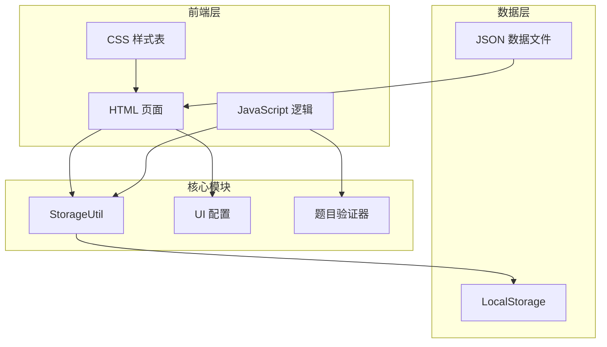
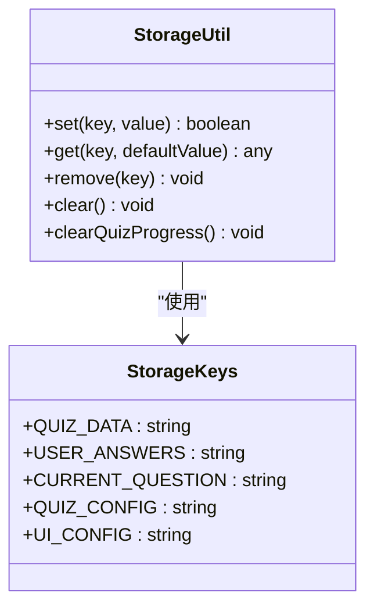
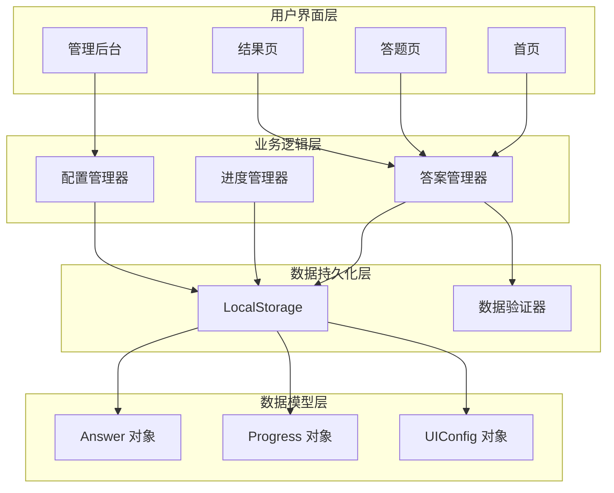
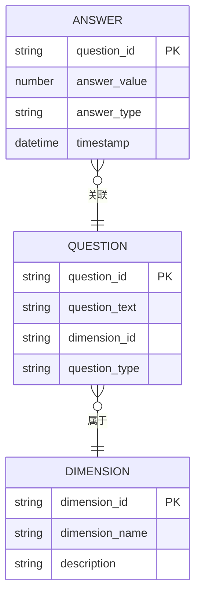
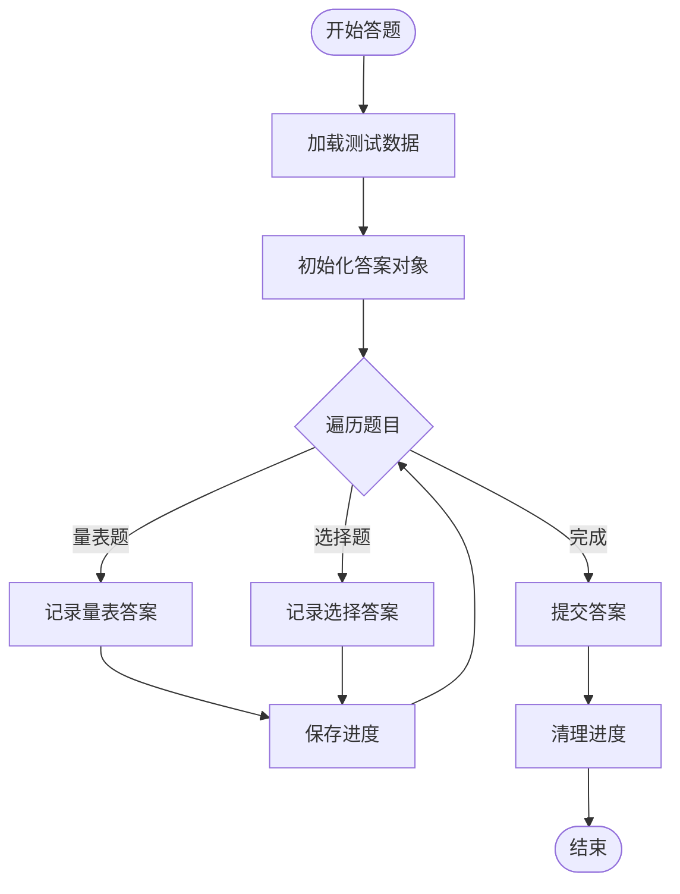
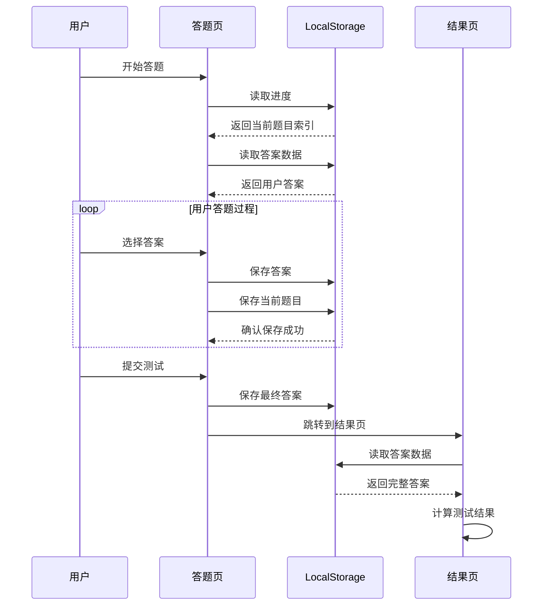
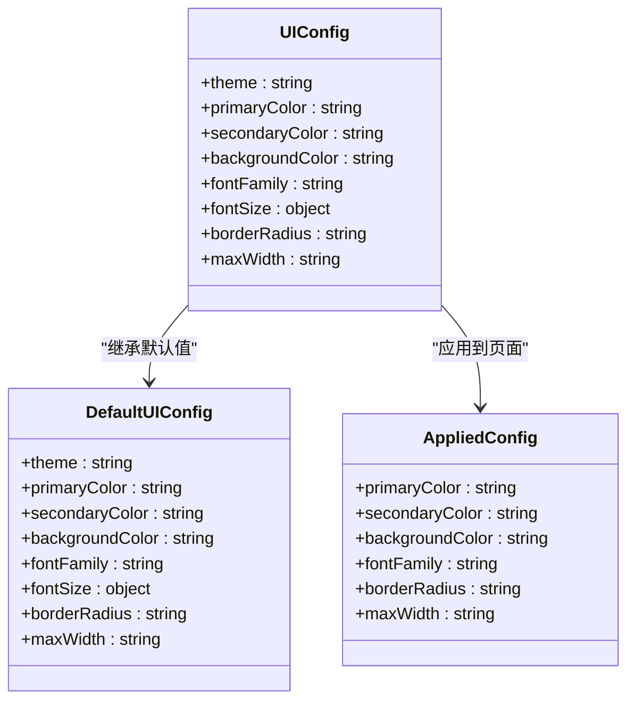
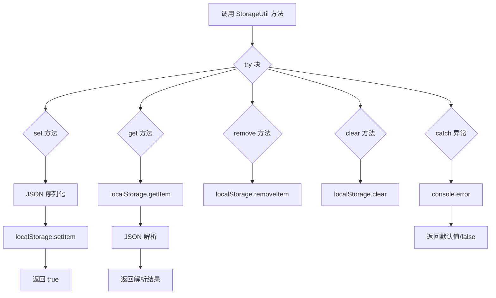
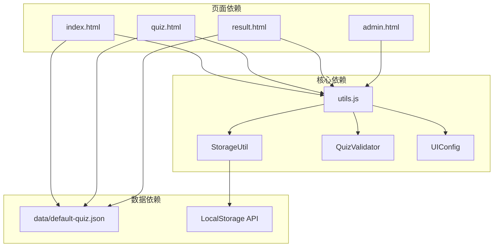

# 用户数据模型

<cite>
**本文档引用的文件**
- [js/utils.js](file://js/utils.js)
- [index.html](file://index.html)
- [quiz.html](file://quiz.html)
- [result.html](file://result.html)
- [admin.html](file://admin.html)
- [css/style.css](file://css/style.css)
- [data/default-quiz.json](file://data/default-quiz.json)
</cite>

## 目录
1. [简介](#简介)
2. [项目结构](#项目结构)
3. [核心组件](#核心组件)
4. [架构概览](#架构概览)
5. [详细组件分析](#详细组件分析)
6. [依赖关系分析](#依赖关系分析)
7. [性能考虑](#性能考虑)
8. [故障排除指南](#故障排除指南)
9. [结论](#结论)
10. [附录](#附录)

## 简介

心理测试 v2 项目采用本地存储驱动的数据模型，通过 LocalStorage 实现用户数据的持久化管理。该系统围绕三个核心数据对象构建：Answer 对象用于存储用户答案、Progress 对象管理测试进度、UIConfig 对象控制界面配置。系统实现了完整的用户数据生命周期管理，包括数据创建、更新、查询、删除和清理操作。

## 项目结构

心理测试 v2 项目采用简洁的文件组织结构，主要包含以下关键组件：

**图表来源**
- [js/utils.js:1-50](file://js/utils.js#L1-L50)
- [index.html:68-151](file://index.html#L68-L151)
- [css/style.css:1-731](file://css/style.css#L1-L731)

**章节来源**
- [js/utils.js:1-250](file://js/utils.js#L1-L250)
- [index.html:1-154](file://index.html#L1-L154)
- [quiz.html:1-278](file://quiz.html#L1-L278)
- [result.html:1-374](file://result.html#L1-L374)

## 核心组件

### StorageKeys 枚举

系统定义了统一的存储键名常量，确保数据存储的一致性和可维护性：

| 键名 | 类型 | 描述 |
|------|------|------|
| `QUIZ_DATA` | 字符串 | 测试数据存储键 |
| `USER_ANSWERS` | 字符串 | 用户答案存储键 |
| `CURRENT_QUESTION` | 字符串 | 当前题目索引存储键 |
| `QUIZ_CONFIG` | 字符串 | 测试配置存储键 |
| `UI_CONFIG` | 字符串 | UI 配置存储键 |

### StorageUtil 类

StorageUtil 是系统的核心数据持久化组件，提供了完整的 LocalStorage 操作接口：

**图表来源**
- [js/utils.js:17-50](file://js/utils.js#L17-L50)
- [js/utils.js:6-12](file://js/utils.js#L6-L12)

**章节来源**
- [js/utils.js:6-50](file://js/utils.js#L6-L50)

## 架构概览

系统采用分层架构设计，实现了清晰的关注点分离：

**图表来源**
- [index.html:84-144](file://index.html#L84-L144)
- [quiz.html:61-117](file://quiz.html#L61-L117)
- [result.html:334-370](file://result.html#L334-L370)

## 详细组件分析

### Answer 对象模型

Answer 对象是用户数据的核心载体，负责存储用户的测试答案：

**图表来源**
- [quiz.html:55](file://quiz.html#L55)
- [data/default-quiz.json:35-160](file://data/default-quiz.json#L35-L160)

#### Answer 对象属性

| 属性名 | 类型 | 描述 | 示例值 |
|--------|------|------|--------|
| `question_id` | 字符串 | 题目唯一标识符 | `"scale_001"` |
| `answer_value` | 数字 | 用户答案值 | `4` |
| `answer_type` | 字符串 | 答案类型标识 | `"scale"` 或 `"choice"` |
| `timestamp` | 时间戳 | 答案记录时间 | `1700000000000` |

#### 答案存储结构

系统采用键值对存储方式，每个问题对应一个独立的答案条目：

**图表来源**
- [quiz.html:178-200](file://quiz.html#L178-L200)
- [quiz.html:256-268](file://quiz.html#L256-L268)

**章节来源**
- [quiz.html:55](file://quiz.html#L55)
- [quiz.html:178-200](file://quiz.html#L178-L200)
- [quiz.html:256-268](file://quiz.html#L256-L268)

### 进度保存机制

系统实现了完整的测试进度跟踪机制，确保用户可以中断后继续答题：

**图表来源**
- [quiz.html:96-107](file://quiz.html#L96-L107)
- [quiz.html:196-200](file://quiz.html#L196-L200)
- [result.html:352-359](file://result.html#L352-L359)

#### 进度数据结构

| 存储键 | 数据类型 | 描述 |
|--------|----------|------|
| `current_question` | 数字 | 当前答题索引（从0开始） |
| `user_answers` | 对象 | 用户答案集合 `{question_id: answer}` |

**章节来源**
- [quiz.html:96-107](file://quiz.html#L96-L107)
- [quiz.html:196-200](file://quiz.html#L196-L200)

### UIConfig 对象模型

UIConfig 对象管理整个应用的界面配置，支持主题定制和个性化设置：

**图表来源**
- [js/utils.js:207-221](file://js/utils.js#L207-L221)
- [js/utils.js:226-244](file://js/utils.js#L226-L244)

#### UIConfig 属性详解

| 属性名 | 类型 | 默认值 | 描述 |
|--------|------|--------|------|
| `theme` | 字符串 | `'default'` | 主题名称 |
| `primaryColor` | 字符串 | `'#FF8C94'` | 主色调（RGB/HEX） |
| `secondaryColor` | 字符串 | `'#FFD3B6'` | 辅助色调 |
| `backgroundColor` | 字符串 | `'#FFF5F5'` | 背景色 |
| `fontFamily` | 字符串 | `"PingFang SC"` | 字体族 |
| `fontSize.title` | 字符串 | `'2rem'` | 标题字体大小 |
| `fontSize.subtitle` | 字符串 | `'1.25rem'` | 副标题字体大小 |
| `fontSize.body` | 字符串 | `'1rem'` | 正文字体大小 |
| `fontSize.small` | 字符串 | `'0.875rem'` | 小字字体大小 |
| `borderRadius` | 字符串 | `'12px'` | 圆角半径 |
| `maxWidth` | 字符串 | `'800px'` | 最大宽度 |

**章节来源**
- [js/utils.js:207-244](file://js/utils.js#L207-L244)
- [admin.html:294-335](file://admin.html#L294-L335)

### LocalStorage 封装

StorageUtil 类提供了完整的 LocalStorage 封装，实现了数据的序列化、反序列化和错误处理：

**图表来源**
- [js/utils.js:17-50](file://js/utils.js#L17-L50)

#### 错误处理机制

系统实现了完善的错误处理策略：

1. **序列化错误处理**：捕获 JSON 序列化异常
2. **反序列化错误处理**：捕获 JSON 解析异常  
3. **存储空间错误处理**：捕获 LocalStorage 写入异常
4. **默认值回退机制**：提供安全的默认值返回

**章节来源**
- [js/utils.js:17-50](file://js/utils.js#L17-L50)

## 依赖关系分析

系统各组件之间的依赖关系如下：

**图表来源**
- [js/utils.js:247-249](file://js/utils.js#L247-L249)
- [index.html:68-69](file://index.html#L68-L69)
- [quiz.html:49](file://quiz.html#L49)
- [result.html:85](file://result.html#L85)

**章节来源**
- [js/utils.js:247-249](file://js/utils.js#L247-L249)
- [index.html:68-69](file://index.html#L68-L69)
- [quiz.html:49](file://quiz.html#L49)
- [result.html:85](file://result.html#L85)

## 性能考虑

### 数据存储优化

1. **增量更新策略**：仅在答案发生变化时进行存储操作
2. **批量操作优化**：避免频繁的 LocalStorage 读写
3. **内存管理**：及时清理不需要的临时变量

### 用户体验优化

1. **防抖机制**：使用防抖函数减少不必要的存储操作
2. **进度恢复**：快速恢复用户之前的答题进度
3. **离线支持**：完全支持离线环境下的数据持久化

### 安全性考虑

1. **数据隔离**：每个测试数据存储在独立的命名空间
2. **类型验证**：对存储的数据进行类型检查
3. **错误隔离**：局部化的错误处理避免影响整体系统

## 故障排除指南

### 常见问题及解决方案

| 问题类型 | 症状描述 | 解决方案 |
|----------|----------|----------|
| LocalStorage 空间不足 | 答案无法保存 | 清理浏览器缓存或增加存储空间 |
| 数据损坏 | 答案丢失或格式错误 | 使用 `StorageUtil.clear()` 清空数据 |
| 跨域访问限制 | 无法读取外部数据 | 检查浏览器安全设置和域名配置 |
| 数据同步问题 | 多设备数据不一致 | 检查 LocalStorage 权限和浏览器设置 |

### 调试技巧

1. **浏览器开发者工具**：检查 LocalStorage 中的数据状态
2. **控制台日志**：观察存储操作的错误信息
3. **数据验证**：使用 `QuizValidator.validate()` 检查数据完整性

**章节来源**
- [js/utils.js:17-50](file://js/utils.js#L17-L50)

## 结论

心理测试 v2 项目的用户数据模型设计体现了现代 Web 应用的最佳实践。通过合理的数据分层、完善的错误处理和优雅的用户体验设计，系统实现了可靠的数据持久化和高效的用户交互。

该模型的主要优势包括：
- **模块化设计**：清晰的职责分离便于维护和扩展
- **数据完整性**：完整的数据验证和错误处理机制
- **用户体验**：流畅的进度保存和恢复体验
- **可扩展性**：灵活的配置管理和主题定制能力

## 附录

### 数据迁移指南

当系统升级时，建议按照以下步骤进行数据迁移：

1. **备份现有数据**：使用 `StorageUtil.get()` 获取当前数据
2. **检查数据格式**：使用 `QuizValidator.validate()` 验证数据完整性
3. **转换数据结构**：根据新版本要求调整数据格式
4. **验证迁移结果**：在测试环境中验证数据正确性
5. **清理旧数据**：确认新数据正常后清理旧版本数据

### 版本兼容性

系统设计时考虑了向后兼容性：
- 新增字段时提供默认值
- 删除字段时保持向后兼容
- 修改字段类型时提供转换逻辑

### 安全注意事项

1. **敏感数据保护**：避免在 LocalStorage 中存储敏感个人信息
2. **数据加密**：考虑对重要数据进行客户端加密
3. **访问控制**：限制对 LocalStorage 的访问权限
4. **定期清理**：建立数据清理和归档机制