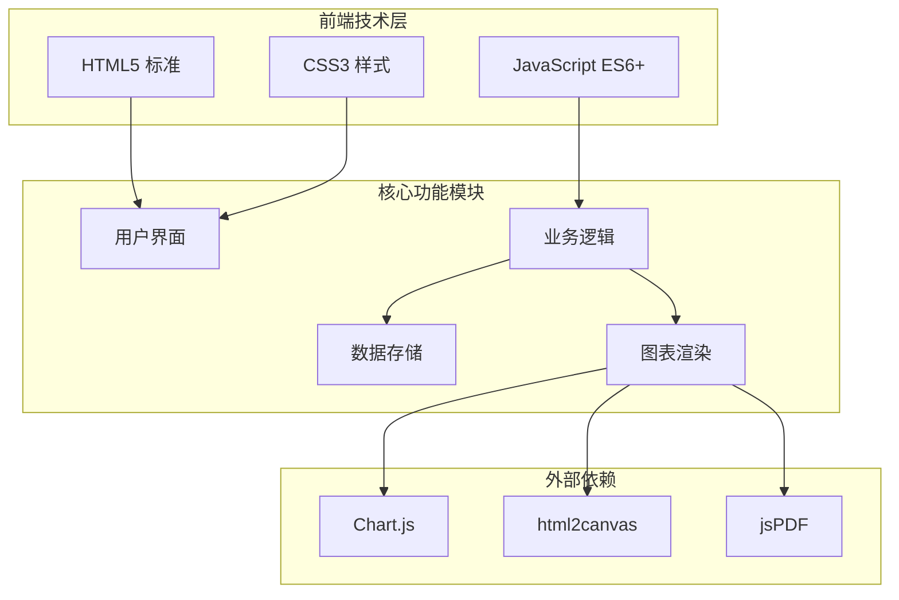
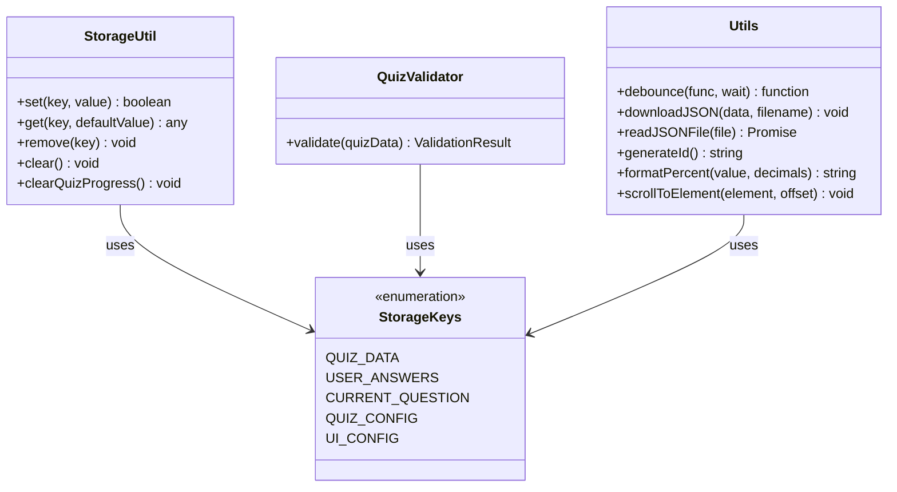
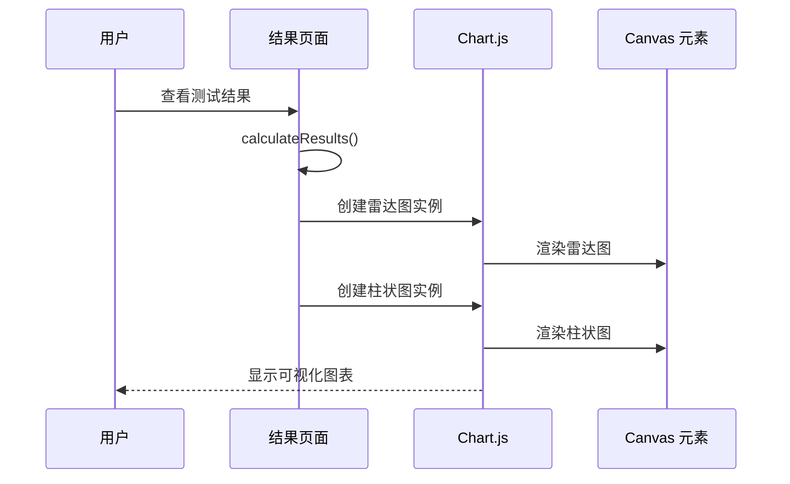
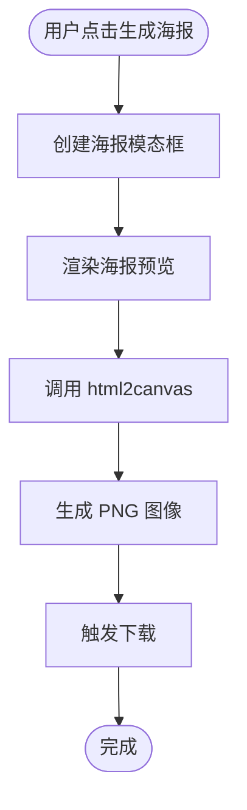
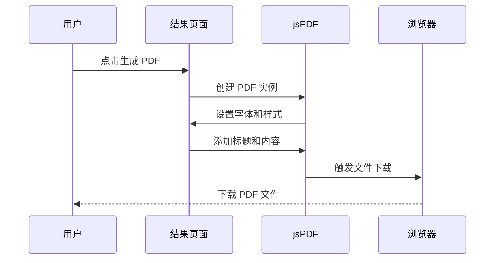

# 技术栈选型

<cite>
**本文档引用的文件**
- [index.html](file://index.html)
- [quiz.html](file://quiz.html)
- [result.html](file://result.html)
- [admin.html](file://admin.html)
- [css/style.css](file://css/style.css)
- [js/utils.js](file://js/utils.js)
- [data/default-quiz.json](file://data/default-quiz.json)
- [data/template.json](file://data/template.json)
</cite>

## 目录
1. [项目概述](#项目概述)
2. [技术栈架构](#技术栈架构)
3. [HTML5 技术选型](#html5-技术选型)
4. [CSS3 技术选型](#css3-技术选型)
5. [JavaScript 技术选型](#javascript-技术选型)
6. [外部库集成](#外部库集成)
7. [现代 Web 技术应用](#现代-web-技术应用)
8. [性能与兼容性考量](#性能与兼容性考量)
9. [版本要求与浏览器支持](#版本要求与浏览器支持)
10. [替代方案对比](#替代方案对比)
11. [技术决策背景](#技术决策背景)
12. [未来扩展规划](#未来扩展规划)
13. [总结](#总结)

## 项目概述

心理测试 v2 是一个基于纯前端技术的心理测评系统，采用 HTML5、CSS3 和 JavaScript 构建，无需服务器端处理即可运行。该系统支持多种心理测试类型，包括量表题和选择题，提供实时结果分析和可视化展示功能。

## 技术栈架构



**图表来源**
- [index.html:1-154](file://index.html#L1-L154)
- [css/style.css:1-731](file://css/style.css#L1-L731)
- [js/utils.js:1-250](file://js/utils.js#L1-L250)

## HTML5 技术选型

### 语义化标签与结构
项目充分利用 HTML5 的语义化标签构建清晰的页面结构：

- **语义化结构**：使用 `<nav>`、`<main>`、`<section>`、`<article>` 等语义化标签
- **多媒体支持**：通过 `<canvas>` 实现图表绘制和海报生成
- **本地存储**：利用 `localStorage` 实现数据持久化
- **表单控件**：使用原生表单元素和验证机制

### 数据交换格式
- **JSON 格式**：统一使用 JSON 作为数据交换格式
- **模板系统**：提供标准化的题目模板便于内容管理

**章节来源**
- [index.html:10-19](file://index.html#L10-L19)
- [quiz.html:11-19](file://quiz.html#L11-L19)
- [result.html:14-22](file://result.html#L14-L22)

## CSS3 技术选型

### CSS 变量系统
项目采用 CSS 自定义属性实现主题化设计：

```css
:root {
    --primary-color: #FF8C94;
    --secondary-color: #FFD3B6;
    --background-color: #FFF5F5;
    --text-color: #333333;
    --border-radius: 12px;
    --font-family: "PingFang SC", "Microsoft YaHei", sans-serif;
}
```

### 布局系统
- **Flexbox 布局**：用于导航栏和按钮组的灵活布局
- **Grid 布局**：用于响应式卡片网格和图表容器
- **CSS Grid**：实现复杂的页面布局结构

### 动画与过渡
- **关键帧动画**：实现渐入效果和脉冲动画
- **过渡效果**：提供平滑的交互体验
- **变换效果**：支持缩放、位移等视觉效果

**章节来源**
- [css/style.css:6-20](file://css/style.css#L6-L20)
- [css/style.css:150-176](file://css/style.css#L150-L176)
- [css/style.css:685-712](file://css/style.css#L685-L712)

## JavaScript 技术选型

### 模块化架构
项目采用模块化的 JavaScript 设计：



**图表来源**
- [js/utils.js:6-50](file://js/utils.js#L6-L50)
- [js/utils.js:55-126](file://js/utils.js#L55-L126)
- [js/utils.js:131-202](file://js/utils.js#L131-L202)

### 异步数据处理
- **Promise/Await**：统一使用异步模式处理数据加载
- **错误处理**：完善的异常捕获和错误提示机制
- **数据验证**：严格的输入数据验证和格式检查

**章节来源**
- [js/utils.js:17-50](file://js/utils.js#L17-L50)
- [js/utils.js:55-126](file://js/utils.js#L55-L126)

## 外部库集成

### Chart.js 集成
Chart.js 用于创建专业的数据分析图表：



**图表来源**
- [result.html:8-11](file://result.html#L8-L11)
- [result.html:167-202](file://result.html#L167-L202)
- [result.html:205-239](file://result.html#L205-L239)

### html2canvas 集成
html2canvas 用于将网页内容转换为图片：



**图表来源**
- [result.html:307-318](file://result.html#L307-L318)
- [result.html:64-78](file://result.html#L64-L78)

### jsPDF 集成
jsPDF 用于生成 PDF 报告：



**图表来源**
- [result.html:270-297](file://result.html#L270-L297)
- [result.html:8-11](file://result.html#L8-L11)

**章节来源**
- [result.html:8-11](file://result.html#L8-L11)
- [result.html:270-297](file://result.html#L270-L297)
- [result.html:307-318](file://result.html#L307-L318)

## 现代 Web 技术应用

### CSS 变量系统
项目实现了完整的 CSS 变量体系，支持动态主题切换：

- **颜色系统**：主色调、辅助色、背景色的统一管理
- **尺寸系统**：圆角半径、最大宽度、字体大小的标准化
- **动画系统**：过渡时间和缓动函数的统一配置

### Flexbox 布局
广泛使用 Flexbox 实现响应式布局：

- **导航栏布局**：使用 `display: flex` 实现左右布局
- **按钮组布局**：支持水平和垂直排列
- **卡片布局**：实现内容的灵活排列

### Grid 布局
在复杂页面结构中使用 CSS Grid：

- **目录页面**：自动适应屏幕宽度的卡片网格
- **结果页面**：图表和内容的双列布局
- **管理后台**：复杂的表单和配置界面

### 响应式设计
实现完整的移动端适配：

- **断点设计**：针对 768px 屏幕的专门优化
- **弹性布局**：根据屏幕尺寸调整布局结构
- **触摸友好的交互**：优化移动端操作体验

**章节来源**
- [css/style.css:619-683](file://css/style.css#L619-L683)
- [css/style.css:381-426](file://css/style.css#L381-L426)
- [css/style.css:159-163](file://css/style.css#L159-L163)

## 性能与兼容性考量

### 性能优化策略
- **懒加载**：外部库按需加载，减少初始加载时间
- **内存管理**：及时清理事件监听器和 DOM 引用
- **计算优化**：使用防抖函数避免频繁的 DOM 操作
- **缓存策略**：利用 localStorage 减少网络请求

### 兼容性保证
- **浏览器支持**：支持主流现代浏览器（Chrome、Firefox、Safari、Edge）
- **降级处理**：在不支持某些特性的环境中提供备用方案
- **渐进增强**：核心功能在旧浏览器中仍可正常工作

### 开发效率提升
- **模块化设计**：清晰的代码组织结构
- **工具函数库**：复用的通用功能
- **数据验证**：自动化的数据质量检查
- **配置管理**：统一的主题和界面配置

## 版本要求与浏览器支持

### 浏览器兼容性矩阵

| 功能特性 | 最低版本要求 | 兼容性状态 |
|---------|-------------|-----------|
| HTML5 语义化标签 | IE10+ | ✅ 完全支持 |
| CSS3 变量 | IE11+ | ⚠️ 部分支持 |
| Flexbox 布局 | IE11+ | ✅ 完全支持 |
| CSS Grid | IE11+ | ❌ 不支持 |
| Chart.js | 所有现代浏览器 | ✅ 完全支持 |
| html2canvas | Chrome 41+ | ✅ 完全支持 |
| jsPDF | 所有现代浏览器 | ✅ 完全支持 |
| localStorage API | IE8+ | ✅ 完全支持 |

### 性能基准
- **首屏加载时间**：< 2 秒（含外部库）
- **交互响应延迟**：< 50ms
- **内存占用**：< 50MB（典型页面）
- **离线支持**：完全支持本地存储

## 替代方案对比

### Chart.js 替代方案
| 方案 | 优点 | 缺点 | 适用场景 |
|------|------|------|----------|
| Chart.js | 功能丰富、社区活跃、文档完善 | 文件体积较大 | 专业数据分析图表 |
| ECharts | 国产优秀图表库、中文支持好 | 学习成本较高 | 企业级应用 |
| D3.js | 灵活强大、可定制性强 | 学习曲线陡峭 | 复杂可视化需求 |

### html2canvas 替代方案
| 方案 | 优点 | 缺点 | 适用场景 |
|------|------|------|----------|
| html2canvas | 简单易用、功能完整 | 性能开销较大 | 快速原型开发 |
| dom-to-image | 轻量级、性能更好 | 功能相对简单 | 性能敏感场景 |
| Puppeteer | 功能最强、可生成 PDF | 需要 Node.js 环境 | 服务端生成 |

### jsPDF 替代方案
| 方案 | 优点 | 缺点 | 适用场景 |
|------|------|------|----------|
| jsPDF | 前端直接生成、无服务器依赖 | 功能相对基础 | 简单 PDF 生成 |
| pdfmake | 功能丰富、支持复杂布局 | 文件体积较大 | 专业 PDF 应用 |
| DynamicPDF | 商业解决方案、功能强大 | 需要付费许可 | 企业级应用 |

## 技术决策背景

### 选择纯前端技术的原因
1. **部署简单**：无需服务器环境，可直接部署到静态托管平台
2. **成本控制**：避免服务器和数据库维护成本
3. **安全性**：用户数据完全保存在本地，保护隐私
4. **可移植性**：可在任何支持现代浏览器的设备上运行

### 外部库选择策略
- **成熟度优先**：选择经过验证的稳定库
- **社区支持**：确保长期维护和更新
- **学习成本**：平衡功能复杂度和开发效率
- **性能影响**：评估对整体性能的影响

### 数据存储策略
- **localStorage 优先**：适合小规模数据存储
- **JSON 文件**：便于内容管理和版本控制
- **备份机制**：提供默认数据作为后备方案

## 未来扩展规划

### 技术升级方向
1. **渐进式 Web 应用 (PWA)**：添加离线功能和推送通知
2. **模块化打包**：使用 Webpack 或 Vite 优化资源加载
3. **TypeScript 支持**：提高代码质量和开发体验
4. **组件化架构**：采用 Vue.js 或 React 构建组件化界面

### 功能扩展计划
1. **多语言支持**：国际化和本地化功能
2. **社交分享**：集成社交媒体分享功能
3. **数据分析**：添加统计分析和趋势预测
4. **用户账户**：支持用户注册和数据同步

### 性能优化目标
1. **首屏优化**：进一步减少初始加载时间
2. **内存优化**：改进大数据量处理能力
3. **缓存策略**：实现智能缓存和预加载
4. **CDN 集成**：优化外部资源加载速度

## 总结

心理测试 v2 项目采用的技术栈体现了现代 Web 开发的最佳实践：

**核心优势**：
- **技术简洁性**：纯前端架构降低了技术复杂度
- **用户体验**：现代化的设计和流畅的交互体验
- **数据安全**：本地存储保护用户隐私
- **开发效率**：模块化设计便于维护和扩展

**技术特色**：
- 完整的 CSS 变量系统实现主题化设计
- 灵活的 Flexbox 和 Grid 布局系统
- 专业的图表可视化解决方案
- 响应式的移动端适配

**未来发展**：
该项目为后续的功能扩展和技术升级奠定了良好的基础，通过渐进式的技术演进可以满足更复杂的应用需求，同时保持系统的稳定性和可维护性。