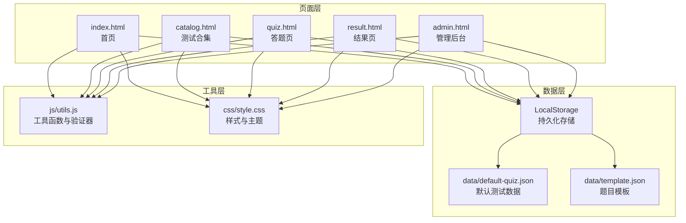
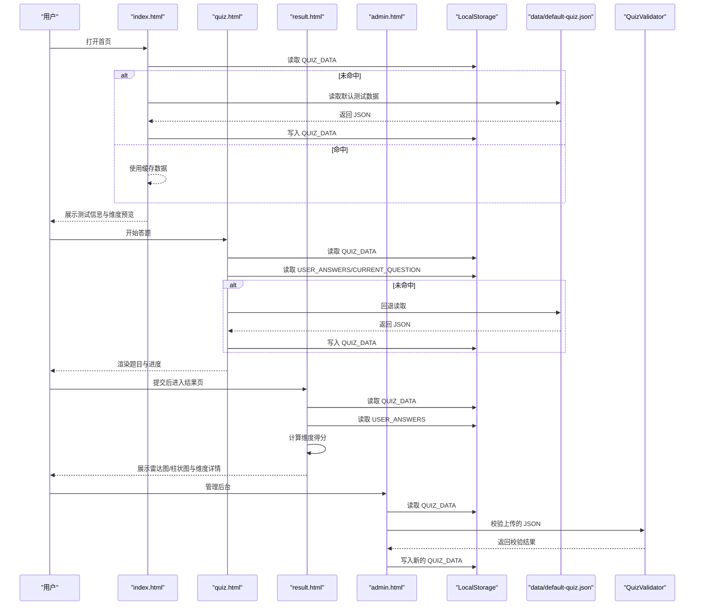
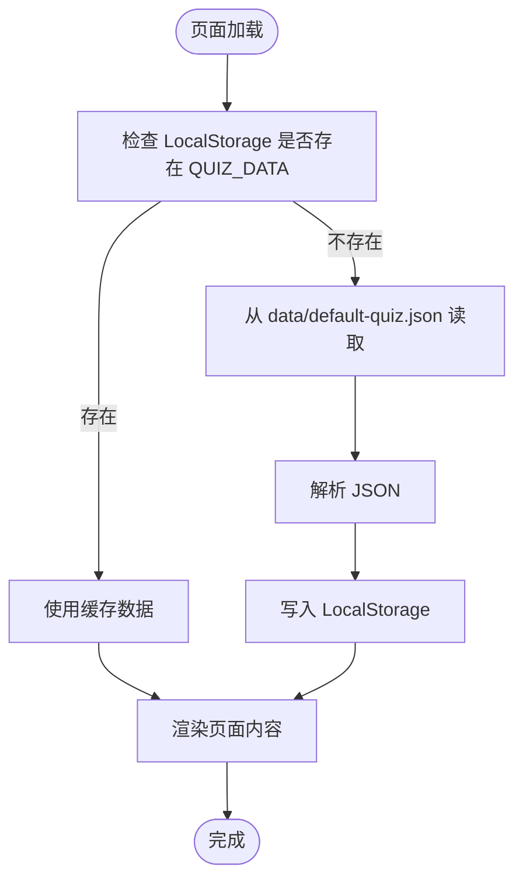
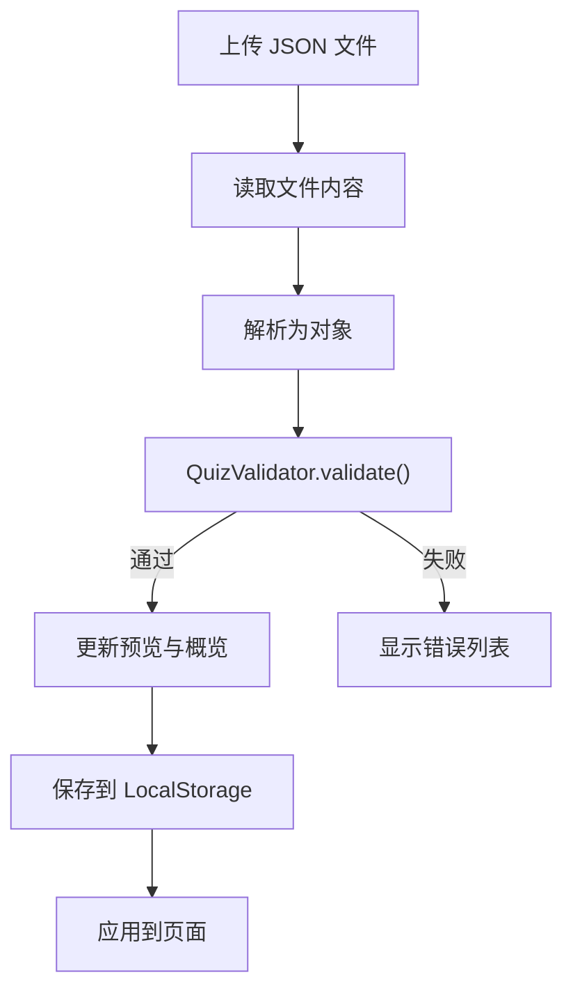
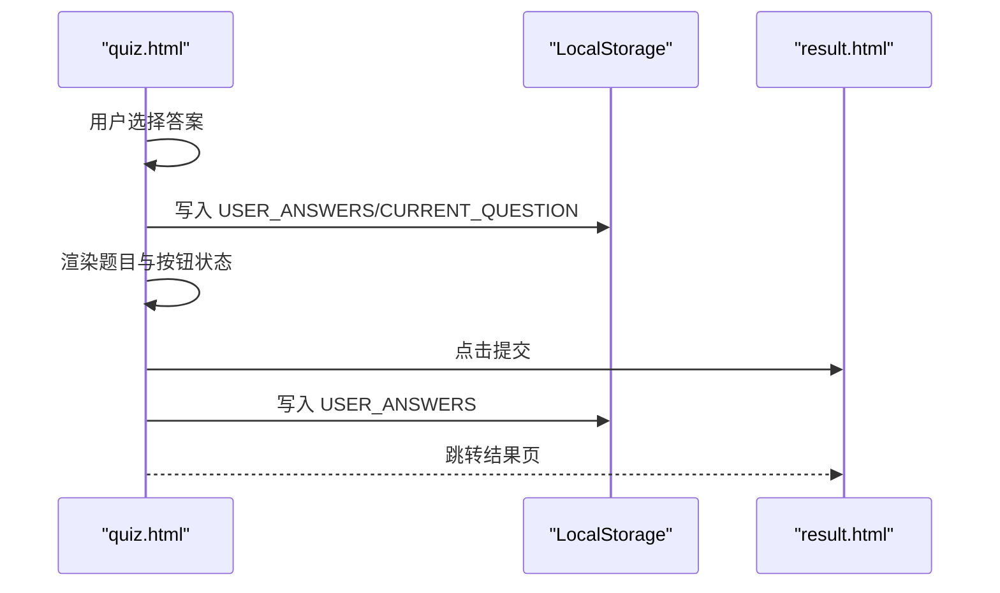
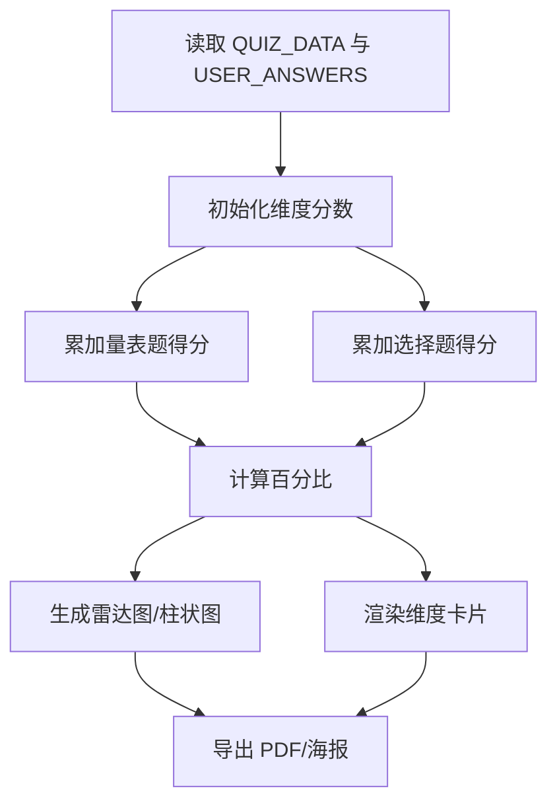
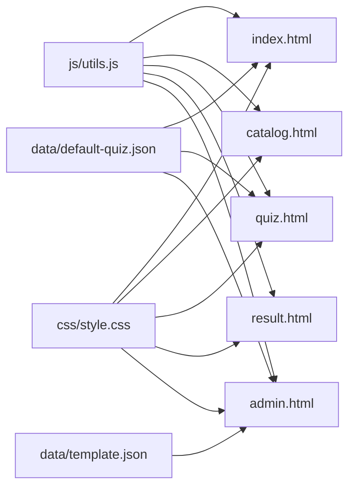

# 数据流设计

<cite>
**本文引用的文件**
- [index.html](file://index.html)
- [quiz.html](file://quiz.html)
- [result.html](file://result.html)
- [admin.html](file://admin.html)
- [catalog.html](file://catalog.html)
- [data/default-quiz.json](file://data/default-quiz.json)
- [data/template.json](file://data/template.json)
- [js/utils.js](file://js/utils.js)
- [css/style.css](file://css/style.css)
</cite>

## 目录
1. [引言](#引言)
2. [项目结构](#项目结构)
3. [核心组件](#核心组件)
4. [架构总览](#架构总览)
5. [详细组件分析](#详细组件分析)
6. [依赖关系分析](#依赖关系分析)
7. [性能考量](#性能考量)
8. [故障排查指南](#故障排查指南)
9. [结论](#结论)
10. [附录](#附录)

## 引言
本文件面向“心理测试 v2”项目的数据流设计，系统性阐述从数据加载、处理到展示的完整流程。重点覆盖：
- 测试数据的加载机制（JSON 解析、数据验证与缓存策略）
- 用户答题数据的收集、存储与计算过程
- 结果数据的生成、分析与可视化展示
- 数据流向图、状态变化图与关键数据结构说明
- 数据持久化与 LocalStorage 使用策略
- 数据安全、备份与恢复机制的设计考虑

## 项目结构
该项目采用前端静态站点架构，页面之间通过 LocalStorage 共享测试数据与用户答题进度；数据源来自本地 JSON 文件，支持通过管理后台进行模板下载、上传校验与应用。

**图表来源**
- [index.html](file://index.html)
- [catalog.html](file://catalog.html)
- [quiz.html](file://quiz.html)
- [result.html](file://result.html)
- [admin.html](file://admin.html)
- [data/default-quiz.json](file://data/default-quiz.json)
- [data/template.json](file://data/template.json)
- [js/utils.js](file://js/utils.js)
- [css/style.css](file://css/style.css)

**章节来源**
- [index.html](file://index.html)
- [catalog.html](file://catalog.html)
- [quiz.html](file://quiz.html)
- [result.html](file://result.html)
- [admin.html](file://admin.html)
- [data/default-quiz.json](file://data/default-quiz.json)
- [data/template.json](file://data/template.json)
- [js/utils.js](file://js/utils.js)
- [css/style.css](file://css/style.css)

## 核心组件
- 数据加载与缓存：页面通过 LocalStorage 优先读取，若不存在则回退到本地 JSON 文件；成功后写入 LocalStorage 以提升后续加载性能。
- 数据验证：管理后台对上传的 JSON 文件进行结构校验，确保字段完整性与一致性。
- 用户答题：答题页维护当前题号与用户答案映射，实时保存至 LocalStorage，支持断点续答。
- 结果计算与可视化：结果页基于维度与题目类型计算得分，生成雷达图与柱状图，并支持导出 PDF 与海报。

**章节来源**
- [index.html](file://index.html)
- [quiz.html](file://quiz.html)
- [result.html](file://result.html)
- [admin.html](file://admin.html)
- [js/utils.js](file://js/utils.js)

## 架构总览
下图展示了从数据加载到结果展示的端到端数据流，以及 LocalStorage 在各页面间的共享机制。

**图表来源**
- [index.html](file://index.html)
- [quiz.html](file://quiz.html)
- [result.html](file://result.html)
- [admin.html](file://admin.html)
- [data/default-quiz.json](file://data/default-quiz.json)
- [js/utils.js](file://js/utils.js)

## 详细组件分析

### 数据加载与缓存策略
- 首页与目录页：优先从 LocalStorage 读取测试数据；若为空，回退到本地 JSON 文件；成功后写入 LocalStorage 以备后续使用。
- 答题页：同样遵循“先 LS 后文件”的策略；同时恢复用户的答题进度（当前题号与答案映射）。
- 管理后台：加载当前测试数据用于预览与应用，支持下载模板与上传校验。

**图表来源**
- [index.html](file://index.html)
- [catalog.html](file://catalog.html)
- [quiz.html](file://quiz.html)
- [data/default-quiz.json](file://data/default-quiz.json)
- [js/utils.js](file://js/utils.js)

**章节来源**
- [index.html](file://index.html)
- [catalog.html](file://catalog.html)
- [quiz.html](file://quiz.html)
- [data/default-quiz.json](file://data/default-quiz.json)
- [js/utils.js](file://js/utils.js)

### 数据验证与模板管理
- 管理后台提供题目模板下载与上传校验功能。上传的 JSON 文件由验证器进行字段完整性检查，通过后方可应用。
- 验证器覆盖测试名称、题目数量、维度定义、量表题与选择题的必要字段，以及选择题选项维度映射的有效性。

**图表来源**
- [admin.html](file://admin.html)
- [data/template.json](file://data/template.json)
- [js/utils.js](file://js/utils.js)

**章节来源**
- [admin.html](file://admin.html)
- [data/template.json](file://data/template.json)
- [js/utils.js](file://js/utils.js)

### 用户答题数据收集与存储
- 答题页维护全局状态：测试数据、合并后的题目序列、当前题号与用户答案映射。
- 用户每选择一次答案即保存进度（答案映射与当前题号），支持断点续答。
- 提交时检查是否全部作答，满足条件后将答案写入 LocalStorage 并跳转结果页。

**图表来源**
- [quiz.html](file://quiz.html)
- [js/utils.js](file://js/utils.js)

**章节来源**
- [quiz.html](file://quiz.html)
- [js/utils.js](file://js/utils.js)

### 结果数据生成、分析与可视化
- 结果页从 LocalStorage 读取测试数据与用户答案，按维度统计得分与最大可能得分，计算百分比。
- 生成雷达图与柱状图，维度卡片按得分排序展示；支持导出 PDF 与生成分享海报（截图并下载图片）。

**图表来源**
- [result.html](file://result.html)
- [js/utils.js](file://js/utils.js)

**章节来源**
- [result.html](file://result.html)
- [js/utils.js](file://js/utils.js)

### 关键数据结构说明
- 测试元数据与维度
  - 字段：测试名称、理论基础、题目总数、量表题数、选择题数、维度数量、维度数组（每个维度包含维度 ID、名称与描述）。
- 量表题
  - 字段：题目 ID、所属维度 ID、题目文本。
- 选择题
  - 字段：题目 ID、题目文本、选项 A-E 文本与对应维度映射。
- 用户答案
  - 键：题目 ID；值：量表题为 1~5 的整数，选择题为 a~e 的字母。
- 进度状态
  - 当前题号（从 0 开始）、答案映射对象。

**章节来源**
- [data/default-quiz.json](file://data/default-quiz.json)
- [data/template.json](file://data/template.json)
- [quiz.html](file://quiz.html)
- [result.html](file://result.html)

## 依赖关系分析
- 页面间依赖
  - index.html、catalog.html、quiz.html、result.html、admin.html 均依赖 js/utils.js 提供的工具函数与验证器。
  - 管理后台依赖默认测试数据与模板文件进行下载与校验。
- 存储依赖
  - 所有页面通过 LocalStorage 共享测试数据与用户进度；quiz.html 与 result.html 通过统一的存储键名协同工作。
- 样式依赖
  - 所有页面共享 css/style.css，UI 配置通过 CSS 变量实现主题化。

**图表来源**
- [js/utils.js](file://js/utils.js)
- [index.html](file://index.html)
- [catalog.html](file://catalog.html)
- [quiz.html](file://quiz.html)
- [result.html](file://result.html)
- [admin.html](file://admin.html)
- [data/default-quiz.json](file://data/default-quiz.json)
- [data/template.json](file://data/template.json)
- [css/style.css](file://css/style.css)

**章节来源**
- [js/utils.js](file://js/utils.js)
- [index.html](file://index.html)
- [catalog.html](file://catalog.html)
- [quiz.html](file://quiz.html)
- [result.html](file://result.html)
- [admin.html](file://admin.html)
- [data/default-quiz.json](file://data/default-quiz.json)
- [data/template.json](file://data/template.json)
- [css/style.css](file://css/style.css)

## 性能考量
- 缓存优先：页面加载时优先读取 LocalStorage，避免重复网络请求，显著降低首屏延迟。
- 轻量计算：结果页的计算逻辑简单直观，仅涉及维度聚合与百分比计算，复杂度为 O(N)，N 为题目数。
- 可视化优化：图表库按需加载，仅在结果页使用，减少非必要资源占用。
- 响应式设计：CSS 媒体查询适配移动端，减少重排与重绘带来的性能损耗。

[本节为通用性能建议，无需特定文件引用]

## 故障排查指南
- 数据加载失败
  - 现象：页面显示默认数据或错误提示。
  - 排查：确认 data/default-quiz.json 是否存在且格式正确；检查浏览器控制台是否存在网络错误；确认 LocalStorage 是否被清理。
- 答题进度丢失
  - 现象：重新进入答题页后进度清空。
  - 排查：确认 quiz.html 是否正确调用保存进度的逻辑；检查 LocalStorage 中是否存在 USER_ANSWERS 与 CURRENT_QUESTION。
- 结果页空白或报错
  - 现象：进入结果页后无数据显示。
  - 排查：确认 LocalStorage 中 USER_ANSWERS 是否存在；检查 quiz.html 提交流程是否写入答案；核对结果页读取逻辑。
- 管理后台上传失败
  - 现象：上传 JSON 后显示校验错误。
  - 排查：对照模板字段，确保每个题目与维度均具备必要字段；确认文件编码为 UTF-8；检查浏览器控制台错误信息。

**章节来源**
- [index.html](file://index.html)
- [quiz.html](file://quiz.html)
- [result.html](file://result.html)
- [admin.html](file://admin.html)
- [js/utils.js](file://js/utils.js)

## 结论
本项目通过 LocalStorage 实现跨页面的数据共享与持久化，结合本地 JSON 文件与管理后台的模板与校验机制，构建了稳定、可扩展的数据流体系。答题与结果流程清晰，数据结构简洁明确，便于维护与二次开发。建议在后续版本中引入更完善的错误边界与数据迁移策略，以进一步增强系统的健壮性与可维护性。

[本节为总结性内容，无需特定文件引用]

## 附录

### 数据持久化与 LocalStorage 使用策略
- 存储键名
  - QUIZ_DATA：测试数据
  - USER_ANSWERS：用户答案映射
  - CURRENT_QUESTION：当前题号
  - QUIZ_CONFIG：测试配置（预留）
  - UI_CONFIG：界面主题配置
- 写入策略
  - 首次加载成功后写入 LocalStorage，后续优先读取缓存。
- 清理策略
  - 重新测试时清除 USER_ANSWERS 与 CURRENT_QUESTION。
  - 管理后台重置时恢复默认测试数据。

**章节来源**
- [js/utils.js](file://js/utils.js)
- [quiz.html](file://quiz.html)
- [result.html](file://result.html)
- [admin.html](file://admin.html)

### 数据安全、备份与恢复机制设计考虑
- 数据安全
  - 用户答案与进度均为明文存储于 LocalStorage，建议在生产环境中增加客户端加密或服务端同步（需额外后端支持）。
- 备份与恢复
  - 支持导出用户答案（通过下载 JSON 文件）与导入（上传 JSON 文件），便于离线备份与迁移。
  - 管理后台提供“重置题目配置”功能，一键恢复默认测试数据。

**章节来源**
- [admin.html](file://admin.html)
- [js/utils.js](file://js/utils.js)