# 整体架构设计

<cite>
**本文档引用的文件**
- [index.html](file://index.html)
- [quiz.html](file://quiz.html)
- [result.html](file://result.html)
- [admin.html](file://admin.html)
- [catalog.html](file://catalog.html)
- [utils.js](file://js/utils.js)
- [style.css](file://css/style.css)
- [default-quiz.json](file://data/default-quiz.json)
- [template.json](file://data/template.json)
</cite>

## 目录
1. [项目概述](#项目概述)
2. [MVC 架构模式实现](#mvc-架构模式实现)
3. [模块化设计原则](#模块化设计原则)
4. [事件驱动架构实现](#事件驱动架构实现)
5. [单页应用路由设计](#单页应用路由设计)
6. [系统边界与组件关系](#系统边界与组件关系)
7. [数据流分析](#数据流分析)
8. [核心组件详细分析](#核心组件详细分析)
9. [性能考虑](#性能考虑)
10. [故障排除指南](#故障排除指南)
11. [总结](#总结)

## 项目概述

心理测试 v2 是一个基于 Web 的心理测评系统，采用纯前端技术栈构建，无需服务器端支持。该系统提供了完整的心理测试体验，包括测试浏览、答题、结果分析和管理后台等功能模块。

### 系统特性
- **纯前端架构**：使用原生 JavaScript，无需后端服务器
- **本地存储**：所有数据持久化存储在浏览器 LocalStorage 中
- **响应式设计**：适配各种设备尺寸
- **可定制化**：支持主题颜色、字体、布局等 UI 配置
- **数据管理**：支持自定义测试题目和模板

## MVC 架构模式实现

### Model（数据层）

系统的数据层主要由以下组件构成：

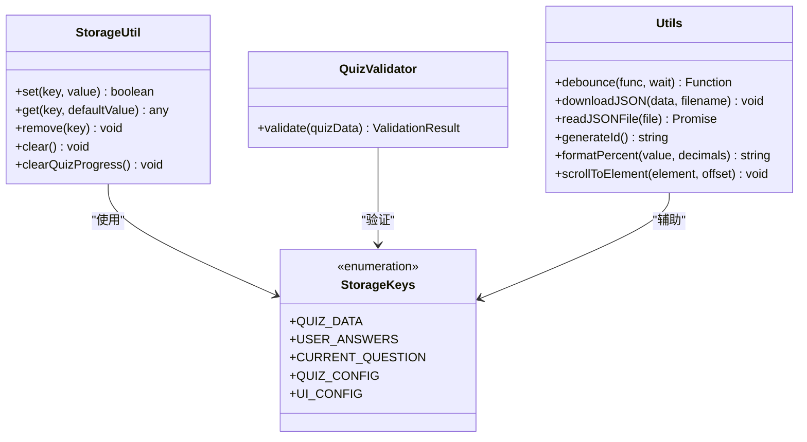

**图表来源**
- [utils.js:6-50](file://js/utils.js#L6-L50)
- [utils.js:55-126](file://js/utils.js#L55-L126)
- [utils.js:131-202](file://js/utils.js#L131-L202)

**Model 层职责**：
- 数据持久化管理：通过 StorageUtil 类统一管理 LocalStorage 操作
- 数据验证：通过 QuizValidator 类确保测试数据的完整性和正确性
- 工具函数：提供通用的辅助功能，如防抖、文件操作、格式化等

### View（视图层）

系统采用模块化的视图设计，每个 HTML 页面都是一个独立的功能模块：

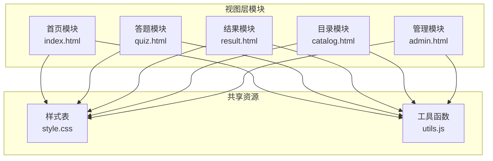

**图表来源**
- [index.html:1-154](file://index.html#L1-L154)
- [quiz.html:1-259](file://quiz.html#L1-L259)
- [result.html:1-363](file://result.html#L1-L363)
- [catalog.html:1-105](file://catalog.html#L1-L105)
- [admin.html:1-402](file://admin.html#L1-L402)

**View 层职责**：
- 页面渲染：根据业务逻辑动态生成 HTML 内容
- 用户交互：处理用户的各种操作事件
- 视觉展示：应用统一的样式和主题配置

### Controller（控制层）

控制器层主要分布在各个页面的 JavaScript 代码中，负责协调 Model 和 View：

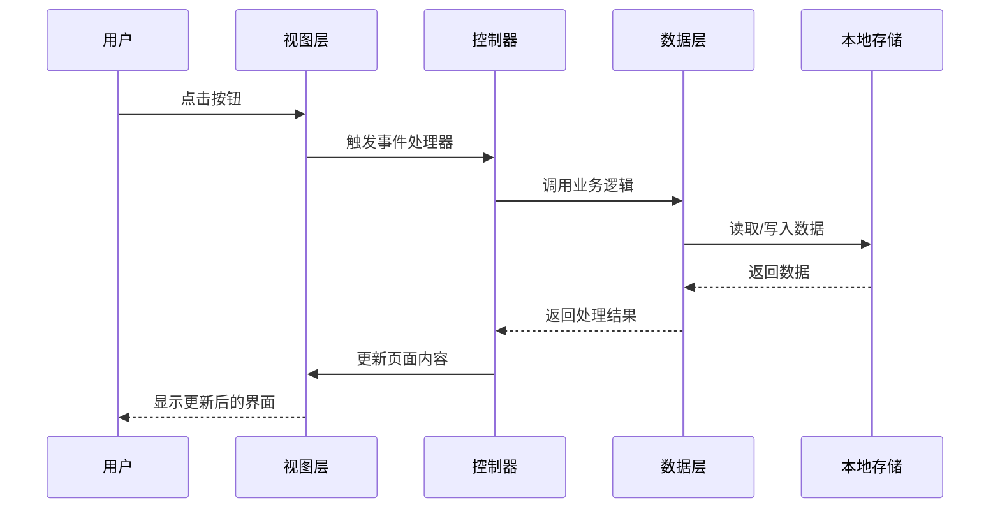

**图表来源**
- [quiz.html:159-175](file://quiz.html#L159-L175)
- [result.html:86-133](file://result.html#L86-L133)
- [admin.html:177-186](file://admin.html#L177-L186)

**Controller 层职责**：
- 事件处理：响应用户的交互操作
- 业务协调：调用相应的业务逻辑函数
- 状态管理：维护页面的状态和数据流

## 模块化设计原则

### 功能模块划分

系统采用按功能域划分的模块化设计：

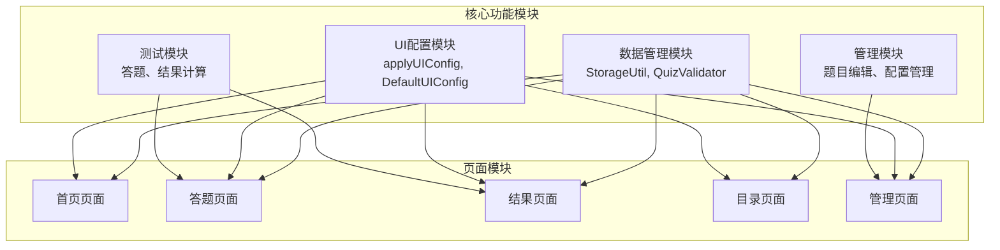

**图表来源**
- [utils.js:17-50](file://js/utils.js#L17-L50)
- [utils.js:226-244](file://js/utils.js#L226-L244)
- [quiz.html:51-98](file://quiz.html#L51-L98)
- [admin.html:173-203](file://admin.html#L173-L203)

### 模块间协作机制

各模块通过以下方式实现松耦合协作：

1. **统一的数据接口**：所有数据访问通过 StorageUtil 类进行
2. **事件驱动通信**：模块间通过 DOM 事件和回调函数通信
3. **配置中心化**：UI 配置通过 applyUIConfig 函数集中管理
4. **数据验证**：通过 QuizValidator 确保数据一致性

## 事件驱动架构实现

### DOM 事件处理机制

系统广泛采用事件驱动架构来处理用户交互：

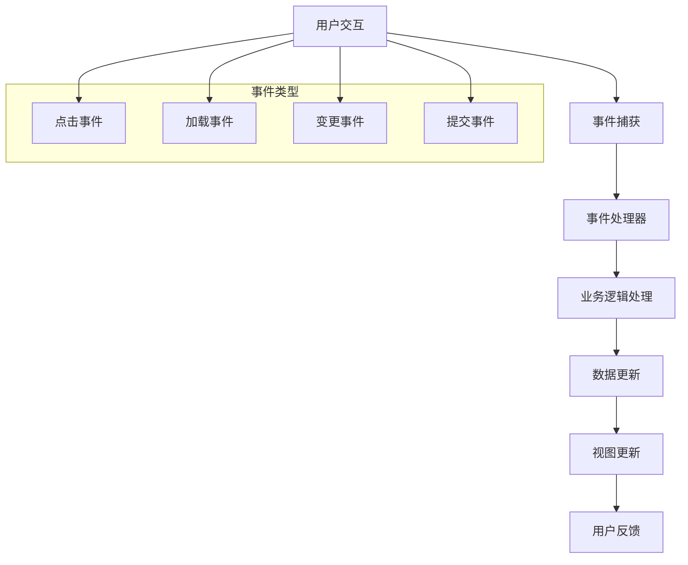

**图表来源**
- [quiz.html:218-235](file://quiz.html#L218-L235)
- [quiz.html:238-249](file://quiz.html#L238-L249)
- [admin.html:177-186](file://admin.html#L177-L186)

### 用户交互响应机制

系统实现了多层次的用户交互响应：

1. **即时反馈**：按钮状态变化、选中状态高亮
2. **进度指示**：花朵生长动画、进度条更新
3. **错误处理**：友好的错误提示和恢复机制
4. **状态保持**：自动保存答题进度，支持断点续答

## 单页应用路由设计

### 页面导航机制

虽然系统采用多页面架构而非传统 SPA，但实现了类似 SPA 的导航体验：

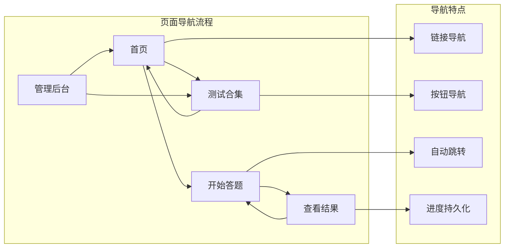

**图表来源**
- [index.html:14-17](file://index.html#L14-L17)
- [quiz.html:247-248](file://quiz.html#L247-L248)
- [result.html:326-328](file://result.html#L326-L328)

### 页面切换机制

系统通过以下机制实现流畅的页面切换：

1. **链接导航**：标准的 HTML 链接实现页面跳转
2. **JavaScript 跳转**：在特定业务逻辑下自动跳转到目标页面
3. **进度保持**：通过 LocalStorage 保持用户答题进度
4. **配置应用**：每个页面加载时自动应用 UI 配置

## 系统边界与组件关系

### 系统边界定义

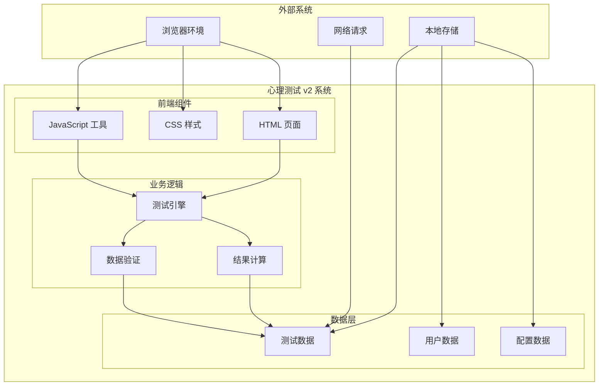

**图表来源**
- [utils.js:17-50](file://js/utils.js#L17-L50)
- [default-quiz.json:1-235](file://data/default-quiz.json#L1-L235)

### 组件依赖关系

系统组件之间的依赖关系如下：

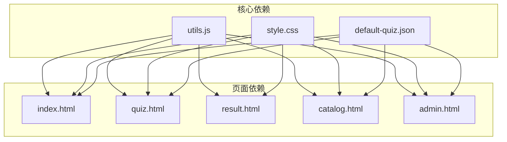

**图表来源**
- [index.html:68-69](file://index.html#L68-L69)
- [quiz.html:49](file://quiz.html#L49)
- [result.html:85](file://result.html#L85)
- [catalog.html:74](file://catalog.html#L74)
- [admin.html:171](file://admin.html#L171)

## 数据流分析

### 数据流向图

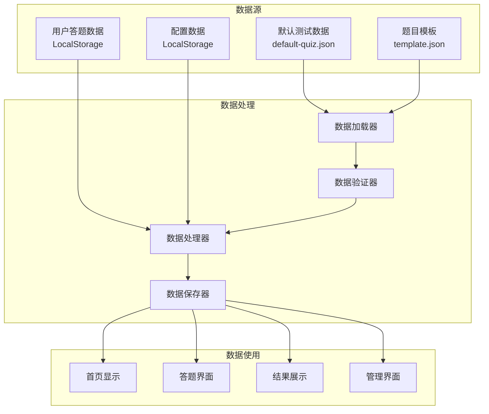

**图表来源**
- [index.html:84-144](file://index.html#L84-L144)
- [quiz.html:61-98](file://quiz.html#L61-L98)
- [result.html:331-359](file://result.html#L331-L359)
- [admin.html:189-203](file://admin.html#L189-L203)

### 数据持久化策略

系统采用分层数据持久化策略：

1. **测试数据**：优先使用 LocalStorage 中的自定义数据，否则回退到默认 JSON 文件
2. **用户进度**：实时保存答题进度，支持断点续答
3. **UI 配置**：保存用户自定义的界面配置
4. **临时数据**：仅在内存中保存当前会话的数据

## 核心组件详细分析

### 数据管理组件

#### StorageUtil 类分析

StorageUtil 类提供了统一的本地存储管理接口：

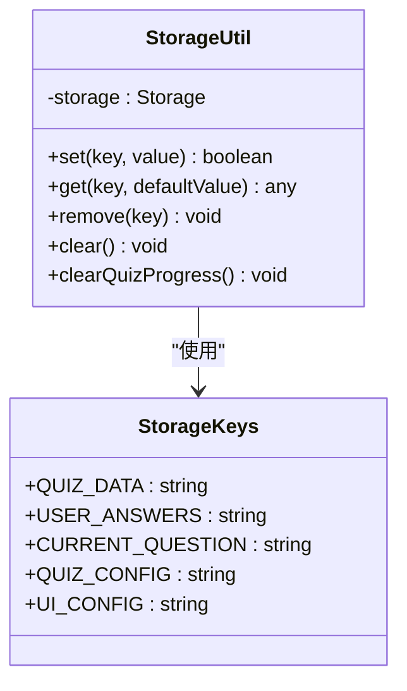

**图表来源**
- [utils.js:17-50](file://js/utils.js#L17-L50)
- [utils.js:6-12](file://js/utils.js#L6-L12)

**核心功能**：
- **数据存取**：提供安全的数据存取方法，包含异常处理
- **进度管理**：专门的测试进度清理功能
- **键值管理**：统一的存储键值定义

#### QuizValidator 类分析

QuizValidator 类确保测试数据的完整性和正确性：

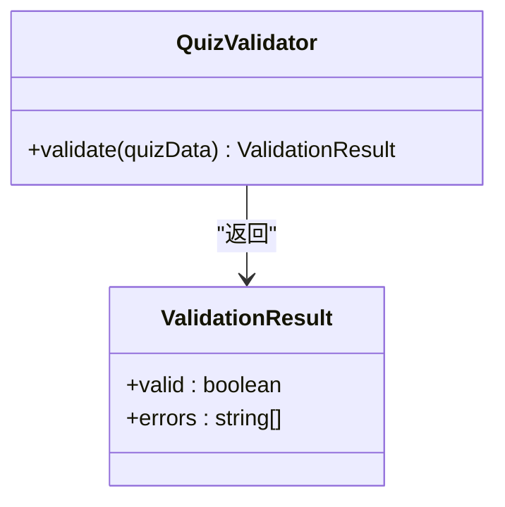

**图表来源**
- [utils.js:55-126](file://js/utils.js#L55-L126)

**验证规则**：
- **必需字段检查**：确保测试名称、题目数量等基本字段存在
- **维度定义验证**：检查维度表的完整性
- **题目数据验证**：验证量表题和选择题的格式正确性
- **选项完整性**：确保选择题的有效选项配置

### UI 配置组件

#### applyUIConfig 函数分析

UI 配置系统实现了动态主题切换功能：

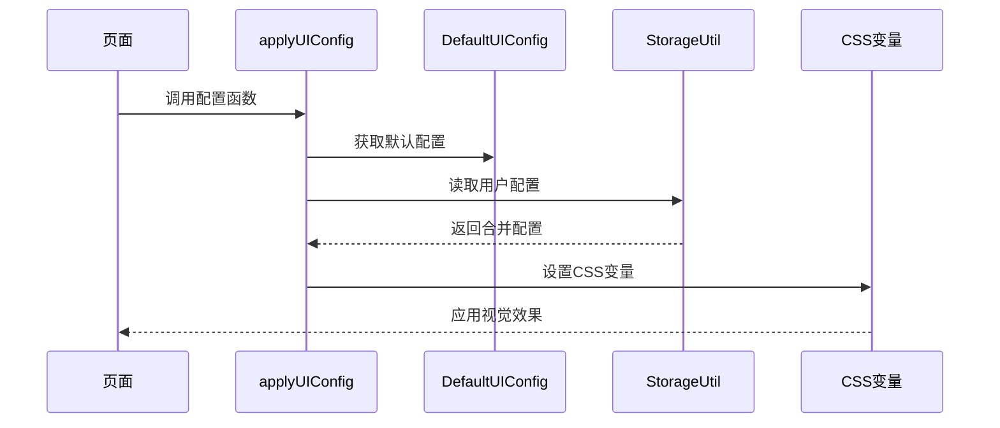

**图表来源**
- [utils.js:226-244](file://js/utils.js#L226-L244)
- [utils.js:207-221](file://js/utils.js#L207-L221)

**配置项**：
- **颜色方案**：主色调、辅色调、背景色
- **字体设置**：字体族、字号层级
- **圆角半径**：组件边角圆润程度
- **最大宽度**：页面内容容器宽度限制

### 测试引擎组件

#### 答题流程分析

测试引擎负责管理完整的答题过程：

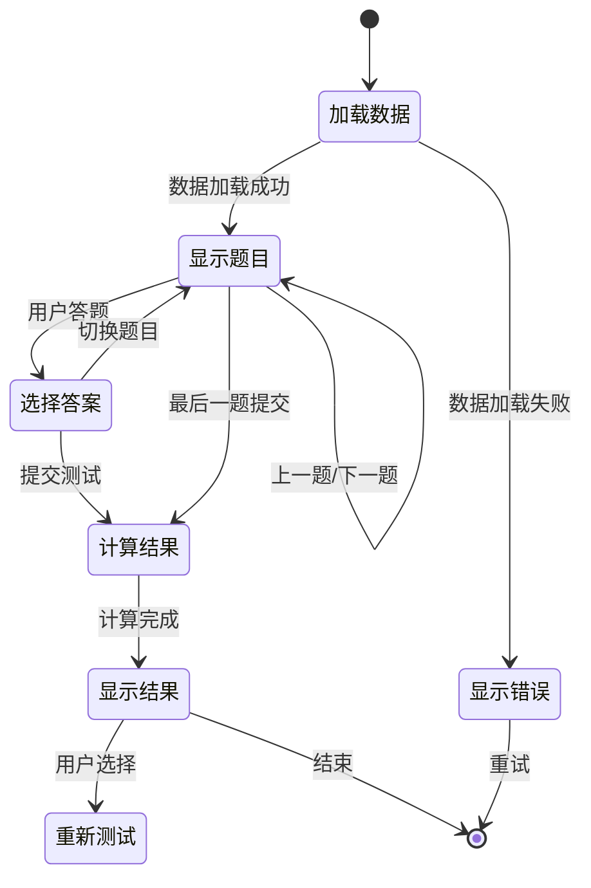

**图表来源**
- [quiz.html:61-98](file://quiz.html#L61-L98)
- [quiz.html:159-175](file://quiz.html#L159-L175)
- [quiz.html:238-249](file://quiz.html#L238-L249)

**核心流程**：
1. **数据加载**：从 LocalStorage 或 JSON 文件加载测试数据
2. **题目渲染**：根据题目类型渲染不同的答题界面
3. **答案收集**：实时收集用户答案并保存进度
4. **进度跟踪**：通过花朵动画直观显示答题进度
5. **结果计算**：计算各维度得分并生成可视化报告

## 性能考虑

### 性能优化策略

系统采用了多项性能优化措施：

1. **懒加载机制**：非关键资源延迟加载
2. **数据缓存**：LocalStorage 缓存减少重复请求
3. **事件节流**：防抖函数避免频繁操作
4. **内存管理**：及时清理不需要的事件监听器

### 内存使用分析

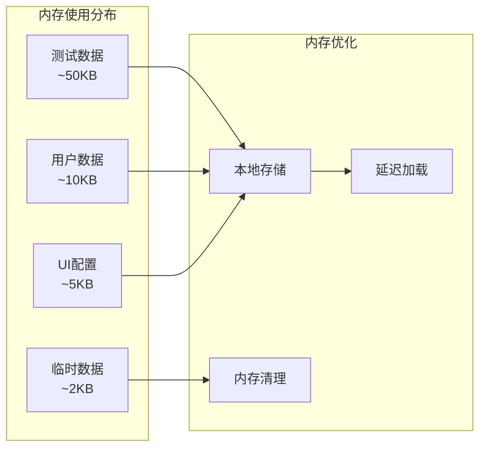

**图表来源**
- [utils.js:135-144](file://js/utils.js#L135-L144)

## 故障排除指南

### 常见问题及解决方案

#### 数据加载失败

**问题症状**：
- 页面显示默认数据而非自定义数据
- 答题页面无法加载题目

**解决步骤**：
1. 检查 LocalStorage 是否可用
2. 验证 JSON 文件格式是否正确
3. 确认文件路径是否正确
4. 查看浏览器控制台错误信息

#### UI 配置不生效

**问题症状**：
- 自定义主题颜色未应用
- 字体设置未改变

**解决步骤**：
1. 确认 CSS 变量设置是否正确
2. 检查 applyUIConfig 函数调用
3. 验证 LocalStorage 中的配置数据
4. 刷新页面确认配置应用

#### 答题进度丢失

**问题症状**：
- 刷新页面后进度消失
- 无法断点续答

**解决步骤**：
1. 检查 LocalStorage 权限
2. 确认 StorageUtil.clearQuizProgress() 方法未被意外调用
3. 验证浏览器隐私设置
4. 清除浏览器缓存后重试

## 总结

心理测试 v2 项目成功实现了基于纯前端的完整心理测评系统。通过清晰的 MVC 架构分离、模块化设计原则和事件驱动架构，系统具备了良好的可维护性和扩展性。

### 主要成就

1. **架构清晰**：MVC 模式的合理应用使得代码结构清晰，职责分明
2. **用户体验优秀**：流畅的页面切换、直观的进度指示和丰富的交互反馈
3. **数据管理完善**：完善的本地存储策略和数据验证机制
4. **可定制性强**：灵活的 UI 配置和题目管理系统

### 技术亮点

- **纯前端实现**：无需服务器即可运行，部署简单
- **响应式设计**：适配各种设备尺寸
- **数据持久化**：完整的进度保存和恢复机制
- **事件驱动**：灵活的用户交互处理

### 改进建议

1. **模块化重构**：可以考虑引入模块化 JavaScript 架构
2. **单元测试**：增加自动化测试覆盖关键业务逻辑
3. **性能监控**：添加性能指标监控和优化
4. **国际化支持**：扩展多语言支持功能

这个项目为心理测评类应用提供了一个优秀的前端实现范例，展示了如何在纯前端环境下构建复杂的应用程序。