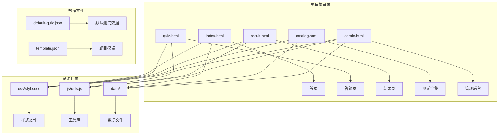
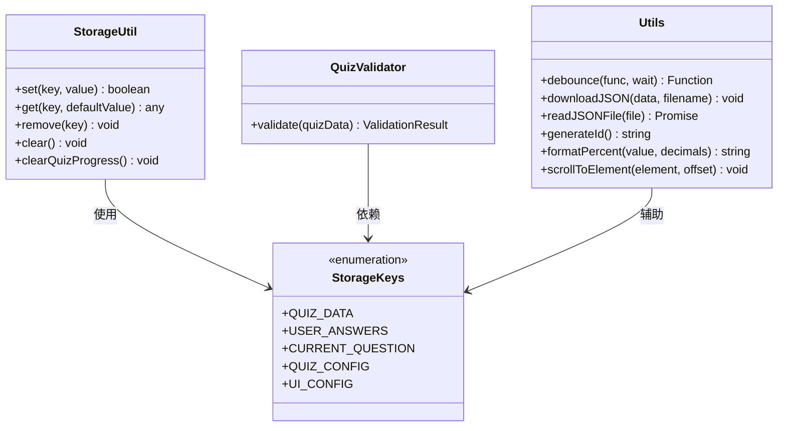
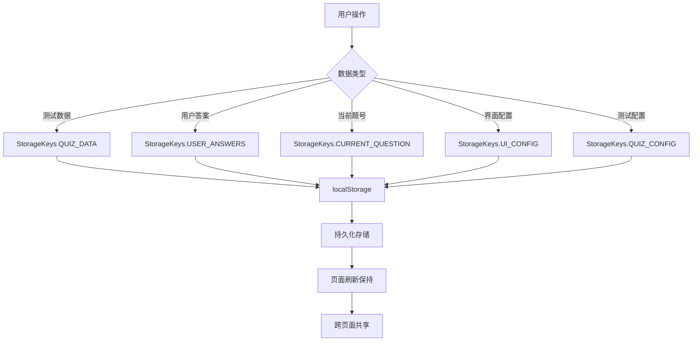
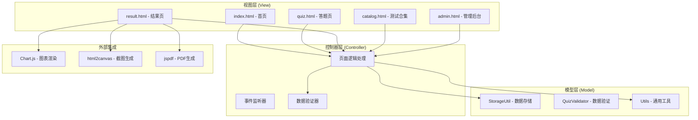
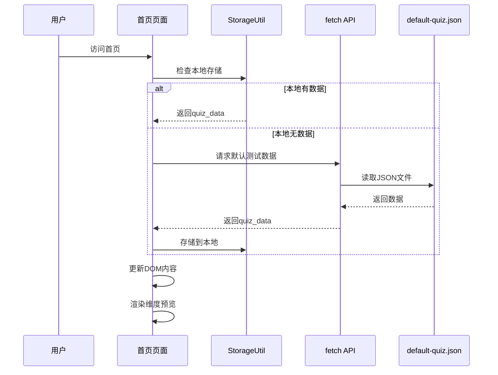
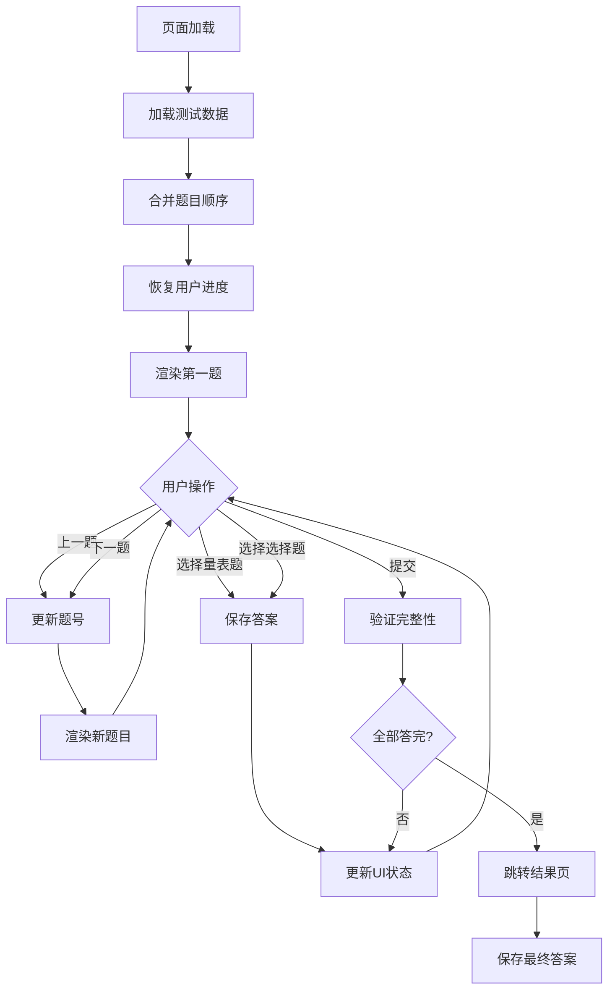
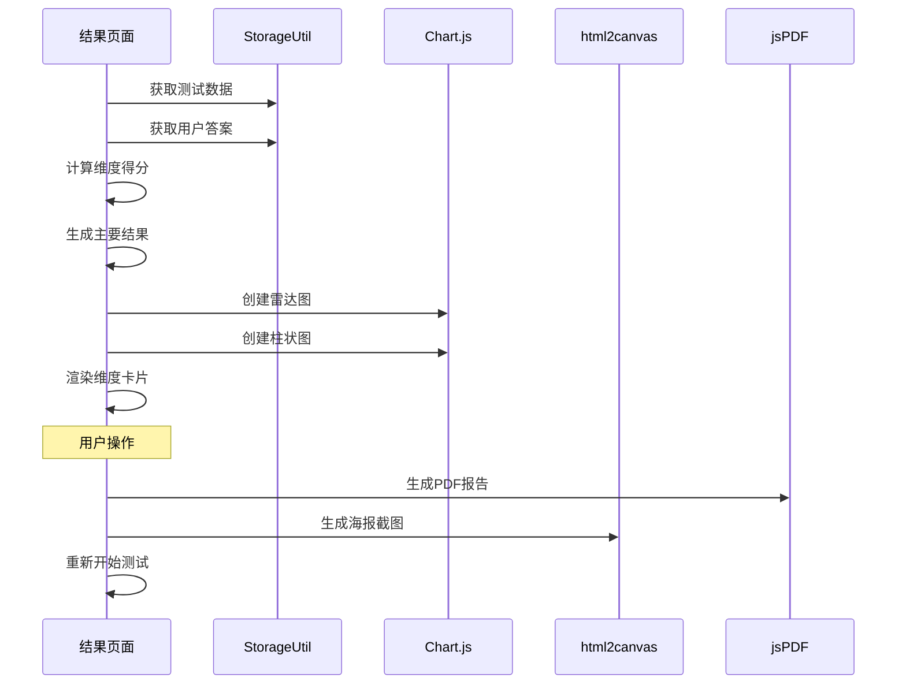
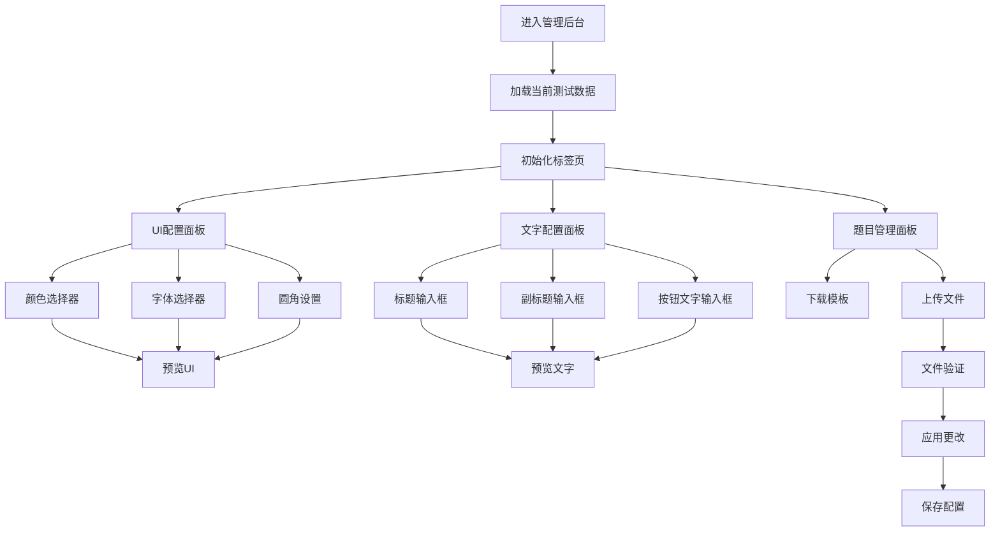
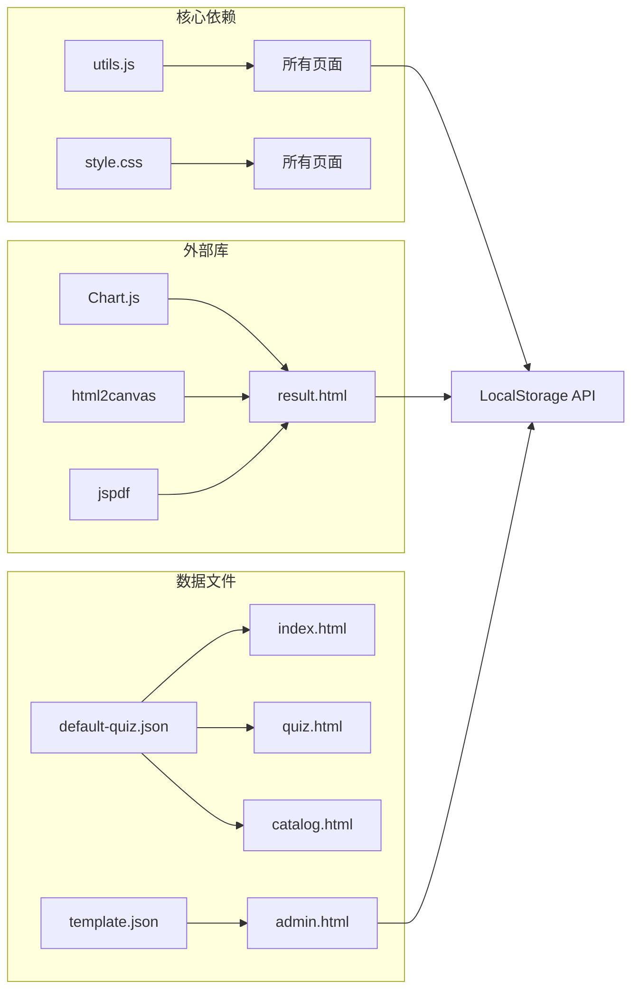

# 架构设计

<cite>
**本文档引用的文件**
- [index.html](file://index.html)
- [quiz.html](file://quiz.html)
- [result.html](file://result.html)
- [admin.html](file://admin.html)
- [catalog.html](file://catalog.html)
- [style.css](file://css/style.css)
- [utils.js](file://js/utils.js)
- [default-quiz.json](file://data/default-quiz.json)
- [template.json](file://data/template.json)
</cite>

## 目录
1. [引言](#引言)
2. [项目结构](#项目结构)
3. [核心组件](#核心组件)
4. [架构概览](#架构概览)
5. [详细组件分析](#详细组件分析)
6. [依赖关系分析](#依赖关系分析)
7. [性能考虑](#性能考虑)
8. [故障排除指南](#故障排除指南)
9. [结论](#结论)

## 引言

心理测试 v2 是一个基于纯前端技术的心理测评系统，采用 HTML5、CSS3 和 JavaScript 技术栈构建。该系统实现了完整的心理测试流程，包括测试展示、答题交互、结果分析和报告生成等功能。系统采用模块化设计，通过工具库统一管理数据存储和验证逻辑，支持用户界面个性化定制和测试内容的动态管理。

## 项目结构

心理测试 v2 项目采用清晰的文件组织结构，按照功能模块进行分离：

**图表来源**
- [index.html:1-115](file://index.html#L1-L115)
- [quiz.html:1-259](file://quiz.html#L1-L259)
- [result.html:1-363](file://result.html#L1-L363)
- [admin.html:1-402](file://admin.html#L1-L402)
- [catalog.html:1-106](file://catalog.html#L1-L106)

**章节来源**
- [index.html:1-115](file://index.html#L1-L115)
- [style.css:1-731](file://css/style.css#L1-L731)
- [utils.js:1-250](file://js/utils.js#L1-L250)

## 核心组件

### 工具库系统

工具库是整个系统的核心基础设施，提供了统一的数据管理和验证机制：

**图表来源**
- [utils.js:6-50](file://js/utils.js#L6-L50)
- [utils.js:55-126](file://js/utils.js#L55-L126)
- [utils.js:131-202](file://js/utils.js#L131-L202)

### 数据存储架构

系统采用本地存储策略，通过统一的键值对管理不同类型的测试数据：

**图表来源**
- [utils.js:6-12](file://js/utils.js#L6-L12)
- [utils.js:17-50](file://js/utils.js#L17-L50)

**章节来源**
- [utils.js:1-250](file://js/utils.js#L1-L250)

## 架构概览

心理测试 v2 采用了基于 MVC 模式的前端架构设计，结合模块化和事件驱动的特性：

**图表来源**
- [index.html:68-112](file://index.html#L68-L112)
- [quiz.html:49-256](file://quiz.html#L49-L256)
- [result.html:8-360](file://result.html#L8-L360)
- [admin.html:171-399](file://admin.html#L171-L399)

## 详细组件分析

### 首页组件 (index.html)

首页作为用户入口，负责展示测试基本信息和导航功能：

**图表来源**
- [index.html:70-105](file://index.html#L70-L105)
- [utils.js:17-36](file://js/utils.js#L17-L36)

### 答题组件 (quiz.html)

答题组件实现了完整的测试流程，包括题目渲染、答案收集和进度跟踪：

**图表来源**
- [quiz.html:60-98](file://quiz.html#L60-L98)
- [quiz.html:100-175](file://quiz.html#L100-L175)
- [quiz.html:217-249](file://quiz.html#L217-L249)

### 结果组件 (result.html)

结果组件负责数据分析和可视化展示：

**图表来源**
- [result.html:94-133](file://result.html#L94-L133)
- [result.html:153-240](file://result.html#L153-L240)
- [result.html:269-328](file://result.html#L269-L328)

### 管理后台 (admin.html)

管理后台提供了完整的测试内容管理系统：

**图表来源**
- [admin.html:177-186](file://admin.html#L177-L186)
- [admin.html:243-291](file://admin.html#L243-L291)
- [admin.html:361-392](file://admin.html#L361-L392)

**章节来源**
- [index.html:1-115](file://index.html#L1-L115)
- [quiz.html:1-259](file://quiz.html#L1-L259)
- [result.html:1-363](file://result.html#L1-L363)
- [admin.html:1-402](file://admin.html#L1-L402)
- [catalog.html:1-106](file://catalog.html#L1-L106)

## 依赖关系分析

系统采用松耦合的设计，通过工具库实现模块间的解耦：

**图表来源**
- [utils.js:247-250](file://js/utils.js#L247-L250)
- [result.html:8-10](file://result.html#L8-L10)
- [index.html:78-81](file://index.html#L78-L81)
- [admin.html:244-250](file://admin.html#L244-L250)

**章节来源**
- [utils.js:1-250](file://js/utils.js#L1-L250)
- [style.css:1-731](file://css/style.css#L1-L731)

## 性能考虑

### 内存优化策略

系统采用渐进式加载和懒加载机制：
- **按需加载外部库**：Chart.js、html2canvas、jsPDF 仅在结果页使用
- **数据缓存策略**：使用 localStorage 减少重复请求
- **DOM 操作优化**：批量更新 DOM 节点，避免频繁重排

### 网络性能优化

- **静态资源缓存**：CSS 和 JS 文件使用浏览器缓存
- **JSON 数据压缩**：使用最小化的 JSON 格式
- **CDN 依赖**：外部库通过 CDN 加载，提高加载速度

### 用户体验优化

- **动画过渡**：使用 CSS3 动画提升交互体验
- **响应式设计**：适配移动端和桌面端
- **进度反馈**：通过花朵生长动画提供进度可视化

## 故障排除指南

### 常见问题及解决方案

**问题1：测试数据加载失败**
- 检查 default-quiz.json 文件格式
- 确认文件路径正确
- 查看浏览器控制台错误信息

**问题2：答案无法保存**
- 检查浏览器是否启用 localStorage
- 确认 StorageUtil 方法调用正常
- 验证 StorageKeys 常量定义

**问题3：图表显示异常**
- 确认 Chart.js 版本兼容性
- 检查 Canvas 元素是否存在
- 验证数据格式正确性

**问题4：PDF 生成失败**
- 确认 jsPDF 库正确加载
- 检查 html2canvas 依赖
- 验证浏览器安全设置

**章节来源**
- [utils.js:17-36](file://js/utils.js#L17-L36)
- [result.html:269-297](file://result.html#L269-L297)

## 结论

心理测试 v2 项目展现了优秀的前端架构设计，通过模块化和工具库的使用实现了高度的可维护性和可扩展性。系统采用的技术栈简洁而高效，充分利用了现代浏览器的能力。

### 设计优势

1. **模块化设计**：工具库独立封装，便于维护和测试
2. **数据驱动**：通过 JSON 文件实现内容的灵活管理
3. **用户体验**：流畅的动画和响应式设计
4. **可扩展性**：清晰的架构为功能扩展奠定基础

### 技术建议

1. **代码分割**：将大型工具函数拆分为更小的模块
2. **TypeScript 支持**：引入 TypeScript 提高代码质量
3. **单元测试**：为关键功能编写自动化测试
4. **性能监控**：添加性能指标监控和分析

该架构为心理测试系统提供了坚实的基础，能够支持未来功能的扩展和业务需求的变化。