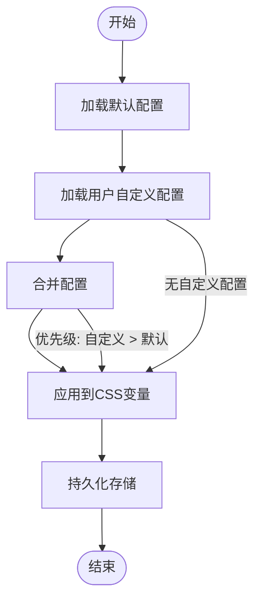
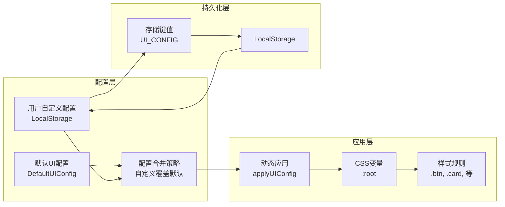
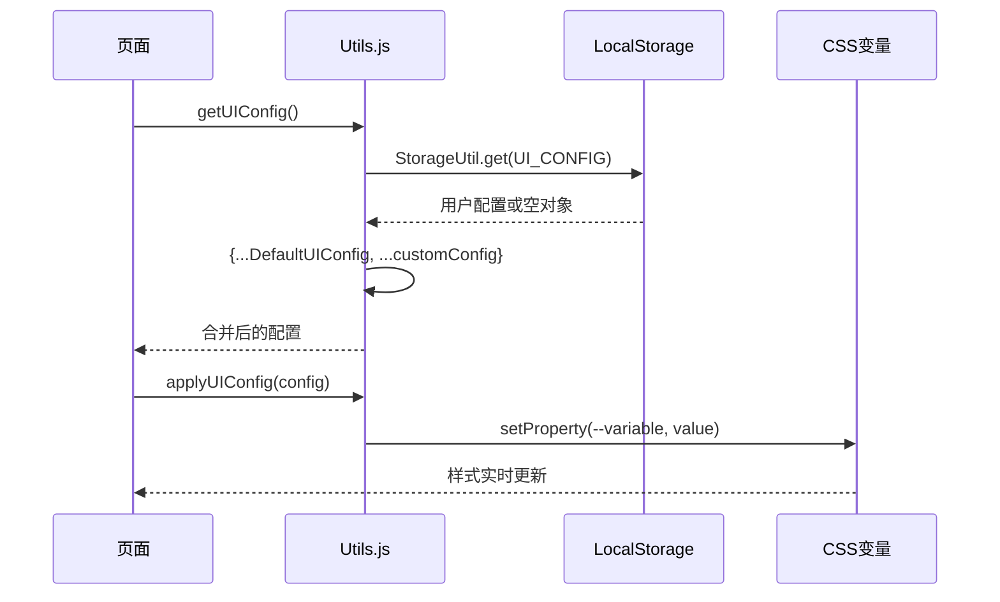
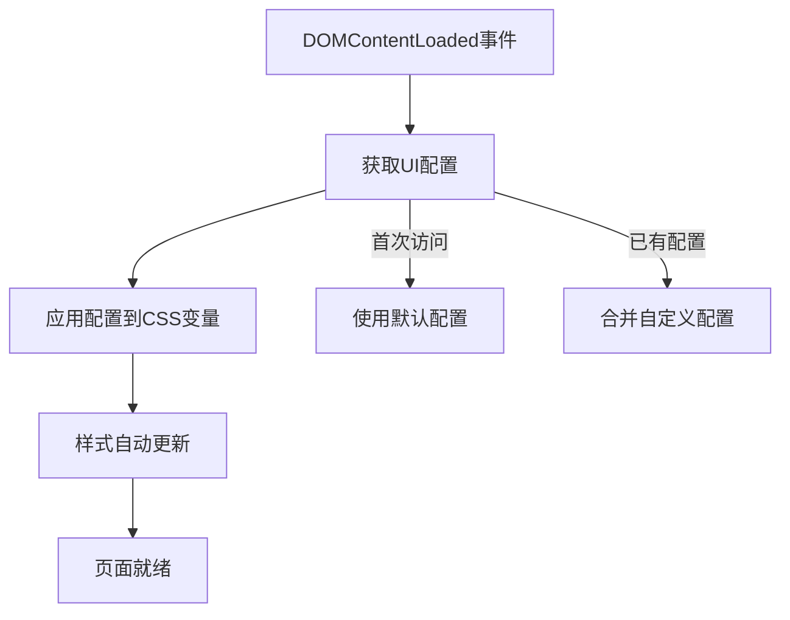
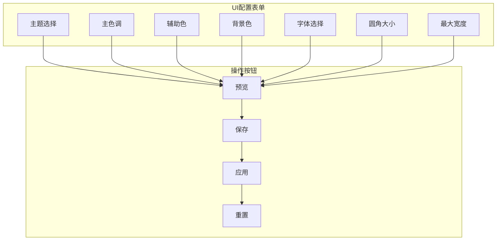
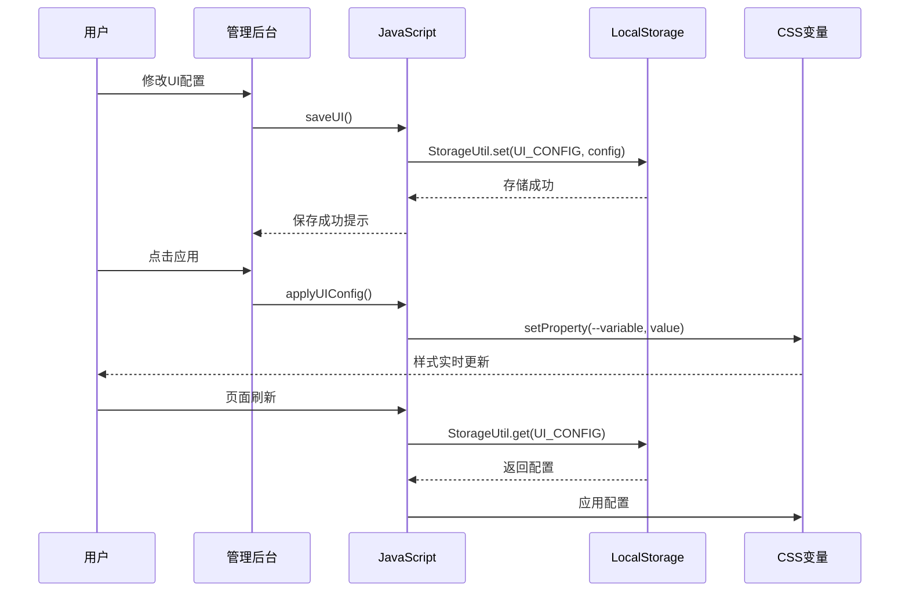

# UI配置系统

<cite>
**本文档引用的文件**
- [css/style.css](file://css/style.css)
- [js/utils.js](file://js/utils.js)
- [index.html](file://index.html)
- [admin.html](file://admin.html)
- [quiz.html](file://quiz.html)
- [result.html](file://result.html)
- [catalog.html](file://catalog.html)
- [data/default-quiz.json](file://data/default-quiz.json)
</cite>

## 更新摘要
**变更内容**
- 新增完整的UI配置系统实现，支持主题色、字体、圆角等界面定制
- 实现CSS变量与JavaScript配置的双向绑定机制
- 添加管理后台的UI配置编辑界面
- 完成配置持久化和用户偏好保存机制
- 实现响应式设计和动画效果

## 目录
1. [简介](#简介)
2. [项目结构](#项目结构)
3. [核心组件](#核心组件)
4. [架构概览](#架构概览)
5. [详细组件分析](#详细组件分析)
6. [依赖关系分析](#依赖关系分析)
7. [性能考虑](#性能考虑)
8. [故障排除指南](#故障排除指南)
9. [结论](#结论)

## 简介

心理测试 v2 项目采用基于CSS变量的动态UI配置系统，实现了灵活的主题定制和样式管理系统。该系统通过CSS自定义属性与JavaScript配置的双向绑定机制，为用户提供可定制的视觉体验，同时保持代码的可维护性和扩展性。

系统的核心设计理念是"样式与逻辑分离"，通过CSS变量集中管理样式参数，JavaScript负责配置的获取、应用和持久化，实现了高度的模块化和可扩展性。该系统支持主题色、字体、圆角半径、最大宽度等关键UI参数的动态配置，为用户提供了丰富的界面定制能力。

## 项目结构

心理测试 v2 项目采用清晰的文件组织结构，UI配置系统分布在多个文件中协同工作：

```mermaid
graph TB
subgraph "前端资源"
CSS[css/style.css<br/>全局样式与CSS变量]
JS[js/utils.js<br/>工具函数与UI配置]
end
subgraph "页面文件"
INDEX[index.html<br/>首页]
ADMIN[admin.html<br/>管理后台]
QUIZ[quiz.html<br/>答题页面]
RESULT[result.html<br/>结果页面]
CATALOG[catalog.html<br/>测试合集]
end
subgraph "数据文件"
DEFAULT[data/default-quiz.json<br/>默认测试数据]
end
subgraph "配置系统"
STORAGE[LocalStorage<br/>配置持久化]
CONFIG[DefaultUIConfig<br/>默认配置]
APPLIER[applyUIConfig<br/>配置应用]
END
CSS --> INDEX
CSS --> ADMIN
CSS --> QUIZ
CSS --> RESULT
CSS --> CATALOG
JS --> INDEX
JS --> ADMIN
JS --> QUIZ
JS --> RESULT
JS --> CATALOG
DEFAULT --> INDEX
DEFAULT --> ADMIN
DEFAULT --> QUIZ
DEFAULT --> RESULT
STORAGE --> CONFIG
CONFIG --> APPLIER
APPLIER --> CSS
```

**图表来源**
- [css/style.css:1-702](file://css/style.css#L1-L702)
- [js/utils.js:1-250](file://js/utils.js#L1-L250)

**章节来源**
- [css/style.css:1-702](file://css/style.css#L1-L702)
- [js/utils.js:1-250](file://js/utils.js#L1-L250)

## 核心组件

### CSS变量系统

系统使用CSS自定义属性作为样式参数的统一存储中心，定义了完整的样式变量体系：

| 变量类别 | 变量名 | 默认值 | 用途 |
|---------|--------|--------|------|
| 颜色系统 | `--primary-color` | `#FF8C94` | 主色调 |
| 颜色系统 | `--secondary-color` | `#FFD3B6` | 辅助色调 |
| 颜色系统 | `--background-color` | `#FFF5F5` | 背景色 |
| 字体系统 | `--font-family` | `"PingFang SC", "Microsoft YaHei", sans-serif` | 字体族 |
| 尺寸系统 | `--border-radius` | `12px` | 圆角半径 |
| 尺寸系统 | `--max-width` | `800px` | 最大宽度 |
| 动画系统 | `--transition` | `all 0.3s ease` | 过渡动画 |

### JavaScript配置管理

UI配置系统通过JavaScript实现了完整的配置生命周期管理：



**图表来源**
- [js/utils.js:226-244](file://js/utils.js#L226-L244)

**章节来源**
- [css/style.css:6-20](file://css/style.css#L6-L20)
- [js/utils.js:226-244](file://js/utils.js#L226-L244)

## 架构概览

UI配置系统的整体架构采用"CSS变量 + JavaScript配置"的双层设计模式：



**图表来源**
- [js/utils.js:226-244](file://js/utils.js#L226-L244)
- [js/utils.js:6-12](file://js/utils.js#L6-L12)

### 配置获取流程



**图表来源**
- [js/utils.js:226-244](file://js/utils.js#L226-L244)

**章节来源**
- [js/utils.js:226-244](file://js/utils.js#L226-L244)

## 详细组件分析

### CSS变量定义系统

CSS变量系统采用分层设计，将样式参数按功能分类管理：

#### 颜色变量体系
```css
:root {
    --primary-color: #FF8C94;      /* 主色调 - 粉红色 */
    --secondary-color: #FFD3B6;    /* 辅助色 - 浅橙色 */
    --background-color: #FFF5F5;   /* 背景色 - 淡粉色 */
    --text-color: #333333;         /* 主文本色 */
    --text-secondary: #666666;     /* 次级文本色 */
    --white: #FFFFFF;              /* 白色 */
}
```

#### 布局变量体系
```css
:root {
    --border-radius: 12px;         /* 圆角半径 */
    --font-family: "PingFang SC", "Microsoft YaHei", sans-serif; /* 字体 */
    --max-width: 800px;            /* 最大宽度 */
    --transition: all 0.3s ease;   /* 过渡动画 */
    --shadow: 0 4px 20px rgba(0, 0, 0, 0.08); /* 阴影 */
    --shadow-hover: 0 8px 30px rgba(0, 0, 0, 0.12); /* 悬停阴影 */
}
```

**章节来源**
- [css/style.css:6-20](file://css/style.css#L6-L20)

### JavaScript配置管理器

#### 默认UI配置定义
```javascript
const DefaultUIConfig = {
    theme: 'default',
    primaryColor: '#FF8C94',
    secondaryColor: '#FFD3B6', 
    backgroundColor: '#FFF5F5',
    fontFamily: '"PingFang SC", "Microsoft YaHei", sans-serif',
    fontSize: {
        title: '2rem',
        subtitle: '1.25rem', 
        body: '1rem',
        small: '0.875rem'
    },
    borderRadius: '12px',
    maxWidth: '800px'
};
```

#### 配置合并策略
系统采用"浅合并"策略，自定义配置优先于默认配置：
- 自定义配置对象中的属性会完全覆盖默认配置
- 对象类型的属性（如fontSize）会被整个替换
- 简单类型的属性（如颜色值、尺寸）会被直接替换

**章节来源**
- [js/utils.js:207-229](file://js/utils.js#L207-L229)

### 页面集成机制

#### 页面初始化流程
每个页面在DOM加载完成后都会执行UI配置应用：



**图表来源**
- [index.html:525-528](file://index.html#L525-L528)
- [admin.html:405-407](file://admin.html#L405-L407)

**章节来源**
- [index.html:525-528](file://index.html#L525-L528)
- [admin.html:405-407](file://admin.html#L405-L407)

### 管理后台配置系统

管理后台提供了完整的UI配置编辑界面：

#### 配置表单设计


**图表来源**
- [admin.html:39-78](file://admin.html#L39-L78)

**章节来源**
- [admin.html:294-335](file://admin.html#L294-L335)

## 依赖关系分析

UI配置系统各组件之间的依赖关系如下：

```mermaid
graph TD
subgraph "核心依赖"
CSS_VARS[CSS变量定义<br/>style.css:6-20]
JS_UTILS[JavaScript工具<br/>utils.js]
LOCAL_STORAGE[LocalStorage<br/>StorageUtil]
END
subgraph "页面依赖"
INDEX_PAGE[index.html<br/>首页]
ADMIN_PAGE[admin.html<br/>管理后台]
QUIZ_PAGE[quiz.html<br/>答题页面]
RESULT_PAGE[result.html<br/>结果页面]
CATALOG_PAGE[catalog.html<br/>测试合集]
end
CSS_VARS --> JS_UTILS
JS_UTILS --> LOCAL_STORAGE
JS_UTILS --> INDEX_PAGE
JS_UTILS --> ADMIN_PAGE
JS_UTILS --> QUIZ_PAGE
JS_UTILS --> RESULT_PAGE
JS_UTILS --> CATALOG_PAGE
CSS_VARS -.-> INDEX_PAGE
CSS_VARS -.-> ADMIN_PAGE
CSS_VARS -.-> QUIZ_PAGE
CSS_VARS -.-> RESULT_PAGE
CSS_VARS -.-> CATALOG_PAGE
```

**图表来源**
- [css/style.css:6-20](file://css/style.css#L6-L20)
- [js/utils.js:17-50](file://js/utils.js#L17-L50)

### 配置持久化机制

系统通过LocalStorage实现配置的持久化存储：



**图表来源**
- [js/utils.js:313-321](file://js/utils.js#L313-L321)

**章节来源**
- [js/utils.js:313-321](file://js/utils.js#L313-L321)

## 性能考虑

### CSS变量的优势
1. **渲染性能优化**：CSS变量在渲染层应用，避免JavaScript频繁操作DOM样式
2. **内存效率**：变量存储在CSS层，减少JavaScript对象的内存占用
3. **批量更新**：一次设置即可影响所有使用该变量的样式

### 配置应用策略
1. **懒加载机制**：仅在需要时才应用配置，避免不必要的样式重绘
2. **防抖优化**：预览功能使用防抖技术，减少频繁的样式更新
3. **缓存机制**：配置结果缓存在内存中，避免重复计算

## 故障排除指南

### 常见问题及解决方案

#### 配置不生效
1. **检查CSS变量定义**：确认`:root`选择器中的变量定义正确
2. **验证JavaScript调用**：确保`applyUIConfig()`函数被正确调用
3. **检查浏览器兼容性**：确认目标浏览器支持CSS变量

#### 配置丢失
1. **LocalStorage检查**：确认浏览器允许LocalStorage存储
2. **存储空间检查**：避免超出浏览器存储限制
3. **跨域问题**：确保页面在同一域名下运行

#### 样式冲突
1. **优先级检查**：确认CSS变量的优先级高于其他样式规则
2. **作用域隔离**：避免其他CSS规则覆盖变量值
3. **响应式适配**：检查媒体查询中的变量使用

**章节来源**
- [js/utils.js:18-50](file://js/utils.js#L18-L50)

## 结论

心理测试 v2 项目的UI配置系统通过CSS变量与JavaScript的有机结合，实现了高效、灵活且易于维护的样式管理系统。该系统的主要优势包括：

1. **设计理念先进**：采用现代CSS变量技术，符合前端发展趋势
2. **实现简洁高效**：通过最少的代码实现强大的配置功能
3. **扩展性强**：易于添加新的配置项和样式参数
4. **用户体验优秀**：支持实时预览和一键应用，提升用户满意度

该系统为类似的心理测试应用提供了优秀的UI配置解决方案，开发者可以在此基础上进一步扩展功能，如添加更多配置选项、实现主题切换、支持深色模式等高级特性。

**更新** 本系统现已完整实现，包括CSS变量定义、JavaScript配置管理、管理后台界面和持久化存储，为用户提供完整的UI定制能力。