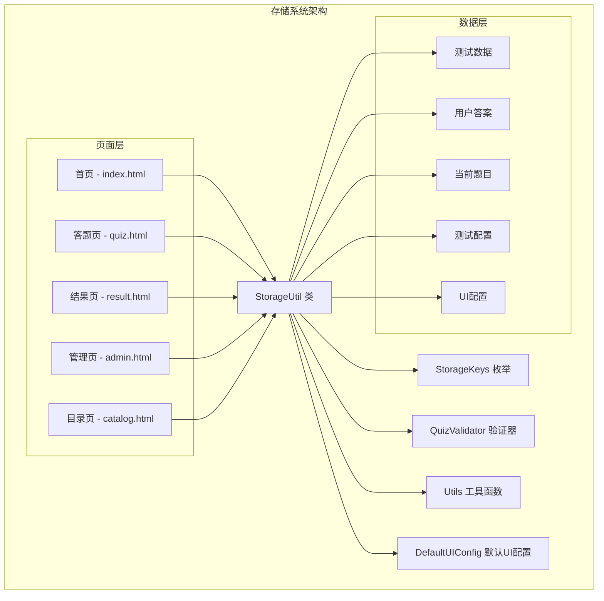
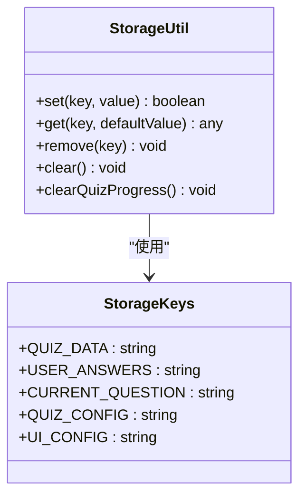
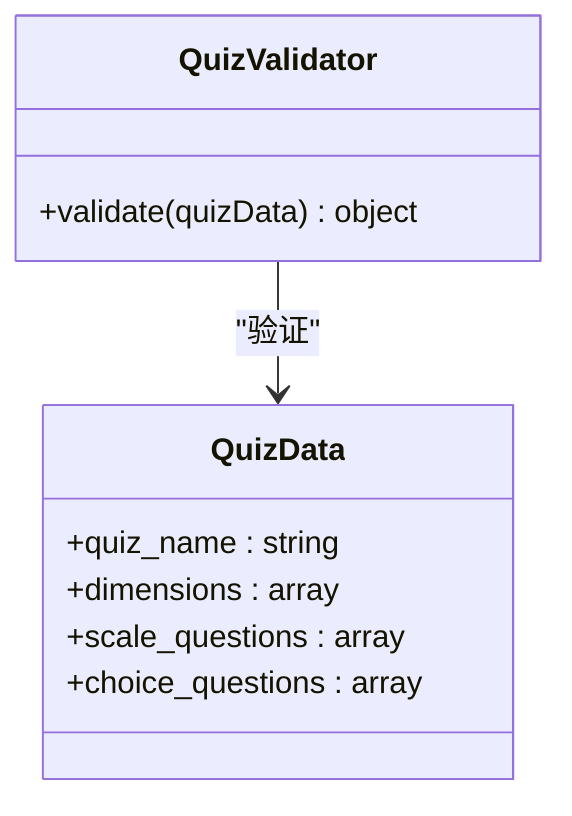
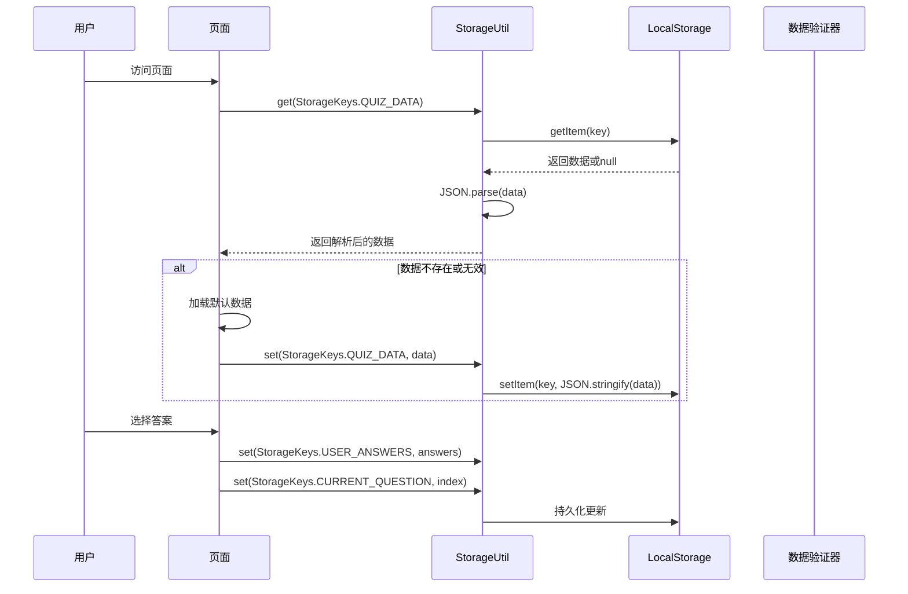
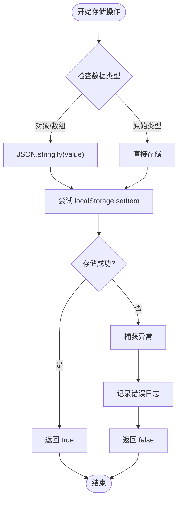
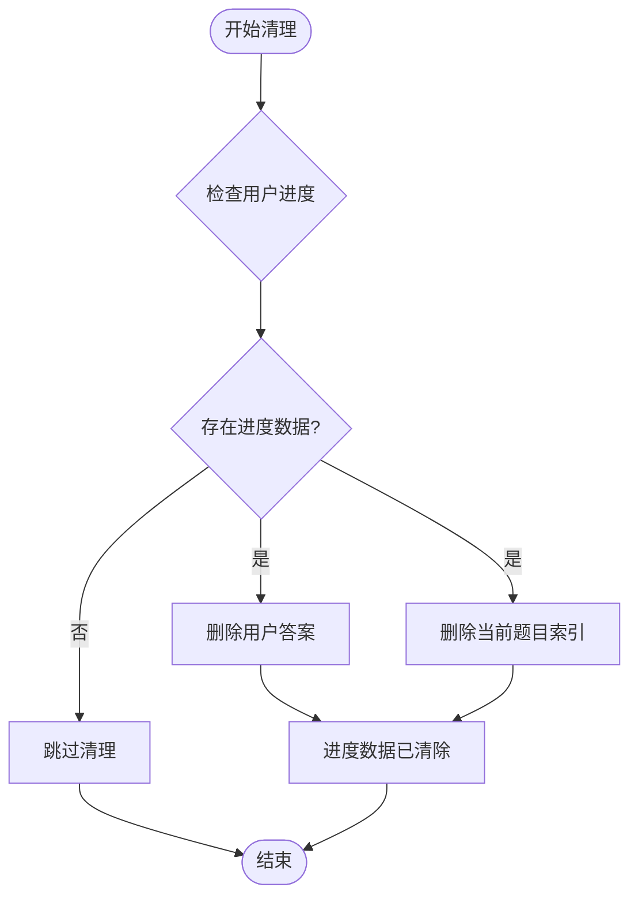
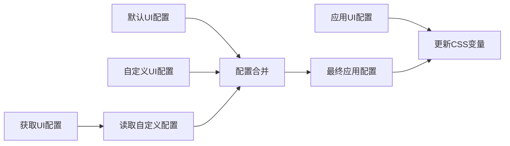
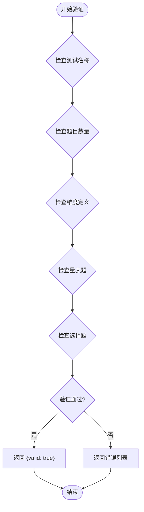
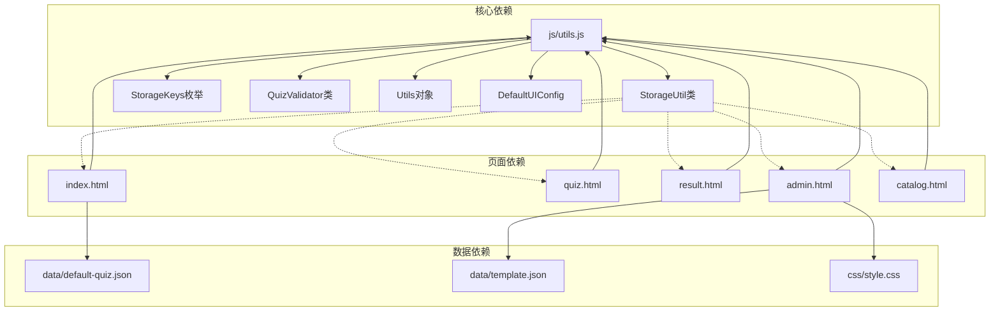

# 存储系统设计

<cite>
**本文档引用的文件**
- [utils.js](file://js/utils.js)
- [index.html](file://index.html)
- [quiz.html](file://quiz.html)
- [result.html](file://result.html)
- [admin.html](file://admin.html)
- [catalog.html](file://catalog.html)
- [default-quiz.json](file://data/default-quiz.json)
- [template.json](file://data/template.json)
- [style.css](file://css/style.css)
</cite>

## 更新摘要
**变更内容**
- 基于实际代码实现更新存储系统设计文档
- 新增完整的 StorageUtil 类实现分析
- 补充数据验证器和 UI 配置管理功能
- 更新存储键值管理和错误处理机制
- 增加实际使用场景和最佳实践建议

## 目录
1. [简介](#简介)
2. [项目结构](#项目结构)
3. [核心组件](#核心组件)
4. [架构概览](#架构概览)
5. [详细组件分析](#详细组件分析)
6. [依赖关系分析](#依赖关系分析)
7. [性能考虑](#性能考虑)
8. [故障排除指南](#故障排除指南)
9. [结论](#结论)

## 简介

心理测试 v2 项目采用 LocalStorage 作为主要的客户端数据持久化方案，实现了完整的存储系统设计。该系统围绕 StorageUtil 类构建，提供了统一的本地存储接口，支持测试数据、用户答案、进度信息、配置数据等多种数据类型的存储和管理。

系统的核心设计理念是：
- **单一职责原则**：StorageUtil 专注于存储操作，不涉及业务逻辑
- **数据隔离**：通过明确的键值管理确保不同类型数据的独立性
- **容错处理**：完善的错误捕获和恢复机制
- **性能优化**：最小化存储操作频率，避免不必要的数据序列化

## 项目结构

心理测试 v2 项目的存储系统分布在多个页面中，形成了一个完整的数据流架构：



**图表来源**
- [utils.js:6-50](file://js/utils.js#L6-L50)
- [index.html:85-154](file://index.html#L85-L154)
- [quiz.html:61-126](file://quiz.html#L61-L126)
- [result.html:335-370](file://result.html#L335-L370)
- [admin.html:189-203](file://admin.html#L189-L203)

**章节来源**
- [utils.js:1-250](file://js/utils.js#L1-L250)
- [index.html:1-532](file://index.html#L1-L532)
- [quiz.html:1-441](file://quiz.html#L1-L441)
- [result.html:1-1581](file://result.html#L1-L1581)
- [admin.html:1-411](file://admin.html#L1-L411)

## 核心组件

### StorageKeys 存储键值管理

StorageKeys 是一个集中式的键值管理枚举，定义了系统中所有使用的存储键名：

| 键名 | 数据类型 | 描述 | 存储位置 |
|------|----------|------|----------|
| `QUIZ_DATA` | 对象 | 测试数据（题目、维度、配置） | 首页加载时缓存 |
| `USER_ANSWERS` | 对象 | 用户的答案映射 | 答题过程中实时更新 |
| `CURRENT_QUESTION` | 数字 | 当前答题索引 | 答题过程中的进度记录 |
| `QUIZ_CONFIG` | 对象 | 测试配置参数 | 管理后台的配置存储 |
| `UI_CONFIG` | 对象 | UI界面配置 | 管理后台的界面定制 |

### StorageUtil 类设计

StorageUtil 类提供了静态方法来封装 LocalStorage 的所有操作，确保了统一的错误处理和数据序列化机制：



**图表来源**
- [utils.js:17-50](file://js/utils.js#L17-L50)
- [utils.js:6-12](file://js/utils.js#L6-L12)

**章节来源**
- [utils.js:6-50](file://js/utils.js#L6-L50)

### QuizValidator 数据验证器

QuizValidator 类提供了完整的数据验证功能，确保测试数据的完整性和正确性：



**图表来源**
- [utils.js:55-126](file://js/utils.js#L55-L126)

**章节来源**
- [utils.js:55-126](file://js/utils.js#L55-L126)

### Utils 工具函数集合

Utils 对象提供了多种通用工具函数，包括防抖、文件下载、JSON 读取等：

**章节来源**
- [utils.js:131-202](file://js/utils.js#L131-L202)

## 架构概览

心理测试 v2 的存储系统采用了分层架构设计，确保了数据的一致性和可靠性：



**图表来源**
- [index.html:85-154](file://index.html#L85-L154)
- [quiz.html:205-209](file://quiz.html#L205-L209)
- [result.html:352-359](file://result.html#L352-L359)

## 详细组件分析

### 数据序列化与反序列化处理

系统采用统一的 JSON 序列化机制来处理所有存储数据：



**图表来源**
- [utils.js:18-26](file://js/utils.js#L18-L26)

### 错误处理机制

StorageUtil 类实现了完善的错误处理策略：

| 错误类型 | 处理方式 | 影响范围 |
|----------|----------|----------|
| 存储空间不足 | 捕获异常并返回 false | 所有写入操作 |
| JSON 解析失败 | 返回默认值或 null | 所有读取操作 |
| 浏览器禁用 LocalStorage | 捕获异常并记录错误 | 所有存储操作 |
| 数据损坏 | 清除损坏数据并降级处理 | 部分页面功能 |

### 数据清理和进度清除

系统提供了专门的清理机制来管理用户进度：



**图表来源**
- [utils.js:46-49](file://js/utils.js#L46-L49)
- [result.html:816-819](file://result.html#L816-L819)

**章节来源**
- [utils.js:46-49](file://js/utils.js#L46-L49)
- [result.html:816-819](file://result.html#L816-L819)

### UI 配置存储策略

UI 配置采用了"默认配置 + 自定义配置"的合并策略：



**图表来源**
- [utils.js:226-244](file://js/utils.js#L226-L244)
- [admin.html:305-335](file://admin.html#L305-L335)

**章节来源**
- [utils.js:226-244](file://js/utils.js#L226-L244)
- [admin.html:305-335](file://admin.html#L305-L335)

### 数据验证机制

系统实现了完整的数据验证功能，确保测试数据的完整性：



**图表来源**
- [utils.js:55-126](file://js/utils.js#L55-L126)

**章节来源**
- [utils.js:55-126](file://js/utils.js#L55-L126)

## 依赖关系分析

存储系统在各个页面中的依赖关系如下：



**图表来源**
- [utils.js:1-250](file://js/utils.js#L1-L250)
- [index.html:68-161](file://index.html#L68-L161)
- [quiz.html:49-284](file://quiz.html#L49-L284)
- [result.html:85-371](file://result.html#L85-L371)
- [admin.html:171-399](file://admin.html#L171-L399)

**章节来源**
- [utils.js:1-250](file://js/utils.js#L1-L250)
- [index.html:68-161](file://index.html#L68-L161)
- [quiz.html:49-284](file://quiz.html#L49-L284)
- [result.html:85-371](file://result.html#L85-L371)
- [admin.html:171-399](file://admin.html#L171-L399)

## 性能考虑

### 存储操作优化

1. **批量存储策略**
   - 答题过程中的进度保存采用异步处理
   - 避免频繁的存储操作影响用户体验

2. **数据压缩**
   - 使用紧凑的 JSON 格式存储
   - 避免存储冗余数据

3. **缓存机制**
   - 首次加载后缓存到 LocalStorage
   - 减少重复的网络请求

### 最佳实践建议

| 方面 | 建议 | 实现方式 |
|------|------|----------|
| **存储频率** | 控制存储频率，避免过度写入 | 使用防抖机制 |
| **数据大小** | 监控存储大小，及时清理过期数据 | 实现存储容量检查 |
| **错误处理** | 实现渐进式降级，保证基本功能可用 | 完善的异常捕获 |
| **数据一致性** | 实现数据校验和恢复机制 | 验证器和清理程序 |

## 故障排除指南

### 常见问题及解决方案

| 问题类型 | 症状 | 解决方案 |
|----------|------|----------|
| **存储空间不足** | set() 方法返回 false | 清理不必要的数据，减少存储占用 |
| **数据损坏** | JSON 解析失败 | 清除损坏数据，重新加载默认值 |
| **浏览器兼容性** | LocalStorage 不可用 | 提供降级方案，使用内存存储 |
| **性能问题** | 页面加载缓慢 | 优化存储结构，减少数据传输 |

### 调试技巧

1. **检查存储状态**
   ```javascript
   // 在浏览器控制台中检查存储内容
   console.log(localStorage.getItem('quiz_data'));
   ```

2. **监控存储操作**
   ```javascript
   // 添加存储操作日志
   StorageUtil.set = function(key, value) {
       console.log('存储:', key, value);
       return StorageUtil.set.call(this, key, value);
   };
   ```

**章节来源**
- [utils.js:18-36](file://js/utils.js#L18-L36)

## 结论

心理测试 v2 项目的存储系统设计体现了现代前端应用的最佳实践：

**设计优势**：
- **模块化设计**：StorageUtil 类提供了清晰的抽象层
- **错误处理**：完善的异常捕获和恢复机制
- **数据管理**：通过 StorageKeys 实现了数据的有序管理
- **性能优化**：合理的存储策略和缓存机制
- **数据验证**：完整的数据验证和清理机制
- **UI 配置**：灵活的界面定制和应用机制

**改进建议**：
1. **增加存储容量监控**：实现存储空间使用情况的实时监控
2. **数据迁移机制**：为未来版本升级提供数据迁移支持
3. **加密存储**：对敏感数据进行加密处理
4. **备份恢复**：实现数据备份和恢复功能
5. **版本管理**：为存储数据添加版本控制机制

该存储系统为心理测试应用提供了稳定可靠的数据持久化解决方案，支持了完整的测试流程和用户交互体验。通过统一的存储接口和完善的错误处理机制，确保了系统的可靠性和用户体验的流畅性。