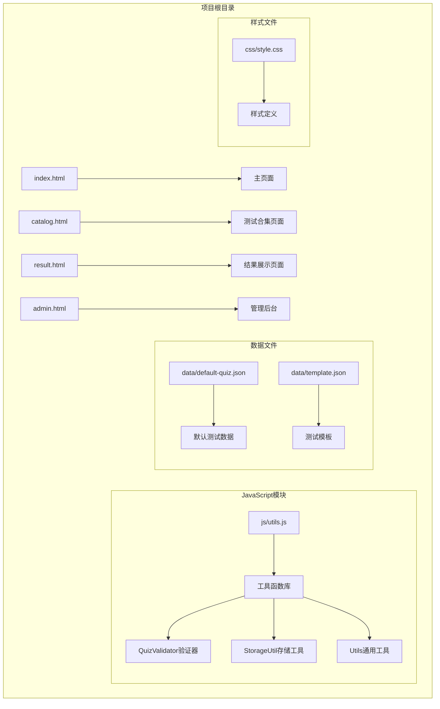
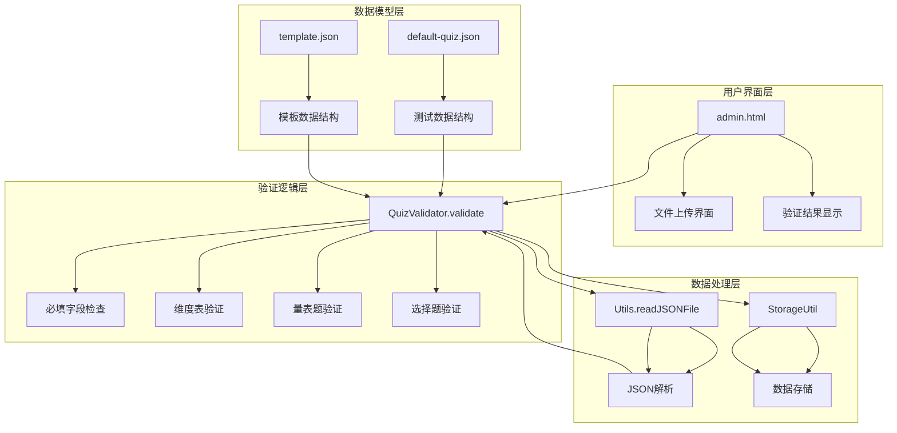
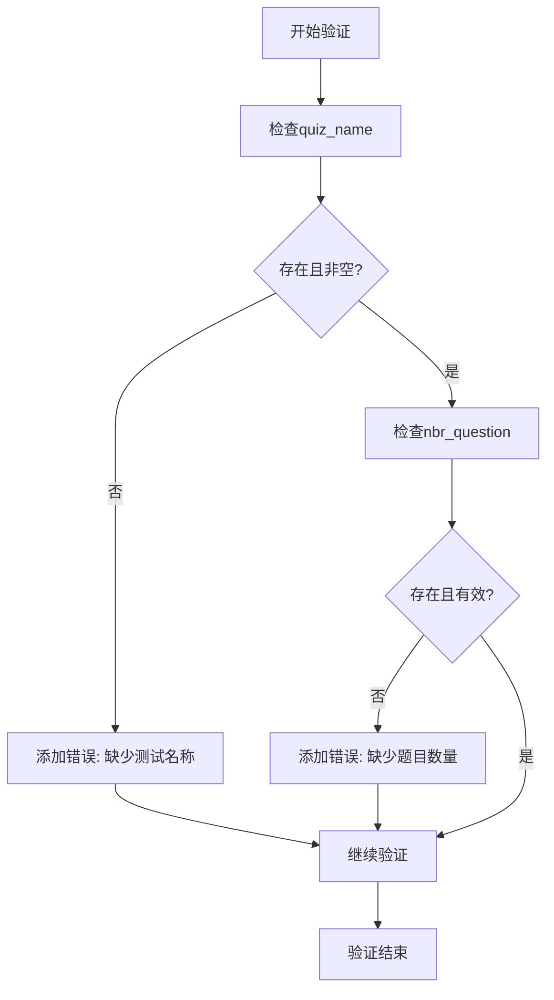
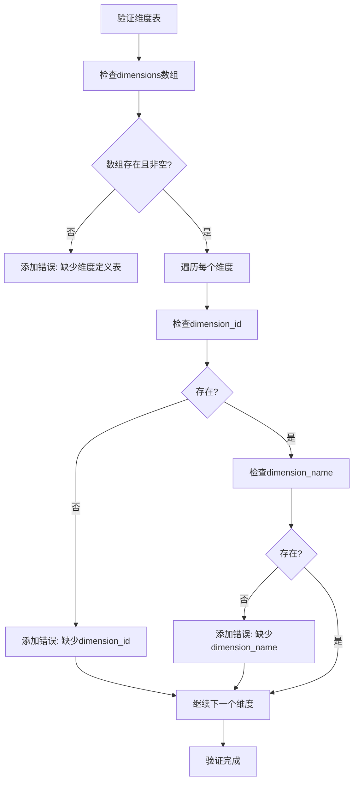
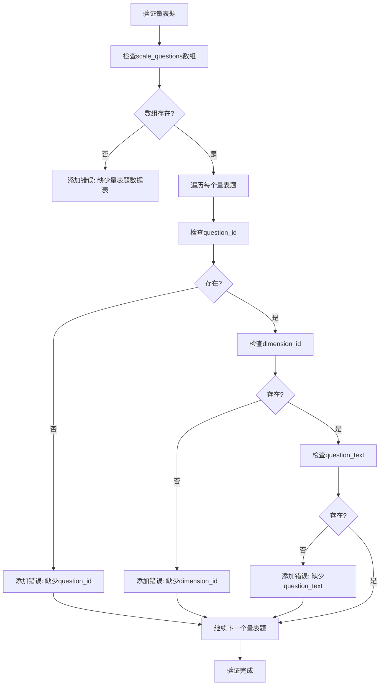
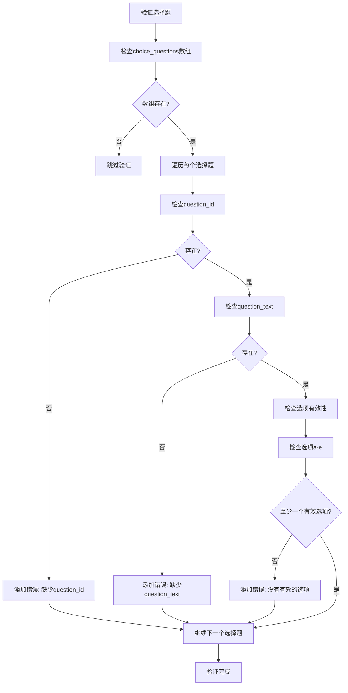
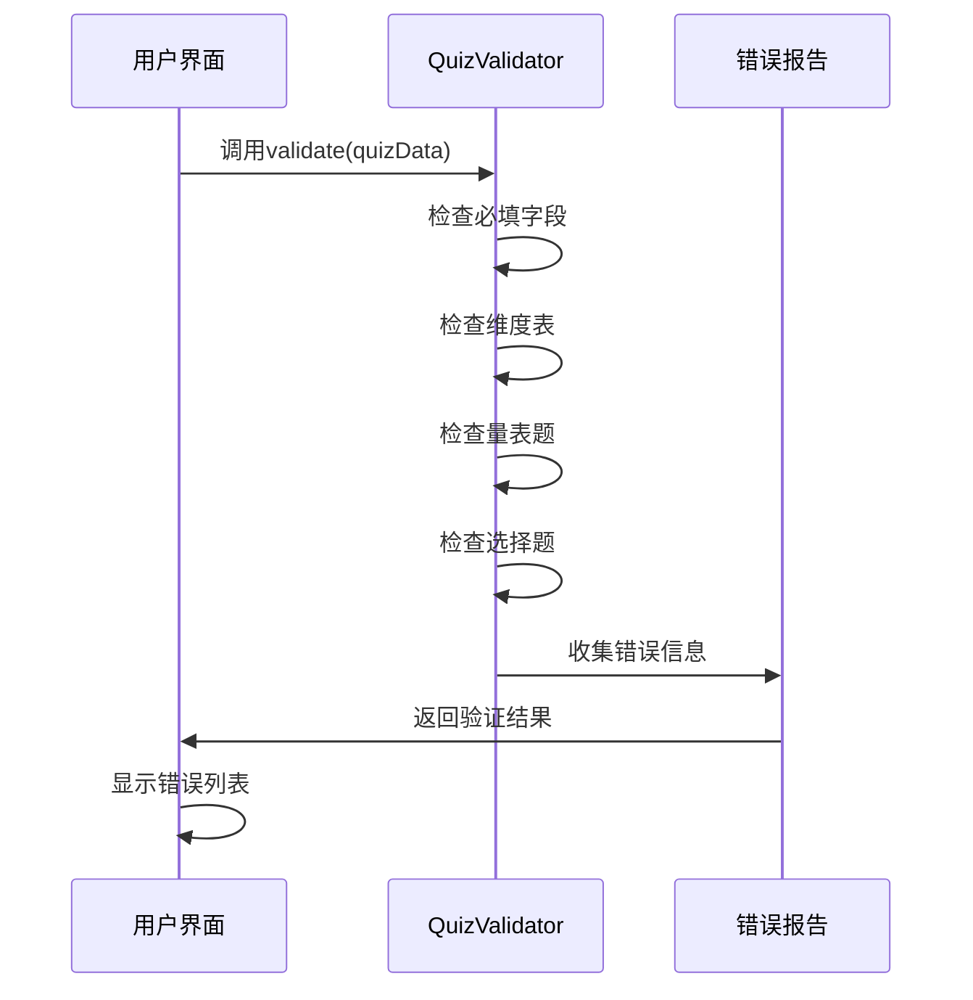
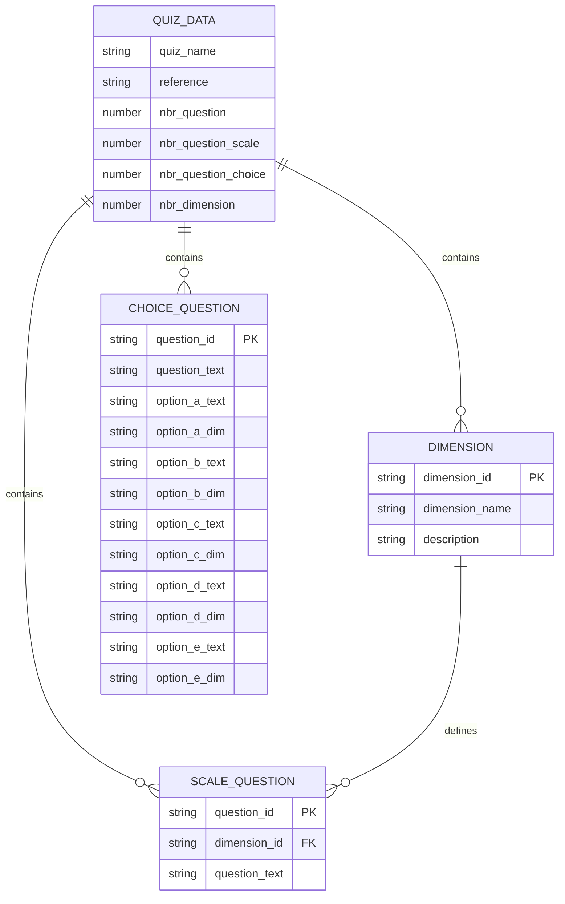
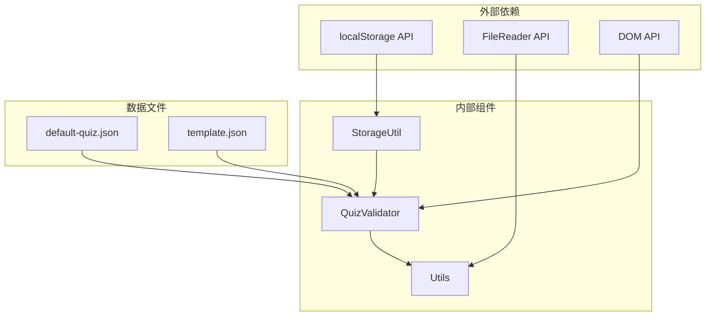

# 数据验证系统

<cite>
**本文档引用的文件**
- [js/utils.js](file://js/utils.js)
- [admin.html](file://admin.html)
- [data/default-quiz.json](file://data/default-quiz.json)
- [data/template.json](file://data/template.json)
- [css/style.css](file://css/style.css)
</cite>

## 更新摘要
**变更内容**
- 全新实现的数据验证系统，包含完整的 QuizValidator 类
- 实现 JSON 文件验证和题目格式校验功能
- 添加错误收集和报告机制
- 集成到管理后台的文件上传流程
- 提供详细的错误信息和用户反馈
- 支持异步文件读取和验证处理

## 目录
1. [简介](#简介)
2. [项目结构](#项目结构)
3. [核心组件](#核心组件)
4. [架构概览](#架构概览)
5. [详细组件分析](#详细组件分析)
6. [依赖关系分析](#依赖关系分析)
7. [性能考虑](#性能考虑)
8. [故障排除指南](#故障排除指南)
9. [结论](#结论)

## 简介

心理测试 v2 项目的数据验证系统是一个专门为心理测试题库设计的验证框架，主要负责确保测试数据的完整性和一致性。该系统的核心组件是 `QuizValidator` 类，它提供了完整的数据验证机制，包括必填字段验证、维度定义表验证、量表题验证和选择题验证等功能。

该验证系统采用模块化设计，与前端界面紧密集成，为管理员提供了直观的验证反馈机制。系统支持 JSON 格式的测试数据验证，能够检测数据类型错误和业务规则违规，并提供详细的错误信息给用户。

**更新** 新增了完整的数据验证系统，包括 QuizValidator 类和相关的错误处理机制，实现了从文件上传到验证反馈的完整流程。

## 项目结构

心理测试 v2 项目采用简洁的文件组织结构，主要包含以下关键目录和文件：

**图表来源**
- [admin.html:1-411](file://admin.html#L1-L411)
- [js/utils.js:1-250](file://js/utils.js#L1-L250)

**章节来源**
- [admin.html:1-411](file://admin.html#L1-L411)
- [js/utils.js:1-250](file://js/utils.js#L1-L250)

## 核心组件

### QuizValidator 类

`QuizValidator` 是整个数据验证系统的核心组件，采用静态方法设计模式，提供统一的验证接口。该类实现了完整的测试数据验证逻辑，包括多个层次的验证规则。

#### 主要职责
- 验证测试数据的完整性
- 检查必填字段的存在性
- 验证数据结构的正确性
- 提供详细的错误报告
- 支持异步数据处理

#### 验证流程
验证过程采用分层检查策略，按照数据完整性的重要性依次进行验证：

1. **基础字段验证**：检查测试名称和题目数量等核心字段
2. **维度定义验证**：验证维度表的结构和内容
3. **量表题验证**：检查量表题的完整性和有效性
4. **选择题验证**：验证选择题的选项配置

**章节来源**
- [js/utils.js:55-126](file://js/utils.js#L55-L126)

### StorageUtil 存储工具类

`StorageUtil` 提供了本地存储操作的封装，支持数据的持久化存储和检索。该类使用 localStorage API，为测试数据的临时存储和长期保存提供了统一接口。

#### 主要功能
- 数据序列化和反序列化
- 错误处理和异常捕获
- 清除和重置操作
- 进度状态管理

**章节来源**
- [js/utils.js:17-50](file://js/utils.js#L17-L50)

### Utils 通用工具类

`Utils` 提供了一系列通用的辅助函数，包括文件处理、UI 操作和数据格式化等功能。这些工具函数为验证系统的其他组件提供了必要的支持。

#### 关键功能
- JSON 文件读取和解析
- 防抖函数实现
- UI 配置应用
- 数据格式化

**章节来源**
- [js/utils.js:131-202](file://js/utils.js#L131-L202)

## 架构概览

数据验证系统的整体架构采用分层设计，各组件之间通过清晰的接口进行交互：

**图表来源**
- [admin.html:252-291](file://admin.html#L252-L291)
- [js/utils.js:55-126](file://js/utils.js#L55-L126)
- [js/utils.js:165-179](file://js/utils.js#L165-L179)

系统采用事件驱动的架构模式，用户通过文件上传触发验证流程，验证结果通过 DOM 操作实时反馈给用户。

**章节来源**
- [admin.html:252-291](file://admin.html#L252-L291)
- [js/utils.js:55-126](file://js/utils.js#L55-L126)

## 详细组件分析

### QuizValidator 验证规则详解

#### 必填字段验证
系统首先检查测试数据的基本信息是否完整：

**图表来源**
- [js/utils.js:59-65](file://js/utils.js#L59-L65)

#### 维度定义表验证
维度表验证确保每个维度都有完整的标识信息：

**图表来源**
- [js/utils.js:67-79](file://js/utils.js#L67-L79)

#### 量表题验证
量表题验证确保每道题都有完整的必要信息：

**图表来源**
- [js/utils.js:81-96](file://js/utils.js#L81-L96)

#### 选择题验证
选择题验证采用更灵活的检查机制，确保至少有一个有效的选项：

**图表来源**
- [js/utils.js:98-119](file://js/utils.js#L98-L119)

### 错误收集和报告机制

系统采用集中式的错误收集机制，将所有验证错误存储在一个数组中，然后统一返回给调用者：

**图表来源**
- [js/utils.js:55-126](file://js/utils.js#L55-L126)
- [admin.html:271-280](file://admin.html#L271-L280)

#### 错误信息格式
系统为每个错误提供清晰的描述信息，包括：
- 字段名称的中文描述
- 具体的错误类型
- 相关的数据位置信息
- 建议的修复方案

**章节来源**
- [js/utils.js:55-126](file://js/utils.js#L55-L126)
- [admin.html:271-280](file://admin.html#L271-L280)

### JSON 数据格式验证

系统支持标准的 JSON 格式测试数据，验证规则基于测试数据的实际结构：

#### 测试数据结构

**图表来源**
- [data/default-quiz.json:1-235](file://data/default-quiz.json#L1-L235)
- [data/template.json:1-49](file://data/template.json#L1-L49)

#### 数据类型检查
系统对关键字段进行严格的数据类型检查：
- `quiz_name`: 必须是非空字符串
- `nbr_question`: 必须是有效的数字
- `dimensions`: 必须是非空数组
- `scale_questions`: 必须是数组类型
- `choice_questions`: 可选数组类型

**章节来源**
- [data/default-quiz.json:1-235](file://data/default-quiz.json#L1-L235)
- [data/template.json:1-49](file://data/template.json#L1-L49)

### 业务规则验证

除了基本的数据完整性检查外，系统还实现了特定的业务规则验证：

#### 维度关联验证
系统确保量表题的 `dimension_id` 必须与维度表中的 `dimension_id` 匹配，防止出现无效的维度引用。

#### 选项完整性验证
对于选择题，系统要求每个选项都必须同时包含文本和维度信息，确保选项的有效性。

**章节来源**
- [js/utils.js:89-91](file://js/utils.js#L89-L91)
- [js/utils.js:110-114](file://js/utils.js#L110-L114)

## 依赖关系分析

数据验证系统的依赖关系相对简单，主要围绕 `QuizValidator` 类展开：

**图表来源**
- [js/utils.js:17-50](file://js/utils.js#L17-L50)
- [js/utils.js:165-179](file://js/utils.js#L165-L179)

### 组件耦合度分析

系统采用了低耦合的设计原则：
- `QuizValidator` 与具体的数据源解耦
- 验证逻辑与用户界面解耦
- 错误处理与业务逻辑分离

这种设计使得验证系统可以独立于具体的实现细节进行测试和维护。

**章节来源**
- [js/utils.js:55-126](file://js/utils.js#L55-L126)
- [admin.html:252-291](file://admin.html#L252-L291)

## 性能考虑

### 验证算法复杂度
- **时间复杂度**: O(n + m + k)，其中 n 是维度数量，m 是量表题数量，k 是选择题数量
- **空间复杂度**: O(e)，其中 e 是发现的错误数量

### 性能优化建议
1. **早期退出**: 发现错误时立即停止不必要的检查
2. **批量验证**: 对大量数据进行分批处理
3. **缓存机制**: 对重复验证的结果进行缓存
4. **异步处理**: 对大型文件验证使用异步处理避免阻塞

## 故障排除指南

### 常见验证错误及解决方案

#### JSON 解析错误
**问题**: 文件格式错误，无法解析为 JSON
**原因**: 文件不是有效的 JSON 格式
**解决方案**: 使用提供的模板文件作为参考，确保正确的 JSON 语法

#### 字段缺失错误
**问题**: 缺少必需的字段
**解决步骤**:
1. 检查模板文件中的字段定义
2. 确保所有必需字段都已填写
3. 验证字段名称拼写正确

#### 数据类型错误
**问题**: 字段类型不符合要求
**解决步骤**:
1. 检查数值字段是否为有效数字
2. 确保字符串字段不为空
3. 验证数组字段的结构正确

#### 维度引用错误
**问题**: 量表题引用了不存在的维度
**解决步骤**:
1. 检查维度表中的 `dimension_id`
2. 确保量表题中的 `dimension_id` 与维度表匹配
3. 验证维度 ID 的唯一性和正确性

**章节来源**
- [admin.html:283-290](file://admin.html#L283-L290)
- [js/utils.js:165-179](file://js/utils.js#L165-L179)

### 调试技巧

1. **逐步验证**: 逐个注释掉验证规则来定位问题
2. **日志记录**: 在开发环境中启用详细的错误日志
3. **单元测试**: 为验证规则编写单元测试
4. **边界测试**: 测试极端情况和边界条件

## 结论

心理测试 v2 项目的数据验证系统设计合理，实现了完整的测试数据验证功能。系统的主要优势包括：

### 设计优点
- **模块化设计**: 组件职责明确，易于维护和扩展
- **用户友好**: 提供详细的错误信息和直观的反馈
- **灵活性**: 支持可选的选择题验证
- **可扩展性**: 为未来的功能扩展预留了接口

### 技术特点
- **静态验证**: 无需服务器端处理，客户端即可完成验证
- **实时反馈**: 用户上传文件后立即得到验证结果
- **错误聚合**: 将所有错误一次性报告，提高效率
- **模板支持**: 提供标准模板文件，降低使用门槛

### 改进建议
1. **增强错误分类**: 将错误分为不同严重级别
2. **添加国际化支持**: 支持多语言错误信息
3. **实现增量验证**: 支持部分字段的即时验证
4. **增加性能监控**: 添加验证性能指标

该验证系统为心理测试项目的稳定运行提供了重要保障，其设计思路和实现方式可以为类似的数据验证需求提供有价值的参考。

**更新** 新增的数据验证系统为项目提供了强大的数据质量保证机制，确保测试数据的准确性和完整性，为用户提供了良好的使用体验。系统通过完整的文件上传处理流程，实现了从数据输入到验证反馈的完整闭环，大大提升了用户体验和数据管理效率。