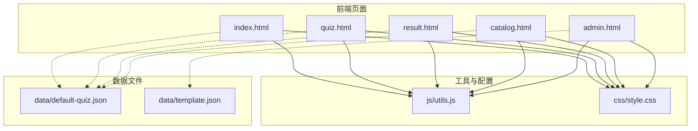
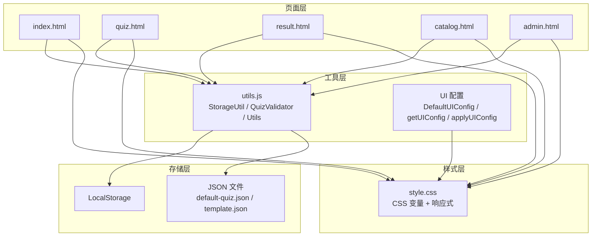
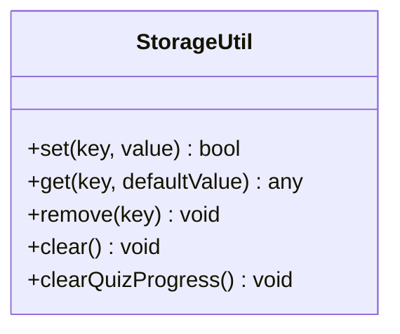
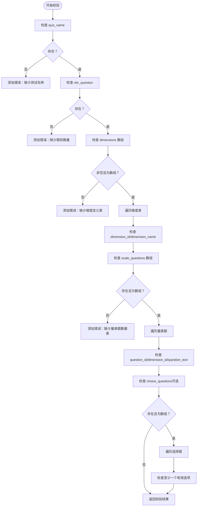
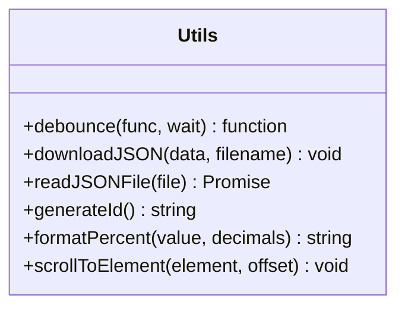
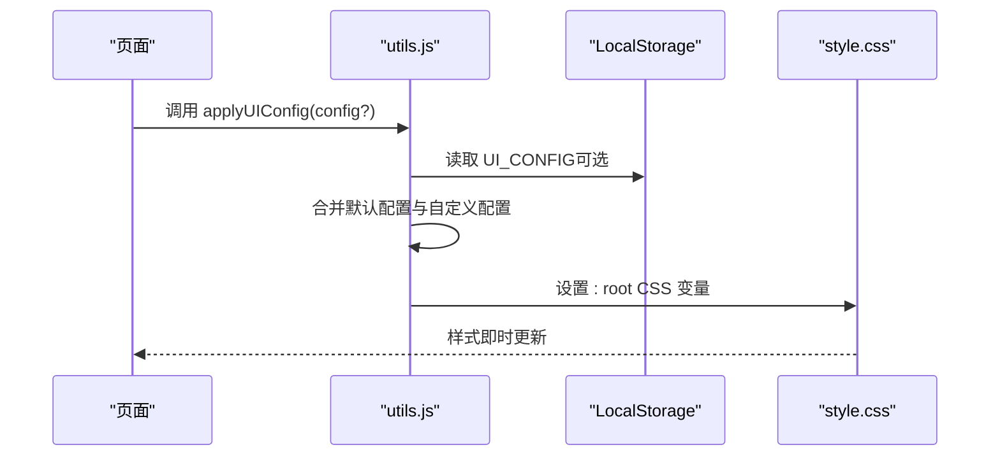
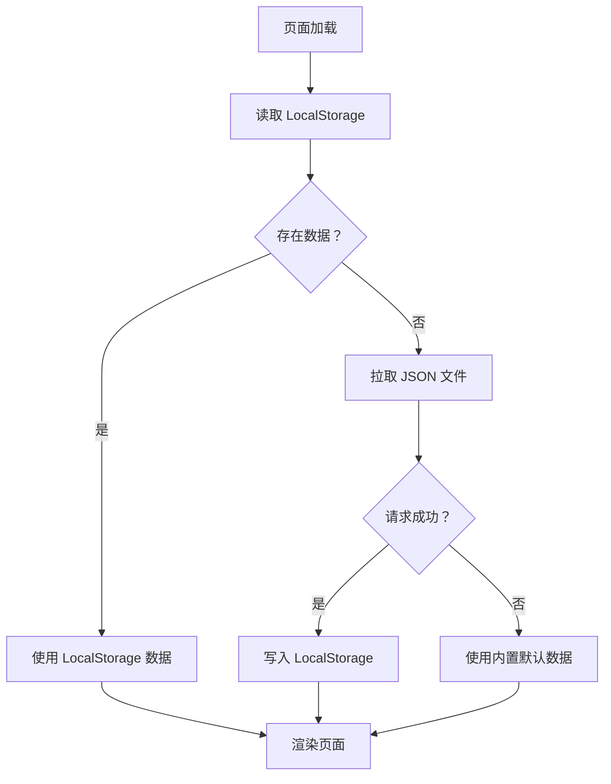
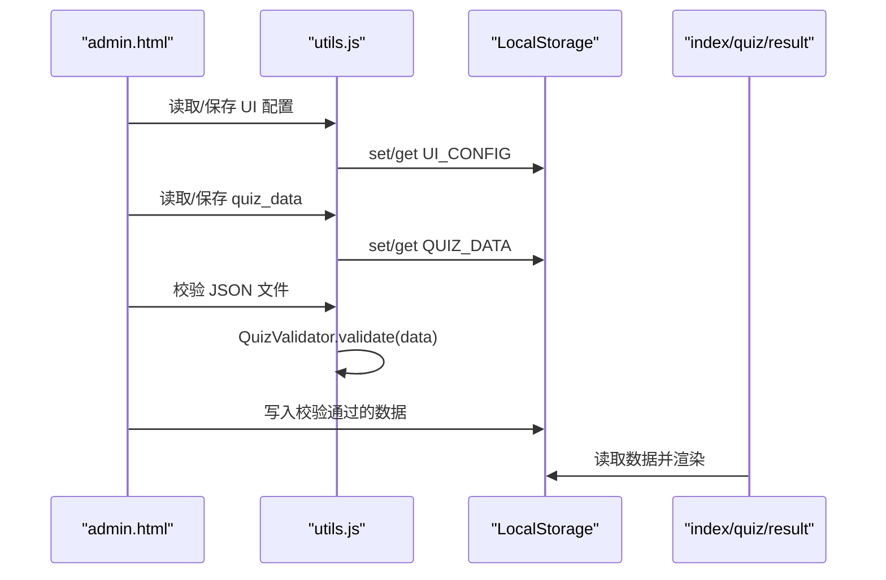
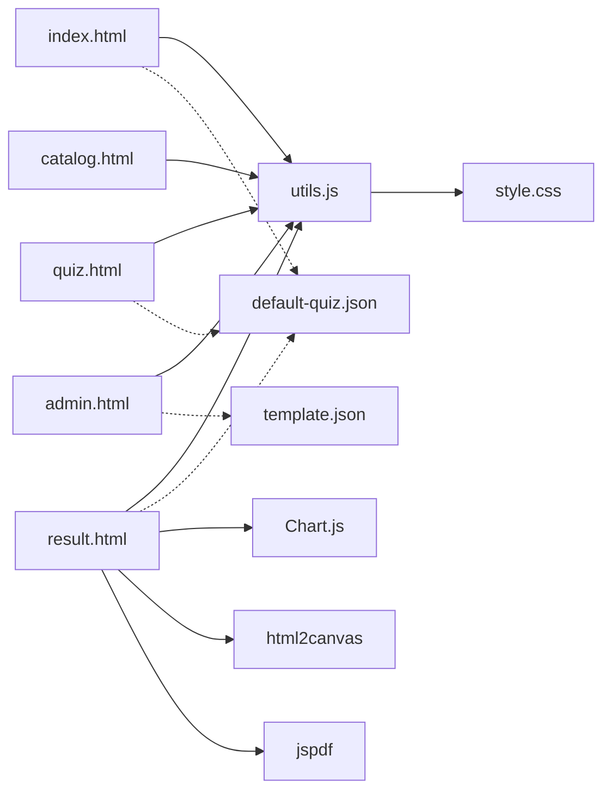
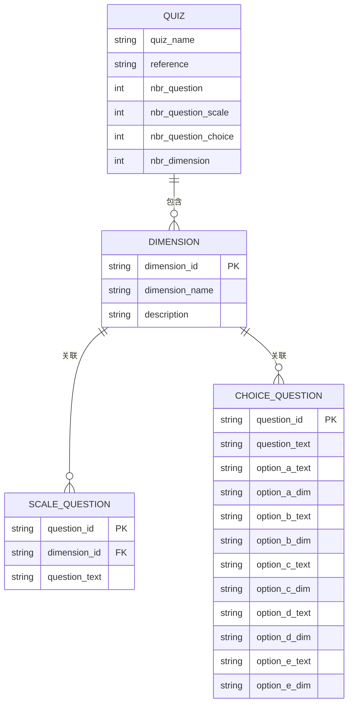

# 核心组件设计

<cite>
**本文档引用的文件**
- [js/utils.js](file://js/utils.js)
- [css/style.css](file://css/style.css)
- [data/default-quiz.json](file://data/default-quiz.json)
- [data/template.json](file://data/template.json)
- [index.html](file://index.html)
- [quiz.html](file://quiz.html)
- [result.html](file://result.html)
- [catalog.html](file://catalog.html)
- [admin.html](file://admin.html)
</cite>

## 目录
1. [简介](#简介)
2. [项目结构](#项目结构)
3. [核心组件](#核心组件)
4. [架构总览](#架构总览)
5. [详细组件分析](#详细组件分析)
6. [依赖关系分析](#依赖关系分析)
7. [性能考量](#性能考量)
8. [故障排除指南](#故障排除指南)
9. [结论](#结论)
10. [附录](#附录)

## 简介
本设计文档聚焦于心理测试 v2 项目的核心组件，重点阐述工具库（StorageUtil、QuizValidator、Utils）、UI 配置系统、数据存储层与组件间通信机制。文档旨在帮助开发者理解现有实现、掌握数据持久化策略、掌握主题定制与样式动态应用机制，并提供组件复用与扩展建议，以便维护与演进现有系统。

## 项目结构
项目采用页面级组织，核心逻辑集中在 js/utils.js 工具库与各页面 HTML 的脚本中；样式统一由 css/style.css 管理；测试数据以 JSON 文件形式提供，便于本地存储与管理。

**图表来源**
- [index.html:1-154](file://index.html#L1-L154)
- [quiz.html:1-278](file://quiz.html#L1-L278)
- [result.html:1-374](file://result.html#L1-L374)
- [catalog.html:1-105](file://catalog.html#L1-L105)
- [admin.html:1-402](file://admin.html#L1-L402)
- [js/utils.js:1-250](file://js/utils.js#L1-L250)
- [css/style.css:1-731](file://css/style.css#L1-L731)
- [data/default-quiz.json:1-235](file://data/default-quiz.json#L1-L235)
- [data/template.json:1-49](file://data/template.json#L1-L49)

**章节来源**
- [index.html:1-154](file://index.html#L1-L154)
- [quiz.html:1-278](file://quiz.html#L1-L278)
- [result.html:1-374](file://result.html#L1-L374)
- [catalog.html:1-105](file://catalog.html#L1-L105)
- [admin.html:1-402](file://admin.html#L1-L402)
- [js/utils.js:1-250](file://js/utils.js#L1-L250)
- [css/style.css:1-731](file://css/style.css#L1-L731)
- [data/default-quiz.json:1-235](file://data/default-quiz.json#L1-L235)
- [data/template.json:1-49](file://data/template.json#L1-L49)

## 核心组件
- 工具库（StorageUtil、QuizValidator、Utils）：封装 LocalStorage 操作、数据校验、通用工具函数与 UI 配置管理。
- UI 配置系统：基于 CSS 自定义属性与工具函数，支持主题色、字体、圆角、最大宽度等动态切换。
- 数据存储层：以 LocalStorage 为核心，结合 JSON 文件与工具函数实现数据持久化与恢复。
- 组件间通信：通过全局变量与工具函数在页面脚本之间传递数据，实现跨页面状态共享。

**章节来源**
- [js/utils.js:6-250](file://js/utils.js#L6-L250)
- [css/style.css:6-20](file://css/style.css#L6-L20)
- [index.html:84-144](file://index.html#L84-L144)
- [quiz.html:61-117](file://quiz.html#L61-L117)
- [result.html:331-370](file://result.html#L331-L370)
- [admin.html:189-203](file://admin.html#L189-L203)

## 架构总览
系统采用“页面脚本 + 工具库 + 样式表”的轻量架构。页面通过引入工具库实现统一的数据访问、校验与 UI 应用；样式通过 CSS 自定义属性实现主题化与响应式布局；数据通过 LocalStorage 与 JSON 文件实现持久化与备份。

**图表来源**
- [js/utils.js:17-50](file://js/utils.js#L17-L50)
- [js/utils.js:55-126](file://js/utils.js#L55-L126)
- [js/utils.js:131-202](file://js/utils.js#L131-L202)
- [js/utils.js:207-244](file://js/utils.js#L207-L244)
- [css/style.css:6-20](file://css/style.css#L6-L20)
- [index.html:84-144](file://index.html#L84-L144)
- [quiz.html:61-117](file://quiz.html#L61-L117)
- [result.html:331-370](file://result.html#L331-L370)
- [catalog.html:77-95](file://catalog.html#L77-L95)
- [admin.html:189-203](file://admin.html#L189-L203)

## 详细组件分析

### 工具库（StorageUtil、QuizValidator、Utils）

#### StorageUtil（LocalStorage 封装）
- 设计目标：提供安全、统一的 LocalStorage 访问接口，包含键空间划分、错误处理与进度清理能力。
- 关键特性：
  - 键空间：集中定义常量键（如 quiz_data、user_answers、current_question、quiz_config、ui_config），避免硬编码。
  - 安全写入：try/catch 包裹 set/get，异常时记录日志并返回默认值。
  - 进度清理：提供 clearQuizProgress，一键清除用户答题进度。
- 复杂度：O(1) 写入/读取，异常处理开销极低。
- 扩展建议：可增加命名空间隔离、过期时间控制、批量操作等。

**图表来源**
- [js/utils.js:17-50](file://js/utils.js#L17-L50)

**章节来源**
- [js/utils.js:6-50](file://js/utils.js#L6-L50)

#### QuizValidator（题目数据校验）
- 设计目标：对测试数据进行结构与完整性校验，确保量表题、选择题、维度定义满足预期。
- 校验要点：
  - 必填字段：quiz_name、nbr_question、dimensions、scale_questions。
  - 维度表：dimension_id、dimension_name 必填。
  - 量表题：question_id、dimension_id、question_text 必填。
  - 选择题：至少存在一个有效选项（option_x_text 与 option_x_dim 成对出现）。
- 返回结构：valid（布尔）+ errors（数组）。
- 复杂度：O(N) 遍历各集合，N 为题目与维度数量之和。

**图表来源**
- [js/utils.js:55-126](file://js/utils.js#L55-L126)

**章节来源**
- [js/utils.js:55-126](file://js/utils.js#L55-L126)

#### Utils（通用工具函数）
- 防抖：debounce(func, wait)，用于高频事件节流。
- 下载 JSON：downloadJSON(data, filename)，生成 Blob 并触发下载。
- 读取 JSON 文件：readJSONFile(file) 返回 Promise，封装 FileReader。
- 唯一 ID：generateId() 基于时间戳与随机数生成。
- 百分比格式化：formatPercent(value, decimals)。
- 平滑滚动：scrollToElement(element, offset)。

**图表来源**
- [js/utils.js:131-202](file://js/utils.js#L131-L202)

**章节来源**
- [js/utils.js:131-202](file://js/utils.js#L131-L202)

### UI 配置系统
- 设计思路：通过 CSS 自定义属性实现主题化，工具函数负责读取与应用配置。
- 默认配置：DefaultUIConfig 定义主题色、字体、圆角、最大宽度等。
- 配置读取：getUIConfig 合并默认配置与用户自定义配置（LocalStorage）。
- 应用机制：applyUIConfig 将配置映射为 CSS 变量，作用于 :root，从而影响全局样式。
- 动态应用：管理后台支持实时预览与保存应用，实现即时主题切换。

**图表来源**
- [js/utils.js:207-244](file://js/utils.js#L207-L244)
- [css/style.css:6-20](file://css/style.css#L6-L20)
- [admin.html:294-335](file://admin.html#L294-L335)

**章节来源**
- [js/utils.js:207-244](file://js/utils.js#L207-L244)
- [css/style.css:6-20](file://css/style.css#L6-L20)
- [admin.html:294-335](file://admin.html#L294-L335)

### 数据存储层设计
- 存储介质：LocalStorage 作为持久化载体，JSON 文件作为默认与模板数据源。
- 键空间：StorageKeys 划分 quiz_data、user_answers、current_question、quiz_config、ui_config。
- 数据流程：
  - 首次加载：优先读取 LocalStorage；若为空则拉取 JSON 文件并回写。
  - 答题进度：保存 user_answers 与 current_question，支持断点续答。
  - UI 配置：保存 ui_config，重启后自动应用。
- 备份与回退：若网络或文件读取失败，使用内置默认数据兜底。

**图表来源**
- [index.html:84-144](file://index.html#L84-L144)
- [quiz.html:61-117](file://quiz.html#L61-L117)
- [result.html:331-370](file://result.html#L331-L370)
- [catalog.html:77-95](file://catalog.html#L77-L95)
- [admin.html:189-203](file://admin.html#L189-L203)

**章节来源**
- [index.html:84-144](file://index.html#L84-L144)
- [quiz.html:61-117](file://quiz.html#L61-L117)
- [result.html:331-370](file://result.html#L331-L370)
- [catalog.html:77-95](file://catalog.html#L77-L95)
- [admin.html:189-203](file://admin.html#L189-L203)

### 组件间通信与数据传递
- 页面内通信：各页面脚本通过全局变量（如 quizData、allQuestions、answers）在函数间传递数据。
- 跨页面通信：通过 StorageUtil 在 LocalStorage 中共享 quiz_data、user_answers、current_question 等状态。
- 管理后台与页面联动：admin.html 通过 Utils 与 QuizValidator 对 JSON 文件进行校验与应用，随后在其他页面生效。

**图表来源**
- [admin.html:253-291](file://admin.html#L253-L291)
- [js/utils.js:55-126](file://js/utils.js#L55-L126)
- [index.html:84-144](file://index.html#L84-L144)
- [quiz.html:61-117](file://quiz.html#L61-L117)
- [result.html:331-370](file://result.html#L331-L370)

**章节来源**
- [admin.html:253-291](file://admin.html#L253-L291)
- [js/utils.js:55-126](file://js/utils.js#L55-L126)
- [index.html:84-144](file://index.html#L84-L144)
- [quiz.html:61-117](file://quiz.html#L61-L117)
- [result.html:331-370](file://result.html#L331-L370)

## 依赖关系分析
- 页面对工具库的依赖：所有页面均引入 utils.js，依赖其提供的 StorageUtil、QuizValidator、Utils 与 UI 配置函数。
- 工具库对样式的依赖：applyUIConfig 依赖 style.css 中的 CSS 变量定义。
- 数据依赖：页面依赖 JSON 文件与 LocalStorage；管理后台依赖 Utils 与 QuizValidator 进行数据校验。
- 外部库：结果页使用 Chart.js、html2canvas、jspdf 进行可视化与导出。

**图表来源**
- [index.html:68-151](file://index.html#L68-L151)
- [quiz.html:49-275](file://quiz.html#L49-L275)
- [result.html:8-11](file://result.html#L8-L11)
- [catalog.html:74-102](file://catalog.html#L74-L102)
- [admin.html:171-399](file://admin.html#L171-L399)
- [js/utils.js:1-250](file://js/utils.js#L1-L250)
- [css/style.css:1-731](file://css/style.css#L1-L731)
- [data/default-quiz.json:1-235](file://data/default-quiz.json#L1-L235)
- [data/template.json:1-49](file://data/template.json#L1-L49)

**章节来源**
- [index.html:68-151](file://index.html#L68-L151)
- [quiz.html:49-275](file://quiz.html#L49-L275)
- [result.html:8-11](file://result.html#L8-L11)
- [catalog.html:74-102](file://catalog.html#L74-L102)
- [admin.html:171-399](file://admin.html#L171-L399)
- [js/utils.js:1-250](file://js/utils.js#L1-L250)
- [css/style.css:1-731](file://css/style.css#L1-L731)
- [data/default-quiz.json:1-235](file://data/default-quiz.json#L1-L235)
- [data/template.json:1-49](file://data/template.json#L1-L49)

## 性能考量
- 防抖与节流：使用 Utils.debounce 降低高频事件（如窗口尺寸变化）的处理频率。
- 懒加载与缓存：页面首次加载时优先使用 LocalStorage，减少网络请求；必要时再回退到 JSON 文件。
- DOM 操作最小化：批量更新 DOM（如渲染题目、更新进度），避免频繁重排。
- 图表渲染：结果页仅在需要时初始化 Chart.js 实例，避免不必要的资源消耗。
- 样式应用：通过 CSS 变量一次性应用主题，避免逐元素修改样式带来的性能损耗。

[本节为通用性能建议，无需特定文件引用]

## 故障排除指南
- LocalStorage 异常：
  - 现象：set/get 返回默认值或抛错。
  - 排查：确认浏览器隐私模式、存储配额限制、跨域问题。
  - 处理：工具库已包含 try/catch，可在控制台查看错误日志。
- JSON 文件加载失败：
  - 现象：页面提示加载失败，使用内置默认数据。
  - 排查：检查文件路径、服务器响应状态、CORS 设置。
  - 处理：确保 data/default-quiz.json 可访问；必要时使用内置默认数据。
- 题目数据校验失败：
  - 现象：管理后台显示错误列表。
  - 排查：对照 QuizValidator 规则逐项检查字段缺失或格式错误。
  - 处理：根据错误提示修正 JSON 文件后重新上传。
- UI 配置不生效：
  - 现象：更改主题后页面未更新。
  - 排查：确认 applyUIConfig 是否调用、CSS 变量是否正确设置。
  - 处理：手动调用 applyUIConfig 或刷新页面。

**章节来源**
- [js/utils.js:18-50](file://js/utils.js#L18-L50)
- [index.html:84-144](file://index.html#L84-L144)
- [quiz.html:61-117](file://quiz.html#L61-L117)
- [result.html:331-370](file://result.html#L331-L370)
- [admin.html:253-291](file://admin.html#L253-L291)

## 结论
心理测试 v2 项目通过简洁的工具库与统一的 UI 配置系统，实现了主题化与数据持久化的良好平衡。工具库提供了安全可靠的 LocalStorage 访问、严谨的数据校验与实用的通用工具；UI 配置系统以 CSS 变量为核心，实现了快速的主题切换与样式动态应用。页面间通过 LocalStorage 实现状态共享，配合 JSON 文件提供默认数据与模板，具备良好的可维护性与扩展性。建议在后续迭代中增强工具库的命名空间隔离与过期控制、完善管理后台的文字配置预览与应用机制，并考虑引入模块化打包以提升可维护性。

[本节为总结性内容，无需特定文件引用]

## 附录
- 数据模型概览（来自 JSON 文件）
  - 测试元信息：quiz_name、reference、nbr_question、nbr_question_scale、nbr_question_choice、nbr_dimension。
  - 维度定义：dimensions（dimension_id、dimension_name、description）。
  - 量表题：scale_questions（question_id、dimension_id、question_text）。
  - 选择题：choice_questions（question_id、question_text、option_a_text/option_a_dim 至 option_e_text/option_e_dim）。

**图表来源**
- [data/default-quiz.json:1-235](file://data/default-quiz.json#L1-L235)
- [data/template.json:1-49](file://data/template.json#L1-L49)

**章节来源**
- [data/default-quiz.json:1-235](file://data/default-quiz.json#L1-L235)
- [data/template.json:1-49](file://data/template.json#L1-L49)