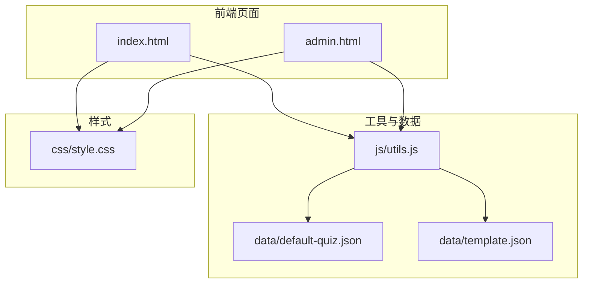
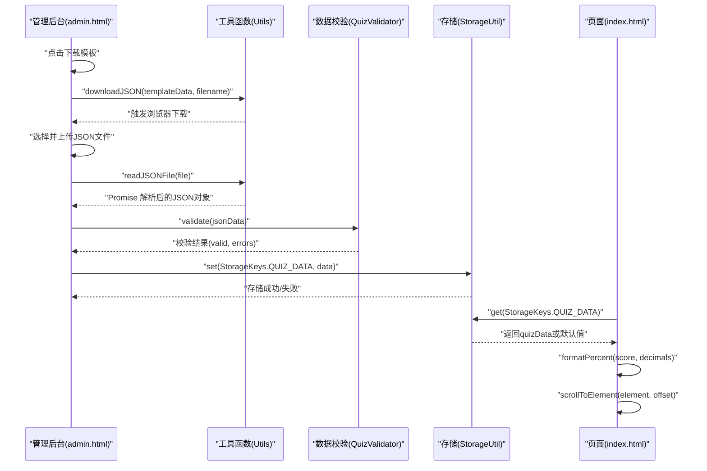
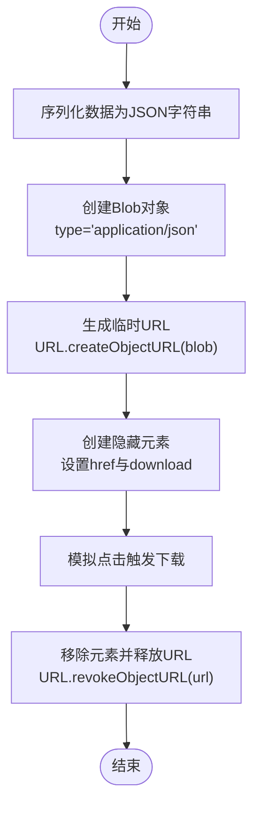
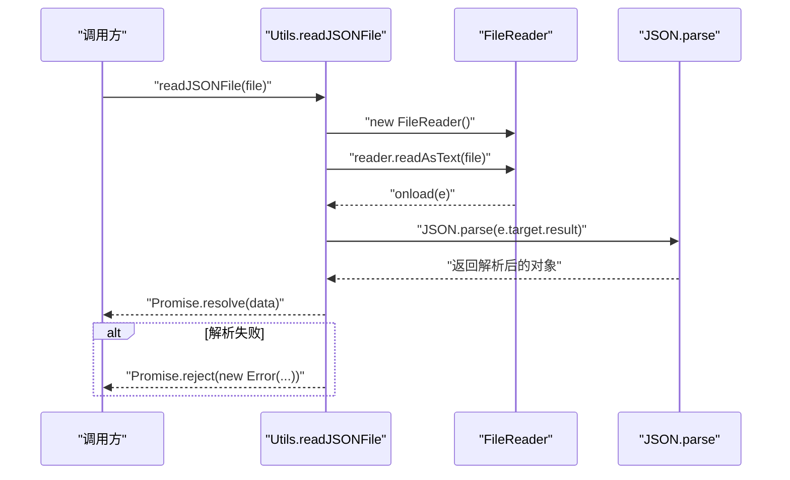
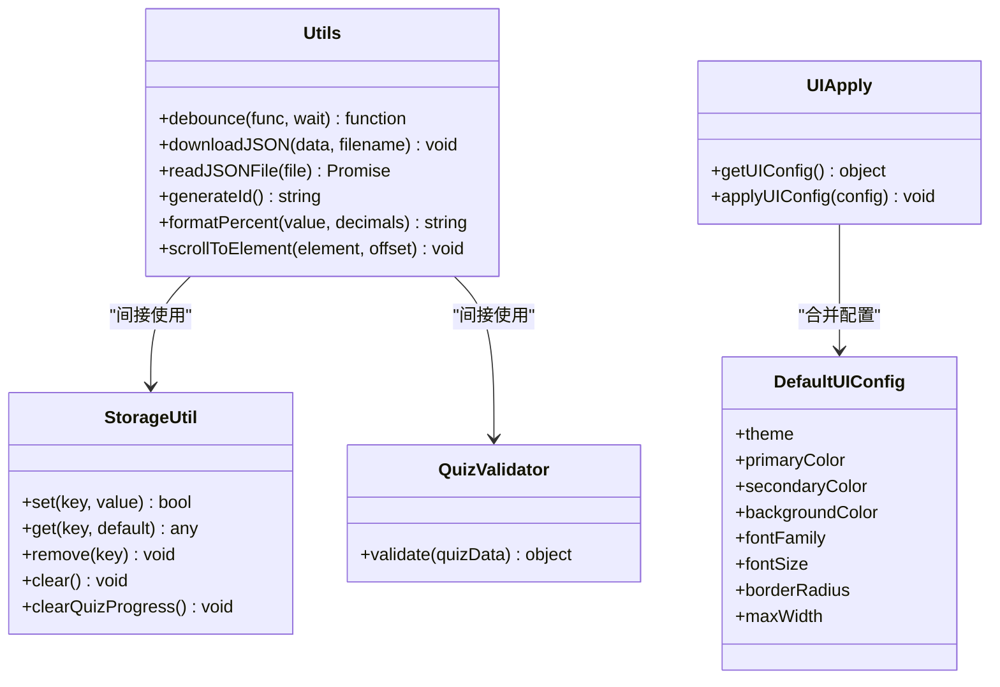

# 通用工具函数

<cite>
**本文引用的文件**
- [js/utils.js](file://程序/js/utils.js)
- [index.html](file://程序/index.html)
- [admin.html](file://程序/admin.html)
- [css/style.css](file://程序/css/style.css)
- [data/default-quiz.json](file://程序/data/default-quiz.json)
- [data/template.json](file://程序/data/template.json)
</cite>

## 更新摘要
**变更内容**
- 新增完整的工具函数库，包含LocalStorage操作、数据验证、通用工具函数
- 增强了UI配置系统，支持主题色、字体、圆角等多维度配置管理
- 新增防抖函数、JSON文件下载、文件读取等实用工具
- 完善了数据验证器功能，支持更严格的测试数据校验
- 改进了错误处理机制，提供更好的用户体验

## 目录
1. [简介](#简介)
2. [项目结构](#项目结构)
3. [核心组件](#核心组件)
4. [架构总览](#架构总览)
5. [详细组件分析](#详细组件分析)
6. [依赖关系分析](#依赖关系分析)
7. [性能考量](#性能考量)
8. [故障排查指南](#故障排查指南)
9. [结论](#结论)
10. [附录](#附录)

## 简介
本设计文档聚焦于心理测试 v2 项目中的通用工具函数与相关基础设施，重点围绕以下方面展开：
- Utils 对象中各工具函数的设计原理与实现方式
- 防抖函数的节流机制与典型应用场景
- JSON 文件下载功能的实现细节（Blob 对象创建与下载触发机制）
- 文件读取功能（readJSONFile）的异步处理与错误处理策略
- 唯一ID生成算法、百分比格式化工具与元素滚动功能的实现要点
- 增强的数据验证器功能，支持更严格的测试数据校验
- 改进的LocalStorage操作，提供更好的错误处理和数据完整性保护
- 完整的UI配置系统，支持主题定制和样式持久化
- 实际使用示例与最佳实践，帮助开发者在项目中高效、安全地使用这些通用工具

## 项目结构
该项目采用"前端静态站点 + 本地数据文件"的轻量级架构，核心逻辑集中在 js/utils.js 中，配合 HTML 页面与 CSS 样式实现完整的交互体验。关键文件与职责如下：
- js/utils.js：工具函数库（Utils）、存储工具（StorageUtil）、数据校验（QuizValidator）、UI 配置与应用函数
- index.html：首页，负责加载测试数据并渲染维度预览
- admin.html：管理后台，负责下载模板、上传并校验题目文件、应用 UI 配置
- data/default-quiz.json：默认测试数据
- data/template.json：题目模板
- css/style.css：全局样式与主题变量

**图表来源**
- [js/utils.js:1-250](file://程序/js/utils.js#L1-L250)
- [index.html:1-518](file://程序/index.html#L1-L518)
- [admin.html:1-411](file://程序/admin.html#L1-L411)
- [css/style.css:1-702](file://程序/css/style.css#L1-L702)

**章节来源**
- [js/utils.js:1-250](file://程序/js/utils.js#L1-L250)
- [index.html:1-518](file://程序/index.html#L1-L518)
- [admin.html:1-411](file://程序/admin.html#L1-L411)
- [css/style.css:1-702](file://程序/css/style.css#L1-L702)

## 核心组件
本项目的核心工具组件由以下部分构成：
- 存储工具（StorageUtil）：封装 localStorage 的增删改查与进度清理，提供完整的错误处理和数据完整性验证
- 数据校验器（QuizValidator）：对测试数据进行结构与完整性校验，包含增强的选择题选项有效性检查
- 通用工具（Utils）：防抖、JSON 下载、文件读取、唯一ID生成、百分比格式化、元素滚动
- UI 配置系统（DefaultUIConfig、getUIConfig、applyUIConfig）：主题色、字体、圆角、最大宽度等配置的持久化与应用

**章节来源**
- [js/utils.js:17-50](file://程序/js/utils.js#L17-L50)
- [js/utils.js:55-126](file://程序/js/utils.js#L55-L126)
- [js/utils.js:131-202](file://程序/js/utils.js#L131-L202)
- [js/utils.js:207-244](file://程序/js/utils.js#L207-L244)

## 架构总览
工具函数在页面中的调用路径如下：
- 管理后台（admin.html）通过 Utils.downloadJSON 下载模板，通过 Utils.readJSONFile 读取用户上传的 JSON 文件，并交由 QuizValidator.validate 校验
- 首页（index.html）通过 StorageUtil 读取/写入测试数据，结合 Utils.formatPercent 与 Utils.scrollToElement 渲染与交互
- UI 配置通过 getUIConfig 与 applyUIConfig 应用到页面样式变量，支持主题定制和样式持久化

**图表来源**
- [admin.html:243-291](file://程序/admin.html#L243-L291)
- [js/utils.js:131-202](file://程序/js/utils.js#L131-L202)
- [js/utils.js:55-126](file://程序/js/utils.js#L55-L126)
- [index.html:84-154](file://程序/index.html#L84-L154)

## 详细组件分析

### 防抖函数（debounce）
- 设计原理
  - 利用闭包保存定时器句柄，每次调用时先清除旧定时器，再设置新的定时器
  - 在等待时间结束后才真正执行目标函数，且传入最新参数
- 节流机制
  - 该实现并非严格意义上的"节流"，而是"去抖"：在高频事件（如窗口 resize、输入框输入）中，仅在最后一次触发后的等待时间内不再触发，从而避免重复计算或频繁请求
- 典型应用场景
  - 输入框搜索建议、窗口尺寸变化处理、滚动事件优化
- 使用建议
  - 为不同场景选择合适的等待时间（wait），避免过短导致仍频繁触发，过长导致响应迟缓
  - 注意在组件销毁时清理定时器，防止内存泄漏

**章节来源**
- [js/utils.js:135-145](file://程序/js/utils.js#L135-L145)

### JSON 文件下载功能（downloadJSON）
- 实现步骤
  - 将数据序列化为 JSON 字符串，创建 Blob 对象并指定 MIME 类型为 application/json
  - 通过 URL.createObjectURL 生成临时下载链接
  - 创建隐藏的 <a> 元素，设置 href 和 download 属性，模拟点击触发下载
  - 下载完成后移除元素并释放对象 URL
- 关键点
  - Blob 的类型设置为 application/json，确保浏览器正确识别为 JSON 文件
  - 使用 URL.revokeObjectURL 释放内存，避免内存累积
- 最佳实践
  - 为文件名提供有意义的默认值，便于用户识别
  - 在下载前对数据进行必要的格式化与校验，保证输出文件可用

**图表来源**
- [js/utils.js:150-160](file://程序/js/utils.js#L150-L160)

**章节来源**
- [js/utils.js:150-160](file://程序/js/utils.js#L150-L160)
- [admin.html:243-250](file://程序/admin.html#L243-L250)

### 文件读取功能（readJSONFile）
- 异步处理
  - 基于 FileReader 的 onload/onerror 回调，封装为 Promise
  - 成功时解析文本为 JSON，失败时抛出错误
- 错误处理
  - JSON 解析失败时返回明确的错误信息
  - FileReader 读取失败时同样抛出错误
- 使用建议
  - 在调用处使用 try/catch 或 .catch 处理异常
  - 对文件大小与类型进行前置校验，提升用户体验

**图表来源**
- [js/utils.js:165-179](file://程序/js/utils.js#L165-L179)

**章节来源**
- [js/utils.js:165-179](file://程序/js/utils.js#L165-L179)
- [admin.html:252-291](file://程序/admin.html#L252-L291)

### 唯一ID生成算法（generateId）
- 设计原理
  - 基于当前时间戳转为 36 进制与随机数的 36 进制拼接，形成高概率唯一的字符串标识
- 特点
  - 简洁、易用、无需外部依赖
  - 时间前缀具备天然递增性，有利于排序与追踪
- 使用建议
  - 适用于前端临时标识、临时表单键值等场景
  - 若需跨会话持久化，建议结合后端生成或引入更强的唯一性保障

**章节来源**
- [js/utils.js:184-186](file://程序/js/utils.js#L184-L186)

### 百分比格式化工具（formatPercent）
- 设计原理
  - 将数值乘以 100 后按指定小数位数四舍五入并追加百分号
- 使用建议
  - 在结果页展示维度得分、完成进度等场景中统一格式
  - 注意小数位数的取舍，兼顾精度与可读性

**章节来源**
- [js/utils.js:191-193](file://程序/js/utils.js#L191-L193)
- [index.html:118-120](file://程序/index.html#L118-L120)

### 元素滚动功能（scrollToElement）
- 设计原理
  - 计算元素相对视口的位置，减去偏移量后使用 window.scrollTo 并启用平滑滚动
- 使用建议
  - 在动态内容加载后自动滚动到目标区域，提升用户体验
  - 合理设置偏移量以避开固定导航栏遮挡

**章节来源**
- [js/utils.js:198-201](file://程序/js/utils.js#L198-L201)

### 存储工具（StorageUtil）
- 功能概述
  - 提供 set/get/remove/clear 等常用操作，并封装 quiz 进度清理
  - 增强了错误处理机制，所有操作均包裹 try/catch，异常时记录日志并返回默认值或 false
  - 新增数据完整性检查，在读取时验证数据结构的有效性
- 错误处理
  - 所有操作均包裹 try/catch，异常时记录日志并返回默认值或 false
  - 新增 clearQuizProgress 方法专门用于清理用户答题进度
- 使用建议
  - 在读取前检查数据完整性，避免因格式错误导致的异常
  - 清理敏感数据时优先使用 remove/clear
  - 建议在数据读取后进行结构验证，确保数据的完整性和一致性

**章节来源**
- [js/utils.js:17-50](file://程序/js/utils.js#L17-L50)

### 数据校验器（QuizValidator）
- 校验范围
  - 测试名称、题目数量等必填字段
  - 维度定义表的完整性（dimension_id、dimension_name）
  - 量表题与选择题的结构完整性
  - 选择题至少存在一组有效选项
- 增强功能
  - 新增选择题选项的有效性检查，确保每个选项都有对应的文本和维度映射
  - 提供详细的错误信息，包括具体的行号和问题描述
  - 支持可选的选择题数据，不影响整体校验流程
- 返回结构
  - valid：布尔值
  - errors：错误数组，包含所有发现的问题
- 使用建议
  - 在上传文件后立即调用 validate，向用户提供明确的错误提示
  - 对于选择题，建议在模板中提供清晰的字段说明
  - 错误信息包含具体的上下文，便于用户快速定位和修复问题

**章节来源**
- [js/utils.js:55-126](file://程序/js/utils.js#L55-L126)
- [data/template.json:1-49](file://程序/data/template.json#L1-L49)

### UI 配置与应用（DefaultUIConfig、getUIConfig、applyUIConfig）
- 默认配置
  - 主题色、辅助色、背景色、字体、圆角、最大宽度等
  - 新增字体大小配置，支持标题、副标题、正文、小字等不同层级的字体大小
- 获取与应用
  - getUIConfig 合并默认配置与用户自定义配置
  - applyUIConfig 将配置映射为 CSS 变量并应用到根元素
  - 支持实时预览和配置重置功能
- 增强功能
  - 完整的UI配置持久化机制，支持主题定制和样式持久化
  - 新增字体大小配置，提供更精细的排版控制
  - 支持圆角大小的灵活调整
- 使用建议
  - 在页面加载时调用 applyUIConfig，确保样式即时生效
  - 自定义配置持久化到 StorageKeys.UI_CONFIG，避免每次手动设置
  - 使用预览功能实时查看配置效果，确认后再保存应用

**章节来源**
- [js/utils.js:207-244](file://程序/js/utils.js#L207-L244)
- [css/style.css:6-20](file://程序/css/style.css#L6-L20)
- [admin.html:294-335](file://程序/admin.html#L294-L335)

## 依赖关系分析
- Utils 与 StorageUtil/QuizValidator 的耦合度较低，分别承担通用工具与数据校验职责
- 页面通过 Utils 间接依赖浏览器 API（Blob、URL、FileReader、window.scrollTo）
- UI 配置通过 CSS 变量与 applyUIConfig 影响全局样式
- StorageUtil 提供了完整的数据持久化基础设施，支持多种数据类型的存储和检索

**图表来源**
- [js/utils.js:17-50](file://程序/js/utils.js#L17-L50)
- [js/utils.js:55-126](file://程序/js/utils.js#L55-L126)
- [js/utils.js:131-202](file://程序/js/utils.js#L131-L202)
- [js/utils.js:207-244](file://程序/js/utils.js#L207-L244)

**章节来源**
- [js/utils.js:17-244](file://程序/js/utils.js#L17-L244)

## 性能考量
- 防抖（debounce）
  - 合理设置 wait 时间，避免在高频事件中仍产生大量调用
  - 在组件卸载时清理定时器，防止内存泄漏
- JSON 下载
  - 大文件下载时注意 Blob 的内存占用，及时 revokeObjectURL
- 文件读取
  - 对超大文件进行体积限制与类型校验，避免阻塞主线程
- 滚动
  - 平滑滚动在低端设备上可能影响性能，必要时可降级为非平滑滚动
- 数据校验
  - 选择题选项检查采用高效的遍历算法，避免不必要的性能开销
- UI 配置
  - CSS 变量应用采用批量设置，减少 DOM 操作次数

## 故障排查指南
- 本地存储异常
  - 症状：StorageUtil.get/set 抛错或返回默认值
  - 排查：检查浏览器隐私模式、存储配额、序列化/反序列化错误
  - 新增：检查数据完整性，确保读取的数据包含必需的字段结构
- JSON 下载失败
  - 症状：点击下载无响应或文件损坏
  - 排查：确认数据已正确序列化、Blob 类型为 application/json、URL 未被提前释放
- 文件读取失败
  - 症状：readJSONFile 拒绝或报格式错误
  - 排查：确认文件为纯文本 JSON、编码为 UTF-8、无隐藏字符
- UI 配置不生效
  - 症状：更改颜色/字体后页面未更新
  - 排查：确认 applyUIConfig 已调用、CSS 变量名一致、未被覆盖
- 数据校验失败
  - 症状：QuizValidator.validate 返回错误信息
  - 排查：检查 JSON 文件结构、字段完整性、选择题选项的有效性
  - 新增：确认维度 ID 的一致性，确保量表题和选择题的维度映射正确

**章节来源**
- [js/utils.js:17-50](file://程序/js/utils.js#L17-L50)
- [js/utils.js:150-179](file://程序/js/utils.js#L150-L179)
- [js/utils.js:207-244](file://程序/js/utils.js#L207-L244)

## 结论
本项目通过精简而实用的工具函数，实现了数据持久化、文件处理、UI 配置与交互增强等功能。Utils 对象中的各项工具在实际业务中具有高度复用价值，特别是增强的数据验证器和改进的LocalStorage操作，为项目的稳定运行提供了坚实的基础。UI 配置系统的完整实现，使得项目具备了强大的主题定制能力。建议在扩展新功能时遵循现有模式：明确职责边界、统一错误处理、关注性能与兼容性。通过合理使用防抖、Blob 下载、文件读取与滚动等能力，可以显著提升用户体验与开发效率。

## 附录
- 使用示例（路径参考）
  - 下载模板：[admin.html:243-250](file://程序/admin.html#L243-L250)
  - 上传并校验：[admin.html:252-291](file://程序/admin.html#L252-L291)
  - 加载测试数据：[index.html:84-154](file://程序/index.html#L84-L154)
  - 应用 UI 配置：[index.html:157-160](file://程序/index.html#L157-L160)，[admin.html:395-398](file://程序/admin.html#L395-L398)
- 最佳实践
  - 在调用 Utils.downloadJSON 前对数据进行格式化与校验
  - 使用 Utils.debounce 包裹高频事件回调，设置合理的等待时间
  - 在读取文件时提供友好的错误提示与重试机制
  - 通过 StorageUtil.clearQuizProgress 清理用户进度，避免状态污染
  - 使用 QuizValidator.validate 进行完整的数据校验，确保测试数据的准确性
  - 利用 UI 配置系统实现个性化的主题定制，提升用户体验