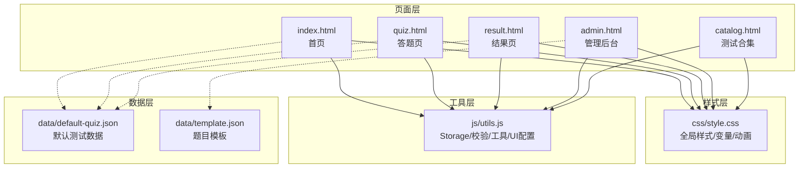
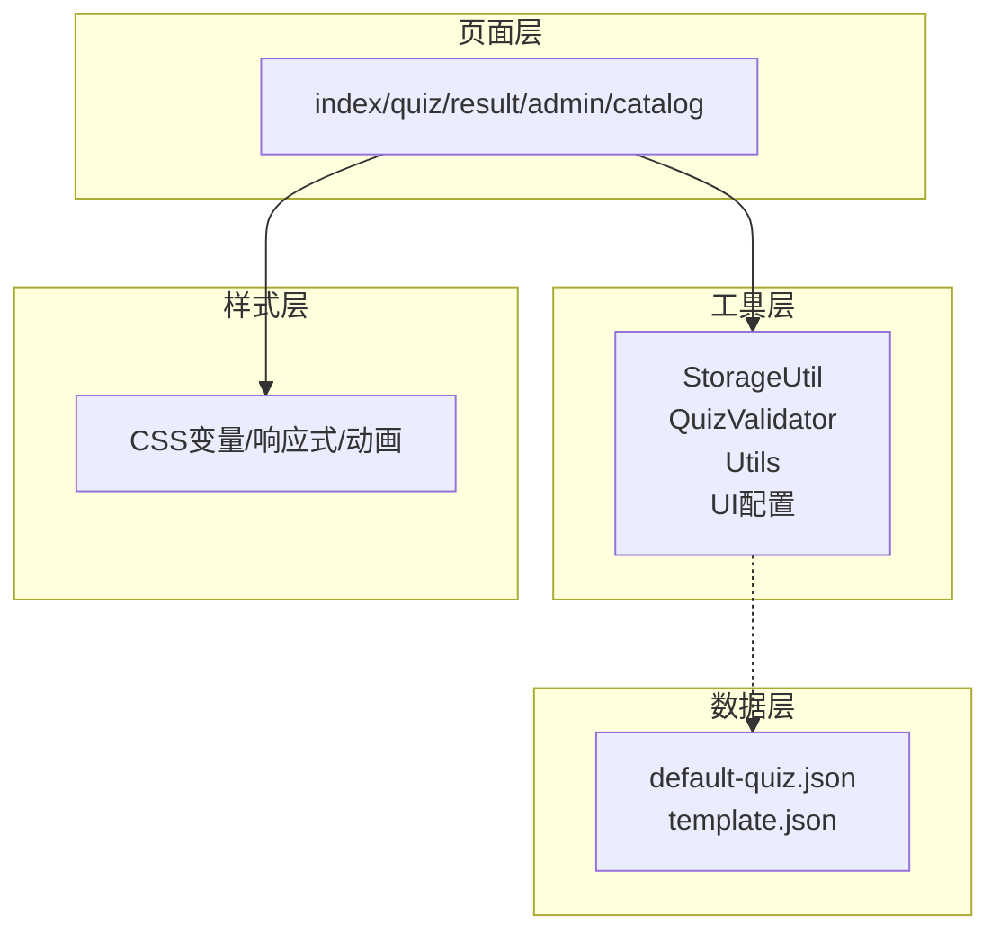
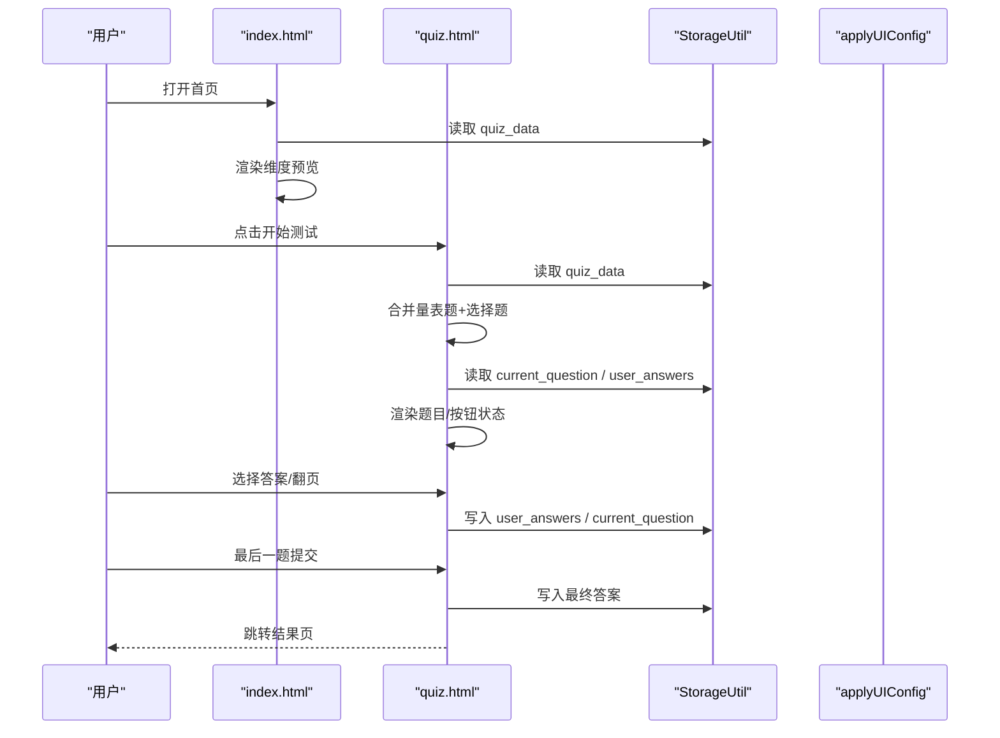
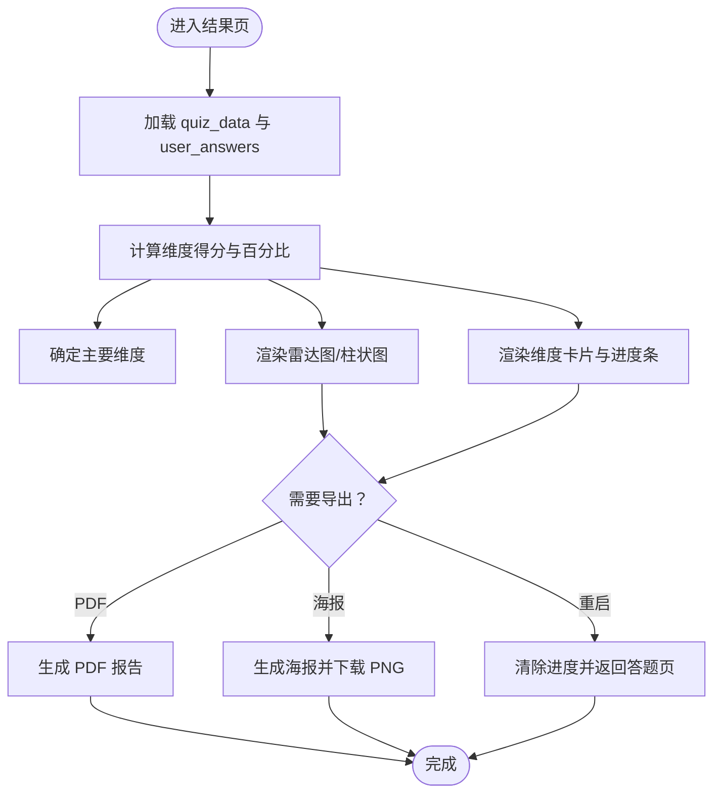
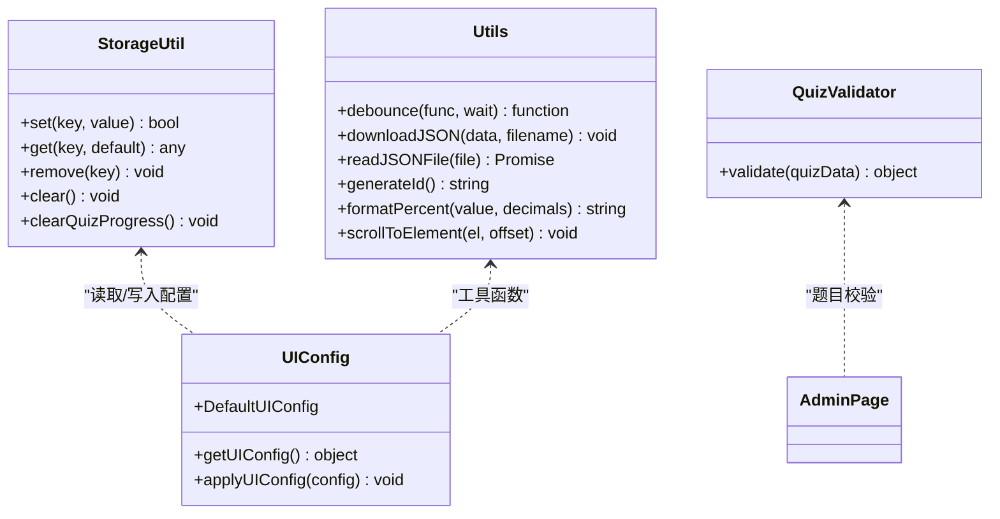
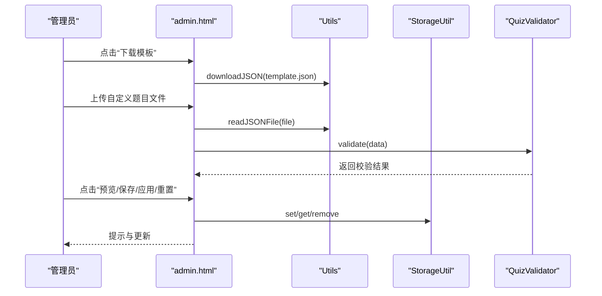
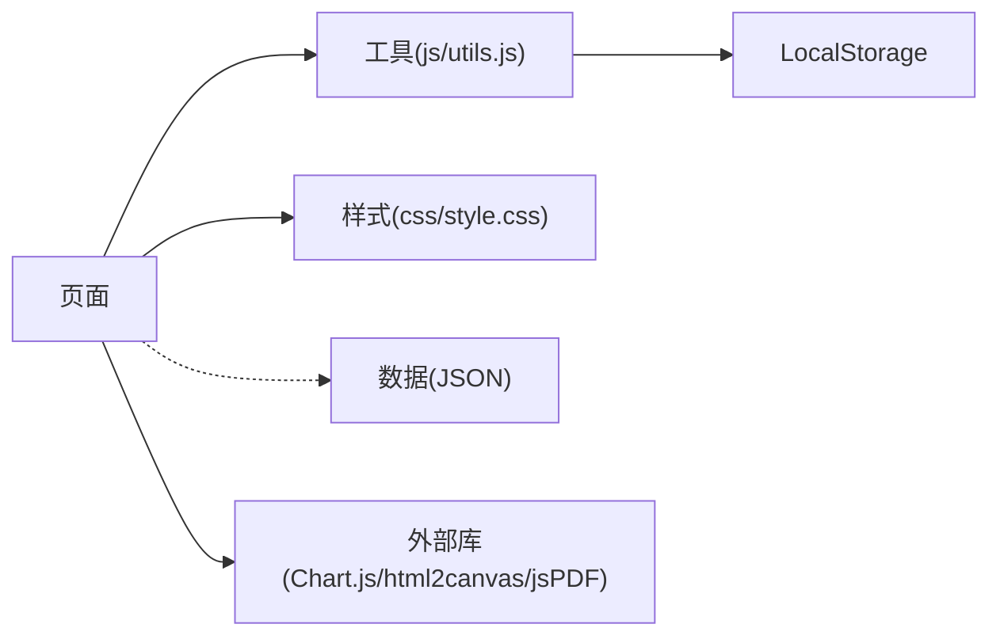

# 核心功能模块

<cite>
**本文引用的文件**
- [index.html](file://index.html)
- [quiz.html](file://quiz.html)
- [result.html](file://result.html)
- [admin.html](file://admin.html)
- [catalog.html](file://catalog.html)
- [css/style.css](file://css/style.css)
- [js/utils.js](file://js/utils.js)
- [data/default-quiz.json](file://data/default-quiz.json)
- [data/template.json](file://data/template.json)
</cite>

## 目录
1. [简介](#简介)
2. [项目结构](#项目结构)
3. [核心组件](#核心组件)
4. [架构总览](#架构总览)
5. [详细组件分析](#详细组件分析)
6. [依赖分析](#依赖分析)
7. [性能考虑](#性能考虑)
8. [故障排查指南](#故障排查指南)
9. [结论](#结论)
10. [附录](#附录)

## 简介
本项目是一个基于纯前端的“心理测试 v2”系统，围绕四大核心模块构建：
- 测试系统模块：负责题目加载、答案收集与进度保存
- 结果分析模块：负责得分计算、多维度分析与图表可视化
- 用户界面模块：负责响应式设计、主题定制与动画效果
- 管理后台模块：负责数据导入导出、实时预览与配置应用

项目采用 HTML/CSS/JavaScript 构建，通过本地存储持久化用户进度与配置，支持在线数据加载与离线体验；通过 Chart.js 实现结果可视化，通过 html2canvas 与 jsPDF 支持 PDF 与海报导出。

## 项目结构
项目采用页面级组织方式，每个页面独立负责特定功能域，共享统一的样式与工具库：
- 页面层：index.html、quiz.html、result.html、admin.html、catalog.html
- 样式层：css/style.css（CSS 变量、响应式、动画与组件样式）
- 工具层：js/utils.js（LocalStorage、数据校验、通用工具、UI 配置）
- 数据层：data/default-quiz.json（默认测试数据）、data/template.json（题目模板）

**图表来源**
- [index.html](file://index.html)
- [quiz.html](file://quiz.html)
- [result.html](file://result.html)
- [admin.html](file://admin.html)
- [catalog.html](file://catalog.html)
- [css/style.css](file://css/style.css)
- [js/utils.js](file://js/utils.js)
- [data/default-quiz.json](file://data/default-quiz.json)
- [data/template.json](file://data/template.json)

**章节来源**
- [index.html](file://index.html)
- [quiz.html](file://quiz.html)
- [result.html](file://result.html)
- [admin.html](file://admin.html)
- [catalog.html](file://catalog.html)
- [css/style.css](file://css/style.css)
- [js/utils.js](file://js/utils.js)
- [data/default-quiz.json](file://data/default-quiz.json)
- [data/template.json](file://data/template.json)

## 核心组件
- 测试系统模块（index/quiz 页面）
  - 职责：加载测试元数据与维度信息、渲染题目、收集答案、保存进度
  - 关键实现：LocalStorage 存储、动态渲染、进度条与动画、按钮状态控制
- 结果分析模块（result 页面）
  - 职责：计算维度得分、生成雷达图与柱状图、输出 PDF 与海报
  - 关键实现：得分聚合、百分比计算、Chart.js 图表、html2canvas/jsPDF 导出
- 用户界面模块（全站）
  - 职责：主题定制、响应式布局、动画与交互
  - 关键实现：CSS 变量、媒体查询、动画 keyframes、UI 配置应用
- 管理后台模块（admin 页面）
  - 职责：UI 配置、文字与配图配置、题目导入导出、实时预览与应用
  - 关键实现：标签页切换、文件上传与校验、预览与应用流程

**章节来源**
- [index.html](file://index.html)
- [quiz.html](file://quiz.html)
- [result.html](file://result.html)
- [admin.html](file://admin.html)
- [css/style.css](file://css/style.css)
- [js/utils.js](file://js/utils.js)

## 架构总览
系统以“页面-工具-样式-数据”四层解耦，页面通过工具库访问本地存储与通用能力，样式通过 CSS 变量集中控制主题与布局，数据通过 JSON 文件提供默认与模板。

**图表来源**
- [js/utils.js](file://js/utils.js)
- [css/style.css](file://css/style.css)
- [data/default-quiz.json](file://data/default-quiz.json)
- [data/template.json](file://data/template.json)

## 详细组件分析

### 测试系统模块（index/quiz）
- 功能职责
  - 首页：加载测试元数据与维度预览，展示测试说明与入口
  - 答题页：合并量表题与选择题、渲染题目、记录答案、保存进度、更新进度条与动画
- 实现原理
  - 数据加载：优先读取本地存储中的测试数据，不存在则拉取默认 JSON；维度预览与题目列表均动态生成
  - 答案收集：量表题通过点击数字按钮选择，选择题通过单选按钮选择；答案存入对象并持久化
  - 进度保存：当前题号与答案集合分别持久化，支持断点续答
  - 进度反馈：进度条高度与花朵图标随答题进度变化，最后题自动切换提交按钮
- 接口设计
  - 页面事件：DOMContentLoaded 触发初始化；按钮事件绑定导航与提交
  - 工具调用：StorageUtil 读写、applyUIConfig 应用主题
- 使用模式与最佳实践
  - 题目顺序：量表题在前、选择题在后，便于评分与展示
  - 答案完整性：提交前校验是否全部作答
  - 进度恢复：离开页面再进入时自动恢复进度
  - 错误处理：加载失败时提示并引导返回首页

**图表来源**
- [index.html](file://index.html)
- [quiz.html](file://quiz.html)
- [js/utils.js](file://js/utils.js)

**章节来源**
- [index.html](file://index.html)
- [quiz.html](file://quiz.html)
- [js/utils.js](file://js/utils.js)

### 结果分析模块（result）
- 功能职责
  - 计算维度得分：量表题按数值累加，选择题按命中维度计 5 分
  - 多维度分析：计算百分比并排序，生成维度卡片与进度条
  - 图表可视化：雷达图与柱状图展示维度占比
  - 报告导出：PDF 报告与分享海报（PNG）
- 实现原理
  - 得分计算：遍历两类题目，按维度聚合分数与满分，计算百分比
  - 主要维度：找出最高分维度（支持并列），用于结果页标题强调
  - 图表渲染：使用 Chart.js 创建雷达图与柱状图，Y 轴百分比刻度
  - 导出能力：html2canvas 截图生成海报，jsPDF 输出 PDF
- 接口设计
  - 页面事件：DOMContentLoaded 加载数据与渲染；按钮事件触发导出与重启
  - 工具调用：StorageUtil 读取 quiz_data 与 user_answers；applyUIConfig 应用主题
- 使用模式与最佳实践
  - 数据一致性：确保 quiz_data 与 user_answers 同步，避免空答案导致异常
  - 可视化优化：图表尺寸自适应，Y 轴统一范围提升对比性
  - 导出质量：海报截图 scale 调整保证清晰度

**图表来源**
- [result.html](file://result.html)
- [js/utils.js](file://js/utils.js)

**章节来源**
- [result.html](file://result.html)
- [js/utils.js](file://js/utils.js)

### 用户界面模块（全站）
- 功能职责
  - 主题定制：颜色、字体、圆角等 CSS 变量集中控制
  - 响应式设计：移动端适配、按钮与卡片布局优化
  - 动画效果：淡入、脉冲、模态框缩放等增强交互体验
- 实现原理
  - CSS 变量：:root 定义主题变量，页面通过 JS 动态更新
  - 媒体查询：针对小屏设备调整字号、间距与布局
  - 动画：keyframes 定义 fadeIn/pulse 等动画，配合类名启用
- 接口设计
  - applyUIConfig(config?)：应用默认或传入配置到 :root
  - getUIConfig()：合并默认与自定义配置
- 使用模式与最佳实践
  - 配置持久化：UI 配置写入 StorageKeys.UI_CONFIG，页面加载即应用
  - 一致性：所有页面共享同一主题变量，避免样式碎片化
  - 性能：动画仅在必要元素上启用，避免过度重绘

**图表来源**
- [js/utils.js](file://js/utils.js)

**章节来源**
- [css/style.css](file://css/style.css)
- [js/utils.js](file://js/utils.js)

### 管理后台模块（admin）
- 功能职责
  - UI 配置：主题色、辅助色、背景色、字体、圆角等
  - 文字与配图：首页标题、副标题、按钮文字、图标等
  - 题目管理：下载模板、上传 JSON、验证、预览、保存与应用
- 实现原理
  - 标签页：切换 .tab-btn 与 .tab-content 显隐
  - 文件上传：FileReader 读取 JSON，QuizValidator.validate 校验
  - 预览与应用：预览即时应用 UI 配置；应用保存并刷新页面生效
  - 数据同步：pendingQuizData 作为临时编辑副本，currentQuizData 为当前生效数据
- 接口设计
  - 事件：标签页切换、按钮点击（预览/保存/应用/重置）
  - 工具：Utils.downloadJSON、Utils.readJSONFile、StorageUtil
- 使用模式与最佳实践
  - 模板先行：先下载模板，按字段规范填写，减少校验失败
  - 分步操作：先上传验证，再保存，最后应用，避免覆盖当前数据
  - 预览确认：预览当前页面以快速验证效果

**图表来源**
- [admin.html](file://admin.html)
- [js/utils.js](file://js/utils.js)

**章节来源**
- [admin.html](file://admin.html)
- [js/utils.js](file://js/utils.js)

## 依赖分析
- 页面对工具的依赖
  - index/quiz/result/catalog/admin 均依赖 js/utils.js 提供的 StorageUtil、QuizValidator、Utils、UI 配置
- 工具对样式的依赖
  - applyUIConfig 通过 CSS 变量影响页面视觉表现
- 数据对页面的依赖
  - default-quiz.json 为首页与答题页提供默认数据源；template.json 为管理后台提供题目模板
- 外部依赖
  - Chart.js、html2canvas、jsPDF 在结果页按需引入

**图表来源**
- [js/utils.js](file://js/utils.js)
- [css/style.css](file://css/style.css)
- [data/default-quiz.json](file://data/default-quiz.json)
- [data/template.json](file://data/template.json)

**章节来源**
- [js/utils.js](file://js/utils.js)
- [css/style.css](file://css/style.css)
- [data/default-quiz.json](file://data/default-quiz.json)
- [data/template.json](file://data/template.json)

## 性能考虑
- 数据加载
  - 本地存储优先，减少网络请求；默认数据仅在首次使用时拉取
- 渲染优化
  - 动态生成 DOM 时尽量批量拼接字符串，减少多次 DOM 查询
  - 图表渲染在数据就绪后一次性初始化，避免重复创建实例
- 交互体验
  - 防抖函数可用于高频事件（如窗口尺寸变化），降低重排压力
- 导出性能
  - 海报截图 scale 调整与缓存策略平衡清晰度与内存占用

## 故障排查指南
- 题目加载失败
  - 现象：首页/答题页显示加载失败
  - 排查：检查 default-quiz.json 是否存在且格式正确；浏览器网络面板确认资源可访问
- 答案无法保存/恢复
  - 现象：刷新后进度丢失
  - 排查：确认 LocalStorage 可用；检查 StorageUtil.set/get 是否抛错
- 题目校验失败
  - 现象：管理后台提示字段缺失或格式错误
  - 排查：对照 template.json 字段清单逐项核对；确保维度与题目 ID 唯一
- 图表不显示
  - 现象：结果页图表空白
  - 排查：确认 Chart.js 已成功加载；检查容器尺寸与响应式设置
- 导出失败
  - 现象：PDF/海报无法生成或下载
  - 排查：确认 html2canvas/jsPDF 引入；检查跨域与安全策略限制

**章节来源**
- [index.html](file://index.html)
- [quiz.html](file://quiz.html)
- [result.html](file://result.html)
- [admin.html](file://admin.html)
- [js/utils.js](file://js/utils.js)

## 结论
本项目通过清晰的模块划分与统一的工具层，实现了从数据加载、答题交互、结果分析到后台管理的完整闭环。其优势在于：
- 低门槛部署：纯前端实现，无需后端
- 可扩展性强：通过 JSON 数据与模板机制，易于新增测试与维度
- 体验友好：主题定制、响应式布局与动画提升了可用性
- 可维护性：工具函数与样式变量集中管理，便于迭代升级

建议后续方向：
- 增强数据校验与错误提示
- 引入单元测试与 E2E 测试
- 优化图表交互与导出细节
- 支持多语言与无障碍访问

## 附录
- 数据模型（简述）
  - 测试元数据：quiz_name、reference、nbr_question、nbr_dimension、dimensions[]
  - 量表题：question_id、dimension_id、question_text
  - 选择题：question_id、question_text、option_a/e_text/dim
- 关键路径参考
  - 首页数据加载与维度预览：[index.html](file://index.html)
  - 答题页题目渲染与进度保存：[quiz.html](file://quiz.html)
  - 结果页得分计算与图表渲染：[result.html](file://result.html)
  - 管理后台 UI 配置与题目导入：[admin.html](file://admin.html)
  - 样式与主题变量：[css/style.css](file://css/style.css)
  - 工具函数与 UI 配置：[js/utils.js](file://js/utils.js)
  - 默认测试数据：[data/default-quiz.json](file://data/default-quiz.json)
  - 题目模板：[data/template.json](file://data/template.json)