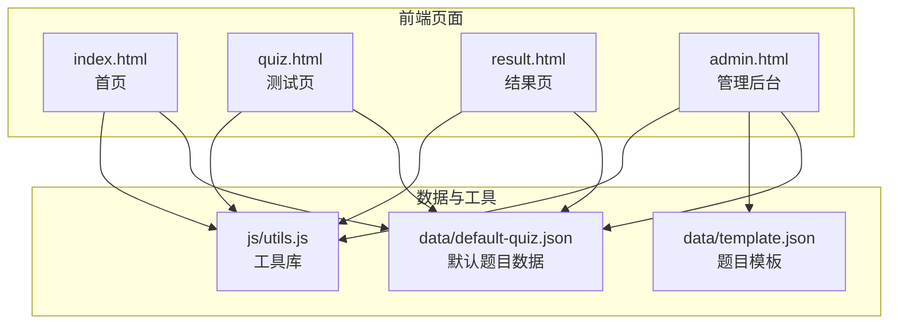
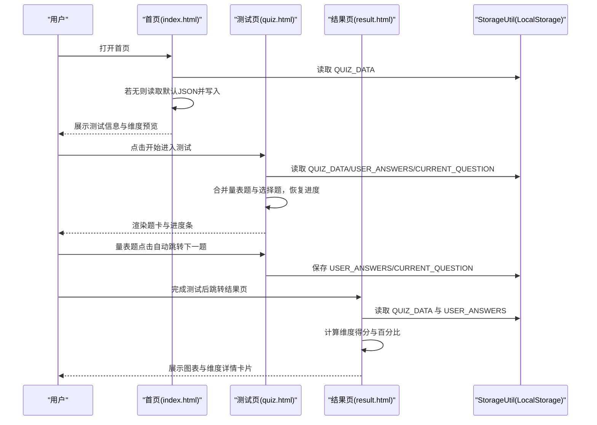
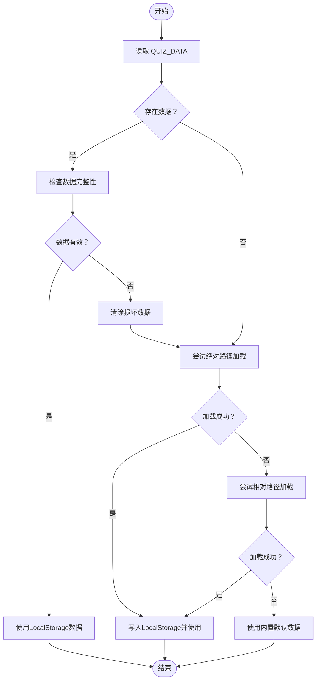
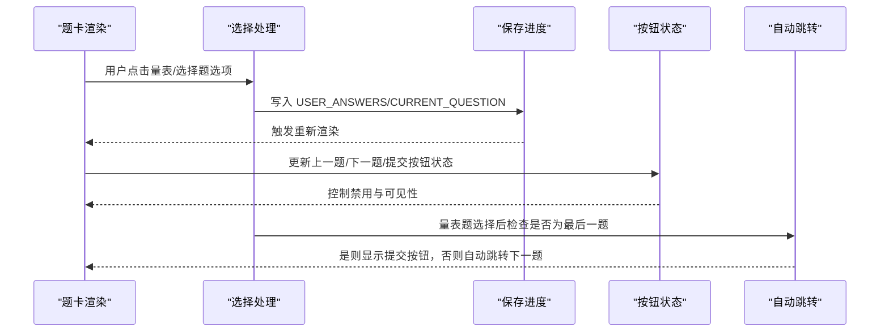
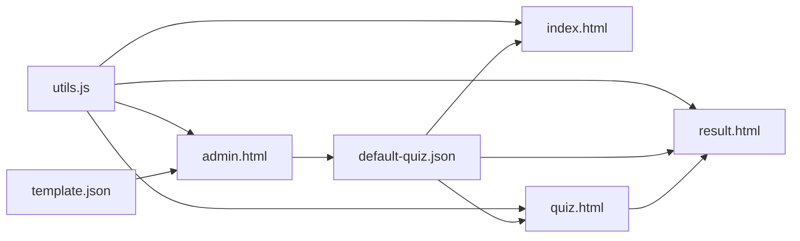

# 测试系统模块

<cite>
**本文引用的文件**
- [index.html](file://index.html)
- [quiz.html](file://quiz.html)
- [result.html](file://result.html)
- [admin.html](file://admin.html)
- [default-quiz.json](file://data/default-quiz.json)
- [template.json](file://data/template.json)
- [utils.js](file://js/utils.js)
</cite>

## 更新摘要
**变更内容**
- 新增完整的测试系统模块，包含测试数据模型、题目管理、答案处理等核心功能
- 实现了量表题和选择题的差异化处理机制
- 增加了自动跳转功能（量表题选择后自动跳转下一题）
- 实现了进度跟踪和错误处理机制
- 优化了用户交互体验和界面反馈
- 增强了数据加载和验证流程
- 新增了题目管理功能、数据验证系统、本地存储优化等核心功能

## 目录
1. [简介](#简介)
2. [项目结构](#项目结构)
3. [核心组件](#核心组件)
4. [架构总览](#架构总览)
5. [详细组件分析](#详细组件分析)
6. [依赖关系分析](#依赖关系分析)
7. [性能考虑](#性能考虑)
8. [故障排查指南](#故障排查指南)
9. [结论](#结论)
10. [附录](#附录)

## 简介
本模块是一个基于浏览器的在线心理测试系统，支持量表题与选择题两种题型，具备测试数据加载、题目渲染、答案收集与验证、进度保存与恢复、结果计算与可视化展示等功能。系统采用本地存储进行数据持久化，支持通过管理后台导入/编辑题目模板、调整界面风格与文字配置，并提供PDF报告与分享海报导出能力。最新版本增强了量表题和选择题的差异化处理，增加了自动跳转、进度跟踪、错误处理等增强功能，并新增了完整的题目管理系统和数据验证机制。

## 项目结构
- 前端页面
  - 首页：展示测试信息、维度预览与入口链接
  - 测试页：加载题目、渲染题卡、导航与进度条、答案收集与保存、自动跳转
  - 结果页：计算维度得分、雷达图/柱状图、维度详情卡片、PDF/海报导出、庆祝特效
  - 管理后台：UI配置、文字与配图配置、题目模板下载与上传、题目应用
- 数据与工具
  - 测试数据：默认题目数据与模板
  - 工具库：LocalStorage封装、数据校验、通用工具、UI配置应用

**图表来源**
- [index.html](file://index.html)
- [quiz.html](file://quiz.html)
- [result.html](file://result.html)
- [admin.html](file://admin.html)
- [default-quiz.json](file://data/default-quiz.json)
- [template.json](file://data/template.json)
- [utils.js](file://js/utils.js)

**章节来源**
- [index.html:1-532](file://index.html#L1-L532)
- [quiz.html:1-441](file://quiz.html#L1-L441)
- [result.html:1-1581](file://result.html#L1-L1581)
- [admin.html:1-411](file://admin.html#L1-L411)
- [default-quiz.json:1-235](file://data/default-quiz.json#L1-L235)
- [template.json:1-49](file://data/template.json#L1-L49)
- [utils.js:1-250](file://js/utils.js#L1-L250)

## 核心组件
- 工具库与持久化
  - StorageKeys：定义本地存储键名（测试数据、用户答案、当前题号、配置等）
  - StorageUtil：封装localStorage的存取、清理与进度清除，新增clearQuizProgress方法
  - QuizValidator：对题目数据进行结构与字段校验，增强错误提示
  - Utils：防抖、JSON下载/读取、ID生成、百分比格式化、平滑滚动等
  - UI配置：默认主题与CSS变量注入，支持覆盖与应用
- 页面组件
  - 首页：加载并展示测试元数据、维度预览；备用默认数据兜底
  - 测试页：合并量表题与选择题、动态渲染题卡、进度条与按钮状态控制、答案保存与进度恢复、自动跳转
  - 结果页：按维度统计得分、生成图表与维度详情卡片、PDF/海报导出、庆祝烟花特效
  - 管理后台：下载模板、上传并校验题目、应用与保存、预览与重置

**章节来源**
- [utils.js:6-50](file://js/utils.js#L6-L50)
- [utils.js:55-126](file://js/utils.js#L55-L126)
- [utils.js:131-202](file://js/utils.js#L131-L202)
- [utils.js:207-244](file://js/utils.js#L207-L244)

## 架构总览
系统采用"页面即控制器"的轻量前端架构：
- 数据来源：优先从LocalStorage读取，不存在则回退到默认JSON；管理后台可上传并校验模板，写入LocalStorage供其他页面使用
- 渲染策略：页面内动态拼接HTML，根据题型生成不同交互控件
- 状态管理：全局变量维护题目集合、当前索引与用户答案；通过StorageUtil持久化
- 可视化：结果页使用Chart.js绘制雷达图与柱状图，结合html2canvas与jsPDF导出PDF与海报
- 错误处理：增强的错误捕获与用户提示机制

**图表来源**
- [index.html:90-144](file://index.html#L90-L144)
- [quiz.html:82-154](file://quiz.html#L82-L154)
- [quiz.html:156-219](file://quiz.html#L156-L219)
- [result.html:1530-1577](file://result.html#L1530-L1577)

## 详细组件分析

### 测试数据加载机制
- 首页加载流程
  - 优先从LocalStorage读取测试数据；若无，则尝试读取默认JSON；失败则使用内置默认数据并写入LocalStorage
  - 展示测试名称、参考来源、题目数量与维度预览
  - 增强了数据完整性检查，支持绝对路径和相对路径双重加载策略
- 测试页加载流程
  - 从LocalStorage读取测试数据；若无则尝试读取默认JSON；失败则提示返回首页
  - 校验数据结构完整性（必须包含量表题与选择题数组）
  - 合并题目：量表题在前，选择题在后，统一标注type字段
  - 恢复进度：读取当前题号与用户答案，确保索引不越界
  - 增强了错误处理，提供详细的错误信息和用户提示
- 管理后台
  - 下载模板：从template.json下载标准格式
  - 上传并校验：读取JSON文件，使用QuizValidator进行结构与字段校验，通过后写入LocalStorage供前台使用
  - 增强了验证结果显示，提供具体的错误定位

**图表来源**
- [index.html:90-144](file://index.html#L90-L144)
- [quiz.html:82-154](file://quiz.html#L82-L154)
- [admin.html:252-291](file://admin.html#L252-L291)

**章节来源**
- [index.html:90-144](file://index.html#L90-L144)
- [quiz.html:82-154](file://quiz.html#L82-L154)
- [admin.html:252-291](file://admin.html#L252-L291)

### 题目渲染逻辑与交互处理
- 题目合并策略
  - 将量表题与选择题分别映射为统一结构并追加type字段，形成allQuestions序列
  - 量表题：5档评分（1-5），点击选项即时保存并更新UI，支持自动跳转
  - 选择题：A-E选项，点击label触发单选，保存答案并更新UI，支持多选
- 动态HTML生成
  - 根据题型拼接题卡HTML，包含题号、题干、选项与样式
  - 量表题：每个选项包含数值与标签，选中项高亮
  - 选择题：每个选项为label包裹radio，选中项高亮，支持多选标记
- 用户交互处理
  - 导航按钮：上一题/下一题/提交；根据当前题与是否作答控制禁用状态
  - 进度条：根据当前题号计算百分比，动态更新花茎高度与阶段图标
  - 答案保存：每次选择后立即调用保存函数，确保断电/刷新不丢失
  - 自动跳转：量表题选择后自动跳转到下一题，避免重复点击
  - 防重复点击：使用isTransitioning标志防止快速连续点击

**更新** 新增了自动跳转功能和防重复点击机制，提升了用户体验

**图表来源**
- [quiz.html:156-219](file://quiz.html#L156-L219)
- [quiz.html:221-258](file://quiz.html#L221-L258)
- [quiz.html:260-300](file://quiz.html#L260-L300)
- [quiz.html:348-393](file://quiz.html#L348-L393)

**章节来源**
- [quiz.html:156-219](file://quiz.html#L156-L219)
- [quiz.html:221-258](file://quiz.html#L221-L258)
- [quiz.html:260-300](file://quiz.html#L260-L300)
- [quiz.html:348-393](file://quiz.html#L348-L393)

### 答案收集与验证
- 答案收集
  - 量表题：答案为1-5整数
  - 选择题：答案为字母a-e，支持多选（数组格式）
  - 存储结构：以question_id为键，值为用户选择
- 答案验证
  - 管理后台上传的题目文件通过QuizValidator进行结构校验，确保字段齐全且格式正确
  - 测试页提交前检查是否全部作答，未完成则提示剩余题数
  - 增强了验证错误的详细提示，包括具体的问题位置和原因

**更新** 选择题现在支持多选功能，答案存储格式为数组

**章节来源**
- [utils.js:55-126](file://js/utils.js#L55-L126)
- [quiz.html:395-407](file://quiz.html#L395-L407)

### 进度保存与恢复
- 保存策略
  - 每次选择答案后立即保存用户答案与当前题号
  - 支持一键清除测试进度（删除用户答案与当前题号）
  - 新增clearQuizProgress方法专门用于清除测试进度
- 恢复策略
  - 页面加载时读取用户答案与当前题号，确保索引不超过总题数
  - 若索引越界，自动回退到最后一题
  - 增强了数据完整性检查，自动修复损坏的数据

**更新** 新增了专门的进度清除方法和数据完整性检查

**章节来源**
- [utils.js:46-49](file://js/utils.js#L46-L49)
- [quiz.html:302-306](file://quiz.html#L302-L306)
- [result.html:1451-1454](file://result.html#L1451-L1454)

### 量表题与选择题的不同处理方式
- 量表题
  - 5档评分，点击即选，即时保存
  - 渲染为带数值与标签的选项容器
  - **新增** 选择后自动跳转到下一题，最后一题显示提交按钮
  - 防重复点击保护，避免快速连续点击
- 选择题
  - A-E选项，支持多选，点击切换选中状态
  - 渲染为label包裹的选项容器，选中项高亮
  - **新增** 支持多选功能，答案存储为数组格式
  - 不自动跳转，等待用户手动点击下一题按钮

**更新** 量表题增加了自动跳转功能，选择题增加了多选支持

**章节来源**
- [quiz.html:173-186](file://quiz.html#L173-L186)
- [quiz.html:187-212](file://quiz.html#L187-L212)
- [quiz.html:221-258](file://quiz.html#L221-L258)
- [quiz.html:260-300](file://quiz.html#L260-L300)

### 结果计算与可视化
- 计算逻辑
  - 量表题：按题得分累加，满分按5分计
  - 选择题：选中选项对应维度+5分，支持多选累加
  - 百分比：维度得分/最大可能分×100
- 可视化
  - 雷达图：维度占比雷达图
  - 柱状图：维度占比柱状图
  - 维度详情卡片：排序展示，最高分维度突出显示
  - **新增** 庆祝烟花特效，增强结果展示的视觉效果
  - **新增** PDF报告生成，支持两页内容（图表和详细解读）
  - **新增** 分享海报生成功能

**更新** 增强了结果展示功能，增加了PDF导出和海报分享功能

**章节来源**
- [result.html:827-870](file://result.html#L827-L870)
- [result.html:1003-1102](file://result.html#L1003-L1102)
- [result.html:1161-1189](file://result.html#L1161-L1189)
- [result.html:1238-1393](file://result.html#L1238-L1393)
- [result.html:1395-1449](file://result.html#L1395-L1449)

### L10n与UI配置
- UI配置
  - 默认主题色、辅助色、背景色、字体、圆角、最大宽度
  - 支持保存与应用，覆盖默认配置
  - **新增** 字体家族选择，支持多种中文字体
- 文字与配图配置
  - 管理后台提供文字与配图配置入口（当前版本部分功能预留）

**更新** 增加了字体家族选择功能

**章节来源**
- [utils.js:207-244](file://js/utils.js#L207-L244)
- [admin.html:293-359](file://admin.html#L293-L359)

### 管理后台功能
- 下载模板：从template.json下载标准格式
- 上传并校验：读取JSON文件，使用QuizValidator进行结构校验
- 应用与保存：将题目数据写入LocalStorage，供前台使用
- 预览与重置：支持预览效果与重置为默认数据
- **新增** 增强的验证结果显示，提供具体的错误定位和修复建议

**更新** 增强了验证结果显示功能

**章节来源**
- [admin.html:244-291](file://admin.html#L244-L291)
- [admin.html:361-392](file://admin.html#L361-L392)

## 依赖关系分析
- 页面与工具库
  - 所有页面均依赖utils.js中的StorageUtil、QuizValidator、Utils与UI配置函数
- 页面间数据流
  - 首页与管理后台共享默认题目数据；测试页与结果页共享用户答案与进度
- 外部依赖
  - 结果页引入Chart.js、html2canvas、jsPDF用于图表与导出
  - **新增** 管理后台引入了标签页切换功能

**图表来源**
- [utils.js:1-250](file://js/utils.js#L1-L250)
- [index.html:74-144](file://index.html#L74-L144)
- [quiz.html:62-154](file://quiz.html#L62-L154)
- [result.html:296-1577](file://result.html#L296-L1577)
- [admin.html:171-407](file://admin.html#L171-L407)

**章节来源**
- [utils.js:1-250](file://js/utils.js#L1-L250)
- [index.html:74-144](file://index.html#L74-L144)
- [quiz.html:62-154](file://quiz.html#L62-L154)
- [result.html:296-1577](file://result.html#L296-L1577)
- [admin.html:171-407](file://admin.html#L171-L407)

## 性能考虑
- 渲染优化
  - 题卡渲染采用字符串拼接，避免复杂DOM操作；仅在答案变化或导航时重绘
  - 进度条与按钮状态更新按需触发，减少不必要的重排
  - **新增** 使用isTransitioning标志防止重复渲染
- 存储优化
  - 仅保存必要字段（用户答案与当前题号），避免冗余数据
  - 使用防抖函数（如滚动）减少频繁调用
  - **新增** 增强的数据完整性检查，避免重复加载相同数据
- 数据加载
  - 优先使用LocalStorage，减少网络请求；默认数据作为兜底
  - **新增** 支持绝对路径和相对路径双重加载策略
- 可视化
  - 图表初始化在结果页一次性完成，避免重复实例化
  - **新增** 烟花特效按需触发，避免不必要的动画开销

**更新** 增加了防重复点击和数据完整性检查等性能优化措施

## 故障排查指南
- 首页加载失败
  - 检查LocalStorage中QUIZ_DATA是否存在；若无，确认默认JSON可访问
  - 若默认JSON不可用，系统将使用内置默认数据
  - **新增** 检查绝对路径和相对路径加载是否都能正常工作
- 测试页无法进入
  - 检查LocalStorage中QUIZ_DATA结构是否完整（包含量表题与选择题数组）
  - 若无数据，尝试从首页重新进入或检查默认JSON
  - **新增** 检查数据完整性，确认scale_questions和choice_questions字段存在
- 答案未保存
  - 确认每次选择后调用保存函数；检查LocalStorage可用性
  - **新增** 检查isTransitioning标志是否正确设置，避免重复点击导致的问题
- 结果页无数据
  - 确认已完成测试并保存用户答案；若为空，提示返回测试页
  - **新增** 检查PDF生成和海报导出功能的外部依赖是否正确加载
- 管理后台上传失败
  - 检查上传文件是否为有效JSON；使用QuizValidator输出的具体错误定位问题
  - **新增** 查看详细的验证错误信息，包括具体的问题位置和修复建议
- 量表题无法自动跳转
  - 检查isTransitioning标志是否正确设置
  - **新增** 确认最后一题的处理逻辑是否正确
- 选择题多选功能异常
  - 检查答案存储格式是否为数组
  - **新增** 确认toggleChoice函数的多选逻辑是否正确

**更新** 增加了针对新功能的故障排查指导

**章节来源**
- [index.html:90-144](file://index.html#L90-L144)
- [quiz.html:82-154](file://quiz.html#L82-L154)
- [result.html:1551-1558](file://result.html#L1551-L1558)
- [admin.html:252-291](file://admin.html#L252-L291)

## 结论
该测试系统模块以简洁的前端架构实现了完整的测试生命周期：数据加载、题目渲染、答案收集、进度保存、结果计算与可视化展示。最新版本增强了量表题和选择题的差异化处理，增加了自动跳转、进度跟踪、错误处理等增强功能，显著提升了用户体验。通过LocalStorage实现数据持久化，配合管理后台的题目模板与UI配置能力，满足了快速部署与定制化需求。建议在后续版本中进一步增强错误提示与性能监控，提升用户体验与稳定性。

## 附录

### 扩展新题型的步骤指引
- 在题目数据中新增题型字段（例如type），并在渲染逻辑中识别并生成相应HTML
- 在答案收集与保存逻辑中增加对该题型的处理分支
- 在结果计算中增加该题型对应的维度计分规则
- 在管理后台添加该题型的模板字段与校验规则
- **新增** 考虑是否需要自动跳转功能和多选支持

### 修改题目顺序的方法
- 在题目数据中调整量表题与选择题数组的顺序
- 由于测试页会将两类题合并为allQuestions并按顺序渲染，因此直接调整数组顺序即可实现题目重排
- **新增** 注意量表题和选择题的自动跳转逻辑差异

### 处理特殊题目场景
- 缺失选项或维度映射：在QuizValidator中增加校验，确保每道题的选项与维度映射完整
- 题目数量不一致：在管理后台校验总题数与量表/选择题数量一致性
- 答案缺失：在提交前检查答案数量，提示用户补齐
- **新增** 多选题的答案格式验证和处理
- **新增** 自动跳转功能的边界条件处理

**章节来源**
- [utils.js:55-126](file://js/utils.js#L55-L126)
- [quiz.html:395-407](file://quiz.html#L395-L407)
- [quiz.html:221-258](file://quiz.html#L221-L258)
- [quiz.html:260-300](file://quiz.html#L260-L300)