# 用户界面模块

<cite>
**本文档引用的文件**
- [css/style.css](file://css/style.css)
- [index.html](file://index.html)
- [quiz.html](file://quiz.html)
- [result.html](file://result.html)
- [admin.html](file://admin.html)
- [catalog.html](file://catalog.html)
- [js/utils.js](file://js/utils.js)
- [data/default-quiz.json](file://data/default-quiz.json)
- [data/template.json](file://data/template.json)
</cite>

## 更新摘要
**变更内容**
- 新增完整的页面组件设计，包括首页、测试页面、结果页面、目录页面和管理后台
- 完善轮播组件和进度跟踪功能
- 增强主题定制机制，支持实时预览和应用
- 优化响应式设计架构，提供移动端适配
- 新增烟花特效和海报生成功能
- 完善动画系统和可视化图表

## 目录
1. [简介](#简介)
2. [项目结构](#项目结构)
3. [核心组件](#核心组件)
4. [架构总览](#架构总览)
5. [详细组件分析](#详细组件分析)
6. [依赖关系分析](#依赖关系分析)
7. [性能考量](#性能考量)
8. [故障排除指南](#故障排除指南)
9. [结论](#结论)
10. [附录](#附录)

## 简介
本用户界面模块为心理测试网站的核心前端部分，采用纯静态 HTML/CSS/JavaScript 架构，围绕响应式设计、CSS 变量系统与主题定制机制构建。模块涵盖首页、测试页、结果页、目录页与管理后台五大页面，提供完整的测试流程体验与可视化展示。重点特性包括：
- 响应式设计：基于媒体查询与弹性布局，适配桌面端与移动端
- CSS 变量系统：集中管理主题色、字体、圆角、最大宽度等全局样式变量
- 主题定制机制：支持通过管理后台实时调整 UI 配置并持久化
- 进度跟踪动画：以"小花生长"动画直观展示答题进度
- 导航系统：包含面包屑导航、页面间跳转与状态保持
- 卡片布局系统：统一的卡片容器与阴影、过渡效果
- 按钮样式体系：主次按钮、危险按钮与禁用态
- 表单控件设计：单选按钮组、量表题选项、文件上传等
- 移动端适配：触摸交互优化、字体缩放与布局调整
- 性能考虑：防抖、本地存储、图表懒加载与图片懒加载
- 动画特效：烟花特效、模态框动画、轮播组件
- 可视化图表：雷达图、柱状图展示测试结果
- 社交分享：PDF报告生成、海报分享功能

## 项目结构
项目采用按页面划分的扁平结构，核心文件组织如下：
- 样式层：css/style.css（全局样式、变量、响应式与动画）
- 页面层：index.html、quiz.html、result.html、admin.html、catalog.html
- 工具层：js/utils.js（存储、验证、通用工具与 UI 配置应用）
- 数据层：data/default-quiz.json（默认测试数据）、data/template.json（题目模板）

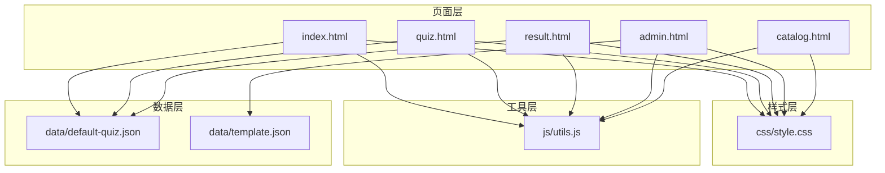

**图表来源**
- [css/style.css](file://css/style.css)
- [index.html](file://index.html)
- [quiz.html](file://quiz.html)
- [result.html](file://result.html)
- [admin.html](file://admin.html)
- [catalog.html](file://catalog.html)
- [js/utils.js](file://js/utils.js)
- [data/default-quiz.json](file://data/default-quiz.json)
- [data/template.json](file://data/template.json)

**章节来源**
- [css/style.css](file://css/style.css)
- [index.html](file://index.html)
- [quiz.html](file://quiz.html)
- [result.html](file://result.html)
- [admin.html](file://admin.html)
- [catalog.html](file://catalog.html)
- [js/utils.js](file://js/utils.js)
- [data/default-quiz.json](file://data/default-quiz.json)
- [data/template.json](file://data/template.json)

## 核心组件
- CSS 变量系统：集中定义主色、辅色、背景色、文本色、阴影、圆角、字体族、最大宽度与过渡动画参数，通过 :root 统一注入，供全站使用
- 卡片系统：统一的 .card 容器，包含内边距、圆角、阴影与 hover 过渡
- 按钮体系：.btn、.btn-primary、.btn-secondary、.btn-danger，支持禁用态与交互反馈
- 导航栏：.navbar 固定顶部，包含 logo 与导航链接，支持 active 状态
- 进度跟踪：.progress-container + .progress-flower 实现"小花生长"动画，配合 .progress-text 展示题号
- 表单控件：.radio-group（单选按钮组）、.scale-options（量表题选项），支持选中态与 hover 效果
- 结果页：雷达图与柱状图展示维度得分，维度卡片展示详细信息
- 管理后台：标签页切换、UI 配置、文字与配图配置、题目管理（下载模板、上传校验、应用）
- 目录系统：.catalog-grid 实现测试卡片网格布局，支持响应式适配
- 动画系统：淡入动画、脉冲动画、模态框动画、烟花特效
- 可视化图表：Chart.js 雷达图与柱状图
- 社交分享：PDF 报告生成、海报生成与下载

**章节来源**
- [css/style.css](file://css/style.css)
- [index.html](file://index.html)
- [quiz.html](file://quiz.html)
- [result.html](file://result.html)
- [admin.html](file://admin.html)
- [catalog.html](file://catalog.html)

## 架构总览
整体架构遵循"页面 + 样式 + 工具 + 数据"的分层设计，页面通过 js/utils.js 提供的工具进行数据持久化、验证与 UI 配置应用；样式通过 CSS 变量实现主题定制与响应式适配。

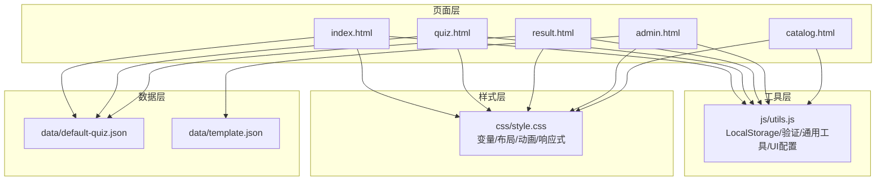

**图表来源**
- [index.html](file://index.html)
- [quiz.html](file://quiz.html)
- [result.html](file://result.html)
- [admin.html](file://admin.html)
- [catalog.html](file://catalog.html)
- [js/utils.js](file://js/utils.js)
- [css/style.css](file://css/style.css)
- [data/default-quiz.json](file://data/default-quiz.json)
- [data/template.json](file://data/template.json)

## 详细组件分析

### 响应式设计架构
- 媒体查询：在 768px 断点下调整字体大小、容器内边距、卡片内边距、标题字号、量表题选项方向、导航按钮排列、目录网格列数、标签页横向滚动与操作按钮垂直排列
- 弹性布局：容器 .container、网格 .catalog-grid、卡片 .card、导航 .nav-buttons、结果图表 .result-chart-container 等均采用 Flex/Grid 布局
- 视口设置：页面 meta viewport 控制初始缩放，确保移动端正确渲染

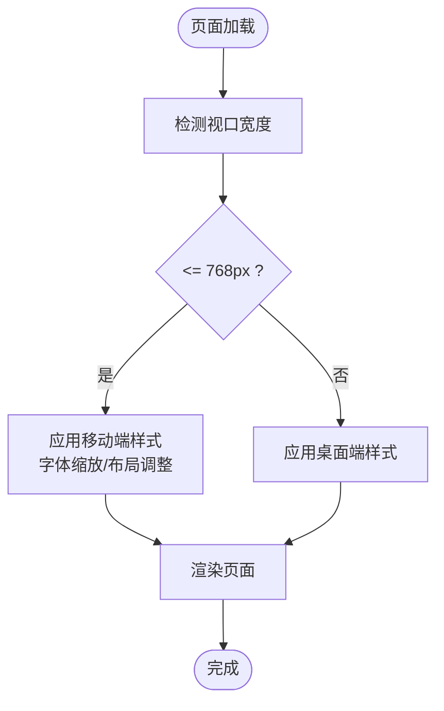

**图表来源**
- [css/style.css](file://css/style.css)
- [index.html](file://index.html)
- [quiz.html](file://quiz.html)
- [result.html](file://result.html)
- [admin.html](file://admin.html)
- [catalog.html](file://catalog.html)

**章节来源**
- [css/style.css](file://css/style.css)
- [index.html](file://index.html)
- [quiz.html](file://quiz.html)
- [result.html](file://result.html)
- [admin.html](file://admin.html)
- [catalog.html](file://catalog.html)

### CSS 变量系统
- 变量定义：在 :root 中集中定义 --primary-color、--secondary-color、--background-color、--text-color、--text-secondary、--white、--shadow、--shadow-hover、--border-radius、--font-family、--max-width、--transition
- 变量应用：body、.card、.btn、.navbar、.scale-btn、.dimension-card 等广泛使用变量，确保主题一致性
- UI 配置应用：通过 applyUIConfig 将自定义配置写入 :root，实现主题即时切换

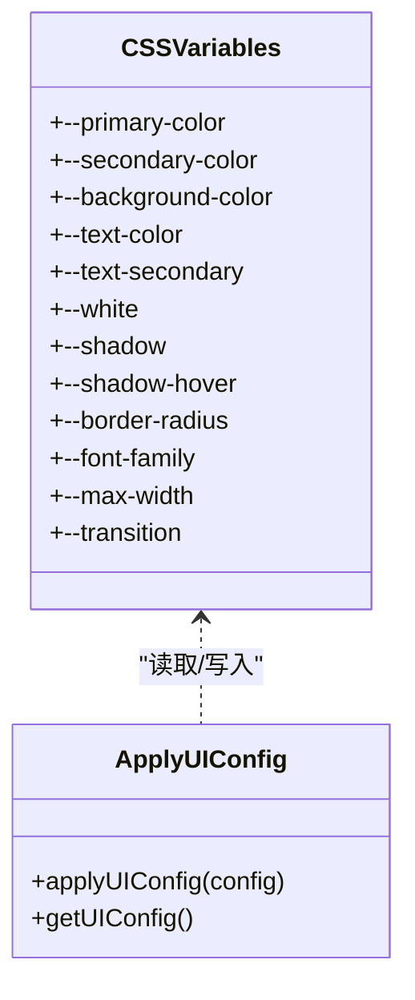

**图表来源**
- [css/style.css](file://css/style.css)
- [js/utils.js](file://js/utils.js)

**章节来源**
- [css/style.css](file://css/style.css)
- [js/utils.js](file://js/utils.js)

### 主题定制机制
- 自定义配置存储：StorageKeys.UI_CONFIG 存储用户在管理后台设置的主题参数
- 默认配置：DefaultUIConfig 提供默认主题参数，包括主色、辅色、背景色、字体族、字号、圆角与最大宽度
- 实时应用：applyUIConfig 将配置写入 :root，立即影响全局样式
- 管理后台：提供 UI 配置的预览、保存、应用与重置功能

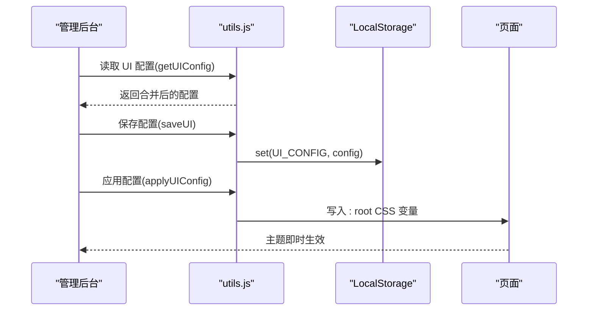

**图表来源**
- [admin.html](file://admin.html)
- [js/utils.js](file://js/utils.js)

**章节来源**
- [admin.html](file://admin.html)
- [js/utils.js](file://js/utils.js)

### 进度跟踪动画实现
- 小花生长效果：.progress-flower 包含 .flower-stem（高度渐增）与 .flower-head（根据进度切换不同表情）
- 进度条设计：.progress-container + .progress-text 展示当前题号与总题数
- 动画过渡：.flower-stem 使用 transition 控制高度变化，.flower-head 使用 transition 控制文本变化
- 计算逻辑：updateProgress 根据当前题号与总题数计算百分比，更新茎高与花朵阶段

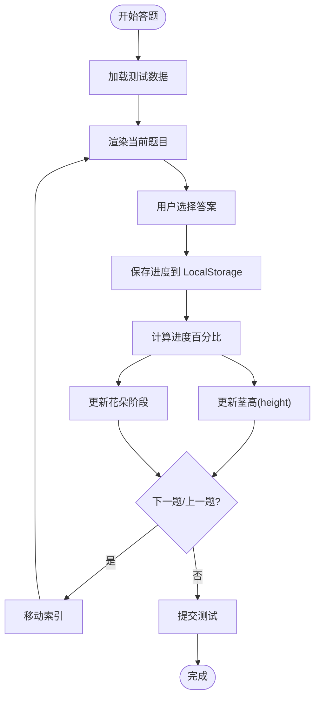

**图表来源**
- [quiz.html](file://quiz.html)
- [css/style.css](file://css/style.css)

**章节来源**
- [quiz.html](file://quiz.html)
- [css/style.css](file://css/style.css)

### 导航系统设计
- 面包屑导航：通过页面中的路径信息与导航链接实现页面层级跳转
- 页面间跳转：首页 -> 测试页 -> 结果页，管理后台提供"预览"功能
- 状态保持：通过 LocalStorage 保存用户答案与当前题号，实现断点续答
- 导航栏：固定顶部，包含 logo 与导航链接，支持 active 状态

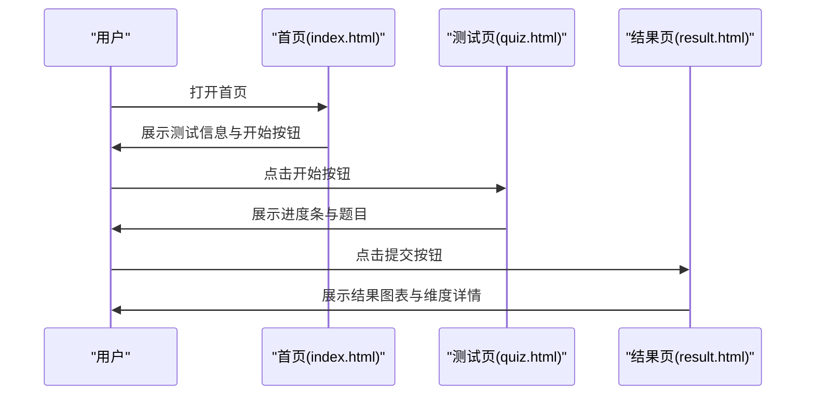

**图表来源**
- [index.html](file://index.html)
- [quiz.html](file://quiz.html)
- [result.html](file://result.html)

**章节来源**
- [index.html](file://index.html)
- [quiz.html](file://quiz.html)
- [result.html](file://result.html)

### 卡片布局系统
- 统一卡片：.card 提供圆角、阴影、内边距与 hover 过渡，适用于首页信息卡、测试卡片、结果卡片与目录卡片
- 卡片变体：目录卡片 .catalog-card 支持悬停提升与阴影增强；结果卡片 .dimension-card 带有左侧主题色强调线
- 响应式卡片：在移动端缩小内边距与标题字号，保证阅读体验

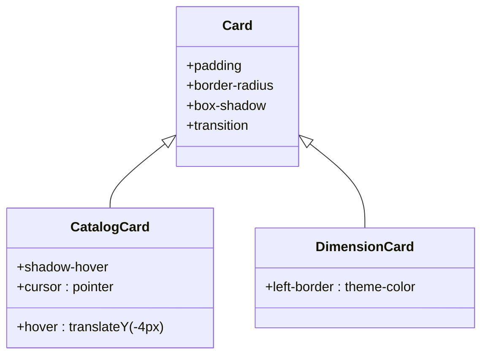

**图表来源**
- [css/style.css](file://css/style.css)
- [index.html](file://index.html)
- [result.html](file://result.html)
- [catalog.html](file://catalog.html)

**章节来源**
- [css/style.css](file://css/style.css)
- [index.html](file://index.html)
- [result.html](file://result.html)
- [catalog.html](file://catalog.html)

### 按钮样式体系
- 基础按钮：.btn 提供统一的尺寸、圆角、过渡与对齐方式
- 主按钮：.btn-primary 使用渐变背景与阴影，hover 时提升与阴影增强
- 次按钮：.btn-secondary 白色背景与主题色边框，hover 时反转色彩
- 危险按钮：.btn-danger 使用警示色
- 禁用态：.btn:disabled 降低透明度并移除交互变换

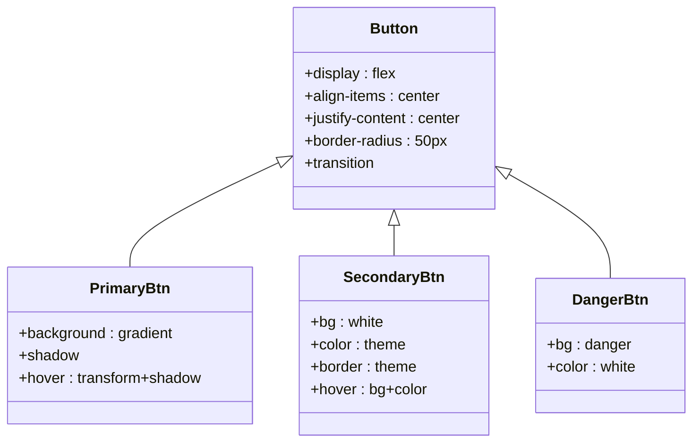

**图表来源**
- [css/style.css](file://css/style.css)

**章节来源**
- [css/style.css](file://css/style.css)

### 表单控件设计
- 单选按钮组：.radio-group 采用垂直布局，.radio-item 支持 hover 与选中态，隐藏原生 radio，通过自定义样式实现
- 量表题选项：.scale-options 采用 Flex 布局，.scale-btn 支持 hover 与选中态，选中时应用渐变背景与白色文字
- 文件上传：.file-upload 使用虚线边框与图标，hover 时高亮与背景色变化
- 表单组：.form-group 统一 label 与输入框的间距与过渡

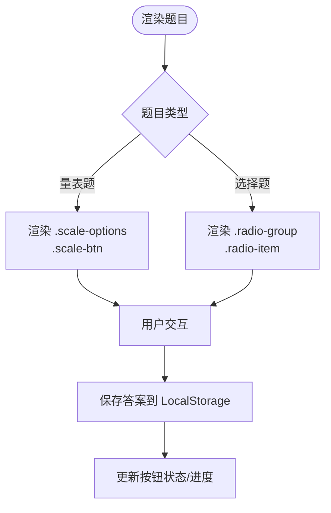

**图表来源**
- [quiz.html](file://quiz.html)
- [css/style.css](file://css/style.css)

**章节来源**
- [quiz.html](file://quiz.html)
- [css/style.css](file://css/style.css)

### 结果页与可视化
- 结果头部：展示完成状态与主要结果
- 图表区域：雷达图与柱状图并排展示维度得分分布，使用 Chart.js 渲染
- 维度卡片：按得分排序展示维度详情，顶部维度加粗与强调线突出
- 操作按钮：PDF 报告生成、分享海报生成与重新测试
- 动画特效：烟花特效展示，模态框展示海报预览
- 小人形象：根据测试结果展示对应的个性化小人形象

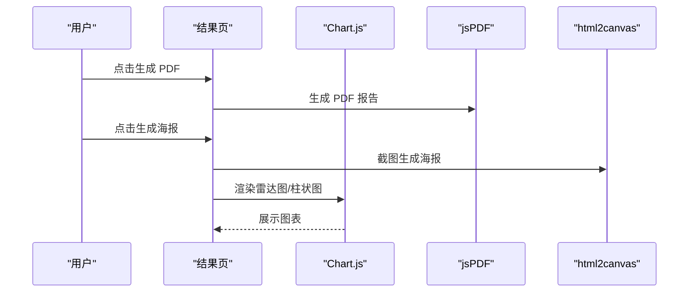

**图表来源**
- [result.html](file://result.html)

**章节来源**
- [result.html](file://result.html)

### 管理后台与数据流
- 标签页：UI 界面、文字与配图、题目管理三类配置
- UI 配置：颜色、字体、圆角、最大宽度等，支持预览、保存、应用与重置
- 题目管理：下载模板、上传 JSON、验证格式、预览与应用
- 数据验证：QuizValidator.validate 对题目数据进行结构与字段校验

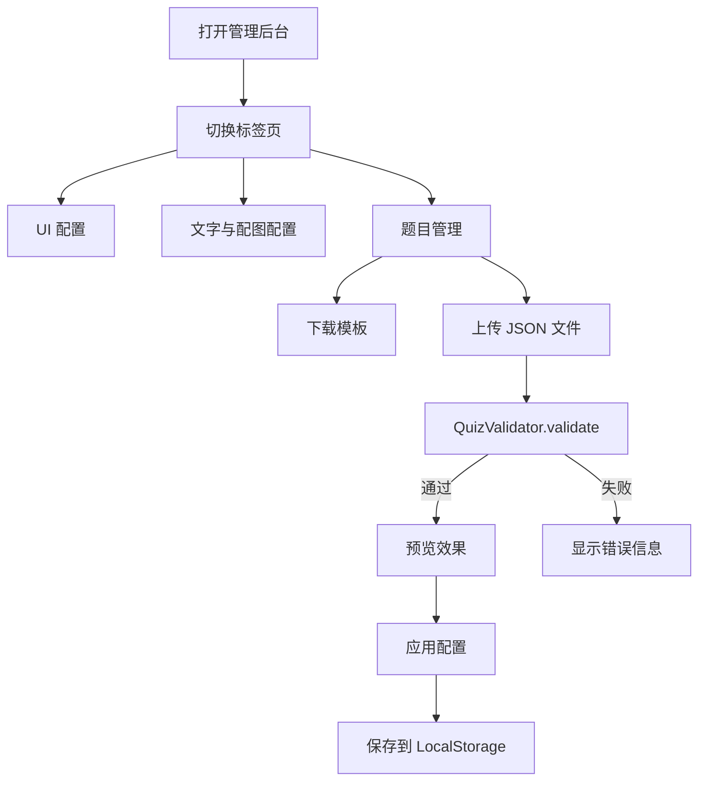

**图表来源**
- [admin.html](file://admin.html)
- [js/utils.js](file://js/utils.js)

**章节来源**
- [admin.html](file://admin.html)
- [js/utils.js](file://js/utils.js)

### 目录系统设计
- 网格布局：.catalog-grid 实现响应式卡片网格，支持自动列数调整
- 卡片设计：.catalog-card 提供悬停效果与阴影增强，包含图标区域与内容区域
- 当前测试：.catalog-card-content 展示测试名称与描述，支持动态更新
- 响应式适配：在移动端调整网格列数与内边距，确保良好阅读体验

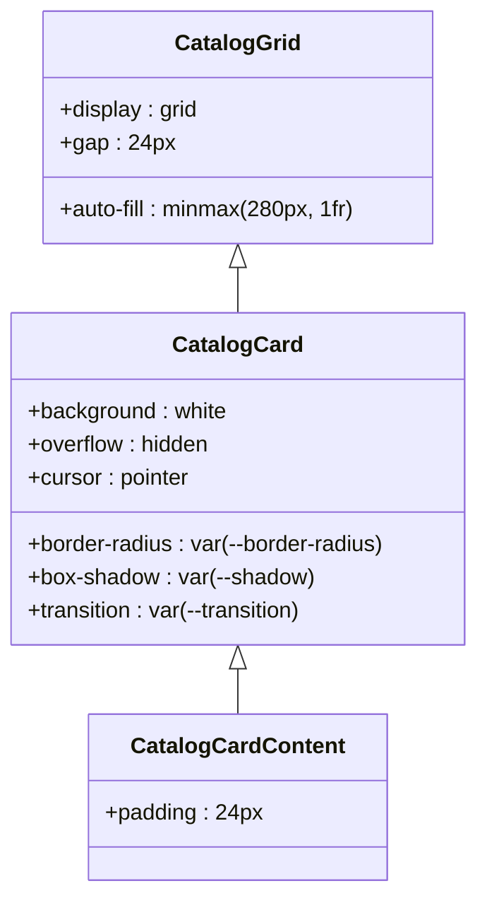

**图表来源**
- [css/style.css](file://css/style.css)
- [catalog.html](file://catalog.html)

**章节来源**
- [css/style.css](file://css/style.css)
- [catalog.html](file://catalog.html)

### 动画与特效系统
- 淡入动画：.fade-in 使用 CSS 动画实现元素渐显效果
- 脉冲动画：.pulse 实现元素的轻微缩放动画，用于按钮强调
- 模态框动画：.modal-overlay 和 .modal 实现弹窗的淡入淡出与缩放效果
- 烟花特效：自定义 CSS 动画实现烟花爆炸效果，用于结果页庆祝
- 轮播动画：.dimensions-carousel 实现卡片轮播的平滑过渡效果

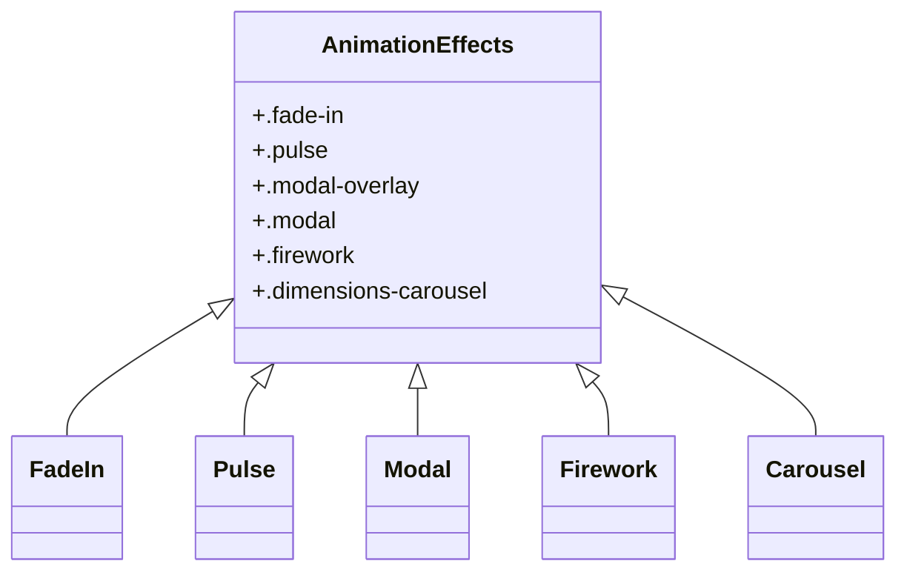

**图表来源**
- [css/style.css](file://css/style.css)
- [index.html](file://index.html)
- [result.html](file://result.html)

**章节来源**
- [css/style.css](file://css/style.css)
- [index.html](file://index.html)
- [result.html](file://result.html)

### 可视化图表系统
- 雷达图：使用 Chart.js 创建五维爱语的雷达图可视化
- 柱状图：展示各维度的得分分布
- 响应式图表：图表容器支持响应式布局，适应不同屏幕尺寸
- 数据处理：根据用户答案计算各维度得分，进行排序与展示

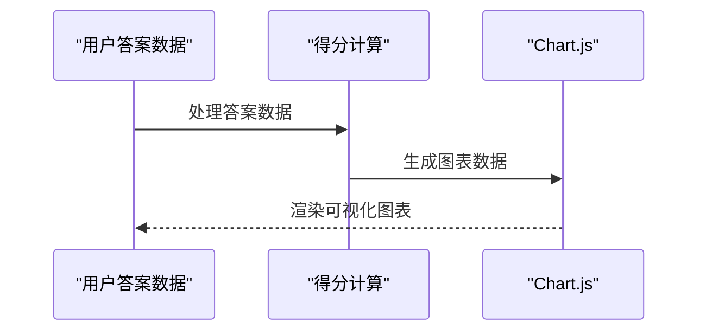

**图表来源**
- [result.html](file://result.html)

**章节来源**
- [result.html](file://result.html)

### 轮播组件设计
- 横向滑动轮播：.dimensions-carousel 实现维度卡片的水平滑动展示
- 响应式适配：根据屏幕宽度自动调整每页显示的卡片数量（1-3张）
- 导航控制：左右箭头按钮与底部指示点，支持手动与自动切换
- 动画过渡：使用 CSS transition 实现平滑的滑动效果

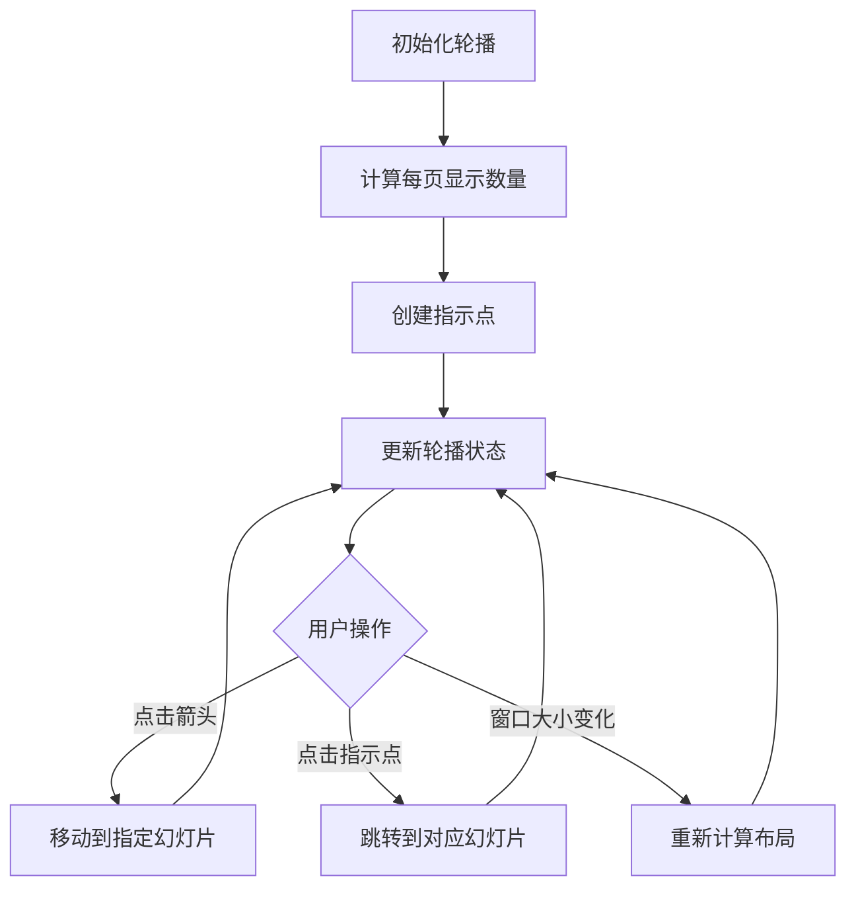

**图表来源**
- [index.html](file://index.html)

**章节来源**
- [index.html](file://index.html)

## 依赖关系分析
- 页面依赖：五个页面均依赖 css/style.css 与 js/utils.js
- 工具依赖：页面通过 StorageUtil 读写测试数据与 UI 配置，通过 QuizValidator 校验题目数据
- 数据依赖：index.html、quiz.html、result.html 依赖 data/default-quiz.json；admin.html 依赖 data/template.json
- 外部库：result.html 引入 Chart.js、html2canvas、jsPDF

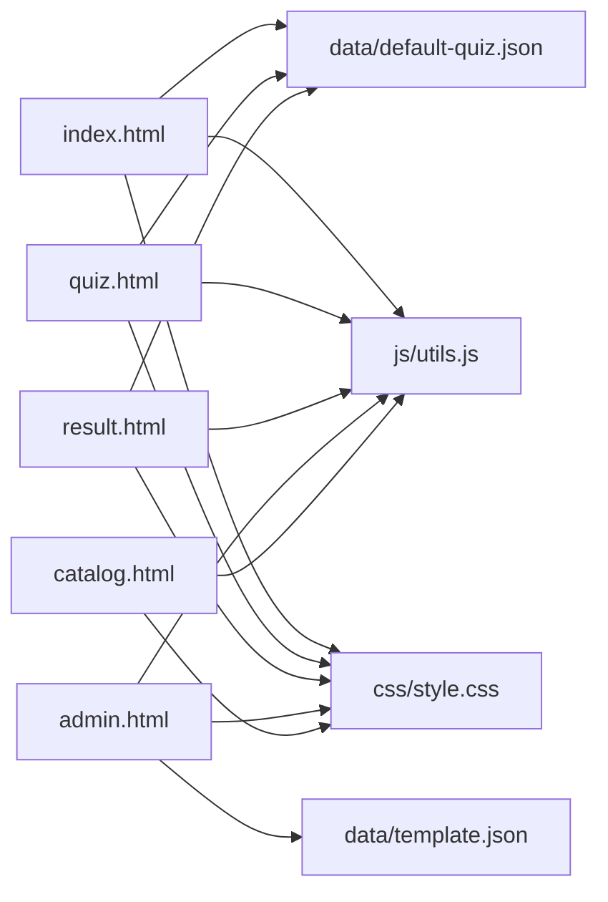

**图表来源**
- [index.html](file://index.html)
- [quiz.html](file://quiz.html)
- [result.html](file://result.html)
- [admin.html](file://admin.html)
- [catalog.html](file://catalog.html)
- [css/style.css](file://css/style.css)
- [js/utils.js](file://js/utils.js)
- [data/default-quiz.json](file://data/default-quiz.json)
- [data/template.json](file://data/template.json)

**章节来源**
- [index.html](file://index.html)
- [quiz.html](file://quiz.html)
- [result.html](file://result.html)
- [admin.html](file://admin.html)
- [catalog.html](file://catalog.html)
- [css/style.css](file://css/style.css)
- [js/utils.js](file://js/utils.js)
- [data/default-quiz.json](file://data/default-quiz.json)
- [data/template.json](file://data/template.json)

## 性能考量
- 防抖：Utils.debounce 提供防抖函数，可用于高频事件（如窗口 resize、搜索等）
- 本地存储：StorageUtil 封装 localStorage，避免频繁网络请求，提高页面加载速度
- 图表懒加载：结果页按需引入 Chart.js，减少首屏资源占用
- 图像懒加载：建议在目录页与结果页对图片资源进行懒加载优化
- 动画性能：进度条与按钮过渡使用 CSS transition，避免 JavaScript 动画导致的掉帧
- 字体优化：使用系统字体族，减少字体加载时间
- 模态框优化：使用 opacity 和 visibility 控制模态框显示，避免阻塞布局
- 轮播性能：使用 transform 替代 position 属性，提升轮播动画性能

## 故障排除指南
- 数据加载失败：index.html 与 quiz.html 在加载 default-quiz.json 失败时回退到内置默认数据；admin.html 在下载模板失败时提示错误
- 题目验证失败：admin.html 通过 QuizValidator.validate 输出具体错误列表，便于修正 JSON 格式
- 本地存储异常：StorageUtil 对 set/get 包裹 try/catch，出现异常时返回默认值并记录错误日志
- 结果页无数据：result.html 在未找到用户答案时提示重新答题并跳转
- UI 配置应用失败：admin.html 中 applyUIConfig 函数负责将配置写入 CSS 变量，若失败检查浏览器控制台错误
- 跨域问题：admin.html 通过绝对路径访问数据文件，确保通过正确域名访问
- 动画兼容性：检查浏览器对 CSS 动画属性的支持情况

**章节来源**
- [index.html](file://index.html)
- [quiz.html](file://quiz.html)
- [result.html](file://result.html)
- [admin.html](file://admin.html)
- [js/utils.js](file://js/utils.js)

## 结论
该用户界面模块以简洁高效的静态架构实现了完整的心理测试流程，结合 CSS 变量系统与主题定制机制，提供了良好的可扩展性与维护性。进度跟踪动画、卡片布局、按钮体系与表单控件共同构建了清晰一致的用户体验。通过管理后台的数据与 UI 配置能力，系统能够快速适配不同主题与内容需求。新增的完整UI配置系统使得主题定制更加便捷，响应式设计优化了移动端体验。动画特效、可视化图表与社交分享功能进一步提升了用户体验。建议在后续版本中进一步优化移动端交互细节、引入更多动画与过渡效果，并完善文字配置的预览功能。

## 附录

### 样式定制指南
- 颜色主题配置：通过管理后台的 UI 配置面板调整主色、辅色与背景色，或直接修改 :root 中的 CSS 变量
- 字体大小调整：通过 UI 配置中的字体族与字号设置，或在 :root 中调整 --font-family 与标题字号
- 间距优化：通过 --border-radius 与 --max-width 调整圆角与容器宽度，适配不同设备与内容密度
- 动画定制：通过修改 CSS 变量 --transition 调整动画时长与缓动效果

**章节来源**
- [admin.html](file://admin.html)
- [js/utils.js](file://js/utils.js)
- [css/style.css](file://css/style.css)

### 移动端适配策略
- 触摸交互优化：增大按钮与可点击区域，确保在移动端易于点击
- 字体缩放：在 768px 断点下自动调整字体大小，保证可读性
- 布局调整：移动端采用垂直布局与单列网格，减少横向滚动
- 动画优化：移动端禁用复杂动画，使用简单的过渡效果
- 性能优化：移动端减少图片数量，使用更小的图片尺寸

**章节来源**
- [css/style.css](file://css/style.css)

### 最佳实践
- 使用 CSS 变量统一管理主题，避免硬编码颜色与尺寸
- 通过 LocalStorage 持久化用户进度，提供断点续答体验
- 在管理后台提供预览功能，确保配置变更的即时可见性
- 对外部库按需引入，减少首屏资源体积
- 合理使用响应式设计，在不同设备上提供最佳用户体验
- 优化动画性能，避免影响页面流畅度
- 使用语义化 HTML 结构，提升可访问性
- 实现错误处理与降级方案，确保用户体验的连续性