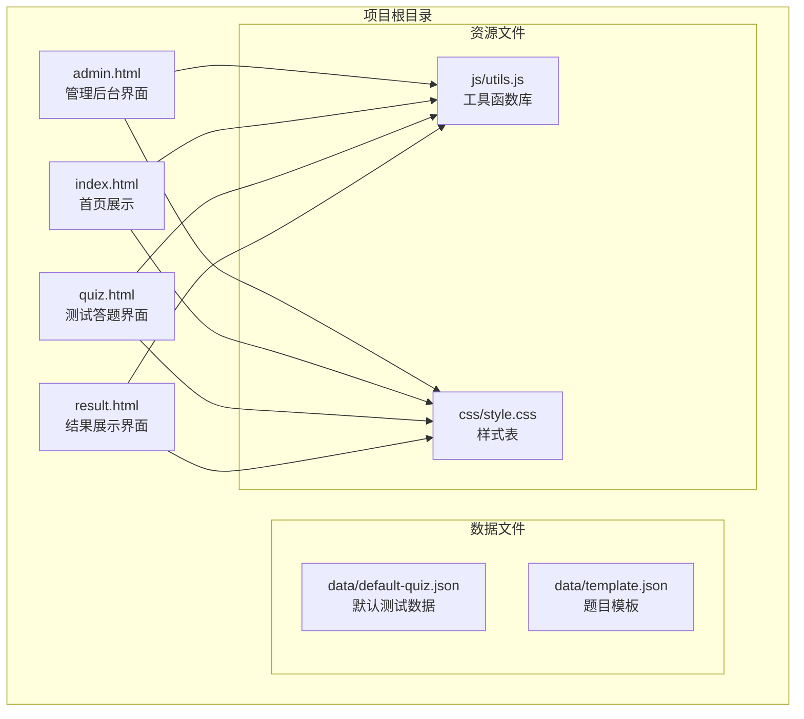
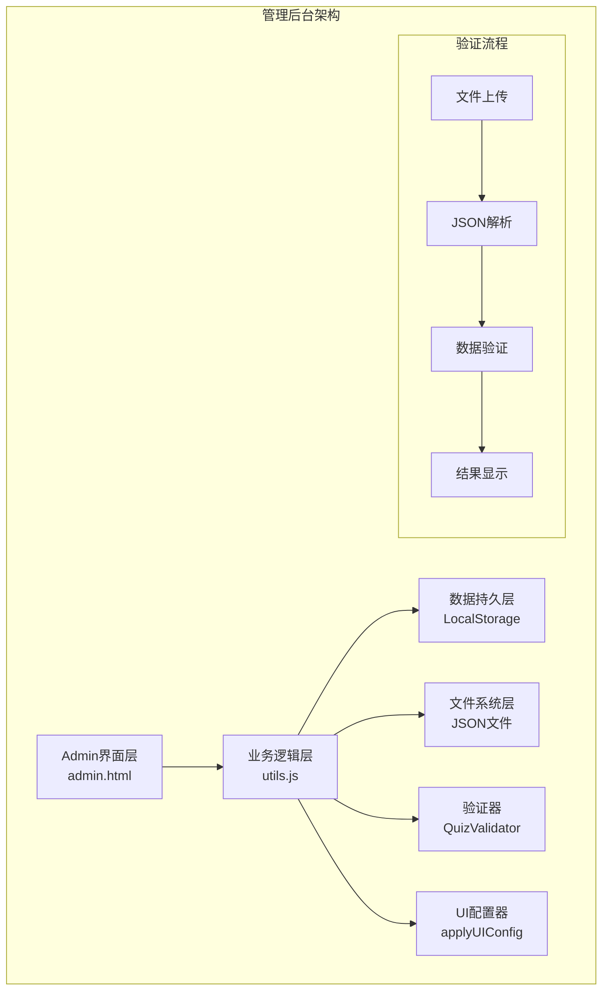
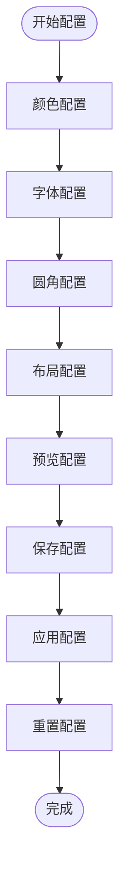
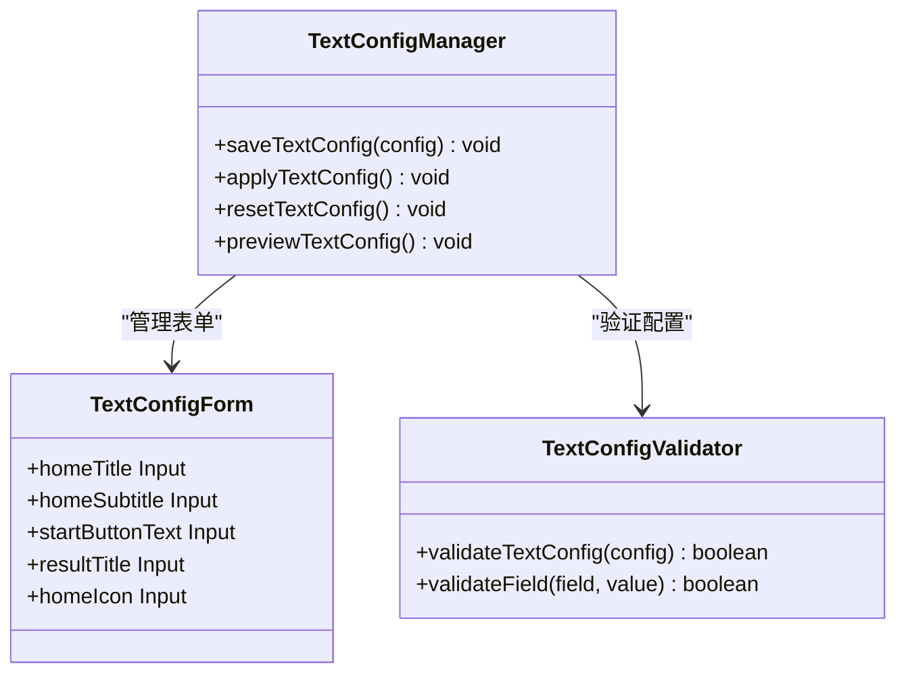
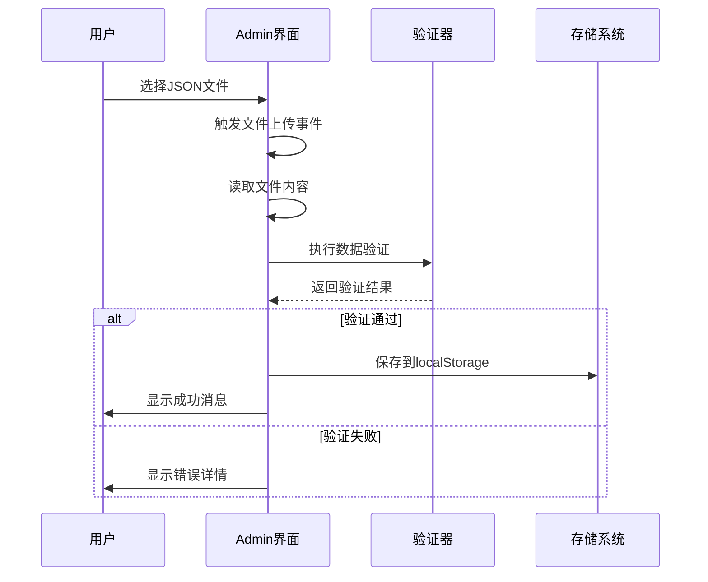
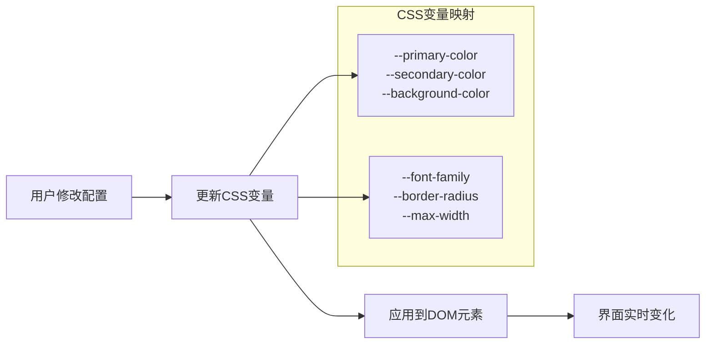
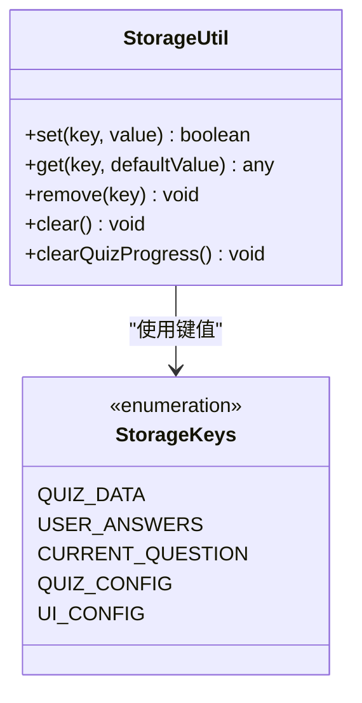
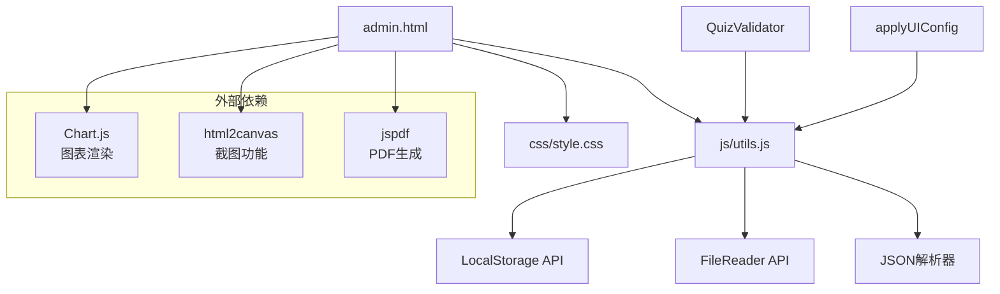

# 管理后台模块

<cite>
**本文档引用的文件**
- [admin.html](file://admin.html)
- [js/utils.js](file://js/utils.js)
- [data/template.json](file://data/template.json)
- [data/default-quiz.json](file://data/default-quiz.json)
- [css/style.css](file://css/style.css)
- [index.html](file://index.html)
</cite>

## 更新摘要
**变更内容**
- 全新开发管理后台模块，包含UI配置、文字配置、题目管理三大功能模块
- 支持JSON模板下载和上传验证功能
- 实现实时预览机制和配置应用系统
- 提供完整的测试数据导入导出功能
- 新增标签页导航系统，提供更好的用户体验
- 新增完整的LocalStorage数据持久化机制
- 新增JSON数据验证器，确保数据完整性
- 新增防抖函数等性能优化工具

## 目录
1. [简介](#简介)
2. [项目结构](#项目结构)
3. [核心组件](#核心组件)
4. [架构概览](#架构概览)
5. [详细组件分析](#详细组件分析)
6. [依赖关系分析](#依赖关系analysis)
7. [性能考虑](#性能考虑)
8. [故障排除指南](#故障排除指南)
9. [结论](#结论)
10. [附录](#附录)

## 简介
管理后台模块是心理测试系统的核心管理界面，经过全新开发后，现在提供了完整的测试数据管理、界面定制和实时预览功能。该模块支持UI界面配置、文字配置、题目管理、测试数据导入导出、实时预览等高级功能，为管理员提供了专业级的测试内容管理体验。

本模块采用现代化的前端技术栈，基于纯JavaScript实现，无需后端服务器即可运行。系统包含完整的数据验证机制、错误处理机制和用户友好的界面设计，支持多种测试类型的灵活配置。

## 项目结构
心理测试项目采用静态网站架构，所有功能均通过前端技术实现：

**图表来源**
- [admin.html:1-411](file://admin.html#L1-L411)
- [js/utils.js:1-250](file://js/utils.js#L1-L250)
- [css/style.css:1-731](file://css/style.css#L1-L731)

**章节来源**
- [admin.html:1-411](file://admin.html#L1-L411)
- [js/utils.js:1-250](file://js/utils.js#L1-L250)
- [css/style.css:1-731](file://css/style.css#L1-L731)

## 核心组件
管理后台模块经过全新开发，现在包含多个核心组件，每个组件都有明确的功能职责：

### 1. UI配置管理组件
提供完整的界面定制功能，支持主题色、背景色、字体、圆角等视觉属性的实时配置和应用。

### 2. 文字配置管理组件  
提供文本内容定制功能，支持首页标题、副标题、按钮文字等文本元素的配置和预览。

### 3. 题目管理组件
提供测试数据管理功能，支持题目模板下载、JSON文件上传、数据验证和实时预览。

### 4. 实时预览组件
提供即时视觉反馈功能，支持配置修改后的实时效果展示和应用。

### 5. 标签页导航组件
提供多标签页界面，支持UI配置、文字配置、题目管理等功能模块的切换。

**章节来源**
- [admin.html:28-163](file://admin.html#L28-L163)
- [js/utils.js:55-126](file://js/utils.js#L55-L126)

## 架构概览
管理后台采用模块化的前端架构设计，各组件之间通过清晰的接口进行通信：

**图表来源**
- [admin.html:177-407](file://admin.html#L177-L407)
- [js/utils.js:55-126](file://js/utils.js#L55-L126)
- [js/utils.js:234-244](file://js/utils.js#L234-L244)

系统采用事件驱动的设计模式，通过DOM事件监听器响应用户操作，通过异步API处理数据请求，支持完整的配置管理生命周期。

**章节来源**
- [admin.html:177-407](file://admin.html#L177-L407)
- [js/utils.js:17-50](file://js/utils.js#L17-L50)

## 详细组件分析

### UI配置管理组件分析
UI配置管理组件是管理后台的核心功能之一，提供了完整的界面定制能力。

#### 配置项设计
组件支持以下UI配置选项：

1. **颜色配置**：主题色、辅助色、背景色的颜色选择器
2. **字体配置**：支持多种中文字体的选择
3. **圆角配置**：提供不同圆角大小的预设选项
4. **布局配置**：最大宽度等布局相关设置

**图表来源**
- [admin.html:35-79](file://admin.html#L35-L79)
- [js/utils.js:207-244](file://js/utils.js#L207-L244)

#### 配置应用机制
配置管理采用了"暂存-预览-应用"的工作流程：

1. **暂存配置**：用户修改配置后，配置被保存到localStorage
2. **实时预览**：用户可以立即看到配置效果
3. **确认应用**：用户确认后，配置正式生效并应用于所有页面

**章节来源**
- [admin.html:293-392](file://admin.html#L293-L392)
- [js/utils.js:226-244](file://js/utils.js#L226-L244)

### 文字配置管理组件分析
文字配置管理组件提供了文本内容定制功能，支持多种文本元素的配置。

#### 配置项设计
组件支持以下文字配置选项：

1. **首页标题**：主页面的标题文本
2. **首页副标题**：主页面的副标题文本  
3. **开始按钮文字**：测试开始按钮的显示文字
4. **结果页标题**：测试结果页面的标题文本
5. **首页图标**：主页面的emoji或图标符号

**图表来源**
- [admin.html:82-120](file://admin.html#L82-L120)
- [js/utils.js:17-50](file://js/utils.js#L17-L50)

#### 配置验证机制
文字配置组件提供了基础的验证机制：

- **必填字段验证**：关键文本字段的完整性检查
- **格式验证**：确保文本内容符合预期格式
- **长度限制**：防止过长的文本内容影响界面显示

**章节来源**
- [admin.html:337-359](file://admin.html#L337-L359)

### 题目管理组件分析
题目管理组件提供了完整的测试数据管理功能，支持多种操作。

#### 文件上传处理流程

**图表来源**
- [admin.html:252-291](file://admin.html#L252-L291)
- [js/utils.js:165-179](file://js/utils.js#L165-L179)

#### 题目数据结构
系统支持的标准题目数据结构包含以下部分：

1. **基本信息**：测试名称、理论基础、题目数量统计
2. **维度定义**：测试的各个维度及其描述
3. **量表题**：标准化评分的量表题目
4. **选择题**：多选项的场景选择题目

**章节来源**
- [admin.html:122-163](file://admin.html#L122-L163)
- [data/default-quiz.json:1-235](file://data/default-quiz.json#L1-L235)

### 实时预览机制分析
实时预览机制为管理员提供了即时的视觉反馈，确保配置修改能够及时反映在界面上。

#### 预览实现原理

**图表来源**
- [js/utils.js:234-244](file://js/utils.js#L234-L244)
- [css/style.css:7-20](file://css/style.css#L7-L20)

#### 预览功能范围
- **UI配置预览**：颜色、字体、圆角等视觉属性
- **测试数据预览**：题目数量、维度信息等数据展示
- **文字配置预览**：标题、副标题、按钮文字等文本内容

**章节来源**
- [admin.html:293-364](file://admin.html#L293-L364)
- [css/style.css:427-465](file://css/style.css#L427-L465)

### 数据持久化机制分析
管理后台模块实现了完整的数据持久化机制，确保用户配置和测试数据的安全存储。

#### 存储键值管理
系统使用统一的存储键值管理机制：

1. **QUIZ_DATA**：存储测试数据
2. **USER_ANSWERS**：存储用户答案
3. **CURRENT_QUESTION**：存储当前题目索引
4. **QUIZ_CONFIG**：存储测试配置
5. **UI_CONFIG**：存储UI配置

#### 存储工具类设计

**图表来源**
- [js/utils.js:6-50](file://js/utils.js#L6-L50)

**章节来源**
- [js/utils.js:6-50](file://js/utils.js#L6-L50)

### JSON数据验证器分析
系统内置了完整的JSON数据验证器，确保上传的测试数据格式正确。

#### 验证规则设计
验证器支持以下验证规则：

1. **必填字段验证**：测试名称、题目数量等关键字段
2. **维度定义验证**：维度ID和名称的完整性
3. **量表题验证**：题目ID、维度ID、题目文本的完整性
4. **选择题验证**：选项文本和维度映射的有效性

#### 错误处理机制
验证器提供详细的错误信息：

- **具体错误位置**：指出错误发生在数据的哪一部分
- **错误类型分类**：区分不同类型的验证错误
- **用户友好提示**：提供易于理解的错误描述

**章节来源**
- [js/utils.js:55-126](file://js/utils.js#L55-L126)

## 依赖关系分析
管理后台模块的依赖关系相对简单，主要依赖于工具函数库和浏览器API。

**图表来源**
- [admin.html:171](file://admin.html#L171)
- [result.html:8-11](file://result.html#L8-L11)

### 内部依赖关系
- **admin.html** 依赖 **utils.js** 提供的所有功能
- **utils.js** 依赖浏览器原生API（LocalStorage、FileReader等）
- **样式文件** 依赖CSS变量系统实现动态主题切换

### 外部依赖关系
- **Chart.js**：用于结果页面的图表渲染
- **html2canvas**：用于生成分享海报
- **jspdf**：用于生成PDF报告

**章节来源**
- [admin.html:171](file://admin.html#L171)
- [result.html:8-11](file://result.html#L8-L11)

## 性能考虑
管理后台模块在设计时充分考虑了性能优化：

### 1. 数据缓存策略
- 使用LocalStorage缓存测试数据，避免重复网络请求
- 实现数据变更检测，仅在必要时更新界面
- 采用防抖机制优化频繁操作的响应速度

### 2. 内存管理
- 及时释放文件对象引用，防止内存泄漏
- 合理使用DOM操作，减少重绘重排
- 优化数组和对象的创建与销毁

### 3. 网络优化
- 支持离线使用，所有数据本地存储
- 异步加载外部资源，不影响核心功能
- 实现渐进式加载，提升用户体验

### 4. 工具函数优化
- 防抖函数减少高频事件处理开销
- 格式化函数提供统一的数据处理接口
- 平滑滚动优化用户体验

**章节来源**
- [js/utils.js:131-202](file://js/utils.js#L131-L202)

## 故障排除指南

### 常见问题及解决方案

#### 1. 文件上传失败
**症状**：选择文件后无响应或显示错误
**可能原因**：
- 文件格式不是JSON格式
- 文件损坏或编码错误
- 浏览器兼容性问题

**解决方法**：
- 确认文件扩展名为.json
- 检查文件是否完整且未被修改
- 更换浏览器或更新到最新版本

#### 2. 数据验证错误
**症状**：上传文件后显示验证失败
**常见错误类型**：
- 缺少必需字段（如quiz_name、nbr_question）
- 维度定义不完整
- 量表题或选择题格式错误

**解决方法**：
- 按照模板文件格式修正数据
- 检查字段名称拼写
- 确保所有必需字段都已填写

#### 3. 配置应用无效
**症状**：修改配置后界面无变化
**可能原因**：
- 浏览器禁用了LocalStorage
- CSS变量未正确更新
- 页面未刷新

**解决方法**：
- 检查浏览器设置中的LocalStorage权限
- 刷新页面查看配置是否生效
- 确认CSS变量映射正确

#### 4. 预览功能异常
**症状**：预览按钮点击无反应
**解决方法**：
- 检查浏览器控制台是否有JavaScript错误
- 确认utils.js文件正常加载
- 清除浏览器缓存后重试

#### 5. 数据重置失败
**症状**：重置题目配置时出现错误
**可能原因**：
- 通过错误的URL访问管理后台
- 网络请求失败
- 文件读取异常

**解决方法**：
- 确保通过 http://localhost:8080/admin.html 访问
- 检查网络连接状态
- 重新启动浏览器后重试

**章节来源**
- [admin.html:283-291](file://admin.html#L283-L291)
- [js/utils.js:165-179](file://js/utils.js#L165-L179)

## 结论
管理后台模块经过全新开发后，已成为一个功能完整、设计合理的测试数据管理工具。它提供了直观的用户界面、强大的数据验证机制、灵活的配置管理功能和专业的实时预览能力。

### 主要优势
1. **功能全面**：涵盖UI配置、文字配置、题目管理的各个方面
2. **用户体验优秀**：标签页导航、实时预览、一键应用等人性化设计
3. **技术先进**：基于现代前端技术，支持离线使用和响应式设计
4. **扩展性强**：模块化架构便于功能扩展和维护
5. **数据安全**：完整的LocalStorage持久化机制
6. **性能优化**：防抖函数、缓存策略等性能优化措施

### 技术特色
- 基于纯前端技术实现，无需服务器支持
- 完整的离线使用能力
- 实时预览和应用机制
- 模块化的代码结构
- 严格的JSON数据验证
- 统一的存储键值管理

该模块为心理测试系统的管理和维护提供了强有力的技术支撑，是系统成功的关键组成部分。

## 附录

### 使用指南

#### 创建新的测试模板
1. 点击"下载题目模板"按钮获取标准格式
2. 在模板基础上修改测试名称、维度信息
3. 添加量表题和选择题内容
4. 保存为.json文件并上传到系统

#### 批量导入题目
1. 准备符合格式规范的JSON文件
2. 点击"上传新题目"区域
3. 选择目标文件并确认上传
4. 查看验证结果并应用配置

#### 验证数据完整性
1. 系统自动进行格式验证
2. 检查必需字段是否完整
3. 确认维度与题目关联正确
4. 验证选项格式符合要求

#### 配置UI界面
1. 切换到"UI界面"标签页
2. 修改颜色、字体、圆角等配置
3. 点击"预览"按钮查看效果
4. 点击"保存"和"应用"按钮生效

#### 配置文字内容
1. 切换到"文字&配图"标签页
2. 修改首页标题、副标题等文本
3. 点击"预览"按钮查看效果
4. 点击"保存"和"应用"按钮生效

### 安全考虑
- 所有数据存储在客户端LocalStorage中
- 文件上传仅支持JSON格式
- 验证机制防止恶意数据注入
- 配置修改需要用户确认
- 防止XSS攻击的输入验证

### 性能优化建议
- 合理控制测试题目数量
- 定期清理不必要的历史数据
- 使用高效的JSON文件格式
- 避免频繁的大文件操作
- 利用防抖机制优化用户交互
- 启用浏览器缓存机制

### 开发者指南
- 所有配置数据通过LocalStorage持久化
- JSON验证器提供完整的数据校验
- 工具函数库包含常用辅助功能
- CSS变量系统实现动态主题切换
- 模块化设计便于功能扩展