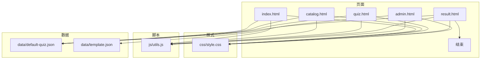
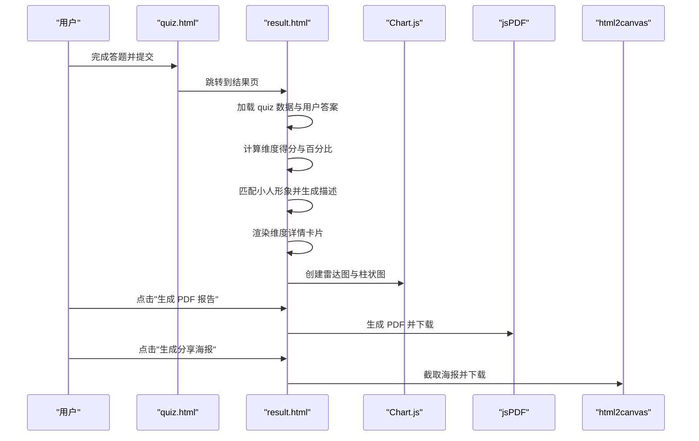
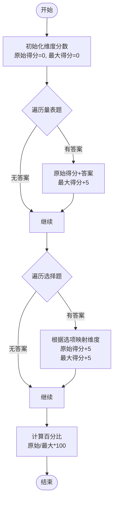
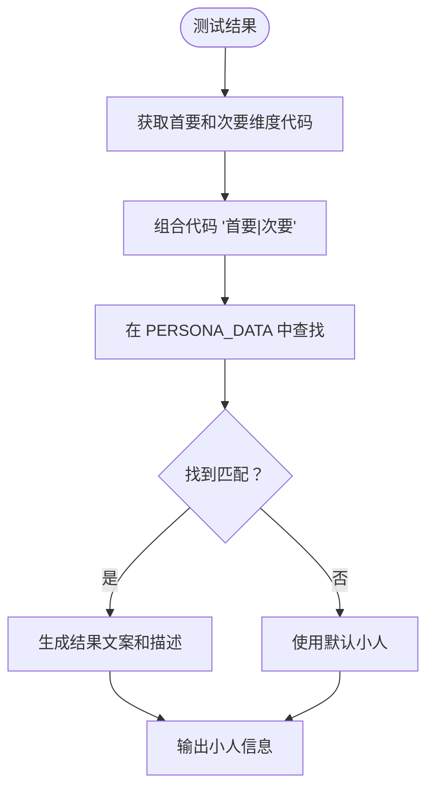
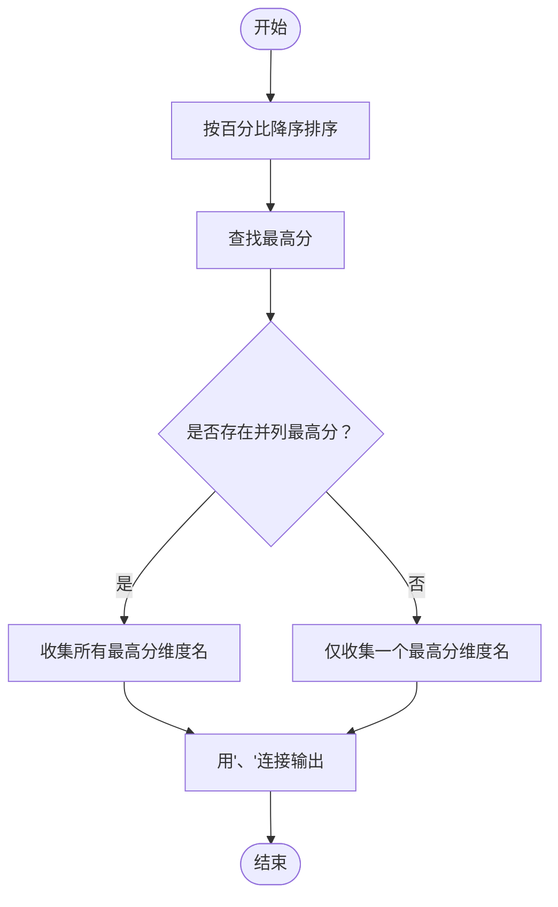
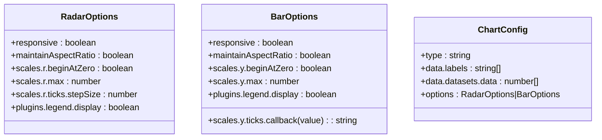
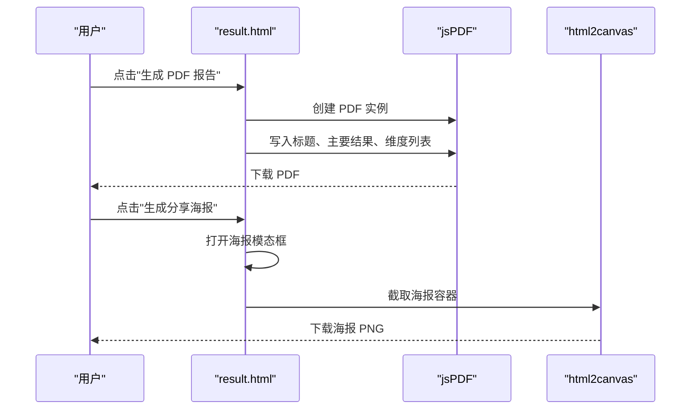
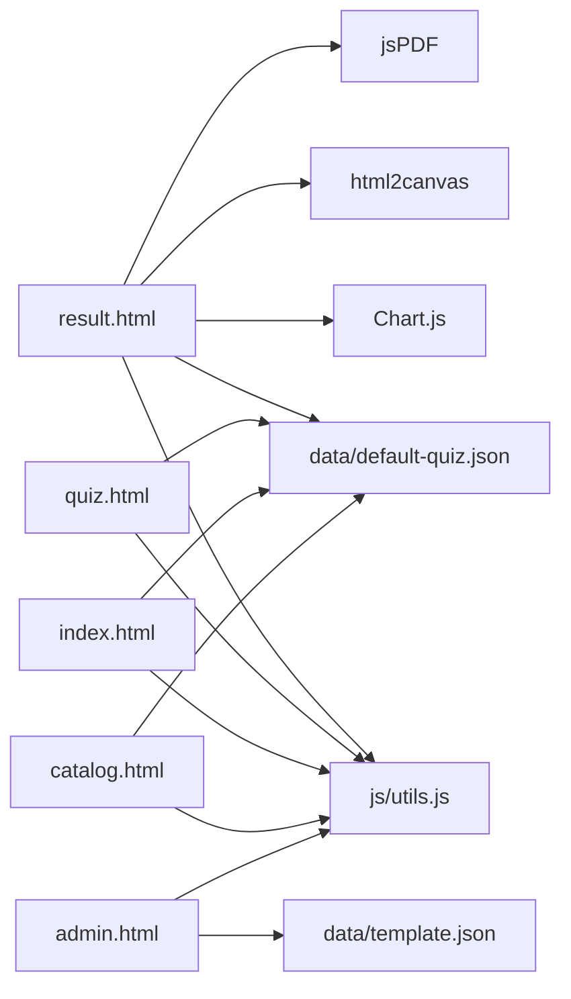

# 结果分析模块

<cite>
**本文引用的文件**
- [result.html](file://result.html)
- [quiz.html](file://quiz.html)
- [index.html](file://index.html)
- [js/utils.js](file://js/utils.js)
- [css/style.css](file://css/style.css)
- [data/default-quiz.json](file://data/default-quiz.json)
- [data/template.json](file://data/template.json)
- [admin.html](file://admin.html)
- [catalog.html](file://catalog.html)
</cite>

## 更新摘要
**变更内容**
- 新增雷达图可视化功能，使用 Chart.js 创建多维度得分雷达图
- 增强小人匹配系统，新增 PERSONA_DATA 映射表和海报展示功能
- 实现完整的 PDF 报告生成功能，支持双页布局和图表嵌入
- 新增海报截图功能，支持海报生成和下载
- 添加烟花庆祝特效，提升用户体验
- 优化图表配置，增强视觉效果和响应式设计

## 目录
1. [简介](#简介)
2. [项目结构](#项目结构)
3. [核心组件](#核心组件)
4. [架构总览](#架构总览)
5. [详细组件分析](#详细组件分析)
6. [依赖关系分析](#依赖关系分析)
7. [性能考量](#性能考量)
8. [故障排查指南](#故障排查指南)
9. [结论](#结论)
10. [附录](#附录)

## 简介
本文件为"结果分析模块"的综合技术文档，聚焦于多维度得分计算、百分比转换与排序、图表可视化（Chart.js 雷达图与柱状图）、小人匹配系统、结果解读与导出能力（PDF 报告、海报截图）。文档同时提供扩展指引，包括新增维度、自定义图表样式、扩展导出格式的方法路径与注意事项。结果分析模块是心理测试应用的核心组件，实现了从答题到结果展示的完整流程。

## 项目结构
该项目采用前端静态页面结构，核心页面与资源分布如下：
- 页面层：index.html、quiz.html、result.html、catalog.html、admin.html
- 样式层：css/style.css
- 工具层：js/utils.js（LocalStorage、校验、UI配置、通用工具）
- 数据层：data/default-quiz.json（默认测试数据）、data/template.json（题目模板）

**图表来源**
- [index.html](file://index.html)
- [catalog.html](file://catalog.html)
- [quiz.html](file://quiz.html)
- [result.html](file://result.html)
- [admin.html](file://admin.html)
- [css/style.css](file://css/style.css)
- [js/utils.js](file://js/utils.js)
- [data/default-quiz.json](file://data/default-quiz.json)
- [data/template.json](file://data/template.json)

**章节来源**
- [index.html](file://index.html)
- [catalog.html](file://catalog.html)
- [quiz.html](file://quiz.html)
- [result.html](file://result.html)
- [admin.html](file://admin.html)
- [css/style.css](file://css/style.css)
- [js/utils.js](file://js/utils.js)
- [data/default-quiz.json](file://data/default-quiz.json)
- [data/template.json](file://data/template.json)

## 核心组件
- 多维度得分计算与百分比转换：在结果页根据量表题与选择题的答案进行维度聚合，计算每个维度的原始得分与最大可能得分，进而得到百分比。
- 排序与主要结果提取：按百分比降序排列维度，支持并列最高分的处理。
- 小人匹配系统：基于测试结果匹配对应的卡通人物，生成个性化的结果描述。
- 图表可视化：使用 Chart.js 渲染雷达图与柱状图，配置响应式、刻度、颜色与交互。
- 维度详情卡片：展示维度名称、百分比、描述与进度条。
- 导出功能：PDF 报告（jsPDF）、海报截图（html2canvas）。
- 烟花特效：庆祝动画效果，提升用户体验。

**章节来源**
- [result.html](file://result.html)
- [js/utils.js](file://js/utils.js)

## 架构总览
结果分析模块的端到端流程如下：
- 用户在 quiz.html 完成答题，答案保存在本地存储。
- 跳转至 result.html，加载 quiz 数据与用户答案，计算维度得分与百分比。
- 基于结果匹配小人形象，生成个性化描述。
- 渲染雷达图、柱状图与维度详情卡片。
- 支持导出 PDF 报告与海报截图。

**图表来源**
- [quiz.html](file://quiz.html)
- [result.html](file://result.html)

## 详细组件分析

### 多维度得分计算与百分比转换
- 初始化维度分数：遍历 quiz 数据中的维度，初始化每个维度的原始得分与最大可能得分。
- 量表题计分：遍历量表题，将用户答案累加到对应维度；同时累加该题的最大可能得分（每题 5 分）。
- 选择题计分：遍历选择题，依据用户选择的选项映射到目标维度，给该维度加 5 分，并累加最大可能得分。
- 百分比计算：对每个维度，若最大可能得分大于 0，则百分比 = 原始得分 / 最大可能得分；否则为 0。

**图表来源**
- [result.html](file://result.html)

**章节来源**
- [result.html](file://result.html)

### 小人匹配系统
- 小人数据映射：基于首要和次要爱语维度代码组合，匹配对应的卡通人物信息。
- 维度代码映射：将维度ID映射为单字母代码（W/T/S/G/P）。
- 结果生成：根据匹配到的小人生成个性化的结果文案和描述。
- 图像展示：使用 assets/persona/ 目录下的小人图片。

**图表来源**
- [result.html](file://result.html)

**章节来源**
- [result.html](file://result.html)

### 排序与主要结果提取
- 对维度按百分比降序排序，用于维度详情卡片顺序与主要结果展示。
- 主要结果：找出最高分维度，支持并列多个维度，以"维度名1、维度名2"形式展示。

**图表来源**
- [result.html](file://result.html)

**章节来源**
- [result.html](file://result.html)

### 图表可视化（Chart.js 雷达图与柱状图）
- 雷达图
  - 数据：维度名称为标签，百分比为数据点。
  - 样式：填充透明度、描边颜色、点样式、图例隐藏。
  - 坐标轴：r 轴范围 0-100，步长 20。
  - 响应式：开启响应式与保持纵横比。
- 柱状图
  - 数据：维度名称为标签，百分比为柱高。
  - 样式：颜色数组、边框颜色、圆角、图例隐藏。
  - Y 轴：0-100，刻度回调显示百分号。
  - 响应式：开启响应式与保持纵横比。

**图表来源**
- [result.html](file://result.html)

**章节来源**
- [result.html](file://result.html)

### 维度详情卡片渲染
- 排序：按百分比降序生成卡片列表。
- 样式：第一名为突出样式（加粗、左侧加粗边框、渐变背景），其余卡片按百分比宽度绘制进度条。
- 内容：维度名称、百分比、描述。

**章节来源**
- [result.html](file://result.html)

### 导出功能实现
- PDF 报告（jsPDF）
  - 标题、主要结果、各维度得分列表。
  - 保存为 A4 纵向 PDF。
  - 支持双页布局，第一页包含图表，第二页包含详细解读。
- 海报截图（html2canvas）
  - 截取包含结果的海报容器，生成 PNG 并下载。
- 数据格式化
  - 百分比保留一位小数，统一格式化字符串。

**图表来源**
- [result.html](file://result.html)

**章节来源**
- [result.html](file://result.html)

### 烟花特效系统
- 烟花粒子系统：使用 CSS 动画创建爆炸效果。
- 上升轨迹：模拟烟花发射轨迹。
- 动态生成：随机颜色、位置和动画时长。
- 自动清理：动画结束后自动移除 DOM 元素。

**章节来源**
- [result.html](file://result.html)

### 代码示例路径（不含具体代码内容）
- 新增维度
  - 在 quiz 数据中添加维度项，确保 dimension_id、dimension_name、description 完整。
  - 参考路径：[data/default-quiz.json](file://data/default-quiz.json)，[data/template.json](file://data/template.json)
- 自定义图表样式
  - 修改雷达图/柱状图的颜色数组、透明度、边框、圆角等。
  - 参考路径：[result.html](file://result.html)
- 扩展导出格式
  - PDF：调整 jsPDF 参数（如尺寸、方向、字体）。
  - 海报：调整 html2canvas 的 scale、backgroundColor 等。
  - 参考路径：[result.html](file://result.html)
- 小人匹配定制
  - 修改 PERSONA_DATA 映射表，添加新的小人形象。
  - 参考路径：[result.html](file://result.html)
- UI 配置与主题色
  - 通过管理后台或工具函数动态应用主题色、字体、圆角等。
  - 参考路径：[admin.html](file://admin.html)，[js/utils.js](file://js/utils.js)，[css/style.css](file://css/style.css)

**章节来源**
- [data/default-quiz.json](file://data/default-quiz.json)
- [data/template.json](file://data/template.json)
- [result.html](file://result.html)
- [admin.html](file://admin.html)
- [js/utils.js](file://js/utils.js)
- [css/style.css](file://css/style.css)

## 依赖关系分析
- result.html 依赖：
  - js/utils.js：LocalStorage、UI 配置、通用工具。
  - Chart.js：雷达图与柱状图。
  - html2canvas：海报截图。
  - jspdf：PDF 报告。
  - data/default-quiz.json：测试数据。
- quiz.html 依赖：
  - js/utils.js：LocalStorage、数据加载。
  - data/default-quiz.json：测试数据。
- index.html、catalog.html、admin.html：
  - js/utils.js：UI 配置与数据加载。
  - css/style.css：全局样式与响应式布局。

**图表来源**
- [result.html](file://result.html)
- [quiz.html](file://quiz.html)
- [index.html](file://index.html)
- [catalog.html](file://catalog.html)
- [admin.html](file://admin.html)
- [js/utils.js](file://js/utils.js)
- [data/default-quiz.json](file://data/default-quiz.json)
- [data/template.json](file://data/template.json)

**章节来源**
- [result.html](file://result.html)
- [quiz.html](file://quiz.html)
- [index.html](file://index.html)
- [catalog.html](file://catalog.html)
- [admin.html](file://admin.html)
- [js/utils.js](file://js/utils.js)
- [css/style.css](file://css/style.css)
- [data/default-quiz.json](file://data/default-quiz.json)
- [data/template.json](file://data/template.json)

## 性能考量
- 图表渲染：雷达图与柱状图在结果页一次性渲染，建议避免频繁重绘；可在数据变更时调用 Chart 实例的 update 方法。
- 响应式：两图均启用响应式，确保在移动端良好显示；注意在容器尺寸变化时调用 Chart.resize。
- 导出性能：html2canvas 截图与 jsPDF 生成 PDF 为异步操作，避免在主线程长时间阻塞；可考虑在用户空闲时触发或限制截图质量。
- 数据加载：优先使用本地缓存，减少网络请求；模板下载与文件上传采用异步处理。
- 小人图像：使用懒加载策略，避免大量图片同时加载影响性能。
- 烟花特效：使用定时器管理动画，避免内存泄漏；动画结束后及时清理 DOM 元素。

## 故障排查指南
- 无法加载测试数据
  - 检查 data/default-quiz.json 是否存在且格式正确。
  - 查看浏览器控制台是否有网络错误或 JSON 解析异常。
  - 参考路径：[index.html](file://index.html)，[quiz.html](file://quiz.html)
- 答案为空导致结果页异常
  - 确认 quiz.html 是否成功保存用户答案到本地存储。
  - 参考路径：[quiz.html](file://quiz.html)，[js/utils.js](file://js/utils.js)
- 图表不显示或空白
  - 检查 Canvas 容器是否存在且尺寸非零。
  - 确认 Chart.js 脚本已正确加载。
  - 参考路径：[result.html](file://result.html)
- 导出失败
  - PDF：确认 jsPDF 已正确引入。
  - 海报：确认 html2canvas 已正确引入，且容器内无跨域图片。
  - 参考路径：[result.html](file://result.html)
- 小人匹配失败
  - 检查 PERSONA_DATA 映射表是否包含对应的维度代码组合。
  - 确认 assets/persona/ 目录下存在对应的小人图片。
  - 参考路径：[result.html](file://result.html)
- 烟花特效异常
  - 检查 CSS 动画是否正常加载。
  - 确认定时器是否正确清理。
  - 参考路径：[result.html](file://result.html)

**章节来源**
- [index.html](file://index.html)
- [quiz.html](file://quiz.html)
- [result.html](file://result.html)
- [js/utils.js](file://js/utils.js)

## 结论
结果分析模块以清晰的数据流与简洁的前端技术栈实现了多维度心理测试的评分、可视化与导出。通过标准化的 quiz 数据结构与工具函数，系统具备良好的可扩展性。模块包含完整的心理测试流程，从答题到结果展示，再到报告导出，为用户提供了完整的体验。新增的雷达图可视化、小人匹配系统、PDF报告生成功能和海报截图功能进一步提升了用户体验。未来可在以下方面进一步增强：
- 增加维度解读文案的动态配置与本地化。
- 优化图表交互（悬停提示、点击钻取）。
- 扩展导出格式（Excel、CSV）与批量导出能力。
- 引入更丰富的统计指标（标准差、置信区间）。
- 增加小人匹配的个性化定制选项。
- 优化烟花特效的性能和可配置性。

## 附录

### 5 个心理维度的计算逻辑与权重说明
- 维度来源：来自 quiz 数据中的 dimensions 数组。
- 计算方式：
  - 量表题：每题 1-5 分，累加到对应维度。
  - 选择题：每题 5 分，依据选项映射到目标维度。
- 权重分配：当前实现未对不同题型设置显式权重，所有题型均以相同计分方式参与维度聚合。
- 分数聚合：维度原始得分与最大可能得分分别累加，最终百分比 = 原始得分 / 最大可能得分。
- 结果解读：百分比越高表示该维度越为主要表达爱语或心理偏好。

**章节来源**
- [data/default-quiz.json](file://data/default-quiz.json)
- [result.html](file://result.html)

### Chart.js 配置与定制要点
- 雷达图
  - 坐标轴 r：beginAtZero=true，max=100，stepSize=20。
  - 样式：填充半透明、描边、点样式。
  - 插件：隐藏图例。
- 柱状图
  - Y 轴：beginAtZero=true，max=100，刻度回调显示百分号。
  - 样式：颜色数组、边框、圆角。
  - 插件：隐藏图例。
- 响应式：两图均启用响应式与保持纵横比。

**章节来源**
- [result.html](file://result.html)

### 导出功能技术实现要点
- PDF 报告（jsPDF）
  - 使用 jsPDF 创建 A4 纵向文档，写入标题、主要结果与维度列表，保存为 PDF。
  - 支持双页布局，第一页包含图表，第二页包含详细解读。
- 海报截图（html2canvas）
  - 截取包含结果的容器，设置缩放比例与背景色，生成 PNG 并下载。
- 数据格式化
  - 百分比统一保留一位小数，拼接百分号字符串。

**章节来源**
- [result.html](file://result.html)

### 小人匹配系统实现要点
- 小人数据映射：包含 20 个小人完整对照表，格式为首要爱语代码|次要爱语代码 -> 小人信息。
- 维度代码映射：将维度ID映射为单字母代码（W/T/S/G/P）。
- 结果生成：根据匹配到的小人生成个性化的结果文案和描述。
- 图像展示：使用 assets/persona/ 目录下的小人图片。

**章节来源**
- [result.html](file://result.html)

### 烟花特效系统实现要点
- 粒子系统：使用 CSS 动画创建爆炸效果，支持多种颜色。
- 上升轨迹：模拟烟花发射轨迹，增强视觉效果。
- 动态生成：随机颜色、位置和动画时长，提升真实感。
- 自动清理：动画结束后自动移除 DOM 元素，避免内存泄漏。

**章节来源**
- [result.html](file://result.html)

### 如何添加新的维度
- 在 quiz 数据中新增维度项，确保包含 dimension_id、dimension_name、description。
- 若需扩展题目类型，可在 quiz 数据中增加相应题型字段，并在结果页计算逻辑中补充对应分支。
- 参考路径：[data/default-quiz.json](file://data/default-quiz.json)，[data/template.json](file://data/template.json)

**章节来源**
- [data/default-quiz.json](file://data/default-quiz.json)
- [data/template.json](file://data/template.json)

### 如何自定义图表样式
- 雷达图/柱状图颜色：修改颜色数组与透明度。
- 边框与圆角：调整边框宽度与圆角半径。
- 刻度与标签：调整 Y 轴刻度回调与坐标轴步长。
- 参考路径：[result.html](file://result.html)

**章节来源**
- [result.html](file://result.html)

### 如何扩展导出格式
- PDF：调整 jsPDF 参数（尺寸、方向、字体）。
- 海报：调整 html2canvas 的 scale、backgroundColor。
- 数据导出：可参考工具函数 Utils.downloadJSON 将 quiz 数据或结果数据导出为 JSON。
- 参考路径：[result.html](file://result.html)，[js/utils.js](file://js/utils.js)

**章节来源**
- [result.html](file://result.html)
- [js/utils.js](file://js/utils.js)

### 如何定制小人匹配
- 添加新的小人：在 PERSONA_DATA 映射表中添加新的维度代码组合和小人信息。
- 修改小人描述：更新 generatePersonaDescription 函数中的描述文案。
- 添加小人图片：在 assets/persona/ 目录下添加对应的小人图片文件。
- 参考路径：[result.html](file://result.html)

**章节来源**
- [result.html](file://result.html)

### 如何添加新的小人形象
- 在 PERSONA_DATA 中添加新的小人对象，包含 id、name、tags、keywords 字段。
- 在 assets/persona/ 目录下添加对应的小人图片文件。
- 更新 generatePersonaDescription 函数，添加对应的描述文案。
- 参考路径：[result.html](file://result.html)

**章节来源**
- [result.html](file://result.html)