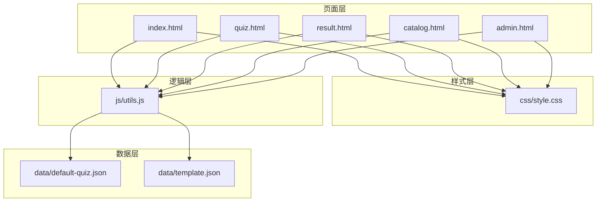
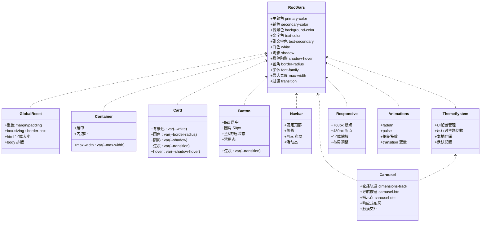
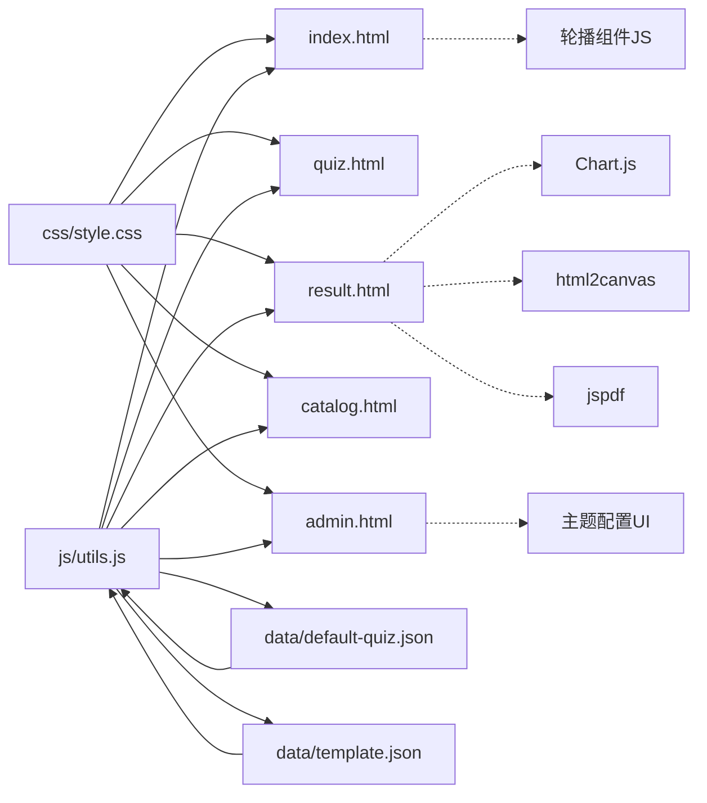

# CSS架构与样式系统

<cite>
**本文引用的文件列表**
- [程序/css/style.css](file://程序/css/style.css)
- [程序/js/utils.js](file://程序/js/utils.js)
- [程序/index.html](file://程序/index.html)
- [程序/quiz.html](file://程序/quiz.html)
- [程序/result.html](file://程序/result.html)
- [程序/catalog.html](file://程序/catalog.html)
- [程序/admin.html](file://程序/admin.html)
- [程序/data/default-quiz.json](file://程序/data/default-quiz.json)
- [程序/data/template.json](file://程序/data/template.json)
</cite>

## 更新摘要
**变更内容**
- 新增完整的CSS变量系统，包含主题色、字体、圆角半径、阴影效果等
- 完善响应式设计策略，涵盖桌面端、平板端、移动端的多级断点
- 实现轮播组件系统，支持维度卡片的滑动展示
- 增强动画系统，包含淡入、脉冲、烟花特效等基础动画
- 构建完整的主题定制系统，支持运行时动态切换
- 优化组件化架构，涵盖导航栏、卡片、按钮、模态框等基础组件

## 目录
1. [简介](#简介)
2. [项目结构](#项目结构)
3. [核心组件](#核心组件)
4. [架构总览](#架构总览)
5. [详细组件分析](#详细组件分析)
6. [依赖关系分析](#依赖关系分析)
7. [性能考量](#性能考量)
8. [故障排查指南](#故障排查指南)
9. [结论](#结论)
10. [附录](#附录)

## 简介
本文件系统性梳理心理测试 v2 项目的 CSS 架构与样式系统，重点覆盖：
- **CSS 变量系统的设计理念与使用方法**（主题色、字体、圆角半径、阴影、最大宽度、过渡等）
- 全局样式重置与基础排版
- 容器系统、卡片组件、按钮系统等基础样式的实现
- **轮播组件样式系统与交互逻辑**
- **增强响应式设计策略（多级断点、弹性布局、触摸交互优化）**
- **完善的主题定制功能（运行时动态切换、UI配置管理）**
- 动画系统、过渡效果与视觉反馈
- 样式组织原则、命名规范与最佳实践
- 样式定制指南与扩展方法

## 项目结构
该项目采用"单页应用 + 全局样式 + 主题定制"的结构，所有页面共享同一套 CSS 样式文件，通过 JavaScript 控制页面内容、交互和主题配置。核心文件如下：
- 样式层：程序/css/style.css
- 逻辑层：程序/js/utils.js（包含 UI 配置、本地存储、工具函数）
- 页面层：index.html、quiz.html、result.html、catalog.html、admin.html
- 数据层：程序/data/default-quiz.json（测试数据）、程序/data/template.json（模板数据）

**图表来源**
- [程序/css/style.css](file://程序/css/style.css)
- [程序/js/utils.js](file://程序/js/utils.js)
- [程序/index.html](file://程序/index.html)
- [程序/quiz.html](file://程序/quiz.html)
- [程序/result.html](file://程序/result.html)
- [程序/catalog.html](file://程序/catalog.html)
- [程序/admin.html](file://程序/admin.html)
- [程序/data/default-quiz.json](file://程序/data/default-quiz.json)
- [程序/data/template.json](file://程序/data/template.json)

**章节来源**
- [程序/css/style.css](file://程序/css/style.css)
- [程序/js/utils.js](file://程序/js/utils.js)
- [程序/index.html](file://程序/index.html)
- [程序/quiz.html](file://程序/quiz.html)
- [程序/result.html](file://程序/result.html)
- [程序/catalog.html](file://程序/catalog.html)
- [程序/admin.html](file://程序/admin.html)
- [程序/data/default-quiz.json](file://程序/data/default-quiz.json)
- [程序/data/template.json](file://程序/data/template.json)

## 核心组件
本节概述样式系统的核心模块及其职责：
- **CSS 变量系统**：集中管理主题色、字体、圆角、阴影、最大宽度、过渡等，支持运行时动态切换
- **全局重置与排版**：统一内外边距、盒模型、字体与行高，确保跨设备一致性
- **容器系统**：限制内容宽度、居中布局、内边距控制
- **卡片组件**：统一圆角、阴影、过渡与悬停效果
- **按钮系统**：主次按钮、危险按钮、禁用态与交互反馈
- **导航栏**：固定顶部、品牌标识、导航链接与活动态
- **轮播组件**：响应式轮播展示、导航控制、指示点系统
- **页面特定组件**：首页英雄区、进度条（小花生长）、单选按钮组、量表题选项、目录卡片、管理后台表单、模态框、海报分享等
- **增强响应式设计**：多级断点、弹性布局、触摸交互优化
- **动画系统**：淡入、脉冲、烟花特效等基础动画与过渡
- **主题定制系统**：运行时动态主题切换、UI配置管理

**章节来源**
- [程序/css/style.css](file://程序/css/style.css)
- [程序/js/utils.js](file://程序/js/utils.js)
- [程序/index.html](file://程序/index.html)

## 架构总览
样式系统采用"变量驱动 + 组件化 + 响应式 + 主题定制"的架构模式：
- **变量驱动**：:root 定义主题变量，页面通过 var(--xxx) 引用；js 通过 setProperty 动态更新变量，实现主题切换
- **组件化**：以 .container、.card、.btn、.navbar、.carousel 等类名构建可复用的基础组件
- **响应式**：媒体查询适配移动端，配合 Flex/Grid 实现弹性布局
- **主题定制**：通过 UI 配置系统实现运行时动态主题切换
- **动画与过渡**：统一 transition 变量，结合 keyframes 实现基础动效

**图表来源**
- [程序/css/style.css](file://程序/css/style.css)
- [程序/js/utils.js](file://程序/js/utils.js)
- [程序/index.html](file://程序/index.html)

**章节来源**
- [程序/css/style.css](file://程序/css/style.css)
- [程序/js/utils.js](file://程序/js/utils.js)

## 详细组件分析

### CSS 变量系统
- **设计理念**
  - 集中式主题管理：通过 :root 定义主题变量，便于统一风格与快速切换
  - 运行时动态切换：js 通过 setProperty 在根元素上更新变量值，实现无刷新主题切换
  - 可扩展性：新增变量时只需在 :root 定义并在组件中引用，无需修改组件内部
- **关键变量**
  - 主题色：primary-color、secondary-color
  - 背景色与文字色：background-color、text-color、text-secondary、white
  - 视觉效果：shadow、shadow-hover、border-radius
  - 字体与布局：font-family、max-width、transition
- **使用方法**
  - 在组件中通过 var(--var-name) 引用变量
  - 在 js 中通过 setProperty 动态更新变量值
  - 在媒体查询中可按需调整字体大小与布局参数

**章节来源**
- [程序/css/style.css](file://程序/css/style.css)
- [程序/js/utils.js](file://程序/js/utils.js)

### 全局样式重置与排版
- **重置策略**
  - 统一 margin/padding 为 0，box-sizing 为 border-box
  - html 设置基础字体大小与平滑滚动
  - body 设置字体族、背景色、文字色、行高与抗锯齿
- **排版规范**
  - 标题层级：h1-h4 字重、行高与间距统一
  - 段落：颜色为副文字色，底部外边距统一

**章节来源**
- [程序/css/style.css](file://程序/css/style.css)

### 容器系统
- **容器特性**
  - 最大宽度由变量控制，居中布局
  - 内边距统一，适配不同页面内容密度
- **使用建议**
  - 所有页面内容均包裹在 .container 中
  - 在移动端通过媒体查询调整内边距与最大宽度

**章节来源**
- [程序/css/style.css](file://程序/css/style.css)

### 卡片组件
- **设计要点**
  - 背景白、圆角、阴影统一
  - hover 时阴影增强，提升交互反馈
  - 过渡动画统一，提升体验一致性
- **适用场景**
  - 首页测试说明、维度预览
  - 答题页题目卡片
  - 结果页图表容器与维度卡片
  - 目录页卡片容器

**章节来源**
- [程序/css/style.css](file://程序/css/style.css)

### 按钮系统
- **类型与状态**
  - 主按钮：渐变背景、阴影、悬停提升与阴影增强
  - 次按钮：白底、主色边框与文字互换
  - 危险按钮：警示红，用于删除等敏感操作
  - 禁用态：降低透明度、禁止交互、移除变换
- **交互反馈**
  - 统一过渡时间与缓动曲线
  - 悬停提升、按压回弹，符合移动端触摸习惯

**章节来源**
- [程序/css/style.css](file://程序/css/style.css)

### 导航栏
- **固定顶部、品牌标识、导航链接**
- **活动态高亮、悬停过渡**
- **与容器系统配合，保证内容不被遮挡**

**章节来源**
- [程序/css/style.css](file://程序/css/style.css)
- [程序/index.html](file://程序/index.html)
- [程序/quiz.html](file://程序/quiz.html)
- [程序/result.html](file://程序/result.html)
- [程序/catalog.html](file://程序/catalog.html)

### 轮播组件系统

#### 设计架构
轮播组件是项目中新增的重要交互组件，采用完全响应式设计，支持多种屏幕尺寸的自适应布局。

#### 核心结构
- **轮播容器**：.dimensions-carousel - 定位相对，隐藏溢出内容
- **轮播轨道**：.dimensions-track - 弹性布局，包含所有卡片项
- **卡片项**：.dimension-card - 每个维度的展示卡片
- **导航按钮**：.carousel-btn - 左右导航，绝对定位
- **指示点系统**：.carousel-dot - 分页指示器

#### 响应式断点
- **桌面端**（>768px）：每屏显示3个卡片，卡片宽度约33%
- **平板端**（480px-768px）：每屏显示2个卡片，卡片宽度约50%
- **移动端**（≤480px）：每屏显示1个卡片，卡片宽度100%

#### 交互功能
- **导航控制**：左右按钮控制轮播切换，禁用态处理边界情况
- **指示点**：圆形指示点，当前页激活为长条形
- **触摸支持**：响应窗口大小变化，动态调整显示数量
- **平滑过渡**：CSS transform 实现流畅的滑动效果

#### 样式特点
- 使用独立的轮播样式表，避免与全局样式冲突
- 卡片采用圆角设计，阴影效果增强层次感
- 导航按钮采用圆形设计，悬浮时主题色变化
- 指示点支持激活态样式变化

**章节来源**
- [程序/css/style.css](file://程序/css/style.css)
- [程序/index.html](file://程序/index.html)

### 页面特定组件

#### 首页英雄区与测试信息卡片
- **英雄区**：居中布局、图标、标题、副标题与描述
- **测试信息卡片**：网格布局展示题目数量、预计用时、结果形式
- **维度预览**：动态渲染，使用变量色与圆角

**章节来源**
- [程序/css/style.css](file://程序/css/style.css)
- [程序/index.html](file://程序/index.html)

#### 进度条（小花生长）
- **进度容器**：居中、高度与定位
- **茎干**：线性渐变、高度随进度变化
- **花头**：随进度阶段切换表情符号
- **文字**：当前题号与总数

**章节来源**
- [程序/css/style.css](file://程序/css/style.css)
- [程序/quiz.html](file://程序/quiz.html)

#### 单选按钮组
- **列表式布局**，列间距统一
- **选中态**：主色边框与浅色背景
- **悬停态**：辅色边框与背景提升
- **隐藏原生单选框**，通过点击标签触发

**章节来源**
- [程序/css/style.css](file://程序/css/style.css)
- [程序/quiz.html](file://程序/quiz.html)

#### 量表题选项
- **弹性布局**，支持换行
- **选项卡片**：边框、圆角、悬停提升与按压回弹
- **选中态**：主色边框、渐变背景与文字反色
- **标签**：小字号副文字色

**章节来源**
- [程序/css/style.css](file://程序/css/style.css)
- [程序/quiz.html](file://程序/quiz.html)

#### 导航按钮组
- **Flex 布局**，两端对齐
- **主次按钮尺寸与间距统一**
- **移动端**：垂直堆叠，按钮占满宽度

**章节来源**
- [程序/css/style.css](file://程序/css/style.css)
- [程序/quiz.html](file://程序/quiz.html)

#### 结果页图表与维度卡片
- **图表容器**：卡片背景、圆角、阴影
- **雷达图与柱状图**：使用 Chart.js 渲染
- **维度卡片**：左侧主色强调条、百分比进度条、描述文本
- **操作按钮**：PDF 报告、海报分享、重新测试

**章节来源**
- [程序/css/style.css](file://程序/css/style.css)
- [程序/result.html](file://程序/result.html)

#### 目录页卡片网格
- **Grid 布局**，自动填充最小宽度
- **卡片**：渐变封面、内容区、悬停提升与阴影
- **占位卡片**：半透明与禁用态

**章节来源**
- [程序/css/style.css](file://程序/css/style.css)
- [程序/catalog.html](file://程序/catalog.html)

#### 管理后台样式（表单与模态框）
- **标签页**：底部边框、活动态高亮
- **表单组**：标签、输入框、聚焦态主色边框
- **文件上传**：虚线边框、悬停高亮
- **模态框**：遮罩层、居中弹窗、缩放过渡

**章节来源**
- [程序/css/style.css](file://程序/css/style.css)
- [程序/admin.html](file://程序/admin.html)

### 增强响应式设计策略
- **多级断点系统**：
  - 768px：主要断点，量表题选项改为纵向堆叠
  - 480px：次要断点，轮播组件每屏显示1个卡片
  - 字体缩放：移动端减小基础字体大小
- **布局调整**：
  - 量表题选项：移动端改为纵向堆叠
  - 导航按钮：移动端垂直堆叠并占满宽度
  - 目录网格：移动端单列布局
  - 标签页：横向滚动，避免换行
  - 操作按钮：移动端垂直堆叠
  - **轮播组件：多级断点适配，响应式卡片布局**
- **触摸交互优化**：
  - 按钮最小触控面积、悬停与按压反馈
  - 卡片悬停提升与阴影增强，增强可感知性
  - **轮播组件：触摸滑动支持，平滑过渡动画**

**章节来源**
- [程序/css/style.css](file://程序/css/style.css)
- [程序/index.html](file://程序/index.html)

### 动画系统与过渡效果
- **过渡统一**：所有组件使用 var(--transition) 变量
- **基础动画**：
  - fadeIn：淡入
  - pulse：脉冲
- **新增动画**：
  - **轮播过渡**：transform translateX 平滑切换
  - **烟花特效**：庆祝动画，粒子爆炸效果
  - **模态框缩放**：从90%到100%的缩放动画
- **页面级动画**：部分区块使用 .fade-in 与 .pulse 类
- **进度条动画**：茎干高度随进度平滑过渡

**章节来源**
- [程序/css/style.css](file://程序/css/style.css)
- [程序/index.html](file://程序/index.html)
- [程序/result.html](file://程序/result.html)
- [程序/quiz.html](file://程序/quiz.html)

### 主题定制系统

#### 设计理念
通过完整的 UI 配置系统实现运行时动态主题切换，支持用户自定义界面外观。

#### 核心功能
- **默认配置**：定义主题色、字体、圆角、最大宽度等基础配置
- **用户配置**：通过本地存储保存用户自定义设置
- **实时应用**：通过 CSS 变量实现无刷新主题切换
- **管理界面**：管理员可通过后台界面实时预览和保存配置

#### 配置项
- **主题色**：primaryColor、secondaryColor、backgroundColor
- **字体系统**：fontFamily、fontSize（标题、副标题、正文、小字）
- **视觉样式**：borderRadius、maxWidth
- **主题**：theme（default 等）

#### 技术实现
- **配置合并**：默认配置与用户配置深度合并
- **CSS 变量绑定**：通过 setProperty 动态更新根元素变量
- **本地存储**：使用 StorageUtil 持久化用户偏好
- **实时预览**：后台界面支持即时预览效果

#### 管理界面
- **颜色选择器**：直观的颜色选择与预览
- **字体选择**：多种字体选项的实时切换
- **配置保存**：一键保存到本地存储
- **配置重置**：恢复到默认配置

**章节来源**
- [程序/css/style.css](file://程序/css/style.css)
- [程序/js/utils.js](file://程序/js/utils.js)
- [程序/admin.html](file://程序/admin.html)

## 依赖关系分析
- **样式依赖**
  - 所有页面均引入 css/style.css
  - 页面通过类名组合使用基础组件
  - **轮播组件使用独立样式表，避免全局污染**
- **逻辑依赖**
  - js/utils.js 提供 UI 配置与变量注入
  - 页面通过 StorageUtil 读写测试数据与用户进度
  - **轮播组件使用独立的 JavaScript 控制逻辑**
- **数据依赖**
  - data/default-quiz.json 提供测试数据结构与内容
  - data/template.json 提供题目模板格式
- **外部依赖**
  - Chart.js 用于结果页图表
  - html2canvas、jspdf 用于海报生成与 PDF 导出

**图表来源**
- [程序/css/style.css](file://程序/css/style.css)
- [程序/js/utils.js](file://程序/js/utils.js)
- [程序/index.html](file://程序/index.html)
- [程序/quiz.html](file://程序/quiz.html)
- [程序/result.html](file://程序/result.html)
- [程序/catalog.html](file://程序/catalog.html)
- [程序/admin.html](file://程序/admin.html)
- [程序/data/default-quiz.json](file://程序/data/default-quiz.json)
- [程序/data/template.json](file://程序/data/template.json)

**章节来源**
- [程序/css/style.css](file://程序/css/style.css)
- [程序/js/utils.js](file://程序/js/utils.js)
- [程序/result.html](file://程序/result.html)

## 性能考量
- **变量驱动减少重复样式**，降低维护成本
- 统一过渡与动画参数，避免过度复杂动画影响性能
- **轮播组件使用 transform 替代位置改变**，避免重排重绘
- **主题定制通过 CSS 变量实现**，无需重新渲染整个样式树
- 响应式断点与布局优化，减少重排与重绘
- 图表与导出功能按需加载，避免首屏阻塞
- **烟花特效采用一次性创建**，及时清理 DOM 节点

## 故障排查指南
- **主题色不生效**
  - 检查 js 是否正确调用 setProperty 注入变量
  - 确认页面是否正确引入 css/style.css
  - **检查主题配置是否正确保存到本地存储**
- **按钮点击无反馈**
  - 检查按钮类名是否正确（如 .btn-primary）
  - 确认 hover/active 样式未被覆盖
- **移动端布局错乱**
  - 检查媒体查询断点与布局属性
  - 确认容器内边距与最大宽度设置
  - **检查轮播组件的断点配置是否正确**
- **图表不显示**
  - 检查外部库是否成功加载（Chart.js、html2canvas、jspdf）
  - 确认 Canvas 容器存在且尺寸合理
- **轮播组件不工作**
  - 检查轮播轨道是否存在 .dimensions-track
  - 确认 JavaScript 初始化函数是否正确调用
  - **验证卡片数量与断点配置的匹配关系**
- **烟花特效异常**
  - 检查 CSS 动画关键帧定义
  - 确认粒子节点的创建和清理逻辑

**章节来源**
- [程序/css/style.css](file://程序/css/style.css)
- [程序/js/utils.js](file://程序/js/utils.js)
- [程序/result.html](file://程序/result.html)
- [程序/index.html](file://程序/index.html)

## 结论
该样式系统以 CSS 变量为核心，结合组件化、响应式设计和主题定制，实现了统一、可扩展、易维护的视觉体系。通过运行时主题切换、完整的 UI 配置管理和新增的轮播组件，显著提升了用户体验与开发效率。建议在后续迭代中持续完善变量命名规范、补充暗色主题支持、优化轮播组件的触摸交互体验，并对关键交互增加更丰富的视觉反馈。

## 附录

### 样式组织原则与命名规范
- **组织原则**
  - 变量优先：优先通过变量控制主题与布局
  - 组件化：以类名组合形成可复用组件
  - 层次清晰：基础样式、组件样式、页面样式分层
  - **模块化：轮播组件使用独立样式表，避免全局污染**
- **命名规范**
  - 语义化类名：如 .card、.btn、.navbar
  - 页面特定类名：如 .hero、.progress-container
  - 状态类名：如 .active、.selected、.hidden
  - 工具类：如 .text-center、.mt-16、.mb-16
  - **轮播组件类名**：.dimensions-carousel、.dimensions-track、.dimension-card
  - **轮播交互类名**：.carousel-btn、.carousel-dot、.carousel-dots

### 样式定制指南与扩展方法
- **主题定制**
  - 在 :root 中新增变量或覆盖现有变量
  - 通过 js 调用 setProperty 动态更新变量
  - **使用 UI 配置系统管理主题设置**
- **组件扩展**
  - 在现有组件基础上添加修饰类（如 .btn-large）
  - 新增独立组件时遵循统一命名与变量使用
  - **轮播组件可扩展为通用的滑动组件**
- **响应式扩展**
  - 在媒体查询中针对特定组件进行布局优化
  - 保持断点与过渡参数一致
  - **新增断点时考虑轮播组件的适配需求**
- **动画扩展**
  - 基于现有动画系统创建新的过渡效果
  - 使用 CSS 变量控制动画参数
  - **轮播组件可添加更多滑动方向和效果**

**章节来源**
- [程序/css/style.css](file://程序/css/style.css)
- [程序/js/utils.js](file://程序/js/utils.js)
- [程序/index.html](file://程序/index.html)