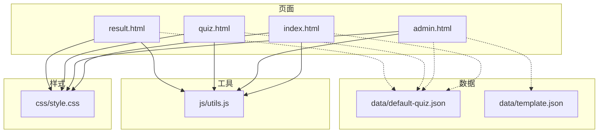
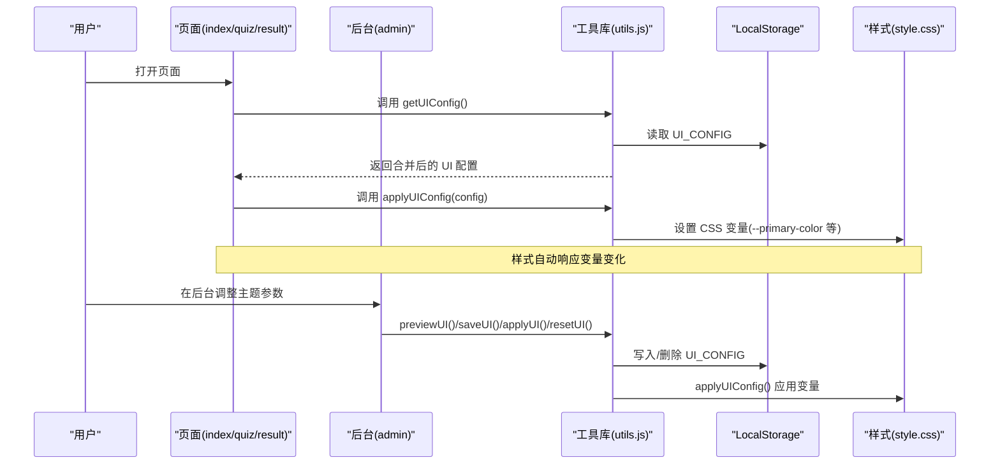
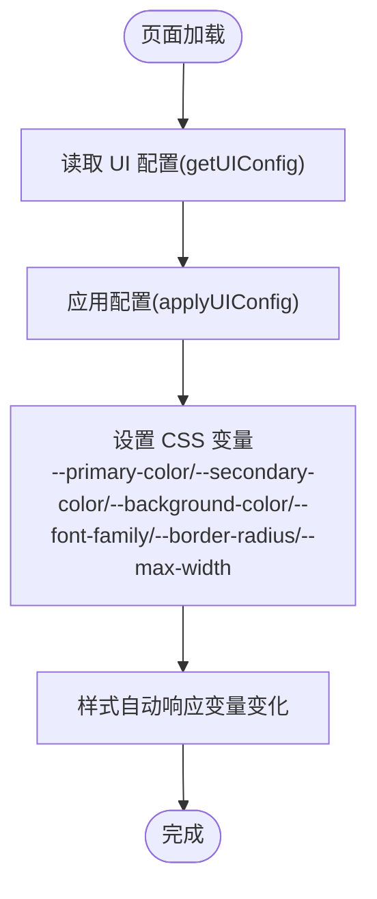
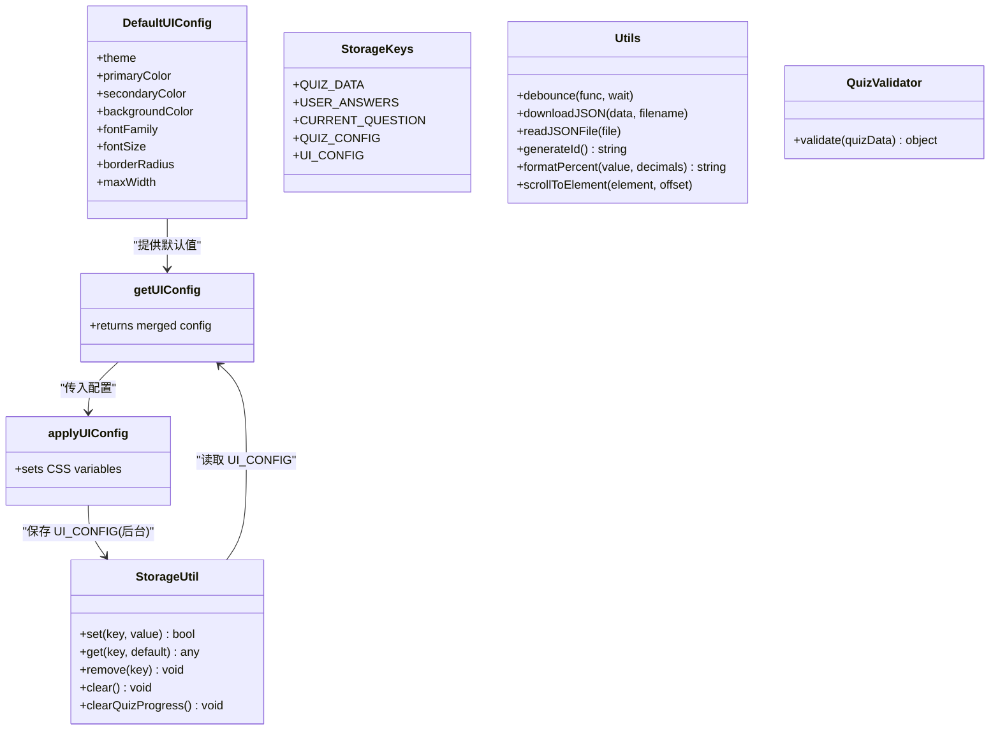
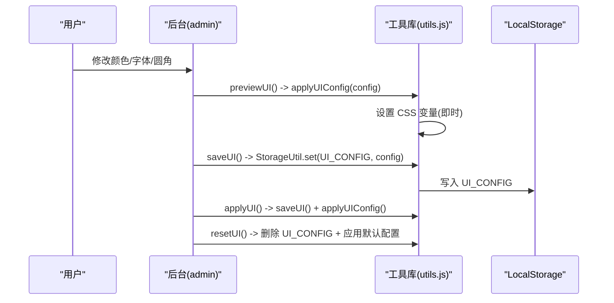
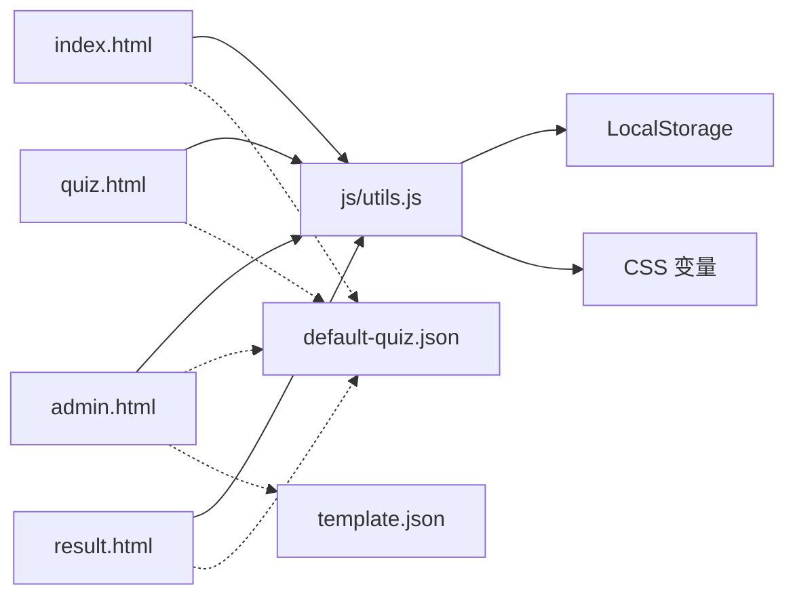

# 主题定制系统

<cite>
**本文引用的文件**
- [css/style.css](file://css/style.css)
- [js/utils.js](file://js/utils.js)
- [index.html](file://index.html)
- [admin.html](file://admin.html)
- [quiz.html](file://quiz.html)
- [result.html](file://result.html)
- [data/default-quiz.json](file://data/default-quiz.json)
- [data/template.json](file://data/template.json)
</cite>

## 目录
1. [简介](#简介)
2. [项目结构](#项目结构)
3. [核心组件](#核心组件)
4. [架构总览](#架构总览)
5. [详细组件分析](#详细组件分析)
6. [依赖关系分析](#依赖关系分析)
7. [性能考量](#性能考量)
8. [故障排查指南](#故障排查指南)
9. [结论](#结论)
10. [附录](#附录)

## 简介
本文件面向“心理测试 v2”项目，系统化梳理其主题定制系统的设计与实现，重点覆盖：
- CSS 变量驱动的主题色、背景色、字体、圆角、最大宽度等动态修改机制
- 用户偏好设置的保存与恢复（LocalStorage）
- 主题切换的 JavaScript 实现（样式更新、动画效果与状态同步）
- 最佳实践（色彩搭配、可访问性、跨浏览器兼容）
- 主题扩展与自定义开发指南
- 主题定制工具的完整使用说明

## 项目结构
该项目采用“页面级组织 + 公共样式 + 工具库”的结构：
- 样式层：集中于单一样式表，通过 CSS 变量统一管理主题参数
- 逻辑层：公共工具函数位于工具库，页面按需引入并在 DOMContentLoaded 时初始化
- 数据层：测试数据以 JSON 形式存储，支持模板与默认数据

图表来源
- [index.html:1-154](file://index.html#L1-L154)
- [admin.html:1-402](file://admin.html#L1-L402)
- [quiz.html:1-278](file://quiz.html#L1-L278)
- [result.html:1-374](file://result.html#L1-L374)
- [css/style.css:1-731](file://css/style.css#L1-L731)
- [js/utils.js:1-250](file://js/utils.js#L1-L250)
- [data/default-quiz.json:1-235](file://data/default-quiz.json#L1-L235)
- [data/template.json:1-49](file://data/template.json#L1-L49)

章节来源
- [css/style.css:1-731](file://css/style.css#L1-L731)
- [js/utils.js:1-250](file://js/utils.js#L1-L250)
- [index.html:1-154](file://index.html#L1-L154)
- [admin.html:1-402](file://admin.html#L1-L402)
- [quiz.html:1-278](file://quiz.html#L1-L278)
- [result.html:1-374](file://result.html#L1-L374)
- [data/default-quiz.json:1-235](file://data/default-quiz.json#L1-L235)
- [data/template.json:1-49](file://data/template.json#L1-L49)

## 核心组件
- CSS 变量系统：在根节点集中声明主题变量，页面通过 var() 引用，实现全局主题控制
- UI 配置与应用：工具库提供默认 UI 配置、合并策略与应用函数，页面在加载时调用
- 存储与恢复：工具库封装 LocalStorage 操作，页面在初始化与交互时读写配置
- 主题定制工具：后台页面提供颜色、字体、圆角等配置项，支持预览、保存、应用与重置

章节来源
- [css/style.css:6-20](file://css/style.css#L6-L20)
- [js/utils.js:207-244](file://js/utils.js#L207-L244)
- [admin.html:293-335](file://admin.html#L293-L335)
- [index.html:147-150](file://index.html#L147-L150)
- [quiz.html:271-274](file://quiz.html#L271-L274)
- [result.html:331-370](file://result.html#L331-L370)

## 架构总览
主题定制系统由“样式层—工具层—页面层—数据层”构成，核心流程如下：
- 页面加载：页面在 DOMContentLoaded 时调用应用函数，将 UI 配置映射到 CSS 变量
- 用户操作：后台页面提供配置项，用户点击“预览/保存/应用/重置”，工具库负责持久化与即时应用
- 数据回放：页面在运行时从 LocalStorage 读取配置，确保跨会话一致性

图表来源
- [index.html:147-150](file://index.html#L147-L150)
- [quiz.html:271-274](file://quiz.html#L271-L274)
- [result.html:331-370](file://result.html#L331-L370)
- [admin.html:293-335](file://admin.html#L293-L335)
- [js/utils.js:226-244](file://js/utils.js#L226-L244)

## 详细组件分析

### CSS 变量系统与样式映射
- 变量定义：根节点集中声明主题变量，涵盖主色、辅色、背景、文本、阴影、圆角、字体族、最大宽度、过渡等
- 样式引用：页面与组件广泛使用 var(--变量名)，实现主题参数的集中控制
- 动画与过渡：变量统一管理过渡时长与缓动，保证交互一致性

图表来源
- [css/style.css:6-20](file://css/style.css#L6-L20)
- [css/style.css:34-42](file://css/style.css#L34-L42)
- [css/style.css:52-62](file://css/style.css#L52-L62)
- [js/utils.js:226-244](file://js/utils.js#L226-L244)

章节来源
- [css/style.css:6-20](file://css/style.css#L6-L20)
- [css/style.css:34-42](file://css/style.css#L34-L42)
- [css/style.css:52-62](file://css/style.css#L52-L62)
- [css/style.css:108-117](file://css/style.css#L108-L117)
- [css/style.css:123-132](file://css/style.css#L123-L132)
- [css/style.css:209-213](file://css/style.css#L209-L213)
- [css/style.css:228-234](file://css/style.css#L228-L234)

### UI 配置与应用函数
- 默认配置：工具库提供默认 UI 配置对象，包含主题、主色、辅色、背景、字体、字号、圆角、最大宽度等
- 合并策略：页面读取自定义配置并与默认配置进行浅合并，确保缺失键有默认值
- 应用函数：将配置映射到 CSS 变量，实现即时主题切换

图表来源
- [js/utils.js:207-221](file://js/utils.js#L207-L221)
- [js/utils.js:6-12](file://js/utils.js#L6-L12)
- [js/utils.js:17-50](file://js/utils.js#L17-L50)
- [js/utils.js:131-202](file://js/utils.js#L131-L202)
- [js/utils.js:55-126](file://js/utils.js#L55-L126)
- [js/utils.js:226-244](file://js/utils.js#L226-L244)

章节来源
- [js/utils.js:207-221](file://js/utils.js#L207-L221)
- [js/utils.js:226-244](file://js/utils.js#L226-L244)
- [js/utils.js:17-50](file://js/utils.js#L17-L50)

### 主题定制工具（后台页面）
- 配置项：颜色（主色、辅色、背景）、字体、圆角大小
- 功能按钮：预览、保存、应用、重置
- 交互流程：用户在后台调整参数，点击对应按钮触发相应逻辑；应用后立即生效，保存后持久化

图表来源
- [admin.html:293-335](file://admin.html#L293-L335)
- [js/utils.js:226-244](file://js/utils.js#L226-L244)

章节来源
- [admin.html:293-335](file://admin.html#L293-L335)
- [js/utils.js:226-244](file://js/utils.js#L226-L244)

### 页面初始化与主题应用
- 首页、答题页、结果页均在 DOMContentLoaded 时调用应用函数，确保页面加载即应用主题
- 答题页还结合进度与动画，展示“小花生长”进度条，配合主题变量实现一致的视觉体验

章节来源
- [index.html:147-150](file://index.html#L147-L150)
- [quiz.html:271-274](file://quiz.html#L271-L274)
- [result.html:331-370](file://result.html#L331-L370)
- [css/style.css:216-250](file://css/style.css#L216-L250)

### 用户偏好设置的保存与恢复
- 保存：后台页面将 UI 配置写入 LocalStorage 的 UI_CONFIG 键
- 恢复：页面启动时读取 UI_CONFIG，与默认配置合并，得到最终 UI 配置
- 清理：提供清理测试进度的方法，避免干扰主题配置

章节来源
- [js/utils.js:226-244](file://js/utils.js#L226-L244)
- [js/utils.js:46-50](file://js/utils.js#L46-L50)
- [admin.html:305-321](file://admin.html#L305-L321)

### 主题切换的 JavaScript 实现细节
- 变量设置：通过设置 document.documentElement.style.setProperty，将配置映射到 CSS 变量
- 状态同步：页面在每次 DOMContentLoaded 时应用最新配置，保证跨页面一致性
- 动画效果：过渡变量统一管理，组件 hover、激活等状态使用统一过渡时长与缓动

章节来源
- [js/utils.js:234-244](file://js/utils.js#L234-L244)
- [css/style.css:19-20](file://css/style.css#L19-L20)
- [css/style.css:60-62](file://css/style.css#L60-L62)
- [css/style.css:114-121](file://css/style.css#L114-L121)

## 依赖关系分析
- 页面依赖工具库：四个页面均引入工具库，依赖其配置读取与应用函数
- 工具库依赖 LocalStorage：封装读写与清理操作
- 样式依赖 CSS 变量：样式表通过 var() 引用变量，实现主题参数的集中控制
- 数据依赖 JSON：页面通过 fetch 或默认数据初始化，后台提供模板与校验

图表来源
- [index.html:68-150](file://index.html#L68-L150)
- [admin.html:171-398](file://admin.html#L171-L398)
- [quiz.html:49-274](file://quiz.html#L49-L274)
- [result.html:85-370](file://result.html#L85-L370)
- [js/utils.js:17-50](file://js/utils.js#L17-L50)
- [css/style.css:6-20](file://css/style.css#L6-L20)
- [data/default-quiz.json:1-235](file://data/default-quiz.json#L1-L235)
- [data/template.json:1-49](file://data/template.json#L1-L49)

章节来源
- [index.html:68-150](file://index.html#L68-L150)
- [admin.html:171-398](file://admin.html#L171-L398)
- [quiz.html:49-274](file://quiz.html#L49-L274)
- [result.html:85-370](file://result.html#L85-L370)
- [js/utils.js:17-50](file://js/utils.js#L17-L50)
- [css/style.css:6-20](file://css/style.css#L6-L20)
- [data/default-quiz.json:1-235](file://data/default-quiz.json#L1-L235)
- [data/template.json:1-49](file://data/template.json#L1-L49)

## 性能考量
- CSS 变量切换成本低：仅修改根节点变量，无需重排重绘，性能开销极小
- 防抖与节流：工具库提供防抖函数，可用于高频事件（如窗口尺寸变化）优化
- 渐进增强：页面在加载时一次性应用主题，避免闪烁；组件 hover 等状态使用统一过渡，减少重复计算
- 资源加载：后台页面按需引入外部图表库与截图库，注意 CDN 可用性与降级方案

章节来源
- [js/utils.js:135-144](file://js/utils.js#L135-L144)
- [css/style.css:19-20](file://css/style.css#L19-L20)

## 故障排查指南
- 主题未生效
  - 检查页面是否在 DOMContentLoaded 时调用应用函数
  - 检查 UI_CONFIG 是否正确写入 LocalStorage
  - 检查 CSS 变量是否被覆盖（例如内联样式优先级）
- 颜色/字体异常
  - 确认后台保存与应用按钮是否被正确触发
  - 确认字体族是否可用，必要时提供回退字体
- 进度丢失或错乱
  - 确认测试进度与用户答案是否分别保存在对应键位
  - 如需重置进度，调用清理方法

章节来源
- [index.html:147-150](file://index.html#L147-L150)
- [admin.html:317-335](file://admin.html#L317-L335)
- [js/utils.js:46-50](file://js/utils.js#L46-L50)
- [quiz.html:197-200](file://quiz.html#L197-L200)

## 结论
本项目通过“CSS 变量 + 工具库 + 页面初始化”的组合，实现了轻量、高效且可扩展的主题定制系统。其优势在于：
- 集中式变量管理，便于维护与扩展
- 本地持久化配置，提升用户体验
- 统一的过渡与动画变量，保证交互一致性
建议在后续迭代中进一步完善文字配置的预览与应用能力，并加强可访问性与跨浏览器兼容性测试。

## 附录

### 主题定制最佳实践
- 色彩搭配
  - 主色用于强调与高亮，辅色用于次要强调，背景色与文本色保持对比度
  - 避免使用过于鲜艳或高对比的颜色组合，确保长时间阅读舒适
- 可访问性
  - 确保文本与背景的对比度满足可访问性标准
  - 提供高对比度模式开关（可通过额外变量实现）
- 跨浏览器兼容
  - CSS 变量在现代浏览器中支持良好，可为旧版浏览器提供降级方案
  - 动画与过渡属性需关注浏览器前缀与默认行为差异

### 主题扩展指南
- 新增变量
  - 在根节点新增变量，样式中通过 var() 引用
  - 在工具库默认配置中添加对应键位
- 新增页面支持
  - 在页面 DOMContentLoaded 时调用应用函数
  - 如需持久化，使用工具库提供的存储键位
- 自定义主题开发
  - 建议以“主色—辅色—背景—文本—圆角—字体”为主线，形成主题包
  - 提供预设主题集合，用户可一键切换

### 主题定制工具使用说明
- 打开管理后台，切换到“UI界面”标签页
- 调整颜色、字体、圆角等参数
- 点击“预览”即时查看效果
- 点击“保存”将配置写入本地存储
- 点击“应用”保存并立即应用到所有页面
- 点击“重置”恢复默认配置

章节来源
- [admin.html:293-335](file://admin.html#L293-L335)
- [js/utils.js:226-244](file://js/utils.js#L226-L244)