# 交互元素与动画

<cite>
**本文引用的文件**
- [index.html](file://index.html)
- [quiz.html](file://quiz.html)
- [result.html](file://result.html)
- [admin.html](file://admin.html)
- [css/style.css](file://css/style.css)
- [js/utils.js](file://js/utils.js)
- [data/default-quiz.json](file://data/default-quiz.json)
- [data/template.json](file://data/template.json)
</cite>

## 目录
1. [简介](#简介)
2. [项目结构](#项目结构)
3. [核心组件](#核心组件)
4. [架构总览](#架构总览)
5. [详细组件分析](#详细组件分析)
6. [依赖关系分析](#依赖关系分析)
7. [性能考虑](#性能考虑)
8. [故障排查指南](#故障排查指南)
9. [结论](#结论)
10. [附录](#附录)

## 简介
本文件面向开发者与产品设计人员，系统性梳理“心理测试 v2”项目的交互元素与动画系统，重点覆盖：
- 单选按钮组与量表题选项的交互设计与实现
- 导航按钮的状态管理与事件处理
- 动画效果系统（淡入、脉冲、进度条动画等）及其视觉反馈
- 用户交互事件处理与状态管理（选中、悬停、点击反馈）
- 动画性能优化建议（硬件加速、帧率控制、内存管理）
- 触摸设备交互优化与手势支持
- 开发者交互设计指南与实现参考

## 项目结构
该项目采用静态前端结构，核心由 HTML 页面、CSS 样式与 JS 工具库组成，配合本地 JSON 数据源驱动测试流程。页面职责清晰：首页负责测试信息展示与入口；答题页承载交互式题目与进度反馈；结果页呈现可视化分析与导出能力；管理后台用于 UI 与题目配置。

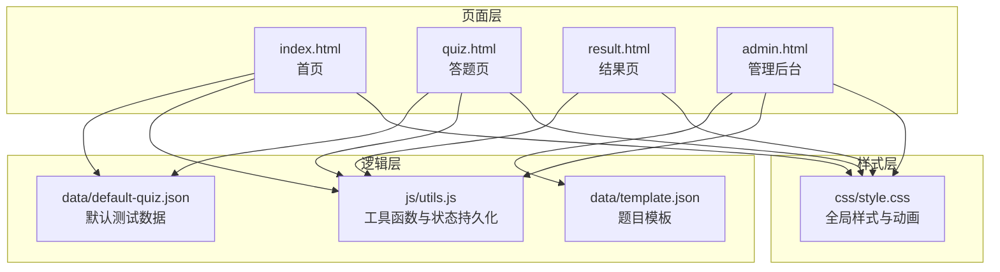

**图表来源**
- [index.html:1-164](file://index.html#L1-L164)
- [quiz.html:1-287](file://quiz.html#L1-L287)
- [result.html:1-374](file://result.html#L1-L374)
- [admin.html:1-402](file://admin.html#L1-L402)
- [css/style.css:1-731](file://css/style.css#L1-L731)
- [js/utils.js:1-250](file://js/utils.js#L1-L250)
- [data/default-quiz.json:1-235](file://data/default-quiz.json#L1-L235)
- [data/template.json:1-49](file://data/template.json#L1-L49)

**章节来源**
- [index.html:1-164](file://index.html#L1-L164)
- [quiz.html:1-287](file://quiz.html#L1-L287)
- [result.html:1-374](file://result.html#L1-L374)
- [admin.html:1-402](file://admin.html#L1-L402)
- [css/style.css:1-731](file://css/style.css#L1-L731)
- [js/utils.js:1-250](file://js/utils.js#L1-L250)
- [data/default-quiz.json:1-235](file://data/default-quiz.json#L1-L235)
- [data/template.json:1-49](file://data/template.json#L1-L49)

## 核心组件
- 交互容器与布局
  - 卡片容器与网格布局，统一的阴影与过渡动效，提升可读性与层级感。
- 单选按钮组（选择题）
  - 自定义 radio-item 样式，隐藏原生单选框，通过点击 label 实现选中与悬停反馈。
- 量表题选项（评分题）
  - 五个评分按钮，支持 hover 与选中态切换，选中态强调主色与渐变背景。
- 导航按钮组
  - 上一题/下一题/提交按钮，根据当前题号与作答状态动态启用/禁用与显隐切换。
- 进度条动画（小花生长）
  - 基于高度变化与阶段图标切换，直观反映答题进度。
- 动画系统
  - 淡入动画与脉冲动画，分别用于页面元素首次出现与按钮引导提示。
- 状态持久化
  - 通过本地存储维护测试数据、用户答案与当前题号，保障断点续答。

**章节来源**
- [css/style.css:51-62](file://css/style.css#L51-L62)
- [css/style.css:252-289](file://css/style.css#L252-L289)
- [css/style.css:290-327](file://css/style.css#L290-L327)
- [css/style.css:328-339](file://css/style.css#L328-L339)
- [css/style.css:215-251](file://css/style.css#L215-L251)
- [css/style.css:685-713](file://css/style.css#L685-L713)
- [js/utils.js:17-50](file://js/utils.js#L17-L50)

## 架构总览
答题流程的关键路径如下：首页加载测试元数据与维度信息；进入答题页后合并量表题与选择题，渲染当前题目；用户交互触发答案保存与按钮状态更新；进度条根据题号计算百分比并更新小花阶段；完成全部题目后跳转结果页并进行统计与可视化展示。

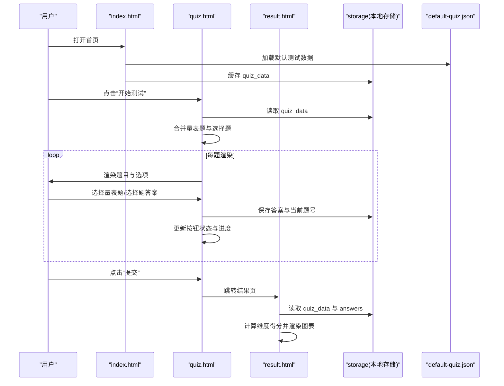

**图表来源**
- [index.html:84-154](file://index.html#L84-L154)
- [quiz.html:61-126](file://quiz.html#L61-L126)
- [quiz.html:128-185](file://quiz.html#L128-L185)
- [quiz.html:187-203](file://quiz.html#L187-L203)
- [quiz.html:205-243](file://quiz.html#L205-L243)
- [quiz.html:266-277](file://quiz.html#L266-L277)
- [result.html:330-370](file://result.html#L330-L370)

## 详细组件分析

### 单选按钮组（选择题）
- 设计要点
  - 隐藏原生单选框，以 label 包裹实现点击选中，提升交互一致性与可定制性。
  - 悬停态与选中态使用边框颜色与背景色变化，明确状态反馈。
- 交互行为
  - 点击选项触发回调，写入答案并保存进度，随后重新渲染当前题与按钮状态。
- 样式与动画
  - hover 与 selected 态均通过过渡动画实现平滑切换，增强可用性。

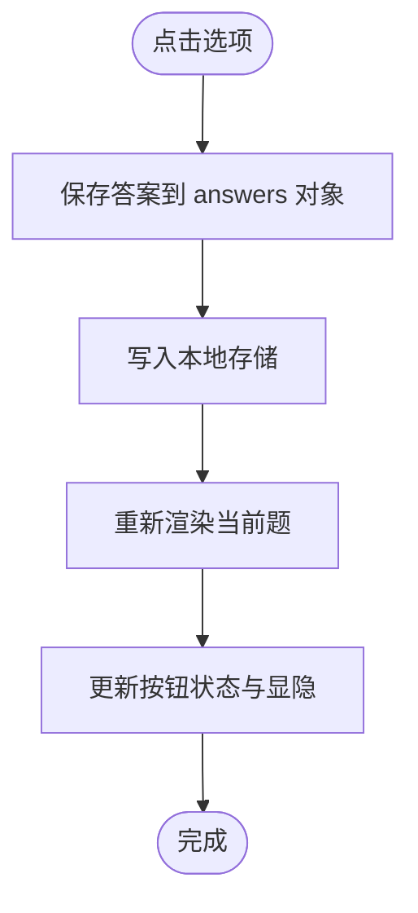

**图表来源**
- [quiz.html:196-203](file://quiz.html#L196-L203)
- [quiz.html:205-209](file://quiz.html#L205-L209)
- [quiz.html:187-185](file://quiz.html#L187-L185)

**章节来源**
- [css/style.css:252-289](file://css/style.css#L252-L289)
- [quiz.html:160-178](file://quiz.html#L160-L178)
- [quiz.html:196-203](file://quiz.html#L196-L203)

### 量表题选项（评分题）
- 设计要点
  - 五个评分按钮，对应 1-5 分，选中态强调主色与渐变背景，标签文字提供语义说明。
  - 悬停态轻微上移与边框变化，提升点击意图表达。
- 交互行为
  - 点击评分按钮更新答案并保存，随后重新渲染与按钮状态更新。
- 样式与动画
  - 选中态与 hover 态均具备过渡动画，确保状态切换自然。

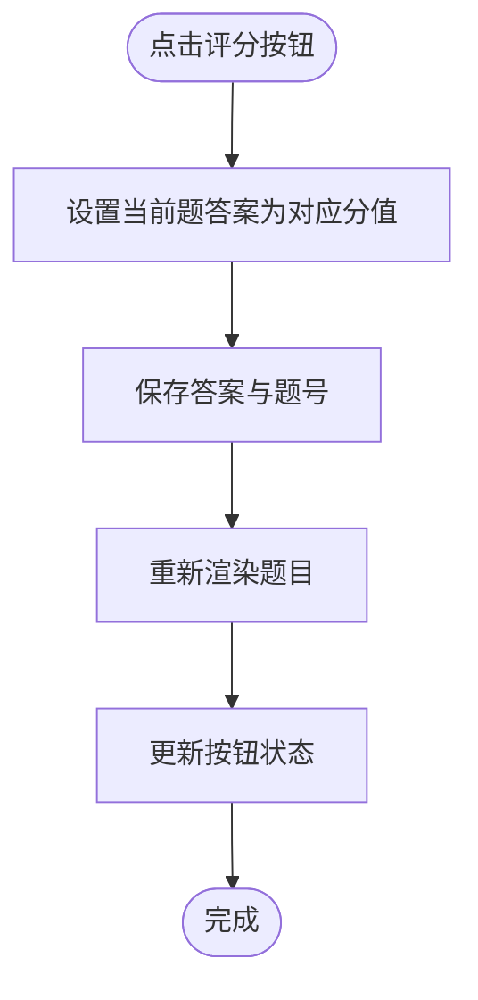

**图表来源**
- [quiz.html:187-194](file://quiz.html#L187-L194)
- [quiz.html:205-209](file://quiz.html#L205-L209)
- [quiz.html:187-185](file://quiz.html#L187-L185)

**章节来源**
- [css/style.css:290-327](file://css/style.css#L290-L327)
- [quiz.html:145-159](file://quiz.html#L145-L159)
- [quiz.html:187-194](file://quiz.html#L187-L194)

### 导航按钮组（上一题/下一题/提交）
- 设计要点
  - 根据当前题号与作答状态动态启用/禁用与显隐切换，避免无效操作。
  - 提交按钮仅在最后一题且已作答时启用。
- 交互行为
  - 上一题/下一题：更新索引并保存进度，重新渲染与更新进度。
  - 提交：校验是否全部作答，否则提示剩余题数；满足条件则保存答案并跳转结果页。

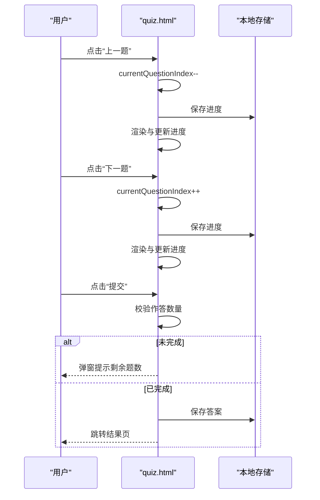

**图表来源**
- [quiz.html:245-263](file://quiz.html#L245-L263)
- [quiz.html:266-277](file://quiz.html#L266-L277)
- [quiz.html:226-243](file://quiz.html#L226-L243)

**章节来源**
- [css/style.css:328-339](file://css/style.css#L328-L339)
- [quiz.html:245-277](file://quiz.html#L245-L277)
- [quiz.html:226-243](file://quiz.html#L226-L243)

### 进度条动画（小花生长）
- 设计要点
  - 茎部高度随进度线性增长，顶部花朵根据阶段数组切换不同表情符号，形成“小花生长”的视觉反馈。
- 交互行为
  - 每次切换题目或选择答案后，根据当前题号计算百分比并更新茎高与花朵阶段。
- 样式与动画
  - 茎部高度变化具备过渡动画，花朵阶段切换具备过渡属性，整体节奏平滑。

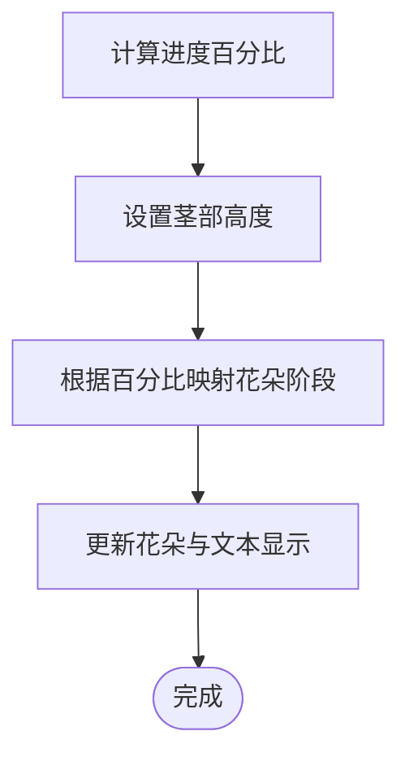

**图表来源**
- [quiz.html:211-224](file://quiz.html#L211-L224)
- [css/style.css:215-251](file://css/style.css#L215-L251)

**章节来源**
- [css/style.css:215-251](file://css/style.css#L215-L251)
- [quiz.html:211-224](file://quiz.html#L211-L224)

### 动画系统（淡入与脉冲）
- 淡入动画
  - 通过类名 fade-in 应用关键帧动画，使页面元素在首次出现时自下而上淡入，提升加载体验。
- 脉冲动画
  - 通过类名 pulse 应用持续缩放动画，用于引导按钮（如“开始测试”），吸引注意力。
- 应用位置
  - 首页英雄区与开始按钮使用脉冲动画；卡片与图表区域使用淡入动画。

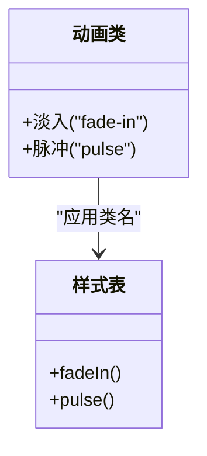

**图表来源**
- [css/style.css:685-713](file://css/style.css#L685-L713)
- [index.html:23-29](file://index.html#L23-L29)
- [index.html:33-60](file://index.html#L33-L60)

**章节来源**
- [css/style.css:685-713](file://css/style.css#L685-L713)
- [index.html:23-60](file://index.html#L23-L60)

### 状态管理与持久化
- 状态对象
  - quizData：测试元数据与题目集合
  - allQuestions：合并后的题目数组（量表题在前）
  - currentQuestionIndex：当前题号
  - answers：用户答案映射
- 持久化键
  - quiz_data、user_answers、current_question、ui_config
- 交互流程
  - 页面加载时恢复进度；每次选择答案后立即保存；提交前校验完整性。

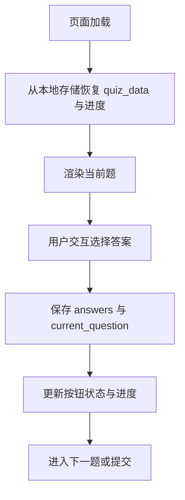

**图表来源**
- [quiz.html:61-126](file://quiz.html#L61-L126)
- [quiz.html:187-209](file://quiz.html#L187-L209)
- [js/utils.js:6-12](file://js/utils.js#L6-L12)

**章节来源**
- [js/utils.js:17-50](file://js/utils.js#L17-L50)
- [quiz.html:51-126](file://quiz.html#L51-L126)
- [quiz.html:187-209](file://quiz.html#L187-L209)

### 结果页交互与可视化
- 计分逻辑
  - 量表题按所选分值累加；选择题按选中维度赋固定分值。
- 可视化
  - 雷达图与柱状图展示维度占比；维度卡片按占比排序，顶部维度突出显示。
- 导出能力
  - 支持生成 PDF 报告与分享海报（截图 + 下载）。

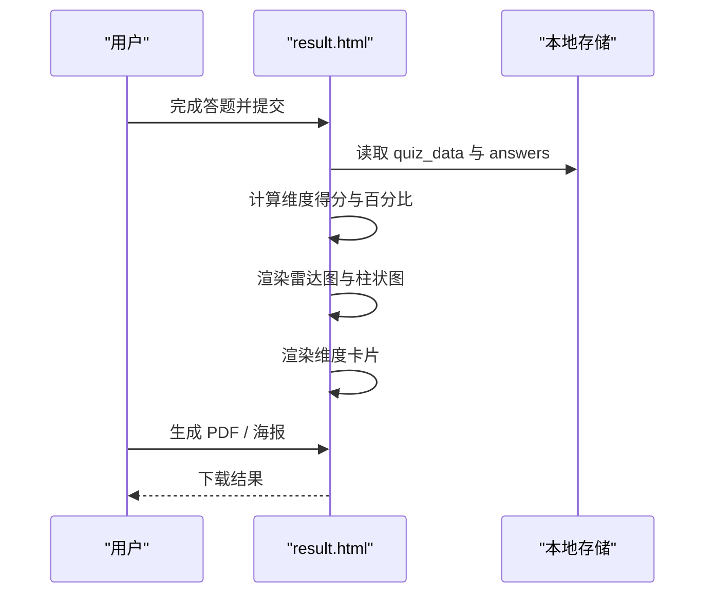

**图表来源**
- [result.html:94-133](file://result.html#L94-L133)
- [result.html:153-240](file://result.html#L153-L240)
- [result.html:269-318](file://result.html#L269-L318)

**章节来源**
- [result.html:94-133](file://result.html#L94-L133)
- [result.html:153-240](file://result.html#L153-L240)
- [result.html:269-318](file://result.html#L269-L318)

### 管理后台（UI 与题目配置）
- UI 配置
  - 主色、辅色、背景色、字体、圆角等参数可实时预览与应用。
- 题目管理
  - 下载模板、上传 JSON、验证结构、预览与应用。
- 数据验证
  - 通过 QuizValidator 校验必填字段与结构完整性，失败时给出具体错误列表。

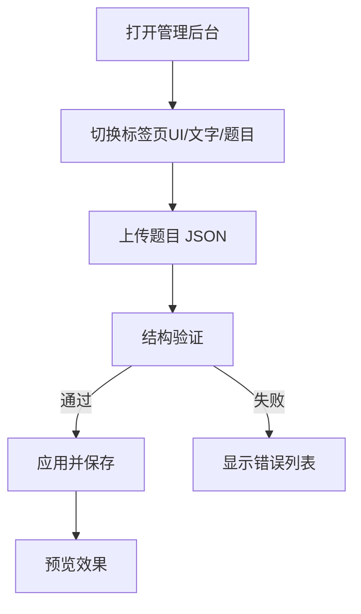

**图表来源**
- [admin.html:177-186](file://admin.html#L177-L186)
- [admin.html:252-291](file://admin.html#L252-L291)
- [js/utils.js:55-126](file://js/utils.js#L55-L126)

**章节来源**
- [admin.html:177-186](file://admin.html#L177-L186)
- [admin.html:252-291](file://admin.html#L252-L291)
- [js/utils.js:55-126](file://js/utils.js#L55-L126)

## 依赖关系分析
- 页面依赖
  - quiz.html 依赖 utils.js 与 default-quiz.json；result.html 依赖 utils.js 与 default-quiz.json；admin.html 依赖 utils.js 与 template.json。
- 样式依赖
  - 所有页面共享 css/style.css，其中定义了交互组件的样式与动画。
- 数据依赖
  - 首页与答题页通过本地存储共享 quiz_data；答题页还保存 user_answers 与 current_question。

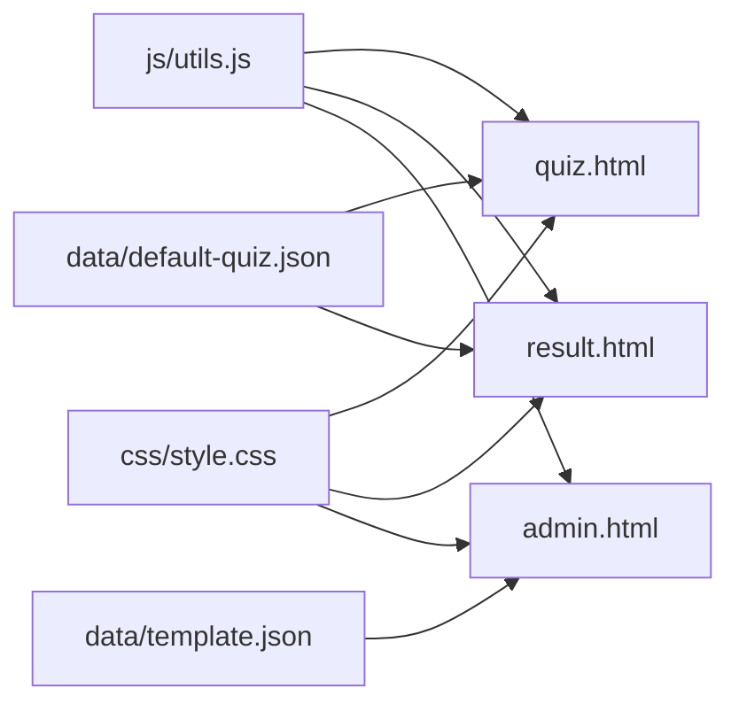

**图表来源**
- [js/utils.js:1-250](file://js/utils.js#L1-L250)
- [css/style.css:1-731](file://css/style.css#L1-L731)
- [quiz.html:1-287](file://quiz.html#L1-L287)
- [result.html:1-374](file://result.html#L1-L374)
- [admin.html:1-402](file://admin.html#L1-L402)
- [data/default-quiz.json:1-235](file://data/default-quiz.json#L1-L235)
- [data/template.json:1-49](file://data/template.json#L1-L49)

**章节来源**
- [js/utils.js:1-250](file://js/utils.js#L1-L250)
- [css/style.css:1-731](file://css/style.css#L1-L731)
- [quiz.html:1-287](file://quiz.html#L1-L287)
- [result.html:1-374](file://result.html#L1-L374)
- [admin.html:1-402](file://admin.html#L1-L402)

## 性能考虑
- 动画性能优化
  - 使用 transform 与 opacity 实现动画，避免触发布局与重绘；为高频动画元素添加硬件加速提示（如 transform3d）。
  - 控制动画时长与缓动曲线，避免过度动画造成卡顿。
- 帧率与内存管理
  - 在大量 DOM 更新时（如进度条与图表），尽量批量更新 DOM，减少回流与重绘。
  - 图表渲染使用 Canvas，避免频繁插入复杂节点；导出海报时控制截图分辨率与缩放比例。
- 本地存储与数据体积
  - 限制 quiz_data 与 answers 的体积，避免占用过多内存；对大对象进行序列化与反序列化时捕获异常。
- 响应式与触摸优化
  - 为触摸设备提供更大的点击目标尺寸与合适的间距；在移动端使用 touch-action 与指针事件优化滚动与点击响应。

[本节为通用指导，无需特定文件引用]

## 故障排查指南
- 题目加载失败
  - 现象：答题页显示错误提示，无法进入答题。
  - 排查：确认 default-quiz.json 结构完整；检查网络请求与跨域；若本地存储损坏，清理后重试。
- 答案未保存或进度丢失
  - 现象：刷新页面后进度清空。
  - 排查：检查本地存储权限与容量；确认保存函数调用链正确；必要时清理 quiz_data 缓存。
- 提交按钮不可用
  - 现象：最后一题按钮仍为禁用。
  - 排查：确认 answers 对象中当前题的答案存在；检查按钮状态更新逻辑。
- 动画不流畅
  - 现象：进度条或按钮动画卡顿。
  - 排查：减少同时运行的动画数量；避免在动画期间进行大量 DOM 查询；使用 requestAnimationFrame 优化更新时机。

**章节来源**
- [quiz.html:82-92](file://quiz.html#L82-L92)
- [quiz.html:266-277](file://quiz.html#L266-L277)
- [css/style.css:685-713](file://css/style.css#L685-L713)

## 结论
本项目在交互层面通过自定义单选与评分组件、动态导航按钮与进度反馈，构建了清晰、直观的答题体验；在动画层面采用淡入与脉冲两类轻量动画，既提升感知又保持性能。结合本地存储与数据验证，实现了断点续答与后台配置能力。建议在后续迭代中进一步完善触摸交互细节与动画性能监控，以获得更佳的移动端体验。

[本节为总结性内容，无需特定文件引用]

## 附录
- 开发者交互设计指南
  - 选中态与悬停态应具备明确的视觉差异，避免仅靠颜色区分。
  - 按钮状态需与用户预期一致，禁用态应明确不可点击。
  - 进度反馈应即时且可预测，避免延迟导致困惑。
- 实现参考
  - 单选按钮组与量表题选项的样式与交互可参考 quiz.html 与 css/style.css 中的相关段落。
  - 进度条动画与淡入/脉冲动画可参考 quiz.html 与 css/style.css 中的进度条与动画定义。
  - 管理后台的 UI 与题目配置可参考 admin.html 与 js/utils.js 中的验证与应用逻辑。

**章节来源**
- [quiz.html:128-185](file://quiz.html#L128-L185)
- [css/style.css:215-251](file://css/style.css#L215-L251)
- [css/style.css:685-713](file://css/style.css#L685-L713)
- [admin.html:252-291](file://admin.html#L252-L291)
- [js/utils.js:55-126](file://js/utils.js#L55-L126)