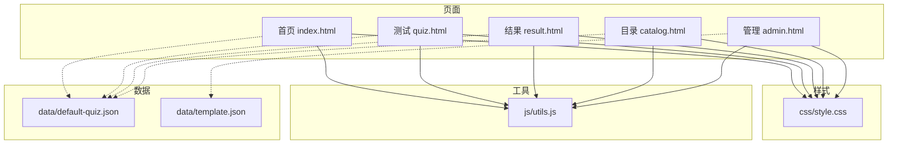
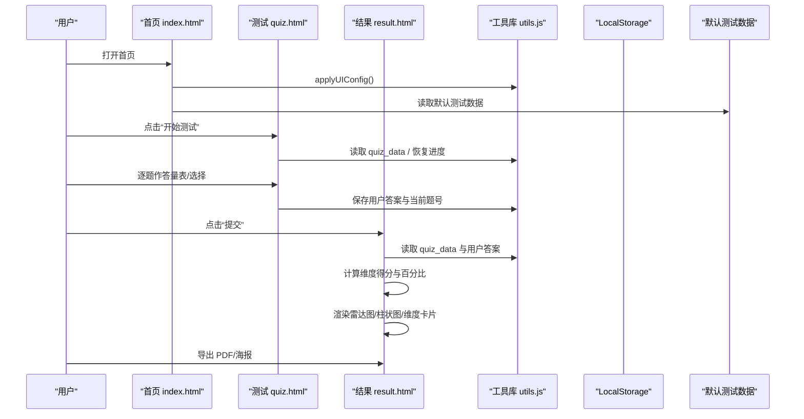
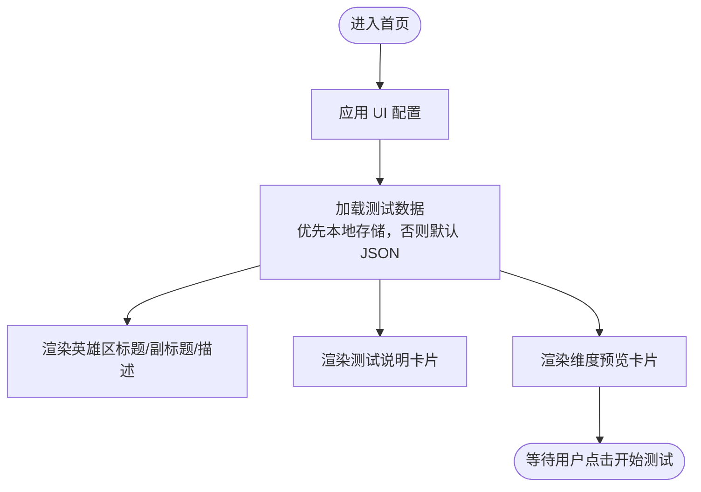
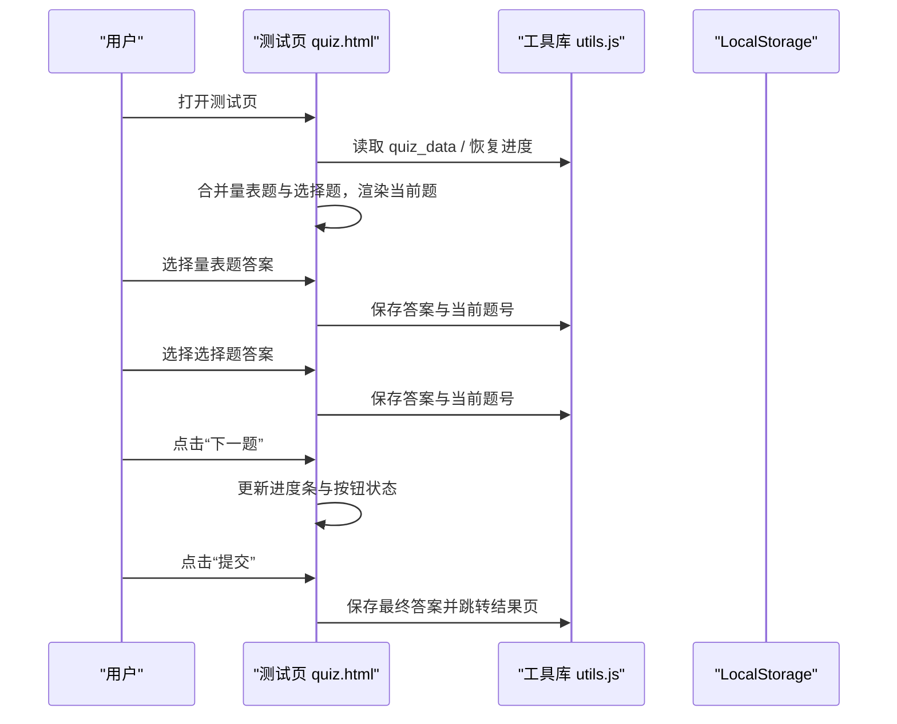
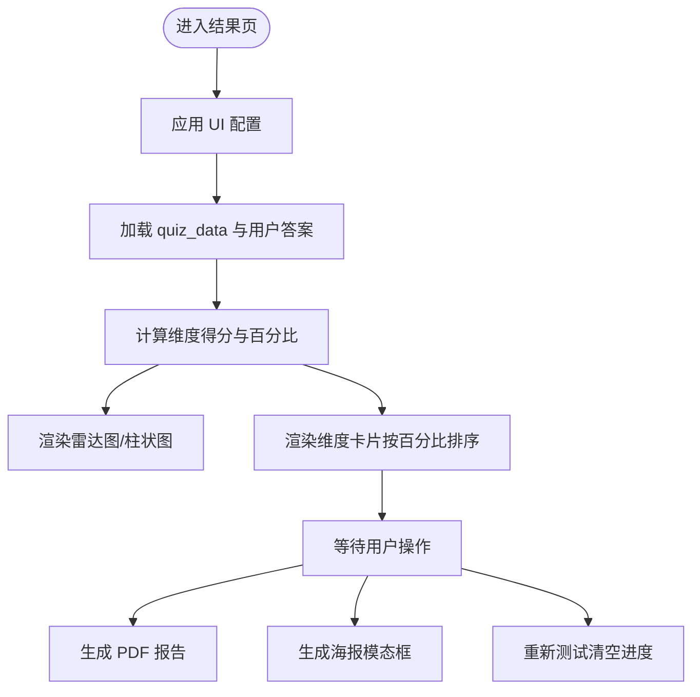
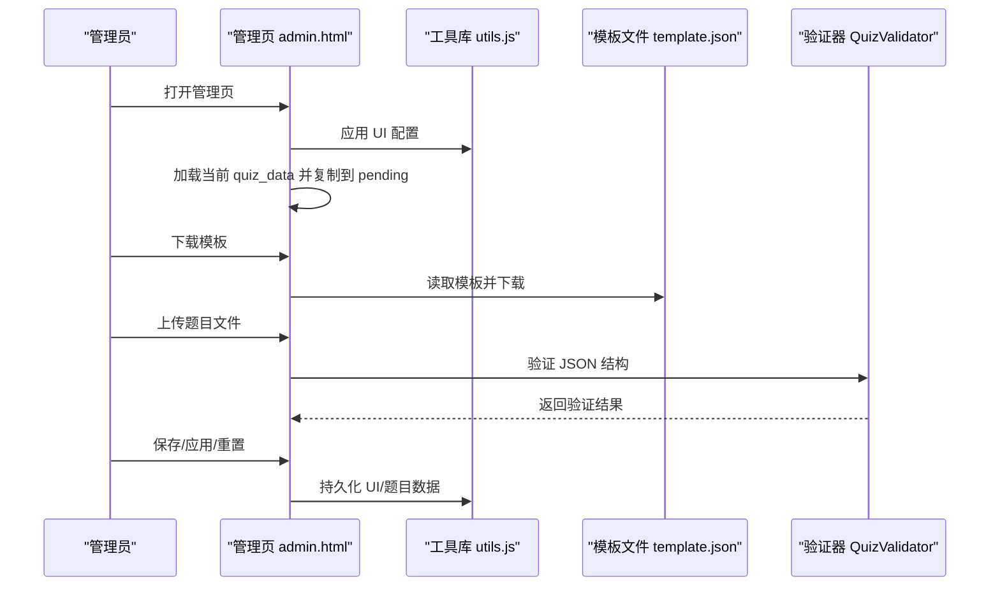
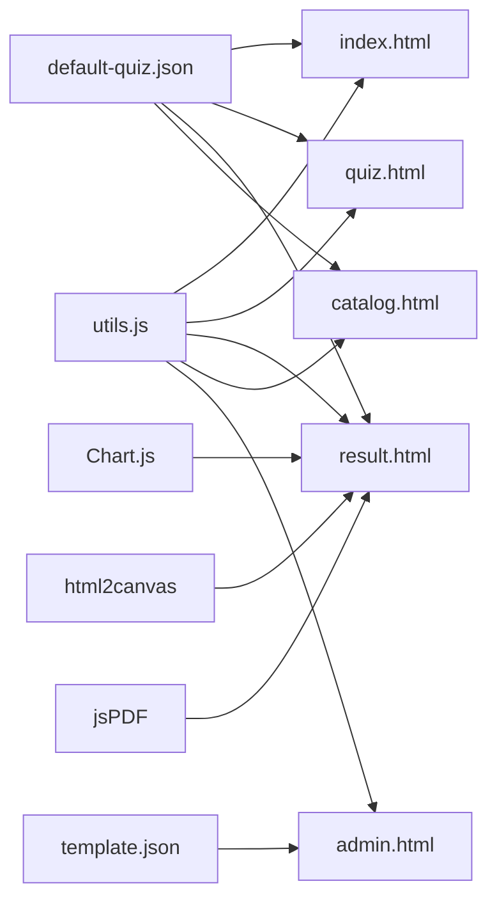

# 用户界面组件

<cite>
**本文引用的文件**
- [index.html](file://index.html)
- [quiz.html](file://quiz.html)
- [result.html](file://result.html)
- [catalog.html](file://catalog.html)
- [admin.html](file://admin.html)
- [css/style.css](file://css/style.css)
- [js/utils.js](file://js/utils.js)
- [data/default-quiz.json](file://data/default-quiz.json)
- [data/template.json](file://data/template.json)
</cite>

## 目录
1. [简介](#简介)
2. [项目结构](#项目结构)
3. [核心组件](#核心组件)
4. [架构总览](#架构总览)
5. [组件详细分析](#组件详细分析)
6. [依赖关系分析](#依赖关系分析)
7. [性能考量](#性能考量)
8. [故障排查指南](#故障排查指南)
9. [结论](#结论)
10. [附录](#附录)

## 简介
本文件面向设计师与开发者，系统化梳理心理测试 v2 项目的用户界面组件，覆盖首页、测试页面、结果页面、目录页面与管理后台五大页面的视觉外观、行为特征、交互模式与可访问性支持。文档同时阐述 CSS 变量系统、响应式布局、主题定制与动画效果实现，给出组件状态管理、事件处理、样式定制与性能优化建议，并提供组件组合模式与集成指南。

## 项目结构
项目采用“页面级 HTML + 共享 CSS + 工具 JS”的轻量架构：
- 页面：index.html、quiz.html、result.html、catalog.html、admin.html
- 样式：css/style.css（CSS 变量、组件样式、响应式与动画）
- 工具：js/utils.js（LocalStorage、数据校验、通用工具、UI 配置应用）
- 数据：data/default-quiz.json（默认测试数据）、data/template.json（题目模板）

**图表来源**
- [index.html](file://index.html)
- [quiz.html](file://quiz.html)
- [result.html](file://result.html)
- [catalog.html](file://catalog.html)
- [admin.html](file://admin.html)
- [css/style.css](file://css/style.css)
- [js/utils.js](file://js/utils.js)
- [data/default-quiz.json](file://data/default-quiz.json)
- [data/template.json](file://data/template.json)

**章节来源**
- [index.html](file://index.html)
- [quiz.html](file://quiz.html)
- [result.html](file://result.html)
- [catalog.html](file://catalog.html)
- [admin.html](file://admin.html)
- [css/style.css](file://css/style.css)
- [js/utils.js](file://js/utils.js)
- [data/default-quiz.json](file://data/default-quiz.json)
- [data/template.json](file://data/template.json)

## 核心组件
- 导航栏（导航链接、Logo、活动态样式）
- 卡片容器（阴影、圆角、悬停提升）
- 按钮组（主次按钮、禁用态、危险按钮）
- 进度条（小花生长动画）
- 单选题组（选项卡片、选中态）
- 量表题选项（五档评分按钮、选中态）
- 标签页（UI/文字/题目管理）
- 文件上传（拖拽与点击触发）
- 模态框（海报预览）
- 提示信息（成功/错误/信息）
- 响应式网格（目录卡片、结果图表）

**章节来源**
- [css/style.css](file://css/style.css)
- [index.html](file://index.html)
- [quiz.html](file://quiz.html)
- [result.html](file://result.html)
- [catalog.html](file://catalog.html)
- [admin.html](file://admin.html)

## 架构总览
页面间通过统一的工具库进行数据持久化与 UI 配置应用；测试数据通过默认 JSON 与模板 JSON 管理；结果页使用第三方图表库渲染雷达图与柱状图；PDF 与海报导出依赖外部库。

**图表来源**
- [index.html](file://index.html)
- [quiz.html](file://quiz.html)
- [result.html](file://result.html)
- [js/utils.js](file://js/utils.js)
- [data/default-quiz.json](file://data/default-quiz.json)

## 组件详细分析

### 首页组件（index.html）
- 视觉外观
  - 顶部导航栏（Logo、导航链接、活动态高亮）
  - 英雄区（居中标题、副标题、起始按钮、淡入动画）
  - 测试说明卡片（三列网格展示题目数量、预计用时、结果形式）
  - 维度预览卡片（动态生成，展示每个维度图标与描述）
- 行为特征
  - 页面加载时应用 UI 配置
  - 异步加载测试数据（优先本地存储，否则拉取默认 JSON），更新标题、参考、题目数量与维度预览
  - “开始测试”按钮跳转至测试页
- 交互模式
  - 按钮悬停与按压反馈
  - 卡片悬停阴影增强
- 可访问性
  - 使用语义化标题层级与对比度良好的颜色变量
  - 按钮具备焦点可见性（由样式提供）
- 状态管理
  - 仅在首次加载时拉取默认数据并缓存
- 事件处理
  - DOMContentLoaded 触发 UI 配置与数据加载
- 样式定制
  - 通过 CSS 变量控制主题色、背景、圆角、字体
- 性能
  - 仅一次性渲染维度预览，避免重复计算

**图表来源**
- [index.html](file://index.html)
- [css/style.css](file://css/style.css)
- [js/utils.js](file://js/utils.js)
- [data/default-quiz.json](file://data/default-quiz.json)

**章节来源**
- [index.html](file://index.html)
- [css/style.css](file://css/style.css)
- [js/utils.js](file://js/utils.js)
- [data/default-quiz.json](file://data/default-quiz.json)

### 测试页面组件（quiz.html）
- 视觉外观
  - 进度条（小花生长动画：茎高度与花朵图标随进度变化）
  - 题目卡片（类型标签、题号与题干、量表题五档按钮、选择题单选项卡片）
  - 导航按钮（上一题、下一题、提交）
- 行为特征
  - 页面加载时合并量表题与选择题，按题号顺序排列
  - 恢复用户进度（当前题号与答案）
  - 量表题：点击五档按钮即选中并保存；选择题：点击选项卡片即选中并保存
  - 更新进度条与按钮状态（最后题隐藏“下一题”，显示“提交”）
- 交互模式
  - 量表题按钮选中态高亮；选择题卡片选中态高亮
  - 按钮禁用态（未作答时）
  - 提交前校验是否全部作答
- 可访问性
  - 单选题使用隐藏 radio 实现卡片点击选中
  - 按钮具备禁用态视觉反馈
- 状态管理
  - 全局变量维护 quizData、allQuestions、currentQuestionIndex、answers
  - 通过工具库持久化用户答案与当前题号
- 事件处理
  - DOMContentLoaded 触发 UI 配置与数据加载
  - 上一题/下一题/提交按钮事件绑定
- 样式定制
  - 通过 CSS 变量与卡片阴影、圆角、渐变按钮统一风格
- 性能
  - 渲染时仅更新当前题与按钮状态，避免全量重绘

**图表来源**
- [quiz.html](file://quiz.html)
- [js/utils.js](file://js/utils.js)

**章节来源**
- [quiz.html](file://quiz.html)
- [css/style.css](file://css/style.css)
- [js/utils.js](file://js/utils.js)

### 结果页面组件（result.html）
- 视觉外观
  - 结果头部（庆祝表情、主要结果展示）
  - 图表区域（雷达图与柱状图并排）
  - 维度详情卡片（按得分降序排列，首项加徽章与强调边框）
  - 操作按钮（生成 PDF、生成海报、重新测试）
  - 海报模态框（预览与下载）
- 行为特征
  - 计算维度得分与百分比（量表题直接累加，选择题命中维度+5）
  - 渲染雷达图与柱状图（使用第三方图表库）
  - 维度卡片按百分比排序，首项突出显示
  - 支持 PDF 报告与海报生成（海报基于 html2canvas）
- 交互模式
  - 生成 PDF：弹出下载
  - 生成海报：打开模态框，预览后下载 PNG
  - 重新测试：清理进度并返回测试页
- 可访问性
  - 图表插件提供可读性配置（隐藏图例、轴刻度单位）
- 状态管理
  - 全局变量维护 quizData、answers、dimensionScores、图表实例
- 事件处理
  - DOMContentLoaded 触发 UI 配置与数据加载
  - 按钮点击事件绑定
- 样式定制
  - 通过 CSS 变量与卡片阴影、渐变背景统一风格
- 性能
  - 图表初始化仅一次；维度卡片按需渲染

**图表来源**
- [result.html](file://result.html)
- [js/utils.js](file://js/utils.js)

**章节来源**
- [result.html](file://result.html)
- [css/style.css](file://css/style.css)
- [js/utils.js](file://js/utils.js)

### 目录页面组件（catalog.html）
- 视觉外观
  - 英雄区（标题、副标题）
  - 测试卡片网格（当前测试卡片、占位卡片“敬请期待”）
  - 添加测试提示卡片（引导前往管理后台）
- 行为特征
  - 加载当前测试数据并更新卡片标题与描述
  - 占位卡片保持半透明与不可点击状态
- 交互模式
  - 当前测试卡片可点击跳转首页
  - “前往管理后台”按钮跳转管理页
- 可访问性
  - 卡片具备悬停与点击反馈
- 状态管理
  - 仅加载与展示，无用户输入
- 事件处理
  - DOMContentLoaded 触发 UI 配置与数据加载
- 样式定制
  - 通过 CSS 变量与网格布局适配移动端

**章节来源**
- [catalog.html](file://catalog.html)
- [css/style.css](file://css/style.css)
- [js/utils.js](file://js/utils.js)
- [data/default-quiz.json](file://data/default-quiz.json)

### 管理后台组件（admin.html）
- 视觉外观
  - 标签页（UI界面、文字&配图、题目管理）
  - UI配置面板（主题色、辅助色、背景色、字体、圆角）
  - 文字配置面板（首页标题、副标题、按钮文字、结果页标题、首页图标）
  - 题目管理面板（下载模板、上传文件、验证结果、当前题目概览）
  - 模态框（用于预览与确认）
- 行为特征
  - 标签页切换（激活对应 tab 内容）
  - UI配置：预览、保存、应用、重置
  - 文字配置：保存、应用、重置
  - 题目管理：下载模板、上传 JSON、验证、保存/应用/重置
- 交互模式
  - 颜色选择器即时预览 UI
  - 文件上传拖拽与点击两种方式
  - 验证结果显示成功/错误提示
- 可访问性
  - 表单控件具备焦点状态
- 状态管理
  - currentQuizData 与 pendingQuizData 分离编辑态与最终态
  - 通过工具库持久化 UI 配置与题目数据
- 事件处理
  - 标签页按钮事件、文件上传事件、按钮点击事件
- 样式定制
  - 通过 CSS 变量与卡片、网格、模态框统一风格
- 性能
  - 验证与概览按需渲染，避免全量重绘

**图表来源**
- [admin.html](file://admin.html)
- [js/utils.js](file://js/utils.js)
- [data/template.json](file://data/template.json)

**章节来源**
- [admin.html](file://admin.html)
- [css/style.css](file://css/style.css)
- [js/utils.js](file://js/utils.js)
- [data/template.json](file://data/template.json)

## 依赖关系分析
- 页面对工具库的依赖
  - 所有页面均引入工具库以应用 UI 配置与进行数据持久化
- 页面对数据的依赖
  - 首页、测试页、结果页、目录页依赖默认测试数据
  - 管理页依赖模板文件与验证器
- 外部库依赖
  - 结果页依赖 Chart.js、html2canvas、jsPDF
- 样式依赖
  - 所有页面共享同一 CSS 变量体系与组件样式

**图表来源**
- [js/utils.js](file://js/utils.js)
- [index.html](file://index.html)
- [quiz.html](file://quiz.html)
- [result.html](file://result.html)
- [catalog.html](file://catalog.html)
- [admin.html](file://admin.html)
- [data/default-quiz.json](file://data/default-quiz.json)
- [data/template.json](file://data/template.json)

**章节来源**
- [js/utils.js](file://js/utils.js)
- [css/style.css](file://css/style.css)
- [data/default-quiz.json](file://data/default-quiz.json)
- [data/template.json](file://data/template.json)

## 性能考量
- 渲染策略
  - 首页与目录页采用一次性渲染维度/卡片，避免频繁 DOM 更新
  - 测试页仅渲染当前题与按钮状态，减少重排重绘
  - 结果页图表仅初始化一次，维度卡片按需更新
- 存储策略
  - 使用 LocalStorage 缓存 quiz_data、用户答案与 UI 配置，减少网络请求
- 资源加载
  - 外部图表与导出库按需加载于结果页，避免影响其他页面性能
- 响应式
  - 移动端断点下调整字体、间距与按钮宽度，保证可读性与可用性

[本节为通用指导，无需特定文件引用]

## 故障排查指南
- 数据加载失败
  - 现象：首页/目录页标题显示“加载失败”
  - 排查：检查网络连接与 JSON 文件路径；确认默认数据格式正确
- 题目文件上传失败
  - 现象：验证失败提示或读取错误
  - 排查：确认上传文件为有效 JSON；符合模板字段要求；使用验证器输出的具体错误定位缺失字段
- 测试进度异常
  - 现象：重新开始后仍显示上次进度
  - 排查：确认“重新测试”调用了清除进度的方法
- 结果页图表不显示
  - 现象：图表空白
  - 排查：确认外部库已正确加载；确保容器尺寸与响应式断点下可渲染

**章节来源**
- [index.html](file://index.html)
- [quiz.html](file://quiz.html)
- [result.html](file://result.html)
- [admin.html](file://admin.html)
- [js/utils.js](file://js/utils.js)

## 结论
心理测试 v2 项目以简洁的页面结构与统一的 CSS 变量系统实现了良好的可定制性与一致性。通过工具库封装的 UI 配置与数据持久化，页面具备良好的用户体验与可维护性。建议在后续迭代中进一步完善管理后台的文字预览能力与结果页的无障碍细节，以提升整体可用性。

[本节为总结性内容，无需特定文件引用]

## 附录

### CSS 变量系统与主题定制
- 变量范围
  - 主题色、辅助色、背景色、文本色、阴影、圆角、字体、最大宽度、过渡时长
- 应用方式
  - 页面通过工具函数将配置写入 :root，组件样式统一引用变量
- 自定义入口
  - 管理后台 UI 标签页提供颜色、字体、圆角等配置项

**章节来源**
- [css/style.css](file://css/style.css)
- [js/utils.js](file://js/utils.js)
- [admin.html](file://admin.html)

### 响应式布局与断点
- 断点：768px
- 关键调整
  - 字体大小、内边距、卡片内边距
  - 量表题选项在移动端改为纵向排列
  - 导航按钮在移动端垂直堆叠
  - 目录卡片网格在移动端单列显示
  - 管理后台标签页在移动端横向滚动

**章节来源**
- [css/style.css](file://css/style.css)
- [index.html](file://index.html)
- [quiz.html](file://quiz.html)
- [catalog.html](file://catalog.html)
- [admin.html](file://admin.html)

### 动画与过渡效果
- 淡入动画：.fade-in
- 脉冲动画：.pulse（用于起始按钮）
- 进度条：小花生长（茎高度与花朵图标随进度变化）
- 悬停与按压：按钮与卡片的阴影与位移

**章节来源**
- [css/style.css](file://css/style.css)
- [index.html](file://index.html)
- [quiz.html](file://quiz.html)

### 组件状态管理与事件处理清单
- 首页
  - 状态：quizData、维度预览
  - 事件：DOMContentLoaded、按钮点击
- 测试页
  - 状态：quizData、allQuestions、currentQuestionIndex、answers
  - 事件：上一题/下一题/提交、量表题/选择题选中
- 结果页
  - 状态：quizData、answers、dimensionScores、图表实例
  - 事件：DOM 内容加载、PDF/海报生成、重新测试
- 目录页
  - 状态：当前测试数据
  - 事件：DOMContentLoaded、卡片点击
- 管理后台
  - 状态：currentQuizData、pendingQuizData
  - 事件：标签页切换、UI/文字/题目配置操作

**章节来源**
- [index.html](file://index.html)
- [quiz.html](file://quiz.html)
- [result.html](file://result.html)
- [catalog.html](file://catalog.html)
- [admin.html](file://admin.html)
- [js/utils.js](file://js/utils.js)

### 集成指南与最佳实践
- 新增页面
  - 引入统一样式与工具库
  - 在 DOMContentLoaded 中调用 UI 配置应用
  - 使用 CSS 变量与现有组件类名保持一致
- 自定义测试
  - 使用模板 JSON 定义题目结构
  - 通过管理后台上传并验证
  - 使用 LocalStorage 键名常量进行数据持久化
- 性能优化
  - 避免在渲染循环中进行复杂计算
  - 对外部库按需加载
  - 使用防抖与节流优化高频事件

**章节来源**
- [admin.html](file://admin.html)
- [js/utils.js](file://js/utils.js)
- [data/template.json](file://data/template.json)