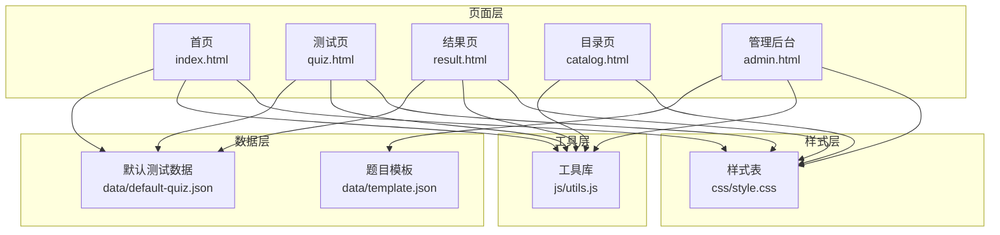
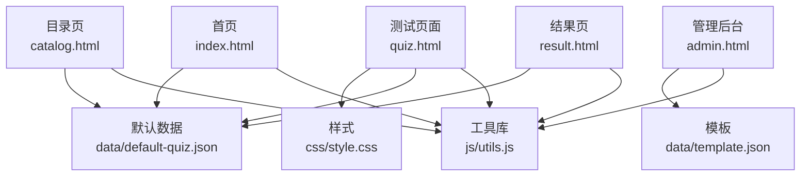
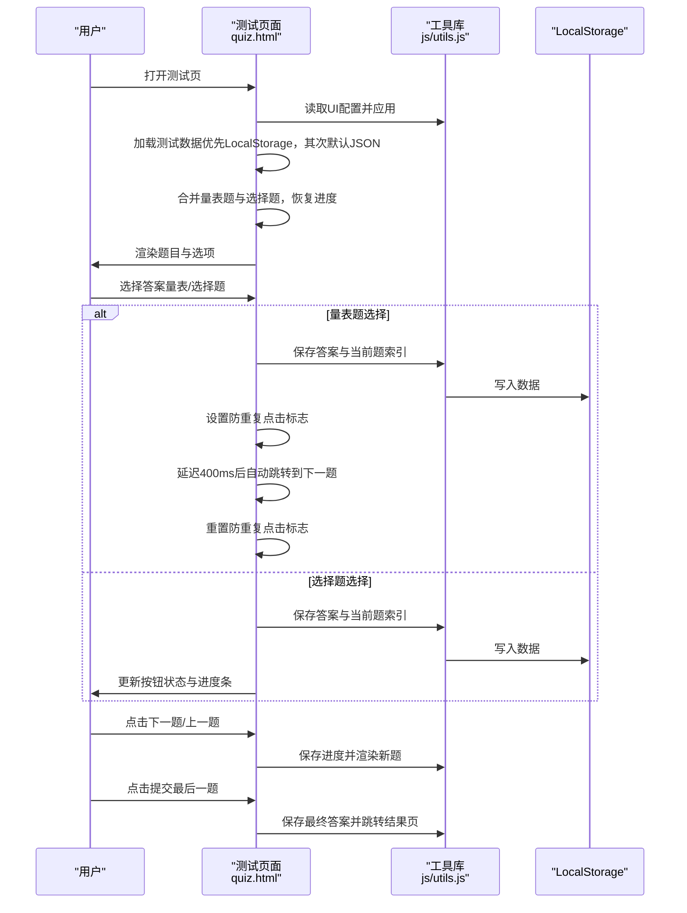
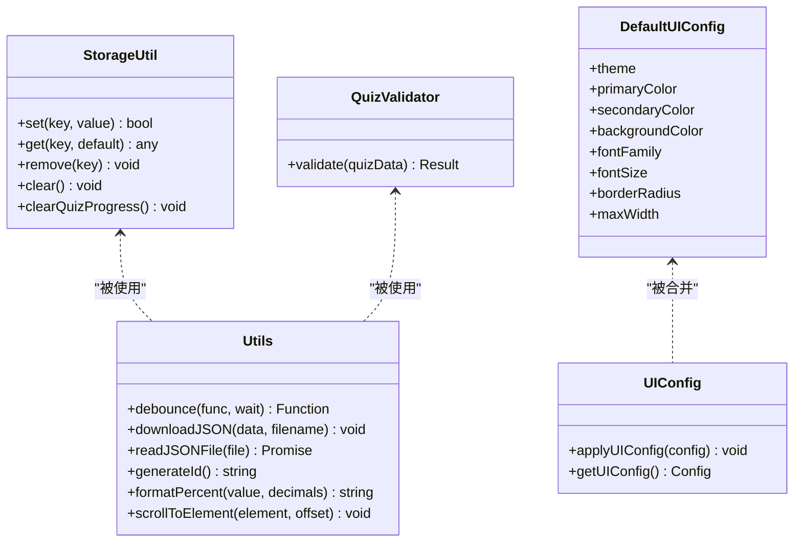
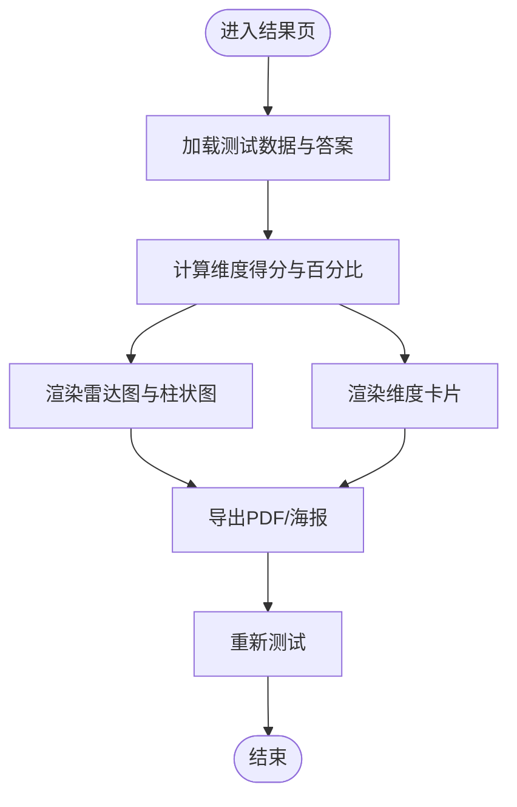
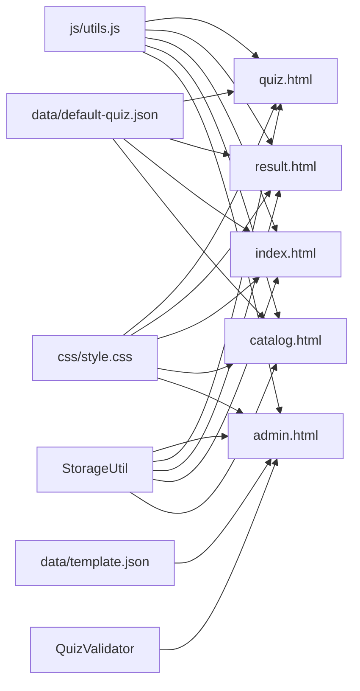

# 测试页面设计

<cite>
**本文档引用的文件**
- [quiz.html](file://程序/quiz.html)
- [index.html](file://程序/index.html)
- [result.html](file://程序/result.html)
- [admin.html](file://程序/admin.html)
- [catalog.html](file://程序/catalog.html)
- [data/default-quiz.json](file://程序/data/default-quiz.json)
- [data/template.json](file://程序/data/template.json)
- [js/utils.js](file://程序/js/utils.js)
- [css/style.css](file://程序/css/style.css)
</cite>

## 更新摘要
**变更内容**
- 新增完整的测试页面功能，包括题目渲染、答案选择、进度跟踪、自动跳转等核心功能
- 实现了量表题和选择题两种题型的差异化交互设计
- 集成了小花生长动画进度条和实时进度显示系统
- 完善了防重复点击保护机制和事件委托优化
- 新增了完整的工具库支持，包括数据验证、UI配置、存储管理等功能
- 实现了完整的测试数据加载、保存、恢复机制

## 目录
1. [简介](#简介)
2. [项目结构](#项目结构)
3. [核心组件](#核心组件)
4. [架构总览](#架构总览)
5. [详细组件分析](#详细组件分析)
6. [依赖关系分析](#依赖关系分析)
7. [性能考虑](#性能考虑)
8. [故障排除指南](#故障排除指南)
9. [结论](#结论)
10. [附录](#附录)

## 简介
本文件面向"心理测试页面组件设计"，系统性阐述测试页面的布局架构、题目渲染与答案收集机制、实时进度保存、小花生长动画与进度条可视化、交互设计与键盘支持、答案验证与数据持久化、离线处理、用户体验优化、无障碍访问与移动端适配，以及组件扩展与性能优化建议。目标读者既包括前端工程师，也包括产品与运营人员。

## 项目结构
该项目采用静态页面+本地存储的轻量级架构，核心页面与资源分布如下：
- 页面层：首页、测试页、结果页、目录页、管理后台
- 数据层：默认测试数据与模板
- 工具层：通用工具与UI配置
- 样式层：统一CSS样式与响应式设计

**图表来源**
- [index.html](file://程序/index.html)
- [quiz.html](file://程序/quiz.html)
- [result.html](file://程序/result.html)
- [catalog.html](file://程序/catalog.html)
- [admin.html](file://程序/admin.html)
- [data/default-quiz.json](file://程序/data/default-quiz.json)
- [data/template.json](file://程序/data/template.json)
- [js/utils.js](file://程序/js/utils.js)
- [css/style.css](file://程序/css/style.css)

**章节来源**
- [index.html](file://程序/index.html)
- [quiz.html](file://程序/quiz.html)
- [result.html](file://程序/result.html)
- [catalog.html](file://程序/catalog.html)
- [admin.html](file://程序/admin.html)
- [data/default-quiz.json](file://程序/data/default-quiz.json)
- [data/template.json](file://程序/data/template.json)
- [js/utils.js](file://程序/js/utils.js)
- [css/style.css](file://程序/css/style.css)

## 核心组件
- **测试页面（quiz.html）**：负责加载测试数据、渲染题目、收集答案、保存进度、更新进度条与小花动画、控制导航按钮状态。实现了量表题和选择题的不同交互逻辑，包括自动跳转和手动跳转。
- **工具库（js/utils.js）**：封装LocalStorage操作、数据校验、UI配置应用与通用工具函数。
- **样式表（css/style.css）**：定义主题变量、组件样式、动画与响应式断点。
- **默认数据（data/default-quiz.json）**：包含测试元信息、维度定义、量表题与选择题。
- **结果页（result.html）**：计算得分、渲染图表与维度详情、导出PDF与海报。
- **管理后台（admin.html）**：提供UI配置、文字配置、题目导入与验证。
- **目录页（catalog.html）**：展示当前测试卡片与占位信息。
- **首页（index.html）**：加载测试数据、展示测试说明与维度预览。

**章节来源**
- [quiz.html](file://程序/quiz.html)
- [js/utils.js](file://程序/js/utils.js)
- [css/style.css](file://程序/css/style.css)
- [data/default-quiz.json](file://程序/data/default-quiz.json)
- [result.html](file://程序/result.html)
- [admin.html](file://程序/admin.html)
- [catalog.html](file://程序/catalog.html)
- [index.html](file://程序/index.html)

## 架构总览
整体采用"页面-数据-工具-样式"分层设计，页面通过工具库进行数据持久化与UI配置，样式通过CSS变量实现主题化与响应式适配。

**图表来源**
- [quiz.html](file://程序/quiz.html)
- [result.html](file://程序/result.html)
- [admin.html](file://程序/admin.html)
- [index.html](file://程序/index.html)
- [catalog.html](file://程序/catalog.html)
- [js/utils.js](file://程序/js/utils.js)
- [css/style.css](file://程序/css/style.css)
- [data/default-quiz.json](file://程序/data/default-quiz.json)
- [data/template.json](file://程序/data/template.json)

## 详细组件分析

### 测试页面（quiz.html）组件设计
- **布局架构**
  - 导航栏：固定顶部，包含站点Logo与主导航链接。
  - 进度容器：包含"小花生长"进度条与题号显示。
  - 题目卡片：居中卡片，动态渲染题目与选项。
  - 导航按钮：上一题、下一题、提交按钮，根据当前题与答案状态动态启用/禁用。
- **题目渲染逻辑**
  - 量表题：5个数值选项（1-5），带标签；选择后高亮。
  - 选择题：A-E选项，每个选项关联一个维度；选中后高亮。
  - 类型标识：在题目上方显示"量表题/选择题"标签。
- **答案收集机制**
  - 量表题：通过点击数字按钮记录答案，支持自动跳转到下一题。
  - 选择题：通过点击选项触发多选，支持取消选中，不自动跳转。
  - 答案对象：以题目ID为键，值为答案（数字或字母数组）。
- **实时进度保存**
  - 每次选择答案后立即调用保存函数，写入LocalStorage中的答案与当前题索引。
  - 页面加载时从LocalStorage恢复进度。
- **进度条与小花动画**
  - 进度条高度：基于当前题序与总题数计算百分比，映射到茎部高度。
  - 小花阶段：按进度比例映射到不同emoji阶段，实现"小花生长"动画。
- **导航控制**
  - 上一题/下一题：禁用首尾题的对应按钮；有答案才启用"下一题"。
  - 提交：最后一题启用，且仅在有答案时可用。
- **用户反馈机制**
  - 按钮状态变化、选项高亮、题号更新、小花阶段变化均提供即时反馈。
- **交互设计与键盘支持**
  - 量表题通过点击数字按钮选择，支持自动跳转。
  - 选择题通过点击选项触发单选/取消，支持多选。
  - 页面未实现键盘快捷键绑定，建议后续增加空格/回车选择、方向键切换等。
- **答案验证机制**
  - 答案收集本身无严格校验，仅在提交时检查是否全部作答。
- **数据持久化与离线处理**
  - 使用LocalStorage保存答案与当前题索引；若数据损坏则清理并重新加载默认数据。
  - 若无法加载默认数据，页面显示错误提示并引导返回首页。
- **移动端适配**
  - 量表题选项在窄屏下改为纵向排列；导航按钮在窄屏下垂直堆叠。
  - 字体尺寸与间距按断点调整，保证阅读体验。

**更新** 新增防重复点击保护机制和改进的交互逻辑

**图表来源**
- [quiz.html](file://程序/quiz.html)
- [js/utils.js](file://程序/js/utils.js)

**章节来源**
- [quiz.html](file://程序/quiz.html)
- [css/style.css](file://程序/css/style.css)
- [js/utils.js](file://程序/js/utils.js)

### 工具库（js/utils.js）组件设计
- **存储工具（StorageUtil）**
  - 提供set/get/remove/clear方法，封装异常处理。
  - 提供clearQuizProgress用于清理测试进度。
- **数据校验（QuizValidator）**
  - 校验测试名称、题目数量、维度定义、量表题与选择题结构。
  - 返回校验结果与错误列表。
- **UI配置（DefaultUIConfig + applyUIConfig）**
  - 默认主题色、辅助色、背景色、字体、圆角、最大宽度。
  - 通过CSS变量应用到根节点，实现全局主题化。
- **通用工具（Utils）**
  - 防抖、下载JSON、读取JSON文件、生成ID、格式化百分比、平滑滚动。

**图表来源**
- [js/utils.js](file://程序/js/utils.js)

**章节来源**
- [js/utils.js](file://程序/js/utils.js)

### 样式与主题（css/style.css）
- **CSS变量**：定义主题色、背景色、字体、圆角、最大宽度等。
- **组件样式**：导航栏、卡片、按钮、单选组、量表按钮、进度条与小花动画、响应式断点。
- **动画**：淡入与脉冲动画，提升交互体验。
- **响应式**：针对768px以下设备优化布局与间距。

**章节来源**
- [css/style.css](file://程序/css/style.css)

### 默认数据与模板（data/default-quiz.json, data/template.json）
- **默认数据**：包含测试名称、理论基础、题目数量、维度定义、量表题与选择题。
- **模板**：提供标准字段结构，便于导入与校验。

**章节来源**
- [data/default-quiz.json](file://程序/data/default-quiz.json)
- [data/template.json](file://程序/data/template.json)

### 结果页（result.html）组件设计
- **计算逻辑**：遍历量表题与选择题，按维度累计得分与满分，计算百分比。
- **可视化**：雷达图与柱状图展示维度得分；维度卡片按得分排序，突出最高分维度。
- **导出功能**：PDF报告与分享海报（截图+下载）。
- **重新测试**：清理进度并回到测试页。

**图表来源**
- [result.html](file://程序/result.html)

**章节来源**
- [result.html](file://程序/result.html)

### 管理后台（admin.html）组件设计
- **标签页**：UI界面、文字&配图、题目管理。
- **UI配置**：颜色、字体、圆角、最大宽度，支持预览、保存、应用、重置。
- **文字配置**：首页标题、副标题、按钮文字、结果页标题与图标，支持预览、保存、应用、重置。
- **题目管理**：下载模板、上传JSON、验证、预览、保存、应用、重置。
- **验证器**：使用工具库的QuizValidator进行数据校验。

**章节来源**
- [admin.html](file://程序/admin.html)
- [js/utils.js](file://程序/js/utils.js)

### 目录页（catalog.html）与首页（index.html）
- **目录页**：展示当前测试卡片与占位信息，加载当前测试数据。
- **首页**：加载测试数据，展示测试说明、维度预览与开始按钮；支持从默认JSON或LocalStorage加载。

**章节来源**
- [catalog.html](file://程序/catalog.html)
- [index.html](file://程序/index.html)

## 依赖关系分析
- **页面对工具库的依赖**：quiz.html、result.html、index.html、catalog.html、admin.html均依赖js/utils.js。
- **页面对样式的依赖**：所有页面依赖css/style.css。
- **页面对数据的依赖**：quiz.html、result.html、index.html、catalog.html依赖data/default-quiz.json；admin.html依赖data/template.json。
- **工具库内部依赖**：QuizValidator依赖Utils；UI配置依赖StorageUtil。

**图表来源**
- [js/utils.js](file://程序/js/utils.js)
- [css/style.css](file://程序/css/style.css)
- [data/default-quiz.json](file://程序/data/default-quiz.json)
- [data/template.json](file://程序/data/template.json)
- [quiz.html](file://程序/quiz.html)
- [result.html](file://程序/result.html)
- [index.html](file://程序/index.html)
- [catalog.html](file://程序/catalog.html)
- [admin.html](file://程序/admin.html)

**章节来源**
- [js/utils.js](file://程序/js/utils.js)
- [css/style.css](file://程序/css/style.css)
- [data/default-quiz.json](file://程序/data/default-quiz.json)
- [data/template.json](file://程序/data/template.json)
- [quiz.html](file://程序/quiz.html)
- [result.html](file://程序/result.html)
- [index.html](file://程序/index.html)
- [catalog.html](file://程序/catalog.html)
- [admin.html](file://程序/admin.html)

## 性能考虑
- **数据加载**
  - 优先使用LocalStorage减少网络请求；若损坏则降级到默认JSON。
  - 对于大型测试数据，建议分页加载或懒加载题目片段。
- **渲染优化**
  - 题目渲染采用内联HTML拼接，建议改用模板引擎或虚拟DOM以降低重排重绘。
  - 量表题选项在窄屏下纵向排列，避免过多横向滚动。
- **动画与过渡**
  - 进度条与小花动画使用CSS过渡，性能良好；图表渲染使用Chart.js，建议在低端设备上延迟初始化。
- **存储与缓存**
  - 使用LocalStorage存储答案与进度，注意容量限制；建议定期清理过期数据。
- **网络与离线**
  - 通过Service Worker或PWA策略实现离线缓存，提升离线可用性。
- **事件处理优化**
  - 使用事件委托处理题目选项点击，提升性能并减少内存占用。

## 故障排除指南
- **测试数据加载失败**
  - 现象：测试页显示错误提示，无法进入答题。
  - 排查：检查默认JSON文件是否存在与格式正确；确认网络请求未被拦截。
  - 处理：清理LocalStorage中的损坏数据，重新加载默认数据。
- **答案未保存或进度丢失**
  - 现象：刷新页面后进度清空。
  - 排查：检查LocalStorage是否被清理或禁用；确认保存函数调用链。
  - 处理：确保每次选择答案后调用保存函数；必要时在页面卸载前再次保存。
- **结果页无数据**
  - 现象：结果页提示请先完成测试。
  - 排查：确认LocalStorage中存在答案数据。
  - 处理：回到测试页完成答题后重试。
- **管理后台无法上传题目**
  - 现象：上传文件后提示格式错误或验证失败。
  - 排查：确认上传文件为合法JSON，符合模板结构。
  - 处理：使用模板下载并按要求填写字段，重新上传。
- **自动跳转失效**
  - 现象：量表题选择后无法自动跳转。
  - 排查：检查isTransitioning标志是否被正确设置和重置。
  - 处理：确认防重复点击机制正常工作，延迟时间设置合理。

**章节来源**
- [quiz.html](file://程序/quiz.html)
- [result.html](file://程序/result.html)
- [admin.html](file://程序/admin.html)

## 结论
该心理测试页面组件设计以简洁清晰的静态页面为基础，结合LocalStorage实现数据持久化与进度恢复，配合工具库与样式系统实现主题化与响应式适配。测试页面的题目渲染、答案收集、进度保存与可视化反馈形成闭环，结果页提供丰富的图表与导出能力。管理后台支持UI与题目配置，便于运营维护。新增的量表题自动跳转功能和选择题多选机制显著提升了用户体验。优化的防重复点击保护机制和事件委托处理进一步增强了系统的稳定性和性能。建议后续增强键盘支持、图表懒加载与离线缓存策略，进一步提升用户体验与性能表现。

## 附录

### 组件扩展指南
- **键盘快捷键支持**
  - 为量表题与选择题添加键盘事件监听（如数字键1-5、字母A-E），提升无障碍与效率。
- **答案验证与提示**
  - 在提交前增加必答题标记与未作答提示，减少重复提醒。
- **图表优化**
  - 对Chart.js图表进行懒加载与骨架屏，减少首屏渲染压力。
- **离线缓存**
  - 引入Service Worker与Manifest，实现PWA能力，支持离线浏览与安装。
- **多语言支持**
  - 通过配置文件与国际化工具，扩展多语言版本。
- **交互增强**
  - 添加手势支持、语音识别、触觉反馈等现代交互方式。
- **性能监控**
  - 集成性能监控工具，跟踪页面加载时间、交互延迟和内存使用情况。

### 优化后的导航逻辑详解

**更新** 新增防重复点击保护机制和改进的交互逻辑

#### 量表题自动跳转机制
- **防重复点击保护**：通过`isTransitioning`标志防止用户在动画过程中重复点击
- **自动跳转流程**：选择答案后400ms延迟自动跳转到下一题
- **样式更新**：直接更新选项样式而不重新渲染整个题目
- **最后题目处理**：最后一题时不自动跳转，而是重新渲染显示提交按钮
- **性能优化**：避免不必要的重渲染，提升用户体验

#### 选择题多选交互
- **多选支持**：点击选项切换选中状态，支持多次点击取消
- **数组管理**：答案以数组形式存储，支持多个选项同时选中
- **状态同步**：直接更新点击选项的样式，保持界面响应性
- **无自动跳转**：选择题不自动跳转，等待用户点击下一题
- **即时反馈**：用户操作后立即看到视觉反馈

#### 按钮状态管理
- **智能启用/禁用**：根据当前题是否已作答动态控制按钮状态
- **类型区分**：量表题和选择题使用不同的答案验证逻辑
- **最后题目特殊处理**：自动切换到提交按钮并启用提交功能
- **状态同步**：答案保存后立即更新UI状态，提供即时反馈

#### 进度条动画优化
- **流畅过渡**：进度条高度变化使用CSS过渡动画，提供平滑的视觉反馈
- **小花生长**：通过emoji表情符号渐变展示测试进度，增强用户参与感
- **实时更新**：每次答案选择后立即更新进度显示
- **阶段划分**：五个生长阶段对应不同进度区间

#### 交互细节优化
- **事件委托**：使用事件委托处理题目选项点击，提升性能
- **延迟机制**：量表题选择后400ms延迟，让用户看到选择效果
- **状态同步**：答案保存后立即更新UI状态，提供即时反馈
- **边界处理**：正确处理首题和末题的导航逻辑
- **防抖处理**：防止快速连续点击导致的状态混乱

**章节来源**
- [quiz.html](file://程序/quiz.html)
- [css/style.css](file://程序/css/style.css)
- [js/utils.js](file://程序/js/utils.js)