# 目录页面设计

<cite>
**本文档引用的文件**
- [catalog.html](file://程序/catalog.html)
- [index.html](file://程序/index.html)
- [style.css](file://程序/css/style.css)
- [utils.js](file://程序/js/utils.js)
- [default-quiz.json](file://程序/data/default-quiz.json)
- [template.json](file://程序/data/template.json)
</cite>

## 更新摘要
**变更内容**
- 新增了独立的目录页面实现，专门用于测试合集展示
- 优化了当前测试卡片展示，增强了信息完整性和视觉效果
- 目录页面现在提供更精简但功能完整的测试合集展示
- 首页保留基础测试信息展示，与目录页面形成互补
- 改进了数据加载机制，增强了错误处理和降级策略
- 完善了UI配置管理和主题切换功能

**更新** 目录页面设计优化，改进了测试合集的展示方式，增强了当前测试卡片的信息展示。当前测试卡片现在包含更丰富的信息展示，包括测试名称和参考来源，为用户提供了更完整的测试概览。

## 目录
1. [简介](#简介)
2. [项目结构](#项目结构)
3. [核心组件](#核心组件)
4. [架构概览](#架构概览)
5. [详细组件分析](#详细组件分析)
6. [依赖关系分析](#依赖关系分析)
7. [性能考虑](#性能考虑)
8. [故障排除指南](#故障排除指南)
9. [结论](#结论)
10. [附录](#附录)

## 简介

心理测试目录页面是一个基于Web的心理测评系统的核心入口页面，采用现代化的卡片式布局设计，为用户提供测试合集的浏览和导航体验。该系统实现了完整的心理测试流程，从首页介绍、目录页面展示到答题和结果分析的端到端解决方案。

**更新** 系统现已将目录功能从首页迁移到独立的目录页面（catalog.html），提供更丰富的测试合集展示功能。目录页面经过简化优化，专注于核心的测试展示功能，移除了冗余的导航项，使用户能够更专注于测试内容本身。

**更新** 目录页面设计优化，改进了测试合集的展示方式，增强了当前测试卡片的信息展示。当前测试卡片现在包含更丰富的信息展示，包括测试名称和参考来源，为用户提供了更完整的测试概览。

系统采用响应式设计理念，支持桌面端和移动端的无缝切换，通过CSS Grid和Flexbox技术实现灵活的布局适配。页面集成了本地存储机制，确保用户数据的安全性和离线可用性。

## 项目结构

该项目采用模块化的文件组织结构，每个页面都有明确的功能定位和职责分工：

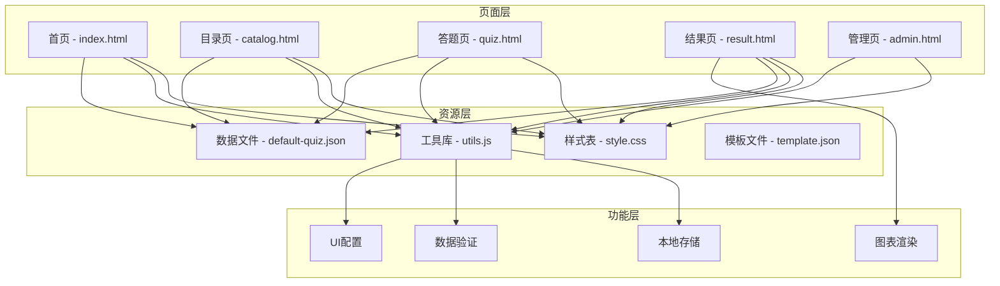

**图表来源**
- [catalog.html:1-90](file://程序/catalog.html#L1-L90)
- [index.html:1-518](file://程序/index.html#L1-L518)
- [style.css:1-702](file://程序/css/style.css#L1-L702)
- [utils.js:1-250](file://程序/js/utils.js#L1-L250)

**章节来源**
- [catalog.html:1-90](file://程序/catalog.html#L1-L90)
- [index.html:1-518](file://程序/index.html#L1-L518)
- [style.css:1-702](file://程序/css/style.css#L1-L702)
- [utils.js:1-250](file://程序/js/utils.js#L1-L250)

## 核心组件

### 独立目录页面组件

**更新** 系统新增了独立的目录页面，专门用于测试合集展示：

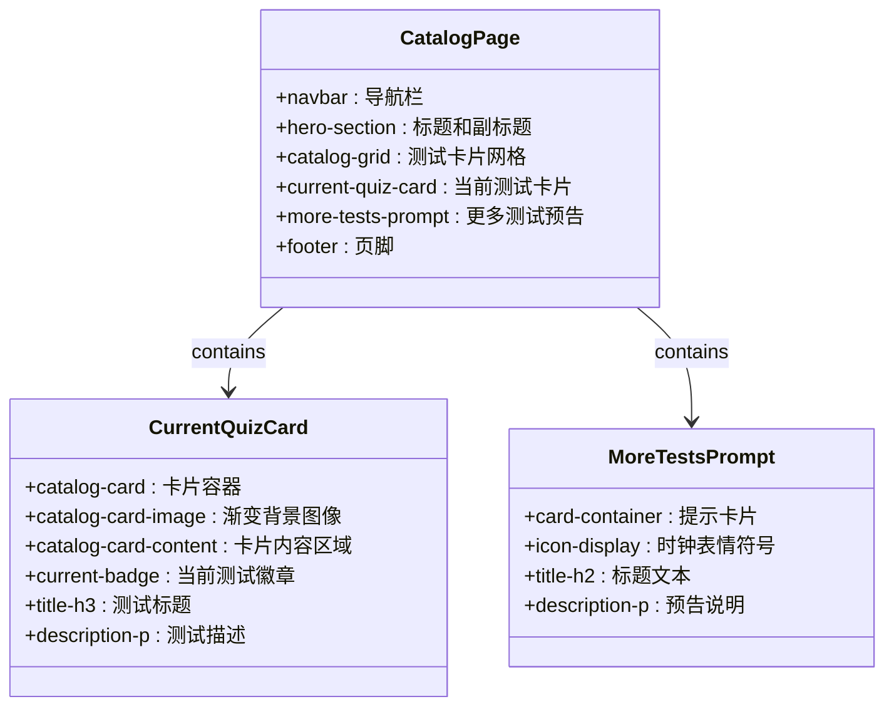

**图表来源**
- [catalog.html:10-51](file://程序/catalog.html#L10-L51)
- [style.css:351-396](file://程序/css/style.css#L351-L396)

### 首页集成的测试合集

**更新** 首页仍保留基础的测试合集展示功能：

首页实现了简化的测试合集展示功能：

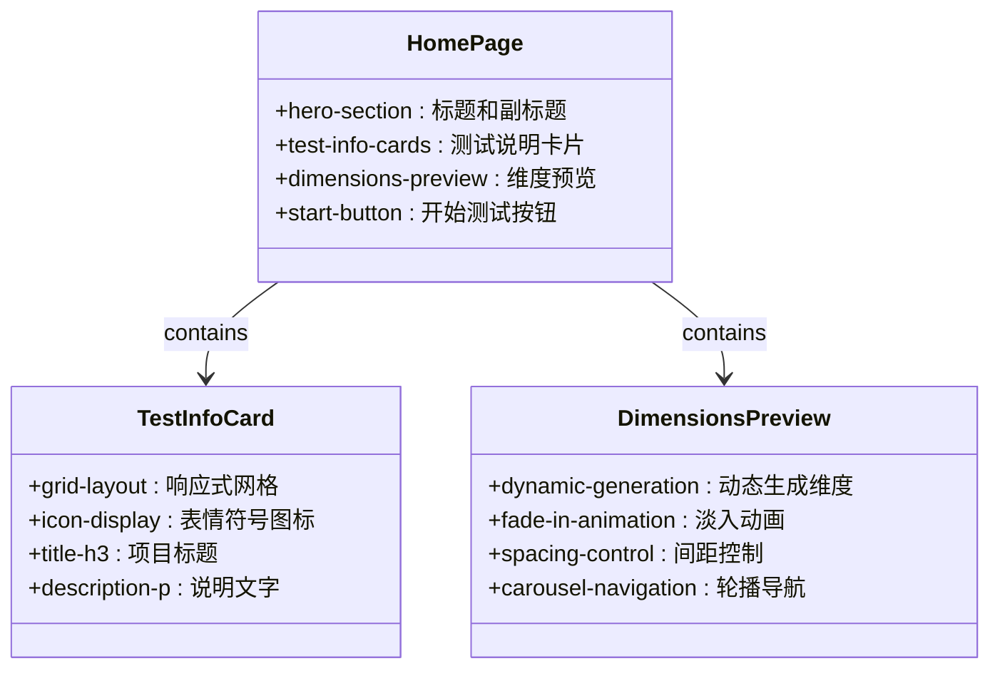

**图表来源**
- [index.html:22-66](file://程序/index.html#L22-L66)
- [style.css:351-396](file://程序/css/style.css#L351-L396)

### 数据加载机制

系统实现了多层次的数据加载策略，确保数据的可靠性和性能：

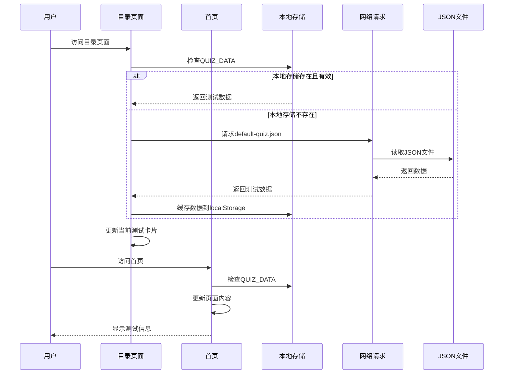

**图表来源**
- [catalog.html:61-86](file://程序/catalog.html#L61-L86)
- [index.html:90-140](file://程序/index.html#L90-L140)
- [utils.js:17-50](file://程序/js/utils.js#L17-L50)

**章节来源**
- [catalog.html:61-86](file://程序/catalog.html#L61-L86)
- [index.html:90-140](file://程序/index.html#L90-L140)
- [utils.js:17-50](file://程序/js/utils.js#L17-L50)

## 架构概览

### 整体架构设计

**更新** 系统采用前后端分离的架构模式，目录功能已迁移到独立页面：

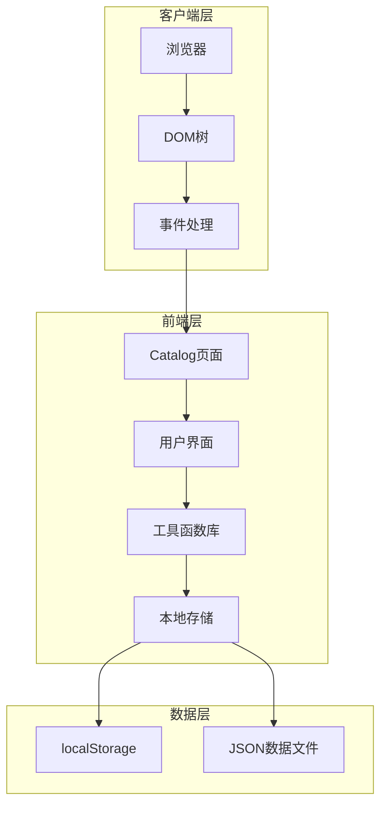

**图表来源**
- [catalog.html:61-86](file://程序/catalog.html#L61-L86)
- [utils.js:1-250](file://程序/js/utils.js#L1-L250)

### 组件交互流程

**更新** 目录页面的交互流程更加独立和完整：

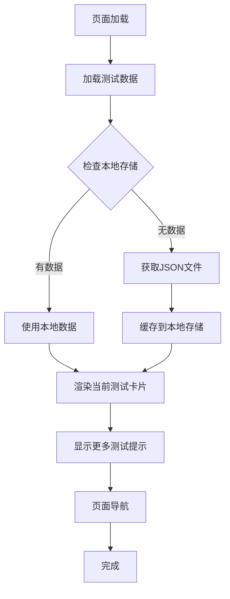

**图表来源**
- [catalog.html:61-86](file://程序/catalog.html#L61-L86)
- [style.css:369-373](file://程序/css/style.css#L369-L373)

**章节来源**
- [catalog.html:61-86](file://程序/catalog.html#L61-L86)
- [style.css:351-396](file://程序/css/style.css#L351-L396)

## 详细组件分析

### 目录页面组件

#### 布局设计原理

**更新** 目录页面采用专门的卡片式布局设计，经过简化优化：

- **导航栏**：包含品牌Logo和页面导航链接，当前页面标记为活动状态
- **Hero区域**：包含主标题"测试合集"和副标题说明
- **测试卡片网格**：使用CSS Grid布局，支持响应式自适应
- **当前测试卡片**：展示当前测试的详细信息，包含渐变背景和徽章标识
- **更多测试提示**：提供"更多精彩测试"的预告功能，引导用户期待后续内容
- **页脚**：包含版权信息

**更新** 当前测试卡片的信息展示得到了显著增强：

- **测试名称**：显示完整的测试名称（如"爱的五种语言测试"）
- **参考来源**：显示理论参考（如"Gary Chapman 的五种爱语理论"）
- **渐变背景**：使用渐变色背景突出当前测试的重要性
- **徽章标识**：明确标注"当前测试"状态

#### 卡片设计规范

每个测试卡片都遵循统一的设计规范：

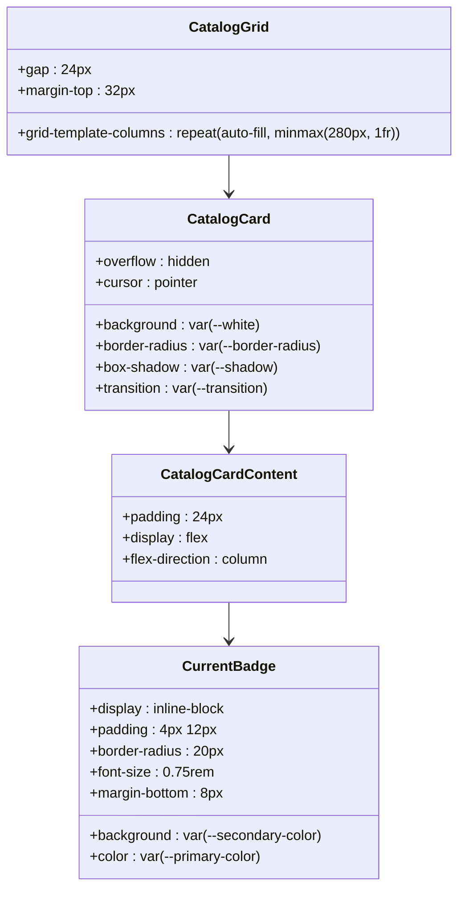

**图表来源**
- [style.css:351-396](file://程序/css/style.css#L351-L396)

#### 交互反馈机制

**更新** 目录页面的交互反馈机制更加丰富：

- **卡片悬停效果**：向上位移4px和阴影增强，提供立体感
- **渐变背景**：当前测试卡片使用渐变色背景，突出显示
- **徽章标识**：当前测试卡片包含"当前测试"徽章，明确状态
- **淡入动画**：页面元素的渐入效果，提升用户体验

**章节来源**
- [style.css:351-396](file://程序/css/style.css#L351-L396)

### 首页测试合集组件

#### 布局设计原理

**更新** 首页的测试合集功能保持简洁实用：

- **Hero区域**：包含主标题、副标题和开始测试按钮
- **测试描述**：展示测试的详细说明和理论基础
- **测试信息卡片**：展示题目数量、预计用时、结果形式等基本信息
- **维度预览**：动态生成测试维度的预览内容，支持轮播导航

#### 卡片设计规范

每个测试卡片都遵循统一的设计规范：

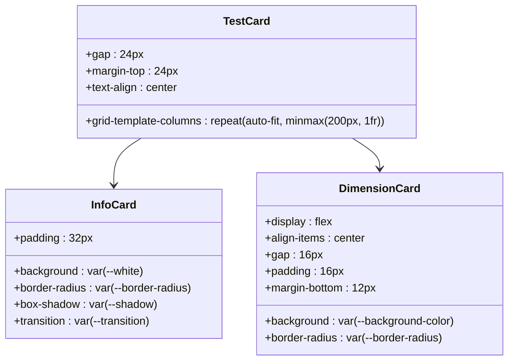

**图表来源**
- [style.css:51-58](file://程序/css/style.css#L51-L58)

#### 交互反馈机制

**更新** 首页的交互反馈机制更加简洁高效：

- **开始测试按钮**：脉冲动画效果，吸引用户注意
- **卡片悬停效果**：阴影增强，提供立体感
- **淡入动画**：页面元素的渐入效果，提升用户体验
- **轮播导航**：维度预览支持左右滑动和指示点导航

**章节来源**
- [style.css:108-147](file://程序/css/style.css#L108-L147)

### 数据加载与缓存机制

#### 多级缓存策略

**更新** 目录页面和首页采用不同的数据加载策略：

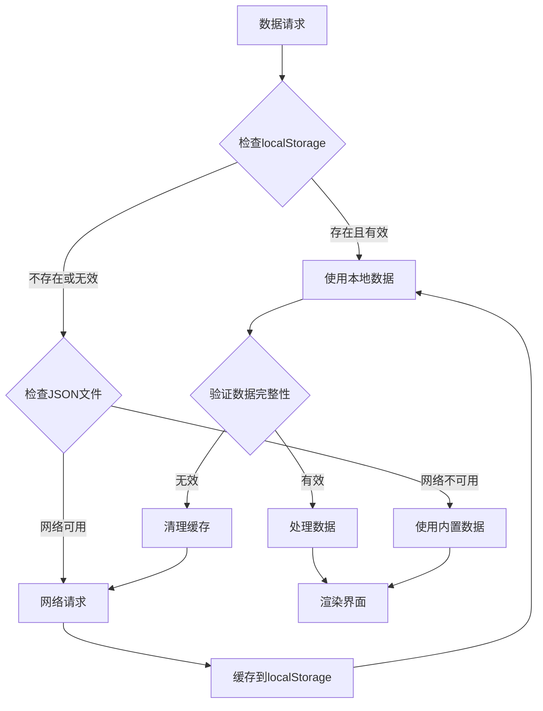

**图表来源**
- [catalog.html:61-86](file://程序/catalog.html#L61-L86)
- [index.html:90-140](file://程序/index.html#L90-L140)

#### 错误处理与降级策略

系统具备完善的错误处理机制：

- **网络异常**：自动回退到内置默认数据
- **JSON解析错误**：提供友好的错误提示
- **数据格式错误**：记录详细错误信息便于调试

**章节来源**
- [catalog.html:75-79](file://程序/catalog.html#L75-L79)
- [index.html:287-293](file://程序/index.html#L287-L293)

### UI配置管理系统

#### 动态主题切换

系统支持实时的主题配置和应用：

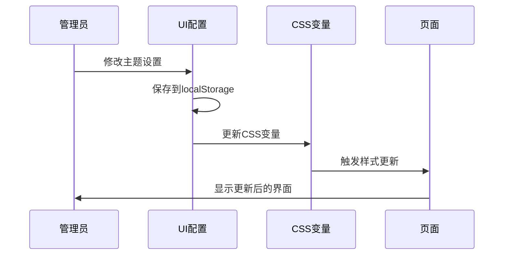

**图表来源**
- [utils.js:226-244](file://程序/js/utils.js#L226-L244)
- [index.html:293-335](file://程序/admin.html#L293-L335)

#### 配置项设计

UI配置系统支持以下配置项：

- **颜色系统**：主色调、辅助色、背景色
- **字体系统**：字体族、字号层级
- **视觉效果**：圆角半径、阴影效果
- **布局参数**：最大宽度、间距等

**章节来源**
- [utils.js:207-244](file://程序/js/utils.js#L207-L244)
- [index.html:293-335](file://程序/admin.html#L293-L335)

## 依赖关系分析

### 模块依赖图

**更新** 依赖关系已更新，目录功能现在是独立模块：

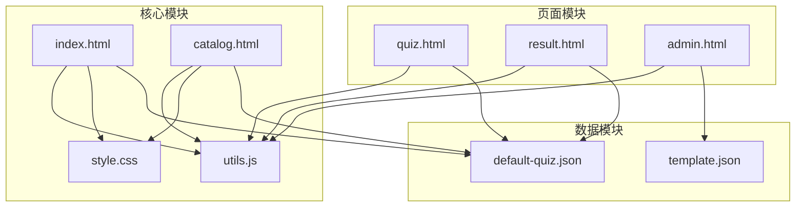

**图表来源**
- [index.html:74-140](file://程序/index.html#L74-L140)
- [catalog.html:59-86](file://程序/catalog.html#L59-L86)
- [utils.js:1-250](file://程序/js/utils.js#L1-L250)
- [default-quiz.json:1-235](file://程序/data/default-quiz.json#L1-L235)

### 数据流分析

**更新** 数据流现在支持两个独立的页面：

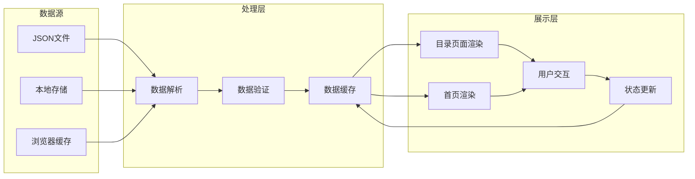

**图表来源**
- [utils.js:55-126](file://程序/js/utils.js#L55-L126)
- [catalog.html:61-86](file://程序/catalog.html#L61-L86)
- [index.html:90-140](file://程序/index.html#L90-L140)

**章节来源**
- [utils.js:55-126](file://程序/js/utils.js#L55-L126)
- [catalog.html:61-86](file://程序/catalog.html#L61-L86)
- [index.html:90-140](file://程序/index.html#L90-L140)

## 性能考虑

### 响应式设计优化

**更新** 目录页面和首页都采用了优化的响应式设计：

#### 目录页面响应式适配

- **断点设计**：在768px断点下切换为单列布局
- **卡片自适应**：使用`repeat(auto-fill, minmax(280px, 1fr))`确保卡片自适应
- **触摸友好**：卡片尺寸和间距适合触摸操作

#### 首页响应式适配

- **断点设计**：在768px断点下切换为单列布局
- **字体缩放**：移动端字体大小自动调整
- **触摸友好**：按钮尺寸和间距适合触摸操作
- **轮播优化**：维度预览支持响应式轮播

#### 性能优化策略

- **CSS Grid优化**：使用现代布局技术减少JavaScript计算
- **渐进式加载**：卡片采用淡入动画，提升感知性能
- **内存管理**：及时清理事件监听器和DOM引用
- **轮播性能**：使用transform属性进行轮播动画，避免重排

### 内存管理与垃圾回收

系统实现了良好的内存管理机制：

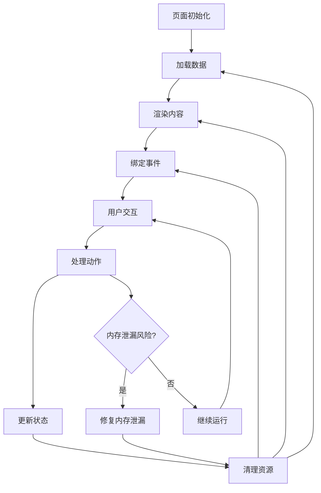

**图表来源**
- [catalog.html:83-86](file://程序/catalog.html#L83-L86)
- [index.html:524-528](file://程序/index.html#L524-L528)
- [utils.js:17-50](file://程序/js/utils.js#L17-L50)

### 缓存策略优化

**更新** 目录页面和首页采用了更加高效的缓存策略：

- **浏览器缓存**：静态资源利用HTTP缓存头
- **localStorage缓存**：用户数据持久化存储
- **内存缓存**：当前页面使用的数据缓存
- **轮播状态缓存**：维度预览轮播状态持久化

**章节来源**
- [catalog.html:61-86](file://程序/catalog.html#L61-L86)
- [index.html:90-140](file://程序/index.html#L90-L140)
- [utils.js:17-50](file://程序/js/utils.js#L17-L50)

## 故障排除指南

### 常见问题诊断

#### 目录页面数据加载失败

**症状**：目录页面显示"加载中..."或空白状态

**可能原因**：
1. JSON文件路径错误
2. 网络连接问题
3. localStorage权限限制
4. 数据格式不符合规范

**解决步骤**：
1. 检查JSON文件路径是否正确
2. 验证网络连接状态
3. 确认浏览器允许localStorage
4. 使用数据验证工具检查JSON格式

#### 首页数据加载失败

**症状**：首页测试信息显示"加载中..."或空白状态

**可能原因**：
1. JSON文件路径错误
2. 网络连接问题
3. localStorage权限限制
4. 数据格式不符合规范

**解决步骤**：
1. 检查JSON文件路径是否正确
2. 验证网络连接状态
3. 确认浏览器允许localStorage
4. 使用数据验证工具检查JSON格式

#### 样式显示异常

**症状**：页面布局错乱或样式不生效

**可能原因**：
1. CSS文件加载失败
2. CSS变量未正确设置
3. 浏览器兼容性问题
4. 样式冲突

**解决步骤**：
1. 检查CSS文件路径和语法
2. 验证CSS变量定义
3. 测试不同浏览器兼容性
4. 检查是否存在样式覆盖

### 调试工具使用

#### 开发者工具检查

1. **网络面板**：监控JSON文件加载状态
2. **存储面板**：检查localStorage数据
3. **控制台**：查看JavaScript错误信息
4. **元素面板**：验证CSS样式应用

#### 日志记录

系统提供了完善的日志记录机制：

- **数据加载日志**：记录数据获取和缓存过程
- **错误日志**：捕获和记录异常信息
- **性能日志**：监控页面加载性能指标

**章节来源**
- [catalog.html:75-79](file://程序/catalog.html#L75-L79)
- [index.html:287-293](file://程序/index.html#L287-L293)

## 结论

心理测试目录页面设计展现了现代Web应用的最佳实践，通过合理的架构设计、响应式布局和完善的错误处理机制，为用户提供了优秀的使用体验。

**更新** 系统现已将目录功能迁移到独立页面，提供了更丰富的测试合集展示功能。经过简化优化的目录页面专注于核心功能，移除了冗余元素，提升了用户体验。主要优势包括：

1. **模块化设计**：清晰的组件划分和职责分离
2. **响应式布局**：适配多种设备和屏幕尺寸
3. **性能优化**：多层次缓存和内存管理策略
4. **用户体验**：流畅的交互反馈和视觉效果
5. **可维护性**：清晰的代码结构和文档支持
6. **功能完整性**：独立的目录页面提供完整的测试合集展示

**更新** 目录页面设计优化，改进了测试合集的展示方式，增强了当前测试卡片的信息展示。当前测试卡片现在能够完整显示测试名称和参考来源，为用户提供了更准确的测试概览信息。

未来可以进一步优化的方向包括：
- 增强目录页面的测试数据扩展能力
- 优化移动端交互体验
- 添加更多测试类型的预览和分类
- 实现测试合集的动态加载和搜索功能

## 附录

### 数据结构规范

#### 测试数据格式

```json
{
  "quiz_name": "字符串",
  "reference": "字符串",
  "nbr_question": 数字,
  "nbr_question_scale": 数字,
  "nbr_question_choice": 数字,
  "nbr_dimension": 数字,
  "dimensions": [
    {
      "dimension_id": "字符串",
      "dimension_name": "字符串",
      "description": "字符串"
    }
  ],
  "scale_questions": [
    {
      "question_id": "字符串",
      "dimension_id": "字符串",
      "question_text": "字符串"
    }
  ],
  "choice_questions": [
    {
      "question_id": "字符串",
      "question_text": "字符串",
      "option_a_text": "字符串",
      "option_a_dim": "字符串",
      "option_b_text": "字符串",
      "option_b_dim": "字符串",
      "option_c_text": "字符串",
      "option_c_dim": "字符串",
      "option_d_text": "字符串",
      "option_d_dim": "字符串",
      "option_e_text": "字符串",
      "option_e_dim": "字符串"
    }
  ]
}
```

### 扩展指南

#### 添加新的测试类型

1. **数据结构扩展**：在JSON数据中添加新的维度和题目
2. **样式定制**：根据测试特点调整目录页面样式
3. **交互逻辑**：实现特定的用户交互需求
4. **测试验证**：确保新测试符合质量标准

#### 性能优化建议

1. **图片优化**：压缩和格式化测试相关的图片资源
2. **代码分割**：按需加载非关键的JavaScript代码
3. **缓存策略**：合理设置HTTP缓存头
4. **CDN部署**：使用内容分发网络加速静态资源

#### 无障碍访问支持

1. **键盘导航**：确保所有交互元素支持键盘操作
2. **屏幕阅读器**：提供适当的ARIA标签和语义化标记
3. **色彩对比**：确保足够的色彩对比度
4. **字体大小**：支持用户自定义字体大小

#### 目录页面定制建议

1. **卡片布局**：根据测试数量调整CSS Grid参数
2. **徽章设计**：为不同测试类型设计独特的徽章样式
3. **过渡效果**：优化卡片的悬停和点击动画效果
4. **响应式适配**：确保在各种设备上的最佳显示效果