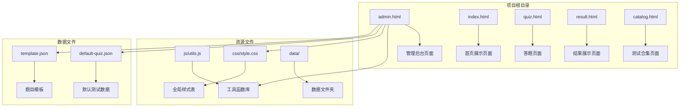
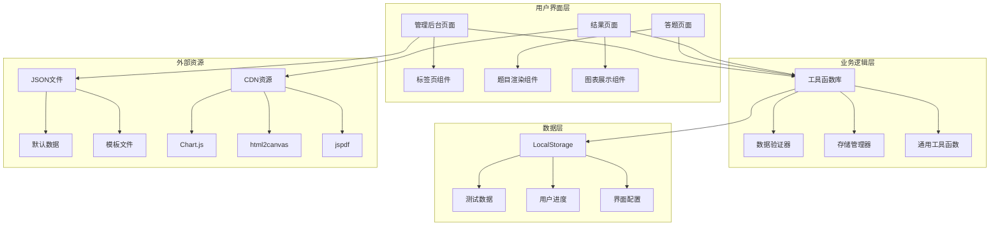
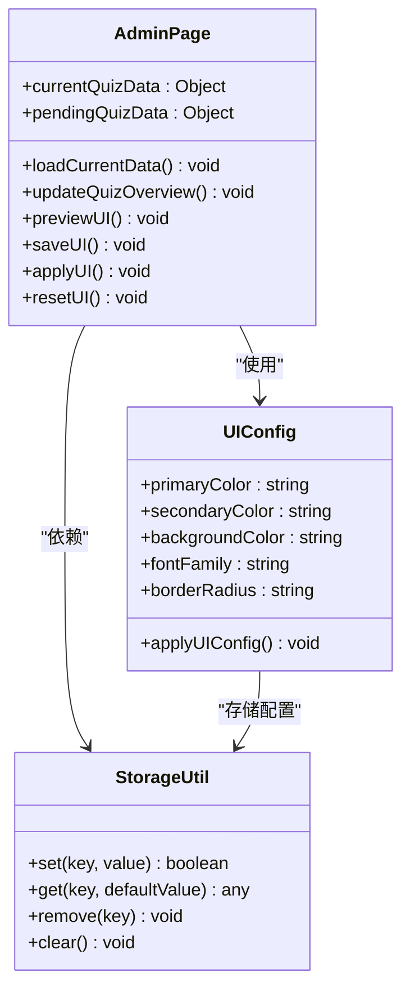
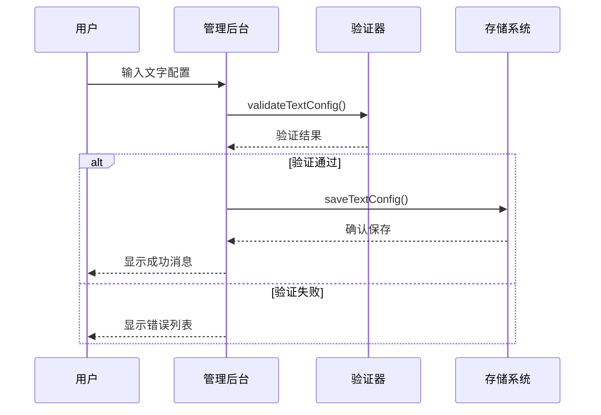
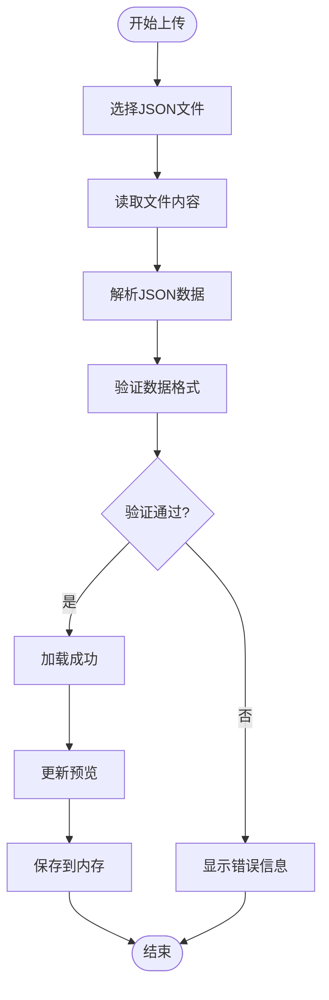
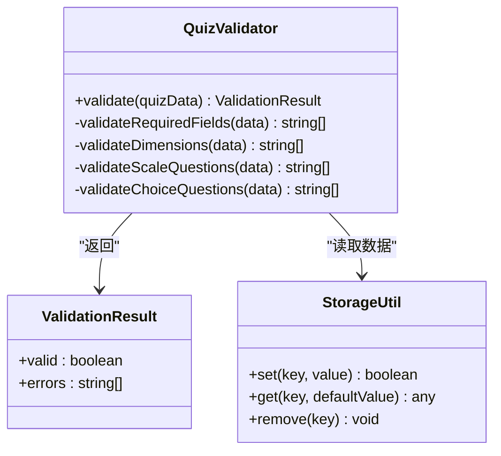
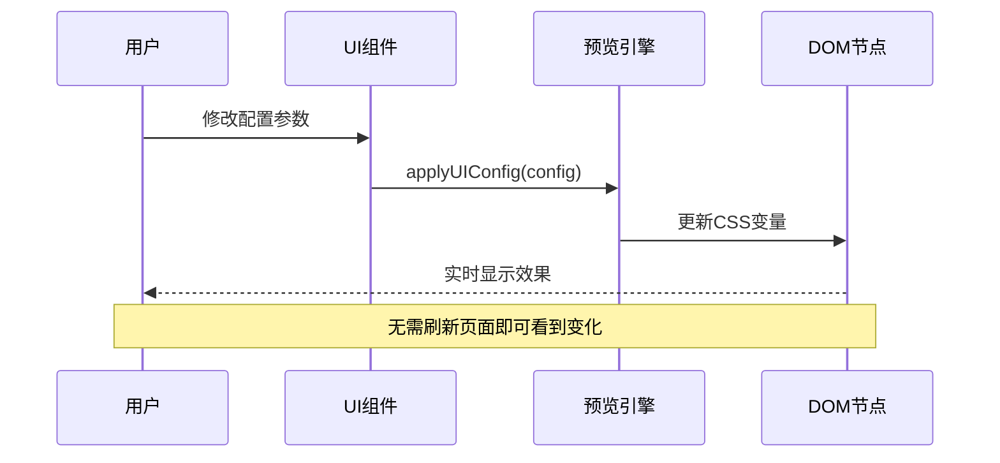
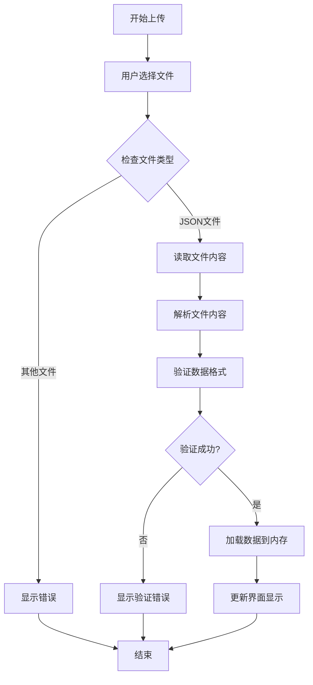
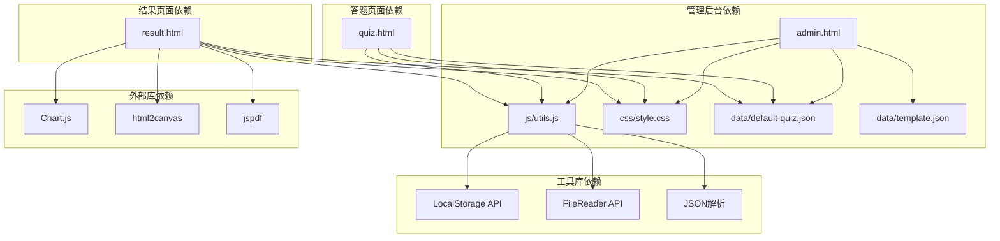

# 管理后台设计

<cite>
**本文档引用的文件**
- [admin.html](file://程序/admin.html)
- [index.html](file://程序/index.html)
- [quiz.html](file://程序/quiz.html)
- [result.html](file://程序/result.html)
- [catalog.html](file://程序/catalog.html)
- [js/utils.js](file://程序/js/utils.js)
- [css/style.css](file://程序/css/style.css)
- [data/default-quiz.json](file://程序/data/default-quiz.json)
- [data/template.json](file://程序/data/template.json)
</cite>

## 更新摘要
**变更内容**
- 新增完整的管理后台页面组件设计
- 更新UI配置、文字配置、题目管理三大功能模块
- 完善文件上传验证和错误处理机制
- 增强实时预览功能和数据持久化策略
- 优化标签页布局和用户交互体验

## 目录
1. [简介](#简介)
2. [项目结构](#项目结构)
3. [核心组件](#核心组件)
4. [架构概览](#架构概览)
5. [详细组件分析](#详细组件分析)
6. [依赖关系分析](#依赖关系分析)
7. [性能考虑](#性能考虑)
8. [故障排除指南](#故障排除指南)
9. [结论](#结论)
10. [附录](#附录)

## 简介

心理测试管理后台是一个基于纯前端技术栈的管理系统，采用HTML5、CSS3和JavaScript构建。该系统提供了完整的心理测试管理功能，包括界面配置、文字与配图管理、题目管理、实时预览等功能模块。

系统采用模块化设计，通过统一的工具库提供数据存储、验证、下载等核心功能，支持本地存储持久化和JSON数据导入导出机制。界面采用响应式设计，适配多种设备屏幕尺寸。

## 项目结构

项目采用扁平化的文件组织结构，主要包含以下核心文件：



**图表来源**
- [admin.html:1-411](file://程序/admin.html#L1-L411)
- [js/utils.js:1-250](file://程序/js/utils.js#L1-L250)
- [css/style.css:1-702](file://程序/css/style.css#L1-L702)

**章节来源**
- [admin.html:1-411](file://程序/admin.html#L1-L411)
- [index.html:1-518](file://程序/index.html#L1-L518)
- [quiz.html:1-441](file://程序/quiz.html#L1-L441)
- [result.html](file://程序/result.html)
- [catalog.html](file://程序/catalog.html)

## 核心组件

### 管理后台页面组件

管理后台采用标签页布局设计，包含三个主要功能模块：

#### 标签页系统
- **UI界面标签页**：用于配置主题颜色、字体、圆角等视觉元素
- **文字&配图标签页**：用于配置首页标题、副标题、按钮文字等文本内容
- **题目管理标签页**：用于管理测试题目数据，支持JSON文件导入导出

#### 数据存储机制
系统使用LocalStorage进行数据持久化，支持以下存储键：
- `quiz_data`：测试题目数据
- `user_answers`：用户答题答案
- `current_question`：当前答题进度
- `quiz_config`：测试配置信息
- `ui_config`：界面配置信息

#### 实时预览功能
每个配置模块都提供实时预览功能，通过JavaScript动态更新页面样式和内容，无需刷新页面即可查看效果。

**章节来源**
- [admin.html:27-163](file://程序/admin.html#L27-L163)
- [js/utils.js:6-12](file://程序/js/utils.js#L6-L12)

### 数据验证系统

系统实现了完整的JSON数据验证机制，确保导入的题目数据符合预期格式：

#### 验证规则
- 必填字段检查：测试名称、题目数量等关键字段
- 维度定义验证：维度ID和名称的完整性
- 量表题验证：题目ID、维度关联、题目文本的完整性
- 选择题验证：选项文本和维度关联的有效性

#### 错误处理机制
验证失败时，系统会显示详细的错误信息列表，帮助用户快速定位和修复问题。

**章节来源**
- [js/utils.js:55-126](file://程序/js/utils.js#L55-L126)
- [admin.html:252-291](file://程序/admin.html#L252-L291)

## 架构概览

系统采用前后端分离的架构设计，所有逻辑都在客户端执行：



**图表来源**
- [admin.html:171-408](file://程序/admin.html#L171-L408)
- [js/utils.js:17-250](file://程序/js/utils.js#L17-L250)
- [result.html](file://程序/result.html)

## 详细组件分析

### 管理后台标签页系统

#### UI界面配置组件

UI界面配置组件提供了丰富的视觉定制选项：



**图表来源**
- [admin.html:293-335](file://程序/admin.html#L293-L335)
- [js/utils.js:17-50](file://程序/js/utils.js#L17-L50)
- [js/utils.js:234-244](file://程序/js/utils.js#L234-L244)

##### 配置选项说明
- **主题色配置**：支持十六进制颜色值，实时预览效果
- **辅助色配置**：用于强调和交互元素的颜色
- **背景色配置**：页面整体背景颜色
- **字体选择**：支持多种中文字体
- **圆角大小**：控制界面元素的圆角半径

#### 文字&配图配置组件

文字配置组件允许管理员自定义页面文本内容：



**图表来源**
- [admin.html:337-359](file://程序/admin.html#L337-L359)

##### 支持的配置项
- 首页标题和副标题
- 开始按钮文字
- 结果页标题
- 首页图标（支持emoji）

#### 题目管理组件

题目管理组件是系统的核心功能模块：



**图表来源**
- [admin.html:252-291](file://程序/admin.html#L252-L291)
- [js/utils.js:165-179](file://程序/js/utils.js#L165-L179)

##### 功能特性
- **模板下载**：提供标准格式的题目模板
- **文件上传**：支持JSON文件导入
- **实时验证**：上传即验证，即时反馈结果
- **预览功能**：显示当前题目概览

**章节来源**
- [admin.html:122-163](file://程序/admin.html#L122-L163)
- [admin.html:243-291](file://程序/admin.html#L243-L291)

### 数据验证系统

#### 验证器架构



**图表来源**
- [js/utils.js:55-126](file://程序/js/utils.js#L55-L126)
- [js/utils.js:17-50](file://程序/js/utils.js#L17-L50)

#### 验证流程

系统实现了多层次的数据验证机制：

1. **必填字段验证**：检查核心字段的完整性
2. **结构完整性验证**：确保数据结构符合预期
3. **内容有效性验证**：验证字段值的合理性
4. **关联关系验证**：检查维度与题目的关联关系

**章节来源**
- [js/utils.js:55-126](file://程序/js/utils.js#L55-L126)

### 实时预览系统

#### 预览机制实现



**图表来源**
- [js/utils.js:234-244](file://程序/js/utils.js#L234-L244)
- [admin.html:294-303](file://程序/admin.html#L294-L303)

#### 预览功能特性
- **即时响应**：修改即刻生效
- **无刷新更新**：保持页面状态不变
- **完整预览**：预览所有配置效果
- **交互反馈**：提供视觉反馈

**章节来源**
- [admin.html:293-335](file://程序/admin.html#L293-L335)
- [js/utils.js:234-244](file://程序/js/utils.js#L234-L244)

### 文件上传处理系统

#### 上传流程设计



**图表来源**
- [admin.html:252-291](file://程序/admin.html#L252-L291)
- [js/utils.js:165-179](file://程序/js/utils.js#L165-L179)

#### 安全检查机制
- **文件类型验证**：确保上传的是JSON文件
- **内容格式验证**：检查JSON语法正确性
- **数据结构验证**：验证测试数据的完整性
- **错误处理**：提供友好的错误提示

**章节来源**
- [admin.html:252-291](file://程序/admin.html#L252-L291)
- [js/utils.js:165-179](file://程序/js/utils.js#L165-L179)

## 依赖关系分析

### 核心依赖关系



**图表来源**
- [admin.html:171-172](file://程序/admin.html#L171-L172)
- [quiz.html:62](file://程序/quiz.html#L62)
- [result.html](file://程序/result.html)

### 数据流关系

系统中的数据流向呈现层次化结构：

1. **静态资源层**：CSS样式、图标资源
2. **配置数据层**：JSON配置文件
3. **业务逻辑层**：工具函数和验证器
4. **用户界面层**：HTML页面和交互组件

**章节来源**
- [admin.html:171-172](file://程序/admin.html#L171-L172)
- [js/utils.js:1-250](file://程序/js/utils.js#L1-250)

## 性能考虑

### 优化策略

#### 内存管理
- **数据缓存策略**：使用LocalStorage减少重复请求
- **对象复制优化**：使用深拷贝避免数据污染
- **事件监听清理**：及时移除不需要的事件监听器

#### 网络优化
- **文件压缩**：JSON文件采用紧凑格式存储
- **按需加载**：外部库通过CDN按需加载
- **缓存策略**：合理利用浏览器缓存机制

#### 用户体验优化
- **防抖处理**：对频繁操作进行防抖优化
- **渐进式渲染**：采用分步渲染提升响应速度
- **错误降级**：提供备用方案确保功能可用

## 故障排除指南

### 常见问题及解决方案

#### 数据加载失败
**问题症状**：页面显示默认数据或错误提示
**可能原因**：
- JSON文件格式错误
- 网络请求超时
- LocalStorage存储空间不足

**解决步骤**：
1. 检查JSON文件语法
2. 验证文件路径正确性
3. 清理浏览器缓存
4. 检查浏览器存储权限

#### 验证失败
**问题症状**：上传文件后显示验证错误
**解决方法**：
1. 按照模板格式修正数据
2. 检查必填字段完整性
3. 验证维度与题目的关联关系
4. 确认选项文本和维度匹配

#### 预览功能异常
**问题症状**：修改配置后界面无变化
**排查步骤**：
1. 检查浏览器控制台错误
2. 验证CSS变量更新
3. 确认applyUIConfig函数调用
4. 检查LocalStorage访问权限

**章节来源**
- [admin.html:283-291](file://程序/admin.html#L283-L291)
- [js/utils.js:17-50](file://程序/js/utils.js#L17-L50)

## 结论

心理测试管理后台系统展现了优秀的前端架构设计，通过模块化组件和清晰的职责分离，实现了功能完整且易于维护的管理平台。

系统的主要优势包括：
- **完整的功能覆盖**：从界面配置到题目管理的全流程支持
- **良好的用户体验**：实时预览和即时反馈机制
- **可靠的错误处理**：完善的验证和错误提示系统
- **简洁的架构设计**：扁平化的文件组织和清晰的依赖关系

未来可以考虑的功能增强方向：
- 添加用户权限管理和操作日志记录
- 实现数据备份和恢复功能
- 增强移动端适配能力
- 扩展更多测试类型的模板支持

## 附录

### 数据格式规范

#### 测试数据结构
```json
{
  "quiz_name": "测试名称",
  "reference": "理论基础",
  "nbr_question": 30,
  "nbr_question_scale": 25,
  "nbr_question_choice": 5,
  "nbr_dimension": 5,
  "dimensions": [
    {
      "dimension_id": "dimension_1",
      "dimension_name": "维度名称",
      "description": "维度描述"
    }
  ],
  "scale_questions": [
    {
      "question_id": "scale_001",
      "dimension_id": "dimension_1",
      "question_text": "量表题内容"
    }
  ],
  "choice_questions": [
    {
      "question_id": "choice_001",
      "question_text": "选择题题干",
      "option_a_text": "选项A文本",
      "option_a_dim": "dimension_1",
      "option_b_text": "选项B文本",
      "option_b_dim": "dimension_2"
    }
  ]
}
```

### 开发最佳实践

#### 代码组织原则
- **单一职责**：每个函数只负责一个功能
- **命名规范**：使用语义化的变量和函数名
- **注释规范**：为复杂逻辑添加详细注释
- **错误处理**：为所有异步操作添加错误处理

#### 性能优化建议
- 使用防抖和节流技术优化高频操作
- 合理使用缓存减少重复计算
- 优化DOM操作减少重排重绘
- 按需加载外部资源

#### 安全注意事项
- 对用户输入进行严格验证
- 避免在客户端存储敏感信息
- 实施适当的错误处理防止信息泄露
- 定期更新外部依赖库的安全版本