# 结果页面设计

<cite>
**本文档引用的文件**
- [result.html](file://程序/result.html)
- [utils.js](file://程序/js/utils.js)
- [default-quiz.json](file://程序/data/default-quiz.json)
- [template.json](file://程序/data/template.json)
- [style.css](file://程序/css/style.css)
</cite>

## 更新摘要
**变更内容**
- 新增小人形象展示系统，基于用户主要和次要爱语生成个性化人物形象
- 新增雷达图可视化，使用Chart.js展示维度得分分布
- 新增维度详情卡片，提供详细的维度解读和进度展示
- 新增PDF报告生成功能，支持双页专业报告输出
- 新增海报生成功能，支持社交媒体分享和下载
- 新增烟花庆祝特效，增强用户体验和交互反馈
- 完善模态框系统用于海报预览和下载
- 增强结果页面的个性化展示和分享能力
- 新增海报式设计风格，采用渐变背景和圆角设计
- 新增深度分析报告功能，提供详细的个人解读

## 目录
1. [简介](#简介)
2. [项目结构](#项目结构)
3. [核心组件](#核心组件)
4. [架构概览](#架构概览)
5. [详细组件分析](#详细组件分析)
6. [依赖关系分析](#依赖关系分析)
7. [性能考虑](#性能考虑)
8. [故障排除指南](#故障排除指南)
9. [结论](#结论)

## 简介

心理测试结果页面是一个综合性的数据可视化和报告生成功能模块，基于爱的五种语言理论构建。该页面集成了多种图表类型、响应式设计和导出功能，为用户提供直观的心理测试结果展示和专业的报告生成功能。

页面采用现代化的前端技术栈，包括Chart.js图表库、html2canvas截图工具和jsPDF PDF生成库，实现了丰富的交互功能和专业的视觉效果。用户可以通过结果页面查看个人在五个维度上的得分分布，获得详细的维度解读，并生成PDF报告或分享海报。

**更新** 新增了小人形象展示系统、雷达图可视化、维度详情卡片、PDF生成、海报生成、烟花特效和模态框系统，显著增强了用户体验和结果分享能力。小人形象系统基于用户的主要和次要爱语生成20种不同的个性化人物形象，每种形象都有独特的标签和描述。

## 项目结构

项目采用模块化组织结构，将不同功能的文件分离到相应的目录中：

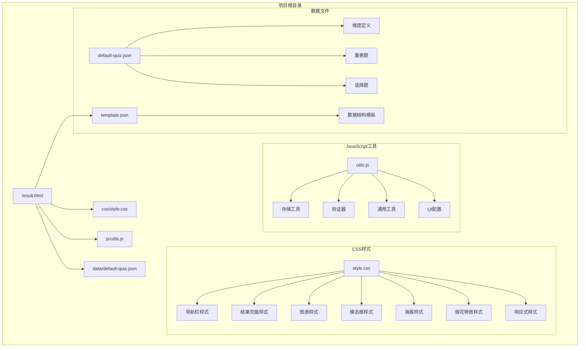

**图表来源**
- [result.html:1-1583](file://程序/result.html#L1-L1583)
- [style.css:1-702](file://程序/css/style.css#L1-L702)
- [utils.js:1-250](file://程序/js/utils.js#L1-L250)

**章节来源**
- [result.html:1-1583](file://程序/result.html#L1-L1583)
- [style.css:1-702](file://程序/css/style.css#L1-L702)
- [utils.js:1-250](file://程序/js/utils.js#L1-L250)

## 核心组件

### 数据模型架构

结果页面的核心数据模型基于标准化的心理测试数据结构，支持动态维度配置和灵活的题目类型组合。

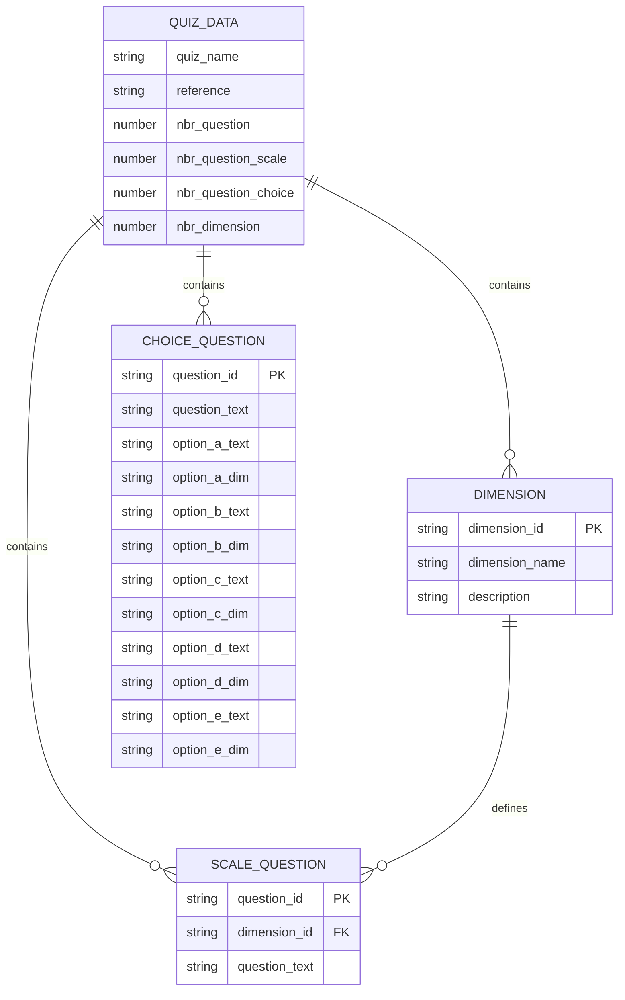

**图表来源**
- [default-quiz.json:1-235](file://程序/data/default-quiz.json#L1-L235)
- [template.json:1-49](file://程序/data/template.json#L1-L49)

### 计算引擎

结果页面的核心计算逻辑负责处理用户答案并生成最终的测试结果。该引擎支持两种类型的题目计算方式：

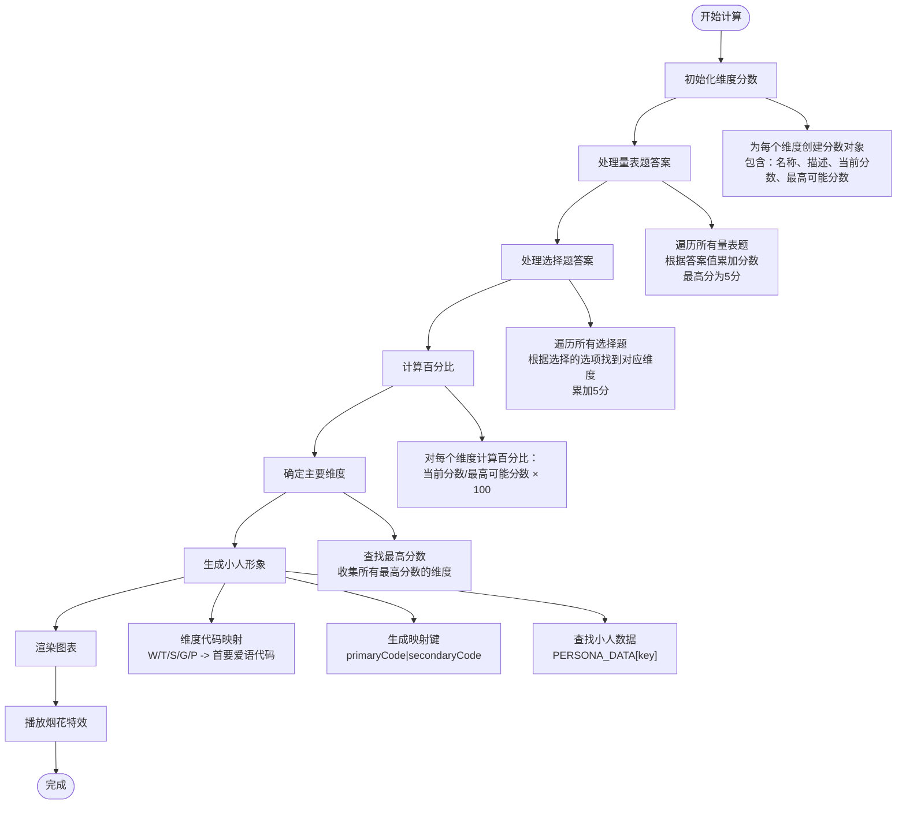

**图表来源**
- [result.html:828-870](file://程序/result.html#L828-L870)

### 图表渲染系统

页面集成了两种主要的图表类型来展示测试结果：

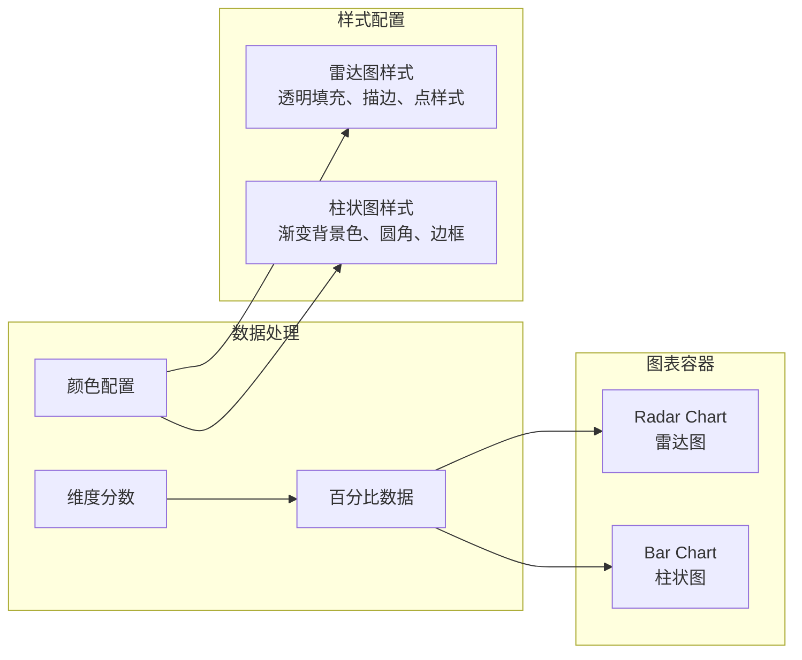

**图表来源**
- [result.html:1003-1102](file://程序/result.html#L1003-L1102)

### 小人形象展示系统

**新增** 小人形象展示系统是结果页面的核心个性化组件，基于用户的主要和次要爱语生成20种不同的个性化人物形象：

```mermaid
flowchart TD
USER_INPUT[用户答案] --> CALC[calculateResults]
CALC --> GET_CODES[getPrimaryAndSecondaryCodes]
GET_CODES --> KEY_GEN[生成映射键<br/>primaryCode|secondaryCode]
KEY_GEN --> LOOKUP[PERSONA_DATA[key]]
LOOKUP --> INFO[getPersonaInfo]
INFO --> DESC[generatePersonaDescription]
DESC --> RENDER[renderPersona]
RENDER --> IMAGE[显示小人图片<br/>assets/persona/{name}.jpg]
IMAGE --> TAGS[显示标签<br/>温暖共情、深度对话]
TAGS --> DESCRIPTION[显示个性化描述]
DESCRIPTION --> CARD[渲染persona-card]
```

**图表来源**
- [result.html:908-991](file://程序/result.html#L908-L991)

**章节来源**
- [result.html:828-870](file://程序/result.html#L828-L870)
- [result.html:1003-1102](file://程序/result.html#L1003-L1102)
- [result.html:908-991](file://程序/result.html#L908-L991)

## 架构概览

### 整体架构设计

结果页面采用事件驱动的架构模式，通过DOM事件监听和异步数据加载实现响应式交互：

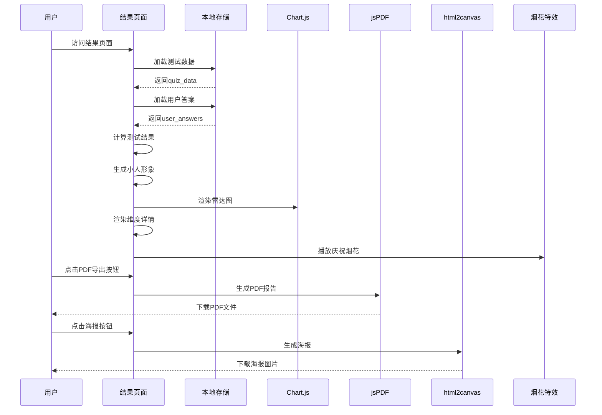

**图表来源**
- [result.html:1532-1583](file://程序/result.html#L1532-L1583)
- [result.html:1239-1394](file://程序/result.html#L1239-L1394)

### 数据流架构

页面的数据流遵循单向数据流原则，确保数据的一致性和可预测性：

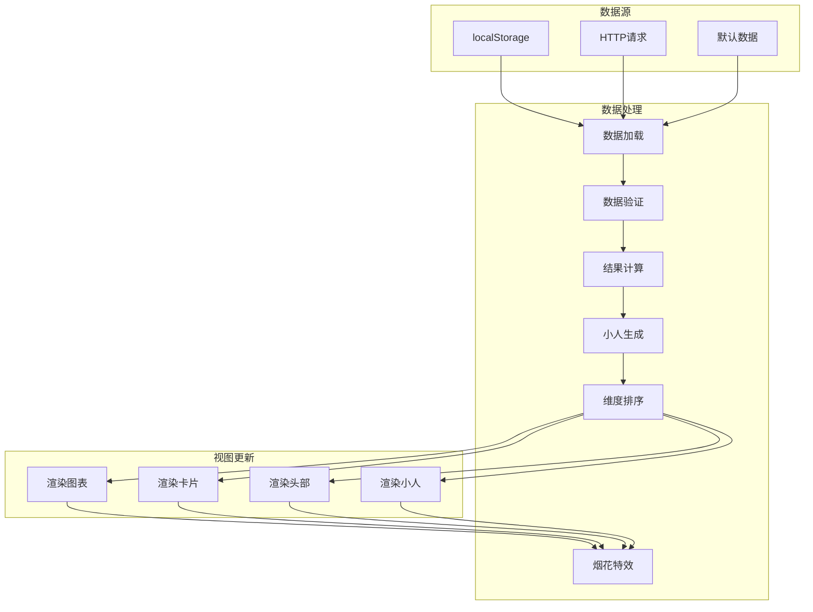

**图表来源**
- [result.html:1532-1583](file://程序/result.html#L1532-L1583)
- [utils.js:55-126](file://程序/js/utils.js#L55-L126)

**章节来源**
- [result.html:1532-1583](file://程序/result.html#L1532-L1583)
- [utils.js:55-126](file://程序/js/utils.js#L55-L126)

## 详细组件分析

### 结果摘要展示组件

结果摘要展示组件位于页面顶部，采用醒目的视觉设计来突出用户的测试结果：

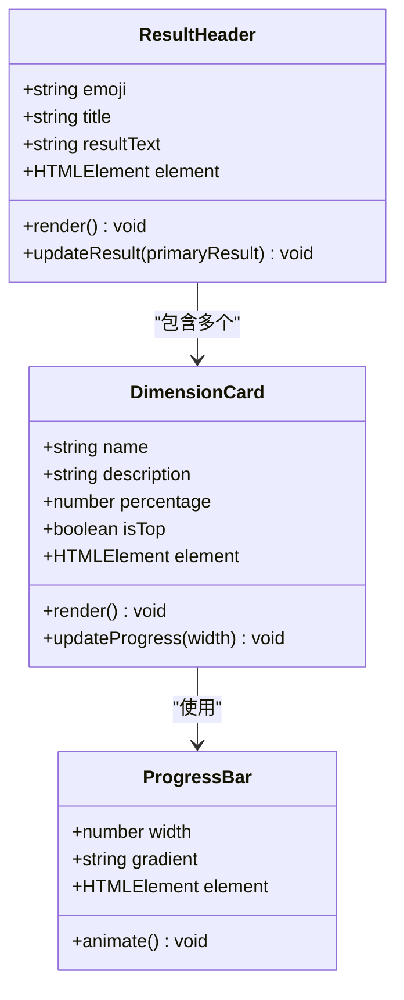

**图表来源**
- [result.html:1162-1189](file://程序/result.html#L1162-L1189)

组件特点：
- **动态标题**：根据主要维度自动调整显示内容
- **彩色强调**：使用主题色突出显示主要结果
- **响应式布局**：适配不同屏幕尺寸的显示需求

### 小人形象展示组件

**新增** 小人形象展示组件是结果页面的核心个性化组件，基于用户的主要和次要爱语生成20种不同的个性化人物形象：

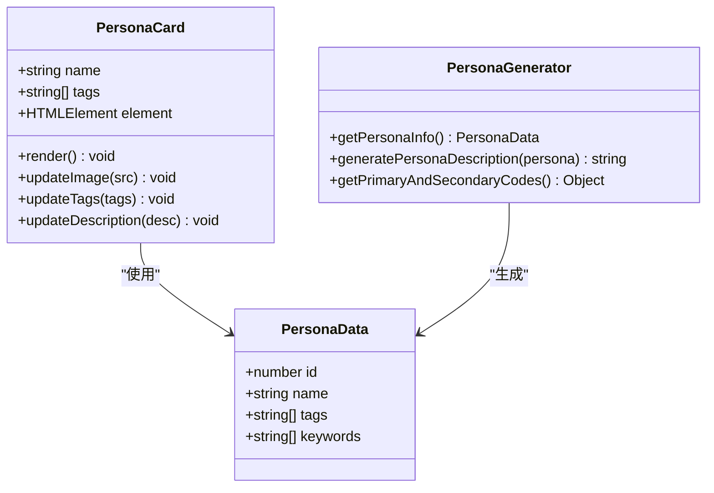

**图表来源**
- [result.html:963-991](file://程序/result.html#L963-L991)
- [result.html:908-927](file://程序/result.html#L908-L927)

组件特性：
- **20种小人形象**：每种形象都有独特的标签和关键词
- **个性化描述**：基于小人形象生成详细的个性描述文案
- **动态图片加载**：从assets/persona目录加载对应的图片
- **响应式设计**：适配不同屏幕尺寸的显示需求

### 多维度分析图表组件

图表组件是结果页面的核心可视化模块，提供了两种互补的图表类型：

#### 雷达图组件

雷达图用于展示用户在各个维度上的相对表现：

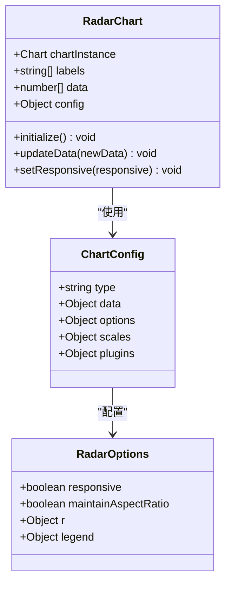

**图表来源**
- [result.html:1035-1098](file://程序/result.html#L1035-L1098)

#### 柱状图组件

柱状图提供更直观的数值对比展示：

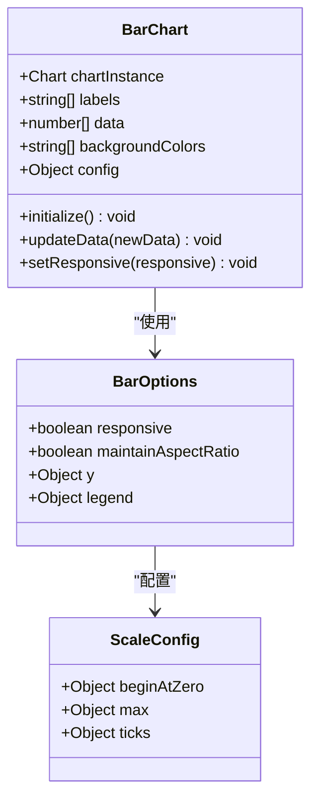

**图表来源**
- [result.html:1035-1098](file://程序/result.html#L1035-L1098)

### 详细报告生成组件

维度详情卡片组件提供了每个维度的详细信息展示：

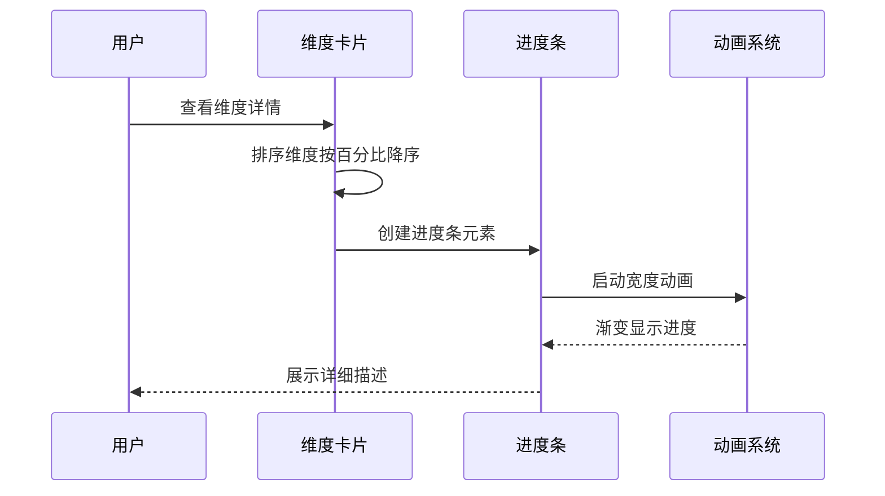

**图表来源**
- [result.html:1162-1189](file://程序/result.html#L1162-L1189)

组件特性：
- **智能排序**：自动按得分百分比排序维度
- **视觉突出**：最高分维度使用特殊样式标识
- **渐进动画**：进度条宽度的平滑过渡效果

### 导出功能组件

导出功能组件提供了多种结果导出方式：

#### PDF报告生成

PDF生成功能使用jsPDF库实现专业的报告输出：

```mermaid
flowchart TD
PDF_BUTTON[PDF导出按钮] --> CREATE_DOC[创建PDF文档]
CREATE_DOC --> ADD_TITLE[添加标题]
ADD_TITLE --> ADD_PERSONA[添加小人形象]
ADD_PERSONA --> ADD_RADAR[添加雷达图]
ADD_RADAR --> ADD_SCORES[添加各维度得分]
ADD_SCORES --> ADD_DETAILS[添加维度详细解读]
ADD_DETAILS --> SAVE_FILE[保存PDF文件]
CREATE_DOC --> SET_FORMAT[设置A4纸张格式]
SET_FORMAT --> SET_FONT[设置字体大小]
SET_FONT --> SET_ALIGN[设置居中对齐]
ADD_PERSONA --> GET_PDF_PERSO[获取PDF用小人信息]
GET_PDF_PERSO --> FORMAT_TEXT[格式化文本内容]
```

**图表来源**
- [result.html:1239-1394](file://程序/result.html#L1239-L1394)

#### 海报生成系统

海报生成功能结合html2canvas和模态框实现：

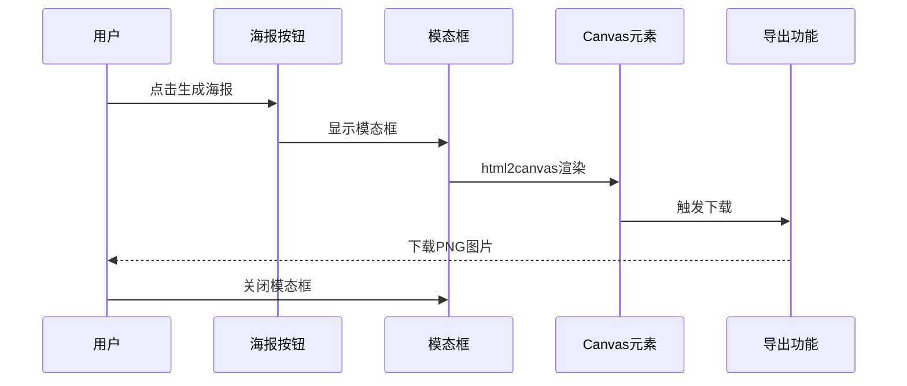

**图表来源**
- [result.html:1396-1451](file://程序/result.html#L1396-L1451)

#### 烟花庆祝特效

烟花特效系统为用户提供了庆祝反馈：

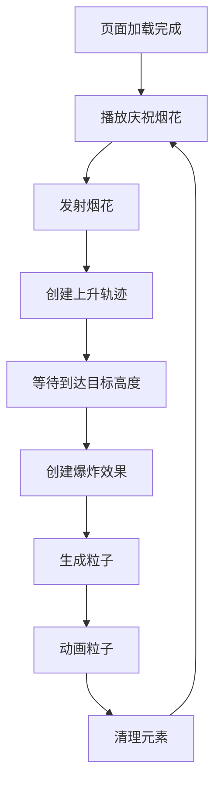

**图表来源**
- [result.html:1459-1530](file://程序/result.html#L1459-L1530)

**章节来源**
- [result.html:1239-1394](file://程序/result.html#L1239-L1394)
- [result.html:1396-1451](file://程序/result.html#L1396-L1451)
- [result.html:1459-1530](file://程序/result.html#L1459-L1530)

## 依赖关系分析

### 外部库依赖

结果页面集成了多个第三方库来实现特定功能：

```mermaid
graph TB
subgraph "外部依赖"
CHARTJS[Chart.js<br/>版本: 3.x]
HTML2CANVAS[html2canvas<br/>版本: 1.4.1]
JSPDF[jspdf<br/>版本: 2.5.1]
END
subgraph "内部依赖"
UTILS[utils.js<br/>工具函数库]
STORAGE[StorageUtil<br/>本地存储]
VALIDATOR[QuizValidator<br/>数据验证]
END
subgraph "页面依赖"
RESULT_PAGE[result.html<br/>结果页面]
STYLE_CSS[style.css<br/>样式表]
END
CHARTJS --> RESULT_PAGE
HTML2CANVAS --> RESULT_PAGE
JSPDF --> RESULT_PAGE
UTILS --> RESULT_PAGE
STORAGE --> UTILS
VALIDATOR --> UTILS
STYLE_CSS --> RESULT_PAGE
```

**图表来源**
- [result.html:8-10](file://程序/result.html#L8-L10)
- [utils.js:1-250](file://程序/js/utils.js#L1-L250)

### 内部模块依赖

页面内部模块之间的依赖关系清晰且解耦：

```mermaid
graph LR
subgraph "核心模块"
RESULT[result.html<br/>主页面逻辑]
UTILS[js/utils.js<br/>工具函数]
END
subgraph "数据模块"
DATA[data/default-quiz.json<br/>测试数据]
TEMPLATE[data/template.json<br/>模板数据]
END
subgraph "样式模块"
STYLE[css/style.css<br/>全局样式]
COMPONENTS[组件样式]
END
RESULT --> UTILS
RESULT --> DATA
RESULT --> STYLE
UTILS --> DATA
UTILS --> TEMPLATE
STYLE --> COMPONENTS
```

**图表来源**
- [result.html:296-296](file://程序/result.html#L296-L296)
- [utils.js:1-250](file://程序/js/utils.js#L1-L250)

**章节来源**
- [result.html:8-10](file://程序/result.html#L8-L10)
- [utils.js:1-250](file://程序/js/utils.js#L1-L250)

## 性能考虑

### 图表性能优化

结果页面采用了多项性能优化策略来确保图表渲染的流畅性：

1. **响应式配置**：Chart.js的responsive选项确保图表能够自适应容器大小变化
2. **数据缓存**：计算后的结果数据存储在内存中，避免重复计算
3. **渐进渲染**：使用CSS动画和延迟加载技术优化首屏渲染

### 导出功能性能

PDF和海报导出功能采用了优化策略：

1. **异步处理**：使用async/await确保导出过程不影响页面响应
2. **临时容器**：使用固定位置的隐藏容器进行导出渲染
3. **内存清理**：导出完成后及时清理DOM元素释放内存

### 小人图像性能

小人图像加载采用了优化策略：

1. **错误处理**：图片加载失败时自动回退到默认图片
2. **缓存机制**：小人信息在内存中缓存，避免重复计算
3. **懒加载**：图片在需要时才进行加载

### 烟花特效性能

烟花特效系统实现了高效的动画渲染：

1. **CSS动画**：使用CSS keyframes减少JavaScript计算开销
2. **定时清理**：动画结束后自动移除DOM元素
3. **批量创建**：合理控制粒子数量避免过度渲染

### 内存管理

页面实现了合理的内存管理策略：

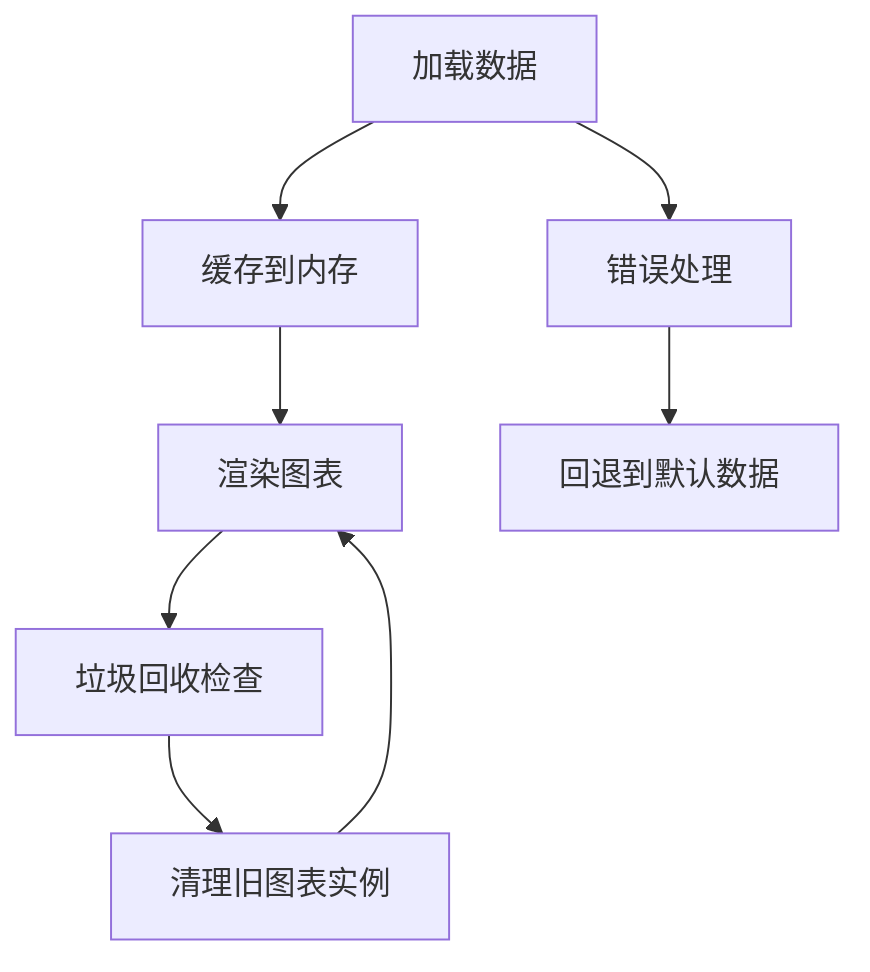

### 性能监控

建议实施的性能监控指标：
- 图表渲染时间
- 内存使用情况
- 页面加载速度
- 用户交互响应时间

## 故障排除指南

### 常见问题诊断

#### 数据加载失败

**症状**：页面显示加载错误提示

**可能原因**：
1. 网络连接问题
2. JSON文件格式错误
3. 本地存储损坏

**解决方案**：
1. 检查网络连接状态
2. 验证JSON文件格式有效性
3. 清除浏览器缓存和本地存储

#### 图表渲染异常

**症状**：图表无法正常显示或显示空白

**可能原因**：
1. Chart.js库加载失败
2. Canvas元素不可用
3. 数据格式不正确

**解决方案**：
1. 确认CDN链接可用性
2. 检查Canvas元素的DOM结构
3. 验证维度数据的完整性

#### 小人图像加载失败

**症状**：小人图片显示为默认图片或不显示

**可能原因**：
1. 小人图片文件不存在
2. 文件路径错误
3. CORS跨域问题

**解决方案**：
1. 检查assets/persona目录下的图片文件
2. 验证图片文件名与小人名称一致
3. 确认服务器支持CORS访问

#### 导出功能失效

**症状**：PDF或海报导出按钮无响应

**可能原因**：
1. jsPDF或html2canvas库未正确加载
2. 浏览器安全设置阻止下载
3. 内存不足导致导出失败

**解决方案**：
1. 检查浏览器控制台错误信息
2. 确认下载权限设置
3. 尝试在无痕模式下操作

#### 烟花特效异常

**症状**：烟花特效不显示或显示异常

**可能原因**：
1. CSS动画样式未正确加载
2. DOM元素创建失败
3. 动画时间设置不当

**解决方案**：
1. 检查CSS样式是否正确加载
2. 验证DOM元素的创建和移除逻辑
3. 调整动画持续时间和延迟参数

**章节来源**
- [result.html:1532-1583](file://程序/result.html#L1532-L1583)
- [utils.js:18-44](file://程序/js/utils.js#L18-L44)

## 结论

心理测试结果页面设计展现了现代Web应用的最佳实践，通过精心设计的架构和丰富的功能集，为用户提供了优质的测试体验。该设计的主要优势包括：

### 设计亮点

1. **模块化架构**：清晰的组件分离和职责划分
2. **响应式设计**：适配各种设备和屏幕尺寸
3. **数据驱动**：基于标准化数据结构的灵活配置
4. **专业可视化**：结合多种图表类型的综合展示
5. **个性化展示**：基于用户结果生成的小人形象
6. **导出功能**：多样化的结果分享和保存方式
7. **用户体验**：烟花特效等互动元素提升用户满意度

### 技术创新

- **混合图表系统**：雷达图和柱状图的互补展示
- **渐进式渲染**：优化的用户体验流程
- **主题化设计**：可配置的颜色和样式系统
- **离线支持**：本地存储和默认数据回退机制
- **多媒体导出**：PDF和海报的双重导出能力
- **动态特效**：烟花庆祝特效增强交互体验
- **个性化内容**：基于用户结果的定制化展示

### 扩展建议

未来可以考虑的功能增强：
1. **实时数据同步**：支持云端数据存储和同步
2. **高级分析功能**：添加趋势分析和对比功能
3. **多语言支持**：国际化和本地化能力
4. **移动端优化**：针对移动设备的专门优化
5. **社交分享**：集成更多社交媒体平台分享功能
6. **个性化定制**：允许用户自定义报告样式和内容
7. **小人形象扩展**：增加更多小人形象和标签
8. **导出格式扩展**：支持更多导出格式如Word、Excel等

该设计为心理测试应用提供了一个坚实的基础，既满足了当前的功能需求，也为未来的扩展和发展预留了充足的空间。