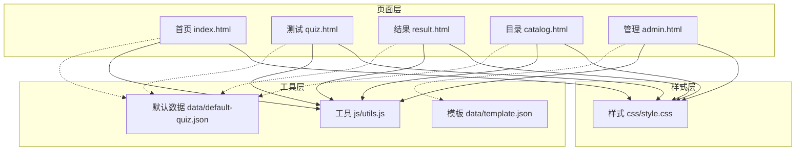
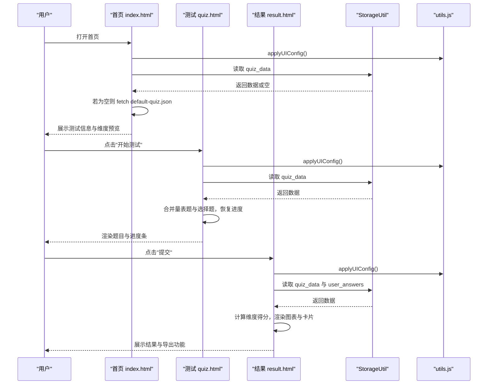
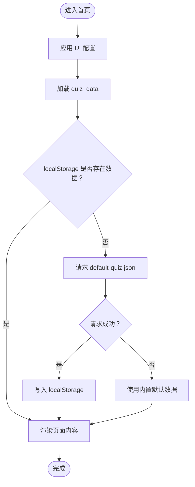
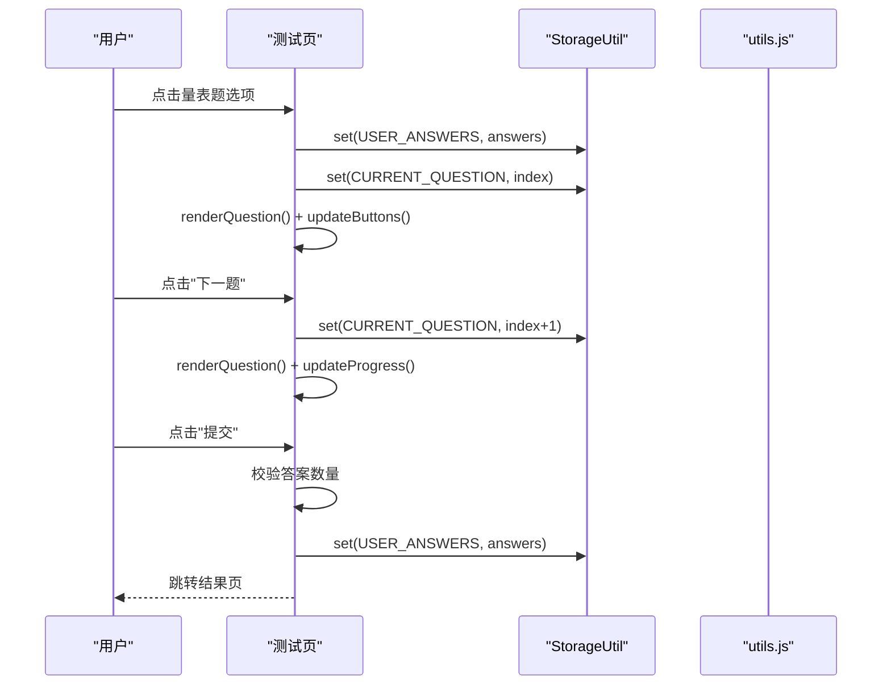
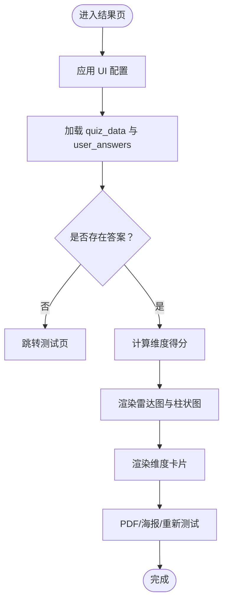
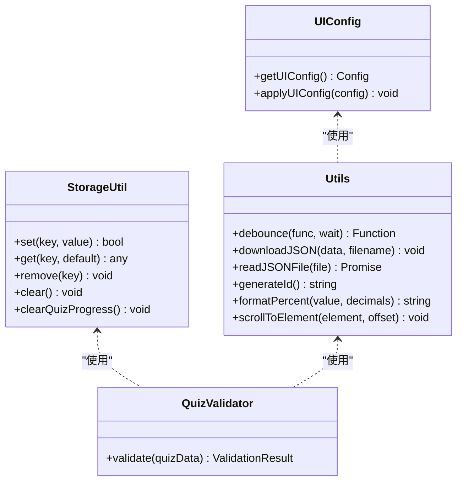
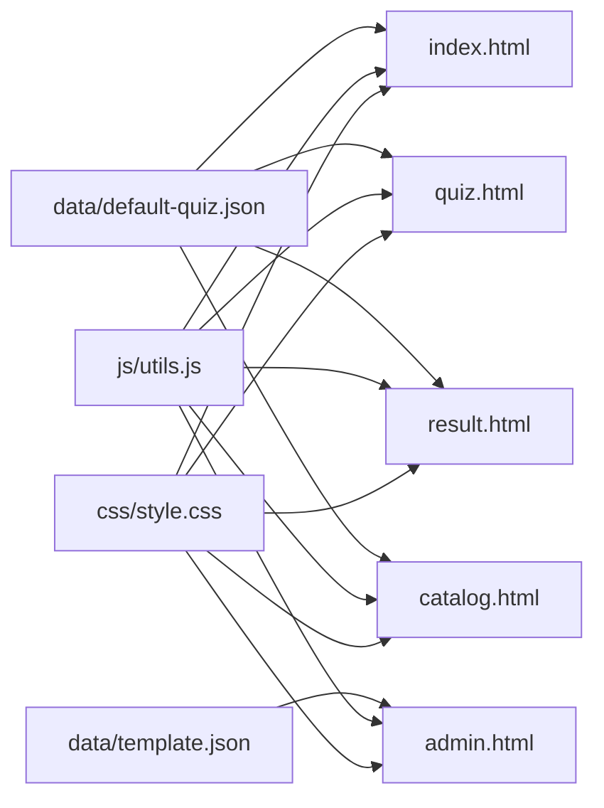

# 页面组件设计

<cite>
**本文引用的文件**
- [index.html](file://index.html)
- [quiz.html](file://quiz.html)
- [result.html](file://result.html)
- [catalog.html](file://catalog.html)
- [admin.html](file://admin.html)
- [style.css](file://css/style.css)
- [utils.js](file://js/utils.js)
- [default-quiz.json](file://data/default-quiz.json)
- [template.json](file://data/template.json)
</cite>

## 更新摘要
**变更内容**
- 新增了完整的页面组件架构分析
- 更新了各页面组件的详细实现细节
- 增强了交互逻辑和状态管理的说明
- 完善了组件复用性和模块化设计
- 添加了性能优化和故障排除指南

## 目录
1. [引言](#引言)
2. [项目结构](#项目结构)
3. [核心组件](#核心组件)
4. [架构总览](#架构总览)
5. [详细组件分析](#详细组件分析)
6. [依赖分析](#依赖分析)
7. [性能考虑](#性能考虑)
8. [故障排除指南](#故障排除指南)
9. [结论](#结论)
10. [附录](#附录)

## 引言
本文件面向设计师与开发者，系统化梳理心理测试 v2 项目的页面组件设计与实现。文档覆盖首页、测试页面、结果页面、目录页面与管理后台五大页面，重点阐述：
- 页面布局架构与组件层次
- 交互逻辑与状态流转
- 页面间导航关系与状态传递机制
- 可复用性与模块化设计
- 页面加载优化、用户体验与无障碍支持
- 组件定制、扩展与维护建议

## 项目结构
项目采用"页面级 HTML + 共享样式 + 工具函数"的轻量架构，核心文件组织如下：
- 页面文件：index.html、quiz.html、result.html、catalog.html、admin.html
- 样式文件：css/style.css（CSS 变量、响应式、动画与组件样式）
- 工具函数：js/utils.js（LocalStorage、数据校验、通用工具、UI 配置）
- 数据资源：data/default-quiz.json（默认测试数据）、data/template.json（题目模板）

**图表来源**
- [index.html](file://index.html)
- [quiz.html](file://quiz.html)
- [result.html](file://result.html)
- [catalog.html](file://catalog.html)
- [admin.html](file://admin.html)
- [style.css](file://css/style.css)
- [utils.js](file://js/utils.js)
- [default-quiz.json](file://data/default-quiz.json)
- [template.json](file://data/template.json)

**章节来源**
- [index.html](file://index.html)
- [quiz.html](file://quiz.html)
- [result.html](file://result.html)
- [catalog.html](file://catalog.html)
- [admin.html](file://admin.html)
- [style.css](file://css/style.css)
- [utils.js](file://js/utils.js)
- [default-quiz.json](file://data/default-quiz.json)
- [template.json](file://data/template.json)

## 核心组件
- 导航栏组件：统一的顶部导航，包含站点 Logo 与主导航链接，支持活动态样式与粘性定位。
- 卡片组件：通用卡片容器，用于承载内容块、统计信息、操作按钮等，具备阴影、圆角与悬停动画。
- 按钮组件：主次按钮、危险按钮与禁用态，统一尺寸与过渡动效。
- 进度条组件（测试页）：以"小花生长"视觉反馈展示答题进度，包含进度文本与阶段图标。
- 单选/量表题组件（测试页）：量表题 1-5 分选项与选择题 A-E 选项，支持选中态高亮与本地持久化。
- 图表组件（结果页）：雷达图与柱状图，基于 Chart.js 实现；支持导出 PDF 与生成分享海报。
- 目录卡片组件（目录页）：网格布局的测试卡片，支持占位与当前测试高亮。
- 管理后台组件：标签页、表单组、文件上传、验证提示与操作按钮，支持 UI 配置、文字配置与题目管理。

**章节来源**
- [style.css](file://css/style.css)
- [utils.js](file://js/utils.js)
- [index.html](file://index.html)
- [quiz.html](file://quiz.html)
- [result.html](file://result.html)
- [catalog.html](file://catalog.html)
- [admin.html](file://admin.html)

## 架构总览
系统采用"页面即应用"的前端架构，页面内嵌脚本负责：
- 数据加载与缓存：优先从 localStorage 读取，其次从 JSON 文件加载，失败时回退默认数据。
- 状态管理：使用 localStorage 键空间存储用户答案、当前题号、UI 配置等。
- 交互控制：事件绑定、按钮状态更新、页面跳转与模态框控制。
- 可视化呈现：动态渲染题目、进度条、图表与海报。

**图表来源**
- [index.html](file://index.html)
- [quiz.html](file://quiz.html)
- [result.html](file://result.html)
- [utils.js](file://js/utils.js)

## 详细组件分析

### 首页组件分析
- 布局架构
  - 导航栏：Logo + 首页/目录导航，首页高亮。
  - 主体内容：英雄区（标题、副标题、描述、开始按钮）、测试说明卡片（题数、用时、结果形式）、维度预览卡片。
- 组件层次
  - 导航栏 -> 主容器 -> 英雄区 -> 信息卡片 -> 维度卡片。
- 交互逻辑
  - 页面加载时应用 UI 配置，异步加载 quiz_data，若失败回退默认数据。
  - 维度预览通过遍历 dimensions 动态生成卡片。
- 状态传递
  - quiz_data 通过 localStorage 与 JSON 文件共享，供测试页与结果页复用。
- 可复用性
  - 卡片组件与按钮组件在多个页面复用；UI 配置通过 CSS 变量集中管理。

**图表来源**
- [index.html](file://index.html)
- [utils.js](file://js/utils.js)
- [default-quiz.json](file://data/default-quiz.json)

**章节来源**
- [index.html](file://index.html)
- [style.css](file://css/style.css)
- [utils.js](file://js/utils.js)

### 测试页面组件分析
- 布局架构
  - 导航栏 -> 进度条（小花生长） -> 题目卡片 -> 导航按钮（上一题/下一题/提交）。
- 组件层次
  - 导航栏 -> 进度容器 -> 题目容器 -> 按钮组。
- 交互逻辑
  - 量表题：1-5 分点击选中，自动保存进度；选择题：单选，自动保存。
  - 上一题/下一题：更新索引与按钮状态；提交：校验是否全部作答，保存答案并跳转结果页。
  - 进度条：根据当前题号计算百分比，更新茎高度与花朵阶段。
- 状态管理
  - quiz_data、answers、currentQuestionIndex 通过 localStorage 持久化。
- 可复用性
  - 题目渲染逻辑与按钮状态更新逻辑可抽象为可复用模块，便于扩展不同题型。

**图表来源**
- [quiz.html](file://quiz.html)
- [utils.js](file://js/utils.js)

**章节来源**
- [quiz.html](file://quiz.html)
- [style.css](file://css/style.css)
- [utils.js](file://js/utils.js)

### 结果页面组件分析
- 布局架构
  - 导航栏 -> 结果头部（主要结果） -> 图表区域（雷达图/柱状图） -> 维度详情卡片 -> 操作按钮（PDF/海报/重新测试）。
- 组件层次
  - 导航栏 -> 结果头部 -> 图表容器 -> 维度卡片 -> 模态框（海报）。
- 交互逻辑
  - 计算维度得分：量表题按答案累加，选择题按选项维度累加。
  - 渲染图表：雷达图与柱状图，Y 轴百分比标注。
  - 维度卡片：按得分排序，首项高亮；进度条动画过渡。
  - 导出功能：PDF 报告与海报生成（html2canvas + jsPDF）。
- 状态管理
  - 从 localStorage 读取 quiz_data 与 user_answers，若缺失则提示返回测试页。
- 可复用性
  - 图表渲染与导出逻辑可封装为独立模块，便于跨页面调用。

**图表来源**
- [result.html](file://result.html)
- [utils.js](file://js/utils.js)

**章节来源**
- [result.html](file://result.html)
- [style.css](file://css/style.css)
- [utils.js](file://js/utils.js)

### 目录页面组件分析
- 布局架构
  - 导航栏 -> 英雄区 -> 当前测试卡片网格 -> 更多测试提示。
- 组件层次
  - 导航栏 -> 主容器 -> 英雄区 -> 卡片网格 -> 卡片 -> 占位卡片。
- 交互逻辑
  - 加载当前测试数据并填充卡片；占位卡片为"敬请期待"状态。
- 状态传递
  - 通过 localStorage 与 JSON 文件获取 quiz_data，保持与首页一致的数据源。
- 可复用性
  - 卡片组件样式与布局在多个页面复用，便于统一风格。

**章节来源**
- [catalog.html](file://catalog.html)
- [style.css](file://css/style.css)
- [utils.js](file://js/utils.js)

### 管理后台组件分析
- 布局架构
  - 导航栏 -> 标题与当前测试名 -> 标签页（UI/文字/题目） -> 各标签页内容 -> 操作按钮。
- 组件层次
  - 导航栏 -> 标签页容器 -> 表单组 -> 文件上传区 -> 验证结果 -> 题目概览 -> 操作按钮。
- 交互逻辑
  - 标签页切换：通过按钮切换 active 类控制显示。
  - UI 配置：颜色、字体、圆角等，支持预览、保存、应用、重置。
  - 文字配置：标题、副标题、按钮文字、图标等，支持预览、保存、应用、重置。
  - 题目管理：下载模板、上传 JSON、验证、预览、保存、应用、重置。
  - 验证器：对 quiz_data 进行结构与字段校验，输出错误列表。
- 状态管理
  - currentQuizData 与 pendingQuizData 分离，避免直接修改当前数据；通过 localStorage 存储 quiz_data。
- 可复用性
  - 验证器与工具函数可抽取为独立模块，便于扩展新的校验规则。

**图表来源**
- [utils.js](file://js/utils.js)

**章节来源**
- [admin.html](file://admin.html)
- [utils.js](file://js/utils.js)
- [default-quiz.json](file://data/default-quiz.json)
- [template.json](file://data/template.json)

## 依赖分析
- 页面与样式
  - 所有页面均引入 css/style.css，依赖 CSS 变量与通用组件样式。
- 页面与工具
  - 所有页面引入 js/utils.js，依赖 StorageUtil、QuizValidator、Utils、UI 配置函数。
- 页面与数据
  - 首页、测试页、结果页、目录页依赖 data/default-quiz.json；管理后台依赖 data/template.json。
- 页面间导航
  - 首页 -> 测试页（开始测试）；测试页 -> 结果页（提交）；目录页 -> 首页；管理后台 -> 首页/目录页。

**图表来源**
- [index.html](file://index.html)
- [quiz.html](file://quiz.html)
- [result.html](file://result.html)
- [catalog.html](file://catalog.html)
- [admin.html](file://admin.html)
- [style.css](file://css/style.css)
- [utils.js](file://js/utils.js)
- [default-quiz.json](file://data/default-quiz.json)
- [template.json](file://data/template.json)

**章节来源**
- [index.html](file://index.html)
- [quiz.html](file://quiz.html)
- [result.html](file://result.html)
- [catalog.html](file://catalog.html)
- [admin.html](file://admin.html)
- [style.css](file://css/style.css)
- [utils.js](file://js/utils.js)
- [default-quiz.json](file://data/default-quiz.json)
- [template.json](file://data/template.json)

## 性能考虑
- 数据加载策略
  - 优先使用 localStorage 减少网络请求；失败时降级到 JSON 文件；最终回退内置默认数据。
- 渲染优化
  - 使用 CSS 动画（fade-in、pulse）提升感知性能；量表题与选择题渲染采用字符串拼接，避免复杂 DOM 操作。
- 图表与导出
  - Chart.js 按需引入；PDF 与海报导出仅在触发时执行，避免初始化开销。
- 响应式设计
  - 移动端适配良好，按钮与卡片在窄屏下自动换行与自适应。

## 故障排除指南
- 首页无法加载数据
  - 检查 localStorage 是否可用；确认 default-quiz.json 可访问；若两者失败，将回退内置默认数据。
- 测试页数据异常
  - 确认 quiz_data 结构完整（包含量表题与选择题数组）；检查 dimension_id 与 question_id 是否正确。
- 结果页无数据
  - 确认 user_answers 是否存在；若不存在，提示返回测试页。
- 管理后台上传失败
  - 确认上传文件为有效 JSON；使用 QuizValidator 查看具体错误；模板可从管理后台下载。

**章节来源**
- [index.html](file://index.html)
- [quiz.html](file://quiz.html)
- [result.html](file://result.html)
- [admin.html](file://admin.html)
- [utils.js](file://js/utils.js)

## 结论
心理测试 v2 项目以简洁的页面结构与统一的样式体系实现了清晰的组件化设计。通过 localStorage 实现状态持久化，通过 JSON 文件实现数据解耦，通过工具函数实现可复用能力。页面间导航明确，状态传递简单可靠。建议在后续迭代中进一步模块化交互逻辑、增强可访问性与国际化支持，并完善管理后台的实时预览与批量导入功能。

## 附录

### 页面间导航关系与状态传递
- 首页 -> 测试页：开始测试按钮跳转，quiz_data 通过 localStorage 共享。
- 测试页 -> 结果页：提交按钮跳转，user_answers 与 quiz_data 通过 localStorage 共享。
- 目录页 -> 首页：导航回到首页，共享 quiz_data。
- 管理后台 -> 首页/目录页：应用配置后刷新页面生效。

**章节来源**
- [index.html](file://index.html)
- [quiz.html](file://quiz.html)
- [result.html](file://result.html)
- [catalog.html](file://catalog.html)
- [admin.html](file://admin.html)

### 组件定制指南
- 自定义主题色与字体：在管理后台 UI 标签页调整颜色与字体，支持预览与应用。
- 自定义文案与图标：在文字标签页调整首页标题、副标题、按钮文字与图标。
- 自定义题目：在题目标签页下载模板，按规范填写后上传，进行结构与字段校验。

**章节来源**
- [admin.html](file://admin.html)
- [utils.js](file://js/utils.js)
- [template.json](file://data/template.json)

### 扩展方法与维护建议
- 新增页面：遵循现有页面结构，引入 css/style.css 与 js/utils.js，使用 StorageUtil 与 UI 配置函数。
- 新增题型：在测试页渲染逻辑中新增分支处理，确保 answers 与 quiz_data 结构兼容。
- 增强可访问性：为按钮与表单添加 aria-label 与键盘导航支持。
- 国际化：将文案抽离为配置文件，按语言切换动态加载。