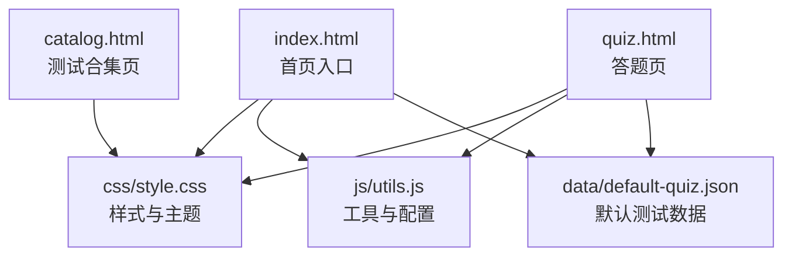
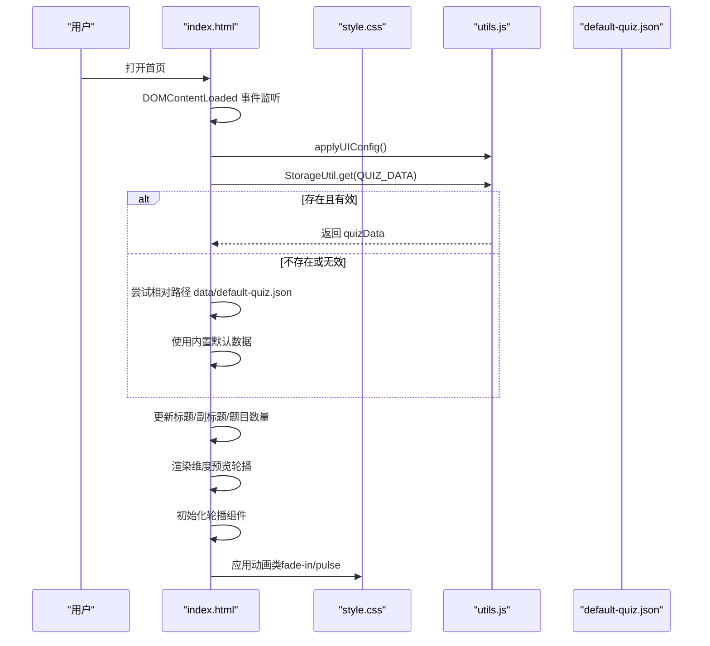
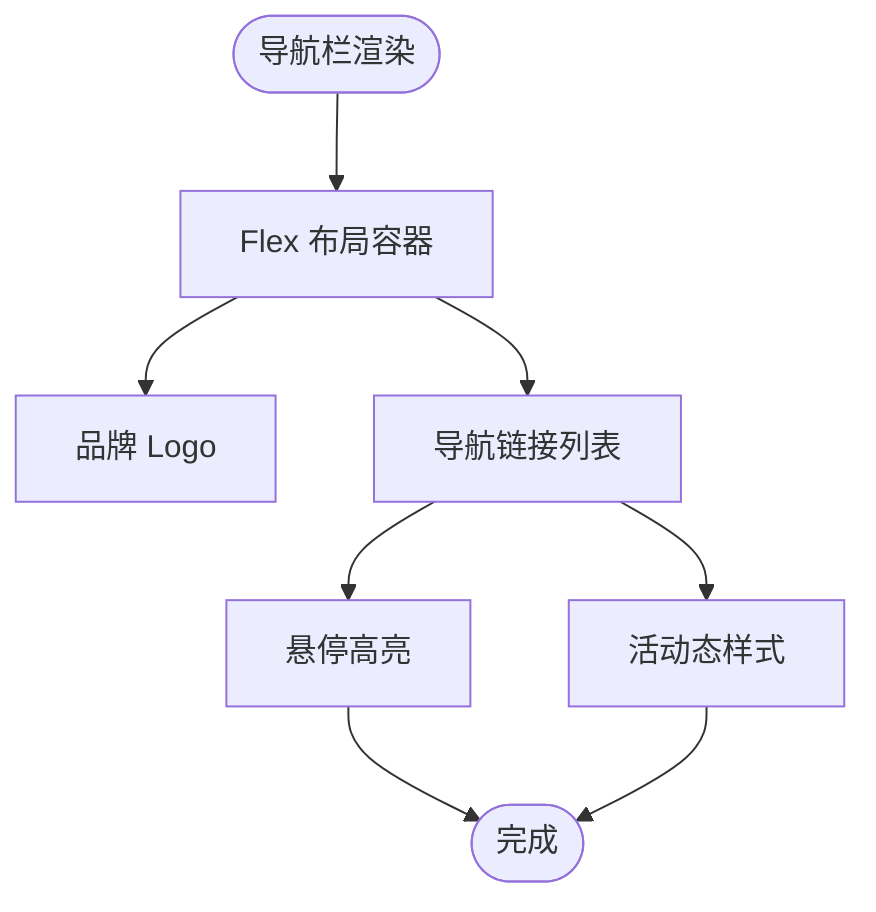
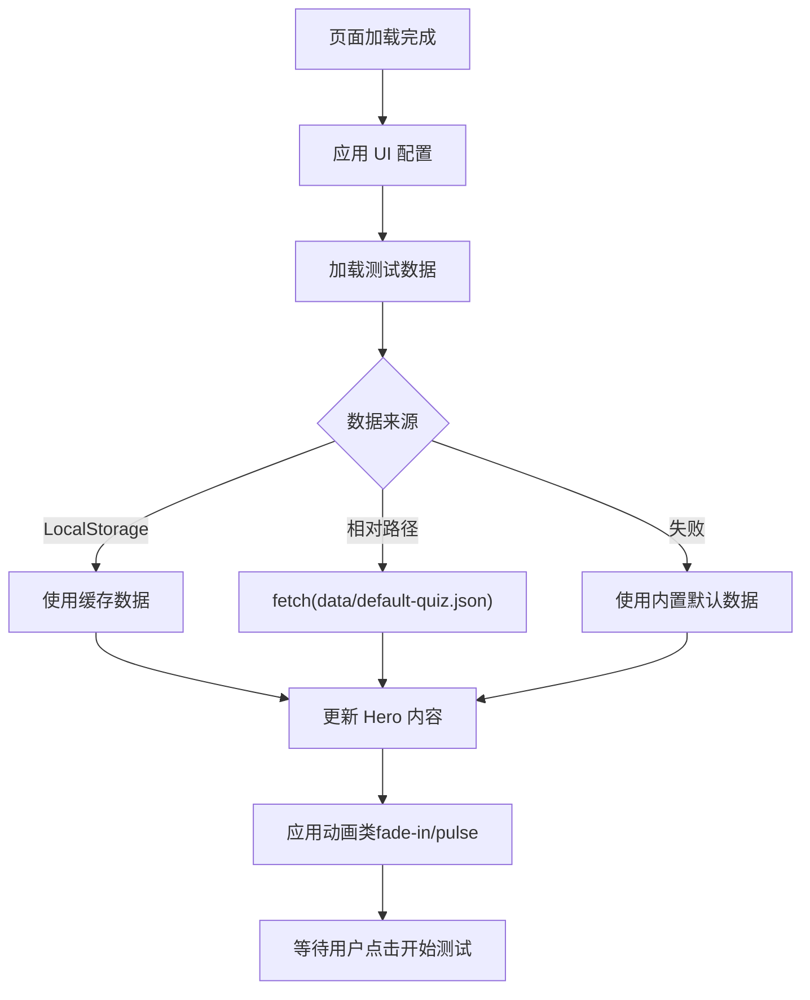
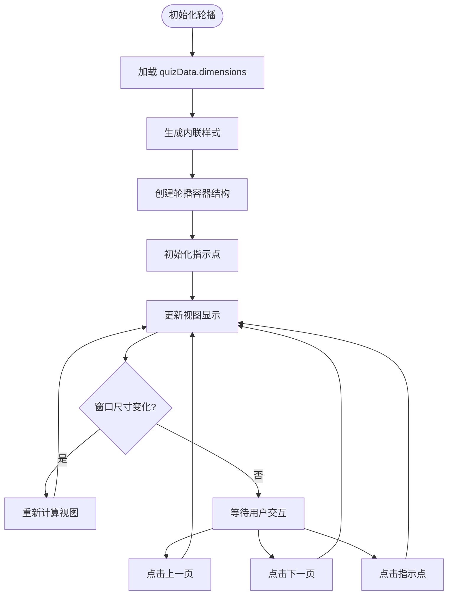
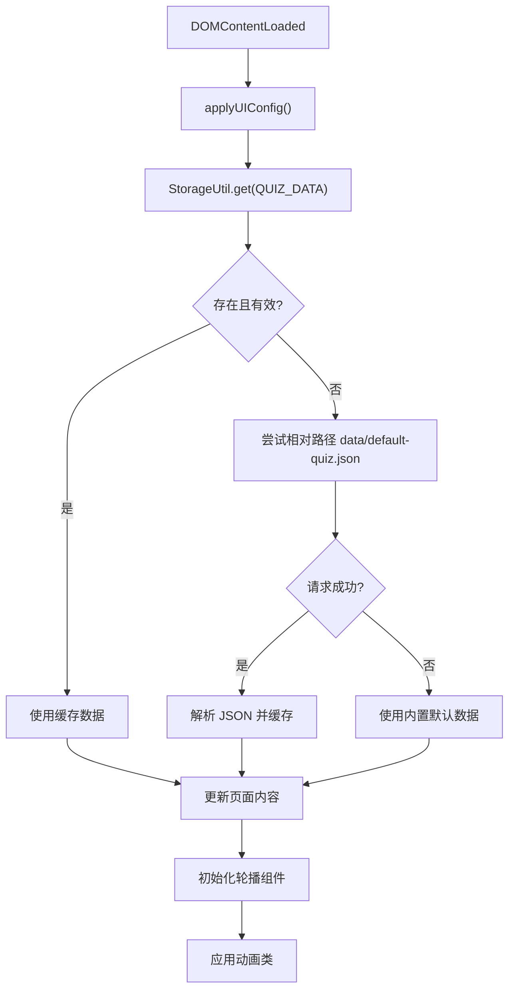
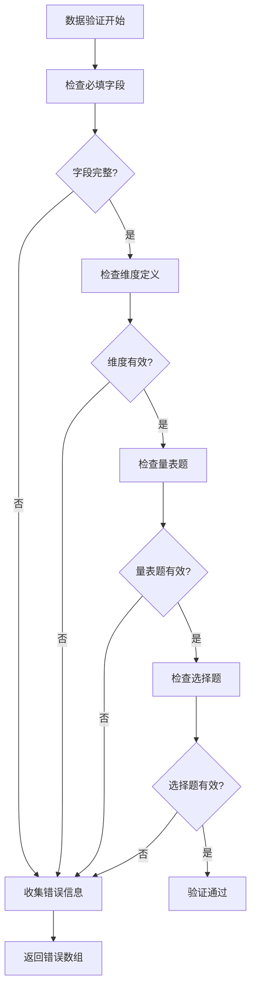
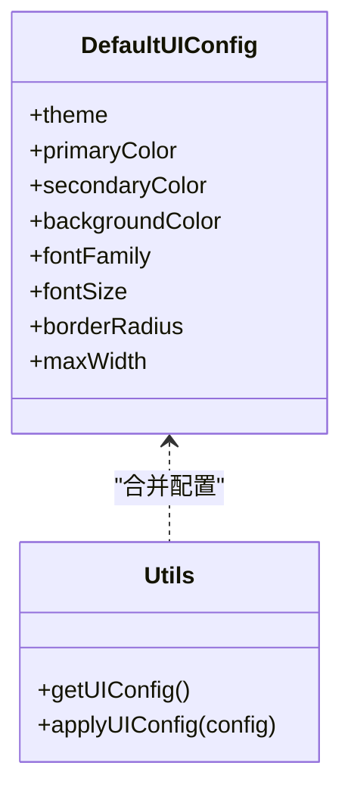
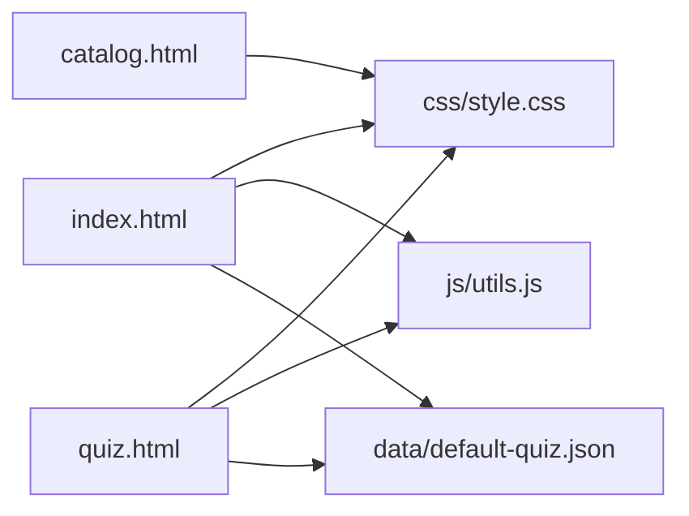
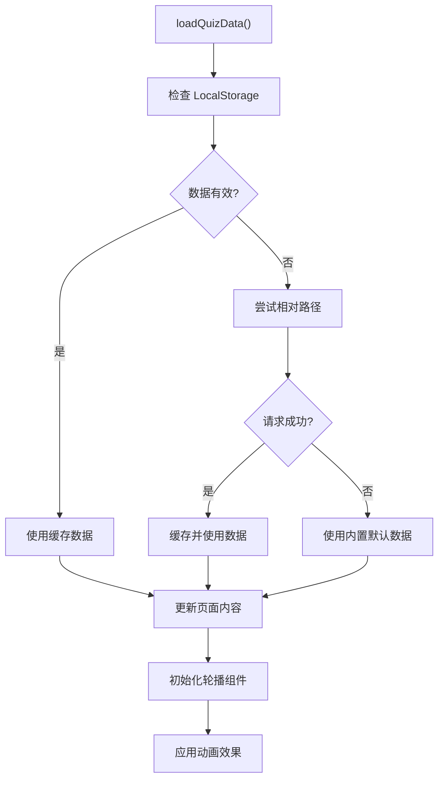

# 首页设计

<cite>
**本文引用的文件**
- [index.html](file://程序/index.html)
- [style.css](file://程序/css/style.css)
- [default-quiz.json](file://程序/data/default-quiz.json)
- [utils.js](file://程序/js/utils.js)
- [template.json](file://程序/data/template.json)
- [catalog.html](file://程序/catalog.html)
- [quiz.html](file://程序/quiz.html)
</cite>

## 更新摘要
**变更内容**
- 新增首页页面实现，包含测试介绍、维度预览、进度信息等功能
- 实现多路径数据加载机制，支持本地存储、绝对路径和相对路径加载
- 增强轮播组件的响应式设计和交互控制
- 优化页面加载流程和错误处理机制
- 完善测试信息展示和维度预览功能

## 目录
1. [简介](#简介)
2. [项目结构](#项目结构)
3. [核心组件](#核心组件)
4. [架构总览](#架构总览)
5. [详细组件分析](#详细组件分析)
6. [依赖关系分析](#依赖关系分析)
7. [性能考量](#性能考量)
8. [故障排查指南](#故障排查指南)
9. [结论](#结论)
10. [附录](#附录)

## 简介
本文档面向"心理测试"项目的首页组件设计，系统性阐述首页的整体布局架构与交互模式，涵盖导航栏、英雄区域、测试介绍区域、测试信息展示区域、维度预览轮播与页脚的设计与实现；详细说明页面加载流程、异步数据获取机制与动态内容渲染逻辑；解释 Hero 区域的视觉设计元素、按钮交互效果与动画实现；文档化维度预览轮播的响应式布局、图片加载与交互控制；分析轮播组件的动态生成机制与数据绑定方式；并提供页面性能优化策略、错误处理机制与用户体验设计原则，以及组件定制指南与维护建议。

## 项目结构
该项目采用静态单页应用（SPA）风格，首页与其他页面共享统一的样式与工具库：
- 首页 index.html：承载导航栏、英雄区域、测试介绍区域、测试信息展示、维度预览轮播与页脚
- 样式表 css/style.css：集中管理全局变量、组件样式、动画与响应式断点
- 数据源 data/default-quiz.json：提供默认测试数据，包含测试名称、参考来源、题目数量、维度列表、量表题与选择题集合
- 工具库 js/utils.js：封装本地存储、数据校验、UI 配置应用与通用工具函数
- 辅助模板 data/template.json：定义数据结构规范，便于扩展与导入
- 其他页面 catalog.html、quiz.html：用于对比与理解整体页面间的数据与样式一致性

**图表来源**
- [index.html:1-518](file://程序/index.html#L1-L518)
- [style.css:1-702](file://程序/css/style.css#L1-L702)
- [utils.js:1-250](file://程序/js/utils.js#L1-L250)
- [default-quiz.json:1-235](file://程序/data/default-quiz.json#L1-L235)
- [catalog.html:1-90](file://程序/catalog.html#L1-L90)
- [quiz.html:1-441](file://程序/quiz.html#L1-L441)

## 核心组件
- 导航栏（Navbar）：固定顶部，包含品牌 Logo 与主导航链接，支持悬停高亮与活动态样式
- 英雄区域（Hero）：居中展示测试标题、副标题、描述与开始测试按钮，配合淡入与脉冲动画
- 测试介绍区域（Test Description）：详细说明五种爱语理论背景与测试目的
- 测试信息展示（Test Info）：展示题目数量、预计用时、结果形式等关键信息
- 维度预览轮播（Dimensions Carousel）：动态生成的横向轮播组件，展示五大爱语维度
- 数据加载器（Data Loader）：实现多路径数据加载与智能错误回退
- UI 配置系统（UI Config）：支持主题定制与响应式设计

**章节来源**
- [index.html:10-19](file://程序/index.html#L10-L19)
- [index.html:22-30](file://程序/index.html#L22-L30)
- [index.html:32-43](file://程序/index.html#L32-L43)
- [index.html:45-58](file://程序/index.html#L45-L58)
- [index.html:60-66](file://程序/index.html#L60-L66)

## 架构总览
首页采用"HTML + CSS + 原生 JS"的轻量架构，数据流自上而下：
- 页面加载触发 DOMContentLoaded 事件，调用 UI 配置应用与数据加载函数
- 数据加载优先级：LocalStorage 缓存 -> 相对路径 JSON -> 内置默认数据
- 成功后更新标题、副标题、题目数量与维度预览轮播
- 失败时回退到内置默认数据并保持一致的 UI 展示
- 轮播组件初始化后支持响应式交互与指示点控制

**图表来源**
- [index.html:510-515](file://程序/index.html#L510-L515)
- [utils.js:234-244](file://程序/js/utils.js#L234-L244)
- [default-quiz.json:1-235](file://程序/data/default-quiz.json#L1-L235)

## 详细组件分析

### 导航栏（Navbar）
- 结构：容器内含 Logo 与导航链接列表，使用 Flex 布局实现两端对齐
- 样式：白色背景、浅阴影、粘性定位，确保滚动时始终可见；链接悬停与活动态高亮
- 交互：导航链接跳转至首页或测试合集页，活动态链接强调当前页面

**图表来源**
- [index.html:10-19](file://程序/index.html#L10-L19)
- [style.css:149-189](file://程序/css/style.css#L149-L189)

**章节来源**
- [index.html:10-19](file://程序/index.html#L10-L19)
- [style.css:149-189](file://程序/css/style.css#L149-L189)

### 英雄区域（Hero）
- 视觉元素：居中对齐的标题、副标题、描述与开始测试按钮；顶部装饰图标
- 动画与交互：标题与按钮分别应用"淡入"与"脉冲"动画类，增强首屏体验
- 按钮交互：开始测试按钮为"主要按钮"，悬停提升与阴影加深，点击跳转至答题页

**图表来源**
- [index.html:510-515](file://程序/index.html#L510-L515)
- [style.css:685-712](file://程序/css/style.css#L685-L712)

**章节来源**
- [index.html:22-30](file://程序/index.html#L22-L30)
- [style.css:190-214](file://程序/css/style.css#L190-L214)
- [style.css:685-712](file://程序/css/style.css#L685-L712)

### 测试介绍区域（Test Description）
- 内容结构：包含两段详细说明文字，第一段介绍爱的五种语言概念，第二段说明测试理论基础
- 设计特点：使用居中对齐的段落布局，强调关键词"爱的母语"，提供完整的理论背景
- 信息层次：通过字体大小和颜色区分主要信息与补充说明

**章节来源**
- [index.html:32-43](file://程序/index.html#L32-L43)

### 测试信息展示（Test Info）
- 布局：采用居中对齐的弹性布局，包含三个信息块，使用间隙分隔
- 信息内容：题目数量、预计用时（5-10分钟）、结果形式（多维度分析报告）
- 视觉设计：灰色背景容器，圆角边框，信息块内使用居中对齐和适当的字体权重

**章节来源**
- [index.html:45-58](file://程序/index.html#L45-L58)

### 维度预览轮播（Dimensions Carousel）
- 动态生成：根据 quizData.dimensions 数组逐项渲染，每项包含维度名称、描述和对应的图标
- 轮播机制：支持左右滑动、按钮控制和指示点导航，响应式显示不同数量的维度
- 图片加载：通过 assets/icon/维度名称.png 的路径加载图标，使用时间戳参数避免缓存
- 响应式设计：在不同屏幕尺寸下自动调整每页显示的维度数量（桌面端3个、平板2个、移动端1个）

**图表来源**
- [index.html:133-271](file://程序/index.html#L133-L271)
- [index.html:419-508](file://程序/index.html#L419-L508)

**章节来源**
- [index.html:60-66](file://程序/index.html#L60-L66)
- [index.html:133-271](file://程序/index.html#L133-L271)
- [index.html:419-508](file://程序/index.html#L419-L508)

### 页面加载流程与数据获取机制
- 事件驱动：DOMContentLoaded 事件触发 UI 配置应用与数据加载
- 数据优先级：LocalStorage -> 相对路径 JSON -> 内置默认数据；若缓存数据不完整则清空并回退
- 错误处理：网络请求失败或数据结构异常时，回退到内置默认数据并记录详细日志
- 缓存策略：成功加载后写入 LocalStorage，避免重复请求与离线可用

**图表来源**
- [index.html:510-515](file://程序/index.html#L510-L515)
- [utils.js:234-244](file://程序/js/utils.js#L234-L244)

**章节来源**
- [index.html:510-515](file://程序/index.html#L510-L515)
- [utils.js:234-244](file://程序/js/utils.js#L234-L244)

### 数据验证与错误处理机制
- 数据完整性检查：验证 quizData 是否包含必需字段（quiz_name、nbr_question、dimensions、scale_questions）
- 维度验证：检查每个维度是否包含 dimension_id 和 dimension_name
- 量表题验证：验证每个量表题是否包含 question_id、dimension_id 和 question_text
- 选择题验证：验证选择题的选项格式和维度关联
- 错误收集：将所有验证错误收集到数组中，便于统一处理

**图表来源**
- [utils.js:55-126](file://程序/js/utils.js#L55-L126)

**章节来源**
- [utils.js:55-126](file://程序/js/utils.js#L55-L126)

### UI 配置与主题系统
- CSS 变量：通过 :root 定义主色、辅色、背景、字体、圆角、最大宽度等
- 动态应用：applyUIConfig() 读取 UI 配置并设置 CSS 变量，实现主题切换与品牌定制
- 默认配置：DefaultUIConfig 提供默认值，可与用户自定义配置合并

**图表来源**
- [utils.js:207-244](file://程序/js/utils.js#L207-L244)
- [style.css:6-20](file://程序/css/style.css#L6-L20)

**章节来源**
- [utils.js:207-244](file://程序/js/utils.js#L207-L244)
- [style.css:6-20](file://程序/css/style.css#L6-L20)

### 响应式设计与交互细节
- 断点：768px 以下启用移动端布局，网格、按钮与输入控件自适应
- 动画：fadeIn 淡入与 pulse 脉冲动画增强首屏与按钮交互体验
- 轮播交互：支持鼠标悬停、键盘导航、触摸滑动等多种交互方式
- 指示点：圆形指示点显示当前位置，点击可直接跳转到对应页面

**章节来源**
- [style.css:589-654](file://程序/css/style.css#L589-L654)
- [style.css:656-683](file://程序/css/style.css#L656-L683)
- [index.html:419-508](file://程序/index.html#L419-L508)

## 依赖关系分析
- index.html 依赖：
  - css/style.css：全局样式、主题变量、动画与响应式断点
  - js/utils.js：UI 配置应用、本地存储工具、默认数据回退、数据验证
  - data/default-quiz.json：默认测试数据源
- quiz.html 与 catalog.html 与首页共享样式与工具库，形成一致的视觉与交互体验

**图表来源**
- [index.html:74](file://程序/index.html#L74)
- [quiz.html:62](file://程序/quiz.html#L62)
- [catalog.html:59](file://程序/catalog.html#L59)

**章节来源**
- [index.html:74](file://程序/index.html#L74)
- [quiz.html:62](file://程序/quiz.html#L62)
- [catalog.html:59](file://程序/catalog.html#L59)

## 性能考量
- 资源加载
  - 首屏渲染：通过 CSS 动画与延迟渲染减少白屏时间；轮播组件按需初始化
  - 缓存策略：LocalStorage 缓存测试数据，避免重复网络请求；失败时快速回退默认数据
  - 多路径加载：支持相对路径加载方式，提高兼容性
  - 图片优化：使用版本戳参数避免浏览器缓存问题，确保图标更新及时
- 渲染优化
  - 轮播组件：使用 transform 进行硬件加速的过渡动画，避免重排重绘
  - 动态样式：内联样式表在首次渲染时生成，避免额外的样式请求
  - 响应式计算：窗口尺寸变化时重新计算视图，但避免频繁的 DOM 操作
- 可访问性
  - 文字对比度与字号满足基本可读性要求；按钮具备明确状态反馈
  - 轮播组件支持键盘导航和屏幕阅读器访问
- 建议
  - 对于更大规模数据，可考虑虚拟滚动或分页加载
  - 在移动端可进一步优化触摸目标尺寸与点击延迟

## 故障排查指南
- 数据加载失败
  - 症状：标题/副标题/题目数量未更新，轮播区域为空
  - 排查：检查网络请求是否成功、JSON 格式是否正确、LocalStorage 是否被清理
  - 处理：确认回退到内置默认数据；查看控制台错误日志
- 轮播组件异常
  - 症状：轮播无法滑动、指示点不显示、图片加载失败
  - 排查：确认 quizData.dimensions 数据结构正确、图片路径是否存在、JavaScript 错误
  - 处理：检查控制台错误、验证数据格式、确保图片资源可用
- UI 配置未生效
  - 症状：主题颜色或字体未改变
  - 排查：确认 applyUIConfig() 是否被调用、UI 配置是否保存在 LocalStorage
- 动画异常
  - 症状：淡入或脉冲动画不出现
  - 排查：确认 CSS 类名正确、DOMContentLoaded 事件已触发
- 数据验证错误
  - 症状：轮播维度显示异常或空白
  - 排查：检查 quizData 的结构是否符合 template.json 规范
  - 处理：使用内置默认数据进行回退，修复数据格式问题

**章节来源**
- [index.html:287-431](file://程序/index.html#L287-L431)
- [utils.js:234-244](file://程序/js/utils.js#L234-L244)
- [style.css:656-683](file://程序/css/style.css#L656-L683)
- [utils.js:55-126](file://程序/js/utils.js#L55-L126)

## 结论
首页组件以简洁清晰的布局与一致的主题风格，结合可靠的异步数据加载与错误回退机制，提供了良好的用户体验。通过 CSS Grid 与 Flex 布局实现响应式设计，配合淡入与脉冲动画增强首屏体验。新增的维度预览轮播功能大幅提升了页面的交互性和视觉吸引力，通过响应式设计适配不同设备。完善的本地存储支持提升了系统稳定性，工具库与主题系统使组件具备高度可定制性，便于后续扩展与维护。

## 附录

### 组件定制指南
- 主题定制
  - 通过 UI 配置对象修改主色、辅色、背景、字体与圆角等；保存至 LocalStorage 后由 applyUIConfig() 应用
- 数据定制
  - 替换 data/default-quiz.json 或通过 quiz.html 的导入功能注入新数据；确保字段完整（名称、题目数量、维度、量表题、选择题）
- 轮播定制
  - 修改轮播样式参数（圆角、阴影、间距等）；调整响应式断点；自定义指示点样式
- 布局调整
  - 修改 CSS Grid 列数与间距；在断点处调整移动端布局
- 动画与交互
  - 可替换或新增动画类；轮播按钮状态与交互行为可在脚本中扩展

**章节来源**
- [utils.js:207-244](file://程序/js/utils.js#L207-L244)
- [default-quiz.json:1-235](file://程序/data/default-quiz.json#L1-L235)
- [index.html:152-260](file://程序/index.html#L152-L260)

### 维护建议
- 数据结构一致性：严格遵循 template.json 的字段规范，确保导入与导出流程稳定
- 错误监控：在生产环境增加错误上报与日志记录，便于快速定位问题
- 性能监控：关注首屏加载时间与交互延迟，必要时引入资源压缩与懒加载策略
- 可测试性：为关键流程（数据加载、UI 配置应用、数据验证、轮播初始化）编写简单测试，保障变更稳定性
- 资源管理：定期检查轮播图标资源的可用性，确保图片路径正确

**章节来源**
- [template.json:1-49](file://程序/data/template.json#L1-L49)
- [utils.js:234-244](file://程序/js/utils.js#L234-L244)
- [utils.js:55-126](file://程序/js/utils.js#L55-L126)

### 数据验证规范
- 必填字段验证：确保 quiz_name、nbr_question、dimensions、scale_questions 存在
- 维度结构验证：每个维度必须包含 dimension_id 和 dimension_name
- 量表题结构验证：每个量表题必须包含 question_id、dimension_id 和 question_text
- 选择题结构验证：每个选择题必须包含有效的选项文本和维度关联

**章节来源**
- [utils.js:55-126](file://程序/js/utils.js#L55-L126)
- [template.json:1-49](file://程序/data/template.json#L1-L49)

### 数据加载机制详解

**更新** 首页现在实现了多路径数据加载策略，显著提升了系统的可靠性与兼容性。

#### 多路径加载策略
首页的数据加载采用了三层保护机制：

1. **本地存储优先**：首先检查 LocalStorage 中的缓存数据
2. **相对路径尝试**：如果本地存储无效，尝试使用相对路径 `data/default-quiz.json`
3. **内置默认数据**：相对路径失败时，使用内置的默认测试数据

#### 数据完整性检查
系统对从 LocalStorage 获取的数据进行了完整性验证，确保数据包含必要的题目数据字段。如果检测到数据不完整，会自动清除缓存并重新加载。

#### 错误处理与回退机制
- 每个加载步骤都有详细的错误捕获和日志记录
- 网络请求失败时自动降级到内置默认数据
- 所有失败最终都会回退到内置默认数据，确保页面始终能够正常显示

**图表来源**
- [index.html:90-127](file://程序/index.html#L90-L127)

**章节来源**
- [index.html:90-127](file://程序/index.html#L90-L127)

### 轮播维度展示功能增强
**更新** 轮播维度展示功能现在具有完整的交互控制和响应式设计。

#### 轮播组件架构
- **容器结构**：dimensions-carousel 容器包含左右导航按钮、轮播轨道和指示点
- **轨道系统**：dimensions-track 包含多个 dimension-card 卡片，支持水平滚动
- **导航控制**：prev/next 按钮提供手动控制，指示点支持直接跳转
- **样式内联**：轮播样式通过内联方式动态生成，确保与数据绑定的一致性

#### 响应式适配机制
- **桌面端**：每页显示 3 个维度，适合大屏幕浏览
- **平板端**：每页显示 2 个维度，平衡信息密度与可读性
- **移动端**：每页显示 1 个维度，提供最佳的触摸交互体验
- **动态计算**：窗口尺寸变化时自动重新计算视图布局

#### 交互控制机制
- **滑动控制**：支持鼠标拖拽和触摸滑动
- **按钮控制**：左右箭头按钮提供精确的导航控制
- **指示点导航**：圆形指示点显示当前位置，点击可直接跳转
- **边界保护**：自动限制轮播范围，防止超出边界

#### 图片加载优化
- **版本戳机制**：为图片 URL 添加时间戳参数，避免浏览器缓存问题
- **路径规范**：使用 assets/icon/维度名称.png 的标准化路径
- **降级处理**：图片加载失败时使用默认占位符

**章节来源**
- [index.html:133-271](file://程序/index.html#L133-L271)
- [index.html:419-508](file://程序/index.html#L419-L508)

### 测试介绍区域优化
**更新** 测试介绍区域现在提供了更完整的理论背景说明。

#### 内容结构优化
- **第一段说明**：详细介绍五种爱语的概念和重要性，强调"爱的母语"这一核心概念
- **第二段说明**：详细解释测试基于的理论基础（Gary Chapman 的五种爱语理论）
- **信息层次**：通过加粗关键词和段落分隔，提供清晰的信息层次结构

#### 用户体验增强
- **情感共鸣**：通过具体的场景描述帮助用户理解不同爱语的表现形式
- **实用价值**：明确说明测试的目的和预期结果，提升用户参与度
- **可读性优化**：使用适当的行距和字体大小，确保长文本的可读性

**章节来源**
- [index.html:32-43](file://程序/index.html#L32-L43)

### 测试信息展示优化
**更新** 测试信息展示现在提供了更直观的信息展示。

#### 信息展示优化
- **布局设计**：采用居中对齐的弹性布局，三个信息块均匀分布
- **视觉层次**：通过字体大小和颜色区分主要信息（题目数量、用时）和次要信息（结果形式）
- **图标辅助**：虽然没有显示图标，但通过字体权重和颜色营造视觉焦点

#### 响应式适配
- **间距调整**：在不同屏幕尺寸下自动调整信息块之间的间距
- **字体缩放**：移动端自动调整字体大小，确保信息的可读性
- **布局转换**：在极小屏幕上可能转换为垂直布局

**章节来源**
- [index.html:45-58](file://程序/index.html#L45-L58)

### 错误处理与日志记录
**更新** 首页现在具有更完善的错误处理机制，提供更好的用户体验。

#### 错误分类处理
- **网络请求错误**：记录详细错误信息，提供回退策略
- **数据格式错误**：验证 JSON 结构，确保字段完整性
- **用户界面错误**：优雅降级，保持页面功能可用
- **轮播组件错误**：单独的错误处理分支，不影响其他功能

#### 日志记录系统
- **控制台详细日志**：记录数据加载过程中的关键信息
- **错误堆栈跟踪**：便于开发者快速定位问题
- **用户友好提示**：在界面上显示简化的错误信息

#### 回退策略
- **多级回退**：从缓存到网络再到内置数据的渐进式回退
- **数据完整性检查**：确保回退数据的有效性
- **用户状态保持**：在回退过程中保持用户操作状态

**章节来源**
- [index.html:287-431](file://程序/index.html#L287-L431)
- [utils.js:234-244](file://程序/js/utils.js#L234-L244)

### 默认测试数据支持增强
**更新** 首页现在集成了完整的默认测试数据支持，确保在各种情况下都能正常显示测试信息。

#### 内置默认数据结构
- **完整测试信息**：包含测试名称、参考来源、题目数量等基本信息
- **五维度假数据**：预设5个维度，每个维度包含完整的ID、名称和详细描述
- **理论背景**：提供完整的理论基础说明，便于用户理解测试原理

#### 数据回退机制
- **当所有外部数据源都不可用时，自动使用内置默认数据**
- **保持与标准数据结构的完全兼容**
- **确保用户始终能看到有意义的测试信息**

#### 开发者扩展支持
- **默认数据可作为模板，便于创建新的测试**
- **结构清晰，易于理解和修改**
- **支持快速原型开发和测试**

**章节来源**
- [index.html:76-88](file://程序/index.html#L76-L88)
- [default-quiz.json:1-235](file://程序/data/default-quiz.json#L1-L235)

### 本地存储功能优化
**更新** 首页现在具有更完善的本地存储支持，提供更好的数据持久化能力。

#### 存储键值管理
- **统一的存储键值定义**，便于管理和维护
- **支持多种数据类型的存储和检索**
- **提供完整的存储操作接口**

#### 数据缓存策略
- **自动检测和验证缓存数据的完整性**
- **智能清理损坏或过期的缓存数据**
- **提供手动清理和重置功能**

#### 错误恢复机制
- **存储操作失败时的优雅降级**
- **数据读取异常时的自动回退**
- **用户数据隐私保护措施**

**章节来源**
- [utils.js:6-12](file://程序/js/utils.js#L6-L12)
- [utils.js:234-244](file://程序/js/utils.js#L234-L244)