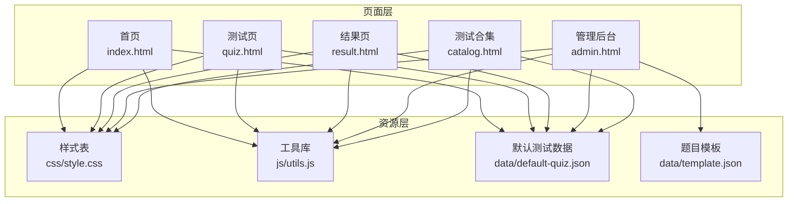
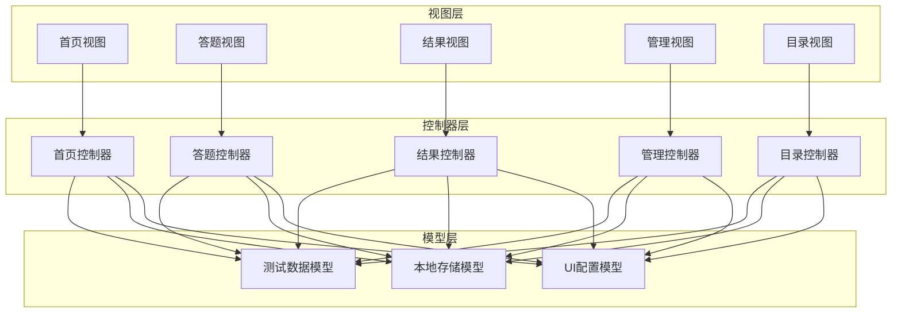
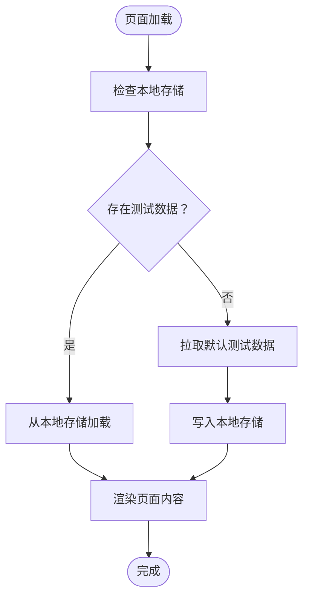
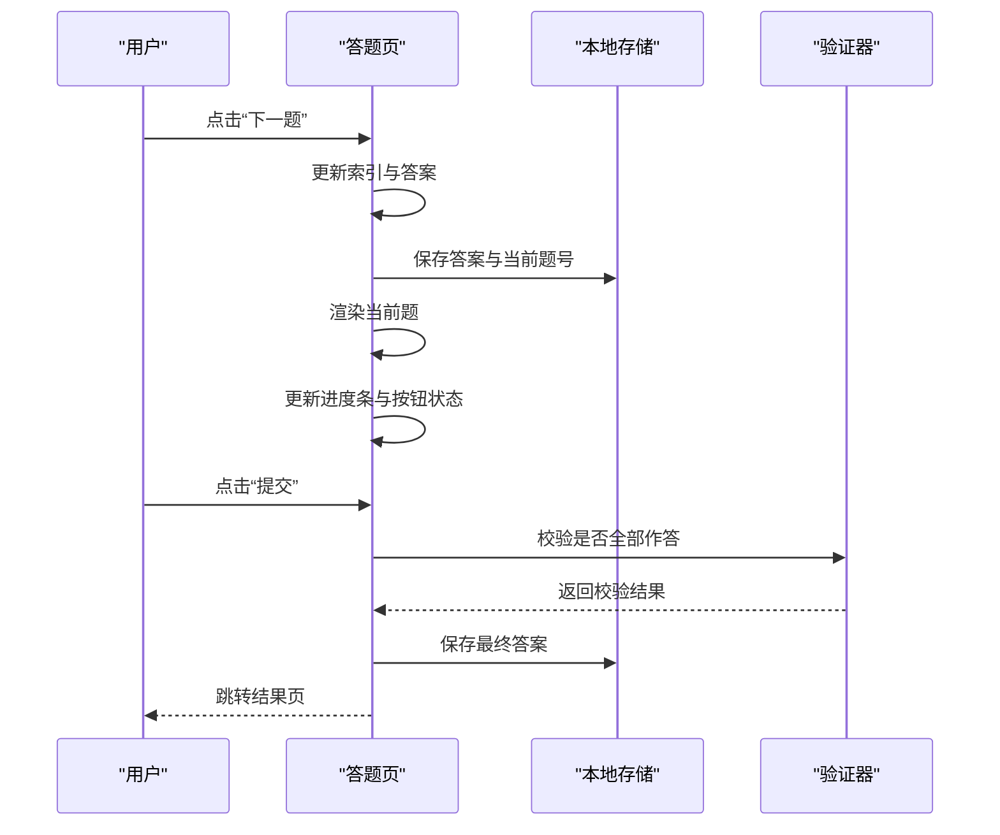
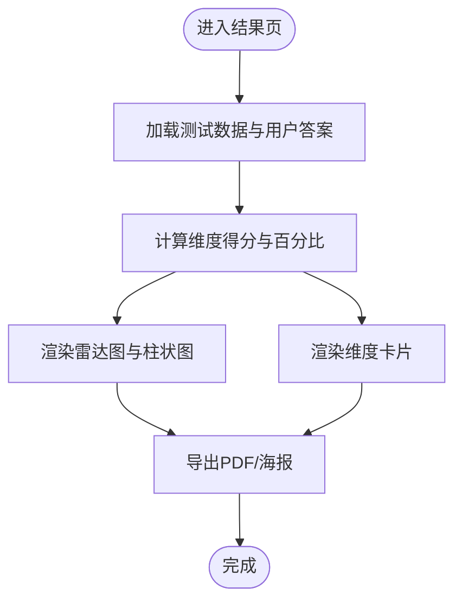
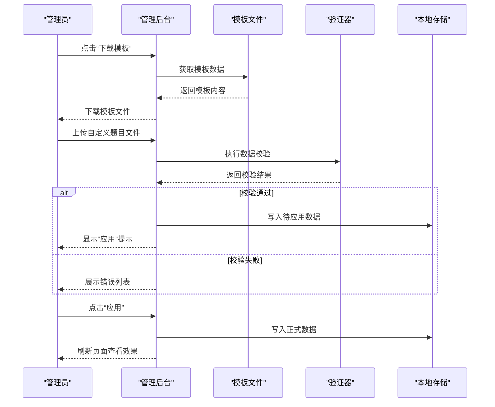
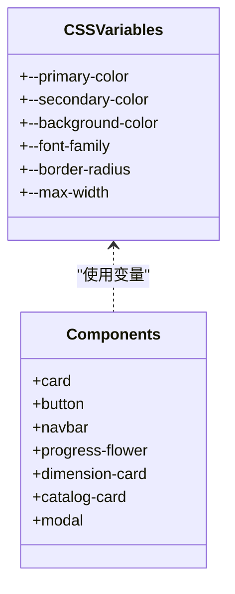
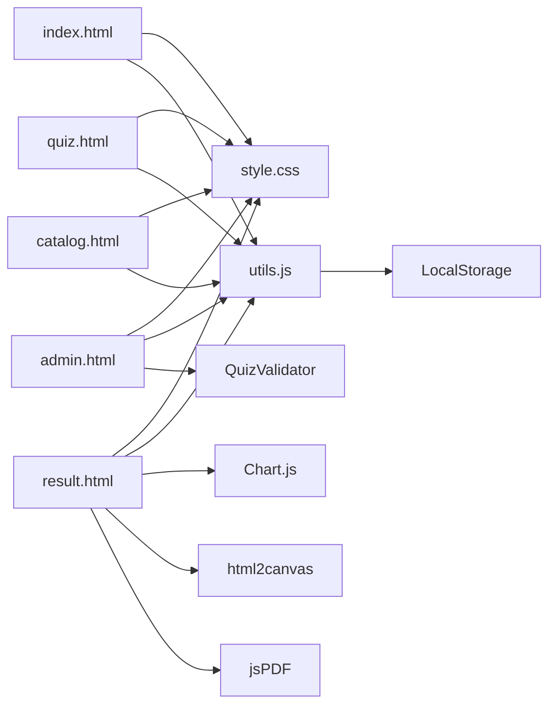

# 项目概述

<cite>
**本文引用的文件**
- [index.html](file://index.html)
- [quiz.html](file://quiz.html)
- [result.html](file://result.html)
- [admin.html](file://admin.html)
- [catalog.html](file://catalog.html)
- [style.css](file://css/style.css)
- [utils.js](file://js/utils.js)
- [default-quiz.json](file://data/default-quiz.json)
- [template.json](file://data/template.json)
</cite>

## 目录
1. [引言](#引言)
2. [项目结构](#项目结构)
3. [核心组件](#核心组件)
4. [架构总览](#架构总览)
5. [详细组件分析](#详细组件分析)
6. [依赖分析](#依赖分析)
7. [性能考虑](#性能考虑)
8. [故障排除指南](#故障排除指南)
9. [结论](#结论)
10. [附录](#附录)

## 引言
本项目是一个基于“爱的五种语言”理论的心理测试系统，旨在为用户提供多维度的自我认知与关系理解工具。系统围绕五个核心维度（肯定的言语、高质量陪伴、收到礼物、服务的行动、身体接触）构建，支持在线答题、实时进度跟踪、多图表结果展示、PDF报告导出与分享海报生成功能，并提供管理后台以实现测试内容与界面的灵活定制。

项目采用前端纯静态技术栈，结合本地存储实现用户进度持久化，确保在无后端环境下的可用性与易部署性；同时通过模块化的工具函数与统一的样式体系，保证代码的可维护性与一致性。

## 项目结构
项目采用扁平的页面组织方式，每个页面职责清晰：
- 首页：展示测试基本信息、维度预览与操作入口
- 测试页：承载答题流程、进度可视化与导航控制
- 结果页：计算得分、渲染雷达图与柱状图、支持导出与分享
- 管理后台：UI配置、文字与配图配置、题目管理（模板下载、上传校验、应用）
- 测试合集：展示当前测试并引导至管理后台扩展更多测试

**图表来源**
- [index.html:1-115](file://index.html#L1-L115)
- [quiz.html:1-259](file://quiz.html#L1-L259)
- [result.html:1-363](file://result.html#L1-L363)
- [admin.html:1-402](file://admin.html#L1-L402)
- [catalog.html:1-106](file://catalog.html#L1-L106)
- [style.css:1-731](file://css/style.css#L1-L731)
- [utils.js:1-250](file://js/utils.js#L1-L250)
- [default-quiz.json:1-235](file://data/default-quiz.json#L1-L235)
- [template.json:1-49](file://data/template.json#L1-L49)

**章节来源**
- [index.html:1-115](file://index.html#L1-L115)
- [quiz.html:1-259](file://quiz.html#L1-L259)
- [result.html:1-363](file://result.html#L1-L363)
- [admin.html:1-402](file://admin.html#L1-L402)
- [catalog.html:1-106](file://catalog.html#L1-L106)
- [style.css:1-731](file://css/style.css#L1-L731)
- [utils.js:1-250](file://js/utils.js#L1-L250)
- [default-quiz.json:1-235](file://data/default-quiz.json#L1-L235)
- [template.json:1-49](file://data/template.json#L1-L49)

## 核心组件
- 数据模型与加载
  - 默认测试数据包含测试元信息、维度定义、量表题与选择题集合
  - 页面通过本地存储优先读取，缺失时回退到默认数据源
- 工具库
  - 本地存储封装、数据验证器、通用工具函数（防抖、下载、读取文件、ID生成、百分比格式化、滚动）
  - UI配置合并与应用，支持主题色、字体、圆角等动态调整
- 答题流程
  - 合并量表题与选择题，按序渲染，支持进度保存与恢复
  - 实时更新进度条与“小花生长”动画
- 结果计算与展示
  - 量表题按选项计分，选择题按命中维度计满分
  - 多维度百分比计算，生成雷达图与柱状图，维度卡片按得分排序
  - 支持PDF报告与海报生成（html2canvas + jsPDF）
- 管理后台
  - UI配置（颜色、字体、圆角）、文字与配图配置
  - 题目管理：下载模板、上传校验、预览、保存与应用
  - 题目概览：统计维度、题量、参考理论等

**章节来源**
- [default-quiz.json:1-235](file://data/default-quiz.json#L1-L235)
- [utils.js:1-250](file://js/utils.js#L1-L250)
- [quiz.html:60-98](file://quiz.html#L60-L98)
- [result.html:94-133](file://result.html#L94-L133)
- [admin.html:188-241](file://admin.html#L188-L241)

## 架构总览
系统遵循“页面即控制器”的前端架构模式，结合模块化设计与事件驱动交互：
- MVC 视图层：HTML 页面负责视图与用户交互
- 控制器层：页面内脚本处理业务逻辑与事件响应
- 模型层：本地存储与 JSON 数据作为数据模型
- 模块化：工具库封装通用能力，UI 配置集中管理
- 事件驱动：DOMContentLoaded、按钮点击、文件上传等事件驱动流程

**图表来源**
- [index.html:69-112](file://index.html#L69-L112)
- [quiz.html:50-256](file://quiz.html#L50-L256)
- [result.html:85-360](file://result.html#L85-L360)
- [admin.html:171-399](file://admin.html#L171-L399)
- [utils.js:1-250](file://js/utils.js#L1-L250)

## 详细组件分析

### 数据模型与加载组件
- 职责：提供测试元信息、维度定义、题目集合与默认数据回退
- 关键点：
  - 页面加载时优先从本地存储读取，不存在则拉取默认数据
  - 维度与题目结构严格遵循 JSON Schema，便于校验与扩展
- 复杂度：O(n) 遍历维度与题目进行渲染与统计

**图表来源**
- [index.html:70-105](file://index.html#L70-L105)
- [quiz.html:61-98](file://quiz.html#L61-L98)
- [catalog.html:77-96](file://catalog.html#L77-L96)

**章节来源**
- [default-quiz.json:1-235](file://data/default-quiz.json#L1-L235)
- [index.html:70-105](file://index.html#L70-L105)
- [quiz.html:61-98](file://quiz.html#L61-L98)
- [catalog.html:77-96](file://catalog.html#L77-L96)

### 答题流程组件
- 职责：合并题目、渲染当前题、记录答案、保存进度、更新进度条与按钮状态
- 关键点：
  - 量表题与选择题分别渲染，支持选中态高亮与即时保存
  - “小花生长”进度条根据完成比例动态变化
  - 最后一题自动切换“下一题”为“提交”，并校验完整性
- 复杂度：每次切换 O(1)，渲染题目 O(k)（k 为选项数）

**图表来源**
- [quiz.html:100-175](file://quiz.html#L100-L175)
- [quiz.html:183-215](file://quiz.html#L183-L215)
- [quiz.html:237-249](file://quiz.html#L237-L249)
- [utils.js:55-126](file://js/utils.js#L55-L126)

**章节来源**
- [quiz.html:50-256](file://quiz.html#L50-L256)
- [utils.js:55-126](file://js/utils.js#L55-L126)

### 结果计算与展示组件
- 职责：计算维度得分与百分比、渲染图表与维度卡片、生成 PDF 与海报
- 关键点：
  - 量表题线性计分，选择题命中维度计满分
  - 雷达图与柱状图使用 Chart.js，维度卡片按百分比降序排列
  - PDF 使用 jsPDF，海报使用 html2canvas 截图并下载
- 复杂度：计算 O(d+q)（d 为维度数，q 为题目数），渲染图表 O(d)

**图表来源**
- [result.html:94-133](file://result.html#L94-L133)
- [result.html:153-240](file://result.html#L153-L240)
- [result.html:269-328](file://result.html#L269-L328)

**章节来源**
- [result.html:85-360](file://result.html#L85-L360)

### 管理后台组件
- 职责：UI 配置、文字与配图配置、题目管理（下载模板、上传校验、应用）
- 关键点：
  - UI 配置支持颜色、字体、圆角等，即时预览与应用
  - 题目上传通过文件读取与验证器校验，通过后可预览与应用
  - 题目概览展示维度、题量、参考理论等统计信息
- 复杂度：文件读取与解析 O(f)，校验 O(q+d)

**图表来源**
- [admin.html:243-291](file://admin.html#L243-L291)
- [admin.html:361-392](file://admin.html#L361-L392)
- [utils.js:55-126](file://js/utils.js#L55-L126)

**章节来源**
- [admin.html:171-399](file://admin.html#L171-L399)
- [utils.js:55-126](file://js/utils.js#L55-L126)

### 样式与主题组件
- 职责：统一的 CSS 变量与组件样式，支持响应式布局与动画
- 关键点：
  - CSS 变量集中管理主题色、背景、圆角、字体等
  - 响应式断点适配移动端，按钮、卡片、导航等组件样式一致
  - 动画包括淡入与脉冲效果，提升交互体验
- 复杂度：样式计算 O(1)，按需渲染

**图表来源**
- [style.css:6-20](file://css/style.css#L6-L20)
- [style.css:51-731](file://css/style.css#L51-L731)

**章节来源**
- [style.css:1-731](file://css/style.css#L1-L731)

## 依赖分析
- 页面间依赖
  - 所有页面共享样式与工具库，结果页额外引入图表与导出库
  - 答题页与结果页共享测试数据与本地存储键
- 外部依赖
  - Chart.js：用于雷达图与柱状图渲染
  - html2canvas：用于海报截图
  - jsPDF：用于 PDF 报告生成
- 内部依赖
  - 工具库被所有页面与管理后台调用
  - 验证器仅在管理后台使用

**图表来源**
- [index.html:68-68](file://index.html#L68-L68)
- [quiz.html:49-49](file://quiz.html#L49-L49)
- [result.html:8-10](file://result.html#L8-L10)
- [admin.html:171-171](file://admin.html#L171-L171)
- [utils.js:1-250](file://js/utils.js#L1-L250)

**章节来源**
- [index.html:68-68](file://index.html#L68-L68)
- [quiz.html:49-49](file://quiz.html#L49-L49)
- [result.html:8-10](file://result.html#L8-L10)
- [admin.html:171-171](file://admin.html#L171-L171)
- [utils.js:1-250](file://js/utils.js#L1-L250)

## 性能考虑
- 数据加载
  - 本地存储优先策略减少网络请求，提升首屏速度
  - 默认数据体积较小，避免阻塞主线程
- 渲染优化
  - 题目渲染采用最小 DOM 更新策略，仅替换必要节点
  - 图表渲染延迟到结果页，避免答题过程卡顿
- 交互体验
  - 防抖函数可用于高频事件（如窗口尺寸变化），提升稳定性
  - 动画与过渡使用 CSS，减少 JavaScript 计算开销
- 存储策略
  - 将用户答案与进度拆分为独立键，降低存储体积与读写成本

[本节为通用建议，无需特定文件来源]

## 故障排除指南
- 无法加载测试数据
  - 检查默认数据文件是否存在且格式正确
  - 查看浏览器控制台是否存在网络错误
- 答题进度丢失
  - 确认浏览器允许本地存储，清除缓存后重试
  - 检查本地存储键是否被意外清理
- 题目上传失败
  - 确认上传文件为有效 JSON，符合模板结构
  - 查看验证器返回的错误列表，逐项修正
- 结果页图表不显示
  - 确认外部库已正确加载（Chart.js、html2canvas、jsPDF）
  - 检查容器尺寸与响应式断点设置
- 管理后台配置不生效
  - 确认“应用”按钮已被点击，配置已写入本地存储
  - 刷新页面后检查 CSS 变量是否更新

**章节来源**
- [index.html:100-104](file://index.html#L100-L104)
- [quiz.html:90-97](file://quiz.html#L90-L97)
- [admin.html:252-291](file://admin.html#L252-L291)
- [result.html:269-297](file://result.html#L269-L297)

## 结论
本项目以“爱的五种语言”理论为核心，构建了从数据建模、答题流程、结果分析到管理定制的完整前端解决方案。通过模块化工具库与统一的 UI 配置，系统具备良好的可维护性与扩展性；借助本地存储与静态资源，实现了零后端部署的便捷性。未来可在数据校验、图表交互、导出格式定制等方面进一步增强用户体验。

[本节为总结性内容，无需特定文件来源]

## 附录

### 使用场景示例
- 个人自我探索：完成测试后获得多维度分析与可视化报告，辅助自我认知
- 关系沟通：通过结果页的 PDF 报告与海报分享，促进伴侣间的理解与沟通
- 内容运营：通过管理后台上传自定义题目，快速扩展测试合集
- 教育教学：将测试结果作为课堂讨论素材，结合理论讲解加深理解

[本节为概念性内容，无需特定文件来源]